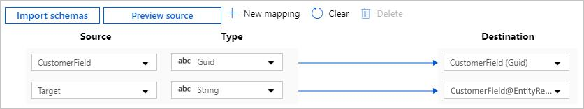
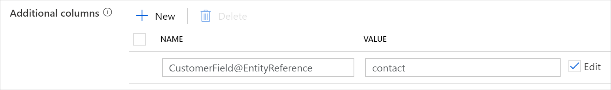

# Copy data from and to Dynamics 365 (Common Data Service) or Dynamics CRM by using Azure Data Factory
[!INCLUDE[appliesto-adf-asa-md](includes/appliesto-adf-asa-md.md)]

This article outlines how to use Copy Activity in Azure Data Factory to copy data from and to Microsoft Dynamics 365 or Microsoft Dynamics CRM. It builds on the [Copy Activity overview](copy-activity-overview.md) article that presents a general overview of Copy Activity.

## Supported capabilities

This connector is supported for the following activities:

- [Copy activity](copy-activity-overview.md) with [supported source/sink matrix](copy-activity-overview.md)
- [Lookup activity](control-flow-lookup-activity.md)

You can copy data from Dynamics 365 (Common Data Service) or Dynamics CRM to any supported sink data store. You also can copy data from any supported source data store to Dynamics 365 (Common Data Service) or Dynamics CRM. For a list of data stores supported as sources or sinks by the copy activity, see the [Supported data stores](copy-activity-overview.md#supported-data-stores-and-formats) table.

This Dynamics connector supports Dynamics version 7.x to 9.x for both online or on-premises. More specifically,

- Version 7.x maps to Dynamics CRM 2015
- Version 8.x maps to Dynamics CRM 2016 and the early version of Dynamics 365
- Version 9.x maps to the later version of Dynamics 365

Refer to the following table on the supported authentication types and configurations for respective Dynamics versions/products. (IFD is short for internet-facing deployment.)

| Dynamics versions | Authentication types | Linked service samples |
|:--- |:--- |:--- |
| Common Data Service <br> Dynamics 365 online <br> Dynamics CRM Online | AAD service principal <br> Office365 | [Dynamics online + AAD service principal or Office365 auth](#dynamics-365-and-dynamics-crm-online) |
| Dynamics 365 on-premises with IFD <br> Dynamics CRM 2016 on-premises with IFD <br> Dynamics CRM 2015 on-premises with IFD | IFD | [Dynamics on-premises with IFD + IFD auth](#dynamics-365-and-dynamics-crm-on-premises-with-ifd) |

For Dynamics 365 specifically, the following application types are supported:

- Dynamics 365 for Sales
- Dynamics 365 for Customer Service
- Dynamics 365 for Field Service
- Dynamics 365 for Project Service Automation
- Dynamics 365 for Marketing

Other application types e.g. Finance and Operations, Talent, etc. are not supported by this connector.

This Dynamics connector is built on top of [Dynamics XRM tooling](https://docs.microsoft.com/dynamics365/customer-engagement/developer/build-windows-client-applications-xrm-tools).

>[!TIP]
>To copy data from **Dynamics 365 Finance and Operations**, you can use the [Dynamics AX connector](connector-dynamics-ax.md).

## Prerequisites

To use this connector with AAD service principal authentication, you need to set up Server-to-Server (S2S) authentication in Common Data Service or Dynamics. Refer to [this article](https://docs.microsoft.com/powerapps/developer/common-data-service/build-web-applications-server-server-s2s-authentication) on detailed steps.

## Get started

[!INCLUDE [data-factory-v2-connector-get-started](../../includes/data-factory-v2-connector-get-started.md)]

The following sections provide details about properties that are used to define Data Factory entities specific to Dynamics.

## Linked service properties

The following properties are supported for the Dynamics linked service.

### Dynamics 365 and Dynamics CRM Online

| Property | Description | Required |
|:--- |:--- |:--- |
| type | The type property must be set to **Dynamics**, **DynamicsCrm**, or **CommonDataServiceForApps**. | Yes |
| deploymentType | The deployment type of the Dynamics instance. It must be **"Online"** for Dynamics online. | Yes |
| serviceUri | The service URL of your Dynamics instance, e.g. `https://adfdynamics.crm.dynamics.com`. | Yes |
| authenticationType | The authentication type to connect to a Dynamics server. Allowed values are: **AADServicePrincipal** or **"Office365"**. | Yes |
| servicePrincipalId | Specify the Azure Active Directory application's client ID. | Yes when using `AADServicePrincipal` authentication |
| servicePrincipalCredentialType | Specify the credential type to use for service principal authentication. Allowed values are: **ServicePrincipalKey** or **ServicePrincipalCert**. | Yes when using `AADServicePrincipal` authentication |
| servicePrincipalCredential | Specify the service principal credential. <br>When using `ServicePrincipalKey` as credential type, `servicePrincipalCredential` can be a string (ADF will encrypt it upon linked service deployment) or a reference to a secret in AKV. <br>When using `ServicePrincipalCert` as credential, `servicePrincipalCredential` should be a reference to a certificate in AKV. | Yes when using `AADServicePrincipal` authentication |
| username | Specify the user name to connect to Dynamics. | Yes when using `Office365` authentication |
| password | Specify the password for the user account you specified for username. Mark this field as a SecureString to store it securely in Data Factory, or [reference a secret stored in Azure Key Vault](store-credentials-in-key-vault.md). | Yes when using `Office365` authentication |
| connectVia | The [integration runtime](concepts-integration-runtime.md) to be used to connect to the data store. If not specified, it uses the default Azure Integration Runtime. | No for source, Yes for sink if the source linked service doesn't have an integration runtime |

>[!NOTE]
>The Dynamics connector used to use optional "organizationName" property to identify your Dynamics CRM/365 Online instance. While it keeps working, you are suggested to specify the new "serviceUri" property instead to gain better performance for instance discovery.

**Example: Dynamics online using AAD service principal + key authentication**

```json
{  
    "name": "DynamicsLinkedService",  
    "properties": {  
        "type": "Dynamics",  
        "typeProperties": {  
            "deploymentType": "Online",  
            "serviceUri": "https://adfdynamics.crm.dynamics.com",  
            "authenticationType": "AADServicePrincipal",  
            "servicePrincipalId": "<service principal id>",  
            "servicePrincipalCredentialType": "ServicePrincipalKey",  
            "servicePrincipalCredential": "<service principal key>"
        },  
        "connectVia": {  
            "referenceName": "<name of Integration Runtime>",  
            "type": "IntegrationRuntimeReference"  
        }  
    }  
}  
```
**Example: Dynamics online using AAD service principal + certificate authentication**

```json
{ 
    "name": "DynamicsLinkedService", 
    "properties": { 
        "type": "Dynamics", 
        "typeProperties": { 
            "deploymentType": "Online", 
            "serviceUri": "https://adfdynamics.crm.dynamics.com", 
            "authenticationType": "AADServicePrincipal", 
            "servicePrincipalId": "<service principal id>", 
            "servicePrincipalCredentialType": "ServicePrincipalCert", 
            "servicePrincipalCredential": { 
                "type": "AzureKeyVaultSecret", 
                "store": { 
                    "referenceName": "<AKV reference>", 
                    "type": "LinkedServiceReference" 
                }, 
                "secretName": "<certificate name in AKV>" 
            } 
        }, 
        "connectVia": { 
            "referenceName": "<name of Integration Runtime>", 
            "type": "IntegrationRuntimeReference" 
        } 
    } 
} 
```

**Example: Dynamics online using Office365 authentication**

```json
{
    "name": "DynamicsLinkedService",
    "properties": {
        "type": "Dynamics",
        "typeProperties": {
            "deploymentType": "Online",
            "serviceUri": "https://adfdynamics.crm.dynamics.com",
            "authenticationType": "Office365",
            "username": "test@contoso.onmicrosoft.com",
            "password": {
                "type": "SecureString",
                "value": "<password>"
            }
        },
        "connectVia": {
            "referenceName": "<name of Integration Runtime>",
            "type": "IntegrationRuntimeReference"
        }
    }
}
```

### Dynamics 365 and Dynamics CRM on-premises with IFD

*Additional properties that compare to Dynamics online are "hostName" and "port".*

| Property | Description | Required |
|:--- |:--- |:--- |
| type | The type property must be set to **Dynamics**, **DynamicsCrm**, or **CommonDataServiceForApps**. | Yes |
| deploymentType | The deployment type of the Dynamics instance. It must be **"OnPremisesWithIfd"** for Dynamics on-premises with IFD.| Yes |
| hostName | The host name of the on-premises Dynamics server. | Yes |
| port | The port of the on-premises Dynamics server. | No, default is 443 |
| organizationName | The organization name of the Dynamics instance. | Yes |
| authenticationType | The authentication type to connect to the Dynamics server. Specify **"Ifd"** for Dynamics on-premises with IFD. | Yes |
| username | Specify the user name to connect to Dynamics. | Yes |
| password | Specify the password for the user account you specified for username. You can choose to mark this field as a SecureString to store it securely in ADF, or store password in Azure Key Vault and let the copy activity pull from there when performing data copy - learn more from [Store credentials in Key Vault](store-credentials-in-key-vault.md). | Yes |
| connectVia | The [integration runtime](concepts-integration-runtime.md) to be used to connect to the data store. If not specified, it uses the default Azure Integration Runtime. | No for source, Yes for sink |

**Example: Dynamics on-premises with IFD using IFD authentication**

```json
{
    "name": "DynamicsLinkedService",
    "properties": {
        "type": "Dynamics",
        "description": "Dynamics on-premises with IFD linked service using IFD authentication",
        "typeProperties": {
            "deploymentType": "OnPremisesWithIFD",
            "hostName": "contosodynamicsserver.contoso.com",
            "port": 443,
            "organizationName": "admsDynamicsTest",
            "authenticationType": "Ifd",
            "username": "test@contoso.onmicrosoft.com",
            "password": {
                "type": "SecureString",
                "value": "<password>"
            }
        },
        "connectVia": {
            "referenceName": "<name of Integration Runtime>",
            "type": "IntegrationRuntimeReference"
        }
    }
}
```

## Dataset properties

For a full list of sections and properties available for defining datasets, see the [Datasets](concepts-datasets-linked-services.md) article. This section provides a list of properties supported by Dynamics dataset.

To copy data from and to Dynamics, the following properties are supported.

| Property | Description | Required |
|:--- |:--- |:--- |
| type | The type property of the dataset must be set to **DynamicsEntity**, **DynamicsCrmEntity**, or **CommonDataServiceForAppsEntity**. |Yes |
| entityName | The logical name of the entity to retrieve. | No for source (if "query" in the activity source is specified), Yes for sink |

**Example:**

```json
{
    "name": "DynamicsDataset",
    "properties": {
        "type": "DynamicsEntity",
        "schema": [],
        "typeProperties": {
            "entityName": "account"
        },
        "linkedServiceName": {
            "referenceName": "<Dynamics linked service name>",
            "type": "linkedservicereference"
        }
    }
}
```

## Copy activity properties

For a full list of sections and properties available for defining activities, see the [Pipelines](concepts-pipelines-activities.md) article. This section provides a list of properties supported by Dynamics source and sink types.

### Dynamics as a source type

To copy data from Dynamics, the following properties are supported in the copy activity **source** section.

| Property | Description | Required |
|:--- |:--- |:--- |
| type | The type property of the copy activity source must be set to **DynamicsSource**, **DynamicsCrmSource**, or **CommonDataServiceForAppsSource**. | Yes |
| query | FetchXML is a proprietary query language that is used in Dynamics (online and on-premises). See the following example. To learn more, see [Build queries with FetchXML](https://msdn.microsoft.com/library/gg328332.aspx). | No (if "entityName" in the dataset is specified) |

>[!NOTE]
>The PK column will always be copied out even if the column projection you configure in the FetchXML query doesn't contain it.

> [!IMPORTANT]
>- When you copy data from Dynamics, explicit column mapping from Dynamics to sink is optional but highly recommanded to ensure a deterministic copy result.
>- When importing schema in authoring UI, ADF infers the schema by sampling the top rows from the Dynamics query result to initialize the source column list, in which case columns with no values in top rows will be omitted. The same behavior applies to copy executions if there is no explicit mapping. You can review and add more columns into the mapping, which will be honored during copy runtime.

**Example:**

```json
"activities":[
    {
        "name": "CopyFromDynamics",
        "type": "Copy",
        "inputs": [
            {
                "referenceName": "<Dynamics input dataset>",
                "type": "DatasetReference"
            }
        ],
        "outputs": [
            {
                "referenceName": "<output dataset>",
                "type": "DatasetReference"
            }
        ],
        "typeProperties": {
            "source": {
                "type": "DynamicsSource",
                "query": "<FetchXML Query>"
            },
            "sink": {
                "type": "<sink type>"
            }
        }
    }
]
```

### Sample FetchXML query

```xml
<fetch>
  <entity name="account">
    <attribute name="accountid" />
    <attribute name="name" />
    <attribute name="marketingonly" />
    <attribute name="modifiedon" />
    <order attribute="modifiedon" descending="false" />
    <filter type="and">
      <condition attribute ="modifiedon" operator="between">
        <value>2017-03-10 18:40:00z</value>
        <value>2017-03-12 20:40:00z</value>
      </condition>
    </filter>
  </entity>
</fetch>
```

### Dynamics as a sink type

To copy data to Dynamics, the following properties are supported in the copy activity **sink** section.

| Property | Description | Required |
|:--- |:--- |:--- |
| type | The type property of the copy activity sink must be set to **DynamicsSink**, **DynamicsCrmSink**, or **CommonDataServiceForAppsSink**. | Yes |
| writeBehavior | The write behavior of the operation.<br/>Allowed value is **"Upsert"**. | Yes |
| alternateKeyName | Specify the alternate key name defined on your entity to perform "Upsert". | No |
| writeBatchSize | The row count of data written to Dynamics in each batch. | No (default is 10) |
| ignoreNullValues | Indicates whether to ignore null values from input data (except key fields) during a write operation.<br/>Allowed values are **true** and **false**.<br>- **True**: Leave the data in the destination object unchanged when you do an upsert/update operation. Insert a defined default value when you do an insert operation.<br/>- **False**: Update the data in the destination object to NULL when you do an upsert/update operation. Insert a NULL value when you do an insert operation. | No (default is false) |

>[!NOTE]
>The default value of the sink "**writeBatchSize**" and the copy activity "**[parallelCopies](copy-activity-performance-features.md#parallel-copy)**" for the Dynamics sink are both 10. Therefore, 100 records are submitted to Dynamics concurrently.

For Dynamics 365 online, there is a limit of [2 concurrent batch calls per organization](https://msdn.microsoft.com/library/jj863631.aspx#Run-time%20limitations). If that limit is exceeded, a "Server Busy" fault is thrown before the first request is ever executed. Keeping "writeBatchSize" less or equal to 10 would avoid such throttling of concurrent calls.

The optimal combination of "**writeBatchSize**" and "**parallelCopies**" depends on the schema of your entity e.g. number of columns, row size, number of plugins/workflows/workflow activities hooked up to those calls, etc. The default setting of 10 writeBatchSize * 10 parallelCopies is the recommendation according to Dynamics service, which would work for most Dynamics entities though may not be best performance. You can tune the performance by adjusting the combination in your copy activity settings.

**Example:**

```json
"activities":[
    {
        "name": "CopyToDynamics",
        "type": "Copy",
        "inputs": [
            {
                "referenceName": "<input dataset>",
                "type": "DatasetReference"
            }
        ],
        "outputs": [
            {
                "referenceName": "<Dynamics output dataset>",
                "type": "DatasetReference"
            }
        ],
        "typeProperties": {
            "source": {
                "type": "<source type>"
            },
            "sink": {
                "type": "DynamicsSink",
                "writeBehavior": "Upsert",
                "writeBatchSize": 10,
                "ignoreNullValues": true
            }
        }
    }
]
```

## Data type mapping for Dynamics

When you copy data from Dynamics, the following mappings are used from Dynamics data types to Data Factory interim data types. To learn how the copy activity maps the source schema and data type to the sink, see [Schema and data type mappings](copy-activity-schema-and-type-mapping.md).

Configure the corresponding Data Factory data type in a dataset structure based on your source Dynamics data type by using the following mapping table.

| Dynamics data type | Data Factory interim data type | Supported as source | Supported as sink |
|:--- |:--- |:--- |:--- |
| AttributeTypeCode.BigInt | Long | ✓ | ✓ |
| AttributeTypeCode.Boolean | Boolean | ✓ | ✓ |
| AttributeType.Customer | GUID | ✓ | ✓ (see [guidance](#writing-data-to-lookup-field)) |
| AttributeType.DateTime | Datetime | ✓ | ✓ |
| AttributeType.Decimal | Decimal | ✓ | ✓ |
| AttributeType.Double | Double | ✓ | ✓ |
| AttributeType.EntityName | String | ✓ | ✓ |
| AttributeType.Integer | Int32 | ✓ | ✓ |
| AttributeType.Lookup | GUID | ✓ | ✓ (see [guidance](#writing-data-to-lookup-field)) |
| AttributeType.ManagedProperty | Boolean | ✓ | |
| AttributeType.Memo | String | ✓ | ✓ |
| AttributeType.Money | Decimal | ✓ | ✓ |
| AttributeType.Owner | GUID | ✓ | ✓ (see [guidance](#writing-data-to-lookup-field)) |
| AttributeType.Picklist | Int32 | ✓ | ✓ |
| AttributeType.Uniqueidentifier | GUID | ✓ | ✓ |
| AttributeType.String | String | ✓ | ✓ |
| AttributeType.State | Int32 | ✓ | ✓ |
| AttributeType.Status | Int32 | ✓ | ✓ |

> [!NOTE]
> The Dynamics data types AttributeType.CalendarRules, AttributeType.MultiSelectPicklist and AttributeType.PartyList aren't supported.

## Writing data to lookup field

To write data into lookup field with multiple targets, e.g. *Customer* and *Owner*, follow this guidance and example:

1. Make your source containing both the field value and the corresponding target entity name.
   - If all the records map to the same target entity, make sure either your source data has a column which stores the target entity name, or to add an additional column in copy activity source to define the target entity.
   - If different records map to different target entity, make sure your source data has a column which stores the corresponding target entity name.

2. Map both the value and entity reference columns from source to sink. The entity reference column need to be mapped to a virtual column with a special naming pattern`{lookup_field_name}@EntityReference`. It does not actually exist in Dynamics, but it's used to indicate this is the metadata column of the given multi-target lookup field.

 For example, the source has two columns:

- `CustomerField` column of type *GUID*, which is the primary key value of the target entity in Dynamics.
- `Target` column of type *String*, which is the logical name of the target entity. 

And you want to copy such data to sink Dynamics entity field `CustomerField` of type *Customer*. 

In copy activity column mapping, map the two columns as follows:

- `CustomerField` -> `CustomerField`: this is the normal field mapping.
- `Target` -> `CustomerField@EntityReference`: the sink column is a virtual column representing the entity reference. Input such field name in mapping, as it won't show up by importing schemas.



If all of your source records map to the same target entity and your source data doesn't contains the target entity name, here is a shortcut: in copy activity source, add an additional column as follows. You can name it following the pattern `{lookup_field_name}@EntityReference` and value as the target entity name, then proceed with column mapping as normal. If your source and sink column names are identical, you can also skip explicit column mapping because copy activity by default maps columns by name.



## Lookup activity properties

To learn details about the properties, check [Lookup activity](control-flow-lookup-activity.md).

## Next steps
For a list of data stores supported as sources and sinks by the copy activity in Data Factory, see [Supported data stores](copy-activity-overview.md#supported-data-stores-and-formats).
