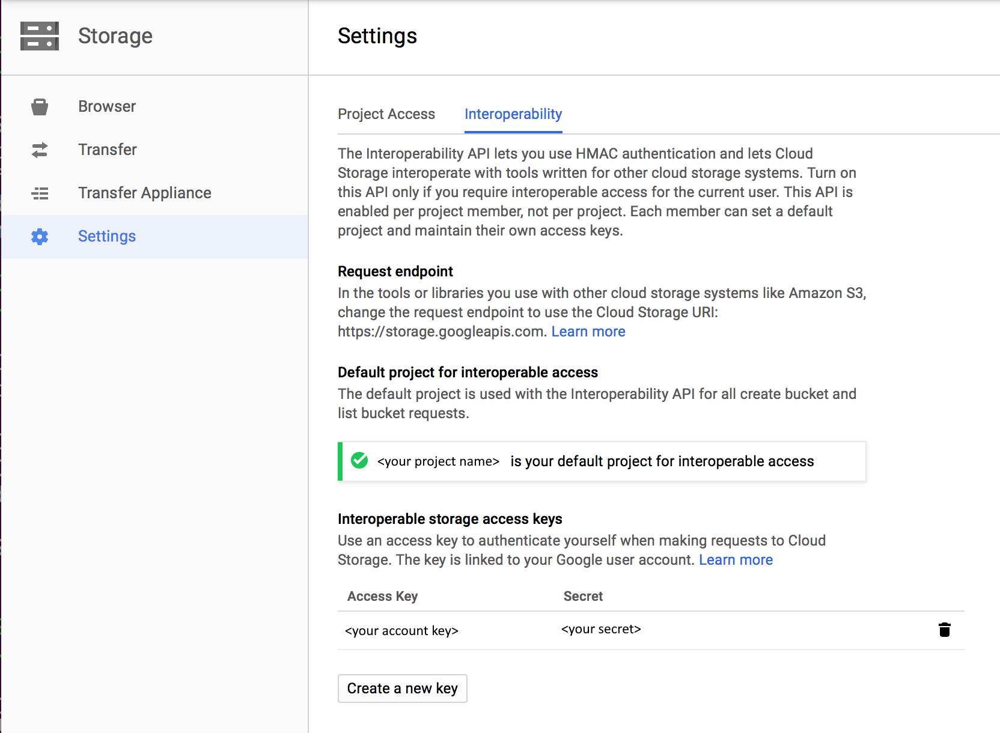

# Copy data from Google Cloud Storage by using Azure Data Factory
[!INCLUDE[appliesto-adf-asa-md](includes/appliesto-adf-asa-md.md)]

This article outlines how to copy data from Google Cloud Storage (GCS). To learn about Azure Data Factory, read the [introductory article](introduction.md).

## Supported capabilities

This Google Cloud Storage connector is supported for the following activities:

- [Copy activity](copy-activity-overview.md) with [supported source/sink matrix](copy-activity-overview.md)
- [Lookup activity](control-flow-lookup-activity.md)
- [GetMetadata activity](control-flow-get-metadata-activity.md)
- [Delete activity](delete-activity.md)

Specifically, this Google Cloud Storage connector supports copying files as is or parsing files with the [supported file formats and compression codecs](supported-file-formats-and-compression-codecs.md). It takes advantage of GCS's S3-compatible interoperability.

## Prerequisites

The following setup is required on your Google Cloud Storage account:

1. Enable interoperability for your Google Cloud Storage account
2. Set the default project that contains the data you want to copy from the target GCS bucket.
3. Create a service account and define the right levels of permissions by using Cloud IAM on GCP. 
4. Generate the access keys for this service account.



## Required permissions

To copy data from Google Cloud Storage, make sure you have granted the needed permissions. The permissions defined in the service account might contain `storage.buckets.get`, `storage.buckets.list`, or `storage.objects.get` for object operations.

## Getting started

[!INCLUDE [data-factory-v2-connector-get-started](../../includes/data-factory-v2-connector-get-started.md)] 

The following sections provide details about properties that are used to define Data Factory entities specific to Google Cloud Storage.

## Linked service properties

The following properties are supported for Google Cloud Storage linked services:

| Property | Description | Required |
|:--- |:--- |:--- |
| type | The **type** property must be set to **GoogleCloudStorage**. | Yes |
| accessKeyId | ID of the secret access key. To find the access key and secret, see [Prerequisites](#prerequisites). |Yes |
| secretAccessKey | The secret access key itself. Mark this field as **SecureString** to store it securely in Data Factory, or [reference a secret stored in Azure Key Vault](store-credentials-in-key-vault.md). |Yes |
| serviceUrl | Specify the custom GCS endpoint as `https://storage.googleapis.com`. | Yes |
| connectVia | The [integration runtime](concepts-integration-runtime.md) to be used to connect to the data store. You can use the Azure integration runtime or the self-hosted integration runtime (if your data store is in a private network). If this property isn't specified, the service uses the default Azure integration runtime. |No |

Here's an example:

```json
{
    "name": "GoogleCloudStorageLinkedService",
    "properties": {
        "type": "GoogleCloudStorage",
        "typeProperties": {
            "accessKeyId": "<access key id>",
            "secretAccessKey": {
                "type": "SecureString",
                "value": "<secret access key>"
            },
            "serviceUrl": "https://storage.googleapis.com"
        },
        "connectVia": {
            "referenceName": "<name of Integration Runtime>",
            "type": "IntegrationRuntimeReference"
        }
    }
}
```

## Dataset properties

[!INCLUDE [data-factory-v2-file-formats](../../includes/data-factory-v2-file-formats.md)] 

The following properties are supported for Google Cloud Storage under `location` settings in a format-based dataset:

| Property   | Description                                                  | Required |
| ---------- | ------------------------------------------------------------ | -------- |
| type       | The **type** property under `location` in the dataset must be set to **GoogleCloudStorageLocation**. | Yes      |
| bucketName | The GCS bucket name.                                          | Yes      |
| folderPath | The path to folder under the given bucket. If you want to use a wildcard to filter the folder, skip this setting and specify that in activity source settings. | No       |
| fileName   | The file name under the given bucket and folder path. If you want to use a wildcard to filter the files, skip this setting and specify that in activity source settings. | No       |

**Example:**

```json
{
    "name": "DelimitedTextDataset",
    "properties": {
        "type": "DelimitedText",
        "linkedServiceName": {
            "referenceName": "<Google Cloud Storage linked service name>",
            "type": "LinkedServiceReference"
        },
        "schema": [ < physical schema, optional, auto retrieved during authoring > ],
        "typeProperties": {
            "location": {
                "type": "GoogleCloudStorageLocation",
                "bucketName": "bucketname",
                "folderPath": "folder/subfolder"
            },
            "columnDelimiter": ",",
            "quoteChar": "\"",
            "firstRowAsHeader": true,
            "compressionCodec": "gzip"
        }
    }
}
```

## Copy activity properties

For a full list of sections and properties available for defining activities, see the [Pipelines](concepts-pipelines-activities.md) article. This section provides a list of properties that the Google Cloud Storage source supports.

### Google Cloud Storage as a source type

[!INCLUDE [data-factory-v2-file-formats](../../includes/data-factory-v2-file-formats.md)] 

The following properties are supported for Google Cloud Storage under `storeSettings` settings in a format-based copy source:

| Property                 | Description                                                  | Required                                                    |
| ------------------------ | ------------------------------------------------------------ | ----------------------------------------------------------- |
| type                     | The **type** property under `storeSettings` must be set to **GoogleCloudStorageReadSettings**. | Yes                                                         |
| ***Locate the files to copy:*** |  |  |
| OPTION 1: static path<br> | Copy from the given bucket or folder/file path specified in the dataset. If you want to copy all files from a bucket or folder, additionally specify `wildcardFileName` as `*`. |  |
| OPTION 2: GCS prefix<br>- prefix | Prefix for the GCS key name under the given bucket configured in the dataset to filter source GCS files. GCS keys whose names start with `bucket_in_dataset/this_prefix` are selected. It utilizes GCS's service-side filter, which provides better performance than a wildcard filter. | No |
| OPTION 3: wildcard<br>- wildcardFolderPath | The folder path with wildcard characters under the given bucket configured in a dataset to filter source folders. <br>Allowed wildcards are: `*` (matches zero or more characters) and `?` (matches zero or single character). Use `^` to escape if your folder name has a wildcard or this escape character inside. <br>See more examples in [Folder and file filter examples](#folder-and-file-filter-examples). | No                                            |
| OPTION 3: wildcard<br>- wildcardFileName | The file name with wildcard characters under the given bucket and folder path (or wildcard folder path) to filter source files. <br>Allowed wildcards are: `*` (matches zero or more characters) and `?` (matches zero or single character). Use `^` to escape if your folder name has a wildcard or this escape character inside.  See more examples in [Folder and file filter examples](#folder-and-file-filter-examples). | Yes |
| OPTION 3: a list of files<br>- fileListPath | Indicates to copy a given file set. Point to a text file that includes a list of files you want to copy, one file per line, which is the relative path to the path configured in the dataset.<br/>When you're using this option, do not specify the file name in the dataset. See more examples in [File list examples](#file-list-examples). |No |
| ***Additional settings:*** |  | |
| recursive | Indicates whether the data is read recursively from the subfolders or only from the specified folder. Note that when **recursive** is set to **true** and the sink is a file-based store, an empty folder or subfolder isn't copied or created at the sink. <br>Allowed values are **true** (default) and **false**.<br>This property doesn't apply when you configure `fileListPath`. |No |
| deleteFilesAfterCompletion | Indicates whether the binary files will be deleted from source store after successfully moving to the destination store. The file deletion is per file, so when copy activity fails, you will see some files have already been copied to the destination and deleted from source, while others are still remaining on source store. <br/>This property is only valid in binary copy scenario, where data source stores are Blob, ADLS Gen1, ADLS Gen2, S3, Google Cloud Storage, File, Azure File, SFTP, or FTP. The default value: false. |No |
| modifiedDatetimeStart    | Files are filtered based on the attribute: last modified. <br>The files will be selected if their last modified time is within the time range between `modifiedDatetimeStart` and `modifiedDatetimeEnd`. The time is applied to the UTC time zone in the format of "2018-12-01T05:00:00Z". <br> The properties can be **NULL**, which means no file attribute filter will be applied to the dataset.  When `modifiedDatetimeStart` has a datetime value but `modifiedDatetimeEnd` is **NULL**, the files whose last modified attribute is greater than or equal to the datetime value will be selected.  When `modifiedDatetimeEnd` has a datetime value but `modifiedDatetimeStart` is **NULL**, the files whose last modified attribute is less than the datetime value will be selected.<br/>This property doesn't apply when you configure `fileListPath`. | No                                            |
| modifiedDatetimeEnd      | Same as above.                                               | No                                                          |
| maxConcurrentConnections | The number of the concurrent connections to storage. Specify only when you want to limit concurrent connections to the data store. | No                                                          |

**Example:**

```json
"activities":[
    {
        "name": "CopyFromGoogleCloudStorage",
        "type": "Copy",
        "inputs": [
            {
                "referenceName": "<Delimited text input dataset name>",
                "type": "DatasetReference"
            }
        ],
        "outputs": [
            {
                "referenceName": "<output dataset name>",
                "type": "DatasetReference"
            }
        ],
        "typeProperties": {
            "source": {
                "type": "DelimitedTextSource",
                "formatSettings":{
                    "type": "DelimitedTextReadSettings",
                    "skipLineCount": 10
                },
                "storeSettings":{
                    "type": "GoogleCloudStorageReadSettings",
                    "recursive": true,
                    "wildcardFolderPath": "myfolder*A",
                    "wildcardFileName": "*.csv"
                }
            },
            "sink": {
                "type": "<sink type>"
            }
        }
    }
]
```

### Folder and file filter examples

This section describes the resulting behavior of the folder path and file name with wildcard filters.

| bucket | key | recursive | Source folder structure and filter result (files in bold are retrieved)|
|:--- |:--- |:--- |:--- |
| bucket | `Folder*/*` | false | bucket<br/>&nbsp;&nbsp;&nbsp;&nbsp;FolderA<br/>&nbsp;&nbsp;&nbsp;&nbsp;&nbsp;&nbsp;&nbsp;&nbsp;**File1.csv**<br/>&nbsp;&nbsp;&nbsp;&nbsp;&nbsp;&nbsp;&nbsp;&nbsp;**File2.json**<br/>&nbsp;&nbsp;&nbsp;&nbsp;&nbsp;&nbsp;&nbsp;&nbsp;Subfolder1<br/>&nbsp;&nbsp;&nbsp;&nbsp;&nbsp;&nbsp;&nbsp;&nbsp;&nbsp;&nbsp;&nbsp;&nbsp;File3.csv<br/>&nbsp;&nbsp;&nbsp;&nbsp;&nbsp;&nbsp;&nbsp;&nbsp;&nbsp;&nbsp;&nbsp;&nbsp;File4.json<br/>&nbsp;&nbsp;&nbsp;&nbsp;&nbsp;&nbsp;&nbsp;&nbsp;&nbsp;&nbsp;&nbsp;&nbsp;File5.csv<br/>&nbsp;&nbsp;&nbsp;&nbsp;AnotherFolderB<br/>&nbsp;&nbsp;&nbsp;&nbsp;&nbsp;&nbsp;&nbsp;&nbsp;File6.csv |
| bucket | `Folder*/*` | true | bucket<br/>&nbsp;&nbsp;&nbsp;&nbsp;FolderA<br/>&nbsp;&nbsp;&nbsp;&nbsp;&nbsp;&nbsp;&nbsp;&nbsp;**File1.csv**<br/>&nbsp;&nbsp;&nbsp;&nbsp;&nbsp;&nbsp;&nbsp;&nbsp;**File2.json**<br/>&nbsp;&nbsp;&nbsp;&nbsp;&nbsp;&nbsp;&nbsp;&nbsp;Subfolder1<br/>&nbsp;&nbsp;&nbsp;&nbsp;&nbsp;&nbsp;&nbsp;&nbsp;&nbsp;&nbsp;&nbsp;&nbsp;**File3.csv**<br/>&nbsp;&nbsp;&nbsp;&nbsp;&nbsp;&nbsp;&nbsp;&nbsp;&nbsp;&nbsp;&nbsp;&nbsp;**File4.json**<br/>&nbsp;&nbsp;&nbsp;&nbsp;&nbsp;&nbsp;&nbsp;&nbsp;&nbsp;&nbsp;&nbsp;&nbsp;**File5.csv**<br/>&nbsp;&nbsp;&nbsp;&nbsp;AnotherFolderB<br/>&nbsp;&nbsp;&nbsp;&nbsp;&nbsp;&nbsp;&nbsp;&nbsp;File6.csv |
| bucket | `Folder*/*.csv` | false | bucket<br/>&nbsp;&nbsp;&nbsp;&nbsp;FolderA<br/>&nbsp;&nbsp;&nbsp;&nbsp;&nbsp;&nbsp;&nbsp;&nbsp;**File1.csv**<br/>&nbsp;&nbsp;&nbsp;&nbsp;&nbsp;&nbsp;&nbsp;&nbsp;File2.json<br/>&nbsp;&nbsp;&nbsp;&nbsp;&nbsp;&nbsp;&nbsp;&nbsp;Subfolder1<br/>&nbsp;&nbsp;&nbsp;&nbsp;&nbsp;&nbsp;&nbsp;&nbsp;&nbsp;&nbsp;&nbsp;&nbsp;File3.csv<br/>&nbsp;&nbsp;&nbsp;&nbsp;&nbsp;&nbsp;&nbsp;&nbsp;&nbsp;&nbsp;&nbsp;&nbsp;File4.json<br/>&nbsp;&nbsp;&nbsp;&nbsp;&nbsp;&nbsp;&nbsp;&nbsp;&nbsp;&nbsp;&nbsp;&nbsp;File5.csv<br/>&nbsp;&nbsp;&nbsp;&nbsp;AnotherFolderB<br/>&nbsp;&nbsp;&nbsp;&nbsp;&nbsp;&nbsp;&nbsp;&nbsp;File6.csv |
| bucket | `Folder*/*.csv` | true | bucket<br/>&nbsp;&nbsp;&nbsp;&nbsp;FolderA<br/>&nbsp;&nbsp;&nbsp;&nbsp;&nbsp;&nbsp;&nbsp;&nbsp;**File1.csv**<br/>&nbsp;&nbsp;&nbsp;&nbsp;&nbsp;&nbsp;&nbsp;&nbsp;File2.json<br/>&nbsp;&nbsp;&nbsp;&nbsp;&nbsp;&nbsp;&nbsp;&nbsp;Subfolder1<br/>&nbsp;&nbsp;&nbsp;&nbsp;&nbsp;&nbsp;&nbsp;&nbsp;&nbsp;&nbsp;&nbsp;&nbsp;**File3.csv**<br/>&nbsp;&nbsp;&nbsp;&nbsp;&nbsp;&nbsp;&nbsp;&nbsp;&nbsp;&nbsp;&nbsp;&nbsp;File4.json<br/>&nbsp;&nbsp;&nbsp;&nbsp;&nbsp;&nbsp;&nbsp;&nbsp;&nbsp;&nbsp;&nbsp;&nbsp;**File5.csv**<br/>&nbsp;&nbsp;&nbsp;&nbsp;AnotherFolderB<br/>&nbsp;&nbsp;&nbsp;&nbsp;&nbsp;&nbsp;&nbsp;&nbsp;File6.csv |

### File list examples

This section describes the resulting behavior of using a file list path in the Copy activity source.

Assume that you have the following source folder structure and want to copy the files in bold:

| Sample source structure                                      | Content in FileListToCopy.txt                             | Data Factory configuration                                            |
| ------------------------------------------------------------ | --------------------------------------------------------- | ------------------------------------------------------------ |
| bucket<br/>&nbsp;&nbsp;&nbsp;&nbsp;FolderA<br/>&nbsp;&nbsp;&nbsp;&nbsp;&nbsp;&nbsp;&nbsp;&nbsp;**File1.csv**<br/>&nbsp;&nbsp;&nbsp;&nbsp;&nbsp;&nbsp;&nbsp;&nbsp;File2.json<br/>&nbsp;&nbsp;&nbsp;&nbsp;&nbsp;&nbsp;&nbsp;&nbsp;Subfolder1<br/>&nbsp;&nbsp;&nbsp;&nbsp;&nbsp;&nbsp;&nbsp;&nbsp;&nbsp;&nbsp;&nbsp;&nbsp;**File3.csv**<br/>&nbsp;&nbsp;&nbsp;&nbsp;&nbsp;&nbsp;&nbsp;&nbsp;&nbsp;&nbsp;&nbsp;&nbsp;File4.json<br/>&nbsp;&nbsp;&nbsp;&nbsp;&nbsp;&nbsp;&nbsp;&nbsp;&nbsp;&nbsp;&nbsp;&nbsp;**File5.csv**<br/>&nbsp;&nbsp;&nbsp;&nbsp;Metadata<br/>&nbsp;&nbsp;&nbsp;&nbsp;&nbsp;&nbsp;&nbsp;&nbsp;FileListToCopy.txt | File1.csv<br>Subfolder1/File3.csv<br>Subfolder1/File5.csv | **In dataset:**<br>- Bucket: `bucket`<br>- Folder path: `FolderA`<br><br>**In copy activity source:**<br>- File list path: `bucket/Metadata/FileListToCopy.txt` <br><br>The file list path points to a text file in the same data store that includes a list of files you want to copy, one file per line, with the relative path to the path configured in the dataset. |

## Lookup activity properties

To learn details about the properties, check [Lookup activity](control-flow-lookup-activity.md).

## GetMetadata activity properties

To learn details about the properties, check [GetMetadata activity](control-flow-get-metadata-activity.md). 

## Delete activity properties

To learn details about the properties, check [Delete activity](delete-activity.md).

## Legacy models

If you were using an Amazon S3 connector to copy data from Google Cloud Storage, it's still supported as is for backward compatibility. We suggest that you use the new model mentioned earlier, until the Data Factory authoring UI has switched to generating the new model.

## Next steps
For a list of data stores that the Copy activity in Azure Data Factory supports as sources and sinks, see [Supported data stores](copy-activity-overview.md#supported-data-stores-and-formats).
