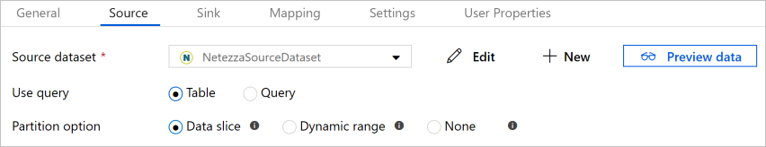

# Copy data from Netezza by using Azure Data Factory
[!INCLUDE[appliesto-adf-asa-md](includes/appliesto-adf-asa-md.md)]

This article outlines how to use Copy Activity in Azure Data Factory to copy data from Netezza. The article builds on [Copy Activity in Azure Data Factory](copy-activity-overview.md), which presents a general overview of Copy Activity.

>[!TIP]
>For data migration scenario from Netezza to Azure, learn more from [Use Azure Data Factory to migrate data from on-premises Netezza server to Azure](data-migration-guidance-netezza-azure-sqldw.md).

## Supported capabilities

This Netezza connector is supported for the following activities:

- [Copy activity](copy-activity-overview.md) with [supported source/sink matrix](copy-activity-overview.md)
- [Lookup activity](control-flow-lookup-activity.md)


You can copy data from Netezza to any supported sink data store. For a list of data stores that Copy Activity supports as sources and sinks, see [Supported data stores and formats](copy-activity-overview.md#supported-data-stores-and-formats).

Netezza connector supports parallel copying from source. See the [Parallel copy from Netezza](#parallel-copy-from-netezza) section for details.

Azure Data Factory provides a built-in driver to enable connectivity. You don't need to manually install any driver to use this connector.

## Prerequisites

[!INCLUDE [data-factory-v2-integration-runtime-requirements](../../includes/data-factory-v2-integration-runtime-requirements.md)]

## Get started

You can create a pipeline that uses a copy activity by using the .NET SDK, the Python SDK, Azure PowerShell, the REST API, or an Azure Resource Manager template. See the [Copy Activity tutorial](quickstart-create-data-factory-dot-net.md) for step-by-step instructions on how to create a pipeline that has a copy activity.

The following sections provide details about properties you can use to define Data Factory entities that are specific to the Netezza connector.

## Linked service properties

The following properties are supported for the Netezza linked service:

| Property | Description | Required |
|:--- |:--- |:--- |
| type | The **type** property must be set to **Netezza**. | Yes |
| connectionString | An ODBC connection string to connect to Netezza. <br/>You can also put password in Azure Key Vault and pull the `pwd` configuration out of the connection string. Refer to the following samples and [Store credentials in Azure Key Vault](store-credentials-in-key-vault.md) article with more details. | Yes |
| connectVia | The [Integration Runtime](concepts-integration-runtime.md) to use to connect to the data store. Learn more from [Prerequisites](#prerequisites) section. If not specified, the default Azure Integration Runtime is used. |No |

A typical connection string is `Server=<server>;Port=<port>;Database=<database>;UID=<user name>;PWD=<password>`. The following table describes more properties that you can set:

| Property | Description | Required |
|:--- |:--- |:--- |
| SecurityLevel | The level of security that the driver uses for the connection to the data store. The driver supports SSL connections with one-way authentication using SSL version 3. <br>Example: `SecurityLevel=preferredSecured`. Supported values are:<br/>- **Only unsecured** (**onlyUnSecured**): The driver doesn't use SSL.<br/>- **Preferred unsecured (preferredUnSecured) (default)**: If the server provides a choice, the driver doesn't use SSL. <br/>- **Preferred secured (preferredSecured)**: If the server provides a choice, the driver uses SSL. <br/>- **Only secured (onlySecured)**: The driver doesn't connect unless an SSL connection is available. | No |
| CaCertFile | The full path to the SSL certificate that's used by the server. Example: `CaCertFile=<cert path>;`| Yes, if SSL is enabled |

**Example**

```json
{
    "name": "NetezzaLinkedService",
    "properties": {
        "type": "Netezza",
        "typeProperties": {
            "connectionString": "Server=<server>;Port=<port>;Database=<database>;UID=<user name>;PWD=<password>"
        },
        "connectVia": {
            "referenceName": "<name of Integration Runtime>",
            "type": "IntegrationRuntimeReference"
        }
    }
}
```

**Example: store password in Azure Key Vault**

```json
{
    "name": "NetezzaLinkedService",
    "properties": {
        "type": "Netezza",
        "typeProperties": {
            "connectionString": "Server=<server>;Port=<port>;Database=<database>;UID=<user name>;",
            "pwd": { 
                "type": "AzureKeyVaultSecret", 
                "store": { 
                    "referenceName": "<Azure Key Vault linked service name>", 
                    "type": "LinkedServiceReference" 
                }, 
                "secretName": "<secretName>" 
            }
        },
        "connectVia": {
            "referenceName": "<name of Integration Runtime>",
            "type": "IntegrationRuntimeReference"
        }
    }
}
```

## Dataset properties

This section provides a list of properties that the Netezza dataset supports.

For a full list of sections and properties that are available for defining datasets, see [Datasets](concepts-datasets-linked-services.md).

To copy data from Netezza, set the **type** property of the dataset to **NetezzaTable**. The following properties are supported:

| Property | Description | Required |
|:--- |:--- |:--- |
| type | The type property of the dataset must be set to: **NetezzaTable** | Yes |
| schema | Name of the schema. |No (if "query" in activity source is specified)  |
| table | Name of the table. |No (if "query" in activity source is specified)  |
| tableName | Name of the table with schema. This property is supported for backward compatibility. Use `schema` and `table` for new workload. | No (if "query" in activity source is specified) |

**Example**

```json
{
    "name": "NetezzaDataset",
    "properties": {
        "type": "NetezzaTable",
        "linkedServiceName": {
            "referenceName": "<Netezza linked service name>",
            "type": "LinkedServiceReference"
        },
        "typeProperties": {}
    }
}
```

## Copy Activity properties

This section provides a list of properties that the Netezza source supports.

For a full list of sections and properties that are available for defining activities, see [Pipelines](concepts-pipelines-activities.md).

### Netezza as source

>[!TIP]
>To load data from Netezza efficiently by using data partitioning, learn more from [Parallel copy from Netezza](#parallel-copy-from-netezza) section.

To copy data from Netezza, set the **source** type in Copy Activity to **NetezzaSource**. The following properties are supported in the Copy Activity **source** section:

| Property | Description | Required |
|:--- |:--- |:--- |
| type | The **type** property of the Copy Activity source must be set to **NetezzaSource**. | Yes |
| query | Use the custom SQL query to read data. Example: `"SELECT * FROM MyTable"` | No (if "tableName" in dataset is specified) |
| partitionOptions | Specifies the data partitioning options used to load data from Netezza. <br>Allow values are: **None** (default), **DataSlice**, and **DynamicRange**.<br>When a partition option is enabled (that is, not `None`), the degree of parallelism to concurrently load data from a Netezza database is controlled by [`parallelCopies`](copy-activity-performance-features.md#parallel-copy) setting on the copy activity. | No |
| partitionSettings | Specify the group of the settings for data partitioning. <br>Apply when partition option isn't `None`. | No |
| partitionColumnName | Specify the name of the source column **in integer type** that will be used by range partitioning for parallel copy. If not specified, the primary key of the table is autodetected and used as the partition column. <br>Apply when the partition option is `DynamicRange`. If you use a query to retrieve the source data, hook `?AdfRangePartitionColumnName` in WHERE clause. See example in [Parallel copy from Netezza](#parallel-copy-from-netezza) section. | No |
| partitionUpperBound | The maximum value of the partition column to copy data out. <br>Apply when partition option is `DynamicRange`. If you use query to retrieve source data, hook `?AdfRangePartitionUpbound` in the WHERE clause. For an example, see the [Parallel copy from Netezza](#parallel-copy-from-netezza) section. | No |
| partitionLowerBound | The minimum value of the partition column to copy data out. <br>Apply when the partition option is `DynamicRange`. If you use a query to retrieve the source data, hook `?AdfRangePartitionLowbound` in the WHERE clause. For an example, see the [Parallel copy from Netezza](#parallel-copy-from-netezza) section. | No |

**Example:**

```json
"activities":[
    {
        "name": "CopyFromNetezza",
        "type": "Copy",
        "inputs": [
            {
                "referenceName": "<Netezza input dataset name>",
                "type": "DatasetReference"
            }
        ],
        "outputs": [
            {
                "referenceName": "<output dataset name>",
                "type": "DatasetReference"
            }
        ],
        "typeProperties": {
            "source": {
                "type": "NetezzaSource",
                "query": "SELECT * FROM MyTable"
            },
            "sink": {
                "type": "<sink type>"
            }
        }
    }
]
```

## Parallel copy from Netezza

The Data Factory Netezza connector provides built-in data partitioning to copy data from Netezza in parallel. You can find data partitioning options on the **Source** table of the copy activity.



When you enable partitioned copy, Data Factory runs parallel queries against your Netezza source to load data by partitions. The parallel degree is controlled by the [`parallelCopies`](copy-activity-performance-features.md#parallel-copy) setting on the copy activity. For example, if you set `parallelCopies` to four, Data Factory concurrently generates and runs four queries based on your specified partition option and settings, and each query retrieves a portion of data from your Netezza database.

You are suggested to enable parallel copy with data partitioning especially when you load large amount of data from your Netezza database. The following are suggested configurations for different scenarios. When copying data into file-based data store, it's recommanded to write to a folder as multiple files (only specify folder name), in which case the performance is better than writing to a single file.

| Scenario                                                     | Suggested settings                                           |
| ------------------------------------------------------------ | ------------------------------------------------------------ |
| Full load from large table.                                   | **Partition option**: Data Slice. <br><br/>During execution, Data Factory automatically partitions the data based on [Netezza's built-in data slices](https://www.ibm.com/support/knowledgecenter/en/SSULQD_7.2.1/com.ibm.nz.adm.doc/c_sysadm_data_slices_parts_disks.html), and copies data by partitions. |
| Load large amount of data by using a custom query.                 | **Partition option**: Data Slice.<br>**Query**: `SELECT * FROM <TABLENAME> WHERE mod(datasliceid, ?AdfPartitionCount) = ?AdfDataSliceCondition AND <your_additional_where_clause>`.<br>During execution, Data Factory replaces `?AdfPartitionCount` (with parallel copy number set on copy activity) and `?AdfDataSliceCondition` with the data slice partition logic, and sends to Netezza. |
| Load large amount of data by using a custom query, having an integer column with evenly distributed value for range partitioning. | **Partition options**: Dynamic range partition.<br>**Query**: `SELECT * FROM <TABLENAME> WHERE ?AdfRangePartitionColumnName <= ?AdfRangePartitionUpbound AND ?AdfRangePartitionColumnName >= ?AdfRangePartitionLowbound AND <your_additional_where_clause>`.<br>**Partition column**: Specify the column used to partition data. You can partition against the column with integer data type.<br>**Partition upper bound** and **partition lower bound**: Specify if you want to filter against the partition column to retrieve data only between the lower and upper range.<br><br>During execution, Data Factory replaces `?AdfRangePartitionColumnName`, `?AdfRangePartitionUpbound`, and `?AdfRangePartitionLowbound` with the actual column name and value ranges for each partition, and sends to Netezza. <br>For example, if your partition column "ID" set with the lower bound as 1 and the upper bound as 80, with parallel copy set as 4, Data Factory retrieves data by 4 partitions. Their IDs are between [1,20], [21, 40], [41, 60], and [61, 80], respectively. |

**Example: query with data slice partition**

```json
"source": {
    "type": "NetezzaSource",
    "query": "SELECT * FROM <TABLENAME> WHERE mod(datasliceid, ?AdfPartitionCount) = ?AdfDataSliceCondition AND <your_additional_where_clause>",
    "partitionOption": "DataSlice"
}
```

**Example: query with dynamic range partition**

```json
"source": {
    "type": "NetezzaSource",
    "query": "SELECT * FROM <TABLENAME> WHERE ?AdfRangePartitionColumnName <= ?AdfRangePartitionUpbound AND ?AdfRangePartitionColumnName >= ?AdfRangePartitionLowbound AND <your_additional_where_clause>",
    "partitionOption": "DynamicRange",
    "partitionSettings": {
        "partitionColumnName": "<dynamic_range_partition_column_name>",
        "partitionUpperBound": "<upper_value_of_partition_column>",
        "partitionLowerBound": "<lower_value_of_partition_column>"
    }
}
```

## Lookup activity properties

To learn details about the properties, check [Lookup activity](control-flow-lookup-activity.md).


## Next steps

For a list of data stores that Copy Activity supports as sources and sinks in Azure Data Factory, see [Supported data stores and formats](copy-activity-overview.md#supported-data-stores-and-formats).
