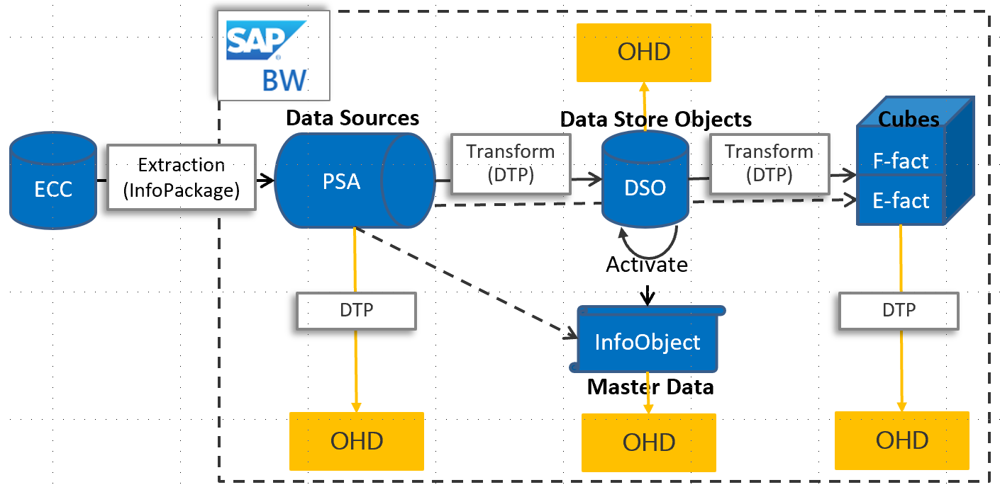

# Copy data from SAP Business Warehouse via Open Hub using Azure Data Factory

This article outlines how to use the Copy Activity in Azure Data Factory to copy data from an SAP Business Warehouse (BW) via Open Hub. It builds on the [copy activity overview](copy-activity-overview.md) article that presents a general overview of copy activity.

## SAP BW Open Hub Integration 

[SAP BW Open Hub Service](https://wiki.scn.sap.com/wiki/display/BI/Overview+of+Open+Hub+Service) is an efficient way to extract data from SAP BW. The following diagram shows one of the typical flows customers have in their SAP system, in which case data flows from SAP ECC -> PSA -> DSO -> Cube.

SAP BW Open Hub Destination (OHD) defines the target to which the SAP data is relayed. Any objects supported by SAP Data Transfer Process (DTP) can be used as open hub data sources, for example, DSO, InfoCube, DataSource, etc. Open Hub Destination type - where the relayed data is stored - can be database tables (local or remote) and flat files. This SAP BW Open Hub connector support copying data from OHD local table in BW. In case you are using other types, you can directly connect to the database or file system using other connectors.



## Supported capabilities

You can copy data from SAP Business Warehouse via Open Hub to any supported sink data store. For a list of data stores that are supported as sources/sinks by the copy activity, see the [Supported data stores](copy-activity-overview.md#supported-data-stores-and-formats) table.

Specifically, this SAP Business Warehouse Open Hub connector supports:

- SAP Business Warehouse **version 7.01 or higher (in a recent SAP Support Package Stack released after the year 2015)**.
- Copying data via Open Hub Destination local table which underneath can be DSO, InfoCube, MultiProvider, DataSource, etc.
- Copying data using basic authentication.
- Connecting to Application Server.

## Prerequisites

To use this SAP Business Warehouse Open Hub connector, you need to:

- Set up a Self-hosted Integration Runtime with version 3.13 or above. See [Self-hosted Integration Runtime](create-self-hosted-integration-runtime.md) article for details.

- Download the **64-bit [SAP .NET Connector 3.0](https://support.sap.com/en/product/connectors/msnet.html)** from SAP's website, and install it on the Self-hosted IR machine. When installing, in the optional setup steps window, make sure you select the **Install Assemblies to GAC** option as shown in the following image. 

    

- SAP user being used in the Data Factory BW connector needs to have following permissions: 

    - Authorization for RFC and SAP BW. 
    - Permissions to the “Execute” Activity of Authorization Object “S_SDSAUTH”.

- Create SAP Open Hub Destination type as **Database Table** with "Technical Key" option checked.  It is also recommended to leave the Deleting Data from Table as unchecked although it is not required. Leverage the DTP (directly execute or integrate into existing process chain) to land data from source object (such as cube) you have chosen to the open hub destination table.

## Getting started

[!INCLUDE [data-factory-v2-connector-get-started](../../includes/data-factory-v2-connector-get-started.md)]

The following sections provide details about properties that are used to define Data Factory entities specific to SAP Business Warehouse Open Hub connector.

## Linked service properties

The following properties are supported for SAP Business Warehouse Open Hub linked service:

| Property | Description | Required |
|:--- |:--- |:--- |
| type | The type property must be set to: **SapOpenHub** | Yes |
| server | Name of the server on which the SAP BW instance resides. | Yes |
| systemNumber | System number of the SAP BW system.<br/>Allowed value: two-digit decimal number represented as a string. | Yes |
| clientId | Client ID of the client in the SAP W system.<br/>Allowed value: three-digit decimal number represented as a string. | Yes |
| language | Language that the SAP system uses. | No (default value is **EN**)|
| userName | Name of the user who has access to the SAP server. | Yes |
| password | Password for the user. Mark this field as a SecureString to store it securely in Data Factory, or [reference a secret stored in Azure Key Vault](store-credentials-in-key-vault.md). | Yes |
| connectVia | The [Integration Runtime](concepts-integration-runtime.md) to be used to connect to the data store. A Self-hosted Integration Runtime is required as mentioned in [Prerequisites](#prerequisites). |Yes |

**Example:**

```json
{
    "name": "SapBwOpenHubLinkedService",
    "properties": {
        "type": "SapOpenHub",
        "typeProperties": {
            "server": "<server name>",
            "systemNumber": "<system number>",
            "clientId": "<client id>",
            "userName": "<SAP user>",
            "password": {
                "type": "SecureString",
                "value": "<Password for SAP user>"
            }
        },
        "connectVia": {
            "referenceName": "<name of Integration Runtime>",
            "type": "IntegrationRuntimeReference"
        }
    }
}
```

## Dataset properties

For a full list of sections and properties available for defining datasets, see the [Datasets](concepts-datasets-linked-services.md) article. This section provides a list of properties supported by the Salesforce dataset.

To copy data from and to SAP BW Open Hub, set the type property of the dataset to **SapOpenHubTable**. The following properties are supported.

| Property | Description | Required |
|:--- |:--- |:--- |
| type | The type property must be set to **SapOpenHubTable**.  | Yes |
| openHubDestinationName | The name of the Open Hub Destination to copy data from. | Yes |
| excludeLastRequest | Whether to exclude the records of the last request. | No (default is **true**) |
| baseRequestId | The ID of request for delta loading. Once it is set, only data with requestId **larger than** the value of this property will be retrieved.  | No |

>[!TIP]
>If your Open Hub table only contains the data generated by single request ID, for example, you always do full load and overwrite the existing data in the table, or you only run the DTP once for test, remember to uncheck the "excludeLastRequest" option in order to copy the data out.

**Example:**

```json
{
    "name": "SAPBWOpenHubDataset",
    "properties": {
        "type": "SapOpenHubTable",
        "linkedServiceName": {
            "referenceName": "<SAP BW Open Hub linked service name>",
            "type": "LinkedServiceReference"
        },
        "typeProperties": {
            "openHubDestinationName": "<open hub destination name>"
        }
    }
}
```

## Copy activity properties

For a full list of sections and properties available for defining activities, see the [Pipelines](concepts-pipelines-activities.md) article. This section provides a list of properties supported by SAP BW Open Hub source.

### SAP BW Open Hub as source

To copy data from SAP BW Open Hub, set the source type in the copy activity to **SapOpenHubSource**. While there are no additional type-specific properties needed in the copy activity **source** section.

**Example:**

```json
"activities":[
    {
        "name": "CopyFromSAPBWOpenHub",
        "type": "Copy",
        "inputs": [
            {
                "referenceName": "<SAP BW Open Hub input dataset name>",
                "type": "DatasetReference"
            }
        ],
        "outputs": [
            {
                "referenceName": "<output dataset name>",
                "type": "DatasetReference"
            }
        ],
        "typeProperties": {
            "source": {
                "type": "SapOpenHubSource"
            },
            "sink": {
                "type": "<sink type>"
            }
        }
    }
]
```

## Data type mapping for SAP BW Open Hub

When copying data from SAP BW Open Hub, the following mappings are used from SAP BW data types to Azure Data Factory interim data types. See [Schema and data type mappings](copy-activity-schema-and-type-mapping.md) to learn about how copy activity maps the source schema and data type to the sink.

| SAP ABAP Type | Data factory interim data type |
|:--- |:--- |
| C (String) | String |
| I (integer) | Int32 |
| F (Float) | Double |
| D (Date) | String |
| T (Time) | String |
| P (BCD Packed, Currency, Decimal, Qty) | Decimal |
| N (Numc) | String |
| X (Binary and Raw) | String |

## Next steps
For a list of data stores supported as sources and sinks by the copy activity in Azure Data Factory, see [supported data stores](copy-activity-overview.md#supported-data-stores-and-formats).
