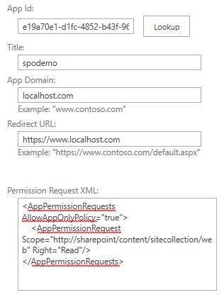
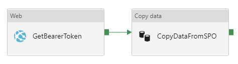

# Copy data from SharePoint Online List by using Azure Data Factory
[!INCLUDE[appliesto-adf-asa-md](includes/appliesto-adf-asa-md.md)]

This article outlines how to use Copy Activity in Azure Data Factory to copy data from SharePoint Online List. The article builds on [Copy Activity in Azure Data Factory](copy-activity-overview.md), which presents a general overview of Copy Activity.

## Supported capabilities

This SharePoint Online List connector is supported for the following activities:

- [Copy activity](copy-activity-overview.md) with [supported source/sink matrix](copy-activity-overview.md)
- [Lookup activity](control-flow-lookup-activity.md)

You can copy data from SharePoint Online List to any supported sink data store. For a list of data stores that Copy Activity supports as sources and sinks, see [Supported data stores and formats](copy-activity-overview.md#supported-data-stores-and-formats).

Specifically, this SharePoint List Online connector uses service principal authentication and retrieves data via OData protocol.

> [!TIP]
> This connector supports copying data from SharePoint Online **List** but not file. Learn how to copy file from [Copy file from SharePoint Online](#copy-file-from-sharepoint-online) section.

## Prerequisites

The SharePoint List Online connector uses service principal authentication to connect to SharePoint. Follow these steps to set it up:

1. Register an application entity in Azure Active Directory (Azure AD) by following [Register your application with an Azure AD tenant](../storage/common/storage-auth-aad-app.md#register-your-application-with-an-azure-ad-tenant). Make note of the following values, which you use to define the linked service:

    - Application ID
    - Application key
    - Tenant ID

2. Grant SharePoint Online site permission to your registered application: 

    > [!NOTE]
    > This operation requires SharePoint Online site owner permission. You can find the owner by going to the site home page -> click the "X members" in the right corner -> check who has the "Owner" role.

    1. Open SharePoint Online site link e.g. `https://[your_site_url]/_layouts/15/appinv.aspx` (replace the site URL).
    2. Search the application ID you registered, fill the empty fields, and click "Create".

        - App Domain: `localhost.com`
        - Redirect URL: `https://www.localhost.com`
        - Permission Request XML:

        ```xml
        <AppPermissionRequests AllowAppOnlyPolicy="true">
            <AppPermissionRequest Scope="http://sharepoint/content/sitecollection/web" Right="Read"/>
        </AppPermissionRequests>
        ```

        

    3. Click "Trust It" for this app.

## Get started

[!INCLUDE [data-factory-v2-connector-get-started](../../includes/data-factory-v2-connector-get-started.md)]

The following sections provide details about properties you can use to define Data Factory entities that are specific to SharePoint Online List connector.

## Linked service properties

The following properties are supported for an SharePoint Online List linked service:

| **Property**        | **Description**                                              | **Required** |
| ------------------- | ------------------------------------------------------------ | ------------ |
| type                | The type property must be set to: **SharePointOnlineList**.  | Yes          |
| siteUrl             | The SharePoint Online site url, e.g. `https://contoso.sharepoint.com/sites/siteName`. | Yes          |
| servicePrincipalId  | The Application (client) ID of the application registered in Azure Active Directory. | Yes          |
| servicePrincipalKey | The application's key. Mark this field as a **SecureString** to store it securely in Data Factory, or [reference a secret stored in Azure Key Vault](store-credentials-in-key-vault.md). | Yes          |
| tenantId            | The tenant ID under which your application resides.          | Yes          |
| connectVia          | The [Integration Runtime](concepts-integration-runtime.md) to use to connect to the data store. Learn more from [Prerequisites](#prerequisites), earlier in this article. If not specified, the default Azure Integration Runtime is used. | No           |

**Example:**

```json
{
    "name": "SharePointOnlineList",
    "properties": {
        "type": "SharePointOnlineList",
        "typeProperties": {
            "siteUrl": "<site URL>",
            "servicePrincipalId": "<service principal id>",
            "servicePrincipalKey": {
                "type": "SecureString",
                "value": "<service principal key>"
            },
            "tenantId": "<tenant ID>"
        }
    }
}
```

## Dataset properties

For a full list of sections and properties that are available for defining datasets, see [Datasets and linked services](concepts-datasets-linked-services.md). The following section provides a list of the properties supported by the SAP table dataset.

| Property | Description | Required |
|:--- |:--- |:--- |
| type | The **type** property of the dataset must be set to **SharePointOnlineLResource**. | Yes |
| listName | The name of the SharePoint Online List. | Yes |

**Example**

```json
{
    "name": "SharePointOnlineListDataset",
    "properties":
    {
        "type": "SharePointOnlineListResource",
        "linkedServiceName": {
            "referenceName": "<SharePoint Online List linked service name>",
            "type": "LinkedServiceReference"
        },
        "typeProperties":
        {
            "listName": "<name of the list>"
        }
    }
}
```

## Copy Activity properties

For a full list of sections and properties that are available for defining activities, see [Pipelines](concepts-pipelines-activities.md).  The following section provides a list of the properties supported by the SharePoint Online List source.

### SharePoint Online List as source

To copy data from SharePoint Online List, the following properties are supported in the Copy Activity **source** section:

| Property | Description | Required |
|:--- |:--- |:--- |
| type | The **type** property of the Copy Activity source must be set to **SharePointOnlineListSource**. | Yes |
| query | Custom OData query options for filtering data. Example: `"$top=10&$select=Title,Number"`. | No |
| httpRequestTimeout | The timeout (in second) for the HTTP request to get a response. Default is 300 (5 minutes). | No |

**Example**

```json
"activities":[
    {
        "name": "CopyFromSharePointOnlineList",
        "type": "Copy",
        "inputs": [
            {
                "referenceName": "<SharePoint Online List input dataset name>",
                "type": "DatasetReference"
            }
        ],
        "outputs": [
            {
                "referenceName": "<output dataset name>",
                "type": "DatasetReference"
            }
        ],
        "typeProperties": {
            "source": {
                "type": "SharePointOnlineListSource",
                "query": "<OData query e.g. $top=10&$select=Title,Number>"
            }, 
            "sink": {
                "type": "<sink type>"
            }
        }
    }
]
```

## Data type mapping for SharePoint Online List

When you copy data from SharePoint Online List, the following mappings are used between SharePoint Online List data types and Azure Data Factory interim data types. 

| **SharePoint Online data type**                 | **OData data type**                                  | **Azure Data Factory interim data type** |
| ----------------------------------------------- | ---------------------------------------------------- | ---------------------------------------- |
| Single line of text                             | Edm.String                                           | String                                   |
| Multiple lines of text                          | Edm.String                                           | String                                   |
| Choice (menu to choose from)                    | Edm.String                                           | String                                   |
| Number (1, 1.0, 100)                            | Edm.Double                                           | Double                                   |
| Currency ($, ¥, €)                              | Edm.Double                                           | Double                                   |
| Date and Time                                   | Edm.DateTime                                         | DateTime                                 |
| Lookup (information already on this site)       | Edm.Int32                                            | Int32                                    |
| Yes/No (check box)                              | Edm.Boolean                                          | Boolean                                  |
| Person or Group                                 | Edm.Int32                                            | Int32                                    |
| Hyperlink or Picture                            | Edm.String                                           | String                                   |
| Calculated (calculation based on other columns) | Edm.String / Edm.Double / Edm.DateTime / Edm.Boolean | String / Double / DateTime / Boolean     |
| Attachment                                      | Not supported                                        |                                          |
| Task Outcome                                    | Not supported                                        |                                          |
| External Data                                   | Not supported                                        |                                          |
| Managed Metadata                                | Not supported                                        |                                          |

## Copy file from SharePoint Online

You can copy file from SharePoint Online by using **Web activity** to authenticate and grab access token from SPO, then passing to subsequent **Copy activity** to copy data with **HTTP connector as source**.



1. Follow the [Prerequisites](#prerequisites) section to create AAD application and grant permission to SharePoint Online. 

2. Create a **Web Activity** to get the access token from SharePoint Online:

    - **URL**: `https://accounts.accesscontrol.windows.net/[Tenant-ID]/tokens/OAuth/2`. Replace the tenant ID.
    - **Method**: POST
    - **Headers**:
        - Content-Type: application/x-www-form-urlencoded
    - **Body**:  `grant_type=client_credentials&client_id=[Client-ID]@[Tenant-ID]&client_secret=[Client-Secret]&resource=00000003-0000-0ff1-ce00-000000000000/[Tenant-Name].sharepoint.com@[Tenant-ID]`. Replace the client ID, client secret, tenant ID and tenant name.

    > [!CAUTION]
    > Set the Secure Output option to true in Web activity to prevent the token value from being logged in plain text. Any further activities that consume this value should have their Secure Input option set to true.

3. Chain with a **Copy activity** with HTTP connector as source to copy SharePoint Online file content:

    - HTTP linked service:
        - **Base URL**: `https://[site-url]/_api/web/GetFileByServerRelativeUrl('[relative-path-to-file]')/$value`. Replace the site URL and relative path to file. Sample relative path to file as `/sites/site2/Shared Documents/TestBook.xlsx`.
        - **Authentication type:** Anonymous *(to use the Bearer token configured in copy activity source later)*
    - Dataset: choose the format you want. To copy file as-is, select "Binary" type.
    - Copy activity source:
        - **Request method**: GET
        - **Additional header**: use the following expression`@{concat('Authorization: Bearer ', activity('<Web-activity-name>').output.access_token)}`, which uses the Bearer token generated by the upstream Web activity as authorization header. Replace the Web activity name.
    - Configure the copy activity sink as usual.

## Lookup activity properties

To learn details about the properties, check [Lookup activity](control-flow-lookup-activity.md).

## Next steps

For a list of data stores that Copy Activity supports as sources and sinks in Azure Data Factory, see [Supported data stores and formats](copy-activity-overview.md#supported-data-stores-and-formats).
