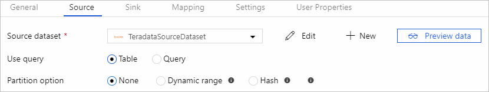

# Copy data from Teradata using Azure Data Factory
> [!div class="op_single_selector" title1="Select the version of Data Factory service you are using:"]
>
> * [Version 1](v1/data-factory-onprem-teradata-connector.md)
> * [Current version](connector-teradata.md)

This article outlines how to use the Copy Activity in Azure Data Factory to copy data from a Teradata database. It builds on the [copy activity overview](copy-activity-overview.md) article that presents a general overview of copy activity.

## Supported capabilities

You can copy data from Teradata database to any supported sink data store. For a list of data stores that are supported as sources/sinks by the copy activity, see the [Supported data stores](copy-activity-overview.md#supported-data-stores-and-formats) table.

Specifically, this Teradata connector supports:

- Teradata **version 14.10, 15.0, 15.10, 16.0, 16.10, and 16.20**.
- Copying data using **Basic** or **Windows** authentication.
- Parallel copy from Teradata source. See [Parallel copy from Teradata](#parallel-copy-from-teradata) section with details.

> [!NOTE]
>
> Azure Data Factory upgraded the Teradata connector since Self-hosted Integration Runtime v3.18, which is empowered by a built-in ODBC driver, and offers flexible connection options as well as out-of-box parallel copy to boost performance. Any existing workload using the previous Teradata connector empowered by .NET Data Provider for Teradata is still supported as-is, while you are suggested to use the new one going forward. Note the new path requires a different set of linked service/dataset/copy source. See the respective section on configuration details.

## Prerequisites

If your Teradata is not publicly accessible, you need to set up a Self-hosted Integration Runtime. For more information about integration runtime, see [Self-hosted Integration Runtime](create-self-hosted-integration-runtime.md). The Integration Runtime provides a built-in Teradata driver starting from version 3.18, therefore you don't need to manually install any driver. The driver requires "Visual C++ Redistributable 2012 Update 4" on the Self-hosted IR machine, download from [here](https://www.microsoft.com/en-sg/download/details.aspx?id=30679) if you don't yet have it installed.

For Self-hosted IR version lower than 3.18, you need to install the [.NET Data Provider for Teradata](https://go.microsoft.com/fwlink/?LinkId=278886) version 14 or above on the Integration Runtime machine. 

## Getting started

[!INCLUDE [data-factory-v2-connector-get-started](../../includes/data-factory-v2-connector-get-started.md)]

The following sections provide details about properties that are used to define Data Factory entities specific to Teradata connector.

## Linked service properties

The following properties are supported for Teradata linked service:

| Property | Description | Required |
|:--- |:--- |:--- |
| type | The type property must be set to: **Teradata** | Yes |
| connectionString | Specifies the information needed to connect to the Teradata Database instance. Refer to the following samples.<br/>You can also put password in Azure Key Vault and pull the `password` configuration out of the connection string. Refer to [Store credentials in Azure Key Vault](store-credentials-in-key-vault.md) article with more details. | Yes |
| username | Specify user name to connect to the Teradata database. Applies when using Windows authentication. | No |
| password | Specify password for the user account you specified for the username. You can also choose to [reference a secret stored in Azure Key Vault](store-credentials-in-key-vault.md). <br>Applies when using Windows authentication, or referencing password in Key Vault for basic authentication. | No |
| connectVia | The [Integration Runtime](concepts-integration-runtime.md) to be used to connect to the data store. A Self-hosted Integration Runtime is required as mentioned in [Prerequisites](#prerequisites). |Yes |

**Example: using basic authentication**

```json
{
    "name": "TeradataLinkedService",
    "properties": {
        "type": "Teradata",
        "typeProperties": {
            "connectionString": "DBCName=<server>;Uid=<username>;Pwd=<password>"
        },
        "connectVia": {
            "referenceName": "<name of Integration Runtime>",
            "type": "IntegrationRuntimeReference"
        }
    }
}
```

**Example: using Windows authentication**

```json
{
    "name": "TeradataLinkedService",
    "properties": {
        "type": "Teradata",
        "typeProperties": {
            "connectionString": "DBCName=<server>",
            "username": "<username>",
            "password": "<password>"
        },
        "connectVia": {
            "referenceName": "<name of Integration Runtime>",
            "type": "IntegrationRuntimeReference"
        }
    }
}
```

> [!NOTE]
>
> If you were using Teradata linked service empowered by .NET Data Provider for Teradata with the following payload, it is still supported as-is, while you are suggested to use the new one going forward.

**Previous payload:**

```json
{
    "name": "TeradataLinkedService",
    "properties": {
        "type": "Teradata",
        "typeProperties": {
            "server": "<server>",
            "authenticationType": "<Basic/Windows>",
            "username": "<username>",
            "password": {
                "type": "SecureString",
                "value": "<password>"
            }
        },
        "connectVia": {
            "referenceName": "<name of Integration Runtime>",
            "type": "IntegrationRuntimeReference"
        }
    }
}
```

## Dataset properties

For a full list of sections and properties available for defining datasets, see the datasets article. This section provides a list of properties supported by Teradata dataset.

To copy data from Teradata, the following properties are supported:

| Property | Description | Required |
|:--- |:--- |:--- |
| type | The type property of the dataset must be set to: **TeradataTable** | Yes |
| database | Name of Teradata database. | No (if "query" in activity source is specified) |
| table | Name of the table in the Teradata database. | No (if "query" in activity source is specified) |

**Example:**

```json
{
    "name": "TeradataDataset",
    "properties": {
        "type": "TeradataTable",
        "linkedServiceName": {
            "referenceName": "<Teradata linked service name>",
            "type": "LinkedServiceReference"
        },
        "typeProperties": {}
    }
}
```

> [!NOTE]
>
> If you were using "RelationalTable" type dataset as the following, it is still supported as-is, while you are suggested to use the new one going forward.

**Previous payload:**

```json
{
    "name": "TeradataDataset",
    "properties": {
        "type": "RelationalTable",
        "linkedServiceName": {
            "referenceName": "<Teradata linked service name>",
            "type": "LinkedServiceReference"
        },
        "typeProperties": {}
    }
}
```

## Copy activity properties

For a full list of sections and properties available for defining activities, see the [Pipelines](concepts-pipelines-activities.md) article. This section provides a list of properties supported by Teradata source.

### Teradata as source

> [!TIP]
>
> Learn more from [Parallel copy from Teradata](#parallel-copy-from-teradata) section on how to load data from Teradata efficiently using data partitioning.

To copy data from Teradata, the following properties are supported in the copy activity **source** section:

| Property | Description | Required |
|:--- |:--- |:--- |
| type | The type property of the copy activity source must be set to: **TeradataSource** | Yes |
| query | Use the custom SQL query to read data. For example: `"SELECT * FROM MyTable"`.<br>When you enable partitioned load, you need to hook corresponding built-in partition parameter(s) in your query. See examples in [Parallel copy from Teradata](#parallel-copy-from-teradata) section. | No (if table in dataset is specified) |
| partitionOptions | Specifies the data partitioning options used to load data from Teradata. <br>Allow values are: **None** (default), **Hash** and **DynamicRange**.<br>When partition option is enabled (not 'None'), please also configure **[`parallelCopies`](copy-activity-performance.md#parallel-copy)** setting on copy activity e.g. as 4, which determines the parallel degree to concurrently load data from Teradata database. | No |
| partitionSettings | Specify the group of the settings for data partitioning. <br>Apply when partition option is not `None`. | No |
| partitionColumnName | Specify the name of the source column **in integer type** that will be used by range partitioning for parallel copy. If not specified, the primary key of the table will be auto detected and used as partition column. <br>Apply when partition option is `Hash` or `DynamicRange`. If you use query to retrieve source data, hook `?AdfHashPartitionCondition` or  `?AdfRangePartitionColumnName` in WHERE clause. See example in [Parallel copy from Teradata](#parallel-copy-from-teradata) section. | No |
| partitionUpperBound | Maximum value of the partition column to copy data out. <br>Apply when partition option is `DynamicRange`. If you use query to retrieve source data, hook `?AdfRangePartitionUpbound` in WHERE clause. See example in [Parallel copy from Teradata](#parallel-copy-from-teradata) section. | No |
| PartitionLowerBound | Minimum value of the partition column to copy data out. <br>Apply when partition option is `DynamicRange`. If you use query to retrieve source data, hook `?AdfRangePartitionLowbound` in WHERE clause. See example in [Parallel copy from Teradata](#parallel-copy-from-teradata) section. | No |

> [!NOTE]
>
> If you were using "RelationalSource" type copy source, it is still supported as-is, but doesn't support the new built-in parallel load from Teradata (partition options). You are suggested to use this new one going forward.

**Example: copy data using basic query without partition**

```json
"activities":[
    {
        "name": "CopyFromTeradata",
        "type": "Copy",
        "inputs": [
            {
                "referenceName": "<Teradata input dataset name>",
                "type": "DatasetReference"
            }
        ],
        "outputs": [
            {
                "referenceName": "<output dataset name>",
                "type": "DatasetReference"
            }
        ],
        "typeProperties": {
            "source": {
                "type": "TeradataSource",
                "query": "SELECT * FROM MyTable"
            },
            "sink": {
                "type": "<sink type>"
            }
        }
    }
]
```

## Parallel copy from Teradata

Data factory Teradata connector provides built-in data partitioning to copy data from Teradata in parallel with great performance. You can find data partitioning options on copy activity -> Teradata source:



When you enable partitioned copy, data factory runs parallel queries against your Teradata source to load data by partitions. The parallel degree is configured and controlled via **[`parallelCopies`](copy-activity-performance.md#parallel-copy)** setting on copy activity. For example, if you set `parallelCopies` as four, data factory concurrently generates and runs four queries based on your specified partition option and settings, each retrieving portion of data from your Teradata database.

You are suggested to enable parallel copy with data partitioning especially when you load large amount of data from Teradata database. The following are the suggested configurations for different scenarios:

| Scenario                                                     | Suggested settings                                           |
| ------------------------------------------------------------ | ------------------------------------------------------------ |
| Full load from large table                                   | **Partition option**: Hash. <br><br/>During execution, data Factory automatically detect PK column, apply hash against it and copy data by partitions. |
| Load large amount of data using custom query                 | **Partition option**: Hash.<br>**Query**: `SELECT * FROM <TABLENAME> WHERE ?AdfHashPartitionCondition AND <your_additional_where_clause>`.<br>**Partition column**: Specify the column used for apply hash partition. If not specified, ADF will automatically detect the PK column of the table you specified in Teradata dataset.<br><br>During execution, data factory replace `?AdfHashPartitionCondition` with the hash partition logic and send to Teradata. |
| Load large amount of data using custom query, having an integer column with evenly distributed value for range partitioning | **Partition options**: Dynamic range partition.<br>**Query**: `SELECT * FROM <TABLENAME> WHERE ?AdfRangePartitionColumnName <= ?AdfRangePartitionUpbound AND ?AdfRangePartitionColumnName >= ?AdfRangePartitionLowbound AND <your_additional_where_clause>`.<br>**Partition column**: Specify the column used to partition data. You can partition against column with integer data type.<br>**Partition upper bound** and **partition lower bound**: Specify if you want to filter against partition column to only retrieve data between lower and upper range.<br><br>During execution, data factory replace `?AdfRangePartitionColumnName`, `?AdfRangePartitionUpbound`, and `?AdfRangePartitionLowbound` with the actual column name and value ranges for each partition, and send to Teradata. <br>For example, if your partition column "ID" set with lower bound as 1 and upper bound as 80, with parallel copy set as 4, ADF retrieve data by 4 partitions with ID between [1,20], [21, 40], [41, 60], and [61, 80]. |

**Example: query with hash partition**

```json
"source": {
    "type": "TeradataSource",
    "query": "SELECT * FROM <TABLENAME> WHERE ?AdfHashPartitionCondition AND <your_additional_where_clause>",
    "partitionOption": "Hash",
    "partitionSettings": {
        "partitionColumnName": "<hash_partition_column_name>"
    }
}
```

**Example: query with dynamic range partition**

```json
"source": {
    "type": "TeradataSource",
    "query": "SELECT * FROM <TABLENAME> WHERE ?AdfRangePartitionColumnName <= ?AdfRangePartitionUpbound AND ?AdfRangePartitionColumnName >= ?AdfRangePartitionLowbound AND <your_additional_where_clause>",
    "partitionOption": "DynamicRange",
    "partitionSettings": {
        "partitionColumnName": "<dynamic_range_partition_column_name>",
        "partitionUpperBound": "<upper_value_of_partition_column>",
        "partitionLowerBound": "<lower_value_of_partition_column>"
    }
}
```

## Data type mapping for Teradata

When copying data from Teradata, the following mappings are used from Teradata data types to Azure Data Factory interim data types. See [Schema and data type mappings](copy-activity-schema-and-type-mapping.md) to learn about how copy activity maps the source schema and data type to the sink.

| Teradata data type | Data factory interim data type |
|:--- |:--- |
| BigInt |Int64 |
| Blob |Byte[] |
| Byte |Byte[] |
| ByteInt |Int16 |
| Char |String |
| Clob |String |
| Date |DateTime |
| Decimal |Decimal |
| Double |Double |
| Graphic |Not supported. Apply explicit cast in source query. |
| Integer |Int32 |
| Interval Day |Not supported. Apply explicit cast in source query. |
| Interval Day To Hour |Not supported. Apply explicit cast in source query. |
| Interval Day To Minute |Not supported. Apply explicit cast in source query. |
| Interval Day To Second |Not supported. Apply explicit cast in source query. |
| Interval Hour |Not supported. Apply explicit cast in source query. |
| Interval Hour To Minute |Not supported. Apply explicit cast in source query. |
| Interval Hour To Second |Not supported. Apply explicit cast in source query. |
| Interval Minute |Not supported. Apply explicit cast in source query. |
| Interval Minute To Second |Not supported. Apply explicit cast in source query. |
| Interval Month |Not supported. Apply explicit cast in source query. |
| Interval Second |Not supported. Apply explicit cast in source query. |
| Interval Year |Not supported. Apply explicit cast in source query. |
| Interval Year To Month |Not supported. Apply explicit cast in source query. |
| Number |Double |
| Period (Date) |Not supported. Apply explicit cast in source query. |
| Period (Time) |Not supported. Apply explicit cast in source query. |
| Period (Time With Time Zone) |Not supported. Apply explicit cast in source query. |
| Period (Timestamp) |Not supported. Apply explicit cast in source query. |
| Period (Timestamp With Time Zone) |Not supported. Apply explicit cast in source query. |
| SmallInt |Int16 |
| Time |TimeSpan |
| Time With Time Zone |TimeSpan |
| Timestamp |DateTime |
| Timestamp With Time Zone |DateTime |
| VarByte |Byte[] |
| VarChar |String |
| VarGraphic |Not supported. Apply explicit cast in source query. |
| Xml |Not supported. Apply explicit cast in source query. |


## Next steps
For a list of data stores supported as sources and sinks by the copy activity in Azure Data Factory, see [supported data stores](copy-activity-overview.md#supported-data-stores-and-formats).
