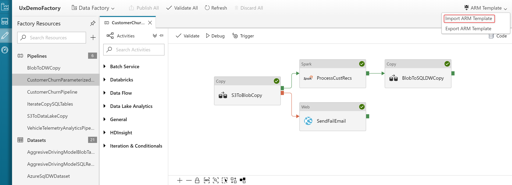

---
title: Continuous integration and delivery in Azure Data Factory | Microsoft Docs
description: Learn how to use continuous integration and delivery to move Data Factory pipelines from one environment (development, test, production) to another.
services: data-factory
documentationcenter: ''
author: douglaslMS
manager: craigg

ms.service: data-factory
ms.workload: data-services
ms.tgt_pltfrm: na
ms.devlang: na
ms.topic: conceptual
ms.date: 10/09/2018
ms.author: douglasl
---
# Continuous integration and delivery (CI/CD) in Azure Data Factory

Continuous Integration is the practice of testing each change done to your codebase automatically and as early as possible. Continuous Delivery follows the testing that happens during Continuous Integration and pushes changes to a staging or production system.

For Azure Data Factory, continuous integration & delivery means moving Data Factory pipelines from one environment (development, test, production) to another. To do continuous integration & delivery, you can use Data Factory UI integration with Azure Resource Manager templates. The Data Factory UI can generate a Resource Manager template when you select the **ARM template** options. When you select **Export ARM template**, the portal generates the Resource Manager template for the data factory and a configuration file that includes all your connections strings and other parameters. Then you have to create one configuration file for each environment (development, test, production). The main Resource Manager template file remains the same for all the environments.

For a nine-minute introduction and demonstration of this feature, watch the following video:

> [!VIDEO https://channel9.msdn.com/Shows/Azure-Friday/Continuous-integration-and-deployment-using-Azure-Data-Factory/player]

## Create a Resource Manager template for each environment
Select **Export ARM template** to export the Resource Manager template for your data factory in the development environment.


Then go to your test data factory and production data factory and select **Import ARM template**.



This action takes you to the Azure portal, where you can import the exported template. Select **Build your own template in the editor** and then **Load file** and select the generated Resource Manager template. Provide the settings, and the data factory and the entire pipeline is imported in your production environment.


Select **Load file** to select the exported Resource Manager template and provide all the configuration values (for example, linked services).


**Connection strings**. You can find the info required to create connection strings in the articles about the individual connectors. For example, for Azure SQL Database, see [Copy data to or from Azure SQL Database by using Azure Data Factory](connector-azure-sql-database.md). To verify the correct connection string - for a linked service, for example - you can also open code view for the resource in the Data Factory UI. In code view, however, the password or account key portion of the connection string is removed. To open code view, select the icon highlighted in the following screenshot.


## Continuous integration lifecycle
Here is the entire lifecycle for continuous integration & delivery that you can use after you enable Azure Repos Git integration in the Data Factory UI:

1.  Set up a development data factory with Azure Repos in which all developers can author Data Factory resources like pipelines, datasets, and so forth.

1.  Then developers can modify resources such as pipelines. As they make their modifications, they can select **Debug** to see how the pipeline runs with the most recent changes.

1.  After developers are satisfied with their changes, they can create a pull request from their branch to the master branch (or the collaboration branch) to get their changes reviewed by peers.

1.  After changes are in the master branch, they can publish to the development factory by selecting **Publish**.

1.  When the team is ready to promote changes to the test factory and the production factory, they can export the Resource Manager template from the master branch, or from any other branch in case their master branch backs the live development Data Factory.

1.  The exported Resource Manager template can be deployed with different parameter files to the test factory and the production factory.

## Automate continuous integration with Azure Pipelines releases

Here are the steps to set up an Azure Pipelines release so you can automate the deployment of a data factory to multiple environments.


### Requirements

-   An Azure subscription linked to Team Foundation Server or Azure Repos using the [*Azure Resource Manager service endpoint*](https://docs.microsoft.com/azure/devops/pipelines/library/service-endpoints#sep-azure-rm).

-   A Data Factory with Azure Repos Git integration configured.

-   An [Azure Key Vault](https://azure.microsoft.com/services/key-vault/) containing the secrets.

### Set up an Azure Pipelines release

1.  Go to your Azure Repos page in the same project as the one configured with the Data Factory.

1.  Click on the top menu **Azure Pipelines** &gt; **Releases** &gt; **Create release definition**.

    

1.  Select the **Empty process** template.

1.  Enter the name of your environment.

1.  Add a Git artifact and select the same repo configured with the Data Factory. Choose `adf_publish` as the default branch with latest default version.

    

1.  Add an Azure Resource Manager Deployment task:

    a.  Create new task, search for **Azure Resource Group Deployment**, and add it.

    b.  In the Deployment task, choose the subscription, resource group, and location for the target Data Factory, and provide credentials if necessary.

    c.  Select the **Create or update resource group** action.

    d.  Select **…** in the **Template** field. Browse for the Resource Manager template (*ARMTemplateForFactory.json*) that was created by the publish action in the portal. Look for this file in the folder `<FactoryName>` of the `adf_publish` branch.

    e.  Do the same thing for the parameters file. Choose the correct file depending on whether you created a copy or you’re using the default file *ARMTemplateParametersForFactory.json*.

    f.  Select **…** next to the **Override template parameters** field and fill in the information for the target Data Factory. For the credentials that come from key vault, use the same name for the secret in the following format: assuming the secret’s name is `cred1`, enter `"$(cred1)"` (between quotes).

    

    g. Select the **Incremental** Deployment Mode.

    > [!WARNING]
    > If you select **Complete** deployment mode, existing resources may be deleted, including all the resources in the target resource group that are not defined in the Resource Manager template.

1.  Save the release pipeline.

1.  Create a new release from this release pipeline.

    

### Optional - Get the secrets from Azure Key Vault

If you have secrets to pass in an Azure Resource Manager template, we recommend using Azure Key Vault with the Azure Pipelines release.

There are two ways to handle the secrets:

1.  Add the secrets to parameters file. For more info, see [Use Azure Key Vault to pass secure parameter value during deployment](../azure-resource-manager/resource-manager-keyvault-parameter.md).

    -   Create a copy of the parameters file that is uploaded to the publish branch and set the values of the parameters you want to get from key vault with the following format:

    ```json
    {
	    "parameters": {
		    "azureSqlReportingDbPassword": {
	    		"reference": {
    				"keyVault": {
					    "id": "/subscriptions/<subId>/resourceGroups/<resourcegroupId> /providers/Microsoft.KeyVault/vaults/<vault-name> "
			        },
        		    "secretName": " < secret - name > "
		        }
		    }
	    }
    }
    ```

    -   When you use this method, the secret is pulled from the key vault automatically.

    -   The parameters file needs to be in the publish branch as well.

1.  Add an [Azure Key Vault task](https://docs.microsoft.com/azure/devops/pipelines/tasks/deploy/azure-key-vault) before the Azure Resource Manager Deployment described in the previous section:

    -   Select the **Tasks** tab, create a new task, search for **Azure Key Vault** and add it.

    -   In the Key Vault task, choose the subscription in which you created the key vault, provide credentials if necessary, and then choose the key vault.

    

### Grant permissions to the Azure Pipelines agent
The Azure Key Vault task may fail the first time with an Access Denied error. Download the logs for the release, and locate the `.ps1` file with the command to give permissions to the Azure Pipelines agent. You can run the command directly, or you can copy the principal ID from the file and add the access policy manually in the Azure portal. (*Get* and *List* are the minimum permissions required).

### Update active triggers
Deployment can fail if you try to update active triggers. To update active triggers, you need to manually stop them and start them after the deployment. You can add an Azure Powershell task for this purpose, as shown in the following example:

1.  In the Tasks tab of the release, search for **Azure Powershell** and add it.

1.  Choose **Azure Resource Manager** as the connection type and select your subscription.

1.  Choose **Inline Script** as the script type and then provide your code. The following example stops the triggers:

    ```powershell
    $triggersADF = Get-AzureRmDataFactoryV2Trigger -DataFactoryName $DataFactoryName -ResourceGroupName $ResourceGroupName

    $triggersADF | ForEach-Object { Stop-AzureRmDataFactoryV2Trigger -ResourceGroupName $ResourceGroupName -DataFactoryName $DataFactoryName -Name $_.name -Force }
    ```

    

You can follow similar steps and use similar code (with the `Start-AzureRmDataFactoryV2Trigger` function) to restart the triggers after deployment.

> [!IMPORTANT]
> In continuous integration and deployment scenarios, the Integration Runtime type across different environments must be the same. For example, if you have a *Self-Hosted* Integration Runtime (IR) in the development environment, the same IR must be of type *Self-Hosted* in other environments such as test and production also. Similarly, if you're sharing integration runtimes across multiple stages, you have to configure the IRs as *Linked Self-Hosted* in all environments, such as development, test, and production.

## Sample deployment template

Here is a sample deployment template that you can import in Azure Pipelines.

```json
{
	"source": 2,
	"id": 1,
	"revision": 51,
	"name": "Data Factory Prod Deployment",
	"description": null,
	"createdBy": {
		"displayName": "Sample User",
		"url": "https://pde14b1dc-d2c9-49e5-88cb-45ccd58d0335.codex.ms/vssps/_apis/Identities/c9f828d1-2dbb-4e39-b096-f1c53d82bc2c",
		"id": "c9f828d1-2dbb-4e39-b096-f1c53d82bc2c",
		"uniqueName": "sampleuser@microsoft.com",
		"imageUrl": "https://sampleuser.visualstudio.com/_api/_common/identityImage?id=c9f828d1-2dbb-4e39-b096-f1c53d82bc2c",
		"descriptor": "aad.M2Y2N2JlZGUtMDViZC03ZWI3LTgxYWMtMDcwM2UyODMxNTBk"
	},
	"createdOn": "2018-03-01T22:57:25.660Z",
	"modifiedBy": {
		"displayName": "Sample User",
		"url": "https://pde14b1dc-d2c9-49e5-88cb-45ccd58d0335.codex.ms/vssps/_apis/Identities/c9f828d1-2dbb-4e39-b096-f1c53d82bc2c",
		"id": "c9f828d1-2dbb-4e39-b096-f1c53d82bc2c",
		"uniqueName": "sampleuser@microsoft.com",
		"imageUrl": "https://sampleuser.visualstudio.com/_api/_common/identityImage?id=c9f828d1-2dbb-4e39-b096-f1c53d82bc2c",
		"descriptor": "aad.M2Y2N2JlZGUtMDViZC03ZWI3LTgxYWMtMDcwM2UyODMxNTBk"
	},
	"modifiedOn": "2018-03-14T17:58:11.643Z",
	"isDeleted": false,
	"path": "\\",
	"variables": {},
	"variableGroups": [],
	"environments": [{
		"id": 1,
		"name": "Prod",
		"rank": 1,
		"owner": {
			"displayName": "Sample User",
			"url": "https://pde14b1dc-d2c9-49e5-88cb-45ccd58d0335.codex.ms/vssps/_apis/Identities/c9f828d1-2dbb-4e39-b096-f1c53d82bc2c",
			"id": "c9f828d1-2dbb-4e39-b096-f1c53d82bc2c",
			"uniqueName": "sampleuser@microsoft.com",
			"imageUrl": "https://sampleuser.visualstudio.com/_api/_common/identityImage?id=c9f828d1-2dbb-4e39-b096-f1c53d82bc2c",
			"descriptor": "aad.M2Y2N2JlZGUtMDViZC03ZWI3LTgxYWMtMDcwM2UyODMxNTBk"
		},
		"variables": {
			"factoryName": {
				"value": "sampleuserprod"
			}
		},
		"variableGroups": [],
		"preDeployApprovals": {
			"approvals": [{
				"rank": 1,
				"isAutomated": true,
				"isNotificationOn": false,
				"id": 1
			}],
			"approvalOptions": {
				"requiredApproverCount": null,
				"releaseCreatorCanBeApprover": false,
				"autoTriggeredAndPreviousEnvironmentApprovedCanBeSkipped": false,
				"enforceIdentityRevalidation": false,
				"timeoutInMinutes": 0,
				"executionOrder": 1
			}
		},
		"deployStep": {
			"id": 2
		},
		"postDeployApprovals": {
			"approvals": [{
				"rank": 1,
				"isAutomated": true,
				"isNotificationOn": false,
				"id": 3
			}],
			"approvalOptions": {
				"requiredApproverCount": null,
				"releaseCreatorCanBeApprover": false,
				"autoTriggeredAndPreviousEnvironmentApprovedCanBeSkipped": false,
				"enforceIdentityRevalidation": false,
				"timeoutInMinutes": 0,
				"executionOrder": 2
			}
		},
		"deployPhases": [{
			"deploymentInput": {
				"parallelExecution": {
					"parallelExecutionType": "none"
				},
				"skipArtifactsDownload": false,
				"artifactsDownloadInput": {
					"downloadInputs": []
				},
				"queueId": 19,
				"demands": [],
				"enableAccessToken": false,
				"timeoutInMinutes": 0,
				"jobCancelTimeoutInMinutes": 1,
				"condition": "succeeded()",
				"overrideInputs": {}
			},
			"rank": 1,
			"phaseType": 1,
			"name": "Run on agent",
			"workflowTasks": [{
				"taskId": "72a1931b-effb-4d2e-8fd8-f8472a07cb62",
				"version": "2.*",
				"name": "Azure PowerShell script: FilePath",
				"refName": "",
				"enabled": true,
				"alwaysRun": false,
				"continueOnError": false,
				"timeoutInMinutes": 0,
				"definitionType": "task",
				"overrideInputs": {},
				"condition": "succeeded()",
				"inputs": {
					"ConnectedServiceNameSelector": "ConnectedServiceNameARM",
					"ConnectedServiceName": "",
					"ConnectedServiceNameARM": "e4e2ef4b-8289-41a6-ba7c-92ca469700aa",
					"ScriptType": "FilePath",
					"ScriptPath": "$(System.DefaultWorkingDirectory)/Dev/deployment.ps1",
					"Inline": "param\n(\n    [parameter(Mandatory = $false)] [String] $rootFolder=\"C:\\Users\\sampleuser\\Downloads\\arm_template\",\n    [parameter(Mandatory = $false)] [String] $armTemplate=\"$rootFolder\\arm_template.json\",\n    [parameter(Mandatory = $false)] [String] $armTemplateParameters=\"$rootFolder\\arm_template_parameters.json\",\n    [parameter(Mandatory = $false)] [String] $domain=\"microsoft.onmicrosoft.com\",\n    [parameter(Mandatory = $false)] [String] $TenantId=\"72f988bf-86f1-41af-91ab-2d7cd011db47\",\n    [parame",
					"ScriptArguments": "-rootFolder \"$(System.DefaultWorkingDirectory)/Dev/\" -DataFactoryName $(factoryname) -predeployment $true",
					"TargetAzurePs": "LatestVersion",
					"CustomTargetAzurePs": "5.*"
				}
			}, {
				"taskId": "1e244d32-2dd4-4165-96fb-b7441ca9331e",
				"version": "1.*",
				"name": "Azure Key Vault: sampleuservault",
				"refName": "secret1",
				"enabled": true,
				"alwaysRun": false,
				"continueOnError": false,
				"timeoutInMinutes": 0,
				"definitionType": "task",
				"overrideInputs": {},
				"condition": "succeeded()",
				"inputs": {
					"ConnectedServiceName": "e4e2ef4b-8289-41a6-ba7c-92ca469700aa",
					"KeyVaultName": "sampleuservault",
					"SecretsFilter": "*"
				}
			}, {
				"taskId": "94a74903-f93f-4075-884f-dc11f34058b4",
				"version": "2.*",
				"name": "Azure Deployment:Create Or Update Resource Group action on sampleuser-datafactory",
				"refName": "",
				"enabled": true,
				"alwaysRun": false,
				"continueOnError": false,
				"timeoutInMinutes": 0,
				"definitionType": "task",
				"overrideInputs": {},
				"condition": "succeeded()",
				"inputs": {
					"ConnectedServiceName": "e4e2ef4b-8289-41a6-ba7c-92ca469700aa",
					"action": "Create Or Update Resource Group",
					"resourceGroupName": "sampleuser-datafactory",
					"location": "East US",
					"templateLocation": "Linked artifact",
					"csmFileLink": "",
					"csmParametersFileLink": "",
					"csmFile": "$(System.DefaultWorkingDirectory)/Dev/ARMTemplateForFactory.json",
					"csmParametersFile": "$(System.DefaultWorkingDirectory)/Dev/ARMTemplateParametersForFactory.json",
					"overrideParameters": "-factoryName \"$(factoryName)\" -linkedService1_connectionString \"$(linkedService1-connectionString)\" -linkedService2_connectionString \"$(linkedService2-connectionString)\"",
					"deploymentMode": "Incremental",
					"enableDeploymentPrerequisites": "None",
					"deploymentGroupEndpoint": "",
					"project": "",
					"deploymentGroupName": "",
					"copyAzureVMTags": "true",
					"outputVariable": "",
					"deploymentOutputs": ""
				}
			}, {
				"taskId": "72a1931b-effb-4d2e-8fd8-f8472a07cb62",
				"version": "2.*",
				"name": "Azure PowerShell script: FilePath",
				"refName": "",
				"enabled": true,
				"alwaysRun": false,
				"continueOnError": false,
				"timeoutInMinutes": 0,
				"definitionType": "task",
				"overrideInputs": {},
				"condition": "succeeded()",
				"inputs": {
					"ConnectedServiceNameSelector": "ConnectedServiceNameARM",
					"ConnectedServiceName": "",
					"ConnectedServiceNameARM": "e4e2ef4b-8289-41a6-ba7c-92ca469700aa",
					"ScriptType": "FilePath",
					"ScriptPath": "$(System.DefaultWorkingDirectory)/Dev/deployment.ps1",
					"Inline": "# You can write your azure powershell scripts inline here. \n# You can also pass predefined and custom variables to this script using arguments",
					"ScriptArguments": "-rootFolder \"$(System.DefaultWorkingDirectory)/Dev/\" -DataFactoryName $(factoryname) -predeployment $false",
					"TargetAzurePs": "LatestVersion",
					"CustomTargetAzurePs": ""
				}
			}]
		}],
		"environmentOptions": {
			"emailNotificationType": "OnlyOnFailure",
			"emailRecipients": "release.environment.owner;release.creator",
			"skipArtifactsDownload": false,
			"timeoutInMinutes": 0,
			"enableAccessToken": false,
			"publishDeploymentStatus": true,
			"badgeEnabled": false,
			"autoLinkWorkItems": false
		},
		"demands": [],
		"conditions": [{
			"name": "ReleaseStarted",
			"conditionType": 1,
			"value": ""
		}],
		"executionPolicy": {
			"concurrencyCount": 1,
			"queueDepthCount": 0
		},
		"schedules": [],
		"retentionPolicy": {
			"daysToKeep": 30,
			"releasesToKeep": 3,
			"retainBuild": true
		},
		"processParameters": {
			"dataSourceBindings": [{
				"dataSourceName": "AzureRMWebAppNamesByType",
				"parameters": {
					"WebAppKind": "$(WebAppKind)"
				},
				"endpointId": "$(ConnectedServiceName)",
				"target": "WebAppName"
			}]
		},
		"properties": {},
		"preDeploymentGates": {
			"id": 0,
			"gatesOptions": null,
			"gates": []
		},
		"postDeploymentGates": {
			"id": 0,
			"gatesOptions": null,
			"gates": []
		},
		"badgeUrl": "https://sampleuser.vsrm.visualstudio.com/_apis/public/Release/badge/19749ef3-2f42-49b5-9696-f28b49faebcb/1/1"
	}, {
		"id": 2,
		"name": "Staging",
		"rank": 2,
		"owner": {
			"displayName": "Sample User",
			"url": "https://pde14b1dc-d2c9-49e5-88cb-45ccd58d0335.codex.ms/vssps/_apis/Identities/c9f828d1-2dbb-4e39-b096-f1c53d82bc2c",
			"id": "c9f828d1-2dbb-4e39-b096-f1c53d82bc2c",
			"uniqueName": "sampleuser@microsoft.com",
			"imageUrl": "https://sampleuser.visualstudio.com/_api/_common/identityImage?id=c9f828d1-2dbb-4e39-b096-f1c53d82bc2c",
			"descriptor": "aad.M2Y2N2JlZGUtMDViZC03ZWI3LTgxYWMtMDcwM2UyODMxNTBk"
		},
		"variables": {
			"factoryName": {
				"value": "sampleuserstaging"
			}
		},
		"variableGroups": [],
		"preDeployApprovals": {
			"approvals": [{
				"rank": 1,
				"isAutomated": true,
				"isNotificationOn": false,
				"id": 4
			}],
			"approvalOptions": {
				"requiredApproverCount": null,
				"releaseCreatorCanBeApprover": false,
				"autoTriggeredAndPreviousEnvironmentApprovedCanBeSkipped": false,
				"enforceIdentityRevalidation": false,
				"timeoutInMinutes": 0,
				"executionOrder": 1
			}
		},
		"deployStep": {
			"id": 5
		},
		"postDeployApprovals": {
			"approvals": [{
				"rank": 1,
				"isAutomated": true,
				"isNotificationOn": false,
				"id": 6
			}],
			"approvalOptions": {
				"requiredApproverCount": null,
				"releaseCreatorCanBeApprover": false,
				"autoTriggeredAndPreviousEnvironmentApprovedCanBeSkipped": false,
				"enforceIdentityRevalidation": false,
				"timeoutInMinutes": 0,
				"executionOrder": 2
			}
		},
		"deployPhases": [{
			"deploymentInput": {
				"parallelExecution": {
					"parallelExecutionType": "none"
				},
				"skipArtifactsDownload": false,
				"artifactsDownloadInput": {
					"downloadInputs": []
				},
				"queueId": 19,
				"demands": [],
				"enableAccessToken": false,
				"timeoutInMinutes": 0,
				"jobCancelTimeoutInMinutes": 1,
				"condition": "succeeded()",
				"overrideInputs": {}
			},
			"rank": 1,
			"phaseType": 1,
			"name": "Run on agent",
			"workflowTasks": [{
				"taskId": "72a1931b-effb-4d2e-8fd8-f8472a07cb62",
				"version": "2.*",
				"name": "Azure PowerShell script: FilePath",
				"refName": "",
				"enabled": true,
				"alwaysRun": false,
				"continueOnError": false,
				"timeoutInMinutes": 0,
				"definitionType": "task",
				"overrideInputs": {},
				"condition": "succeeded()",
				"inputs": {
					"ConnectedServiceNameSelector": "ConnectedServiceNameARM",
					"ConnectedServiceName": "",
					"ConnectedServiceNameARM": "e4e2ef4b-8289-41a6-ba7c-92ca469700aa",
					"ScriptType": "FilePath",
					"ScriptPath": "$(System.DefaultWorkingDirectory)/Dev/deployment.ps1",
					"Inline": "# You can write your azure powershell scripts inline here. \n# You can also pass predefined and custom variables to this script using arguments",
					"ScriptArguments": "-rootFolder \"$(System.DefaultWorkingDirectory)/Dev/\" -DataFactoryName $(factoryname) -predeployment $true",
					"TargetAzurePs": "LatestVersion",
					"CustomTargetAzurePs": ""
				}
			}, {
				"taskId": "1e244d32-2dd4-4165-96fb-b7441ca9331e",
				"version": "1.*",
				"name": "Azure Key Vault: sampleuservault",
				"refName": "",
				"enabled": true,
				"alwaysRun": false,
				"continueOnError": false,
				"timeoutInMinutes": 0,
				"definitionType": "task",
				"overrideInputs": {},
				"condition": "succeeded()",
				"inputs": {
					"ConnectedServiceName": "e4e2ef4b-8289-41a6-ba7c-92ca469700aa",
					"KeyVaultName": "sampleuservault",
					"SecretsFilter": "*"
				}
			}, {
				"taskId": "94a74903-f93f-4075-884f-dc11f34058b4",
				"version": "2.*",
				"name": "Azure Deployment:Create Or Update Resource Group action on sampleuser-datafactory",
				"refName": "",
				"enabled": true,
				"alwaysRun": false,
				"continueOnError": false,
				"timeoutInMinutes": 0,
				"definitionType": "task",
				"overrideInputs": {},
				"condition": "succeeded()",
				"inputs": {
					"ConnectedServiceName": "e4e2ef4b-8289-41a6-ba7c-92ca469700aa",
					"action": "Create Or Update Resource Group",
					"resourceGroupName": "sampleuser-datafactory",
					"location": "East US",
					"templateLocation": "Linked artifact",
					"csmFileLink": "",
					"csmParametersFileLink": "",
					"csmFile": "$(System.DefaultWorkingDirectory)/Dev/ARMTemplateForFactory.json",
					"csmParametersFile": "$(System.DefaultWorkingDirectory)/Dev/ARMTemplateParametersForFactory.json",
					"overrideParameters": "-factoryName \"$(factoryName)\" -linkedService1_connectionString \"$(linkedService1-connectionString)\" -linkedService2_connectionString \"$(linkedService2-connectionString)\"",
					"deploymentMode": "Incremental",
					"enableDeploymentPrerequisites": "None",
					"deploymentGroupEndpoint": "",
					"project": "",
					"deploymentGroupName": "",
					"copyAzureVMTags": "true",
					"outputVariable": "",
					"deploymentOutputs": ""
				}
			}, {
				"taskId": "72a1931b-effb-4d2e-8fd8-f8472a07cb62",
				"version": "2.*",
				"name": "Azure PowerShell script: FilePath",
				"refName": "",
				"enabled": true,
				"alwaysRun": false,
				"continueOnError": false,
				"timeoutInMinutes": 0,
				"definitionType": "task",
				"overrideInputs": {},
				"condition": "succeeded()",
				"inputs": {
					"ConnectedServiceNameSelector": "ConnectedServiceNameARM",
					"ConnectedServiceName": "",
					"ConnectedServiceNameARM": "16a37943-8b58-4c2f-a3d6-052d6f032a07",
					"ScriptType": "FilePath",
					"ScriptPath": "$(System.DefaultWorkingDirectory)/Dev/deployment.ps1",
					"Inline": "param(\n$x,\n$y,\n$z)\nwrite-host \"----------\"\nwrite-host $x\nwrite-host $y\nwrite-host $z | ConvertTo-SecureString\nwrite-host \"----------\"",
					"ScriptArguments": "-rootFolder \"$(System.DefaultWorkingDirectory)/Dev/\" -DataFactoryName $(factoryname) -predeployment $false",
					"TargetAzurePs": "LatestVersion",
					"CustomTargetAzurePs": ""
				}
			}]
		}],
		"environmentOptions": {
			"emailNotificationType": "OnlyOnFailure",
			"emailRecipients": "release.environment.owner;release.creator",
			"skipArtifactsDownload": false,
			"timeoutInMinutes": 0,
			"enableAccessToken": false,
			"publishDeploymentStatus": true,
			"badgeEnabled": false,
			"autoLinkWorkItems": false
		},
		"demands": [],
		"conditions": [{
			"name": "ReleaseStarted",
			"conditionType": 1,
			"value": ""
		}],
		"executionPolicy": {
			"concurrencyCount": 1,
			"queueDepthCount": 0
		},
		"schedules": [],
		"retentionPolicy": {
			"daysToKeep": 30,
			"releasesToKeep": 3,
			"retainBuild": true
		},
		"processParameters": {
			"dataSourceBindings": [{
				"dataSourceName": "AzureRMWebAppNamesByType",
				"parameters": {
					"WebAppKind": "$(WebAppKind)"
				},
				"endpointId": "$(ConnectedServiceName)",
				"target": "WebAppName"
			}]
		},
		"properties": {},
		"preDeploymentGates": {
			"id": 0,
			"gatesOptions": null,
			"gates": []
		},
		"postDeploymentGates": {
			"id": 0,
			"gatesOptions": null,
			"gates": []
		},
		"badgeUrl": "https://sampleuser.vsrm.visualstudio.com/_apis/public/Release/badge/19749ef3-2f42-49b5-9696-f28b49faebcb/1/2"
	}],
	"artifacts": [{
		"sourceId": "19749ef3-2f42-49b5-9696-f28b49faebcb:a6c88f30-5e1f-4de8-b24d-279bb209d85f",
		"type": "Git",
		"alias": "Dev",
		"definitionReference": {
			"branches": {
				"id": "adf_publish",
				"name": "adf_publish"
			},
			"checkoutSubmodules": {
				"id": "",
				"name": ""
			},
			"defaultVersionSpecific": {
				"id": "",
				"name": ""
			},
			"defaultVersionType": {
				"id": "latestFromBranchType",
				"name": "Latest from default branch"
			},
			"definition": {
				"id": "a6c88f30-5e1f-4de8-b24d-279bb209d85f",
				"name": "Dev"
			},
			"fetchDepth": {
				"id": "",
				"name": ""
			},
			"gitLfsSupport": {
				"id": "",
				"name": ""
			},
			"project": {
				"id": "19749ef3-2f42-49b5-9696-f28b49faebcb",
				"name": "Prod"
			}
		},
		"isPrimary": true
	}],
	"triggers": [{
		"schedule": {
			"jobId": "b5ef09b6-8dfd-4b91-8b48-0709e3e67b2d",
			"timeZoneId": "UTC",
			"startHours": 3,
			"startMinutes": 0,
			"daysToRelease": 31
		},
		"triggerType": 2
	}],
	"releaseNameFormat": "Release-$(rev:r)",
	"url": "https://sampleuser.vsrm.visualstudio.com/19749ef3-2f42-49b5-9696-f28b49faebcb/_apis/Release/definitions/1",
	"_links": {
		"self": {
			"href": "https://sampleuser.vsrm.visualstudio.com/19749ef3-2f42-49b5-9696-f28b49faebcb/_apis/Release/definitions/1"
		},
		"web": {
			"href": "https://sampleuser.visualstudio.com/19749ef3-2f42-49b5-9696-f28b49faebcb/_release?definitionId=1"
		}
	},
	"tags": [],
	"properties": {
		"DefinitionCreationSource": {
			"$type": "System.String",
			"$value": "ReleaseNew"
		}
	}
}
```

## Sample script to stop and restart triggers and clean up

Here is a sample script to stop triggers before deployment and to restart triggers afterwards. The script also includes code to delete resources that have been removed. To install the latest version of Azure PowerShell, see [Install Azure PowerShell on Windows with PowerShellGet](https://docs.microsoft.com/en-us/powershell/azure/install-azurerm-ps?view=azurermps-6.9.0).

```powershell
param
(
    [parameter(Mandatory = $false)] [String] $rootFolder="$(env:System.DefaultWorkingDirectory)/Dev/",
    [parameter(Mandatory = $false)] [String] $armTemplate="$rootFolder\arm_template.json",
    [parameter(Mandatory = $false)] [String] $ResourceGroupName="sampleuser-datafactory",
    [parameter(Mandatory = $false)] [String] $DataFactoryName="sampleuserdemo2",
    [parameter(Mandatory = $false)] [Bool] $predeployment=$true

)


$templateJson = Get-Content $armTemplate | ConvertFrom-Json
$resources = $templateJson.resources

#Triggers 
Write-Host "Getting triggers"
$triggersADF = Get-AzureRmDataFactoryV2Trigger -DataFactoryName $DataFactoryName -ResourceGroupName $ResourceGroupName
$triggersTemplate = $resources | Where-Object { $_.type -eq "Microsoft.DataFactory/factories/triggers" }
$triggerNames = $triggersTemplate | ForEach-Object {$_.name.Substring(37, $_.name.Length-40)}
$activeTriggerNames = $triggersTemplate | Where-Object { $_.properties.runtimeState -eq "Started" -and $_.properties.pipelines.Count -gt 0} | ForEach-Object {$_.name.Substring(37, $_.name.Length-40)}
$deletedtriggers = $triggersADF | Where-Object { $triggerNames -notcontains $_.Name }
$triggerstostop = $triggerNames | where { ($triggersADF | Select-Object name).name -contains $_ }

if ($predeployment -eq $true) {
    #Stop all triggers
    Write-Host "Stopping deployed triggers"
    $triggerstostop | ForEach-Object { Stop-AzureRmDataFactoryV2Trigger -ResourceGroupName $ResourceGroupName -DataFactoryName $DataFactoryName -Name $_ -Force }
}
else {

    #start Active triggers
    Write-Host "Starting active triggers"
    $activeTriggerNames | ForEach-Object { Start-AzureRmDataFactoryV2Trigger -ResourceGroupName $ResourceGroupName -DataFactoryName $DataFactoryName -Name $_ -Force }

    #Deleted resources
    #pipelines
    Write-Host "Getting pipelines"
    $pipelinesADF = Get-AzureRmDataFactoryV2Pipeline -DataFactoryName $DataFactoryName -ResourceGroupName $ResourceGroupName
    $pipelinesTemplate = $resources | Where-Object { $_.type -eq "Microsoft.DataFactory/factories/pipelines" }
    $pipelinesNames = $pipelinesTemplate | ForEach-Object {$_.name.Substring(37, $_.name.Length-40)}
    $deletedpipelines = $pipelinesADF | Where-Object { $pipelinesNames -notcontains $_.Name }
    #datasets
    Write-Host "Getting datasets"
    $datasetsADF = Get-AzureRmDataFactoryV2Dataset -DataFactoryName $DataFactoryName -ResourceGroupName $ResourceGroupName
    $datasetsTemplate = $resources | Where-Object { $_.type -eq "Microsoft.DataFactory/factories/datasets" }
    $datasetsNames = $datasetsTemplate | ForEach-Object {$_.name.Substring(37, $_.name.Length-40) }
    $deleteddataset = $datasetsADF | Where-Object { $datasetsNames -notcontains $_.Name }
    #linkedservices
    Write-Host "Getting linked services"
    $linkedservicesADF = Get-AzureRmDataFactoryV2LinkedService -DataFactoryName $DataFactoryName -ResourceGroupName $ResourceGroupName
    $linkedservicesTemplate = $resources | Where-Object { $_.type -eq "Microsoft.DataFactory/factories/linkedservices" }
    $linkedservicesNames = $linkedservicesTemplate | ForEach-Object {$_.name.Substring(37, $_.name.Length-40)}
    $deletedlinkedservices = $linkedservicesADF | Where-Object { $linkedservicesNames -notcontains $_.Name }
    #Integrationruntimes
    Write-Host "Getting integration runtimes"
    $integrationruntimesADF = Get-AzureRmDataFactoryV2IntegrationRuntime -DataFactoryName $DataFactoryName -ResourceGroupName $ResourceGroupName
    $integrationruntimesTemplate = $resources | Where-Object { $_.type -eq "Microsoft.DataFactory/factories/integrationruntimes" }
    $integrationruntimesNames = $integrationruntimesTemplate | ForEach-Object {$_.name.Substring(37, $_.name.Length-40)}
    $deletedintegrationruntimes = $integrationruntimesADF | Where-Object { $integrationruntimesNames -notcontains $_.Name }

    #delte resources
    Write-Host "Deleting triggers"
    $deletedtriggers | ForEach-Object { Remove-AzureRmDataFactoryV2Trigger -Name $_.Name -ResourceGroupName $ResourceGroupName -DataFactoryName $DataFactoryName -Force }
    Write-Host "Deleting pipelines"
    $deletedpipelines | ForEach-Object { Remove-AzureRmDataFactoryV2Pipeline -Name $_.Name -ResourceGroupName $ResourceGroupName -DataFactoryName $DataFactoryName -Force }
    Write-Host "Deleting datasets"
    $deleteddataset | ForEach-Object { Remove-AzureRmDataFactoryV2Dataset -Name $_.Name -ResourceGroupName $ResourceGroupName -DataFactoryName $DataFactoryName -Force }
    Write-Host "Deleting linked services"
    $deletedlinkedservices | ForEach-Object { Remove-AzureRmDataFactoryV2LinkedService -Name $_.Name -ResourceGroupName $ResourceGroupName -DataFactoryName $DataFactoryName -Force }
    Write-Host "Deleting integration runtimes"
    $deletedintegrationruntimes | ForEach-Object { Remove-AzureRmDataFactoryV2IntegrationRuntime -Name $_.Name -ResourceGroupName $ResourceGroupName -DataFactoryName $DataFactoryName -Force }
}
```

## Use custom parameters with the Resource Manager template

You can define custom parameters for the Resource Manager template. You simply need to have a file named `arm-template-parameters-definition.json` in the root folder of the repository. (The file name must match the name shown here exactly.) Data Factory tries to read the file from whichever branch you are currently working in, not just from the collaboration branch. If no file is found, Data Factory uses the default parameters and values.

The following example shows a sample parameters file. Use this sample as a reference to create your own custom parameters file. If the file you provide is not in the proper JSON format, Data Factory outputs an error message in the browser console and reverts to the default parameters and values shown in the Data Factory UI.

```json
{
	"Microsoft.DataFactory/factories/pipelines": {},
	"Microsoft.DataFactory/factories/integrationRuntimes": {
		"properties": {
			"typeProperties": {
				"ssisProperties": {
					"catalogInfo": {
						"catalogServerEndpoint": "=",
						"catalogAdminUserName": "=",
						"catalogAdminPassword": {
							"value": "-::secureString"
						}
					},
					"customSetupScriptProperties": {
						"sasToken": {
							"value": "-::secureString"
						}
					}
				},
				"linkedInfo": {
					"key": {
						"value": "-::secureString"
					}
				}
			}
		}
	},
	"Microsoft.DataFactory/factories/triggers": {
		"properties": {
			"pipelines": [{
					"parameters": {
						"*": "="
					}
				},
				"pipelineReference.referenceName"
			],
			"pipeline": {
				"parameters": {
					"*": "="
				}
			}
		}
	},
	"Microsoft.DataFactory/factories/linkedServices": {
		"*": {
			"properties": {
				"typeProperties": {
					"accountName": "=",
					"username": "=",
					"userName": "=",
					"accessKeyId": "=",
					"servicePrincipalId": "=",
					"userId": "=",
					"clientId": "=",
					"clusterUserName": "=",
					"clusterSshUserName": "=",
					"hostSubscriptionId": "=",
					"clusterResourceGroup": "=",
					"subscriptionId": "=",
					"resourceGroupName": "=",
					"tenant": "=",
					"dataLakeStoreUri": "=",
					"baseUrl": "=",
					"connectionString": "|:-connectionString:secureString"
				}
			}
		}
	},
	"Microsoft.DataFactory/factories/datasets": {
		"*": {
			"properties": {
				"typeProperties": {
					"folderPath": "=",
					"fileName": "="
				}
			}
		}
	}
}
```
