---
title: Continuous integration and delivery in Azure Data Factory 
description: Learn how to use continuous integration and delivery to move Data Factory pipelines from one environment (development, test, production) to another.
services: data-factory
documentationcenter: ''
ms.service: data-factory
ms.workload: data-services
author: djpmsft
ms.author: daperlov
ms.reviewer: maghan
manager: jroth
ms.topic: conceptual
ms.date: 08/14/2019
---

# Continuous integration and delivery in Azure Data Factory

## Overview

Continuous integration is the practice of testing each change made to your codebase automatically and as early as possible. Continuous delivery follows the testing that happens during continuous integration and pushes changes to a staging or production system.

In Azure Data Factory, continuous integration and delivery (CI/CD) means moving Data Factory pipelines from one environment (development, test, production) to another. You can use Data Factory UX integration with Azure Resource Manager templates to do CI/CD.

In the Data Factory UX, you can generate a Resource Manager template from the **ARM Template** drop-down menu. When you select **Export ARM Template**, the portal generates the Resource Manager template for the data factory and a configuration file that includes all your connection strings and other parameters. Then you create one configuration file for each environment (development, test, production). The main Resource Manager template file remains the same for all the environments.

For a nine-minute introduction to this feature and a demonstration, watch this video:

> [!VIDEO https://channel9.msdn.com/Shows/Azure-Friday/Continuous-integration-and-deployment-using-Azure-Data-Factory/player]

[!INCLUDE [updated-for-az](../../includes/updated-for-az.md)]

## CI/CD lifecycle

Below is a sample overview of the CI/CD lifecycle in an Azure data factory that's configured with Azure Repos Git. For more information on how to configure a Git repository, see [Source control in Azure Data Factory](source-control.md).

1.  A development data factory is created and configured with Azure Repos Git. All developers should have permission to author Data Factory resources like pipelines and datasets.

1.  As the developers make changes in their feature branches, they debug their pipeline runs with their most recent changes. For more information on how to debug a pipeline run, see [Iterative development and debugging with Azure Data Factory](iterative-development-debugging.md).

1.  After the developers are satisfied with their changes, they create a pull request from their feature branch to the master or collaboration branch to get their changes reviewed by peers.

1.  After a pull request is approved and changes are merged in the master branch, the changes can be published to the development factory.

1.  When the team is ready to deploy the changes to the test factory and then to the production factory, the team exports the Resource Manager template from the master branch.

1.  The exported Resource Manager template is deployed with different parameter files to the test factory and the production factory.

## Create a Resource Manager template for each environment

1. In the **ARM Template** list, select **Export ARM Template** to export the Resource Manager template for your data factory in the development environment.

   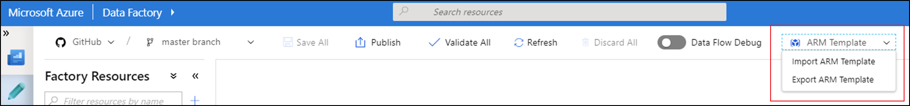

1. In your test and production data factories, select **Import ARM Template**. This action takes you to the Azure portal, where you can import the exported template. Select **Build your own template in the editor** to open the Resource Manager template editor.

    

1. Select **Load file**, and then select the generated Resource Manager template.

   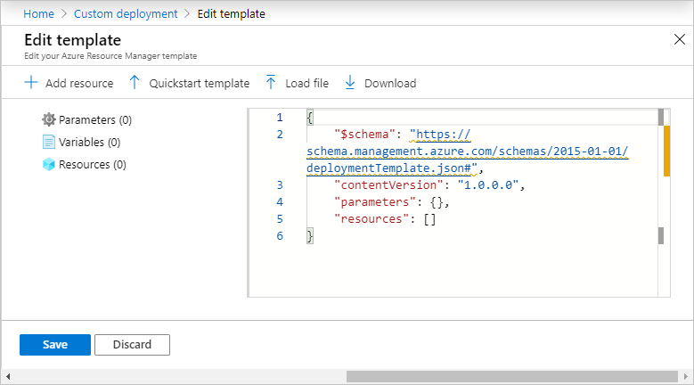

1. In the settings section, enter the configuration values, like linked service credentials. When you're done, select **Purchase** to deploy the Resource Manager template.

   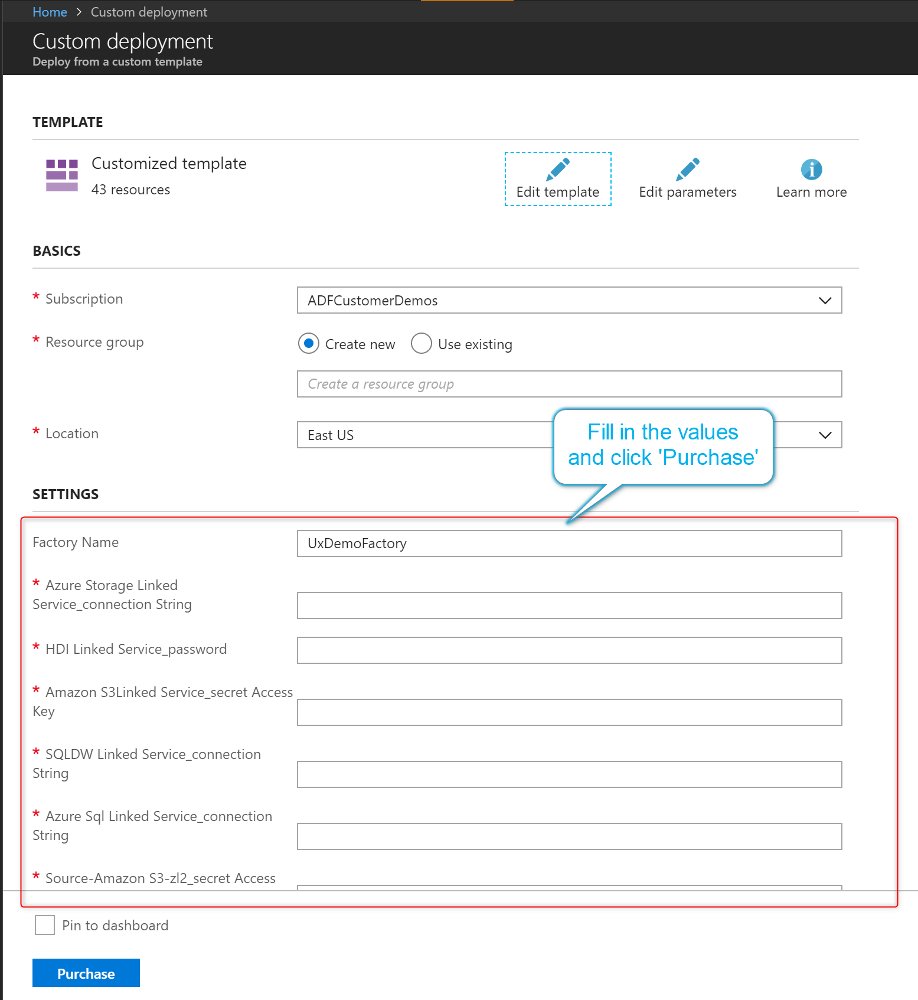

### Connection strings

For information on how to configure connection strings, see the connector's article. For example, for Azure SQL Database, see [Copy data to or from Azure SQL Database by using Azure Data Factory](connector-azure-sql-database.md). To verify a  connection string, you can open the code view for the resource in the Data Factory UX. In code view, the password or account key portion of the connection string is removed. To open code view, select the icon highlighted here:


## Automate continuous integration by using Azure Pipelines releases

Following is a guide for setting up an Azure Pipelines release, which automates the deployment of a data factory to multiple environments.

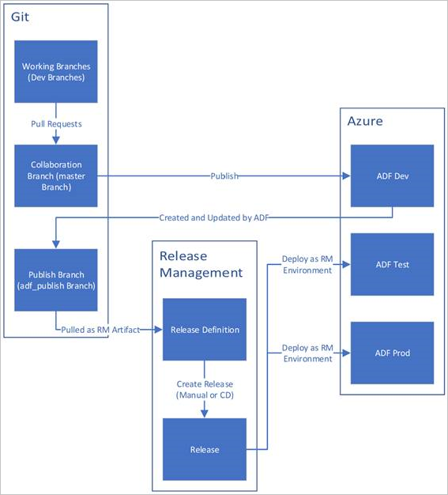

### Requirements

-   An Azure subscription linked to Visual Studio Team Foundation Server or Azure Repos that uses the [Azure Resource Manager service endpoint](https://docs.microsoft.com/azure/devops/pipelines/library/service-endpoints#sep-azure-rm).

-   A data factory configured with Azure Repos Git integration.

-   An [Azure key vault](https://azure.microsoft.com/services/key-vault/) that contains the secrets for each environment.

### Set up an Azure Pipelines release

1.  In [Azure DevOps](https://dev.azure.com/), open the project that's configured with your data factory.

1.  On the left side of the page, select **Pipelines**, and then select **Releases**.

    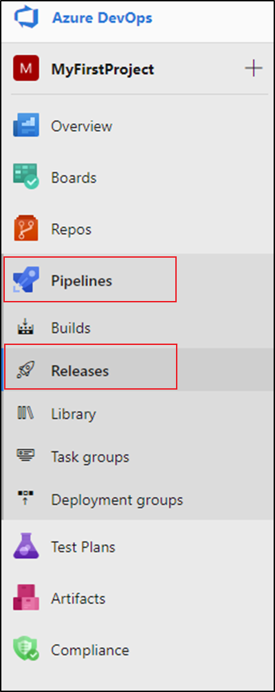

1.  Select **New pipeline**, or, if you have existing pipelines, select **New** and then **New release pipeline**.

1.  Select the **Empty job** template.

    

1.  In the **Stage name** box, enter the name of your environment.

1.  Select **Add artifact**, and then select the repository configured with your data factory. Select **adf_publish** for the **Default branch**. For the **Default version**, select **Latest from default branch**.

    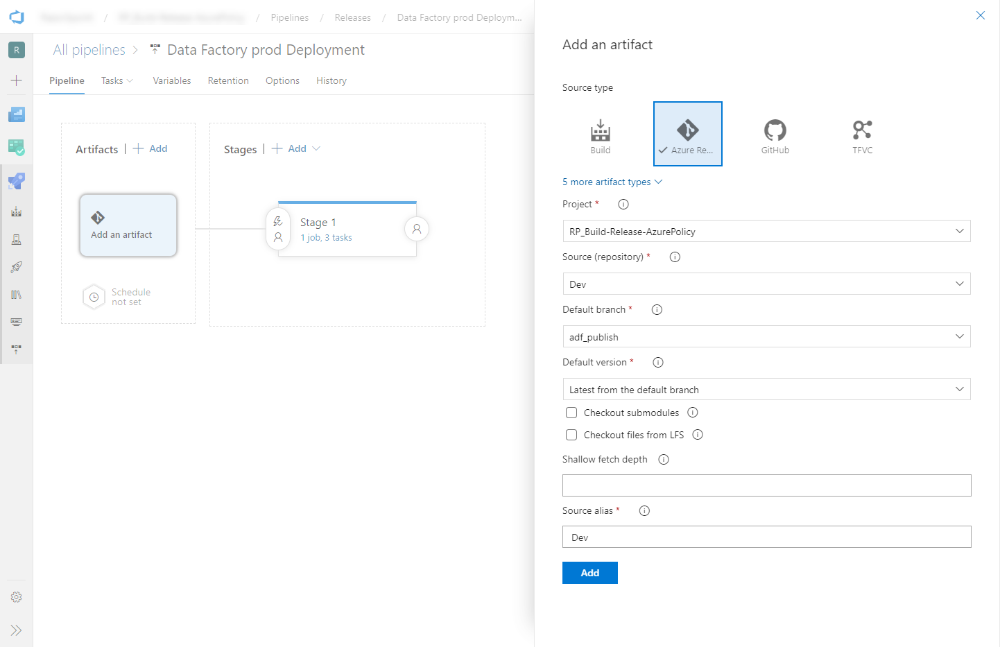

1.  Add an Azure Resource Manager Deployment task:

    a.  In the stage view, select **View stage tasks**.

    

    b.  Create a new task. Search for **Azure Resource Group Deployment**, and then select **Add**.

    c.  In the Deployment task, select the subscription, resource group, and location for the target data factory. Provide credentials if necessary.

    d.  In the **Action** list, select **Create or update resource group**.

    e.  Select the ellipsis button (**…**) next to the **Template** box. Browse for the Azure Resource Manager template that you created by using **Import ARM Template** in the [Create a Resource Manager template for each environment](continuous-integration-deployment.md#create-a-resource-manager-template-for-each-environment) section of this article. Look for this file in the <FactoryName> folder of the adf_publish branch.

    f.  Select **…** next to the **Template parameters** box to choose the parameters file. The file you choose will depend on whether you created a copy or are using the default file, ARMTemplateParametersForFactory.json.

    g.  Select **…** next to the **Override template parameters** box, and enter the information for the target data factory. For credentials that come from Azure Key Vault, enter the secret's name between double quotation marks. For example, if the secret's name is cred1, enter **"$(cred1)"** for this value.

    h. Select **Incremental** for the **Deployment mode**.

    > [!WARNING]
    > If you select **Complete** for the **Deployment mode**, existing resources might be deleted, including all resources in the target resource group that aren't defined in the Resource Manager template.

    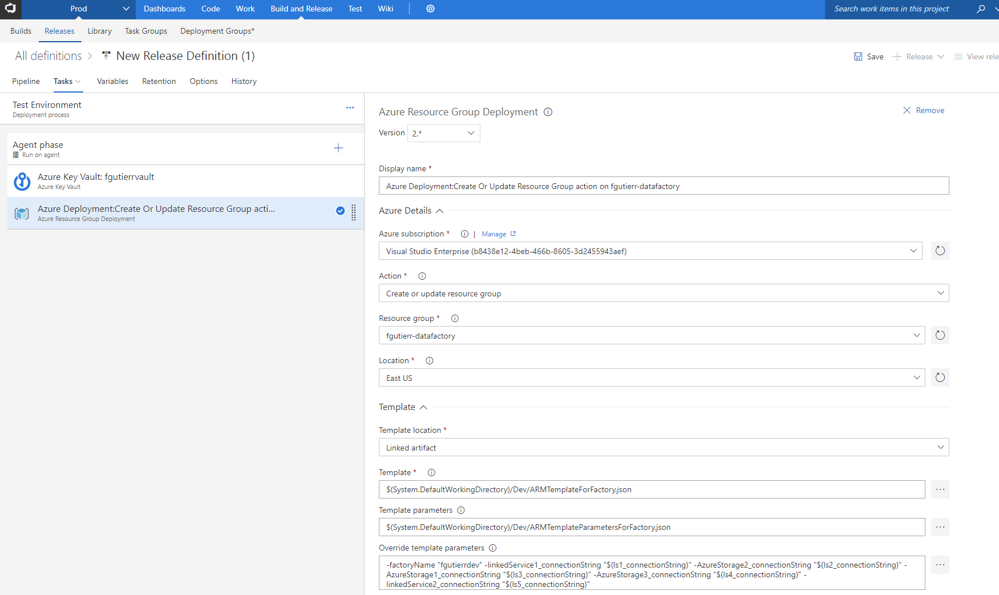

1.  Save the release pipeline.

1. To trigger a release, select **Create release**.

   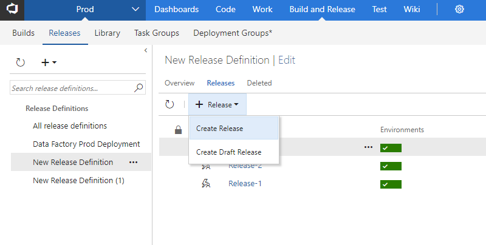

### Get secrets from Azure Key Vault

If you have secrets to pass in an Azure Resource Manager template, we recommend that you use Azure Key Vault with the Azure Pipelines release.

There are two ways to handle secrets:

1.  Add the secrets to parameters file. For more info, see [Use Azure Key Vault to pass secure parameter value during deployment](../azure-resource-manager/templates/key-vault-parameter.md).

    Create a copy of the parameters file that's uploaded to the publish branch. Set the values of the parameters that you want to get from Key Vault by using this format:

    ```json
    {
	    "parameters": {
		    "azureSqlReportingDbPassword": {
	    		"reference": {
    				"keyVault": {
					    "id": "/subscriptions/<subId>/resourceGroups/<resourcegroupId> /providers/Microsoft.KeyVault/vaults/<vault-name> "
			        },
        		    "secretName": " < secret - name > "
		        }
		    }
	    }
    }
    ```

    When you use this method, the secret is pulled from the key vault automatically.

    The parameters file needs to be in the publish branch as well.

-  Add an [Azure Key Vault task](https://docs.microsoft.com/azure/devops/pipelines/tasks/deploy/azure-key-vault) before the Azure Resource Manager Deployment task described in the previous section:

    1.  On the **Tasks** tab, create a new task. Search for **Azure Key Vault** and add it.

    1.  In the Key Vault task, select the subscription in which you created the key vault. Provide credentials if necessary, and then select the key vault.

    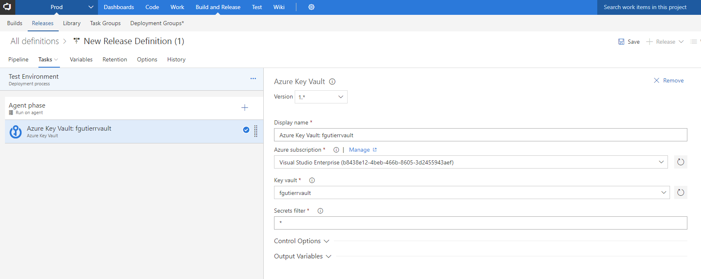

   #### Grant permissions to the Azure Pipelines agent

   The Azure Key Vault task might fail with an Access Denied error if the correct permissions aren't set. Download the logs for the release, and locate the .ps1 file that contains the command to give permissions to the Azure Pipelines agent. You can run the command directly. Or you can copy the principal ID from the file and add the access policy manually in the Azure portal. `Get` and `List` are the minimum permissions required.

### Update active triggers

Deployment can fail if you try to update active triggers. To update active triggers, you need to manually stop them and then restart them after the deployment. You can do this by using an Azure PowerShell task:

1.  On the **Tasks** tab of the release, add an **Azure PowerShell** task.

1.  Select **Azure Resource Manager** as the connection type, and then select your subscription.

1.  Select **Inline Script** as the script type, and then provide your code. The following code stops the triggers:

    ```powershell
    $triggersADF = Get-AzDataFactoryV2Trigger -DataFactoryName $DataFactoryName -ResourceGroupName $ResourceGroupName

    $triggersADF | ForEach-Object { Stop-AzDataFactoryV2Trigger -ResourceGroupName $ResourceGroupName -DataFactoryName $DataFactoryName -Name $_.name -Force }
    ```

    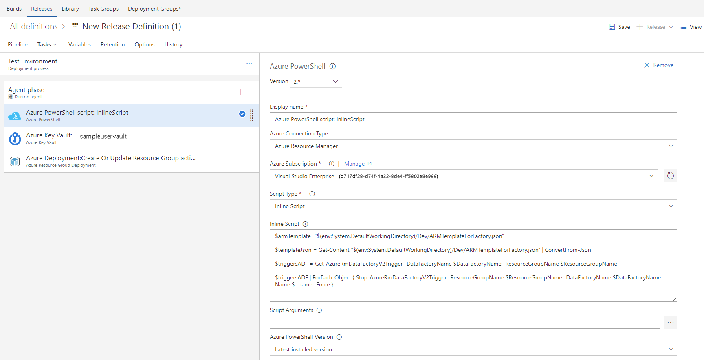

You can complete similar steps (with the `Start-AzDataFactoryV2Trigger` function) to restart the triggers after deployment.

> [!IMPORTANT]
> In CI/CD scenarios, the integration runtime (IR) type in different environments must be the same. For example, if you have a self-hosted IR in the development environment, the same IR must also be of type self-hosted in other environments, such as test and production. Similarly, if you're sharing integration runtimes across multiple stages, you have to configure the integration runtimes as linked self-hosted in all environments, such as development, test, and production.

#### Sample pre- and post-deployment script

The following sample script shows how to stop triggers before deployment and restart them afterward. The script also includes code to delete resources that have been removed. To install the latest version of Azure PowerShell, see [Install Azure PowerShell on Windows with PowerShellGet](https://docs.microsoft.com/powershell/azure/install-az-ps).

```powershell
param
(
    [parameter(Mandatory = $false)] [String] $rootFolder,
    [parameter(Mandatory = $false)] [String] $armTemplate,
    [parameter(Mandatory = $false)] [String] $ResourceGroupName,
    [parameter(Mandatory = $false)] [String] $DataFactoryName,
    [parameter(Mandatory = $false)] [Bool] $predeployment=$true,
    [parameter(Mandatory = $false)] [Bool] $deleteDeployment=$false
)

$templateJson = Get-Content $armTemplate | ConvertFrom-Json
$resources = $templateJson.resources

#Triggers 
Write-Host "Getting triggers"
$triggersADF = Get-AzDataFactoryV2Trigger -DataFactoryName $DataFactoryName -ResourceGroupName $ResourceGroupName
$triggersTemplate = $resources | Where-Object { $_.type -eq "Microsoft.DataFactory/factories/triggers" }
$triggerNames = $triggersTemplate | ForEach-Object {$_.name.Substring(37, $_.name.Length-40)}
$activeTriggerNames = $triggersTemplate | Where-Object { $_.properties.runtimeState -eq "Started" -and ($_.properties.pipelines.Count -gt 0 -or $_.properties.pipeline.pipelineReference -ne $null)} | ForEach-Object {$_.name.Substring(37, $_.name.Length-40)}
$deletedtriggers = $triggersADF | Where-Object { $triggerNames -notcontains $_.Name }
$triggerstostop = $triggerNames | where { ($triggersADF | Select-Object name).name -contains $_ }

if ($predeployment -eq $true) {
    #Stop all triggers
    Write-Host "Stopping deployed triggers"
    $triggerstostop | ForEach-Object { 
        Write-host "Disabling trigger " $_
        Stop-AzDataFactoryV2Trigger -ResourceGroupName $ResourceGroupName -DataFactoryName $DataFactoryName -Name $_ -Force 
    }
}
else {
    #Deleted resources
    #pipelines
    Write-Host "Getting pipelines"
    $pipelinesADF = Get-AzDataFactoryV2Pipeline -DataFactoryName $DataFactoryName -ResourceGroupName $ResourceGroupName
    $pipelinesTemplate = $resources | Where-Object { $_.type -eq "Microsoft.DataFactory/factories/pipelines" }
    $pipelinesNames = $pipelinesTemplate | ForEach-Object {$_.name.Substring(37, $_.name.Length-40)}
    $deletedpipelines = $pipelinesADF | Where-Object { $pipelinesNames -notcontains $_.Name }
    #datasets
    Write-Host "Getting datasets"
    $datasetsADF = Get-AzDataFactoryV2Dataset -DataFactoryName $DataFactoryName -ResourceGroupName $ResourceGroupName
    $datasetsTemplate = $resources | Where-Object { $_.type -eq "Microsoft.DataFactory/factories/datasets" }
    $datasetsNames = $datasetsTemplate | ForEach-Object {$_.name.Substring(37, $_.name.Length-40) }
    $deleteddataset = $datasetsADF | Where-Object { $datasetsNames -notcontains $_.Name }
    #linkedservices
    Write-Host "Getting linked services"
    $linkedservicesADF = Get-AzDataFactoryV2LinkedService -DataFactoryName $DataFactoryName -ResourceGroupName $ResourceGroupName
    $linkedservicesTemplate = $resources | Where-Object { $_.type -eq "Microsoft.DataFactory/factories/linkedservices" }
    $linkedservicesNames = $linkedservicesTemplate | ForEach-Object {$_.name.Substring(37, $_.name.Length-40)}
    $deletedlinkedservices = $linkedservicesADF | Where-Object { $linkedservicesNames -notcontains $_.Name }
    #Integrationruntimes
    Write-Host "Getting integration runtimes"
    $integrationruntimesADF = Get-AzDataFactoryV2IntegrationRuntime -DataFactoryName $DataFactoryName -ResourceGroupName $ResourceGroupName
    $integrationruntimesTemplate = $resources | Where-Object { $_.type -eq "Microsoft.DataFactory/factories/integrationruntimes" }
    $integrationruntimesNames = $integrationruntimesTemplate | ForEach-Object {$_.name.Substring(37, $_.name.Length-40)}
    $deletedintegrationruntimes = $integrationruntimesADF | Where-Object { $integrationruntimesNames -notcontains $_.Name }

    #Delete resources
    Write-Host "Deleting triggers"
    $deletedtriggers | ForEach-Object { 
        Write-Host "Deleting trigger "  $_.Name
        $trig = Get-AzDataFactoryV2Trigger -name $_.Name -ResourceGroupName $ResourceGroupName -DataFactoryName $DataFactoryName
        if ($trig.RuntimeState -eq "Started") {
            Stop-AzDataFactoryV2Trigger -ResourceGroupName $ResourceGroupName -DataFactoryName $DataFactoryName -Name $_.Name -Force 
        }
        Remove-AzDataFactoryV2Trigger -Name $_.Name -ResourceGroupName $ResourceGroupName -DataFactoryName $DataFactoryName -Force 
    }
    Write-Host "Deleting pipelines"
    $deletedpipelines | ForEach-Object { 
        Write-Host "Deleting pipeline " $_.Name
        Remove-AzDataFactoryV2Pipeline -Name $_.Name -ResourceGroupName $ResourceGroupName -DataFactoryName $DataFactoryName -Force 
    }
    Write-Host "Deleting datasets"
    $deleteddataset | ForEach-Object { 
        Write-Host "Deleting dataset " $_.Name
        Remove-AzDataFactoryV2Dataset -Name $_.Name -ResourceGroupName $ResourceGroupName -DataFactoryName $DataFactoryName -Force 
    }
    Write-Host "Deleting linked services"
    $deletedlinkedservices | ForEach-Object { 
        Write-Host "Deleting Linked Service " $_.Name
        Remove-AzDataFactoryV2LinkedService -Name $_.Name -ResourceGroupName $ResourceGroupName -DataFactoryName $DataFactoryName -Force 
    }
    Write-Host "Deleting integration runtimes"
    $deletedintegrationruntimes | ForEach-Object { 
        Write-Host "Deleting integration runtime " $_.Name
        Remove-AzDataFactoryV2IntegrationRuntime -Name $_.Name -ResourceGroupName $ResourceGroupName -DataFactoryName $DataFactoryName -Force 
    }

    if ($deleteDeployment -eq $true) {
        Write-Host "Deleting ARM deployment ... under resource group: " $ResourceGroupName
        $deployments = Get-AzResourceGroupDeployment -ResourceGroupName $ResourceGroupName
        $deploymentsToConsider = $deployments | Where { $_.DeploymentName -like "ArmTemplate_master*" -or $_.DeploymentName -like "ArmTemplateForFactory*" } | Sort-Object -Property Timestamp -Descending
        $deploymentName = $deploymentsToConsider[0].DeploymentName

       Write-Host "Deployment to be deleted: " $deploymentName
        $deploymentOperations = Get-AzResourceGroupDeploymentOperation -DeploymentName $deploymentName -ResourceGroupName $ResourceGroupName
        $deploymentsToDelete = $deploymentOperations | Where { $_.properties.targetResource.id -like "*Microsoft.Resources/deployments*" }

        $deploymentsToDelete | ForEach-Object { 
            Write-host "Deleting inner deployment: " $_.properties.targetResource.id
            Remove-AzResourceGroupDeployment -Id $_.properties.targetResource.id
        }
        Write-Host "Deleting deployment: " $deploymentName
        Remove-AzResourceGroupDeployment -ResourceGroupName $ResourceGroupName -Name $deploymentName
    }

    #Start active triggers - after cleanup efforts
    Write-Host "Starting active triggers"
    $activeTriggerNames | ForEach-Object { 
        Write-host "Enabling trigger " $_
        Start-AzDataFactoryV2Trigger -ResourceGroupName $ResourceGroupName -DataFactoryName $DataFactoryName -Name $_ -Force 
    }
}
```

## Use custom parameters with the Resource Manager template

If you're in GIT mode, you can override the default properties in your Resource Manager template to set properties that are parameterized in the template and properties that are hard coded. You might want to override the default parameterization template in these scenarios:

* You use automated CI/CD and you want to change some properties during Resource Manager deployment, but the properties aren't parameterized by default.
* Your factory is so large that the default Resource Manager template is invalid because it has more than the maximum allowed parameters (256).

Under these conditions, to override the default parameterization template, create a file named arm-template-parameters-definition.json in the root folder of the repository. You must use that exact file name. Data Factory reads this file from whichever branch you're currently on in the Azure Data Factory portal, not just from the collaboration branch. You can create or edit the file from a private branch, where you can test your changes by selecting **Export ARM Template** in the UI. You can then merge the file into the collaboration branch. If no file is found, the default template is used.

### Syntax of a custom parameters file

Following are some guidelines to follow when you create the custom parameters file. The file consists of a section for each entity type: trigger, pipeline, linked service, dataset, integration runtime, and so on.
* Enter the property path under the relevant entity type.
* Setting a property name to `*` indicates that you want to parameterize all properties under it (only down to the first level, not recursively). You can also provide exceptions to this configuration.
* Setting the value of a property as a string indicates that you want to parameterize the property. Use the format `<action>:<name>:<stype>`.
   *  `<action>` can be one of these characters:
      * `=` means keep the current value as the default value for the parameter.
      * `-` means don't keep the default value for the parameter.
      * `|` is a special case for secrets from Azure Key Vault for connection strings or keys.
   * `<name>` is the name of the parameter. If it's blank, it takes the name of the property. If the value starts with a `-` character, the name is shortened. For example, `AzureStorage1_properties_typeProperties_connectionString` would be shortened to `AzureStorage1_connectionString`.
   * `<stype>` is the type of parameter. If `<stype>` is blank, the default type is `string`. Supported values: `string`, `bool`, `number`, `object`, and `securestring`.
* Specifying an array in the definition file indicates that the matching property in the template is an array. Data Factory iterates through all the objects in the array by using the definition that's specified in the integration runtime object of the array. The second object, a string, becomes the name of the property, which is used as the name for the parameter for each iteration.
* A definition can't be specific to a resource instance. Any definition applies to all resources of that type.
* By default, all secure strings, like Key Vault secrets, and secure strings, like connection strings, keys, and tokens, are parameterized.
 
### Sample parameterization template

Here's an example of what a parameterization template might look like:

```json
{
    "Microsoft.DataFactory/factories/pipelines": {
        "properties": {
            "activities": [{
                "typeProperties": {
                    "waitTimeInSeconds": "-::number",
                    "headers": "=::object"
                }
            }]
        }
    },
    "Microsoft.DataFactory/factories/integrationRuntimes": {
        "properties": {
            "typeProperties": {
                "*": "="
            }
        }
    },
    "Microsoft.DataFactory/factories/triggers": {
        "properties": {
            "typeProperties": {
                "recurrence": {
                    "*": "=",
                    "interval": "=:triggerSuffix:number",
                    "frequency": "=:-freq"
                },
                "maxConcurrency": "="
            }
        }
    },
    "Microsoft.DataFactory/factories/linkedServices": {
        "*": {
            "properties": {
                "typeProperties": {
                    "accountName": "=",
                    "username": "=",
                    "connectionString": "|:-connectionString:secureString",
                    "secretAccessKey": "|"
                }
            }
        },
        "AzureDataLakeStore": {
            "properties": {
                "typeProperties": {
                    "dataLakeStoreUri": "="
                }
            }
        }
    },
    "Microsoft.DataFactory/factories/datasets": {
        "properties": {
            "typeProperties": {
                "*": "="
            }
        }
    }
}
```
Here's an explanation of how the preceding template is constructed, broken down by resource type.

#### Pipelines
	
* Any property in the path `activities/typeProperties/waitTimeInSeconds` is parameterized. Any activity in a pipeline that has a code-level property named `waitTimeInSeconds` (for example, the `Wait` activity) is parameterized as a number, with a default name. But it won't have a default value in the Resource Manager template. It will be a mandatory input during the Resource Manager deployment.
* Similarly, a property called `headers` (for example, in a `Web` activity) is parameterized with type `object` (JObject). It has a default value, which is the same value as that of the source factory.

#### IntegrationRuntimes

* All properties under the path `typeProperties` are parameterized with their respective default values. For example, there are two properties under `IntegrationRuntimes` type properties: `computeProperties` and `ssisProperties`. Both property types are created with their respective default values and types (Object).

#### Triggers

* Under `typeProperties`, two properties are parameterized. The first one is `maxConcurrency`, which is specified to have a default value and is of type`string`. It has the default parameter name `<entityName>_properties_typeProperties_maxConcurrency`.
* The `recurrence` property also is parameterized. Under it, all properties at that level are specified to be parameterized as strings, with default values and parameter names. An exception is the `interval` property, which is parameterized as type `number`. The parameter name is suffixed with `<entityName>_properties_typeProperties_recurrence_triggerSuffix`. Similarly, the `freq` property is a string and is parameterized as a string. However, the `freq` property is parameterized without a default value. The name is shortened and suffixed. For example, `<entityName>_freq`.

#### LinkedServices

* Linked services are unique. Because linked services and datasets have a wide range of types, you can provide type-specific customization. In this example, for all linked services of type `AzureDataLakeStore`, a specific template will be applied. For all others (via `*`), a different template will be applied.
* The `connectionString` property will be parameterized as a `securestring` value. It won't have a default value. It will have a shortened parameter name that's suffixed with `connectionString`.
* The property `secretAccessKey` happens to be an `AzureKeyVaultSecret` (for example, in an Amazon S3 linked service). It's automatically parameterized as an Azure Key Vault secret and fetched from the configured key vault. You can also parameterize the key vault itself.

#### Datasets

* Although type-specific customization is available for datasets, you can provide configuration without explicitly having a \*-level configuration. In the preceding example, all dataset properties under `typeProperties` are parameterized.

### Default parameterization template

Following is the current default parameterization template. If you need to add only a few parameters, editing this template directly might be a good idea because you won't lose the existing parameterization structure.

```json
{
    "Microsoft.DataFactory/factories/pipelines": {
    },
    "Microsoft.DataFactory/factories/integrationRuntimes":{
        "properties": {
            "typeProperties": {
                "ssisProperties": {
                    "catalogInfo": {
                        "catalogServerEndpoint": "=",
                        "catalogAdminUserName": "=",
                        "catalogAdminPassword": {
                            "value": "-::secureString"
                        }
                    },
                    "customSetupScriptProperties": {
                        "sasToken": {
                            "value": "-::secureString"
                        }
                    }
                },
                "linkedInfo": {
                    "key": {
                        "value": "-::secureString"
                    },
                    "resourceId": "="
                }
            }
        }
    },
    "Microsoft.DataFactory/factories/triggers": {
        "properties": {
            "pipelines": [{
                    "parameters": {
                        "*": "="
                    }
                },  
                "pipelineReference.referenceName"
            ],
            "pipeline": {
                "parameters": {
                    "*": "="
                }
            },
            "typeProperties": {
                "scope": "="
            }

        }
    },
    "Microsoft.DataFactory/factories/linkedServices": {
        "*": {
            "properties": {
                "typeProperties": {
                    "accountName": "=",
                    "username": "=",
                    "userName": "=",
                    "accessKeyId": "=",
                    "servicePrincipalId": "=",
                    "userId": "=",
                    "clientId": "=",
                    "clusterUserName": "=",
                    "clusterSshUserName": "=",
                    "hostSubscriptionId": "=",
                    "clusterResourceGroup": "=",
                    "subscriptionId": "=",
                    "resourceGroupName": "=",
                    "tenant": "=",
                    "dataLakeStoreUri": "=",
                    "baseUrl": "=",
                    "database": "=",
                    "serviceEndpoint": "=",
                    "batchUri": "=",
                    "databaseName": "=",
                    "systemNumber": "=",
                    "server": "=",
                    "url":"=",
                    "aadResourceId": "=",
                    "connectionString": "|:-connectionString:secureString"
                }
            }
        },
        "Odbc": {
            "properties": {
                "typeProperties": {
                    "userName": "=",
                    "connectionString": {
                        "secretName": "="
                    }
                }
            }
        }
    },
    "Microsoft.DataFactory/factories/datasets": {
        "*": {
            "properties": {
                "typeProperties": {
                    "folderPath": "=",
                    "fileName": "="
                }
            }
        }}
}
```

The following example shows how to add a single value to the default parameterization template. We only want to add an existing Azure Databricks interactive cluster ID for a Databricks linked service to the parameters file. Note that this file is the same as the previous file except for the addition of `existingClusterId` under the properties field of `Microsoft.DataFactory/factories/linkedServices`.

```json
{
    "Microsoft.DataFactory/factories/pipelines": {
    },
    "Microsoft.DataFactory/factories/integrationRuntimes":{
        "properties": {
            "typeProperties": {
                "ssisProperties": {
                    "catalogInfo": {
                        "catalogServerEndpoint": "=",
                        "catalogAdminUserName": "=",
                        "catalogAdminPassword": {
                            "value": "-::secureString"
                        }
                    },
                    "customSetupScriptProperties": {
                        "sasToken": {
                            "value": "-::secureString"
                        }
                    }
                },
                "linkedInfo": {
                    "key": {
                        "value": "-::secureString"
                    },
                    "resourceId": "="
                }
            }
        }
    },
    "Microsoft.DataFactory/factories/triggers": {
        "properties": {
            "pipelines": [{
                    "parameters": {
                        "*": "="
                    }
                },  
                "pipelineReference.referenceName"
            ],
            "pipeline": {
                "parameters": {
                    "*": "="
                }
            },
            "typeProperties": {
                "scope": "="
            }
 
        }
    },
    "Microsoft.DataFactory/factories/linkedServices": {
        "*": {
            "properties": {
                "typeProperties": {
                    "accountName": "=",
                    "username": "=",
                    "userName": "=",
                    "accessKeyId": "=",
                    "servicePrincipalId": "=",
                    "userId": "=",
                    "clientId": "=",
                    "clusterUserName": "=",
                    "clusterSshUserName": "=",
                    "hostSubscriptionId": "=",
                    "clusterResourceGroup": "=",
                    "subscriptionId": "=",
                    "resourceGroupName": "=",
                    "tenant": "=",
                    "dataLakeStoreUri": "=",
                    "baseUrl": "=",
                    "database": "=",
                    "serviceEndpoint": "=",
                    "batchUri": "=",
                    "databaseName": "=",
                    "systemNumber": "=",
                    "server": "=",
                    "url":"=",
                    "aadResourceId": "=",
                    "connectionString": "|:-connectionString:secureString",
                    "existingClusterId": "-"
                }
            }
        },
        "Odbc": {
            "properties": {
                "typeProperties": {
                    "userName": "=",
                    "connectionString": {
                        "secretName": "="
                    }
                }
            }
        }
    },
    "Microsoft.DataFactory/factories/datasets": {
        "*": {
            "properties": {
                "typeProperties": {
                    "folderPath": "=",
                    "fileName": "="
                }
            }
        }}
}
```

## Linked Resource Manager templates

If you've set up CI/CD for your data factories, you might exceed the Azure Resource Manager template limits as your factory grows bigger. For example, one limit is the maximum number of resources in a Resource Manager template. To accommodate large factories while generating the full Resource Manager template for a factory, Data Factory now generates linked Resource Manager templates. With this feature, the entire factory payload is broken down into several files so that you aren't constrained by the limits.

If you've configured Git, the linked templates are generated and saved alongside the full Resource Manager templates in the adf_publish branch in a new folder called linkedTemplates:

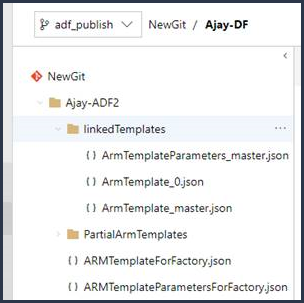

The linked Resource Manager templates usually consist of a master template and a set of child templates that are linked to the master. The parent template is called ArmTemplate_master.json, and child templates are named with the pattern ArmTemplate_0.json, ArmTemplate_1.json, and so on. 

To use linked templates instead of the full Resource Manager template, update your CI/CD task to point to ArmTemplate_master.json instead of ArmTemplateForFactory.json (the full Resource Manager template). Resource Manager also requires that you upload the linked templates into a storage account so Azure can access them during deployment. For more info, see [Deploying linked Resource Manager templates with VSTS](https://blogs.msdn.microsoft.com/najib/2018/04/22/deploying-linked-arm-templates-with-vsts/).

Remember to add the Data Factory scripts in your CI/CD pipeline before and after the deployment task.

If you don't have Git configured, you can access the linked templates via **Export ARM Template** in the **ARM Template** list.

## Hotfix production branch

If you deploy a factory to production and realize there's a bug that needs to be fixed right away, but you can't deploy the current collaboration branch, you might need to deploy a hotfix. This approach is as known as quick-fix engineering or QFE.

1.	In Azure DevOps, go to the release that was deployed to production. Find the last commit that was deployed.

2.	From the commit message, get the commit ID of the collaboration branch.

3.	Create a new hotfix branch from that commit.

4.	Go to the Azure Data Factory UX and switch to the hotfix branch.

5.	By using the Azure Data Factory UX, fix the bug. Test your changes.

6.	After the fix is verified, select **Export ARM Template** to get the hotfix Resource Manager template.

7.	Manually check this build into the adf_publish branch.

8.	If you've configured your release pipeline to automatically trigger based on adf_publish check-ins, a new release will start automatically. Otherwise, manually queue a release.

9.	Deploy the hotfix release to the test and production factories. This release contains the previous production payload plus the fix that you made in step 5.

10.	Add the changes from the hotfix to the development branch so that later releases won't include the same bug.

## Best practices for CI/CD

If you're using Git integration with your data factory and have a CI/CD pipeline that moves your changes from development into test and then to production, we recommend these best practices:

-   **Git integration**. You need to configure only your development data factory with Git integration. Changes to test and production are deployed via CI/CD and don't need Git integration.

-   **Data Factory CI/CD script**. Before the Resource Manager deployment step in CI/CD, you need to complete certain tasks, like stopping and restarting triggers and performing cleanup. We recommend that you use PowerShell scripts before and after deployment. For more information, see [Update active triggers](#update-active-triggers).

-   **Integration runtimes and sharing**. Integration runtimes don't change often and are similar across all stages in your CI/CD. So Data Factory expects you to have the same name and type of integration runtime across all stages of CI/CD. If you want to share integration runtimes across all stages, consider using a ternary factory just to contain the shared integration runtimes. You can use this shared factory in all of your environments as a linked integration runtime type.

-   **Key Vault**. When you use linked services based on Azure Key Vault, you can take advantage of them further by keeping separate key vaults for different environments. You can also configure separate permission levels for each key vault. For example, you might not want your team members to have permissions to production secrets. If you follow this approach, we recommend that you to keep the same secret names across all stages. If you keep the same names, you don't have to change your Resource Manager templates across CI/CD environments because the only thing that changes is the key vault name, which is one of the Resource Manager template parameters.

## Unsupported features

- By design, Data Factory doesn't allow cherry-picking of commits or selective publishing of resources. Publishes will include all changes made in the data factory.

    - Data factory entities depend on each other. For example, triggers depend on pipelines, and pipelines depend on datasets and other pipelines. Selective publishing of a subset of resources could lead to unexpected behaviors and errors.
    - On rare occasions when you need selective publishing, consider using a hotfix. For more information, see [Hotfix production branch](#hotfix-production-branch).

-   You can't publish from private branches.

-   You can't currently host projects on Bitbucket.
