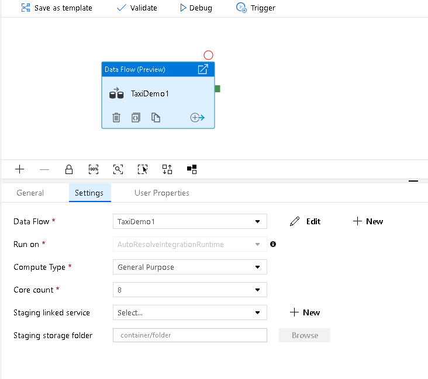
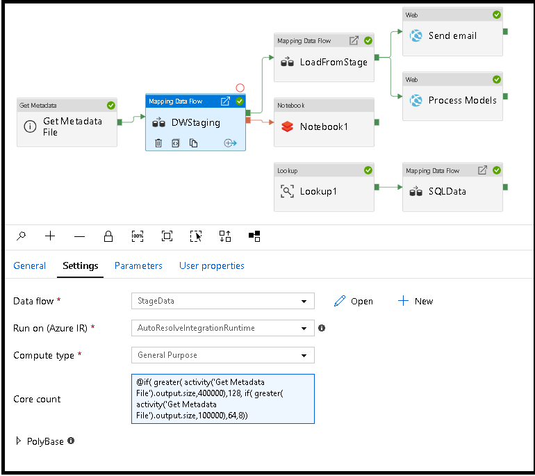
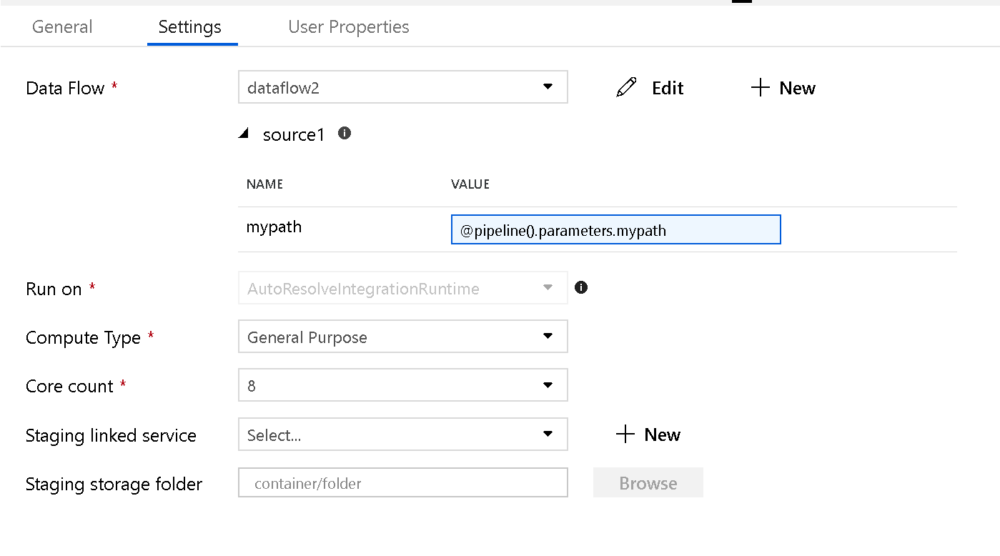
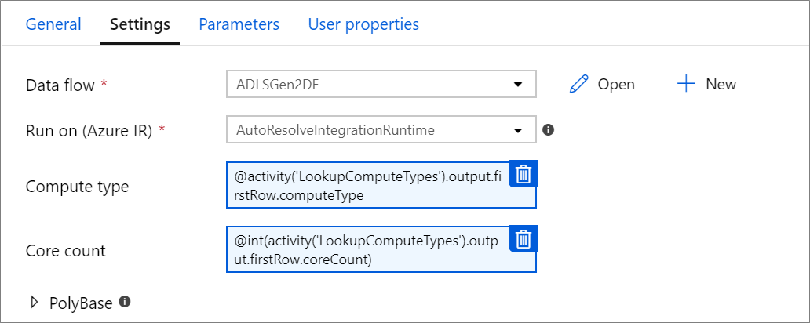
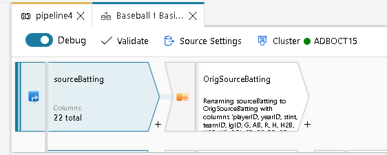

# Data Flow activity in Azure Data Factory

[!INCLUDE[appliesto-adf-asa-md](includes/appliesto-adf-asa-md.md)]

Use the Data Flow activity to transform and move data via mapping data flows. If you're new to data flows, see [Mapping Data Flow overview](concepts-data-flow-overview.md)

## Syntax

```json
{
    "name": "MyDataFlowActivity",
    "type": "ExecuteDataFlow",
    "typeProperties": {
      "dataflow": {
         "referenceName": "MyDataFlow",
         "type": "DataFlowReference"
      },
      "compute": {
         "coreCount": 8,
         "computeType": "General"
      },
      "staging": {
          "linkedService": {
              "referenceName": "MyStagingLinkedService",
              "type": "LinkedServiceReference"
          },
          "folderPath": "my-container/my-folder"
      },
      "integrationRuntime": {
          "referenceName": "MyDataFlowIntegrationRuntime",
          "type": "IntegrationRuntimeReference"
      }
}

```

## Type properties

Property | Description | Allowed values | Required
-------- | ----------- | -------------- | --------
dataflow | The reference to the Data Flow being executed | DataFlowReference | Yes
integrationRuntime | The compute environment the data flow runs on. If not specified, the auto-resolve Azure integration runtime will be used. | IntegrationRuntimeReference | No
compute.coreCount | The number of cores used in the spark cluster. Can only be specified if the auto-resolve Azure Integration runtime is used | 8, 16, 32, 48, 80, 144, 272 | No
compute.computeType | The type of compute used in the spark cluster. Can only be specified if the auto-resolve Azure Integration runtime is used | "General", "ComputeOptimized", "MemoryOptimized" | No
staging.linkedService | If you're using a SQL DW source or sink, the storage account used for PolyBase staging | LinkedServiceReference | Only if the data flow reads or writes to a SQL DW
staging.folderPath | If you're using a SQL DW source or sink, the folder path in blob storage account used for PolyBase staging | String | Only if the data flow reads or writes to a SQL DW



### Dynamically size data flow compute at runtime

The Core Count and Compute Type properties can be set dynamically to adjust to the size of your incoming source data at runtime. Use pipeline activities like Lookup or Get Metadata in order to find the size of the source dataset data. Then, use Add Dynamic Content in the Data Flow activity properties.



[Here is a brief video tutorial explaining this technique](https://www.youtube.com/watch?v=jWSkJdtiJNM)

### Data Flow integration runtime

Choose which Integration Runtime to use for your Data Flow activity execution. By default, Data Factory will use the auto-resolve Azure Integration runtime with four worker cores and no time to live (TTL). This IR has a general purpose compute type and runs in the same region as your factory. You can create your own Azure Integration Runtimes that define specific regions, compute type, core counts, and TTL for your data flow activity execution.

For pipeline executions, the cluster is a job cluster, which takes several minutes to start up before execution starts. If no TTL is specified, this start-up time is required on every pipeline run. If you specify a TTL, a warm cluster pool will stay active for the time specified after the last execution, resulting in shorter start-up times. For example, if you have a TTL of 60 minutes and run a data flow on it once an hour, the cluster pool will stay active. For more information, see [Azure integration runtime](concepts-integration-runtime.md).


> [!IMPORTANT]
> The Integration Runtime selection in the Data Flow activity only applies to *triggered executions* of your pipeline. Debugging your pipeline with data flows runs on the cluster specified in the debug session.

### PolyBase

If you're using an Azure SQL Data Warehouse as a sink or source, you must choose a staging location for your PolyBase batch load. PolyBase allows for batch loading in bulk instead of loading the data row-by-row. PolyBase drastically reduces the load time into the SQL DW.

## Parameterizing Data Flows

### Parameterized datasets

If your data flow uses parameterized datasets, set the parameter values in the **Settings** tab.



### Parameterized data flows

If your data flow is parameterized, set the dynamic values of the data flow parameters in the **Parameters** tab. You can use either the ADF pipeline expression language or the data flow expression language to assign dynamic or literal parameter values. For more information, see [Data Flow Parameters](parameters-data-flow.md).

### Parameterized compute properties.

You can parameterize the core count or compute type if you use the auto-resolve Azure Integration runtime and specify values for compute.coreCount and compute.computeType.



## Pipeline debug of Data Flow activity

To execute a debug pipeline run with a Data Flow activity, you must switch on data flow debug mode via the **Data Flow Debug** slider on the top bar. Debug mode lets you run the data flow against an active Spark cluster. For more information, see [Debug Mode](concepts-data-flow-debug-mode.md).



The debug pipeline runs against the active debug cluster, not the integration runtime environment specified in the Data Flow activity settings. You can choose the debug compute environment when starting up debug mode.

## Monitoring the Data Flow activity

The Data Flow activity has a special monitoring experience where you can view partitioning, stage time, and data lineage information. Open the monitoring pane via the eyeglasses icon under **Actions**. For more information, see [Monitoring Data Flows](concepts-data-flow-monitoring.md).

### Use Data Flow activity results in a subsequent activity

The data flow activity outputs metrics regarding the number of rows written to each sink and rows read from each source. These results are returned in the `output` section of the activity run result. The metrics returned are in the format of the below json.

``` json
{
    "runStatus": {
        "metrics": {
            "<your sink name1>": {
                "rowsWritten": <number of rows written>,
                "sinkProcessingTime": <sink processing time in ms>,
                "sources": {
                    "<your source name1>": {
                        "rowsRead": <number of rows read>
                    },
                    "<your source name2>": {
                        "rowsRead": <number of rows read>
                    },
                    ...
                }
            },
            "<your sink name2>": {
                ...
            },
            ...
        }
    }
}
```

For example, to get to number of rows written to a sink named 'sink1' in an activity named 'dataflowActivity', use `@activity('dataflowActivity').output.runStatus.metrics.sink1.rowsWritten`.

To get the number of rows read from a source named 'source1' that was used in that sink, use `@activity('dataflowActivity').output.runStatus.metrics.sink1.sources.source1.rowsRead`.

> [!NOTE]
> If a sink has zero rows written, it will not show up in metrics. Existence can be verified using the `contains` function. For example, `contains(activity('dataflowActivity').output.runStatus.metrics, 'sink1')` will check whether any rows were written to sink1.

## Next steps

See control flow activities supported by Data Factory: 

- [If Condition Activity](control-flow-if-condition-activity.md)
- [Execute Pipeline Activity](control-flow-execute-pipeline-activity.md)
- [For Each Activity](control-flow-for-each-activity.md)
- [Get Metadata Activity](control-flow-get-metadata-activity.md)
- [Lookup Activity](control-flow-lookup-activity.md)
- [Web Activity](control-flow-web-activity.md)
- [Until Activity](control-flow-until-activity.md)
