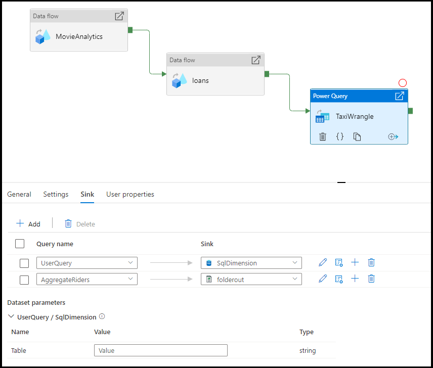

# Power Query activity in Azure Data Factory

The Power Query activity allows you to build and execute Power Query mash-ups to execute data wrangling at scale in a Data Factory pipeline. You can create a new Power Query mash-up from the New resources menu option or by adding a Power Activity to your pipeline.

:::image type="content" source="media/data-flow/power-query-activity-1.png" alt-text="Diagram that shows the General tab of the Power Query activity.":::

You can work directly inside of the Power Query mash-up editor to perform interactive data exploration and then save your work. Once complete, you can take your Power Query activity and add it to a pipeline. Azure Data Factory will automatically scale it out and operationalize your data wrangling using Azure Data Factory's data flow Spark environment.

> [!VIDEO https://www.microsoft.com/en-us/videoplayer/embed/RE4MFYn]

## Create a Power Query activity with UI

To use a Power Query activity in a pipeline, complete the following steps:

1. Search for _Power Query_ in the pipeline Activities pane, and drag a Power Query activity to the pipeline canvas.
1. Select the new Power Query activity on the canvas if it is not already selected, and its  **Settings** tab, to edit its details.

   :::image type="content" source="media/control-flow-power-query-activity/power-query-activity-settings.png" alt-text="Shows the UI for the &nbsp;Settings&nbsp; tab of a Power Query activity.":::

1. Select an existing Power Query and select Open, or select the New button to create a new Power Query, opening the Power Query editor.
  
1. Select an existing dataset or select New to define a new one.  Use the rich features of Power Query directly within the pipeline editing experience to transform the dataset however you require.  You can add multiple queries from multiple datasets in the editor and use them subsequently.

   :::image type="content" source="media/control-flow-power-query-activity/power-query-editor.png" alt-text="Shows the Power Query editor.":::

1. After defining one or more Power Queries in the prior step, you can also designate sink locations for any/all/none of them, on the Sink tab for the Power Query activity. 

   :::image type="content" source="media/control-flow-power-query-activity/power-query-activity-sink.png" alt-text="Shows the Sink tab of the Power Query activity.":::

1. You can also use the output of your Power Query activity as inputs to other activities.  Here is an example of a For Each activity that references the output of the previously defined Power Query for its Items property.  Its Items support dynamic content, where you can reference any outputs from the Power Query used as its input.

   :::image type="content" source="media/control-flow-power-query-activity/for-each-activity-using-power-query-output.png" alt-text="Shows the ForEach Activity's Settings tab with &nbsp;Add dynamic content&nbsp; link for the Items property.":::

1. Any activity outputs are displayed and can be used when defining your dynamic content by selecting them in the **Pipeline expression builder** pane.

   :::image type="content" source="media/control-flow-power-query-activity/using-power-query-output-in-dynamic-content.png" alt-text="Shows the &nbsp;Add dynamic content&nbsp; pane referencing the Power Query defined above.":::

## Translation to data flow script

To achieve scale with your Power Query activity, Azure Data Factory translates your ```M``` script into a data flow script so that you can execute your Power Query at scale using the Azure Data Factory data flow Spark environment. Author your wrangling data flow using code-free data preparation. For the list of available functions, see [transformation functions](wrangling-functions.md).

## Settings

* Power Query: Choose an existing Power Query to execute or create a new one.
* Run on Azure IR: Choose and existing Azure Integration Runtime to define the compute environment for your Power Query, or create a new one.
* Compute type: If you choose the default auto resolve integration runtime, then you can select the compute type to apply to the Spark cluster compute for your Power Query execution.
* Core count: If you choose the default auto resolve integration runtime, then you can select the number of cores to apply to the Spark cluster compute for your Power Query execution.

## Sink

Choose the dataset you wish to use for landing your transformed data once the Power Query M script has been executed on Spark. For more details on configuring sinks, visit the documentation for [data flow sinks](data-flow-sink.md).

You have the option to sink your output to multiple destinations. Click on the plus (+) button to add more sinks to your query. You can also direct each individual query output from your wrangling Power Query activity to different destinations.



## Mapping

In the Mapping tab, you can configure column mapping from the output of your Power Query activity to the target schema of your chosen sink. Read more about column mapping from the [data flow sink mapping documentation](data-flow-sink.md#field-mapping).

## Next steps

Learn more about data wrangling concepts using [Power Query in Azure Data Factory](wrangling-tutorial.md)
