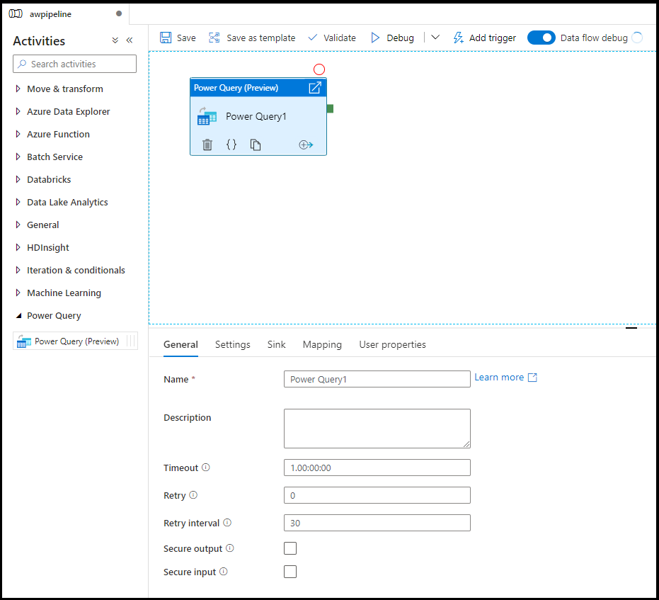

# Power Query activity in Azure Data Factory

The Power Query activity allows you to build and execute Power Query mash-ups to execute data wrangling at scale in a Data Factory pipeline. You can create a new Power Query mash-up from the New resources menu option or by adding a Power Activity to your pipeline.



You can work directly inside of the Power Query mash-up editor to perform interactive data exploration and then save your work. Once complete, you can take your Power Query activity and add it to a pipeline. Azure Data Factory will automatically scale it out and operationalize your data wrangling using Azure Data Factory's data flow Spark environment.

> [!VIDEO https://www.microsoft.com/en-us/videoplayer/embed/RE4MFYn]

## Translation to data flow script

To achieve scale with your Power Query activity, Azure Data Factory translates your ```M``` script into a data flow script so that you can execute your Power Query at scale using the Azure Data Factory data flow Spark environment. Author your wrangling data flow using code-free data preparation. For the list of available functions, see [transformation functions](wrangling-functions.md).

## Settings

* Power Query: Choose an existing Power Query to execute or create a new one.
* Run on Azure IR: Choose and existing Azure Integration Runtime to define the compute environment for your Power Query, or create a new one.
* Compute type: If you choose the default auto resolve integration runtime, then you can select the compute type to apply to the Spark cluster compute for your Power Query execution.
* Core count: If you choose the default auto resolve integration runtime, then you can select the number of cores to apply to the Spark cluster compute for your Power Query execution.

## Sink

Choose the dataset you wish to use for landing your transformed data once the Power Query M script has been executed on Spark. For more details on configuring sinks, visit the documentation for [data flow sinks](data-flow-sink.md).

## Mapping

In the Mapping tab, you can configure column mapping from the output of your Power Query activity to the target schema of your chosen sink. Read more about column mapping from the [data flow sink mapping documentation](data-flow-sink.md#field-mapping).

## Next steps

Learn more about data wrangling concepts using [Power Query in Azure Data Factory](wrangling-tutorial.md)
