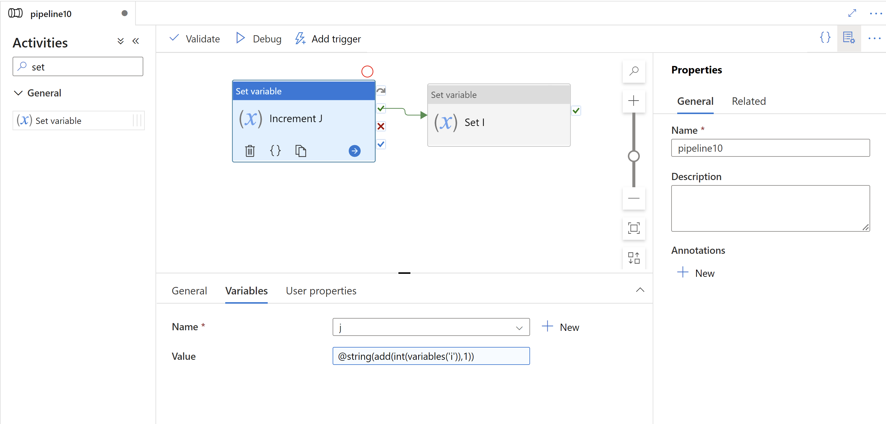

# Set Variable Activity in Azure Data Factory
[!INCLUDE[appliesto-adf-asa-md](includes/appliesto-adf-asa-md.md)]

Use the Set Variable activity to set the value of an existing variable of type String, Bool, or Array defined in a Data Factory pipeline.

## Type properties

Property | Description | Required
-------- | ----------- | --------
name | Name of the activity in pipeline | yes
description | Text describing what the activity does | no
type | Must be set to **SetVariable** | yes
value | String literal or expression object value that the variable is assigned to | yes
variableName | Name of the variable that is set by this activity | yes

## Incrementing a variable

A common scenario involving variables in Azure Data Factory is using a variable as an iterator within an until or foreach activity. In a set variable activity you cannot reference the variable being set in the `value` field. To workaround this limitation, set a temporary variable and then create a second set variable activity. The second set variable activity sets the value of the iterator to the temporary variable. 

Below is an example of this pattern:



``` json
{
    "name": "pipeline3",
    "properties": {
        "activities": [
            {
                "name": "Set I",
                "type": "SetVariable",
                "dependsOn": [
                    {
                        "activity": "Increment J",
                        "dependencyConditions": [
                            "Succeeded"
                        ]
                    }
                ],
                "userProperties": [],
                "typeProperties": {
                    "variableName": "i",
                    "value": {
                        "value": "@variables('j')",
                        "type": "Expression"
                    }
                }
            },
            {
                "name": "Increment J",
                "type": "SetVariable",
                "dependsOn": [],
                "userProperties": [],
                "typeProperties": {
                    "variableName": "j",
                    "value": {
                        "value": "@string(add(int(variables('i')), 1))",
                        "type": "Expression"
                    }
                }
            }
        ],
        "variables": {
            "i": {
                "type": "String",
                "defaultValue": "0"
            },
            "j": {
                "type": "String",
                "defaultValue": "0"
            }
        },
        "annotations": []
    }
}
```


## Next steps
Learn about a related control flow activity supported by Data Factory: 

- [Append Variable Activity](control-flow-append-variable-activity.md)
