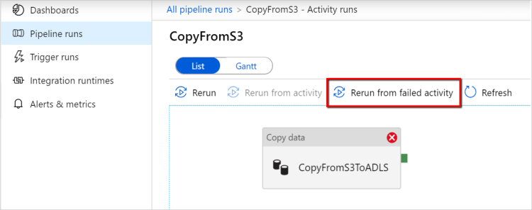

# Copy activity in Azure Data Factory

> [!div class="op_single_selector" title1="Select the version of Data Factory that you're using:"]
> * [Version 1](v1/data-factory-data-movement-activities.md)
> * [Current version](copy-activity-overview.md)

In Azure Data Factory, you can use the Copy activity to copy data among data stores located on-premises and in the cloud. After you copy the data, you can use other activities to further transform and analyze it. You can also use the Copy activity to publish transformation and analysis results for business intelligence (BI) and application consumption.


The Copy activity is executed on an [integration runtime](concepts-integration-runtime.md). You can use different types of integration runtimes for different data copy scenarios:

* When you're copying data between two data stores that are publicly accessible through the internet from any IP, you can use the Azure integration runtime for the copy activity. This integration runtime is secure, reliable, scalable, and [globally available](concepts-integration-runtime.md#integration-runtime-location).
* When you're copying data to and from data stores that are located on-premises or in a network with access control (for example, an Azure virtual network), you need to set up a self-hosted integration runtime.

An integration runtime needs to be associated with each source and sink data store. For information about how the Copy activity determines which integration runtime to use, see [Determining which IR to use](concepts-integration-runtime.md#determining-which-ir-to-use).

To copy data from a source to a sink, the service that runs the Copy activity performs these steps:

1. Reads data from a source data store.
2. Performs serialization/deserialization, compression/decompression, column mapping, and so on. It performs these operations based on the configuration of the input dataset, output dataset, and Copy activity.
3. Writes data to the sink/destination data store.


## Supported data stores and formats

[!INCLUDE [data-factory-v2-supported-data-stores](../../includes/data-factory-v2-supported-data-stores.md)]

### Supported file formats

[!INCLUDE [data-factory-v2-file-formats](../../includes/data-factory-v2-file-formats.md)] 

You can use the Copy activity to copy files as-is between two file-based data stores, in which case the data is copied efficiently without any serialization or deserialization. In addition, you can also parse or generate files of a given format, for example, you can perform the following:

* Copy data from an on-premises SQL Server database and write to Azure Data Lake Storage Gen2 in Parquet format.
* Copy files in text (CSV) format from an on-premises file system and write to Azure Blob storage in Avro format.
* Copy zipped files from an on-premises file system, decompress them on-the-fly, and write extracted files to Azure Data Lake Storage Gen2.
* Copy data in Gzip compressed-text (CSV) format from Azure Blob storage and write it to Azure SQL Database.
* Many more activities that require serialization/deserialization or compression/decompression.

## Supported regions

The service that enables the Copy activity is available globally in the regions and geographies listed in [Azure integration runtime locations](concepts-integration-runtime.md#integration-runtime-location). The globally available topology ensures efficient data movement that usually avoids cross-region hops. See [Products by region](https://azure.microsoft.com/regions/#services) to check the availability of Data Factory and data movement in a specific region.

## Configuration

To use the Copy activity in Azure Data Factory, you need to:

1. **Create linked services for the source data store and the sink data store.** Refer to the connector article's "Linked service properties" section for configuration information and supported properties. You can find the list of supported connectors in the [Supported data stores and formats](#supported-data-stores-and-formats) section of this article.
2. **Create datasets for the source and sink.** Refer to the "Dataset properties" sections of the source and sink connector articles for configuration information and supported properties.
3. **Create a pipeline with the Copy activity.** The next section provides an example.

### Syntax

The following template of a Copy activity contains a complete list of supported properties. Specify the ones that fit your scenario.

```json
"activities":[
    {
        "name": "CopyActivityTemplate",
        "type": "Copy",
        "inputs": [
            {
                "referenceName": "<source dataset name>",
                "type": "DatasetReference"
            }
        ],
        "outputs": [
            {
                "referenceName": "<sink dataset name>",
                "type": "DatasetReference"
            }
        ],
        "typeProperties": {
            "source": {
                "type": "<source type>",
                <properties>
            },
            "sink": {
                "type": "<sink type>"
                <properties>
            },
            "translator":
            {
                "type": "TabularTranslator",
                "columnMappings": "<column mapping>"
            },
            "dataIntegrationUnits": <number>,
            "parallelCopies": <number>,
            "enableStaging": true/false,
            "stagingSettings": {
                <properties>
            },
            "enableSkipIncompatibleRow": true/false,
            "redirectIncompatibleRowSettings": {
                <properties>
            }
        }
    }
]
```

#### Syntax details

| Property | Description | Required? |
|:--- |:--- |:--- |
| type | For a Copy activity, set to `Copy` | Yes |
| inputs | Specify the dataset that you created that points to the source data. The Copy activity supports only a single input. | Yes |
| outputs | Specify the dataset that you created that points to the sink data. The Copy activity supports only a single output. | Yes |
| typeProperties | Specify properties to configure the Copy activity. | Yes |
| source | Specify the copy source type and the corresponding properties for retrieving data.<br/>For more information, see the "Copy activity properties" section in the connector article listed in [Supported data stores and formats](#supported-data-stores-and-formats). | Yes |
| sink | Specify the copy sink type and the corresponding properties for writing data.<br/>For more information, see the "Copy activity properties" section in the connector article listed in [Supported data stores and formats](#supported-data-stores-and-formats). | Yes |
| translator | Specify explicit column mappings from source to sink. This property applies when the default copy behavior doesn't meet your needs.<br/>For more information, see [Schema mapping in copy activity](copy-activity-schema-and-type-mapping.md). | No |
| dataIntegrationUnits | Specify a measure that represents the amount of power that the [Azure integration runtime](concepts-integration-runtime.md) uses for data copy. These units were formerly known as cloud Data Movement Units (DMU). <br/>For more information, see [Data Integration Units](copy-activity-performance.md#data-integration-units). | No |
| parallelCopies | Specify the parallelism that you want the Copy activity to use when reading data from the source and writing data to the sink.<br/>For more information, see [Parallel copy](copy-activity-performance.md#parallel-copy). | No |
| preserve | Specify whether to preserve metadata/ACLs during data copy. <br/>For more information, see [Preserve metadata](copy-activity-preserve-metadata.md). |No |
| enableStaging<br/>stagingSettings | Specify whether to stage the interim data in Blob storage instead of directly copying data from source to sink.<br/>For information about useful scenarios and configuration details, see [Staged copy](copy-activity-performance.md#staged-copy). | No |
| enableSkipIncompatibleRow<br/>redirectIncompatibleRowSettings| Choose how to handle incompatible rows when you copy data from source to sink.<br/>For more information, see [Fault tolerance](copy-activity-fault-tolerance.md). | No |

## Monitoring

You can monitor the Copy activity run in the Azure Data Factory **Author & Monitor** UI or programmatically.

### Monitor visually

To visually monitor the Copy activity run, go to your data factory and then go to **Author & Monitor**. On the **Monitor** tab, you see a list of pipeline runs with a **View Activity Run** button in the **Actions** column:


Select **View Activity Runs** to see the list of activities in the pipeline run. In the **Actions** column, you see links to the Copy activity input, output, errors (if the Copy activity run fails), and details:


Select the **Details** button in the **Actions** column to see the Copy activity's execution details and performance characteristics. You see information like volume/number of rows/number of files of data copied from source to sink, throughput, steps the Copy activity goes through with corresponding durations, and configurations used for your copy scenario.

>[!TIP]
>In some scenarios, you'll also see **Performance tuning tips** at the top of the copy monitoring page. These tips tell you about identified bottlenecks and provide information on what to change to boost copy throughput. For an example, see the [Performance and tuning](#performance-and-tuning) section of this article.

**Example: Copy from Amazon S3 to Azure Data Lake Store**


**Example: Copy from Azure SQL Database to Azure SQL Data Warehouse with staged copy**


### Monitor programmatically

Copy activity execution details and performance characteristics are also returned in the **Copy Activity run result** > **Output** section. Following is a complete list of properties that might be returned. You'll see only the properties that are applicable to your copy scenario. For information about how to monitor activity runs, see [Monitor a pipeline run](quickstart-create-data-factory-dot-net.md#monitor-a-pipeline-run).

| Property name  | Description | Unit |
|:--- |:--- |:--- |
| dataRead | Amount of data read from source. | Int64 value, in bytes |
| dataWritten | Amount of data written to sink. | Int64 value, in bytes |
| filesRead | Number of files copied during copy from file storage. | Int64 value (no unit) |
| filesWritten | Number of files copied during copy to file storage. | Int64 value (no unit) |
| sourcePeakConnections | Peak number of concurrent connections established to the source data store during the Copy activity run. | Int64 value (no unit) |
| sinkPeakConnections | Peak number of concurrent connections established to the sink data store during the Copy activity run. | Int64 value (no unit) |
| rowsRead | Number of rows read from the source (not applicable for binary copy). | Int64 value (no unit) |
| rowsCopied | Number of rows copied to sink (not applicable for binary copy). | Int64 value (no unit) |
| rowsSkipped | Number of incompatible rows that were skipped. You can enable incompatible rows to be skipped by setting `enableSkipIncompatibleRow` to true. | Int64 value (no unit) |
| copyDuration | Duration of the copy run. | Int32 value, in seconds |
| throughput | Rate of data transfer. | Floating point number, in KBps |
| sourcePeakConnections | Peak number of concurrent connections established to the source data store during the Copy activity run. | Int32 value (no unit) |
| sinkPeakConnections| Peak number of concurrent connections established to the sink data store during the Copy activity run.| Int32 value (no unit) |
| sqlDwPolyBase | Whether PolyBase is used when data is copied into SQL Data Warehouse. | Boolean |
| redshiftUnload | Whether UNLOAD is used when data is copied from Redshift. | Boolean |
| hdfsDistcp | Whether DistCp is used when data is copied from HDFS. | Boolean |
| effectiveIntegrationRuntime | The integration runtime (IR) or runtimes used to power the activity run, in the format `<IR name> (<region if it's Azure IR>)`. | Text (string) |
| usedDataIntegrationUnits | The effective Data Integration Units during copy. | Int32 value |
| usedParallelCopies | The effective parallelCopies during copy. | Int32 value |
| redirectRowPath | Path to the log of skipped incompatible rows in the blob storage you configure in the `redirectIncompatibleRowSettings` property. See [Fault tolerance](#fault-tolerance) later in this article. | Text (string) |
| executionDetails | More details on the stages the Copy activity goes through and the corresponding steps, durations, configurations, and so on. We don't recommend that you parse this section because it might change.<br/><br/>Data Factory also reports the detailed durations (in seconds) spent on various stages under `detailedDurations`. The durations of these steps are exclusive. Only durations that apply to the given Copy activity run appear:<br/>**Queuing duration** (`queuingDuration`): The amount of time before the Copy activity actually starts on the integration runtime. If you use a self-hosted IR and this value is large, check the IR capacity and usage, and scale up or out according to your workload. <br/>**Pre-copy script duration** (`preCopyScriptDuration`): The time elapsed between when the Copy activity starts on the IR and when the Copy activity finishes running the pre-copy script in the sink data store. Applies when you configure the pre-copy script. <br/>**Time to first byte** (`timeToFirstByte`): The time elapsed between the end of the previous step and the time when the IR receives the first byte from the source data store. Applies to non-file-based sources. If this value is large, check and optimize the query or server.<br/>**Transfer duration** (`transferDuration`): The time elapsed between the end of the previous step and the time when the IR transfers all the data from source to sink. | Array |
| perfRecommendation | Copy performance tuning tips. See [Performance and tuning](#performance-and-tuning) for details. | Array |

```json
"output": {
    "dataRead": 6198358,
    "dataWritten": 19169324,
    "filesRead": 1,
    "sourcePeakConnections": 1,
    "sinkPeakConnections": 2,
    "rowsRead": 39614,
    "rowsCopied": 39614,
    "copyDuration": 1325,
    "throughput": 4.568,
    "errors": [],
    "effectiveIntegrationRuntime": "DefaultIntegrationRuntime (West US)",
    "usedDataIntegrationUnits": 4,
    "usedParallelCopies": 1,
    "executionDetails": [
        {
            "source": {
                "type": "AzureBlobStorage"
            },
            "sink": {
                "type": "AzureSqlDatabase"
            },
            "status": "Succeeded",
            "start": "2019-08-06T01:01:36.7778286Z",
            "duration": 1325,
            "usedDataIntegrationUnits": 4,
            "usedParallelCopies": 1,
            "detailedDurations": {
                "queuingDuration": 2,
                "preCopyScriptDuration": 12,
                "transferDuration": 1311
            }
        }
    ],
    "perfRecommendation": [
        {
            "Tip": "Sink Azure SQL Database: The DTU utilization was high during the copy activity run. To achieve better performance, you are suggested to scale the database to a higher tier than the current 1600 DTUs.",
            "ReferUrl": "https://go.microsoft.com/fwlink/?linkid=2043368",
            "RuleName": "AzureDBTierUpgradePerfRecommendRule"
        }
    ]
}
```

## Incremental copy

Data Factory enables you to incrementally copy delta data from a source data store to a sink data store. For details, see [Tutorial: Incrementally copy data](tutorial-incremental-copy-overview.md).

## Performance and tuning

The [Copy activity performance and scalability guide](copy-activity-performance.md) describes key factors that affect the performance of data movement via the Copy activity in Azure Data Factory. It also lists the performance values observed during testing and discusses how to optimize the performance of the Copy activity.

In some scenarios, when you run a Copy activity in Data Factory, you'll see **Performance tuning tips** at the top of the [Copy activity monitoring page](#monitor-visually), as shown in the following example. The tips tell you the bottleneck identified for the given copy run. They also provide information on what to change to boost copy throughput. The performance tuning tips currently provide suggestions like using PolyBase when copying data into Azure SQL Data Warehouse, increasing Azure Cosmos DB RUs or Azure SQL Database DTUs when the resource on the data store side is the bottleneck, and removing unnecessary staged copies.

**Example: Copy into Azure SQL Database, with a performance tuning tip**

In this sample, during a copy run, Data Factory tracks a high DTU utilization in the sink Azure SQL Database. This condition slows down write operations. The suggestion is to increase the DTUs on the Azure SQL Database tier:


## Resume from last failed run

Copy activity supports resume from last failed run when you copy large size of files as-is with binary format between file-based stores and choose to preserve the folder/file hierarchy from source to sink, e.g. to migrate data from Amazon S3 to Azure Data Lake Storage Gen2. It applies to the following file-based connectors: [Amazon S3](connector-amazon-simple-storage-service.md), [Azure Blob](connector-azure-blob-storage.md), [Azure Data Lake Storage Gen1](connector-azure-data-lake-store.md), [Azure Data Lake Storage Gen2](connector-azure-data-lake-storage.md), [Azure File Storage](connector-azure-file-storage.md), [File System](connector-file-system.md), [FTP](connector-ftp.md), [Google Cloud Storage](connector-google-cloud-storage.md), [HDFS](connector-hdfs.md), and [SFTP](connector-sftp.md).

You can leverage the copy activity resume in the following two ways:

- **Activity level retry:** You can set retry count on copy activity. During the pipeline execution, if this copy activity run fails, the next automatic retry will start from last trial's failure point.
- **Rerun from failed activity:** After pipeline execution completion, you can also trigger a rerun from the failed activity in the ADF UI monitoring view or programmatically. If the failed activity is a copy activity, the pipeline will not only rerun from this activity, but also resume from the previous run's failure point.

    

Few points to note:

- Resume happens at file level. If copy activity fails when copying a file, in next run, this specific file will be re-copied.
- For resume to work properly, do not change the copy activity settings between the reruns.
- When you copy data from Amazon S3, Azure Blob, Azure Data Lake Storage Gen2 and Google Cloud Storage, copy activity can resume from arbitrary number of copied files. While for the rest of file-based connectors as source, currently copy activity supports resume from a limited number of files, usually at the range of tens of thousands and varies depending on the length of the file paths; files beyond this number will be re-copied during reruns.

For other scenarios than binary file copy, copy activity rerun starts from the beginning.

## Preserve metadata along with data

While copying data from source to sink, in scenarios like data lake migration, you can also choose to preserve the metadata and ACLs along with data using copy activity. See [Preserve metadata](copy-activity-preserve-metadata.md) for details.

## Schema and data type mapping

See [Schema and data type mapping](copy-activity-schema-and-type-mapping.md) for information about how the Copy activity maps your source data to your sink.

## Fault tolerance

By default, the Copy activity stops copying data and returns a failure when source data rows are incompatible with sink data rows. To make the copy succeed, you can configure the Copy activity to skip and log the incompatible rows and copy only the compatible data. See [Copy activity fault tolerance](copy-activity-fault-tolerance.md) for details.

## Next steps
See the following quickstarts, tutorials, and samples:

- [Copy data from one location to another location in the same Azure Blob storage account](quickstart-create-data-factory-dot-net.md)
- [Copy data from Azure Blob storage to Azure SQL Database](tutorial-copy-data-dot-net.md)
- [Copy data from an on-premises SQL Server database to Azure](tutorial-hybrid-copy-powershell.md)
