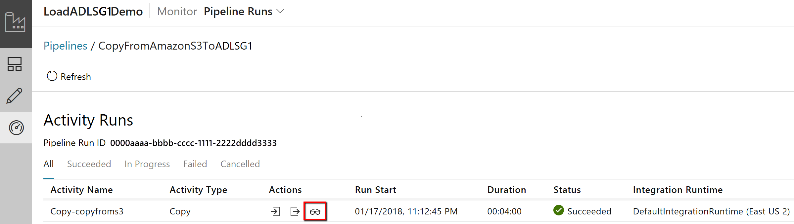

# Copy Activity in Azure Data Factory

## Overview

> [!div class="op_single_selector" title1="Select the version of Data Factory service you are using:"]
> * [Version 1](v1/data-factory-data-movement-activities.md)
> * [Current version](copy-activity-overview.md)

In Azure Data Factory, you can use Copy Activity to copy data among data stores located on-premises and in the cloud. After the data is copied, it can be further transformed and analyzed using other activities. You can also use Copy Activity to publish transformation and analysis results for business intelligence (BI) and application consumption.


Copy Activity is executed on an [Integration Runtime](concepts-integration-runtime.md). For different data copy scenario, different flavors of Integration Runtime can be leveraged:

* When copying data between data stores that both are publicly accessible through the internet from any IPs, copy activity can be empowered by **Azure Integration Runtime**, which is secure, reliable, scalable, and [globally available](concepts-integration-runtime.md#integration-runtime-location).
* When copying data from/to data stores located on-premises or in a network with access control (for example, Azure Virtual Network), you need to set up a **self-hosted Integrated Runtime** to empower data copy.

Integration Runtime needs to be associated with each source and sink data store. Learn details on how copy activity [determines which IR to use](concepts-integration-runtime.md#determining-which-ir-to-use).

Copy Activity goes through the following stages to copy data from a source to a sink. The service that powers Copy Activity:

1. Reads data from a source data store.
2. Performs serialization/deserialization, compression/decompression, column mapping, etc. It does these operations based on the configurations of the input dataset, output dataset, and Copy Activity.
3. Writes data to the sink/destination data store.


## Supported data stores and formats

[!INCLUDE [data-factory-v2-supported-data-stores](../../includes/data-factory-v2-supported-data-stores.md)]

### Supported file formats

You can use Copy Activity to **copy files as-is** between two file-based data stores, in which case the data is copied efficiently without any serialization/deserialization.

Copy Activity also supports reading from and writing to files in specified formats: **Text, JSON, Avro, ORC, and Parquet**, and compressing and decompressing files with the following codecs: **GZip, Deflate, BZip2, and ZipDeflate**. See [Supported file and compression formats](supported-file-formats-and-compression-codecs.md) with details.

For example, you can do the following copy activities:

* Copy data in on-premises SQL Server and write to Azure Data Lake Storage Gen2 in Parquet format.
* Copy files in text (CSV) format from on-premises File System and write to Azure Blob in Avro format.
* Copy zipped files from on-premises File System and decompress then land to Azure Data Lake Storage Gen2.
* Copy data in GZip compressed text (CSV) format from Azure Blob and write to Azure SQL Database.
* And many more cases with serialization/deserialization or compression/decompression need.

## Supported regions

The service that powers Copy Activity is available globally in the regions and geographies listed in [Azure Integration Runtime locations](concepts-integration-runtime.md#integration-runtime-location). The globally available topology ensures efficient data movement that usually avoids cross-region hops. See [Services by region](https://azure.microsoft.com/regions/#services) for availability of Data Factory and Data Movement in a region.

## Configuration

To use copy activity in Azure Data Factory, you need to:

1. **Create linked services for source data store and sink data store.** Refer to the connector article's "Linked service properties" section on how to configure and the supported properties. You can find the supported connector list in [Supported data stores and formats](#supported-data-stores-and-formats) section.
2. **Create datasets for source and sink.** Refer to the source and sink connector articles' "Dataset properties" section on how to configure and its supported properties.
3. **Create a pipeline with copy activity.** The next section provides an example.

### Syntax

The following template of a copy activity contains an exhaustive list of supported properties. Specify the ones that fit your scenario.

```json
"activities":[
    {
        "name": "CopyActivityTemplate",
        "type": "Copy",
        "inputs": [
            {
                "referenceName": "<source dataset name>",
                "type": "DatasetReference"
            }
        ],
        "outputs": [
            {
                "referenceName": "<sink dataset name>",
                "type": "DatasetReference"
            }
        ],
        "typeProperties": {
            "source": {
                "type": "<source type>",
                <properties>
            },
            "sink": {
                "type": "<sink type>"
                <properties>
            },
            "translator":
            {
                "type": "TabularTranslator",
                "columnMappings": "<column mapping>"
            },
            "dataIntegrationUnits": <number>,
            "parallelCopies": <number>,
            "enableStaging": true/false,
            "stagingSettings": {
                <properties>
            },
            "enableSkipIncompatibleRow": true/false,
            "redirectIncompatibleRowSettings": {
                <properties>
            }
        }
    }
]
```

### Syntax details

| Property | Description | Required |
|:--- |:--- |:--- |
| type | The type property of a copy activity must be set to: **Copy** | Yes |
| inputs | Specify the dataset you created which points to the source data. Copy activity supports only a single input. | Yes |
| outputs | Specify the dataset you created which points to the sink data. Copy activity supports only a single output. | Yes |
| typeProperties | A group of properties to configure copy activity. | Yes |
| source | Specify the copy source type and the corresponding properties on how to retrieve data.<br/><br/>Learn details from the "Copy activity properties" section in connector article listed in [Supported data stores and formats](#supported-data-stores-and-formats). | Yes |
| sink | Specify the copy sink type and the corresponding properties on how to write data.<br/><br/>Learn details from the "Copy activity properties" section in connector article listed in [Supported data stores and formats](#supported-data-stores-and-formats). | Yes |
| translator | Specify explicit column mappings from source to sink. Applies when the default copy behavior cannot fulfill your need.<br/><br/>Learn details from [Schema and data type mapping](copy-activity-schema-and-type-mapping.md). | No |
| dataIntegrationUnits | Specify the powerfulness of [Azure Integration Runtime](concepts-integration-runtime.md) to empower data copy. Formerly known as cloud Data Movement Units (DMU). <br/><br/>Learn details from [Data Integration Units](copy-activity-performance.md#data-integration-units). | No |
| parallelCopies | Specify the parallelism that you want Copy Activity to use when reading data from source and writing data to sink.<br/><br/>Learn details from [Parallel copy](copy-activity-performance.md#parallel-copy). | No |
| enableStaging<br/>stagingSettings | Choose to stage the interim data in a blob storage instead of directly copy data from source to sink.<br/><br/>Learn the useful scenarios and configuration details from [Staged copy](copy-activity-performance.md#staged-copy). | No |
| enableSkipIncompatibleRow<br/>redirectIncompatibleRowSettings| Choose how to handle incompatible rows when copying data from source to sink.<br/><br/>Learn details from [Fault tolerance](copy-activity-fault-tolerance.md). | No |

## Monitoring

You can monitor the copy activity run on Azure Data Factory "Author & Monitor" UI or programmatically. You can then compare the performance and configuration of your scenario to Copy Activity's [performance reference](copy-activity-performance.md#performance-reference) from in-house testing.

### Monitor visually

To visually monitor the copy activity run, go to your data factory -> **Author & Monitor** -> **Monitor tab**, you see a list of pipeline runs with a "View Activity Runs" link in the **Actions** column.


Click to see the list of activities in this pipeline run. In the **Actions** column, you have links to the copy activity input, output, errors (if copy activity run fails), and details.



Click the "**Details**" link under **Actions** to see copy activity's execution details and performance characteristics. It shows you information including volume/rows/files of data copied from source to sink, throughput, steps it goes through with corresponding duration and used configurations for your copy scenario.

>[!TIP]
>For some scenarios, you will also see "**Performance tuning tips**" on top of the copy monitoring page,  which tells you the bottleneck identified and guides you on what to change so as to boost copy throughput, see an example with details [here](#performance-and-tuning).

**Example: copy from Amazon S3 to Azure Data Lake Store**


**Example: copy from Azure SQL Database to Azure SQL Data Warehouse using staged copy**


### Monitor programmatically

Copy activity execution details and performance characteristics are also returned in the Copy Activity run result -> Output section. Below is an exhaustive list; only the applicable ones to your copy scenario will show up. Learn how to monitor activity run from [quickstart monitoring section](quickstart-create-data-factory-dot-net.md#monitor-a-pipeline-run).

| Property name  | Description | Unit |
|:--- |:--- |:--- |
| dataRead | Data size read from source | Int64 value in **bytes** |
| dataWritten | Data size written to sink | Int64 value in **bytes** |
| filesRead | Number of files being copied when copying data from file storage. | Int64 value (no unit) |
| filesWritten | Number of files being copied when copying data to file storage. | Int64 value (no unit) |
| sourcePeakConnections | Number of max concurrent connections established to source data store during the copy activity run. | Int64 value (no unit) |
| sinkPeakConnections | Number of max concurrent connections established to sink data store during the copy activity run. | Int64 value (no unit) |
| rowsRead | Number of rows being read from source (not applicable for binary copy). | Int64 value (no unit) |
| rowsCopied | Number of rows being copied to sink (not applicable for binary copy). | Int64 value (no unit) |
| rowsSkipped | Number of incompatible rows being skipped. You can turn on the feature by set "enableSkipIncompatibleRow" to true. | Int64 value (no unit) |
| copyDuration | The duration of the copy. | Int32 value in seconds |
| throughput | Ratio at which data are transferred. | Floating point number in **KB/s** |
| sourcePeakConnections | Peak number of concurrent connections established to the source data store during copy. | Int32 value |
| sinkPeakConnections| Peak number of concurrent connections established to the sink data store during copy.| Int32 value |
| sqlDwPolyBase | If PolyBase is used when copying data into SQL Data Warehouse. | Boolean |
| redshiftUnload | If UNLOAD is used when copying data from Redshift. | Boolean |
| hdfsDistcp | If DistCp is used when copying data from HDFS. | Boolean |
| effectiveIntegrationRuntime | Show which Integration Runtime(s) is used to empower the activity run, in the format of `<IR name> (<region if it's Azure IR>)`. | Text (string) |
| usedDataIntegrationUnits | The effective Data Integration Units during copy. | Int32 value |
| usedParallelCopies | The effective parallelCopies during copy. | Int32 value |
| redirectRowPath | Path to the log of skipped incompatible rows in the blob storage you configure under "redirectIncompatibleRowSettings". See below example. | Text (string) |
| executionDetails | More details on the stages copy activity goes through, and the corresponding steps, duration, used configurations, etc. It's not recommended to parse this section as it may change.<br/><br/>ADF also reports the detailed durations (in seconds) spent on respective steps under `detailedDurations`. The durations of these steps are exclusive and only those that apply to the given copy activity run would show up:<br/>- **Queuing duration** (`queuingDuration`): The elapsed time until the copy activity actually starts on the integration runtime. If you use Self-hosted IR and this value is large, suggest to check the IR capacity and usage, and scale up/out according to your workload. <br/>- **Pre-copy script duration** (`preCopyScriptDuration`): The elapsed time between copy activity starting on IR and copy activity finishing executing the pre-copy script in sink data store. Apply when you configure the pre-copy script. <br/>- **Time-to-first-byte** (`timeToFirstByte`): The elapsed time between the end of the previous step and the IR receiving the first byte from the source data store. Apply to non-file-based source. If this value is large, suggest to check and optimize the query or server.<br/>- **Transfer duration** (`transferDuration`): The elapsed time between the end of the previous step and the IR transferring all the data from source to sink. | Array |
| perfRecommendation | Copy performance tuning tips. See [Performance and tuning](#performance-and-tuning) section on details. | Array |

```json
"output": {
    "dataRead": 6198358,
    "dataWritten": 19169324,
    "filesRead": 1,
    "sourcePeakConnections": 1,
    "sinkPeakConnections": 2,
    "rowsRead": 39614,
    "rowsCopied": 39614,
    "copyDuration": 1325,
    "throughput": 4.568,
    "errors": [],
    "effectiveIntegrationRuntime": "DefaultIntegrationRuntime (West US)",
    "usedDataIntegrationUnits": 4,
    "usedParallelCopies": 1,
    "executionDetails": [
        {
            "source": {
                "type": "AzureBlobStorage"
            },
            "sink": {
                "type": "AzureSqlDatabase"
            },
            "status": "Succeeded",
            "start": "2019-08-06T01:01:36.7778286Z",
            "duration": 1325,
            "usedDataIntegrationUnits": 4,
            "usedParallelCopies": 1,
            "detailedDurations": {
                "queuingDuration": 2,
                "preCopyScriptDuration": 12,
                "transferDuration": 1311
            }
        }
    ],
    "perfRecommendation": [
        {
            "Tip": "Sink Azure SQL Database: The DTU utilization was high during the copy activity run. To achieve better performance, you are suggested to scale the database to a higher tier than the current 1600 DTUs.",
            "ReferUrl": "https://go.microsoft.com/fwlink/?linkid=2043368",
            "RuleName": "AzureDBTierUpgradePerfRecommendRule"
        }
    ]
}
```

## Schema and data type mapping

See the [Schema and data type mapping](copy-activity-schema-and-type-mapping.md), which describes how copy activity maps your source data to sink.

## Fault tolerance

By default, copy activity stops copying data and returns a failure when it encounters incompatible data between source and sink. You can explicitly configure to skip and log the incompatible rows and only copy those compatible data to make the copy succeeded. See the [Copy Activity fault tolerance](copy-activity-fault-tolerance.md) on more details.

## Performance and tuning

See the [Copy Activity performance and tuning guide](copy-activity-performance.md), which describes key factors that affect the performance of data movement (Copy Activity) in Azure Data Factory. It also lists the observed performance during internal testing and discusses various ways to optimize the performance of Copy Activity.

In some cases, when you execute a copy activity in ADF, you will directly see "**Performance tuning tips**" on top of the [copy activity monitoring page](#monitor-visually) as shown in the following example. It not only tells you the bottleneck identified for the given copy run, but also guides you on what to change so as to boost copy throughput. The performance tuning tips currently provide suggestions like to use PolyBase when copying data into Azure SQL Data Warehouse, to increase Azure Cosmos DB RU or Azure SQL DB DTU when the resource on data store side is the bottleneck, to remove the unnecessary staged copy, etc. The performance tuning rules will be gradually enriched as well.

**Example: copy into Azure SQL DB with performance tuning tips**

In this sample, during copy run, ADF notices that the sink Azure SQL DB reaches a high DTU utilization which slows down the write operations, so the suggestion is to increase the Azure SQL DB tier with more DTU.


## Incremental copy
Data Factory supports scenarios for incrementally copying delta data from a source data store to a sink data store. See [Tutorial: incrementally copy data](tutorial-incremental-copy-overview.md).

## Read and write partitioned data
In version 1, Azure Data Factory supported reading or writing partitioned data by using SliceStart/SliceEnd/WindowStart/WindowEnd system variables. In the current version, you can achieve this behavior by using a pipeline parameter and trigger's start time/scheduled time as a value of the parameter. For more information, see [How to read or write partitioned data](how-to-read-write-partitioned-data.md).

## Next steps
See the following quickstarts, tutorials, and samples:

- [Copy data from one location to another location in the same Azure Blob Storage](quickstart-create-data-factory-dot-net.md)
- [Copy data from Azure Blob Storage to Azure SQL Database](tutorial-copy-data-dot-net.md)
- [Copy data from on-premises SQL Server to Azure](tutorial-hybrid-copy-powershell.md)
