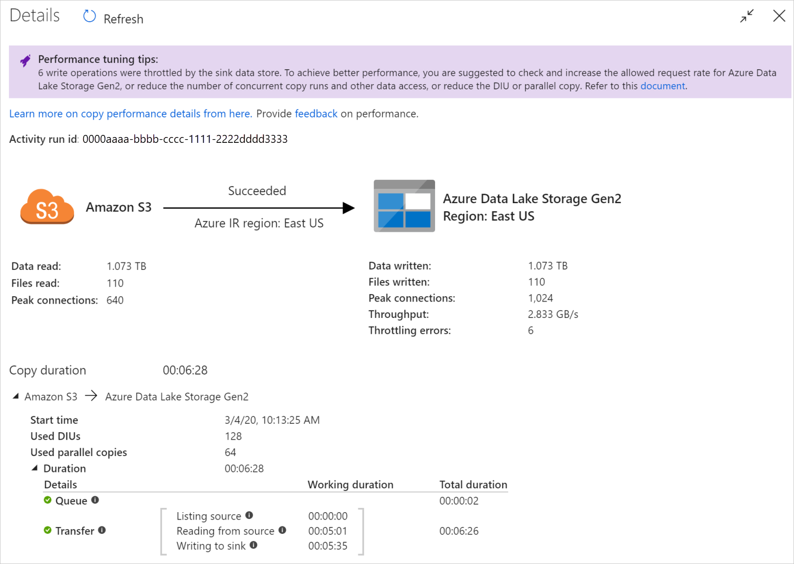

# Troubleshoot copy activity performance

[!INCLUDE[appliesto-adf-asa-md](includes/appliesto-adf-asa-md.md)]

This article outlines how to troubleshoot copy activity performance issue in Azure Data Factory. 

After you run a copy activity, you can collect the run result and performance statistics in [copy activity monitoring](copy-activity-monitoring.md) view. The following is an example.

## Performance tuning tips

In some scenarios, when you run a copy activity in Data Factory, you'll see **"Performance tuning tips"** at the top as shown in the above example. The tips tell you the bottleneck identified by ADF for this particular copy run, along with suggestion on how to boost copy throughput. Try making the recommanded change, then run the copy again.

As a reference, currently the performance tuning tips provide suggestions for the following cases:

| Category              | Performance tuning tips                                      |
| --------------------- | ------------------------------------------------------------ |
| Data store specific   | Loading data into **Azure Synpase Analytics (formerly SQL DW)**: suggest using PolyBase or COPY statement if it's not used. |
| &nbsp;                | Copying data from/to **Azure SQL Database**: when DTU is under high utilization, suggest upgrading to higher tier. |
| &nbsp;                | Copying data from/to **Azure Cosmos DB**: when RU is under high utilization, suggest upgrading to larger RU. |
|                       | Copying data from **SAP Table**: when copying large amount of data, suggest to leverage SAP connector's partition option to enable parallel load and increase the max partition number. |
| &nbsp;                | Ingesting data from **Amazon Redshift**: suggest using UNLOAD if it's not used. |
| Data store throttling | If a number of read/write operations are throttled by the data store during copy, suggest checking and increase the allowed request rate for the data store, or reduce the concurrent workload. |
| Integration  runtime  | If you use a **Self-hosted Integration Runtime (IR)** and copy activity waits long in the queue until the IR has available resource to execute, suggest scaling out/up your IR. |
| &nbsp;                | If you use an **Azure Integration Runtime** that is in a not optimal region resulting in slow read/write, suggest configuring to use an IR in another region. |
| Fault tolerance       | If you configure fault tolerance and skipping incompatible rows results in slow performance, suggest ensuring source and sink data are compatible. |
| Staged copy           | If staged copy is configured but not helpful for your source-sink pair, suggest removing it. |
| Resume                | When copy activity is resumed from last failure point but you happen to change the DIU setting after the original run, note the new DIU setting doesn't take effect. |

## Understand copy activity execution details

The execution details and durations at the bottom of the copy activity monitoring view describes the key stages your copy activity goes through (see example at the beginning of this article), which is especially useful for troubleshooting the copy performance. The bottleneck of your copy run is the one with the longest duration. Refer to the following table on each stage's definition, and learn how to [Troubleshoot copy activity on Azure IR](#troubleshoot-copy-activity-on-azure-ir) and [Troubleshoot copy activity on Self-hosted IR](#troubleshoot-copy-activity-on-self-hosted-ir) with such info.

| Stage           | Description                                                  |
| --------------- | ------------------------------------------------------------ |
| Queue           | The elapsed time until the copy activity actually starts on the integration runtime. |
| Pre-copy script | The elapsed time between copy activity starting on IR and copy activity finishing executing the pre-copy script in sink data store. Apply when you configure the pre-copy script for database sinks, e.g. when writing data into Azure SQL Database do clean up before copy new data. |
| Transfer        | The elapsed time between the end of the previous step and the IR transferring all the data from source to sink.  Note the sub-steps under transfer run in parallel, and some operations are not shown now e.g. parsing/generating file format.  - **Time to first byte:** The time elapsed between the end of the previous step and the time when the IR receives the first byte from the source data store. Applies to non-file-based sources. - **Listing source:** The amount of time spent on enumerating source files or data partitions. The latter applies when you configure partition options for database sources, e.g. when copy data from databases like Oracle/SAP HANA/Teradata/Netezza/etc. -**Reading from source:** The amount of time spent on retrieving data from source data store. - **Writing to sink:** The amount of time spent on writing data to sink data store. Note some connectors do not have this metric at the moment, including Azure Cognitive Search, Azure Data Explorer, Azure Table storage, Oracle, SQL Server, Common Data Service, Dynamics 365, Dynamics CRM, Salesforce/Salesforce Service Cloud. |

## Troubleshoot copy activity on Azure IR

Follow the [Performance tuning steps](copy-activity-performance.md#performance-tuning-steps) to plan and conduct performance test for your scenario. 

When the copy activity performance doesn't meet your expectation, to troubleshoot single copy activity running on Azure Integration Runtime, if you see [performance tuning tips](#performance-tuning-tips) shown up in the copy monitoring view, apply the suggestion and try again. Otherwise, [understand copy activity execution details](#understand-copy-activity-execution-details), check which stage has the **longest** duration, and apply the guidance below to boost copy performance:

- **"Pre-copy script" experienced long duration:** it means the pre-copy script running on sink database takes long to finish. Tune the specified pre-copy script logic to enhance the performance. If you need further help on improving the script, contact your database team.

- **"Transfer - Time to first byte" experienced long working duration**: it means your source query takes long to return any data. Check and optimize the query or server. If you need further help, contact your data store team.

- **"Transfer - Listing source" experienced long working duration**: it means enumerating source files or source database data partitions is slow.
  - When copying data from file-based source, if you use **wildcard filter** on folder path or file name (`wildcardFolderPath` or `wildcardFileName`), or use **file last modified time filter** (`modifiedDatetimeStart` or`modifiedDatetimeEnd`), note such filter would result in copy activity listing all the files under the specified folder to client side then apply the filter. Such file enumeration could become the bottleneck especially when only small set of files met the filter rule.

    - Check whether you can [copy files based on datetime partitioned file path or name](tutorial-incremental-copy-partitioned-file-name-copy-data-tool.md). Such way doesn't bring burden on listing source side.

    - Check if you can use data store's native filter instead, specifically "**prefix**" for Amazon S3 and Azure Blob. Prefix filter is a data store server-side filter and would have much better performance.

    - Consider to split single large data set into several smaller data sets, and let those copy jobs run concurrently each tackles portion of data. You can do this with Lookup/GetMetadata + ForEach + Copy. Refer to [Copy files from multiple containers](solution-template-copy-files-multiple-containers.md) or [Migrate data from Amazon S3 to ADLS Gen2](solution-template-migration-s3-azure.md) solution templates as general example.

  - Check if ADF reports any throttling error on source or if your data store is under high utilization state. If so, either reduce your workloads on the data store, or try contacting your data store administrator to increase the throttling limit or available resource.

  - Use Azure IR in the same or close to your source data store region.

- **"Transfer - reading from source" experienced long working duration**: 

  - Adopt connector-specific data loading best practice if applies. For example, when copying data from [Amazon Redshift](connector-amazon-redshift.md), configure to use Redshift UNLOAD.

  - Check if ADF reports any throttling error on source or if your data store is under high utilization. If so, either reduce your workloads on the data store, or try contacting your data store administrator to increase the throttling limit or available resource.

  - Check your copy source and sink pattern: 

    - If your copy pattern supports larger than 4 Data Integration Units (DIUs) - refer to [this section](copy-activity-performance-features.md#data-integration-units) on details, generally you can try increasing DIUs to get better performance. 

    - Otherwise, consider to split single large data set into several smaller data sets, and let those copy jobs run concurrently each tackles portion of data. You can do this with Lookup/GetMetadata + ForEach + Copy. Refer to [Copy files from multiple containers](solution-template-copy-files-multiple-containers.md), [Migrate data from Amazon S3 to ADLS Gen2](solution-template-migration-s3-azure.md), or [Bulk copy with a control table](solution-template-bulk-copy-with-control-table.md) solution templates as general example.

  - Use Azure IR in the same or close to your source data store region.

- **"Transfer -  writing to sink" experienced long working duration**:

  - Adopt connector-specific data loading best practice if applies. For example, when copying data into [Azure Synapse Analytics](connector-azure-sql-data-warehouse.md) (formerly SQL DW), use PolyBase or COPY statement. 

  - Check if ADF reports any throttling error on sink or if your data store is under high utilization. If so, either reduce your workloads on the data store, or try contacting your data store administrator to increase the throttling limit or available resource.

  - Check your copy source and sink pattern: 

    - If your copy pattern supports larger than 4 Data Integration Units (DIUs) - refer to [this section](copy-activity-performance-features.md#data-integration-units) on details, generally you can try increasing DIUs to get better performance. 

    - Otherwise, gradually tune the [parallel copies](copy-activity-performance-features.md), note that too many parallel copies may even hurt the performance.

  - Use Azure IR in the same or close to your sink data store region.

## Troubleshoot copy activity on Self-hosted IR

Follow the [Performance tuning steps](copy-activity-performance.md#performance-tuning-steps) to plan and conduct performance test for your scenario. 

When the copy performance doesn't meet your expectation, to troubleshoot single copy activity running on Azure Integration Runtime, if you see [performance tuning tips](#performance-tuning-tips) shown up in the copy monitoring view, apply the suggestion and try again. Otherwise, [understand copy activity execution details](#understand-copy-activity-execution-details), check which stage has the **longest** duration, and apply the guidance below to boost copy performance:

- **"Queue" experienced long duration:** it means the copy activity waits long in the queue until your Self-hosted IR has resource to execute. Check the IR capacity and usage, and [scale up or out](create-self-hosted-integration-runtime.md#high-availability-and-scalability) according to your workload.

- **"Transfer - Time to first byte" experienced long working duration**: it means your source query takes long to return any data. Check and optimize the query or server. If you need further help, contact your data store team.

- **"Transfer - Listing source" experienced long working duration**: it means enumerating source files or source database data partitions is slow.

  - Check if the Self-hosted IR machine has low latency connecting to source data store. If your source is in Azure, you can use [this tool](http://www.azurespeed.com/Azure/Latency) to check the latency from the Self-hosted IR machine to the Azure region, the less the better.

  - When copying data from file-based source, if you use **wildcard filter** on folder path or file name (`wildcardFolderPath` or `wildcardFileName`), or use **file last modified time filter** (`modifiedDatetimeStart` or`modifiedDatetimeEnd`), note such filter would result in copy activity listing all the files under the specified folder to client side then apply the filter. Such file enumeration could become the bottleneck especially when only small set of files met the filter rule.

    - Check whether you can [copy files based on datetime partitioned file path or name](tutorial-incremental-copy-partitioned-file-name-copy-data-tool.md). Such way doesn't bring burden on listing source side.

    - Check if you can use data store's native filter instead, specifically "**prefix**" for Amazon S3 and Azure Blob. Prefix filter is a data store server-side filter and would have much better performance.

    - Consider to split single large data set into several smaller data sets, and let those copy jobs run concurrently each tackles portion of data. You can do this with Lookup/GetMetadata + ForEach + Copy. Refer to [Copy files from multiple containers](solution-template-copy-files-multiple-containers.md) or [Migrate data from Amazon S3 to ADLS Gen2](solution-template-migration-s3-azure.md) solution templates as general example.

  - Check if ADF reports any throttling error on source or if your data store is under high utilization state. If so, either reduce your workloads on the data store, or try contacting your data store administrator to increase the throttling limit or available resource.

- **"Transfer - reading from source" experienced long working duration**: 

  - Check if the Self-hosted IR machine has low latency connecting to source data store. If your source is in Azure, you can use [this tool](http://www.azurespeed.com/Azure/Latency) to check the latency from the Self-hosted IR machine to the Azure regions, the less the better.

  - Check if the Self-hosted IR machine has enough inbound bandwidth to read and transfer the data efficiently. If your source data store is in Azure, you can use [this tool](https://www.azurespeed.com/Azure/Download) to check the download speed.

  - Check the Self-hosted IR's CPU and memory usage trend in Azure portal -> your data factory -> overview page. Consider to [scale up/out IR](create-self-hosted-integration-runtime.md#high-availability-and-scalability) if the CPU usage is high or available memory is low.

  - Adopt connector-specific data loading best practice if applies. For example:

    - When copying data from [Oracle](connector-oracle.md#oracle-as-source), [Netezza](connector-netezza.md#netezza-as-source), [Teradata](connector-teradata.md#teradata-as-source), [SAP HANA](connector-sap-hana.md#sap-hana-as-source), [SAP Table](connector-sap-table.md#sap-table-as-source), and [SAP Open Hub](connector-sap-business-warehouse-open-hub.md#sap-bw-open-hub-as-source)), enable data partition options to copy data in parallel.

    - When copying data from [HDFS](connector-hdfs.md), configure to use DistCp.

    - When copying data from [Amazon Redshift](connector-amazon-redshift.md), configure to use Redshift UNLOAD.

  - Check if ADF report any throttling error on source or if your data store is under high utilization. If so, either reduce your workloads on the data store, or try contacting your data store administrator to increase the throttling limit or available resource.

  - Check your copy source and sink pattern: 

    - If you copy data from partition-option-enabled data stores, consider to gradually tune the [parallel copies](copy-activity-performance-features.md), note that too many parallel copies may even hurt the performance.

    - Otherwise, consider to split single large data set into several smaller data sets, and let those copy jobs run concurrently each tackles portion of data. You can do this with Lookup/GetMetadata + ForEach + Copy. Refer to [Copy files from multiple containers](solution-template-copy-files-multiple-containers.md), [Migrate data from Amazon S3 to ADLS Gen2](solution-template-migration-s3-azure.md), or [Bulk copy with a control table](solution-template-bulk-copy-with-control-table.md) solution templates as general example.

- **"Transfer -  writing to sink" experienced long working duration**:

  - Adopt connector-specific data loading best practice if applies. For example, when copying data into [Azure Synapse Analytics](connector-azure-sql-data-warehouse.md) (formerly SQL DW), use PolyBase or COPY statement. 

  - Check if the Self-hosted IR machine has low latency connecting to sink data store. If your sink is in Azure, you can use [this tool](http://www.azurespeed.com/Azure/Latency) to check the latency from the Self-hosted IR machine to the Azure region, the less the better.

  - Check if the Self-hosted IR machine has enough outbound bandwidth to transfer and write the data efficiently. If your sink data store is in Azure, you can use [this tool](https://www.azurespeed.com/Azure/UploadLargeFile) to check the upload speed.

  - Check if the Self-hosted IR's CPU and memory usage trend in Azure portal -> your data factory -> overview page. Consider to [scale up/out IR](create-self-hosted-integration-runtime.md#high-availability-and-scalability) if the CPU usage is high or available memory is low.

  - Check if ADF reports any throttling error on sink or if your data store is under high utilization. If so, either reduce your workloads on the data store, or try contacting your data store administrator to increase the throttling limit or available resource.

  - Consider to gradually tune the [parallel copies](copy-activity-performance-features.md), note that too many parallel copies may even hurt the performance.

## Other references

Here is performance monitoring and tuning references for some of the supported data stores:

* Azure Blob storage: [Scalability and performance targets for Blob storage](../storage/blobs/scalability-targets.md) and [Performance and scalability checklist for Blob storage](../storage/blobs/storage-performance-checklist.md).
* Azure Table storage: [Scalability and performance targets for Table storage](../storage/tables/scalability-targets.md) and [Performance and scalability checklist for Table storage](../storage/tables/storage-performance-checklist.md).
* Azure SQL Database: You can [monitor the performance](../sql-database/sql-database-single-database-monitor.md) and check the Database Transaction Unit (DTU) percentage.
* Azure SQL Data Warehouse: Its capability is measured in Data Warehouse Units (DWUs). See [Manage compute power in Azure SQL Data Warehouse (Overview)](../synapse-analytics/sql-data-warehouse/sql-data-warehouse-manage-compute-overview.md).
* Azure Cosmos DB: [Performance levels in Azure Cosmos DB](../cosmos-db/performance-levels.md).
* SQL Server: [Monitor and tune for performance](https://msdn.microsoft.com/library/ms189081.aspx).
* On-premises file server: [Performance tuning for file servers](https://msdn.microsoft.com/library/dn567661.aspx).

## Next steps
See the other copy activity articles:

- [Copy activity overview](copy-activity-overview.md)
- [Copy activity performance and scalability guide](copy-activity-performance.md)
- [Copy activity performance optimization features](copy-activity-performance-features.md)
- [Use Azure Data Factory to migrate data from your data lake or data warehouse to Azure](data-migration-guidance-overview.md)
- [Migrate data from Amazon S3 to Azure Storage](data-migration-guidance-s3-azure-storage.md)
