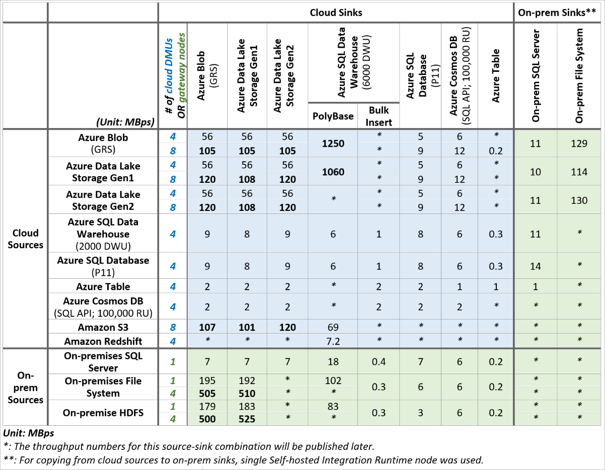
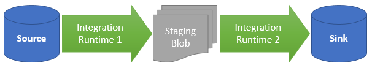
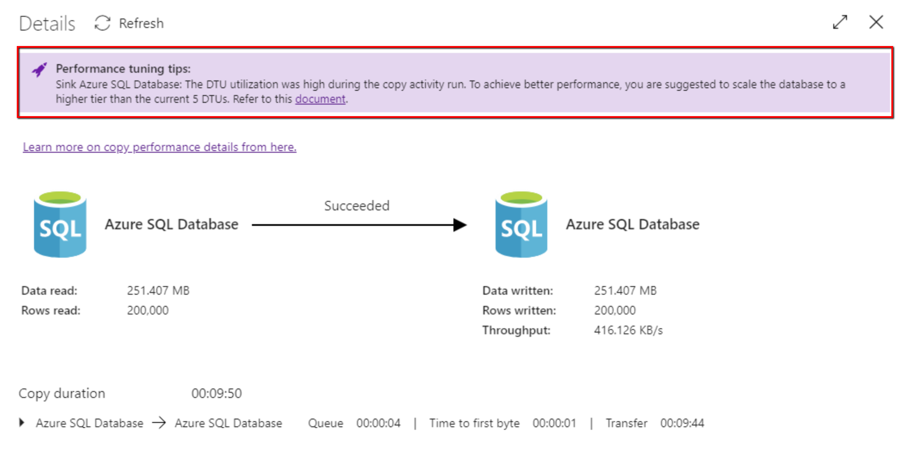
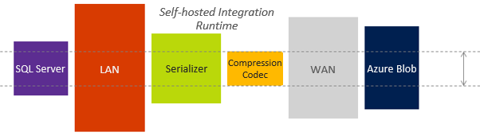

# Copy activity performance and tuning guide
> [!div class="op_single_selector" title1="Select the version of Azure Data Factory that you're using:"]
> * [Version 1](v1/data-factory-copy-activity-performance.md)
> * [Current version](copy-activity-performance.md)


The Azure Data Factory copy activity delivers a first-class secure, reliable, and high-performance data loading solution. You can use it to copy tens of terabytes of data every day across a rich variety of cloud and on-premises data stores. Fast data-loading performance is key to ensure that you can focus on the core big data problem: building advanced analytics solutions and getting deep insights from all that data.

Azure provides a set of enterprise-grade data storage and data warehouse solutions. The copy activity offers a highly optimized data loading experience that's easy to configure and set up. With a single copy activity, you can load data into:

* Azure SQL Data Warehouse at 1.2 GBps.
* Azure Blob storage at 1.0 GBps.
* Azure Data Lake Store at 1.0 GBps.

This article describes:

* [Performance reference numbers](#performance-reference) for supported source and sink data stores to help you plan your project.
* Features that can boost the copy throughput in different scenarios, which includes [Data Integration Units](#data-integration-units) (DIUs), [parallel copy](#parallel-copy), and [staged copy](#staged-copy).
* [Performance tuning guidance](#performance-tuning-steps) on how to tune the performance and the key factors that can affect copy performance.

> [!NOTE]
> If you aren't familiar with the copy activity in general, see the [copy activity overview](copy-activity-overview.md) before you read this article.
>

## Performance reference

As a reference, the following table shows the copy throughput number in MBps for the given source and sink pairs in a single copy activity run based on in-house testing. For comparison, it also demonstrates how different settings of [Data Integration Units](#data-integration-units) or [self-hosted integration runtime scalability](concepts-integration-runtime.md#self-hosted-integration-runtime) (multiple nodes) can help on copy performance.



> [!IMPORTANT]
> When the copy activity runs on an Azure integration runtime, the minimal allowed Data Integration Units (formerly known as Data Movement Units) is two. If not specified, see the default Data Integration Units being used in [Data Integration Units](#data-integration-units).

**Points to note:**

* Throughput is calculated by using the following formula: [size of data read from source]/[copy activity run duration].
* The performance reference numbers in the table were measured by using a [TPC-H](http://www.tpc.org/tpch/) dataset in a single copy activity run. Test files for file-based stores are multiple files with 10 GB in size.
* In Azure data stores, the source and sink are in the same Azure region.
* For hybrid copy between on-premises and cloud data stores, each self-hosted integration runtime node was running on a machine that was separate from the data store with the following specification. When a single activity was running, the copy operation consumed only a small portion of the test machine's CPU, memory, or network bandwidth.
    <table>
    <tr>
        <td>CPU</td>
        <td>32 cores 2.20 GHz Intel Xeon E5-2660 v2</td>
    </tr>
    <tr>
        <td>Memory</td>
        <td>128 GB</td>
    </tr>
    <tr>
        <td>Network</td>
        <td>Internet interface: 10 Gbps; intranet interface: 40 Gbps</td>
    </tr>
    </table>


> [!TIP]
> You can achieve higher throughput by using more DIUs. For example, with 100 DIUs, you can copy data from Azure Blob storage into Azure Data Lake Store at 1.0 GBps. For more information about this feature and the supported scenario, see the [Data Integration Units](#data-integration-units) section. 

## Data Integration Units

A Data Integration Unit is a measure that represents the power (a combination of CPU, memory, and network resource allocation) of a single unit in Azure Data Factory. Data Integration Unit only applies to [Azure integration runtime](concepts-integration-runtime.md#azure-integration-runtime), but not [self-hosted integration runtime](concepts-integration-runtime.md#self-hosted-integration-runtime).

The minimal DIUs to empower a copy activity run is two. If not specified, the following table lists the default DIUs used in different copy scenarios:

| Copy scenario | Default DIUs determined by service |
|:--- |:--- |
| Copy data between file-based stores | Between 4 and 32 depending on the number and size of the files |
| Copy data to Azure SQL Database or Azure Cosmos DB |Between 4 and 16 depending on the sink Azure SQL Database's or Cosmos DB's tier (number of DTUs/RUs) |
| All the other copy scenarios | 4 |

To override this default, specify a value for the **dataIntegrationUnits** property as follows. The *allowed values* for the **dataIntegrationUnits** property is up to 256. The *actual number of DIUs* that the copy operation uses at run time is equal to or less than the configured value, depending on your data pattern. For information about the level of performance gain you might get when you configure more units for a specific copy source and sink, see the [performance reference](#performance-reference).

You can see the DIUs used for each copy run in the copy activity output when you monitor an activity run. For more information, see [Copy activity monitoring](copy-activity-overview.md#monitoring).

> [!NOTE]
> Setting of DIUs larger than four currently applies only when you copy multiple files from Azure Storage, Azure Data Lake Storage, Amazon S3, Google Cloud Storage, cloud FTP, or cloud SFTP to any other cloud data stores.
>

**Example**

```json
"activities":[
    {
        "name": "Sample copy activity",
        "type": "Copy",
        "inputs": [...],
        "outputs": [...],
        "typeProperties": {
            "source": {
                "type": "BlobSource",
            },
            "sink": {
                "type": "AzureDataLakeStoreSink"
            },
            "dataIntegrationUnits": 32
        }
    }
]
```

### Data Integration Units billing impact

Remember that you're charged based on the total time of the copy operation. The total duration you're billed for data movement is the sum of duration across DIUs. If a copy job used to take one hour with two cloud units and now it takes 15 minutes with eight cloud units, the overall bill remains almost the same.

## Parallel copy

You can use the **parallelCopies** property to indicate the parallelism that you want the copy activity to use. You can think of this property as the maximum number of threads within the copy activity that can read from your source or write to your sink data stores in parallel.

For each copy activity run, Azure Data Factory determines the number of parallel copies to use to copy data from the source data store and to the destination data store. The default number of parallel copies that it uses depends on the type of source and sink that you use.

| Copy scenario | Default parallel copy count determined by service |
| --- | --- |
| Copy data between file-based stores |Depends on the size of the files and the number of DIUs used to copy data between two cloud data stores, or the physical configuration of the self-hosted integration runtime machine. |
| Copy data from any source store to Azure Table storage |4 |
| All other copy scenarios |1 |

> [!TIP]
> When you copy data between file-based stores, the default behavior usually gives you the best throughput. The default behavior is auto-determined based on your source file pattern.

To control the load on machines that host your data stores, or to tune copy performance, you can override the default value and specify a value for the **parallelCopies** property. The value must be an integer greater than or equal to 1. At run time, for the best performance, the copy activity uses a value that is less than or equal to the value that you set.

```json
"activities":[
    {
        "name": "Sample copy activity",
        "type": "Copy",
        "inputs": [...],
        "outputs": [...],
        "typeProperties": {
            "source": {
                "type": "BlobSource",
            },
            "sink": {
                "type": "AzureDataLakeStoreSink"
            },
            "parallelCopies": 32
        }
    }
]
```

**Points to note:**

* When you copy data between file-based stores, **parallelCopies** determines the parallelism at the file level. The chunking within a single file happens underneath automatically and transparently. It's designed to use the best suitable chunk size for a given source data store type to load data in parallel and orthogonal to **parallelCopies**. The actual number of parallel copies the data movement service uses for the copy operation at run time is no more than the number of files you have. If the copy behavior is **mergeFile**, the copy activity can't take advantage of file-level parallelism.
* When you copy data from stores that aren't file-based (except Oracle database as source with data partitioning enabled) to stores that are file-based, the data movement service ignores the **parallelCopies** property. Even if parallelism is specified, it's not applied in this case.
* The **parallelCopies** property is orthogonal to **dataIntegrationUnits**. The former is counted across all the Data Integration Units.
* When you specify a value for the **parallelCopies** property, consider the load increase on your source and sink data stores. Also consider the load increase to the self-hosted integration runtime if the copy activity is empowered by it, for example, for hybrid copy. This load increase happens especially when you have multiple activities or concurrent runs of the same activities that run against the same data store. If you notice that either the data store or the self-hosted integration runtime is overwhelmed with the load, decrease the **parallelCopies** value to relieve the load.

## Staged copy

When you copy data from a source data store to a sink data store, you might choose to use Blob storage as an interim staging store. Staging is especially useful in the following cases:

- **You want to ingest data from various data stores into SQL Data Warehouse via PolyBase.** SQL Data Warehouse uses PolyBase as a high-throughput mechanism to load a large amount of data into SQL Data Warehouse. The source data must be in Blob storage or Azure Data Lake Store, and it must meet additional criteria. When you load data from a data store other than Blob storage or Azure Data Lake Store, you can activate data copying via interim staging Blob storage. In that case, Azure Data Factory performs the required data transformations to ensure that it meets the requirements of PolyBase. Then it uses PolyBase to load data into SQL Data Warehouse efficiently. For more information, see [Use PolyBase to load data into Azure SQL Data Warehouse](connector-azure-sql-data-warehouse.md#use-polybase-to-load-data-into-azure-sql-data-warehouse).
- **Sometimes it takes a while to perform a hybrid data movement (that is, to copy from an on-premises data store to a cloud data store) over a slow network connection.** To improve performance, you can use staged copy to compress the data on-premises so that it takes less time to move data to the staging data store in the cloud. Then you can decompress the data in the staging store before you load into the destination data store.
- **You don't want to open ports other than port 80 and port 443 in your firewall because of corporate IT policies.** For example, when you copy data from an on-premises data store to an Azure SQL Database sink or an Azure SQL Data Warehouse sink, you need to activate outbound TCP communication on port 1433 for both the Windows firewall and your corporate firewall. In this scenario, staged copy can take advantage of the self-hosted integration runtime to first copy data to a Blob storage staging instance over HTTP or HTTPS on port 443. Then it can load the data into SQL Database or SQL Data Warehouse from Blob storage staging. In this flow, you don't need to enable port 1433.

### How staged copy works

When you activate the staging feature, first the data is copied from the source data store to the staging Blob storage (bring your own). Next, the data is copied from the staging data store to the sink data store. Azure Data Factory automatically manages the two-stage flow for you. Azure Data Factory also cleans up temporary data from the staging storage after the data movement is complete.



When you activate data movement by using a staging store, you can specify whether you want the data to be compressed before you move data from the source data store to an interim or staging data store and then decompressed before you move data from an interim or staging data store to the sink data store.

Currently, you can't copy data between two data stores that are connected via different Self-hosted IRs, neither with nor without staged copy. For such scenario, you can configure two explicitly chained copy activity to copy from source to staging then from staging to sink.

### Configuration

Configure the **enableStaging** setting in the copy activity to specify whether you want the data to be staged in Blob storage before you load it into a destination data store. When you set **enableStaging** to `TRUE`, specify the additional properties listed in the following table. You also need to create an Azure Storage or Storage shared access signature-linked service for staging if you don’t have one.

| Property | Description | Default value | Required |
| --- | --- | --- | --- |
| enableStaging |Specify whether you want to copy data via an interim staging store. |False |No |
| linkedServiceName |Specify the name of an [AzureStorage](connector-azure-blob-storage.md#linked-service-properties) linked service, which refers to the instance of Storage that you use as an interim staging store. <br/><br/> You can't use Storage with a shared access signature to load data into SQL Data Warehouse via PolyBase. You can use it in all other scenarios. |N/A |Yes, when **enableStaging** is set to TRUE |
| path |Specify the Blob storage path that you want to contain the staged data. If you don't provide a path, the service creates a container to store temporary data. <br/><br/> Specify a path only if you use Storage with a shared access signature, or you require temporary data to be in a specific location. |N/A |No |
| enableCompression |Specifies whether data should be compressed before it's copied to the destination. This setting reduces the volume of data being transferred. |False |No |

>[!NOTE]
> If you use staged copy with compression enabled, the service principal or MSI authentication for staging blob linked service isn't supported.

Here's a sample definition of a copy activity with the properties that are described in the preceding table:

```json
"activities":[
    {
        "name": "Sample copy activity",
        "type": "Copy",
        "inputs": [...],
        "outputs": [...],
        "typeProperties": {
            "source": {
                "type": "SqlSource",
            },
            "sink": {
                "type": "SqlSink"
            },
            "enableStaging": true,
            "stagingSettings": {
                "linkedServiceName": {
                    "referenceName": "MyStagingBlob",
                    "type": "LinkedServiceReference"
                },
                "path": "stagingcontainer/path",
                "enableCompression": true
            }
        }
    }
]
```

### Staged copy billing impact

You're charged based on two steps: copy duration and copy type.

* When you use staging during a cloud copy, which is copying data from a cloud data store to another cloud data store, both stages empowered by Azure integration runtime, you're charged the [sum of copy duration for step 1 and step 2] x [cloud copy unit price].
* When you use staging during a hybrid copy, which is copying data from an on-premises data store to a cloud data store, one stage empowered by a self-hosted integration runtime, you're charged for [hybrid copy duration] x [hybrid copy unit price] + [cloud copy duration] x [cloud copy unit price].

## Performance tuning steps

Take these steps to tune the performance of your Azure Data Factory service with the copy activity.

1. **Establish a baseline.** During the development phase, test your pipeline by using the copy activity against a representative data sample. Collect execution details and performance characteristics following [copy activity monitoring](copy-activity-overview.md#monitoring).

2. **Diagnose and optimize performance.** If the performance you observe doesn't meet your expectations, identify performance bottlenecks. Then, optimize performance to remove or reduce the effect of bottlenecks.

    In some cases, when you run a copy activity in Azure Data Factory, you see a "Performance tuning tips" message on top of the [copy activity monitoring page](copy-activity-overview.md#monitor-visually), as shown in the following example. The message tells you the bottleneck that was identified for the given copy run. It also guides you on what to change to boost copy throughput. The performance tuning tips currently provide suggestions like:

    - Use PolyBase when you copy data into Azure SQL Data Warehouse.
    - Increase Azure Cosmos DB Request Units or Azure SQL Database DTUs (Database Throughput Units) when the resource on the data store side is the bottleneck.
    - Remove the unnecessary staged copy.

    The performance tuning rules will be gradually enriched as well.

    **Example: Copy into Azure SQL Database with performance tuning tips**

    In this sample, during a copy run, Azure Data Factory notices the sink Azure SQL Database reaches high DTU utilization, which slows down the write operations. The suggestion is to increase the Azure SQL Database tier with more DTUs. 

    

    In addition, the following are some common considerations. A full description of performance diagnosis is beyond the scope of this article.

   * Performance features:
     * [Parallel copy](#parallel-copy)
     * [Data Integration Units](#data-integration-units)
     * [Staged copy](#staged-copy)
     * [Self-hosted integration runtime scalability](concepts-integration-runtime.md#self-hosted-integration-runtime)
   * [Self-hosted integration runtime](#considerations-for-self-hosted-integration-runtime)
   * [Source](#considerations-for-the-source)
   * [Sink](#considerations-for-the-sink)
   * [Serialization and deserialization](#considerations-for-serialization-and-deserialization)
   * [Compression](#considerations-for-compression)
   * [Column mapping](#considerations-for-column-mapping)
   * [Other considerations](#other-considerations)

3. **Expand the configuration to your entire dataset.** When you're satisfied with the execution results and performance, you can expand the definition and pipeline to cover your entire dataset.

## Considerations for self-hosted integration runtime

If your copy activity runs on a self-hosted integration runtime, note the following:

**Setup**: We recommend that you use a dedicated machine to host integration runtime. See [Considerations for using self-hosted integration runtime](concepts-integration-runtime.md).

**Scale out**: A single logical self-hosted integration runtime with one or more nodes can serve multiple copy activity runs at the same time concurrently. If you have heavy need on hybrid data movement either with a large number of concurrent copy activity runs or with a large volume of data to copy, consider [scaling out the self-hosted integration runtime](create-self-hosted-integration-runtime.md#high-availability-and-scalability) to provision more resources to empower copy.

## Considerations for the source

### General

Be sure that the underlying data store isn't overwhelmed by other workloads that are running on or against it.

For Microsoft data stores, see [monitoring and tuning topics](#performance-reference) that are specific to data stores. These topics can help you understand data store performance characteristics and how to minimize response times and maximize throughput.

* If you copy data from Blob storage to SQL Data Warehouse, consider using PolyBase to boost performance. For more information, see [Use PolyBase to load data into Azure SQL Data Warehouse](connector-azure-sql-data-warehouse.md#use-polybase-to-load-data-into-azure-sql-data-warehouse).
* If you copy data from HDFS to Azure Blob storage or Azure Data Lake Store, consider using DistCp to boost performance. For more information, see [Use DistCp to copy data from HDFS](connector-hdfs.md#use-distcp-to-copy-data-from-hdfs).
* If you copy data from Redshift to Azure SQL Data Warehouse, Azure BLob storage, or Azure Data Lake Store, consider using UNLOAD to boost performance. For more information, see [Use UNLOAD to copy data from Amazon Redshift](connector-amazon-redshift.md#use-unload-to-copy-data-from-amazon-redshift).

### File-based data stores

* **Average file size and file count**: The copy activity transfers data one file at a time. With the same amount of data to be moved, the overall throughput is lower if the data consists of many small files rather than a few large files due to the bootstrap phase for each file. If possible, combine small files into larger files to gain higher throughput.
* **File format and compression**: For more ways to improve performance, see the [Considerations for serialization and deserialization](#considerations-for-serialization-and-deserialization) and [Considerations for compression](#considerations-for-compression) sections.

### Relational data stores

* **Data pattern**: Your table schema affects copy throughput. A large row size gives you better performance than a small row size to copy the same amount of data. The reason is that the database can more efficiently retrieve fewer batches of data that contain fewer rows.
* **Query or stored procedure**: Optimize the logic of the query or stored procedure you specify in the copy activity source to fetch data more efficiently.

## Considerations for the sink

### General

Be sure that the underlying data store isn't overwhelmed by other workloads that are running on or against it.

For Microsoft data stores, see [monitoring and tuning topics](#performance-reference) that are specific to data stores. These topics can help you understand data store performance characteristics and how to minimize response times and maximize throughput.

* If you copy data from any data store to Azure SQL Data Warehouse, consider using PolyBase to boost performance. For more information, see [Use PolyBase to load data into Azure SQL Data Warehouse](connector-azure-sql-data-warehouse.md#use-polybase-to-load-data-into-azure-sql-data-warehouse).
* If you copy data from HDFS to Azure Blob storage or Azure Data Lake Store, consider using DistCp to boost performance. For more information, see [Use DistCp to copy data from HDFS](connector-hdfs.md#use-distcp-to-copy-data-from-hdfs).
* If you copy data from Redshift to Azure SQL Data Warehouse, Azure Blob storage, or Azure Data Lake Store, consider using UNLOAD to boost performance. For more information, see [Use UNLOAD to copy data from Amazon Redshift](connector-amazon-redshift.md#use-unload-to-copy-data-from-amazon-redshift).

### File-based data stores

* **Copy behavior**: If you copy data from a different file-based data store, the copy activity has three options via the **copyBehavior** property. It preserves hierarchy, flattens hierarchy, or merges files. Either preserving or flattening hierarchy has little or no performance overhead, but merging files causes performance overhead to increase.
* **File format and compression**: For more ways to improve performance, see the [Considerations for serialization and deserialization](#considerations-for-serialization-and-deserialization) and [Considerations for compression](#considerations-for-compression) sections.

### Relational data stores

* **Copy behavior and performance implication**: There are different ways to write data into a SQL sink. Learn more from [Best practice for loading data into Azure SQL Database](connector-azure-sql-database.md#best-practice-for-loading-data-into-azure-sql-database).

* **Data pattern and batch size**:
  * Your table schema affects copy throughput. To copy the same amount of data, a large row size gives you better performance than a small row size because the database can more efficiently commit fewer batches of data.
  * The copy activity inserts data in a series of batches. You can set the number of rows in a batch by using the **writeBatchSize** property. If your data has small rows, you can set the **writeBatchSize** property with a higher value to benefit from lower batch overhead and higher throughput. If the row size of your data is large, be careful when you increase **writeBatchSize**. A high value might lead to a copy failure caused by overloading the database.

### NoSQL stores

* For **Table storage**:
  * **Partition**: Writing data to interleaved partitions dramatically degrades performance. Sort your source data by partition key so that the data is inserted efficiently into one partition after another. Or, you can adjust the logic to write the data to a single partition.

## Considerations for serialization and deserialization

Serialization and deserialization can occur when your input dataset or output dataset is a file. For more information on supported file formats by copy activity, see [Supported file and compression formats](supported-file-formats-and-compression-codecs.md).

**Copy behavior**:

* Copying files between file-based data stores:
  * When input and output datasets both have the same or no file format settings, the data movement service executes a *binary copy* without any serialization or deserialization. You see a higher throughput compared to the scenario, in which the source and sink file format settings are different from each other.
  * When input and output datasets both are in text format and only the encoding type is different, the data movement service only does encoding conversion. It doesn't do any serialization and deserialization, which causes some performance overhead compared to a binary copy.
  * When input and output datasets both have different file formats or different configurations, like delimiters, the data movement service deserializes source data to stream, transform, and then serialize it into the output format you indicated. This operation results in a much more significant performance overhead compared to other scenarios.
* When you copy files to or from a data store that isn't file based, for example, from a file-based store to a relational store, the serialization or deserialization step is required. This step results in significant performance overhead.

**File format**: The file format you choose might affect copy performance. For example, Avro is a compact binary format that stores metadata with data. It has broad support in the Hadoop ecosystem for processing and querying. Avro is more expensive for serialization and deserialization, which results in lower copy throughput compared to text format. 

Make your choice of file format throughout the processing flow holistically. Start with:

- What form the data is stored in, source data stores or to be extracted from external systems.
- The best format for storage, analytical processing, and querying.
- In what format the data should be exported into data marts for reporting and visualization tools.

Sometimes a file format that is suboptimal for read and write performance might be a good choice when you consider the overall analytical process.

## Considerations for compression

When your input or output dataset is a file, you can set the copy activity to perform compression or decompression as it writes data to the destination. When you choose compression, you make a tradeoff between input/output (I/O) and CPU. Compressing the data costs extra in compute resources. But in return, it reduces network I/O and storage. Depending on your data, you might see a boost in overall copy throughput.

**Codec**: Each compression codec has advantages. For example, bzip2 has the lowest copy throughput, but you get the best Hive query performance with bzip2 because you can split it for processing. Gzip is the most balanced option, and it's used the most often. Choose the codec that best suits your end-to-end scenario.

**Level**: You can choose from two options for each compression codec: fastest compressed and optimally compressed. The fastest compressed option compresses the data as quickly as possible, even if the resulting file isn't optimally compressed. The optimally compressed option spends more time on compression and yields a minimal amount of data. You can test both options to see which provides better overall performance in your case.

**A consideration**: To copy a large amount of data between an on-premises store and the cloud, consider using [Staged copy](#staged-copy) with compression enabled. Using interim storage is helpful when the bandwidth of your corporate network and your Azure services is the limiting factor, and you want the input dataset and output dataset both to be in uncompressed form.

## Considerations for column mapping

You can set the **columnMappings** property in a copy activity to map all or a subset of the input columns to the output columns. After the data movement service reads the data from the source, it needs to perform column mapping on the data before it writes the data to the sink. This extra processing reduces copy throughput.

If your source data store is queryable, for example, if it's a relational store like SQL Database or SQL Server, or if it's a NoSQL store like Table storage or Azure Cosmos DB, consider pushing the column filtering and reordering logic to the **query** property instead of using column mapping. This way, the projection occurs while the data movement service reads data from the source data store, where it's much more efficient.

Learn more from [Copy activity schema mapping](copy-activity-schema-and-type-mapping.md).

## Other considerations

If the size of data you want to copy is large, you can adjust your business logic to further partition the data. You can schedule the copy activity to run more frequently to reduce the data size for each copy activity that runs.

Be cautious about the number of datasets and copy activities that require Azure Data Factory to connect to the same data store at the same time. Many concurrent copy jobs might throttle a data store and lead to degraded performance, copy job internal retries, and in some cases, execution failures.

## Sample scenario: Copy from an on-premises SQL server to Blob storage

**Scenario**: A pipeline is built to copy data from an on-premises SQL server to Blob storage in CSV format. To make the copy job faster, the CSV files should be compressed into bzip2 format.

**Test and analysis**: The throughput of the copy activity is less than 2 MBps, which is much slower than the performance benchmark.

**Performance analysis and tuning**:
To troubleshoot the performance issue, let’s look at how the data is processed and moved.

- **Read data**: The integration runtime opens a connection to SQL Server and sends the query. SQL Server responds by sending the data stream to the integration runtime via the intranet.
- **Serialize and compress data**: The integration runtime serializes the data stream to CSV format and compresses the data to a bzip2 stream.
- **Write data**: The integration runtime uploads the bzip2 stream to Blob storage via the internet.

As you can see, the data is processed and moved in a streaming sequential manner: SQL Server > LAN > Integration runtime > WAN > Blob storage. The overall performance is gated by the minimum throughput across the pipeline.



One or more of the following factors might cause the performance bottleneck:

* **Source**: SQL Server itself has low throughput because of heavy loads.
* **Self-hosted integration runtime**:
  * **LAN**: Integration runtime is located far from the SQL Server machine and has a low-bandwidth connection.
  * **Integration runtime**: Integration runtime has reached its load limitations to perform the following operations:
    * **Serialization**: Serializing the data stream to CSV format has slow throughput.
    * **Compression**: You chose a slow compression codec, for example, bzip2, which is 2.8 MBps with Core i7.
  * **WAN**: The bandwidth between the corporate network and your Azure services is low, for example, T1 = 1,544 kbps; T2 = 6,312 kbps.
* **Sink**: Blob storage has low throughput. This scenario is unlikely because its service-level agreement (SLA) guarantees a minimum of 60 MBps.

In this case, bzip2 data compression might be slowing down the entire pipeline. Switching to a gzip compression codec might ease this bottleneck.

## References

Here are performance monitoring and tuning references for some of the supported data stores:

* Azure Storage, which includes Blob storage and Table storage: [Azure Storage scalability targets](../storage/common/storage-scalability-targets.md) and [Azure Storage performance and scalability checklist](../storage/common/storage-performance-checklist.md).
* Azure SQL Database: You can [monitor the performance](../sql-database/sql-database-single-database-monitor.md) and check the Database Transaction Unit (DTU) percentage.
* Azure SQL Data Warehouse: Its capability is measured in Data Warehouse Units (DWUs). See [Manage compute power in Azure SQL Data Warehouse (Overview)](../sql-data-warehouse/sql-data-warehouse-manage-compute-overview.md).
* Azure Cosmos DB: [Performance levels in Azure Cosmos DB](../cosmos-db/performance-levels.md).
* On-premises SQL Server: [Monitor and tune for performance](https://msdn.microsoft.com/library/ms189081.aspx).
* On-premises file server: [Performance tuning for file servers](https://msdn.microsoft.com/library/dn567661.aspx).

## Next steps
See the other copy activity articles:

- [Copy activity overview](copy-activity-overview.md)
- [Copy activity schema mapping](copy-activity-schema-and-type-mapping.md)
- [Copy activity fault tolerance](copy-activity-fault-tolerance.md)
