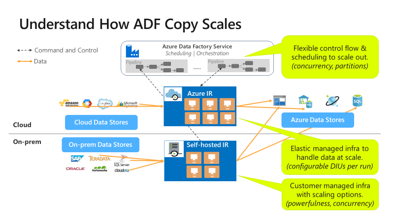

# Copy activity performance and scalability guide

> [!div class="op_single_selector" title1="Select the version of Azure Data Factory that you're using:"]
> * [Version 1](v1/data-factory-copy-activity-performance.md)
> * [Current version](copy-activity-performance.md)

[!INCLUDE[appliesto-adf-asa-md](includes/appliesto-adf-asa-md.md)]

Whether you want to perform a large-scale data migration from data lake or enterprise data warehouse (EDW) to Azure, or you want to ingest data at scale from different sources into Azure for big data analytics, it is critical to achieve optimal performance and scalability.  Azure Data Factory provides a performant, resilient, and cost-effective mechanism to ingest data at scale, making it a great fit for data engineers looking to build highly performant and scalable data ingestion pipelines.

After reading this article, you will be able to answer the following questions:

- What level of performance and scalability can I achieve using ADF copy activity for data migration and data ingestion scenarios?

- What steps should I take to tune the performance of ADF copy activity?
- What ADF perf optimization knobs can I utilize to optimize performance for a single copy activity run?
- What other factors outside ADF to consider when optimizing copy performance?

> [!NOTE]
> If you aren't familiar with the copy activity in general, see the [copy activity overview](copy-activity-overview.md) before you read this article.

## Copy performance and scalability achievable using ADF

ADF offers a serverless architecture that allows parallelism at different levels, which allows developers to build pipelines to fully utilize your network bandwidth as well as storage IOPS and bandwidth to maximize data movement throughput for your environment.  This means the throughput you can achieve can be estimated by measuring the minimum throughput offered by the source data store, the destination data store, and network bandwidth in between the source and destination.  The table below calculates the copy duration based on data size and the bandwidth limit for your environment. 

| Data size /   bandwidth | 50 Mbps    | 100 Mbps  | 500 Mbps  | 1 Gbps   | 5 Gbps   | 10 Gbps  | 50 Gbps   |
| --------------------------- | ---------- | --------- | --------- | -------- | -------- | -------- | --------- |
| **1 GB**                    | 2.7 min    | 1.4 min   | 0.3 min   | 0.1 min  | 0.03 min | 0.01 min | 0.0 min   |
| **10 GB**                   | 27.3 min   | 13.7 min  | 2.7 min   | 1.3 min  | 0.3 min  | 0.1 min  | 0.03 min  |
| **100 GB**                  | 4.6 hrs    | 2.3 hrs   | 0.5 hrs   | 0.2 hrs  | 0.05 hrs | 0.02 hrs | 0.0 hrs   |
| **1 TB**                    | 46.6 hrs   | 23.3 hrs  | 4.7 hrs   | 2.3 hrs  | 0.5 hrs  | 0.2 hrs  | 0.05 hrs  |
| **10 TB**                   | 19.4 days  | 9.7 days  | 1.9 days  | 0.9 days | 0.2 days | 0.1 days | 0.02 days |
| **100 TB**                  | 194.2 days | 97.1 days | 19.4 days | 9.7 days | 1.9 days | 1 day    | 0.2 days  |
| **1 PB**                    | 64.7 mo    | 32.4 mo   | 6.5 mo    | 3.2 mo   | 0.6 mo   | 0.3 mo   | 0.06 mo   |
| **10 PB**                   | 647.3 mo   | 323.6 mo  | 64.7 mo   | 31.6 mo  | 6.5 mo   | 3.2 mo   | 0.6 mo    |

ADF copy is scalable at different levels:

- ADF control flow can start multiple copy activities in parallel, for example using [For Each loop](control-flow-for-each-activity.md).
- A single copy activity can take advantage of scalable compute resources: when using Azure Integration Runtime, you can specify [up to 256 DIUs](#data-integration-units) for each copy activity in a serverless manner; when using self-hosted Integration Runtime, you can manually scale up the machine or scale out to multiple machines ([up to 4 nodes](create-self-hosted-integration-runtime.md#high-availability-and-scalability)), and a single copy activity will partition its file set across all nodes.
- A single copy activity reads from and writes to the data store using multiple threads [in parallel](#parallel-copy).

## Performance tuning steps

Take these steps to tune the performance of your Azure Data Factory service with the copy activity.

1. **Pick up a test dataset and establish a baseline.** During the development phase, test your pipeline by using the copy activity against a representative data sample. The dataset you choose should represent your typical data patterns (folder structure, file pattern, data schema, and so on), and is big enough to evaluate copy performance, for example it takes 10 minutes or beyond for copy activity to complete. Collect execution details and performance characteristics following [copy activity monitoring](copy-activity-monitoring.md).

2. **How to maximize performance of a single copy activity**:

   To start with, we recommend you to first maximize performance using a single copy activity.

   - **If the copy activity is being executed on an Azure Integration Runtime:** start with default values for [Data Integration Units (DIU)](#data-integration-units) and [parallel copy](#parallel-copy) settings. 

   - **If the copy activity is being executed on a self-hosted Integration Runtime:** we recommend that you use a dedicated machine separate from the server hosting the data store to host integration runtime. Start with default values for [parallel copy](#parallel-copy) setting and using a single node for the self-hosted IR.  

   Perform a performance test run, and take a note of the performance achieved as well as the actual values used like DIUs and parallel copies. Refer to [copy activity monitoring](copy-activity-monitoring.md) on how to collect run results and performance settings used, and learn how to [Troubleshoot copy activity performance](copy-activity-performance-troubleshooting.md) to identify and resolve the bottleneck. 

   Iterate to conduct additional performance test runs following the troubleshooting and tuning guidance. Once single copy activity run cannot achieve better throughput, consider to maximize aggregate throughput by running multiple copies concurrently referring to step 3.

3. **How to maximize aggregate throughput by running multiple copies concurrently:**

   Now that you have maximized the performance of a single copy activity, if you have not yet achieved the throughput upper limits of your environment – network, source data store, and destination data store - you can run multiple copy activities in parallel using ADF control flow constructs such as [For Each loop](control-flow-for-each-activity.md). Refer to [Copy files from multiple containers](solution-template-copy-files-multiple-containers.md), [Migrate data from Amazon S3 to ADLS Gen2](solution-template-migration-s3-azure.md), or [Bulk copy with a control table](solution-template-bulk-copy-with-control-table.md) solution templates as general example.

5. **Expand the configuration to your entire dataset.** When you're satisfied with the execution results and performance, you can expand the definition and pipeline to cover your entire dataset.

## Troubleshoot copy activity performance

Follow the [Performance tuning steps](#performance-tuning-steps) to plan and conduct performance test for your scenario. And learn how to troubleshoot each copy activity run's performance issue in Azure Data Factory from [Troubleshoot copy activity performance](copy-activity-performance-troubleshooting.md).

## Copy performance optimization features

Azure Data Factory provides the following performance optimization features:

- [Data Integration Units](#data-integration-units)
- [Self-hosted integration runtime scalability](#self-hosted-integration-runtime-scalability)
- [Parallel copy](#parallel-copy)
- [Staged copy](#staged-copy)

### Data Integration Units

A Data Integration Unit is a measure that represents the power (a combination of CPU, memory, and network resource allocation) of a single unit in Azure Data Factory. Data Integration Unit only applies to [Azure integration runtime](concepts-integration-runtime.md#azure-integration-runtime), but not [self-hosted integration runtime](concepts-integration-runtime.md#self-hosted-integration-runtime). [Learn more](copy-activity-performance-features.md#data-integration-units).

### Self-hosted integration runtime scalability

To host increasing concurrent workload or to achieve higher performance, you can either scale up or scale out the Self-hosted Integration Runtime. [Learn more](copy-activity-performance-features.md#self-hosted-integration-runtime-scalability).

### Parallel copy

You can set parallel copy to indicate the parallelism that you want the copy activity to use. You can think of this property as the maximum number of threads within the copy activity that read from your source or write to your sink data stores in parallel. [Learn more](copy-activity-performance-features.md#parallel-copy).

### Staged copy

When you copy data from a source data store to a sink data store, you might choose to use Blob storage as an interim staging store. [Learn more](copy-activity-performance-features.md#staged-copy).

## Next steps
See the other copy activity articles:

- [Copy activity overview](copy-activity-overview.md)
- [Troubleshoot copy activity performance](copy-activity-performance-troubleshooting.md)
- [Copy activity performance optimization features](copy-activity-performance-features.md)
- [Use Azure Data Factory to migrate data from your data lake or data warehouse to Azure](data-migration-guidance-overview.md)
- [Migrate data from Amazon S3 to Azure Storage](data-migration-guidance-s3-azure-storage.md)
