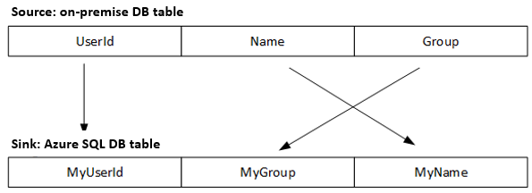

# Schema mapping in copy activity
This article describes how Azure Data Factory copy activity does schema mapping and data type mapping from source data to sink data when execute the data copy.

## Column mapping

Column mapping applies when copying data between tabular-shaped data. By default, copy activity **map source data to sink by column names**, unless [explicit column mapping](#explicit-column-mapping) is configured. More specifically, copy activity:

1. Read the data from source and determine the source schema

    * For data sources with pre-defined schema in the data store/file format, for example, databases/files with metadata (Avro/ORC/Parquet/Text with header), source schema is extracted from the query result or file metadata.
    * For data sources with flexible schema, for example,  Azure Table/Cosmos DB, source schema is inferred from the query result. You can overwrite it by configuring the "structure" in dataset.
    * For Text file without header, default column names are generated with pattern "Prop_0", "Prop_1", ...You can overwrite it by configuring the "structure" in dataset.
    * For Dynamics source, you have to provide the schema information in the dataset "structure" section.

2. Apply explicit column mapping if specified.

3. Write the data to sink

    * For data stores with pre-defined schema, the data is written to the columns with the same name.
    * For data stores without fixed schema and for file formats, the column names/metadata will be generated based on the source schema.

### Explicit column-mapping

You can specify **columnMappings** in the **typeProperties** section of the Copy activity to do explicit column mapping. In this scenario, "structure" section is required for both input and output datasets. Column mapping supports **mapping all or subset of columns in the source dataset "structure" to all columns in the sink dataset "structure"**. The following are error conditions that result in an exception:

* Source data store query result does not have a column name that is specified in the input dataset "structure" section.
* Sink data store (if with pre-defined schema) does not have a column name that is specified in the output dataset "structure" section.
* Either fewer columns or more columns in the "structure" of sink dataset than specified in the mapping.
* Duplicate mapping.

#### Explicit column-mapping example

In this sample, the input table has a structure and it points to a table in an on-premises SQL database.

```json
{
    "name": "SqlServerInput",
    "properties": {
        "structure":
         [
            { "name": "UserId"},
            { "name": "Name"},
            { "name": "Group"}
         ],
        "type": "SqlServerTable",
        "linkedServiceName": {
            "referenceName": "SqlServerLinkedService",
            "type": "LinkedServiceReference"
        },
        "typeProperties": {
            "tableName": "SourceTable"
        }
    }
}
```

In this sample, the output table has a structure and it points to a table in an Azure SQL Database.

```json
{
    "name": "AzureSqlOutput",
    "properties": {
        "structure":
        [
            { "name": "MyUserId"},
            { "name": "MyName" },
            { "name": "MyGroup"}
        ],
        "type": "AzureSqlTable",
        "linkedServiceName": {
            "referenceName": "AzureSqlLinkedService",
            "type": "LinkedServiceReference"
        },
        "typeProperties": {
            "tableName": "SinkTable"
        }
    }
}
```

The following JSON defines a copy activity in a pipeline. The columns from source mapped to columns in sink (**columnMappings**) by using the **translator** property.

```json
{
    "name": "CopyActivity",
    "type": "Copy",
    "inputs": [
        {
            "referenceName": "SqlServerInput",
            "type": "DatasetReference"
        }
    ],
    "outputs": [
        {
            "referenceName": "AzureSqlOutput",
            "type": "DatasetReference"
        }
    ],
    "typeProperties":    {
        "source": { "type": "SqlSource" },
        "sink": { "type": "SqlSink" },
        "translator":
        {
            "type": "TabularTranslator",
            "columnMappings": 
            {
                "UserId": "MyUserId",
                "Group": "MyGroup",
                "Name": "MyName"
            }
        }
    }
}
```

If you are using the syntax of `"columnMappings": "UserId: MyUserId, Group: MyGroup, Name: MyName"` to specify column mapping, it is still supported as-is.

**Column-mapping flow:**



## Schema mapping

Schema mapping applies when copying data between hierarchical-shaped data and tabular-shaped data, e.g. copy from MongoDB/REST to text file and copy from SQL to Azure Cosmos DB's API for MongoDB. The following properties are supported in copy activity `translator` section:

| Property | Description | Required |
|:--- |:--- |:--- |
| type | The type property of the copy activity translator must be set to: **TabularTranslator** | Yes |
| schemaMapping | A collection of key-value pairs, which represents the mapping relation **from source side to sink side**.<br/>- **Key:** represents source. For **tabular source**, specify the column name as defined in dataset structure; for **hierarchical source**, specify the JSON path expression for each field to extract and map.<br/>- **Value:** represents sink. For **tabular sink**, specify the column name as defined in dataset structure; for **hierarchical sink**, specify the JSON path expression for each field to extract and map. <br/> In the case of hierarchical data, for fields under root object, JSON path starts with root $; for fields inside the array chosen by `collectionReference` property, JSON path starts from the array element.  | Yes |
| collectionReference | If you want to iterate and extract data from the objects **inside an array field** with the same pattern and convert to per row per object, specify the JSON path of that array to do cross-apply. This property is supported only when hierarchical data is source. | No |

**Example: copy from MongoDB to SQL:**

For example, if you have MongoDB document with the following content: 

```json
{
    "id": {
        "$oid": "592e07800000000000000000"
    },
    "number": "01",
    "date": "20170122",
    "orders": [
        {
            "prod": "p1",
            "price": 23
        },
        {
            "prod": "p2",
            "price": 13
        },
        {
            "prod": "p3",
            "price": 231
        }
    ],
    "city": [ { "name": "Seattle" } ]
}
```

and you want to copy it into an Azure SQL table in the following format, by flattening the data inside the array *(order_pd and order_price)* and cross join with the common root info *(number, date, and city)*:

| orderNumber | orderDate | order_pd | order_price | city |
| --- | --- | --- | --- | --- |
| 01 | 20170122 | P1 | 23 | Seattle |
| 01 | 20170122 | P2 | 13 | Seattle |
| 01 | 20170122 | P3 | 231 | Seattle |

Configure the schema-mapping rule as the following copy activity JSON sample:

```json
{
    "name": "CopyFromMongoDBToSqlAzure",
    "type": "Copy",
    "typeProperties": {
        "source": {
            "type": "MongoDbV2Source"
        },
        "sink": {
            "type": "SqlSink"
        },
        "translator": {
            "type": "TabularTranslator",
            "schemaMapping": {
                "orderNumber": "$.number", 
                "orderDate": "$.date", 
                "order_pd": "prod", 
                "order_price": "price",
                "city": " $.city[0].name"
            },
            "collectionReference":  "$.orders"
        }
    }
}
```

## Data type mapping

Copy activity performs source types to sink types mapping with the following 2-step approach:

1. Convert from native source types to Azure Data Factory interim data types
2. Convert from Azure Data Factory interim data types to native sink type

You can find the mapping between native type to interim type in the "Data type mapping" section in each connector topic.

### Supported data types

Data Factory supports the following interim data types: You can specify below values when configuring type information in [dataset structure](concepts-datasets-linked-services.md#dataset-structure) configuration:

* Byte[]
* Boolean
* Datetime
* Datetimeoffset
* Decimal
* Double
* Guid
* Int16
* Int32
* Int64
* Single
* String
* Timespan

### Explicit data type conversion

When copying data into data stores with fixed schema, for example,  SQL Server/Oracle, when source and sink has different type on the same column，the explicit type conversion should be declared in the source side:

* For file source, for example, CSV/Avro, the type conversion shall be declared via source structure with full column list (source side column name and sink side type)
* For relational source (for example, SQL/Oracle), the type conversion should be achieved by explicit type casting in the query statement.

## When to specify dataset "structure"

In below scenarios, "structure" in dataset is required:

* Applying [explicit data type conversion](#explicit-data-type-conversion) for file sources during copy (input dataset)
* Applying [explicit column mapping](#explicit-column-mapping) during copy (both input and output dataset)
* Copying from Dynamics 365/CRM source (input dataset)
* Copying to Cosmos DB as nested object when source is not JSON files (output dataset)

In below scenarios, "structure" in dataset is suggested:

* Copying from Text file without header (input dataset). You can specify the column names for Text file aligning with the corresponding sink columns, to save from configuring explicit column mapping.
* Copying from data stores with flexible schema, for example,  Azure Table/Cosmos DB (input dataset), to guarantee the expected data (columns) being copied over instead of let copy activity infer schema based on top row(s) during each activity run.


## Next steps
See the other Copy Activity articles:

- [Copy activity overview](copy-activity-overview.md)
- [Copy activity fault tolerance](copy-activity-fault-tolerance.md)
- [Copy activity performance](copy-activity-performance.md)
