# Create Azure-SSIS Integration Runtime in Azure Data Factory

This tutorial provides steps for provisioning an Azure-SQL Server Integration Services (SSIS) Integration Runtime (IR) in Azure Data Factory (ADF). Azure-SSIS IR supports running packages deployed into SSIS catalog (SSISDB) hosted by Azure SQL Database server/Managed Instance (Project Deployment Model) and those deployed into file systems/file shares/Azure Files (Package Deployment Model). Once Azure-SSIS IR is provisioned, you can then use familiar tools, such as SQL Server Data Tools (SSDT)/SQL Server Management Studio (SSMS), and command line utilities, such as `dtinstall`/`dtutil`/`dtexec`, to deploy and run your packages in Azure.

The [Tutorial: Provisioning Azure-SSIS IR](tutorial-create-azure-ssis-runtime-portal.md) shows you how to create an Azure-SSIS IR via the Azure portal/ADF app and optionally use Azure SQL Database server/Managed Instance to host SSISDB. This article expands on the tutorial and shows you how to do the following things:

- Optionally use Azure SQL Database server with virtual network service endpoints/Managed Instance in a virtual network to host SSISDB. As a prerequisite, you need to configure virtual network permissions/settings for your Azure-SSIS IR to join a virtual network.

- Optionally use Azure Active Directory (AAD) authentication with the managed identity for your ADF to connect to Azure SQL Database server/Managed Instance. As a prerequisite, you will need to add the managed identity for your ADF as a database user capable of creating SSISDB.

## Overview

This article shows different ways of provisioning Azure-SSIS IR:

- [Azure portal](#azure-portal)
- [Azure PowerShell](#azure-powershell)
- [Azure Resource Manager template](#azure-resource-manager-template)

## Prerequisites

[!INCLUDE [updated-for-az](../../includes/updated-for-az.md)]

- **Azure subscription**. If you do not already have a subscription, you can create a [free trial](https://azure.microsoft.com/pricing/free-trial/) account.
- **Azure SQL Database server/Managed Instance (optional)**. If you do not already have a database server, create one in the Azure portal before you get started. ADF will in turn create SSISDB on this database server. We recommend that you create the database server in the same Azure region as the integration runtime. This configuration lets the integration runtime write execution logs into SSISDB without crossing Azure regions. 
    - Based on the selected database server, SSISDB can be created on your behalf as a single database, part of an elastic pool, or in a Managed Instance and accessible in public network or by joining a virtual network. For guidance in choosing the type of database server to host SSISDB, see [Compare Azure SQL Database single database/elastic pool/Managed Instance](../data-factory/create-azure-ssis-integration-runtime.md#compare-sql-database-single-databaseelastic-pool-and-sql-database-managed-instance). If you use Azure SQL Database server with virtual network service endpoints/Managed Instance in a virtual network to host SSISDB or require access to on-premises data, you need to join your Azure-SSIS IR to a virtual network, see [Join Azure-SSIS IR to a virtual network](https://docs.microsoft.com/azure/data-factory/join-azure-ssis-integration-runtime-virtual-network).
    - Confirm that the **Allow access to Azure services** setting is enabled for the database server. This is not applicable when you use Azure SQL Database server with virtual network service endpoints/Managed Instance in a virtual network to host SSISDB. For more information, see [Secure your Azure SQL database](../sql-database/sql-database-security-tutorial.md#create-firewall-rules). To enable this setting by using PowerShell, see [New-AzSqlServerFirewallRule](/powershell/module/az.sql/new-azsqlserverfirewallrule).
    - Add the IP address of client machine, or a range of IP addresses that includes the IP address of client machine, to the client IP address list in the firewall settings for the database server. For more information, see [Azure SQL Database server-level and database-level firewall rules](../sql-database/sql-database-firewall-configure.md).
    - You can connect to the database server using SQL authentication with your server admin credentials or Azure Active Directory (AAD) authentication with the managed identity for your ADF.  For the latter, you need to add the managed identity for your ADF into an AAD group with access permissions to the database server, see [Enable AAD authentication for Azure-SSIS IR](https://docs.microsoft.com/azure/data-factory/enable-aad-authentication-azure-ssis-ir).
    - Confirm that your database server does not have an SSISDB already. The provisioning of an Azure-SSIS IR does not support using an existing SSISDB.
- **Azure Resource Manager virtual network (optional)**. You must have an Azure Resource Manager virtual network if at least one of the following conditions is true:
    - You are hosting SSISDB on Azure SQL Database server with virtual network service endpoints/Managed Instance in a virtual network.
    - You want to connect to on-premises data stores from SSIS packages running on your Azure-SSIS IR.
- **Azure PowerShell (optional)**. Follow the instructions on [How to install and configure Azure PowerShell](/powershell/azure/install-az-ps), if you want to run a PowerShell script to provision your Azure-SSIS IR.

### Region support

For a list of Azure regions, in which ADF and Azure-SSIS IR are currently available, see [ADF + SSIS IR availability by region](https://azure.microsoft.com/global-infrastructure/services/?products=data-factory&regions=all).

### Compare SQL Database single database/elastic pool and SQL Database Managed Instance

The following table compares certain features of Azure SQL Database server and Managed Instance as they relate to Azure-SSIR IR:

| Feature | single database/elastic pool| Managed Instance |
|---------|--------------|------------------|
| **Scheduling** | SQL Server Agent is not available.<br/><br/>See [Schedule a package execution in ADF pipeline](https://docs.microsoft.com/sql/integration-services/lift-shift/ssis-azure-schedule-packages?view=sql-server-2017#activity).| Managed Instance Agent is available. |
| **Authentication** | You can create SSISDB with a contained database user representing any AAD group with the managed identity of your ADF as a member in the **db_owner** role.<br/><br/>See [Enable Azure AD authentication to create SSISDB in Azure SQL Database server](enable-aad-authentication-azure-ssis-ir.md#enable-azure-ad-on-azure-sql-database). | You can create SSISDB with a contained database user representing the managed identity of your ADF. <br/><br/>See [Enable Azure AD authentication to create SSISDB in Azure SQL Database Managed Instance](enable-aad-authentication-azure-ssis-ir.md#enable-azure-ad-on-azure-sql-database-managed-instance). |
| **Service tier** | When you create Azure-SSIS IR with your Azure SQL Database server, you can select the service tier for SSISDB. There are multiple service tiers. | When you create Azure-SSIS IR with your Managed Instance, you cannot select the service tier for SSISDB. All databases in your Managed Instance share the same resource allocated to that instance. |
| **Virtual network** | Supports only Azure Resource Manager virtual networks for your Azure-SSIS IR to join if you use Azure SQL Database server with virtual network service endpoints or require access to on-premises data stores. | Supports only Azure Resource Manager virtual networks for your Azure-SSIS IR to join. The virtual network is always required.<br/><br/>If you join your Azure-SSIS IR to the same virtual network as your Managed Instance, make sure that your Azure-SSIS IR is in a different subnet than your Managed Instance. If you join your Azure-SSIS IR to a different virtual network than your Managed Instance, we recommend either a virtual network peering or virtual network to virtual network connection. See [Connect your application to Azure SQL Database Managed Instance](../sql-database/sql-database-managed-instance-connect-app.md). |
| **Distributed transactions** | Supported through Elastic Transactions. Microsoft Distributed Transaction Coordinator (MSDTC) transactions are not supported. If your SSIS packages use MSDTC to coordinate distributed transactions, consider migrating to Elastic Transactions for Azure SQL Database. For more info, see [Distributed transactions across cloud databases](../sql-database/sql-database-elastic-transactions-overview.md). | Not supported. |
| | | |

## Azure portal

In this section, you use Azure portal, specifically ADF User Interface (UI)/app, to create Azure-SSIS IR.

### Create a data factory

1. Launch **Microsoft Edge** or **Google Chrome** web browser. Currently, Data Factory UI is supported only in Microsoft Edge and Google Chrome web browsers.
1. Sign in to the [Azure portal](https://portal.azure.com/).
1. Click **New** on the left menu, click **Data + Analytics**, and click **Data Factory**.

   

1. In the **New data factory** page, enter **MyAzureSsisDataFactory** for the **name**.

   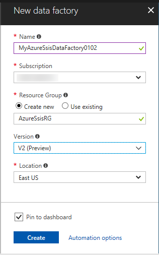

   The name of the Azure data factory must be **globally unique**. If you receive the following error, change the name of the data factory (for example, yournameMyAzureSsisDataFactory) and try creating again. See [Data Factory - Naming Rules](naming-rules.md) article for naming rules for Data Factory artifacts.

   `Data factory name “MyAzureSsisDataFactory” is not available`

1. Select your Azure **subscription** in which you want to create the data factory.
1. For the **Resource Group**, do one of the following steps:

   - Select **Use existing**, and select an existing resource group from the drop-down list.
   - Select **Create new**, and enter the name of a resource group.

   To learn about resource groups, see [Using resource groups to manage your Azure resources](../azure-resource-manager/resource-group-overview.md).

1. Select **V2** for the **version**.
1. Select the **location** for the data factory. Only locations that are supported for creation of data factories are shown in the list.
1. Select **Pin to dashboard**.
1. Click **Create**.
1. On the dashboard, you see the following tile with status: **Deploying data factory**.

    

1. After the creation is complete, you see the **Data Factory** page as shown in the image.

    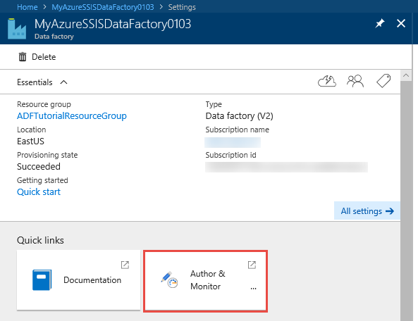

1. Click **Author & Monitor** to launch the Data Factory User Interface (UI) in a separate tab.

### Provision an Azure SSIS integration runtime

1. In the get started page, click **Configure SSIS Integration Runtime** tile.

   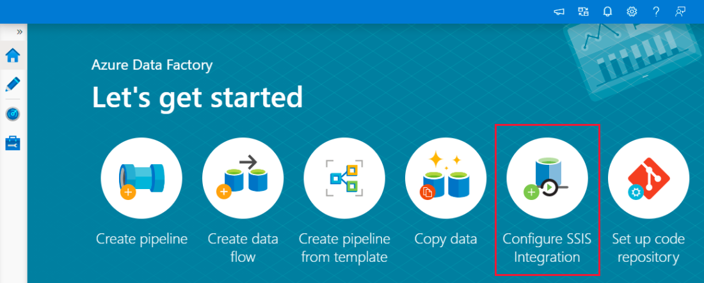

2. On the **General Settings** page of **Integration Runtime Setup**, complete the following steps:

   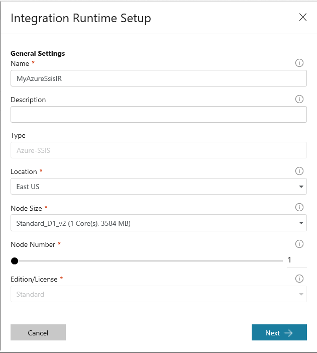

    a. For **Name**, enter the name of your integration runtime.

    b. For **Description**, enter the description of your integration runtime.

    c. For **Location**, select the location of your integration runtime. Only supported locations are displayed. We recommend that you select the same location of your database server to host SSISDB.

    d. For **Node Size**, select the size of node in your integration runtime cluster. Only supported node sizes are displayed. Select a large node size (scale up), if you want to run many compute/memory –intensive packages.

    e. For **Node Number**, select the number of nodes in your integration runtime cluster. Only supported node numbers are displayed. Select a large cluster with many nodes (scale out), if you want to run many packages in parallel.

    f. For **Edition/License**, select SQL Server edition/license for your integration runtime: Standard or Enterprise. Select Enterprise, if you want to use advanced/premium features on your integration runtime.

    g. For **Save Money**, select Azure Hybrid Benefit (AHB) option for your integration runtime: Yes or No. Select Yes, if you want to bring your own SQL Server license with Software Assurance to benefit from cost savings with hybrid use.

    h. Click **Next**.

3. On the **SQL Settings** page, complete the following steps:

   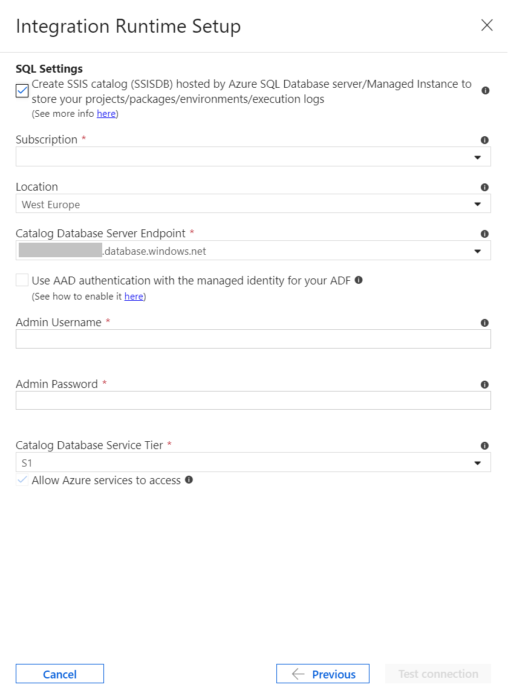

    a. On **Create SSIS catalog...** checkbox, select the deployment model for packages to run on your Azure-SSIS IR: Project Deployment Model where packages are deployed into SSISDB hosted by your database server or Package Deployment Model where packages are deployed into your file systems/file shares/Azure Files. If you check it, you will need to bring your own database server to host SSISDB that we will create and manage on your behalf.
   
    b. For **Subscription**, select the Azure subscription that has your database server to host SSISDB. 

    c. For **Location**, select the location of your database server to host SSISDB. We recommend that you select the same location of your integration runtime. 

    d. For **Catalog Database Server Endpoint**, select the endpoint of your database server to host SSISDB. Based on the selected database server, SSISDB can be created on your behalf as a single database, part of an elastic pool, or in a Managed Instance and accessible in public network or by joining a virtual network. For guidance in choosing the type of database server to host SSISDB, see [Compare Azure SQL Database single database/elastic pool/Managed Instance](../data-factory/create-azure-ssis-integration-runtime.md#compare-sql-database-single-databaseelastic-pool-and-sql-database-managed-instance). If you select Azure SQL Database server with virtual network service endpoints/Managed Instance in a virtual network to host SSISDB or require access to on-premises data, you need to join your Azure-SSIS IR to a virtual network, see [Join Azure-SSIS IR to a virtual network](https://docs.microsoft.com/azure/data-factory/join-azure-ssis-integration-runtime-virtual-network). 

    e. On **Use AAD authentication...** checkbox, select the authentication method for your database server to host SSISDB: SQL authentication or AAD authentication with the managed identity for your ADF. If you check it, you need to add the managed identity for your ADF into an AAD group with access permissions to your database server, see [Enable AAD authentication for Azure-SSIS IR](https://docs.microsoft.com/azure/data-factory/enable-aad-authentication-azure-ssis-ir). 

    f. For **Admin Username**, enter SQL authentication username for your database server to host SSISDB. 

    g. For **Admin Password**, enter SQL authentication password for your database server to host SSISDB. 

    h. For **Catalog Database Service Tier**, select the service tier for your database server to host SSISDB: Basic/Standard/Premium tier or elastic pool name. 

    i. Click **Test Connection** and if successful, click **Next**. 

4. On the **Advanced Settings** page, complete the following steps:

    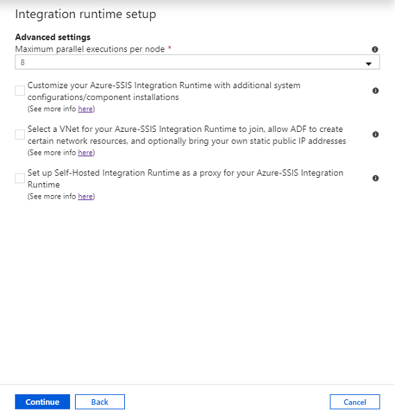

    a. For **Maximum Parallel Executions Per Node**, select the maximum number of packages to execute concurrently per node in your integration runtime cluster. Only supported package numbers are displayed. Select a low number, if you want to use more than one core to run a single large/heavy-weight package that is compute/memory -intensive. Select a high number, if you want to run one or more small/light-weight packages in a single core.

    b. For **Custom Setup Container SAS URI**, optionally enter Shared Access Signature (SAS) Uniform Resource Identifier (URI) of your Azure Storage Blob container where your setup script and its associated files are stored, see [Custom setup for Azure-SSIS IR](https://docs.microsoft.com/azure/data-factory/how-to-configure-azure-ssis-ir-custom-setup).

5. On **Select a virtual network...** checkbox, select whether you want to join your integration runtime to a virtual network. Check it if you use Azure SQL Database server with virtual network service endpoints/Managed Instance in a virtual network to host SSISDB or require access to on-premises data; that is, you have on-premises data sources/destinations in your SSIS packages, see [Join Azure-SSIS IR to a virtual network](https://docs.microsoft.com/azure/data-factory/join-azure-ssis-integration-runtime-virtual-network). If you check it, complete the following steps:

   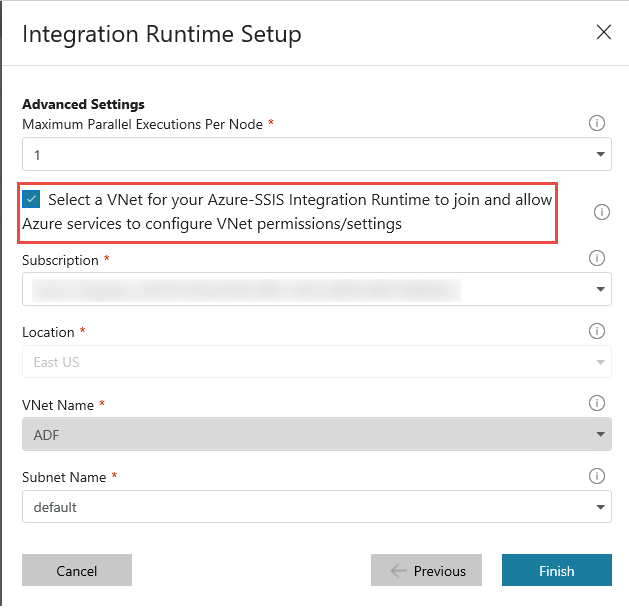

    a. For **Subscription**, select the Azure subscription that has your virtual network.

    b. For **Location**, the same location of your integration runtime is selected.

    c. For **Type**, select the type of your virtual network: Classic or Azure Resource Manager. We recommend that you select Azure Resource Manager virtual network, since Classic virtual network will be deprecated soon.

    d. For **VNet Name**, select the name of your virtual network. This virtual network should be the same one used for Azure SQL Database server with virtual network service endpoints/Managed Instance in a virtual network to host SSISDB or the one connected to your on-premises network.

    e. For **Subnet Name**, select the name of subnet for your virtual network. This should be a different subnet than the one used for Managed Instance in a virtual network to host SSISDB.

6. Click **VNet Validation** and if successful, click **Finish** to start the creation of your Azure-SSIS integration runtime.

	> [!NOTE]
    > Excluding any custom setup time, this process should be completed within 5 minutes, but could take approximately 20 - 30 minutes for Azure-SSIS IR joining a virtual network.
    >
    > If you use SSISDB, ADF service will connect to your database server to prepare SSISDB. It also configures permissions and settings for your virtual network, if specified, and joins your Azure-SSIS IR to the virtual network.
    > 
    > When you provision an Azure-SSIS IR, Access Redistributable and Azure Feature Pack for SSIS are also installed. These components provide connectivity to Excel/Access files and various Azure data sources, in addition to the data sources already supported by built-in components. You can also install additional components, see [Custom setup for Azure-SSIS IR](how-to-configure-azure-ssis-ir-custom-setup.md).

7. In the **Connections** window, switch to **Integration Runtimes** if needed. Click **Refresh** to refresh the status.

   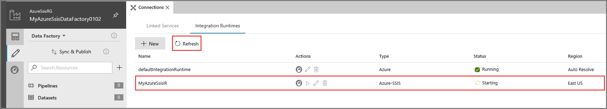

8. Use the links under **Actions** column to stop/start, edit, or delete the integration runtime. Use the last link to view JSON code for the integration runtime. The edit and delete buttons are enabled only when the IR is stopped.

   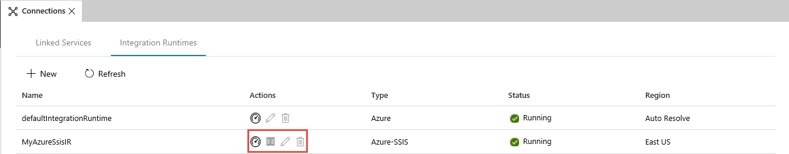

### Azure SSIS integration runtimes in the portal

1. In the Azure Data Factory UI, switch to the **Edit** tab, click **Connections**, and then switch to **Integration Runtimes** tab to view existing integration runtimes in your data factory.

   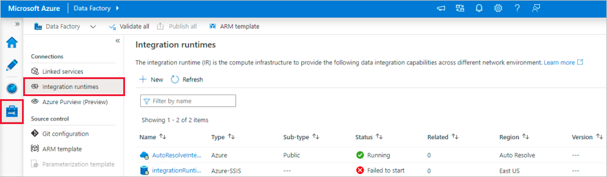

2. Click **New** to create a new Azure-SSIS IR.

   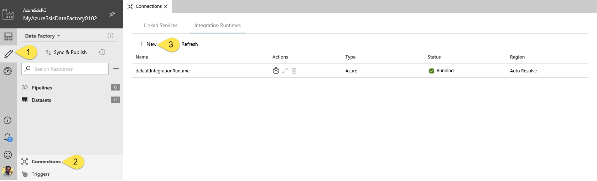

3. To create an Azure-SSIS integration runtime, click **New** as shown in the image.

4. In the Integration Runtime Setup window, select **Lift-and-shift existing SSIS packages to execute in Azure**, and then click **Next**.

   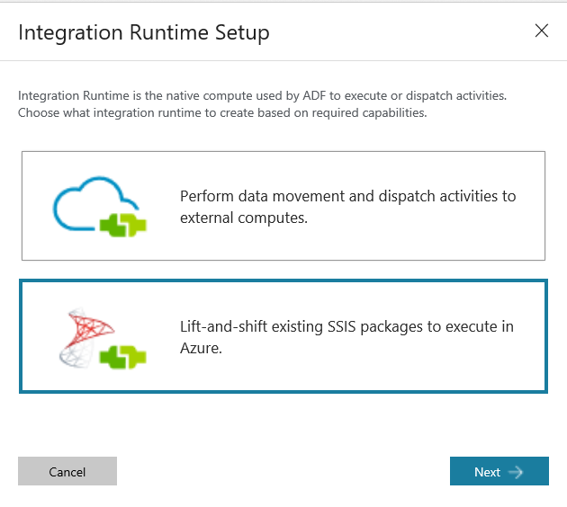

5. See the [Provision an Azure SSIS integration runtime](#provision-an-azure-ssis-integration-runtime) section for the remaining steps to set up an Azure-SSIS IR.

## Azure PowerShell

In this section, you use the Azure PowerShell to create an Azure-SSIS IR.

### Create variables

Copy and paste the following script - Specify values for the variables. 

```powershell
### Azure Data Factory information
# If your input contains a PSH special character, e.g. "$", precede it with the escape character "`" like "`$"
$SubscriptionName = "[your Azure subscription name]"
$ResourceGroupName = "[your Azure resource group name]"
# Data factory name - Must be globally unique
$DataFactoryName = "[your data factory name]"
# For supported regions, see https://azure.microsoft.com/global-infrastructure/services/?products=data-factory&regions=all
$DataFactoryLocation = "EastUS"

### Azure-SSIS integration runtime information - This is a Data Factory compute resource for running SSIS packages
$AzureSSISName = "[your Azure-SSIS IR name]"
$AzureSSISDescription = "[your Azure-SSIS IR description]"
# For supported regions, see https://azure.microsoft.com/global-infrastructure/services/?products=data-factory&regions=all
$AzureSSISLocation = "EastUS"
# For supported node sizes, see https://azure.microsoft.com/pricing/details/data-factory/ssis/
$AzureSSISNodeSize = "Standard_D8_v3"
# 1-10 nodes are currently supported
$AzureSSISNodeNumber = 2
# Azure-SSIS IR edition/license info: Standard or Enterprise
$AzureSSISEdition = "Standard" # Standard by default, while Enterprise lets you use advanced/premium features on your Azure-SSIS IR
# Azure-SSIS IR hybrid usage info: LicenseIncluded or BasePrice
$AzureSSISLicenseType = "LicenseIncluded" # LicenseIncluded by default, while BasePrice lets you bring your own on-premises SQL Server license with Software Assurance to earn cost savings from Azure Hybrid Benefit (AHB) option
# For a Standard_D1_v2 node, up to 4 parallel executions per node are supported, but for other nodes, up to (2 x number of cores) are currently supported
$AzureSSISMaxParallelExecutionsPerNode = 8
# Custom setup info
$SetupScriptContainerSasUri = "" # OPTIONAL to provide SAS URI of blob container where your custom setup script and its associated files are stored
# Virtual network info: Classic or Azure Resource Manager
$VnetId = "[your virtual network resource ID or leave it empty]" # REQUIRED if you use Azure SQL Database server with virtual network service endpoints/Managed Instance in a virtual network/on-premises data, Azure Resource Manager virtual network is recommended, Classic virtual network will be deprecated soon
$SubnetName = "[your subnet name or leave it empty]" # WARNING: Please use the same subnet as the one used with your Azure SQL Database server with virtual network service endpoints or a different subnet than the one used for your Managed Instance in a virtual network

### SSISDB info
$SSISDBServerEndpoint = "[your Azure SQL Database server name.database.windows.net or Managed Instance name.DNS prefix.database.windows.net or Managed Instance name.public.DNS prefix.database.windows.net,3342 or leave it empty if you do not use SSISDB]" # WARNING: If you use SSISDB, please ensure that there is no existing SSISDB on your database server, so we can prepare and manage one on your behalf
# Authentication info: SQL or Azure Active Directory (AAD)
$SSISDBServerAdminUserName = "[your server admin username for SQL authentication or leave it empty for AAD authentication]"
$SSISDBServerAdminPassword = "[your server admin password for SQL authentication or leave it empty for AAD authentication]"
# For the basic pricing tier, specify "Basic", not "B" - For standard/premium/elastic pool tiers, specify "S0", "S1", "S2", "S3", etc., see https://docs.microsoft.com/azure/sql-database/sql-database-resource-limits-database-server
$SSISDBPricingTier = "[Basic|S0|S1|S2|S3|S4|S6|S7|S9|S12|P1|P2|P4|P6|P11|P15|…|ELASTIC_POOL(name = <elastic_pool_name>) for Azure SQL Database server or leave it empty for Managed Instance]"
```

### Sign in and select subscription

Add the following code the script to sign in and select your Azure subscription:

```powershell
Connect-AzAccount
Select-AzSubscription -SubscriptionName $SubscriptionName
```

### Validate the connection to database server

Add the following script to validate your Azure SQL Database server/Managed Instance.

```powershell
# Validate only if you use SSISDB and do not use VNet or AAD authentication
if(![string]::IsNullOrEmpty($SSISDBServerEndpoint))
{
    if([string]::IsNullOrEmpty($VnetId) -and [string]::IsNullOrEmpty($SubnetName))
    {
        if(![string]::IsNullOrEmpty($SSISDBServerAdminUserName) -and ![string]::IsNullOrEmpty($SSISDBServerAdminPassword))
        {
            $SSISDBConnectionString = "Data Source=" + $SSISDBServerEndpoint + ";User ID=" + $SSISDBServerAdminUserName + ";Password=" + $SSISDBServerAdminPassword
            $sqlConnection = New-Object System.Data.SqlClient.SqlConnection $SSISDBConnectionString;
            Try
            {
                $sqlConnection.Open();
            }
            Catch [System.Data.SqlClient.SqlException]
            {
                Write-Warning "Cannot connect to your Azure SQL Database server, exception: $_";
                Write-Warning "Please make sure the server you specified has already been created. Do you want to proceed? [Y/N]"
                $yn = Read-Host
                if(!($yn -ieq "Y"))
                {
                    Return;
                }
            }
        }
    }
}
```

### Configure virtual network

Add the following script to automatically configure virtual network permissions/settings for your Azure-SSIS integration runtime to join.

```powershell
# Make sure to run this script against the subscription to which the virtual network belongs
if(![string]::IsNullOrEmpty($VnetId) -and ![string]::IsNullOrEmpty($SubnetName))
{
    # Register to the Azure Batch resource provider
    $BatchApplicationId = "ddbf3205-c6bd-46ae-8127-60eb93363864"
    $BatchObjectId = (Get-AzADServicePrincipal -ServicePrincipalName $BatchApplicationId).Id
    Register-AzResourceProvider -ProviderNamespace Microsoft.Batch
    while(!(Get-AzResourceProvider -ProviderNamespace "Microsoft.Batch").RegistrationState.Contains("Registered"))
    {
    Start-Sleep -s 10
    }
    if($VnetId -match "/providers/Microsoft.ClassicNetwork/")
    {
        # Assign the VM contributor role to Microsoft.Batch
        New-AzRoleAssignment -ObjectId $BatchObjectId -RoleDefinitionName "Classic Virtual Machine Contributor" -Scope $VnetId
    }
}
```

### Create a resource group

Create an [Azure resource group](../azure-resource-manager/resource-group-overview.md) using the [New-AzResourceGroup](/powershell/module/az.resources/new-azresourcegroup) command. A resource group is a logical container into which Azure resources are deployed and managed as a group.

If your resource group already exists, do not copy this code to your script. 

```powershell
New-AzResourceGroup -Location $DataFactoryLocation -Name $ResourceGroupName
```

### Create a data factory

Run the following command to create a data factory.

```powershell
Set-AzDataFactoryV2 -ResourceGroupName $ResourceGroupName `
                         -Location $DataFactoryLocation `
                         -Name $DataFactoryName
```

### Create an integration runtime

Run the following commands to create an Azure-SSIS integration runtime that runs SSIS packages in Azure.

If you do not use SSISDB, you can omit CatalogServerEndpoint, CatalogPricingTier, and CatalogAdminCredential parameters.

If you do not use Azure SQL Database server with virtual network service endpoints/Managed Instance in a virtual network to host SSISDB or require access to on-premises data, you can omit VNetId and Subnet parameters or pass empty values for them. Otherwise, you cannot omit them and must pass valid values from your virtual network configuration, see [Join Azure-SSIS IR to a virtual network](https://docs.microsoft.com/azure/data-factory/join-azure-ssis-integration-runtime-virtual-network).

If you use Managed Instance to host SSISDB, you can omit CatalogPricingTier parameter or pass an empty value for it. Otherwise, you cannot omit it and must pass a valid value from the list of supported pricing tiers for Azure SQL Database, see [SQL Database resource limits](../sql-database/sql-database-resource-limits.md).

If you use Azure Active Directory (AAD) authentication with the managed identity for your ADF to connect to the database server, you can omit CatalogAdminCredential parameter, but you must add the managed identity for your ADF into an AAD group with access permissions to the database server, see [Enable AAD authentication for Azure-SSIS IR](https://docs.microsoft.com/azure/data-factory/enable-aad-authentication-azure-ssis-ir). Otherwise, you cannot omit it and must pass a valid object formed from your server admin username and password for SQL authentication.

```powershell
Set-AzDataFactoryV2IntegrationRuntime -ResourceGroupName $ResourceGroupName `
                                           -DataFactoryName $DataFactoryName `
                                           -Name $AzureSSISName `
                                           -Description $AzureSSISDescription `
                                           -Type Managed `
                                           -Location $AzureSSISLocation `
                                           -NodeSize $AzureSSISNodeSize `
                                           -NodeCount $AzureSSISNodeNumber `
                                           -Edition $AzureSSISEdition `
                                           -LicenseType $AzureSSISLicenseType `
                                           -MaxParallelExecutionsPerNode $AzureSSISMaxParallelExecutionsPerNode `
                                           -VnetId $VnetId `
                                           -Subnet $SubnetName
	   
# Add CatalogServerEndpoint, CatalogPricingTier, and CatalogAdminCredential parameters if you use SSISDB
if(![string]::IsNullOrEmpty($SSISDBServerEndpoint))
{
    Set-AzDataFactoryV2IntegrationRuntime -ResourceGroupName $ResourceGroupName `
                                               -DataFactoryName $DataFactoryName `
                                               -Name $AzureSSISName `
                                               -CatalogServerEndpoint $SSISDBServerEndpoint `
                                               -CatalogPricingTier $SSISDBPricingTier

    if(![string]::IsNullOrEmpty($SSISDBServerAdminUserName) –and ![string]::IsNullOrEmpty($SSISDBServerAdminPassword)) # Add CatalogAdminCredential parameter if you do not use AAD authentication
    {
        $secpasswd = ConvertTo-SecureString $SSISDBServerAdminPassword -AsPlainText -Force
        $serverCreds = New-Object System.Management.Automation.PSCredential($SSISDBServerAdminUserName, $secpasswd)

        Set-AzDataFactoryV2IntegrationRuntime -ResourceGroupName $ResourceGroupName `
                                                   -DataFactoryName $DataFactoryName `
                                                   -Name $AzureSSISName `
                                                   -CatalogAdminCredential $serverCreds
    }
}

# Add SetupScriptContainerSasUri parameter if you use custom setup
if(![string]::IsNullOrEmpty($SetupScriptContainerSasUri))
{
    Set-AzDataFactoryV2IntegrationRuntime -ResourceGroupName $ResourceGroupName `
                                               -DataFactoryName $DataFactoryName `
                                               -Name $AzureSSISName `
                                               -SetupScriptContainerSasUri $SetupScriptContainerSasUri
}
```

### Start integration runtime

Run the following commands to start the Azure-SSIS integration runtime.

```powershell
write-host("##### Starting #####")
Start-AzDataFactoryV2IntegrationRuntime -ResourceGroupName $ResourceGroupName `
                                             -DataFactoryName $DataFactoryName `
                                             -Name $AzureSSISName `
                                             -Force

write-host("##### Completed #####")
write-host("If any cmdlet is unsuccessful, please consider using -Debug option for diagnostics.")
```

> [!NOTE]
> Excluding any custom setup time, this process should be completed within 5 minutes, but could take approximately 20 - 30 minutes for Azure-SSIS IR joining a virtual network.
>
> If you use SSISDB, ADF service will connect to your database server to prepare SSISDB. It also configures permissions and settings for your virtual network, if specified, and joins your Azure-SSIS IR to the virtual network.
> 
> When you provision an Azure-SSIS IR, Access Redistributable and Azure Feature Pack for SSIS are also installed. These components provide connectivity to Excel/Access files and various Azure data sources, in addition to the data sources already supported by built-in components. You can also install additional components, see [Custom setup for Azure-SSIS IR](how-to-configure-azure-ssis-ir-custom-setup.md).

### Full script

Here is the full script that creates an Azure-SSIS integration runtime.

```powershell
### Azure Data Factory information
# If your input contains a PSH special character, e.g. "$", precede it with the escape character "`" like "`$"
$SubscriptionName = "[your Azure subscription name]"
$ResourceGroupName = "[your Azure resource group name]"
# Data factory name - Must be globally unique
$DataFactoryName = "[your data factory name]"
# For supported regions, see https://azure.microsoft.com/global-infrastructure/services/?products=data-factory&regions=all
$DataFactoryLocation = "EastUS"

### Azure-SSIS integration runtime information - This is a Data Factory compute resource for running SSIS packages
$AzureSSISName = "[your Azure-SSIS IR name]"
$AzureSSISDescription = "[your Azure-SSIS IR description]"
# For supported regions, see https://azure.microsoft.com/global-infrastructure/services/?products=data-factory&regions=all
$AzureSSISLocation = "EastUS"
# For supported node sizes, see https://azure.microsoft.com/pricing/details/data-factory/ssis/
$AzureSSISNodeSize = "Standard_D8_v3"
# 1-10 nodes are currently supported
$AzureSSISNodeNumber = 2
# Azure-SSIS IR edition/license info: Standard or Enterprise
$AzureSSISEdition = "Standard" # Standard by default, while Enterprise lets you use advanced/premium features on your Azure-SSIS IR
# Azure-SSIS IR hybrid usage info: LicenseIncluded or BasePrice
$AzureSSISLicenseType = "LicenseIncluded" # LicenseIncluded by default, while BasePrice lets you bring your own on-premises SQL Server license with Software Assurance to earn cost savings from Azure Hybrid Benefit (AHB) option
# For a Standard_D1_v2 node, up to 4 parallel executions per node are supported, but for other nodes, up to (2 x number of cores) are currently supported
$AzureSSISMaxParallelExecutionsPerNode = 8
# Custom setup info
$SetupScriptContainerSasUri = "" # OPTIONAL to provide SAS URI of blob container where your custom setup script and its associated files are stored
# Virtual network info: Classic or Azure Resource Manager
$VnetId = "[your virtual network resource ID or leave it empty]" # REQUIRED if you use Azure SQL Database server with virtual network service endpoints/Managed Instance in a virtual network/on-premises data, Azure Resource Manager virtual network is recommended, Classic virtual network will be deprecated soon
$SubnetName = "[your subnet name or leave it empty]" # WARNING: Please use the same subnet as the one used with your Azure SQL Database server with virtual network service endpoints or a different subnet than the one used for your Managed Instance in a virtual network

### SSISDB info
$SSISDBServerEndpoint = "[your Azure SQL Database server name.database.windows.net or Managed Instance name.DNS prefix.database.windows.net or Managed Instance name.public.DNS prefix.database.windows.net,3342 or leave it empty if you do not use SSISDB]" # WARNING: If you use SSISDB, please ensure that there is no existing SSISDB on your database server, so we can prepare and manage one on your behalf
# Authentication info: SQL or Azure Active Directory (AAD)
$SSISDBServerAdminUserName = "[your server admin username for SQL authentication or leave it empty for AAD authentication]"
$SSISDBServerAdminPassword = "[your server admin password for SQL authentication or leave it empty for AAD authentication]"
# For the basic pricing tier, specify "Basic", not "B" - For standard/premium/elastic pool tiers, specify "S0", "S1", "S2", "S3", etc., see https://docs.microsoft.com/azure/sql-database/sql-database-resource-limits-database-server
$SSISDBPricingTier = "[Basic|S0|S1|S2|S3|S4|S6|S7|S9|S12|P1|P2|P4|P6|P11|P15|…|ELASTIC_POOL(name = <elastic_pool_name>) for Azure SQL Database server or leave it empty for Managed Instance]"

### Sign in and select subscription
Connect-AzAccount
Select-AzSubscription -SubscriptionName $SubscriptionName

### Validate the connection to database server
# Validate only if you use SSISDB and do not use VNet or AAD authentication
if(![string]::IsNullOrEmpty($SSISDBServerEndpoint))
{
    if([string]::IsNullOrEmpty($VnetId) -and [string]::IsNullOrEmpty($SubnetName))
    {
        if(![string]::IsNullOrEmpty($SSISDBServerAdminUserName) -and ![string]::IsNullOrEmpty($SSISDBServerAdminPassword))
        {
            $SSISDBConnectionString = "Data Source=" + $SSISDBServerEndpoint + ";User ID=" + $SSISDBServerAdminUserName + ";Password=" + $SSISDBServerAdminPassword
            $sqlConnection = New-Object System.Data.SqlClient.SqlConnection $SSISDBConnectionString;
            Try
            {
                $sqlConnection.Open();
            }
            Catch [System.Data.SqlClient.SqlException]
            {
                Write-Warning "Cannot connect to your Azure SQL Database server, exception: $_";
                Write-Warning "Please make sure the server you specified has already been created. Do you want to proceed? [Y/N]"
                $yn = Read-Host
                if(!($yn -ieq "Y"))
                {
                    Return;
                }
            }
        }
    }
}

### Configure virtual network
# Make sure to run this script against the subscription to which the virtual network belongs
if(![string]::IsNullOrEmpty($VnetId) -and ![string]::IsNullOrEmpty($SubnetName))
{
    # Register to the Azure Batch resource provider
    $BatchApplicationId = "ddbf3205-c6bd-46ae-8127-60eb93363864"
    $BatchObjectId = (Get-AzADServicePrincipal -ServicePrincipalName $BatchApplicationId).Id
    Register-AzResourceProvider -ProviderNamespace Microsoft.Batch
    while(!(Get-AzResourceProvider -ProviderNamespace "Microsoft.Batch").RegistrationState.Contains("Registered"))
    {
    Start-Sleep -s 10
    }
    if($VnetId -match "/providers/Microsoft.ClassicNetwork/")
    {
        # Assign the VM contributor role to Microsoft.Batch
        New-AzRoleAssignment -ObjectId $BatchObjectId -RoleDefinitionName "Classic Virtual Machine Contributor" -Scope $VnetId
    }
}

### Create a data factory
Set-AzDataFactoryV2 -ResourceGroupName $ResourceGroupName `
                         -Location $DataFactoryLocation `
                         -Name $DataFactoryName

### Create an integration runtime
Set-AzDataFactoryV2IntegrationRuntime -ResourceGroupName $ResourceGroupName `
                                           -DataFactoryName $DataFactoryName `
                                           -Name $AzureSSISName `
                                           -Description $AzureSSISDescription `
                                           -Type Managed `
                                           -Location $AzureSSISLocation `
                                           -NodeSize $AzureSSISNodeSize `
                                           -NodeCount $AzureSSISNodeNumber `
                                           -Edition $AzureSSISEdition `
                                           -LicenseType $AzureSSISLicenseType `
                                           -MaxParallelExecutionsPerNode $AzureSSISMaxParallelExecutionsPerNode `
                                           -VnetId $VnetId `
                                           -Subnet $SubnetName
	   
# Add CatalogServerEndpoint, CatalogPricingTier, and CatalogAdminCredential parameters if you use SSISDB
if(![string]::IsNullOrEmpty($SSISDBServerEndpoint))
{
    Set-AzDataFactoryV2IntegrationRuntime -ResourceGroupName $ResourceGroupName `
                                               -DataFactoryName $DataFactoryName `
                                               -Name $AzureSSISName `
                                               -CatalogServerEndpoint $SSISDBServerEndpoint `
                                               -CatalogPricingTier $SSISDBPricingTier

    if(![string]::IsNullOrEmpty($SSISDBServerAdminUserName) –and ![string]::IsNullOrEmpty($SSISDBServerAdminPassword)) # Add CatalogAdminCredential parameter if you do not use AAD authentication
    {
        $secpasswd = ConvertTo-SecureString $SSISDBServerAdminPassword -AsPlainText -Force
        $serverCreds = New-Object System.Management.Automation.PSCredential($SSISDBServerAdminUserName, $secpasswd)

        Set-AzDataFactoryV2IntegrationRuntime -ResourceGroupName $ResourceGroupName `
                                                   -DataFactoryName $DataFactoryName `
                                                   -Name $AzureSSISName `
                                                   -CatalogAdminCredential $serverCreds
    }
}

# Add SetupScriptContainerSasUri parameter when you use custom setup
if(![string]::IsNullOrEmpty($SetupScriptContainerSasUri))
{
    Set-AzDataFactoryV2IntegrationRuntime -ResourceGroupName $ResourceGroupName `
                                               -DataFactoryName $DataFactoryName `
                                               -Name $AzureSSISName `
                                               -SetupScriptContainerSasUri $SetupScriptContainerSasUri
}

### Start integration runtime
write-host("##### Starting #####")
Start-AzDataFactoryV2IntegrationRuntime -ResourceGroupName $ResourceGroupName `
                                             -DataFactoryName $DataFactoryName `
                                             -Name $AzureSSISName `
                                             -Force

write-host("##### Completed #####")
write-host("If any cmdlet is unsuccessful, please consider using -Debug option for diagnostics.")
```

## Azure Resource Manager template

In this section, you use the Azure Resource Manager template to create Azure-SSIS integration runtime. Here is a sample walkthrough:

1. Create a JSON file with the following Azure Resource Manager template. Replace values in the angled brackets (place holders) with your own values.

    ```json
    {
      "contentVersion": "1.0.0.0",
        "$schema": "https://schema.management.azure.com/schemas/2015-01-01/deploymentTemplate.json#",
        "parameters": {},
        "variables": {},
        "resources": [{
            "name": "<Specify a name for your data factory>",
            "apiVersion": "2018-06-01",
            "type": "Microsoft.DataFactory/factories",
            "location": "East US",
            "properties": {},
            "resources": [{
                "type": "integrationruntimes",
                "name": "<Specify a name for your Azure-SSIS IR>",
                "dependsOn": [ "<The name of the data factory you specified at the beginning>" ],
                "apiVersion": "2018-06-01",
                "properties": {
                    "type": "Managed",
                    "typeProperties": {
                        "computeProperties": {
                            "location": "East US",
                            "nodeSize": "Standard_D8_v3",
                            "numberOfNodes": 1,
                            "maxParallelExecutionsPerNode": 8
                        },
                        "ssisProperties": {
                            "catalogInfo": {
                                "catalogServerEndpoint": "<Azure SQL Database server name>.database.windows.net",
                                "catalogAdminUserName": "<Azure SQL Database server admin username>",
                                "catalogAdminPassword": {
                                    "type": "SecureString",
                                    "value": "<Azure SQL Database server admin password>"
                                },
                                "catalogPricingTier": "Basic"
                            }
                        }
                    }
                }
            }]
        }]
    }
    ```

2. To deploy the Azure Resource Manager template, run New-AzResourceGroupDeployment command as shown in the following example, where ADFTutorialResourceGroup is the name of your resource group and ADFTutorialARM.json is the file that contains JSON definition for your data factory and Azure-SSIS IR.

    ```powershell
    New-AzResourceGroupDeployment -Name MyARMDeployment -ResourceGroupName ADFTutorialResourceGroup -TemplateFile ADFTutorialARM.json
    ```

    This command creates your data factory and Azure-SSIS IR in it, but it does not start the IR.

3. To start your Azure-SSIS IR, run Start-AzDataFactoryV2IntegrationRuntime command:

    ```powershell
    Start-AzDataFactoryV2IntegrationRuntime -ResourceGroupName "<Resource Group Name>" `
                                                 -DataFactoryName "<Data Factory Name>" `
                                                 -Name "<Azure SSIS IR Name>" `
                                                 -Force
    ```

> [!NOTE]
> Excluding any custom setup time, this process should be completed within 5 minutes, but could take approximately 20 - 30 minutes for Azure-SSIS IR joining a virtual network.
>
> If you use SSISDB, ADF service will connect to your database server to prepare SSISDB. It also configures permissions and settings for your virtual network, if specified, and joins your Azure-SSIS IR to the virtual network.
> 
> When you provision an Azure-SSIS IR, Access Redistributable and Azure Feature Pack for SSIS are also installed. These components provide connectivity to Excel/Access files and various Azure data sources, in addition to the data sources already supported by built-in components. You can also install additional components, see [Custom setup for Azure-SSIS IR](how-to-configure-azure-ssis-ir-custom-setup.md).

## Deploy SSIS packages

If you use SSISDB, you can deploy your packages into it and run them on Azure-SSIS IR using SSDT/SSMS tools that connect to your database server via its server endpoint.  For Azure SQL Database server/Managed Instance in a virtual network/Managed instance with a public endpoint, the server endpoint format is `<server name>.database.windows.net`/`<server name>.<dns prefix>.database.windows.net`/`<server name>.public.<dns prefix>.database.windows.net,3342`, respectively. If you do not use SSISDB, you can deploy your packages into file systems/file shares/Azure Files and run them on Azure-SSIS IR using `dtinstall`/`dtutil`/`dtexec` command line utilities. For more information, see [Deploy SSIS packages](/sql/integration-services/packages/deploy-integration-services-ssis-projects-and-packages#deploy-packages-to-integration-services-server). In both cases, you can also run your deployed packages on Azure-SSIS IR using Execute SSIS Package activity in ADF pipelines, see [Invoke SSIS package execution as a first-class ADF activity](https://docs.microsoft.com/azure/data-factory/how-to-invoke-ssis-package-ssis-activity).

## Next steps

See also other Azure-SSIS IR topics in this documentation:

- [Azure-SSIS Integration Runtime](concepts-integration-runtime.md#azure-ssis-integration-runtime). This article provides information about integration runtimes in general including Azure-SSIS IR.
- [Monitor Azure-SSIS IR](monitor-integration-runtime.md#azure-ssis-integration-runtime). This article shows you how to retrieve and understand information about your Azure-SSIS IR.
- [Manage Azure-SSIS IR](manage-azure-ssis-integration-runtime.md). This article shows you how to stop, start, or delete your Azure-SSIS IR - It also shows you how to scale out your Azure-SSIS IR by adding more nodes.
- [Join Azure-SSIS IR to a virtual network](join-azure-ssis-integration-runtime-virtual-network.md). This article provides information about joining your Azure-SSIS IR to a virtual network.