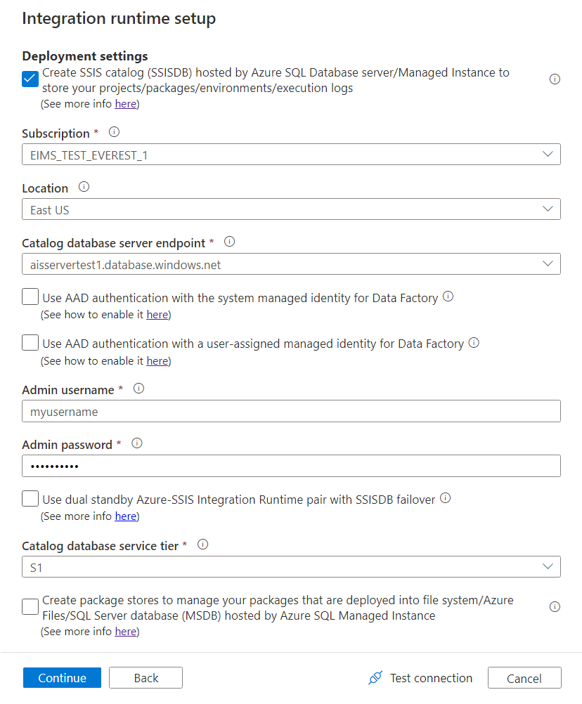
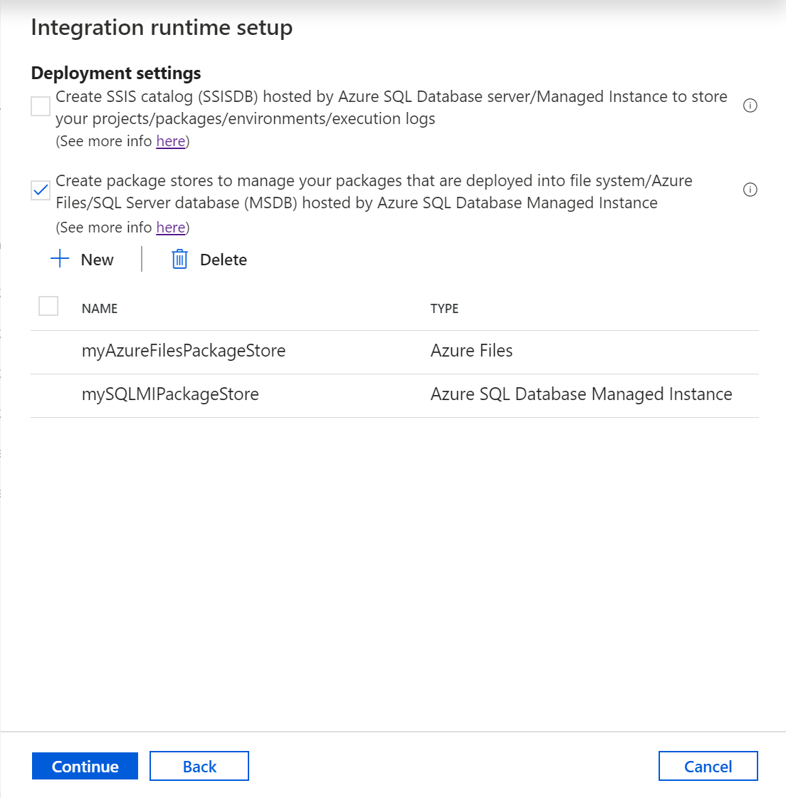
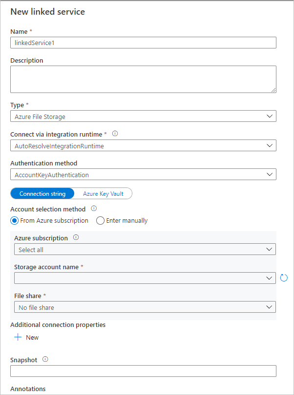
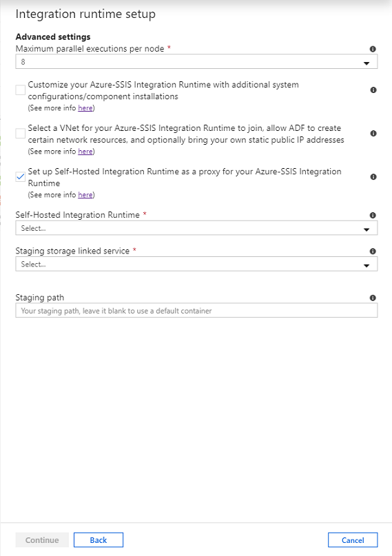
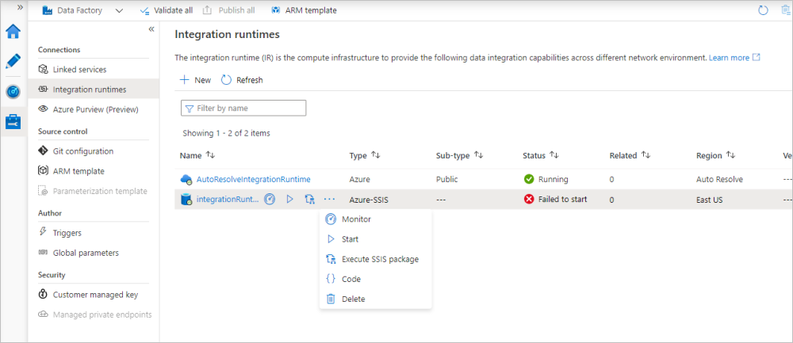

# Create an Azure-SSIS integration runtime in Azure Data Factory

[!INCLUDE[appliesto-adf-xxx-md](includes/appliesto-adf-xxx-md.md)]

This article provides steps for provisioning an Azure-SQL Server Integration Services (SSIS) integration runtime (IR) in Azure Data Factory (ADF). An Azure-SSIS IR supports:

- Running packages deployed into SSIS catalog (SSISDB) hosted by Azure SQL Database server/Managed Instance (Project Deployment Model)
- Running packages deployed into file system, Azure Files, or SQL Server database (MSDB) hosted by Azure SQL Managed Instance (Package Deployment Model)

After an Azure-SSIS IR is provisioned, you can use familiar tools to deploy and run your packages in Azure. These tools are already Azure-enabled and include SQL Server Data Tools (SSDT), SQL Server Management Studio (SSMS), and command-line utilities like `dtinstall`, `dtutil`, and `dtexec`.

The [Provisioning Azure-SSIS IR](tutorial-create-azure-ssis-runtime-portal.md) tutorial shows how to create an Azure-SSIS IR via the Azure portal or the Data Factory app. The tutorial also shows how to optionally use an Azure SQL Database server or managed instance to host SSISDB. This article expands on the tutorial and describes how to do these optional tasks:

- Use an Azure SQL Database server with IP firewall rules/virtual network service endpoints or a managed instance with private endpoint to host SSISDB. As a prerequisite, you need to configure virtual network permissions and settings for your Azure-SSIS IR to join a virtual network.

- Use Azure Active Directory (Azure AD) authentication with the managed identity for your data factory to connect to an Azure SQL Database server or managed instance. As a prerequisite, you need to add the managed identity for your data factory as a database user who can create an SSISDB instance.

- Join your Azure-SSIS IR to a virtual network, or configure a self-hosted IR as proxy for your Azure-SSIS IR to access data on-premises.

This article shows how to provision an Azure-SSIS IR by using the Azure portal, Azure PowerShell, and an Azure Resource Manager template.

## Prerequisites

[!INCLUDE [updated-for-az](../../includes/updated-for-az.md)]

- **Azure subscription**. If you don't already have a subscription, you can create a [free trial](https://azure.microsoft.com/pricing/free-trial/) account.

- **Azure SQL Database server or managed instance (optional)**. If you don't already have a database server, create one in the Azure portal before you get started. Data Factory will in turn create an SSISDB instance on this database server. 

  We recommend that you create the database server in the same Azure region as the integration runtime. This configuration lets the integration runtime write execution logs into SSISDB without crossing Azure regions.

  Keep these points in mind:

  - Based on the selected database server, the SSISDB instance can be created on your behalf as a single database, as part of an elastic pool, or in a managed instance. It can be accessible in a public network or by joining a virtual network. For guidance in choosing the type of database server to host SSISDB, see the [Compare SQL Database and SQL Managed Instance](#comparison-of-sql-database-and-sql-managed-instance) section in this article. 
  
    If you use an Azure SQL Database server with IP firewall rules/virtual network service endpoints or a managed instance with private endpoint to host SSISDB, or if you require access to on-premises data without configuring a self-hosted IR, you need to join your Azure-SSIS IR to a virtual network. For more information, see [Join an Azure-SSIS IR to a virtual network](https://docs.microsoft.com/azure/data-factory/join-azure-ssis-integration-runtime-virtual-network).

  - Confirm that the **Allow access to Azure services** setting is enabled for the database server. This setting is not applicable when you use an Azure SQL Database server with IP firewall rules/virtual network service endpoints or a managed instance with private endpoint to host SSISDB. For more information, see [Secure your Azure SQL database](../sql-database/sql-database-security-tutorial.md#create-firewall-rules). To enable this setting by using PowerShell, see [New-AzSqlServerFirewallRule](/powershell/module/az.sql/new-azsqlserverfirewallrule).

  - Add the IP address of the client machine, or a range of IP addresses that includes the IP address of the client machine, to the client IP address list in the firewall settings for the database server. For more information, see [Azure SQL Database server-level and database-level firewall rules](../sql-database/sql-database-firewall-configure.md).

  - You can connect to the database server by using SQL authentication with your server admin credentials, or by using Azure AD authentication with the managed identity for your data factory. For the latter, you need to add the managed identity for your data factory into an Azure AD group with access permissions to the database server. For more information, see [Enable Azure AD authentication for an Azure-SSIS IR](https://docs.microsoft.com/azure/data-factory/enable-aad-authentication-azure-ssis-ir).

  - Confirm that your database server does not have an SSISDB instance already. The provisioning of an Azure-SSIS IR does not support using an existing SSISDB instance.

- **Azure Resource Manager virtual network (optional)**. You must have an Azure Resource Manager virtual network if at least one of the following conditions is true:
  - You're hosting SSISDB on an Azure SQL Database server with IP firewall rules/virtual network service endpoints or a managed instance with private endpoint.
  - You want to connect to on-premises data stores from SSIS packages running on your Azure-SSIS IR without configuring a self-hosted IR.

- **Azure PowerShell (optional)**. Follow the instructions in [How to install and configure Azure PowerShell](/powershell/azure/install-az-ps), if you want to run a PowerShell script to provision your Azure-SSIS IR.

### Regional support

For a list of Azure regions in which Data Factory and an Azure-SSIS IR are available, see [Data Factory and SSIS IR availability by region](https://azure.microsoft.com/global-infrastructure/services/?products=data-factory&regions=all).

### Comparison of SQL Database and SQL Managed Instance

The following table compares certain features of an Azure SQL Database server and managed instance as they relate to Azure-SSIR IR:

| Feature | Single database/elastic pool| Managed instance |
|---------|--------------|------------------|
| **Scheduling** | The SQL Server Agent is not available.<br/><br/>See [Schedule a package execution in a Data Factory pipeline](https://docs.microsoft.com/sql/integration-services/lift-shift/ssis-azure-schedule-packages?view=sql-server-2017#activity).| The Managed Instance Agent is available. |
| **Authentication** | You can create an SSISDB instance with a contained database user who represents any Azure AD group with the managed identity of your data factory as a member in the **db_owner** role.<br/><br/>See [Enable Azure AD authentication to create an SSISDB in Azure SQL Database server](enable-aad-authentication-azure-ssis-ir.md#enable-azure-ad-on-azure-sql-database). | You can create an SSISDB instance with a contained database user who represents the managed identity of your data factory. <br/><br/>See [Enable Azure AD authentication to create an SSISDB in Azure SQL Managed Instance](enable-aad-authentication-azure-ssis-ir.md#enable-azure-ad-on-sql-managed-instance). |
| **Service tier** | When you create an Azure-SSIS IR with your Azure SQL Database server, you can select the service tier for SSISDB. There are multiple service tiers. | When you create an Azure-SSIS IR with your managed instance, you can't select the service tier for SSISDB. All databases in your managed instance share the same resource allocated to that instance. |
| **Virtual network** | Your Azure-SSIS IR can join an Azure Resource Manager virtual network if you use an Azure SQL Database server with IP firewall rules/virtual network service endpoints. | Your Azure-SSIS IR can join an Azure Resource Manager virtual network if you use a managed instance with private endpoint. The virtual network is required when you don't enable a public endpoint for your managed instance.<br/><br/>If you join your Azure-SSIS IR to the same virtual network as your managed instance, make sure that your Azure-SSIS IR is in a different subnet from your managed instance. If you join your Azure-SSIS IR to a different virtual network from your managed instance, we recommend either a virtual network peering or a network-to-network connection. See [Connect your application to an Azure SQL Database managed instance](../sql-database/sql-database-managed-instance-connect-app.md). |
| **Distributed transactions** | This feature is supported through elastic transactions. Microsoft Distributed Transaction Coordinator (MSDTC) transactions are not supported. If your SSIS packages use MSDTC to coordinate distributed transactions, consider migrating to elastic transactions for Azure SQL Database. For more information, see [Distributed transactions across cloud databases](../sql-database/sql-database-elastic-transactions-overview.md). | Not supported. |
| | | |

## Use the Azure portal to create an integration runtime

In this section, you use the Azure portal, specifically the Data Factory user interface (UI) or app, to create an Azure-SSIS IR.

### Create a data factory

To create your data factory via the Azure portal, follow the step-by-step instructions in [Create a data factory via the UI](https://docs.microsoft.com/azure/data-factory/quickstart-create-data-factory-portal#create-a-data-factory). Select **Pin to dashboard** while doing so, to allow quick access after its creation. 

After your data factory is created, open its overview page in the Azure portal. Select the **Author & Monitor** tile to open its **Let's get started** page on a separate tab. There, you can continue to create your Azure-SSIS IR.   

### Provision an Azure-SSIS integration runtime

On the **Let's get started** page, select the **Configure SSIS Integration Runtime** tile to open the **Integration runtime setup** pane.

   

   The **Integration runtime setup** pane has three pages where you successively configure general, deployment, and advanced settings.

#### General settings page

On the **General settings** page of **Integration runtime setup** pane, complete the following steps.

   

   1. For **Name**, enter the name of your integration runtime.

   1. For **Description**, enter the description of your integration runtime.

   1. For **Location**, select the location of your integration runtime. Only supported locations are displayed. We recommend that you select the same location of your database server to host SSISDB.

   1. For **Node Size**, select the size of the node in your integration runtime cluster. Only supported node sizes are displayed. Select a large node size (scale up) if you want to run many compute-intensive or memory-intensive packages.

   1. For **Node Number**, select the number of nodes in your integration runtime cluster. Only supported node numbers are displayed. Select a large cluster with many nodes (scale out) if you want to run many packages in parallel.

   1. For **Edition/License**, select the SQL Server edition for your integration runtime: Standard or Enterprise. Select Enterprise if you want to use advanced features on your integration runtime.

   1. For **Save Money**, select the Azure Hybrid Benefit option for your integration runtime: **Yes** or **No**. Select **Yes** if you want to bring your own SQL Server license with Software Assurance to benefit from cost savings with hybrid use.

   1. Select **Next**.

#### Deployment settings page

On the **Deployment settings** page of **Integration runtime setup** pane, complete the following steps.

   1. Select the **Create SSIS catalog (SSISDB) hosted by Azure SQL Database server/Managed Instance to store your projects/packages/environments/execution logs** check box to choose whether you want to deploy your packages into SSISDB (Project Deployment Model). Alternatively, no need to create SSISDB, if you want to deploy your packages into file system, Azure Files, or SQL Server database (MSDB) hosted by Azure SQL Managed Instance (Package Deployment Model).
   
      Regardless of your deployment model, select this check box to choose whether you want to use SQL Server Agent hosted by Azure SQL Managed Instance to orchestrate/schedule your package executions, since it's enabled by SSISDB. For more information, see [Schedule SSIS package executions via  Azure SQL Managed Instance Agent](https://docs.microsoft.com/azure/data-factory/how-to-invoke-ssis-package-managed-instance-agent).
   
      If you select this check box, you'll need to bring your own database server to host SSISDB that we'll create and manage on your behalf.

      
   
      1. For **Subscription**, select the Azure subscription that has your database server to host SSISDB.

      1. For **Location**, select the location of your database server to host SSISDB. We recommend that you select the same location of your integration runtime. 

      1. For **Catalog Database Server Endpoint**, select the endpoint of your database server to host SSISDB. 
    
         Based on the selected database server, the SSISDB instance can be created on your behalf as a single database, as part of an elastic pool, or in a managed instance. It can be accessible in a public network or by joining a virtual network. For guidance in choosing the type of database server to host SSISDB, see the [Compare SQL Database and SQL Managed Instance](#comparison-of-sql-database-and-sql-managed-instance) section in this article. 
    
         If you select an Azure SQL Database server with IP firewall rules/virtual network service endpoints or a managed instance with private endpoint to host SSISDB, or if you require access to on-premises data without configuring a self-hosted IR, you need to join your Azure-SSIS IR to a virtual network. For more information, see [Join an Azure-SSIS IR to a virtual network](https://docs.microsoft.com/azure/data-factory/join-azure-ssis-integration-runtime-virtual-network). 

      1. Select the **Use AAD authentication with the managed identity for your ADF** check box to choose the authentication method for your database server to host SSISDB. You'll choose either SQL authentication or Azure AD authentication with the managed identity for your data factory. 
    
         If you select the check box, you'll need to add the managed identity for your data factory into an Azure AD group with access permissions to your database server. For more information, see [Enable Azure AD authentication for an Azure-SSIS IR](https://docs.microsoft.com/azure/data-factory/enable-aad-authentication-azure-ssis-ir). 

      1. For **Admin Username**, enter the SQL authentication username for your database server to host SSISDB. 

      1. For **Admin Password**, enter the SQL authentication password for your database server to host SSISDB. 

      1. For **Catalog Database Service Tier**, select the service tier for your database server to host SSISDB. Select the Basic, Standard, or Premium tier, or select an elastic pool name.

   1. Select the **Create package stores to manage your packages that are deployed into file system/Azure Files/SQL Server database (MSDB) hosted by Azure SQL Managed Instance** check box to choose whether you want to manage your packages that are deployed into MSDB, file system, or Azure Files (Package Deployment Model) with Azure-SSIS IR package stores.
   
      Azure-SSIS IR package store allows you to import/export/delete/run packages and monitor/stop running packages via SSMS similar to the [legacy SSIS package store](https://docs.microsoft.com/sql/integration-services/service/package-management-ssis-service?view=sql-server-2017). For more information, see [Manage SSIS packages with Azure-SSIS IR package stores](https://docs.microsoft.com/azure/data-factory/azure-ssis-integration-runtime-package-store).
   
      If you select this check box, you can add multiple package stores to your Azure-SSIS IR by selecting **New**. Conversely, one package store can be shared by multiple Azure-SSIS IRs.

      

      On the **Add package store** pane, complete the following steps.
   
      1. For **Package store name**, enter the name of your package store. 

      1. For **Package store linked service**, select your existing linked service that stores the access information for file system/Azure Files/Azure SQL Managed Instance where your packages are deployed or create a new one by selecting **New**. On the **New linked service** pane, complete the following steps. 

         

         1. For **Name**, enter the name of your linked service. 
         
         1. For **Description**, enter the description of your linked service. 
         
         1. For **Type**, select **Azure File Storage**, **Azure SQL Managed Instance**, or **File System**.

         1. You can ignore **Connect via integration runtime**, since we always use your Azure-SSIS IR to fetch the access information for package stores.

         1. If you select **Azure File Storage**, complete the following steps. 

            1. For **Account selection method**, select **From Azure subscription** or **Enter manually**.
         
            1. If you select **From Azure subscription**, select the relevant **Azure subscription**, **Storage account name**, and **File share**.
            
            1. If you select **Enter manually**, enter `\\<storage account name>.file.core.windows.net\<file share name>` for **Host**, `Azure\<storage account name>` for **Username**, and `<storage account key>` for **Password** or select your **Azure Key Vault** where it's stored as a secret.

         1. If you select **Azure SQL Managed Instance**, complete the following steps. 

            1. Select **Connection string** to enter it manually or your **Azure Key Vault** where it's stored as a secret.
         
            1. If you select **Connection string**, complete the following steps. 

               1. For **Fully qualified domain name**, enter `<server name>.<dns prefix>.database.windows.net` or `<server name>.public.<dns prefix>.database.windows.net,3342` as the private or public endpoint of your Azure SQL Managed Instance, respectively. If you enter the private endpoint, **Test connection** isn't applicable, since ADF UI can't reach it.

               1. For **Database name**, enter `msdb`.
               
               1. For **Authentication type**, select **SQL Authentication**, **Managed Identity**, or **Service Principal**.

               1. If you select **SQL Authentication**, enter the relevant **Username** and **Password** or select your **Azure Key Vault** where it's stored as a secret.

               1. If you select **Managed Identity**, grant your ADF managed identity access to your Azure SQL Managed Instance.

               1. If you select **Service Principal**, enter the relevant **Service principal ID** and **Service principal key** or select your **Azure Key Vault** where it's stored as a secret.

         1. If you select **File system**, enter the UNC path of folder where your packages are deployed for **Host**, as well as the relevant **Username** and **Password** or select your **Azure Key Vault** where it's stored as a secret.

         1. Select **Test connection** when applicable and if it's successful, select **Create**.

      Your added package stores will appear on the **Deployment settings** page. To remove them, select their check boxes, and then select **Delete**.

   1. Select **Test connection** when applicable and if it's successful, select **Next**.

#### Advanced settings page

On the **Advanced settings** page of **Integration runtime setup** pane, complete the following steps.

   

   1. For **Maximum Parallel Executions Per Node**, select the maximum number of packages to run concurrently per node in your integration runtime cluster. Only supported package numbers are displayed. Select a low number if you want to use more than one core to run a single large package that's compute or memory intensive. Select a high number if you want to run one or more small packages in a single core.

   1. Select the **Customize your Azure-SSIS Integration Runtime with additional system configurations/component installations** check box to choose whether you want to add standard/express custom setups on your Azure-SSIS IR. For more information, see [Custom setup for an Azure-SSIS IR](https://docs.microsoft.com/azure/data-factory/how-to-configure-azure-ssis-ir-custom-setup).

      If you select the check box, complete the following steps.

      
   
      1. For **Custom setup container SAS URI**, enter the SAS URI of your container where you store scripts and associated files for standard custom setups.

      1. For **Express custom setup**, select **New** to open the **Add express custom setup** panel and then select any types under the **Express custom setup type** dropdown menu, e.g. **Run cmdkey command**, **Add environment variable**, **Install licensed component**, etc.

         If you select the **Install licensed component** type, you can then select any integrated components from our ISV partners under the **Component name** dropdown menu and if required, enter the product license key/upload the product license file that you purchased from them into the **License key**/**License file** box.
  
         Your added express custom setups will appear on the **Advanced settings** page. To remove them, you can select their check boxes and then select **Delete**.

   1. Select the **Select a VNet for your Azure-SSIS Integration Runtime to join, allow ADF to create certain network resources, and optionally bring your own static public IP addresses** check box to choose whether you want to join your integration runtime to a virtual network. 

      Select it if you use an Azure SQL Database server with IP firewall rules/virtual network service endpoints or a managed instance with private endpoint to host SSISDB, or if you require access to on-premises data (that is, you have on-premises data sources or destinations in your SSIS packages) without configuring a self-hosted IR. For more information, see [Join Azure-SSIS IR to a virtual network](https://docs.microsoft.com/azure/data-factory/join-azure-ssis-integration-runtime-virtual-network). 

      If you select the check box, complete the following steps.

      

      1. For **Subscription**, select the Azure subscription that has your virtual network.

      1. For **Location**, the same location of your integration runtime is selected.

      1. For **Type**, select the type of your virtual network: classic or Azure Resource Manager. We recommend that you select an Azure Resource Manager virtual network, because classic virtual networks will be deprecated soon.

      1. For **VNet Name**, select the name of your virtual network. It should be the same one used for your Azure SQL Database server with virtual network service endpoints or managed instance with private endpoint to host SSISDB. Or it should be the same one connected to your on-premises network. Otherwise, it can be any virtual network to bring your own static public IP addresses for Azure-SSIS IR.

      1. For **Subnet Name**, select the name of subnet for your virtual network. It should be the same one used for your Azure SQL Database server with virtual network service endpoints to host SSISDB. Or it should be a different subnet from the one used for your managed instance with private endpoint to host SSISDB. Otherwise, it can be any subnet to bring your own static public IP addresses for Azure-SSIS IR.

      1. Select the **Bring static public IP addresses for your Azure-SSIS Integration Runtime** check box to choose whether you want to bring your own static public IP addresses for Azure-SSIS IR, so you can allow them on the firewall for your data sources.

         If you select the check box, complete the following steps.

         1. For **First static public IP address**, select the first static public IP address that meets the requirements for your Azure-SSIS IR. If you don't have any, click **Create new** link to create static public IP addresses on Azure portal and then click the refresh button here, so you can select them.
	  
         1. For **Second static public IP address**, select the second static public IP address that meets the requirements for your Azure-SSIS IR. If you don't have any, click **Create new** link to create static public IP addresses on Azure portal and then click the refresh button here, so you can select them.

   1. Select the **Set up Self-Hosted Integration Runtime as a proxy for your Azure-SSIS Integration Runtime** check box to choose whether you want to configure a self-hosted IR as proxy for your Azure-SSIS IR. For more information, see [Set up a self-hosted IR as proxy](https://docs.microsoft.com/azure/data-factory/self-hosted-integration-runtime-proxy-ssis). 

      If you select the check box, complete the following steps.

      

      1. For **Self-Hosted Integration Runtime**, select your existing self-hosted IR as a proxy for Azure-SSIS IR.

      1. For **Staging Storage Linked Service**, select your existing Azure Blob storage linked service or create a new one for staging.

      1. For **Staging Path**, specify a blob container in your selected Azure Blob storage account or leave it empty to use a default one for staging.

   1. Select **VNet Validation** > **Continue**. 

On the **Summary** section, review all provisioning settings, bookmark the recommended documentation links, and select **Finish** to start the creation of your integration runtime.

   > [!NOTE]
   > Excluding any custom setup time, this process should finish within 5 minutes. But it might take 20-30 minutes for the Azure-SSIS IR to join a virtual network.
   >
   > If you use SSISDB, the Data Factory service will connect to your database server to prepare SSISDB. It also configures permissions and settings for your virtual network, if specified, and joins your Azure-SSIS IR to the virtual network.
   > 
   > When you provision an Azure-SSIS IR, Access Redistributable and Azure Feature Pack for SSIS are also installed. These components provide connectivity to Excel files, Access files, and various Azure data sources, in addition to the data sources that built-in components already support. For more information about built-in/preinstalled components, see [Built-in/preinstalled components on Azure-SSIS IR](https://docs.microsoft.com/azure/data-factory/built-in-preinstalled-components-ssis-integration-runtime). For more information about additional components that you can install, see [Custom setups for Azure-SSIS IR](https://docs.microsoft.com/azure/data-factory/how-to-configure-azure-ssis-ir-custom-setup).

#### Connections pane

On the **Connections** pane of **Manage** hub, switch to the **Integration runtimes** page and select **Refresh**. 

   

   You can edit/reconfigure your Azure-SSIS IR by selecting its name. You can also select the relevant buttons to monitor/start/stop/delete your Azure-SSIS IR, auto-generate an ADF pipeline with Execute SSIS Package activity to run on your Azure-SSIS IR, and view the JSON code/payload of your Azure-SSIS IR.  Editing/deleting your Azure-SSIS IR can only be done when it's stopped.

### Azure SSIS integration runtimes in the portal

1. In the Azure Data Factory UI, switch to the **Edit** tab and select **Connections**. Then switch to the **Integration Runtimes** tab to view existing integration runtimes in your data factory.

   

1. Select **New** to create a new Azure-SSIS IR and open the **Integration runtime setup** pane.

   

1. In the **Integration runtime setup** pane, select the **Lift-and-shift existing SSIS packages to execute in Azure** tile, and then select **Next**.

   

1. For the remaining steps to set up an Azure-SSIS IR, see the [Provision an Azure SSIS integration runtime](#provision-an-azure-ssis-integration-runtime) section.

## Use Azure PowerShell to create an integration runtime

In this section, you use Azure PowerShell to create an Azure-SSIS IR.

### Create variables

Copy and paste the following script. Specify values for the variables. 

```powershell
### Azure Data Factory info
# If your input contains a PSH special character like "$", precede it with the escape character "`" - for example, "`$"
$SubscriptionName = "[your Azure subscription name]"
$ResourceGroupName = "[your Azure resource group name]"
# Data factory name - must be globally unique
$DataFactoryName = "[your data factory name]"
# For supported regions, see https://azure.microsoft.com/global-infrastructure/services/?products=data-factory&regions=all
$DataFactoryLocation = "EastUS"

### Azure-SSIS integration runtime info - This is a Data Factory compute resource for running SSIS packages.
$AzureSSISName = "[your Azure-SSIS IR name]"
$AzureSSISDescription = "[your Azure-SSIS IR description]"
# For supported regions, see https://azure.microsoft.com/global-infrastructure/services/?products=data-factory&regions=all
$AzureSSISLocation = "EastUS"
# For supported node sizes, see https://azure.microsoft.com/pricing/details/data-factory/ssis/
$AzureSSISNodeSize = "Standard_D8_v3"
# 1-10 nodes are currently supported
$AzureSSISNodeNumber = 2
# Azure-SSIS IR edition/license info: Standard or Enterprise
$AzureSSISEdition = "Standard" # Standard by default, whereas Enterprise lets you use advanced features on your Azure-SSIS IR
# Azure-SSIS IR hybrid usage info: LicenseIncluded or BasePrice
$AzureSSISLicenseType = "LicenseIncluded" # LicenseIncluded by default, whereas BasePrice lets you bring your own on-premises SQL Server license with Software Assurance to earn cost savings from Azure Hybrid Benefit option
# For a Standard_D1_v2 node, up to 4 parallel executions per node are supported. For other nodes, up to (2 x number of cores) are currently supported.
$AzureSSISMaxParallelExecutionsPerNode = 8
# Custom setup info: Standard/express custom setups
$SetupScriptContainerSasUri = "" # OPTIONAL to provide a SAS URI of blob container for standard custom setup where your script and its associated files are stored
$ExpressCustomSetup = "[RunCmdkey|SetEnvironmentVariable|SentryOne.TaskFactory|oh22is.SQLPhonetics.NET|oh22is.HEDDA.IO|KingswaySoft.IntegrationToolkit|KingswaySoft.ProductivityPack|Theobald.XtractIS or leave it empty]" # OPTIONAL to configure an express custom setup without script
# Virtual network info: Classic or Azure Resource Manager
$VnetId = "[your virtual network resource ID or leave it empty]" # REQUIRED if you use an Azure SQL Database server with IP firewall rules/virtual network service endpoints or a managed instance with private endpoint to host SSISDB, or if you require access to on-premises data without configuring a self-hosted IR. We recommend an Azure Resource Manager virtual network, because classic virtual networks will be deprecated soon.
$SubnetName = "[your subnet name or leave it empty]" # WARNING: Use the same subnet as the one used for your Azure SQL Database server with virtual network service endpoints, or a different subnet from the one used for your managed instance with a private endpoint
# Public IP address info: OPTIONAL to provide two standard static public IP addresses with DNS name under the same subscription and in the same region as your virtual network
$FirstPublicIP = "[your first public IP address resource ID or leave it empty]"
$SecondPublicIP = "[your second public IP address resource ID or leave it empty]"

### SSISDB info
$SSISDBServerEndpoint = "[your Azure SQL Database server name.database.windows.net or managed instance name.DNS prefix.database.windows.net or managed instance name.public.DNS prefix.database.windows.net,3342 or leave it empty if you do not use SSISDB]" # WARNING: If you use SSISDB, ensure that there's no existing SSISDB on your database server, so we can prepare and manage one on your behalf
# Authentication info: SQL or Azure AD
$SSISDBServerAdminUserName = "[your server admin username for SQL authentication or leave it empty for Azure AD authentication]"
$SSISDBServerAdminPassword = "[your server admin password for SQL authentication or leave it empty for Azure AD authentication]"
# For the basic pricing tier, specify "Basic," not "B." For standard, premium, and elastic pool tiers, specify "S0," "S1," "S2," "S3," etc. See https://docs.microsoft.com/azure/sql-database/sql-database-resource-limits-database-server.
$SSISDBPricingTier = "[Basic|S0|S1|S2|S3|S4|S6|S7|S9|S12|P1|P2|P4|P6|P11|P15|…|ELASTIC_POOL(name = <elastic_pool_name>) for Azure SQL Database server or leave it empty for managed instance]"

### Self-hosted integration runtime info - This can be configured as a proxy for on-premises data access 
$DataProxyIntegrationRuntimeName = "" # OPTIONAL to configure a proxy for on-premises data access 
$DataProxyStagingLinkedServiceName = "" # OPTIONAL to configure a proxy for on-premises data access 
$DataProxyStagingPath = "" # OPTIONAL to configure a proxy for on-premises data access 
```

### Sign in and select a subscription

Add the following script to sign in and select your Azure subscription.

```powershell
Connect-AzAccount
Select-AzSubscription -SubscriptionName $SubscriptionName
```

### Validate the connection to database server

Add the following script to validate your Azure SQL Database server or managed instance.

```powershell
# Validate only if you use SSISDB and you don't use virtual network or Azure AD authentication
if(![string]::IsNullOrEmpty($SSISDBServerEndpoint))
{
    if([string]::IsNullOrEmpty($VnetId) -and [string]::IsNullOrEmpty($SubnetName))
    {
        if(![string]::IsNullOrEmpty($SSISDBServerAdminUserName) -and ![string]::IsNullOrEmpty($SSISDBServerAdminPassword))
        {
            $SSISDBConnectionString = "Data Source=" + $SSISDBServerEndpoint + ";User ID=" + $SSISDBServerAdminUserName + ";Password=" + $SSISDBServerAdminPassword
            $sqlConnection = New-Object System.Data.SqlClient.SqlConnection $SSISDBConnectionString;
            Try
            {
                $sqlConnection.Open();
            }
            Catch [System.Data.SqlClient.SqlException]
            {
                Write-Warning "Cannot connect to your Azure SQL Database server, exception: $_";
                Write-Warning "Please make sure the server you specified has already been created. Do you want to proceed? [Y/N]"
                $yn = Read-Host
                if(!($yn -ieq "Y"))
                {
                    Return;
                }
            }
        }
    }
}
```

### Configure the virtual network

Add the following script to automatically configure virtual network permissions and settings for your Azure-SSIS integration runtime to join.

```powershell
# Make sure to run this script against the subscription to which the virtual network belongs
if(![string]::IsNullOrEmpty($VnetId) -and ![string]::IsNullOrEmpty($SubnetName))
{
    # Register to the Azure Batch resource provider
    $BatchApplicationId = "ddbf3205-c6bd-46ae-8127-60eb93363864"
    $BatchObjectId = (Get-AzADServicePrincipal -ServicePrincipalName $BatchApplicationId).Id
    Register-AzResourceProvider -ProviderNamespace Microsoft.Batch
    while(!(Get-AzResourceProvider -ProviderNamespace "Microsoft.Batch").RegistrationState.Contains("Registered"))
    {
    Start-Sleep -s 10
    }
    if($VnetId -match "/providers/Microsoft.ClassicNetwork/")
    {
        # Assign the VM contributor role to Microsoft.Batch
        New-AzRoleAssignment -ObjectId $BatchObjectId -RoleDefinitionName "Classic Virtual Machine Contributor" -Scope $VnetId
    }
}
```

### Create a resource group

Create an [Azure resource group](../azure-resource-manager/management/overview.md) by using the [New-AzResourceGroup](/powershell/module/az.resources/new-azresourcegroup) command. A resource group is a logical container into which Azure resources are deployed and managed as a group.

If your resource group already exists, don't copy this code to your script. 

```powershell
New-AzResourceGroup -Location $DataFactoryLocation -Name $ResourceGroupName
```

### Create a data factory

Run the following command to create a data factory.

```powershell
Set-AzDataFactoryV2 -ResourceGroupName $ResourceGroupName `
    -Location $DataFactoryLocation `
    -Name $DataFactoryName
```

### Create an integration runtime

Run the following commands to create an Azure-SSIS integration runtime that runs SSIS packages in Azure.

If you don't use SSISDB, you can omit the `CatalogServerEndpoint`, `CatalogPricingTier`, and `CatalogAdminCredential` parameters.

If you don't use an Azure SQL Database server with IP firewall rules/virtual network service endpoints or a managed instance with private endpoint to host SSISDB, or require access to on-premises data, you can omit the `VNetId` and `Subnet` parameters or pass empty values for them. You can also omit them if you configure a self-hosted IR as proxy for your Azure-SSIS IR to access data on-premises. Otherwise, you can't omit them and must pass valid values from your virtual network configuration. For more information, see [Join an Azure-SSIS IR to a virtual network](https://docs.microsoft.com/azure/data-factory/join-azure-ssis-integration-runtime-virtual-network).

If you use managed instance to host SSISDB, you can omit the `CatalogPricingTier` parameter or pass an empty value for it. Otherwise, you can't omit it and must pass a valid value from the list of supported pricing tiers for Azure SQL Database. For more information, see [SQL Database resource limits](../sql-database/sql-database-resource-limits.md).

If you use Azure AD authentication with the managed identity for your data factory to connect to the database server, you can omit the `CatalogAdminCredential` parameter. But you must add the managed identity for your data factory into an Azure AD group with access permissions to the database server. For more information, see [Enable Azure AD authentication for an Azure-SSIS IR](https://docs.microsoft.com/azure/data-factory/enable-aad-authentication-azure-ssis-ir). Otherwise, you can't omit it and must pass a valid object formed from your server admin username and password for SQL authentication.

```powershell
Set-AzDataFactoryV2IntegrationRuntime -ResourceGroupName $ResourceGroupName `
    -DataFactoryName $DataFactoryName `
    -Name $AzureSSISName `
    -Description $AzureSSISDescription `
    -Type Managed `
    -Location $AzureSSISLocation `
    -NodeSize $AzureSSISNodeSize `
    -NodeCount $AzureSSISNodeNumber `
    -Edition $AzureSSISEdition `
    -LicenseType $AzureSSISLicenseType `
    -MaxParallelExecutionsPerNode $AzureSSISMaxParallelExecutionsPerNode `
    -VnetId $VnetId `
    -Subnet $SubnetName
	   
# Add the CatalogServerEndpoint, CatalogPricingTier, and CatalogAdminCredential parameters if you use SSISDB
if(![string]::IsNullOrEmpty($SSISDBServerEndpoint))
{
    Set-AzDataFactoryV2IntegrationRuntime -ResourceGroupName $ResourceGroupName `
        -DataFactoryName $DataFactoryName `
        -Name $AzureSSISName `
        -CatalogServerEndpoint $SSISDBServerEndpoint `
        -CatalogPricingTier $SSISDBPricingTier

    if(![string]::IsNullOrEmpty($SSISDBServerAdminUserName) –and ![string]::IsNullOrEmpty($SSISDBServerAdminPassword)) # Add the CatalogAdminCredential parameter if you don't use Azure AD authentication
    {
        $secpasswd = ConvertTo-SecureString $SSISDBServerAdminPassword -AsPlainText -Force
        $serverCreds = New-Object System.Management.Automation.PSCredential($SSISDBServerAdminUserName, $secpasswd)

        Set-AzDataFactoryV2IntegrationRuntime -ResourceGroupName $ResourceGroupName `
            -DataFactoryName $DataFactoryName `
            -Name $AzureSSISName `
            -CatalogAdminCredential $serverCreds
    }
}

# Add custom setup parameters if you use standard/express custom setups
if(![string]::IsNullOrEmpty($SetupScriptContainerSasUri))
{
    Set-AzDataFactoryV2IntegrationRuntime -ResourceGroupName $ResourceGroupName `
        -DataFactoryName $DataFactoryName `
        -Name $AzureSSISName `
        -SetupScriptContainerSasUri $SetupScriptContainerSasUri
}
if(![string]::IsNullOrEmpty($ExpressCustomSetup))
{
    if($ExpressCustomSetup -eq "RunCmdkey")
    {
        $addCmdkeyArgument = "YourFileShareServerName or YourAzureStorageAccountName.file.core.windows.net"
        $userCmdkeyArgument = "YourDomainName\YourUsername or azure\YourAzureStorageAccountName"
        $passCmdkeyArgument = New-Object Microsoft.Azure.Management.DataFactory.Models.SecureString("YourPassword or YourAccessKey")
        $setup = New-Object Microsoft.Azure.Management.DataFactory.Models.CmdkeySetup($addCmdkeyArgument, $userCmdkeyArgument, $passCmdkeyArgument)
    }
    if($ExpressCustomSetup -eq "SetEnvironmentVariable")
    {
        $variableName = "YourVariableName"
        $variableValue = "YourVariableValue"
        $setup = New-Object Microsoft.Azure.Management.DataFactory.Models.EnvironmentVariableSetup($variableName, $variableValue)
    }
    if($ExpressCustomSetup -eq "SentryOne.TaskFactory")
    {
        $licenseKey = New-Object Microsoft.Azure.Management.DataFactory.Models.SecureString("YourLicenseKey")
        $setup = New-Object Microsoft.Azure.Management.DataFactory.Models.ComponentSetup($ExpressCustomSetup, $licenseKey)
    }
    if($ExpressCustomSetup -eq "oh22is.SQLPhonetics.NET")
    {
        $licenseKey = New-Object Microsoft.Azure.Management.DataFactory.Models.SecureString("YourLicenseKey")
        $setup = New-Object Microsoft.Azure.Management.DataFactory.Models.ComponentSetup($ExpressCustomSetup, $licenseKey)
    }
    if($ExpressCustomSetup -eq "oh22is.HEDDA.IO")
    {
        $setup = New-Object Microsoft.Azure.Management.DataFactory.Models.ComponentSetup($ExpressCustomSetup)
    }
    if($ExpressCustomSetup -eq "KingswaySoft.IntegrationToolkit")
    {
        $licenseKey = New-Object Microsoft.Azure.Management.DataFactory.Models.SecureString("YourLicenseKey")
        $setup = New-Object Microsoft.Azure.Management.DataFactory.Models.ComponentSetup($ExpressCustomSetup, $licenseKey)
    }
    if($ExpressCustomSetup -eq "KingswaySoft.ProductivityPack")
    {
        $licenseKey = New-Object Microsoft.Azure.Management.DataFactory.Models.SecureString("YourLicenseKey")
        $setup = New-Object Microsoft.Azure.Management.DataFactory.Models.ComponentSetup($ExpressCustomSetup, $licenseKey)
    }    
    if($ExpressCustomSetup -eq "Theobald.XtractIS")
    {
        $jsonData = Get-Content -Raw -Path YourLicenseFile.json
        $jsonData = $jsonData -replace '\s',''
        $jsonData = $jsonData.replace('"','\"')
        $licenseKey = New-Object Microsoft.Azure.Management.DataFactory.Models.SecureString($jsonData)
        $setup = New-Object Microsoft.Azure.Management.DataFactory.Models.ComponentSetup($ExpressCustomSetup, $licenseKey)
    }
    # Create an array of one or more express custom setups
    $setups = New-Object System.Collections.ArrayList
    $setups.Add($setup)

    Set-AzDataFactoryV2IntegrationRuntime -ResourceGroupName $ResourceGroupName `
        -DataFactoryName $DataFactoryName `
        -Name $AzureSSISName `
        -ExpressCustomSetup $setups
}

# Add self-hosted integration runtime parameters if you configure a proxy for on-premises data accesss
if(![string]::IsNullOrEmpty($DataProxyIntegrationRuntimeName) -and ![string]::IsNullOrEmpty($DataProxyStagingLinkedServiceName))
{
    Set-AzDataFactoryV2IntegrationRuntime -ResourceGroupName $ResourceGroupName `
        -DataFactoryName $DataFactoryName `
        -Name $AzureSSISName `
        -DataProxyIntegrationRuntimeName $DataProxyIntegrationRuntimeName `
        -DataProxyStagingLinkedServiceName $DataProxyStagingLinkedServiceName

    if(![string]::IsNullOrEmpty($DataProxyStagingPath))
    {
        Set-AzDataFactoryV2IntegrationRuntime -ResourceGroupName $ResourceGroupName `
            -DataFactoryName $DataFactoryName `
            -Name $AzureSSISName `
            -DataProxyStagingPath $DataProxyStagingPath
    }
}

# Add public IP address parameters if you bring your own static public IP addresses
if(![string]::IsNullOrEmpty($FirstPublicIP) -and ![string]::IsNullOrEmpty($SecondPublicIP))
{
    $publicIPs = @($FirstPublicIP, $SecondPublicIP)
    Set-AzDataFactoryV2IntegrationRuntime -ResourceGroupName $ResourceGroupName `
        -DataFactoryName $DataFactoryName `
        -Name $AzureSSISName `
        -PublicIPs $publicIPs
}
```

### Start the integration runtime

Run the following commands to start the Azure-SSIS integration runtime.

```powershell
write-host("##### Starting #####")
Start-AzDataFactoryV2IntegrationRuntime -ResourceGroupName $ResourceGroupName `
    -DataFactoryName $DataFactoryName `
    -Name $AzureSSISName `
    -Force

write-host("##### Completed #####")
write-host("If any cmdlet is unsuccessful, please consider using -Debug option for diagnostics.")
```

> [!NOTE]
> Excluding any custom setup time, this process should finish within 5 minutes. But it might take 20-30 minutes for the Azure-SSIS IR to join a virtual network.
>
> If you use SSISDB, the Data Factory service will connect to your database server to prepare SSISDB. It also configures permissions and settings for your virtual network, if specified, and joins your Azure-SSIS IR to the virtual network.
> 
> When you provision an Azure-SSIS IR, Access Redistributable and Azure Feature Pack for SSIS are also installed. These components provide connectivity to Excel files, Access files, and various Azure data sources, in addition to the data sources that built-in components already support. For more information about built-in/preinstalled components, see [Built-in/preinstalled components on Azure-SSIS IR](https://docs.microsoft.com/azure/data-factory/built-in-preinstalled-components-ssis-integration-runtime). For more information about additional components that you can install, see [Custom setups for Azure-SSIS IR](https://docs.microsoft.com/azure/data-factory/how-to-configure-azure-ssis-ir-custom-setup).

### Full script

Here's the full script that creates an Azure-SSIS integration runtime.

```powershell
### Azure Data Factory info
# If your input contains a PSH special character like "$", precede it with the escape character "`" - for example, "`$"
$SubscriptionName = "[your Azure subscription name]"
$ResourceGroupName = "[your Azure resource group name]"
# Data factory name - must be globally unique
$DataFactoryName = "[your data factory name]"
# For supported regions, see https://azure.microsoft.com/global-infrastructure/services/?products=data-factory&regions=all
$DataFactoryLocation = "EastUS"

### Azure-SSIS integration runtime info - This is a Data Factory compute resource for running SSIS packages.
$AzureSSISName = "[your Azure-SSIS IR name]"
$AzureSSISDescription = "[your Azure-SSIS IR description]"
# For supported regions, see https://azure.microsoft.com/global-infrastructure/services/?products=data-factory&regions=all
$AzureSSISLocation = "EastUS"
# For supported node sizes, see https://azure.microsoft.com/pricing/details/data-factory/ssis/
$AzureSSISNodeSize = "Standard_D8_v3"
# 1-10 nodes are currently supported
$AzureSSISNodeNumber = 2
# Azure-SSIS IR edition/license info: Standard or Enterprise
$AzureSSISEdition = "Standard" # Standard by default, whereas Enterprise lets you use advanced features on your Azure-SSIS IR
# Azure-SSIS IR hybrid usage info: LicenseIncluded or BasePrice
$AzureSSISLicenseType = "LicenseIncluded" # LicenseIncluded by default, whereas BasePrice lets you bring your own on-premises SQL Server license with Software Assurance to earn cost savings from the Azure Hybrid Benefit option
# For a Standard_D1_v2 node, up to four parallel executions per node are supported. For other nodes, up to (2 x number of cores) are currently supported.
$AzureSSISMaxParallelExecutionsPerNode = 8
# Custom setup info: Standard/express custom setups
$SetupScriptContainerSasUri = "" # OPTIONAL to provide a SAS URI of blob container for standard custom setup where your script and its associated files are stored
$ExpressCustomSetup = "[RunCmdkey|SetEnvironmentVariable|SentryOne.TaskFactory|oh22is.SQLPhonetics.NET|oh22is.HEDDA.IO|KingswaySoft.IntegrationToolkit|KingswaySoft.ProductivityPack|Theobald.XtractIS or leave it empty]" # OPTIONAL to configure an express custom setup without script
# Virtual network info: Classic or Azure Resource Manager
$VnetId = "[your virtual network resource ID or leave it empty]" # REQUIRED if you use an Azure SQL Database server with IP firewall rules/virtual network service endpoints or a managed instance with private endpoint to host SSISDB, or if you require access to on-premises data without configuring a self-hosted IR. We recommend an Azure Resource Manager virtual network, because classic virtual networks will be deprecated soon.
$SubnetName = "[your subnet name or leave it empty]" # WARNING: Use the same subnet as the one used for your Azure SQL Database server with virtual network service endpoints, or a different subnet from the one used for your managed instance with a private endpoint
# Public IP address info: OPTIONAL to provide two standard static public IP addresses with DNS name under the same subscription and in the same region as your virtual network
$FirstPublicIP = "[your first public IP address resource ID or leave it empty]"
$SecondPublicIP = "[your second public IP address resource ID or leave it empty]"

### SSISDB info
$SSISDBServerEndpoint = "[your Azure SQL Database server name.database.windows.net or managed instance name.DNS prefix.database.windows.net or managed instance name.public.DNS prefix.database.windows.net,3342 or leave it empty if you do not use SSISDB]" # WARNING: If you use SSISDB, ensure that there's no existing SSISDB on your database server, so we can prepare and manage one on your behalf
# Authentication info: SQL or Azure AD
$SSISDBServerAdminUserName = "[your server admin username for SQL authentication or leave it empty for Azure AD authentication]"
$SSISDBServerAdminPassword = "[your server admin password for SQL authentication or leave it empty for Azure AD authentication]"
# For the basic pricing tier, specify "Basic," not "B." For standard, premium, and elastic pool tiers, specify "S0," "S1," "S2," "S3," etc. See https://docs.microsoft.com/azure/sql-database/sql-database-resource-limits-database-server.
$SSISDBPricingTier = "[Basic|S0|S1|S2|S3|S4|S6|S7|S9|S12|P1|P2|P4|P6|P11|P15|…|ELASTIC_POOL(name = <elastic_pool_name>) for Azure SQL Database server or leave it empty for managed instance]"

### Self-hosted integration runtime info - This can be configured as a proxy for on-premises data access 
$DataProxyIntegrationRuntimeName = "" # OPTIONAL to configure a proxy for on-premises data access 
$DataProxyStagingLinkedServiceName = "" # OPTIONAL to configure a proxy for on-premises data access 
$DataProxyStagingPath = "" # OPTIONAL to configure a proxy for on-premises data access 

### Sign in and select a subscription
Connect-AzAccount
Select-AzSubscription -SubscriptionName $SubscriptionName

### Validate the connection to the database server
# Validate only if you use SSISDB and don't use a virtual network or Azure AD authentication
if(![string]::IsNullOrEmpty($SSISDBServerEndpoint))
{
    if([string]::IsNullOrEmpty($VnetId) -and [string]::IsNullOrEmpty($SubnetName))
    {
        if(![string]::IsNullOrEmpty($SSISDBServerAdminUserName) -and ![string]::IsNullOrEmpty($SSISDBServerAdminPassword))
        {
            $SSISDBConnectionString = "Data Source=" + $SSISDBServerEndpoint + ";User ID=" + $SSISDBServerAdminUserName + ";Password=" + $SSISDBServerAdminPassword
            $sqlConnection = New-Object System.Data.SqlClient.SqlConnection $SSISDBConnectionString;
            Try
            {
                $sqlConnection.Open();
            }
            Catch [System.Data.SqlClient.SqlException]
            {
                Write-Warning "Cannot connect to your Azure SQL Database server, exception: $_";
                Write-Warning "Please make sure the server you specified has already been created. Do you want to proceed? [Y/N]"
                $yn = Read-Host
                if(!($yn -ieq "Y"))
                {
                    Return;
                }
            }
        }
    }
}

### Configure a virtual network
# Make sure to run this script against the subscription to which the virtual network belongs
if(![string]::IsNullOrEmpty($VnetId) -and ![string]::IsNullOrEmpty($SubnetName))
{
    # Register to the Azure Batch resource provider
    $BatchApplicationId = "ddbf3205-c6bd-46ae-8127-60eb93363864"
    $BatchObjectId = (Get-AzADServicePrincipal -ServicePrincipalName $BatchApplicationId).Id
    Register-AzResourceProvider -ProviderNamespace Microsoft.Batch
    while(!(Get-AzResourceProvider -ProviderNamespace "Microsoft.Batch").RegistrationState.Contains("Registered"))
    {
    Start-Sleep -s 10
    }
    if($VnetId -match "/providers/Microsoft.ClassicNetwork/")
    {
        # Assign the VM contributor role to Microsoft.Batch
        New-AzRoleAssignment -ObjectId $BatchObjectId -RoleDefinitionName "Classic Virtual Machine Contributor" -Scope $VnetId
    }
}

### Create a data factory
Set-AzDataFactoryV2 -ResourceGroupName $ResourceGroupName `
    -Location $DataFactoryLocation `
    -Name $DataFactoryName

### Create an integration runtime
Set-AzDataFactoryV2IntegrationRuntime -ResourceGroupName $ResourceGroupName `
    -DataFactoryName $DataFactoryName `
    -Name $AzureSSISName `
    -Description $AzureSSISDescription `
    -Type Managed `
    -Location $AzureSSISLocation `
    -NodeSize $AzureSSISNodeSize `
    -NodeCount $AzureSSISNodeNumber `
    -Edition $AzureSSISEdition `
    -LicenseType $AzureSSISLicenseType `
    -MaxParallelExecutionsPerNode $AzureSSISMaxParallelExecutionsPerNode `
    -VnetId $VnetId `
    -Subnet $SubnetName
	   
# Add CatalogServerEndpoint, CatalogPricingTier, and CatalogAdminCredential parameters if you use SSISDB
if(![string]::IsNullOrEmpty($SSISDBServerEndpoint))
{
    Set-AzDataFactoryV2IntegrationRuntime -ResourceGroupName $ResourceGroupName `
        -DataFactoryName $DataFactoryName `
        -Name $AzureSSISName `
        -CatalogServerEndpoint $SSISDBServerEndpoint `
        -CatalogPricingTier $SSISDBPricingTier

    if(![string]::IsNullOrEmpty($SSISDBServerAdminUserName) –and ![string]::IsNullOrEmpty($SSISDBServerAdminPassword)) # Add the CatalogAdminCredential parameter if you don't use Azure AD authentication
    {
        $secpasswd = ConvertTo-SecureString $SSISDBServerAdminPassword -AsPlainText -Force
        $serverCreds = New-Object System.Management.Automation.PSCredential($SSISDBServerAdminUserName, $secpasswd)

        Set-AzDataFactoryV2IntegrationRuntime -ResourceGroupName $ResourceGroupName `
            -DataFactoryName $DataFactoryName `
            -Name $AzureSSISName `
            -CatalogAdminCredential $serverCreds
    }
}

# Add custom setup parameters if you use standard/express custom setups
if(![string]::IsNullOrEmpty($SetupScriptContainerSasUri))
{
    Set-AzDataFactoryV2IntegrationRuntime -ResourceGroupName $ResourceGroupName `
        -DataFactoryName $DataFactoryName `
        -Name $AzureSSISName `
        -SetupScriptContainerSasUri $SetupScriptContainerSasUri
}
if(![string]::IsNullOrEmpty($ExpressCustomSetup))
{
    if($ExpressCustomSetup -eq "RunCmdkey")
    {
        $addCmdkeyArgument = "YourFileShareServerName or YourAzureStorageAccountName.file.core.windows.net"
        $userCmdkeyArgument = "YourDomainName\YourUsername or azure\YourAzureStorageAccountName"
        $passCmdkeyArgument = New-Object Microsoft.Azure.Management.DataFactory.Models.SecureString("YourPassword or YourAccessKey")
        $setup = New-Object Microsoft.Azure.Management.DataFactory.Models.CmdkeySetup($addCmdkeyArgument, $userCmdkeyArgument, $passCmdkeyArgument)
    }
    if($ExpressCustomSetup -eq "SetEnvironmentVariable")
    {
        $variableName = "YourVariableName"
        $variableValue = "YourVariableValue"
        $setup = New-Object Microsoft.Azure.Management.DataFactory.Models.EnvironmentVariableSetup($variableName, $variableValue)
    }
    if($ExpressCustomSetup -eq "SentryOne.TaskFactory")
    {
        $licenseKey = New-Object Microsoft.Azure.Management.DataFactory.Models.SecureString("YourLicenseKey")
        $setup = New-Object Microsoft.Azure.Management.DataFactory.Models.ComponentSetup($ExpressCustomSetup, $licenseKey)
    }
    if($ExpressCustomSetup -eq "oh22is.SQLPhonetics.NET")
    {
        $licenseKey = New-Object Microsoft.Azure.Management.DataFactory.Models.SecureString("YourLicenseKey")
        $setup = New-Object Microsoft.Azure.Management.DataFactory.Models.ComponentSetup($ExpressCustomSetup, $licenseKey)
    }
    if($ExpressCustomSetup -eq "oh22is.HEDDA.IO")
    {
        $setup = New-Object Microsoft.Azure.Management.DataFactory.Models.ComponentSetup($ExpressCustomSetup)
    }
    if($ExpressCustomSetup -eq "KingswaySoft.IntegrationToolkit")
    {
        $licenseKey = New-Object Microsoft.Azure.Management.DataFactory.Models.SecureString("YourLicenseKey")
        $setup = New-Object Microsoft.Azure.Management.DataFactory.Models.ComponentSetup($ExpressCustomSetup, $licenseKey)
    }
    if($ExpressCustomSetup -eq "KingswaySoft.ProductivityPack")
    {
        $licenseKey = New-Object Microsoft.Azure.Management.DataFactory.Models.SecureString("YourLicenseKey")
        $setup = New-Object Microsoft.Azure.Management.DataFactory.Models.ComponentSetup($ExpressCustomSetup, $licenseKey)
    }    
    if($ExpressCustomSetup -eq "Theobald.XtractIS")
    {
        $jsonData = Get-Content -Raw -Path YourLicenseFile.json
        $jsonData = $jsonData -replace '\s',''
        $jsonData = $jsonData.replace('"','\"')
        $licenseKey = New-Object Microsoft.Azure.Management.DataFactory.Models.SecureString($jsonData)
        $setup = New-Object Microsoft.Azure.Management.DataFactory.Models.ComponentSetup($ExpressCustomSetup, $licenseKey)
    }
    # Create an array of one or more express custom setups
    $setups = New-Object System.Collections.ArrayList
    $setups.Add($setup)

    Set-AzDataFactoryV2IntegrationRuntime -ResourceGroupName $ResourceGroupName `
        -DataFactoryName $DataFactoryName `
        -Name $AzureSSISName `
        -ExpressCustomSetup $setups
}

# Add self-hosted integration runtime parameters if you configure a proxy for on-premises data accesss
if(![string]::IsNullOrEmpty($DataProxyIntegrationRuntimeName) -and ![string]::IsNullOrEmpty($DataProxyStagingLinkedServiceName))
{
    Set-AzDataFactoryV2IntegrationRuntime -ResourceGroupName $ResourceGroupName `
        -DataFactoryName $DataFactoryName `
        -Name $AzureSSISName `
        -DataProxyIntegrationRuntimeName $DataProxyIntegrationRuntimeName `
        -DataProxyStagingLinkedServiceName $DataProxyStagingLinkedServiceName

    if(![string]::IsNullOrEmpty($DataProxyStagingPath))
    {
        Set-AzDataFactoryV2IntegrationRuntime -ResourceGroupName $ResourceGroupName `
            -DataFactoryName $DataFactoryName `
            -Name $AzureSSISName `
            -DataProxyStagingPath $DataProxyStagingPath
    }
}

# Add public IP address parameters if you bring your own static public IP addresses
if(![string]::IsNullOrEmpty($FirstPublicIP) -and ![string]::IsNullOrEmpty($SecondPublicIP))
{
    $publicIPs = @($FirstPublicIP, $SecondPublicIP)
    Set-AzDataFactoryV2IntegrationRuntime -ResourceGroupName $ResourceGroupName `
        -DataFactoryName $DataFactoryName `
        -Name $AzureSSISName `
        -PublicIPs $publicIPs
}

### Start the integration runtime
write-host("##### Starting #####")
Start-AzDataFactoryV2IntegrationRuntime -ResourceGroupName $ResourceGroupName `
    -DataFactoryName $DataFactoryName `
    -Name $AzureSSISName `
    -Force

write-host("##### Completed #####")
write-host("If any cmdlet is unsuccessful, please consider using -Debug option for diagnostics.")
```

## Use an Azure Resource Manager template to create an integration runtime

In this section, you use an Azure Resource Manager template to create the Azure-SSIS integration runtime. Here's a sample walkthrough:

1. Create a JSON file with the following Azure Resource Manager template. Replace values in the angle brackets (placeholders) with your own values.

    ```json
    {
        "contentVersion": "1.0.0.0",
        "$schema": "https://schema.management.azure.com/schemas/2015-01-01/deploymentTemplate.json#",
        "parameters": {},
        "variables": {},
        "resources": [{
            "name": "<Specify a name for your data factory>",
            "apiVersion": "2018-06-01",
            "type": "Microsoft.DataFactory/factories",
            "location": "East US",
            "properties": {},
            "resources": [{
                "type": "integrationruntimes",
                "name": "<Specify a name for your Azure-SSIS IR>",
                "dependsOn": [ "<The name of the data factory you specified at the beginning>" ],
                "apiVersion": "2018-06-01",
                "properties": {
                    "type": "Managed",
                    "typeProperties": {
                        "computeProperties": {
                            "location": "East US",
                            "nodeSize": "Standard_D8_v3",
                            "numberOfNodes": 1,
                            "maxParallelExecutionsPerNode": 8
                        },
                        "ssisProperties": {
                            "catalogInfo": {
                                "catalogServerEndpoint": "<Azure SQL Database server name>.database.windows.net",
                                "catalogAdminUserName": "<Azure SQL Database server admin username>",
                                "catalogAdminPassword": {
                                    "type": "SecureString",
                                    "value": "<Azure SQL Database server admin password>"
                                },
                                "catalogPricingTier": "Basic"
                            }
                        }
                    }
                }
            }]
        }]
    }
    ```

2. To deploy the Azure Resource Manager template, run the `New-AzResourceGroupDeployment` command as shown in the following example. In the example, `ADFTutorialResourceGroup` is the name of your resource group. `ADFTutorialARM.json` is the file that contains the JSON definition for your data factory and the Azure-SSIS IR.

    ```powershell
    New-AzResourceGroupDeployment -Name MyARMDeployment -ResourceGroupName ADFTutorialResourceGroup -TemplateFile ADFTutorialARM.json
    ```

    This command creates your data factory and Azure-SSIS IR in it, but it doesn't start the IR.

3. To start your Azure-SSIS IR, run the `Start-AzDataFactoryV2IntegrationRuntime` command:

    ```powershell
    Start-AzDataFactoryV2IntegrationRuntime -ResourceGroupName "<Resource Group Name>" `
        -DataFactoryName "<Data Factory Name>" `
        -Name "<Azure SSIS IR Name>" `
        -Force
    ```

> [!NOTE]
> Excluding any custom setup time, this process should finish within 5 minutes. But it might take 20-30 minutes for the Azure-SSIS IR to join a virtual network.
>
> If you use SSISDB, the Data Factory service will connect to your database server to prepare SSISDB. It also configures permissions and settings for your virtual network, if specified, and joins your Azure-SSIS IR to the virtual network.
> 
> When you provision an Azure-SSIS IR, Access Redistributable and Azure Feature Pack for SSIS are also installed. These components provide connectivity to Excel files, Access files, and various Azure data sources, in addition to the data sources that built-in components already support. For more information about built-in/preinstalled components, see [Built-in/preinstalled components on Azure-SSIS IR](https://docs.microsoft.com/azure/data-factory/built-in-preinstalled-components-ssis-integration-runtime). For more information about additional components that you can install, see [Custom setups for Azure-SSIS IR](https://docs.microsoft.com/azure/data-factory/how-to-configure-azure-ssis-ir-custom-setup).

## Deploy SSIS packages

If you use SSISDB, you can deploy your packages into it and run them on your Azure-SSIS IR by using the Azure-enabled SSDT or SSMS tools. These tools connect to your database server via its server endpoint: 

- For an Azure SQL Database server, the server endpoint format is `<server name>.database.windows.net`.
- For a managed instance with private endpoint, the server endpoint format is `<server name>.<dns prefix>.database.windows.net`.
- For a managed instance with public endpoint, the server endpoint format is `<server name>.public.<dns prefix>.database.windows.net,3342`. 

If you don't use SSISDB, you can deploy your packages into file system, Azure Files, or MSDB hosted by your Azure SQL Managed Instance and run them on your Azure-SSIS IR by using the the Azure-enabled `dtinstall`, `dtutil`, and `dtexec` command-line utilities. For more information, see [Deploy SSIS packages](/sql/integration-services/packages/deploy-integration-services-ssis-projects-and-packages#deploy-packages-to-integration-services-server). 
In both cases, you can also run your deployed packages on Azure-SSIS IR by using the Execute SSIS Package activity in Data Factory pipelines. For more information, see [Invoke SSIS package execution as a first-class Data Factory activity](https://docs.microsoft.com/azure/data-factory/how-to-invoke-ssis-package-ssis-activity).

## Next steps

See other Azure-SSIS IR topics in this documentation:

- [Azure-SSIS integration runtime](concepts-integration-runtime.md#azure-ssis-integration-runtime). This article provides information about integration runtimes in general, including Azure-SSIS IR.
- [Monitor an Azure-SSIS IR](monitor-integration-runtime.md#azure-ssis-integration-runtime). This article shows you how to retrieve and understand information about your Azure-SSIS IR.
- [Manage an Azure-SSIS IR](manage-azure-ssis-integration-runtime.md). This article shows you how to stop, start, or delete your Azure-SSIS IR. It also shows you how to scale out your Azure-SSIS IR by adding more nodes.
- [Deploy, run, and monitor SSIS packages in Azure](/sql/integration-services/lift-shift/ssis-azure-deploy-run-monitor-tutorial)   
- [Connect to SSISDB in Azure](/sql/integration-services/lift-shift/ssis-azure-connect-to-catalog-database)
- [Connect to on-premises data sources with Windows authentication](/sql/integration-services/lift-shift/ssis-azure-connect-with-windows-auth) 
- [Schedule package executions in Azure](/sql/integration-services/lift-shift/ssis-azure-schedule-packages)