# Create and configure a self-hosted integration runtime

[!INCLUDE[appliesto-adf-asa-md](includes/appliesto-adf-asa-md.md)]

The integration runtime (IR) is the compute infrastructure that Azure Data Factory uses to provide data-integration capabilities across different network environments. For details about IR, see [Integration runtime overview](concepts-integration-runtime.md).

A self-hosted integration runtime can run copy activities between a cloud data store and a data store in a private network. It also can dispatch transform activities against compute resources in an on-premises network or an Azure virtual network. The installation of a self-hosted integration runtime needs an on-premises machine or a virtual machine inside a private network.  

This article describes how you can create and configure a self-hosted IR.

[!INCLUDE [updated-for-az](../../includes/updated-for-az.md)]

## Setting up a self-hosted integration runtime

To create and set up a self-hosted integration runtime, use the following procedures.

### Create a self-hosted IR via Azure PowerShell

1. You can use Azure PowerShell for this task. Here is an example:

    ```powershell
    Set-AzDataFactoryV2IntegrationRuntime -ResourceGroupName $resourceGroupName -DataFactoryName $dataFactoryName -Name $selfHostedIntegrationRuntimeName -Type SelfHosted -Description "selfhosted IR description"
    ```
  
2. [Download](https://www.microsoft.com/download/details.aspx?id=39717) and install the self-hosted integration runtime on a local machine.

3. Retrieve the authentication key and register the self-hosted integration runtime with the key. Here is a PowerShell example:

    ```powershell

    Get-AzDataFactoryV2IntegrationRuntimeKey -ResourceGroupName $resourceGroupName -DataFactoryName $dataFactoryName -Name $selfHostedIntegrationRuntimeName  

    ```

### Create a self-hosted IR via Azure Data Factory UI

Use the following steps to create a self-hosted IR using Azure Data Factory UI.

1. On the **Let's get started** page of Azure Data Factory UI, select the [Manage tab](https://docs.microsoft.com/azure/data-factory/author-management-hub) from the leftmost pane.

   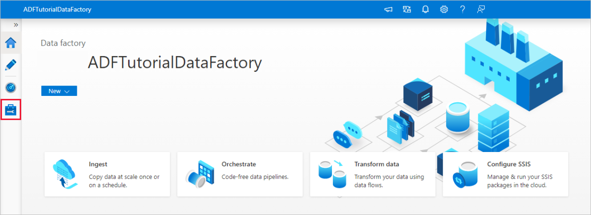

1. Select **Integration runtimes** on the left pane, and then select **+New**.

   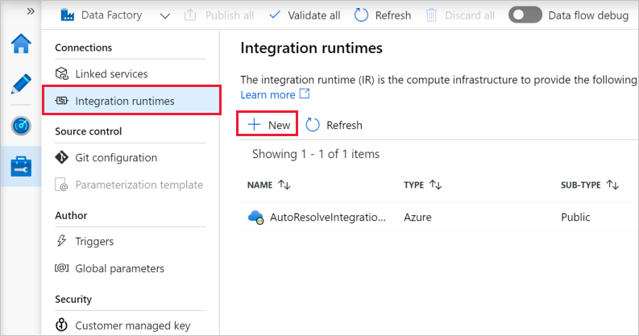

1. On the **Integration runtime setup** page, select **Azure, Self-Hosted**, and then select **Continue**. 

1. On the following page, select **Self-Hosted** to create a Self-Hosted IR, and then select **Continue**.
   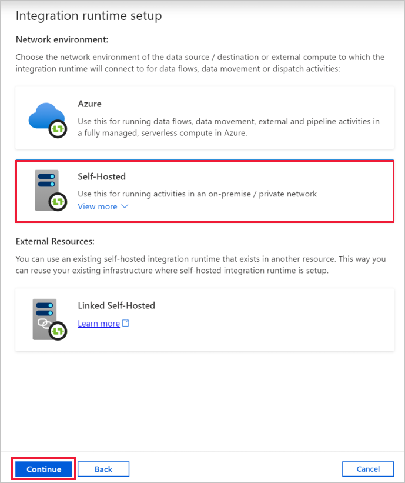

1. Enter a name for your IR, and select **Create**.

1. On the **Integration runtime setup** page, select the link under **Option 1** to open the express setup on your computer. Or follow the steps under **Option 2** to set up manually. The following instructions are based on manual setup:

   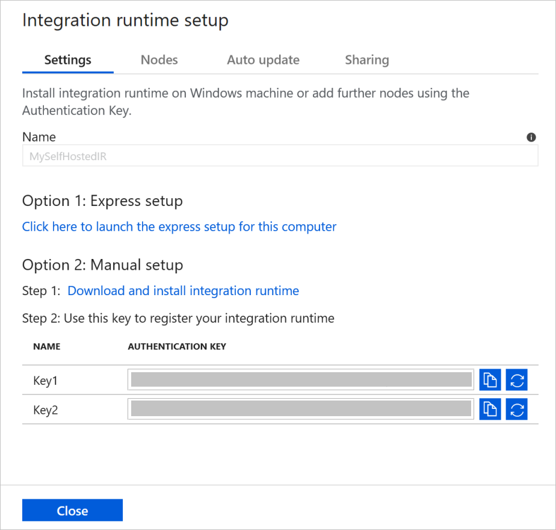

    1. Copy and paste the authentication key. Select **Download and install integration runtime**.

    1. Download the self-hosted integration runtime on a local Windows machine. Run the installer.

    1. On the **Register Integration Runtime (Self-hosted)** page, paste the key you saved earlier, and select **Register**.
    
       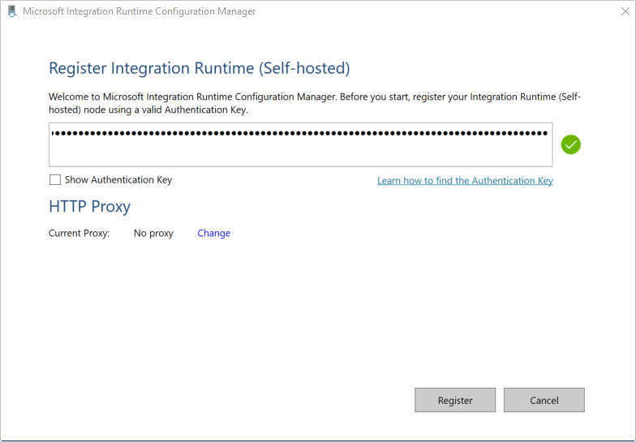

    1. On the **New Integration Runtime (Self-hosted) Node** page, select **Finish**.

1. After the self-hosted integration runtime is registered successfully, you see the following window:

    

### Set up a self-hosted IR on an Azure VM via an Azure Resource Manager template

You can automate self-hosted IR setup on an Azure virtual machine by using the [Create self host IR template](https://github.com/Azure/azure-quickstart-templates/tree/master/101-vms-with-selfhost-integration-runtime). The template provides an easy way to have a fully functional self-hosted IR inside an Azure virtual network. The IR has high-availability and scalability features, as long as you set the node count to 2 or higher.

### Set up an existing self-hosted IR via local PowerShell

You can use a command line to set up or manage an existing self-hosted IR. This usage can especially help to automate the installation and registration of self-hosted IR nodes.

Dmgcmd.exe is included in the self-hosted installer. It's typically located in the C:\Program Files\Microsoft Integration Runtime\4.0\Shared\ folder. This application supports various parameters and can be invoked via a command line using batch scripts for automation.

Use the application as follows:

```powershell
dmgcmd [ -RegisterNewNode "<AuthenticationKey>" -EnableRemoteAccess "<port>" ["<thumbprint>"] -EnableRemoteAccessInContainer "<port>" ["<thumbprint>"] -DisableRemoteAccess -Key "<AuthenticationKey>" -GenerateBackupFile "<filePath>" "<password>" -ImportBackupFile "<filePath>" "<password>" -Restart -Start -Stop -StartUpgradeService -StopUpgradeService -TurnOnAutoUpdate -TurnOffAutoUpdate -SwitchServiceAccount "<domain\user>" ["<password>"] -Loglevel <logLevel> ]
```

Here are details of the application's parameters and properties: 

| Property                                                    | Description                                                  | Required |
| ----------------------------------------------------------- | ------------------------------------------------------------ | -------- |
| **RegisterNewNode** "`<AuthenticationKey>`"                     | Register a self-hosted integration runtime node with the specified authentication key. | No       |
| **RegisterNewNode** "`<AuthenticationKey>`" "`<NodeName>`"      | Register a self-hosted integration runtime node with the specified authentication key and node name. | No       |
| **EnableRemoteAccess** "`<port>`" ["`<thumbprint>`"]            | Enable remote access on the current node to set up a high-availability cluster. Or enable setting credentials directly against the self-hosted IR without going through Azure Data Factory. You do the latter by using the **New-AzDataFactoryV2LinkedServiceEncryptedCredential** cmdlet from a remote machine in the same network. | No       |
| **EnableRemoteAccessInContainer** "`<port>`" ["`<thumbprint>`"] | Enable remote access to the current node when the node runs in a container. | No       |
| **DisableRemoteAccess**                                         | Disable remote access to the current node. Remote access is needed for multinode setup. The **New-AzDataFactoryV2LinkedServiceEncryptedCredential** PowerShell cmdlet still works even when remote access is disabled. This behavior is true as long as the cmdlet is executed on the same machine as the self-hosted IR node. | No       |
| **Key** "`<AuthenticationKey>`"                                 | Overwrite or update the previous authentication key. Be careful with this action. Your previous self-hosted IR node can go offline if the key is of a new integration runtime. | No       |
| **GenerateBackupFile** "`<filePath>`" "`<password>`"            | Generate a backup file for the current node. The backup file includes the node key and data-store credentials. | No       |
| **ImportBackupFile** "`<filePath>`" "`<password>`"              | Restore the node from a backup file.                          | No       |
| **Restart**                                                     | Restart the self-hosted integration runtime host service.   | No       |
| **Start**                                                       | Start the self-hosted integration runtime host service.     | No       |
| **Stop**                                                        | Stop the self-hosted integration runtime host service.        | No       |
| **StartUpgradeService**                                         | Start the self-hosted integration runtime upgrade service.       | No       |
| **StopUpgradeService**                                          | Stop the self-hosted integration runtime upgrade service.        | No       |
| **TurnOnAutoUpdate**                                            | Turn on the self-hosted integration runtime auto-update.        | No       |
| **TurnOffAutoUpdate**                                           | Turn off the self-hosted integration runtime auto-update.       | No       |
| **SwitchServiceAccount** "`<domain\user>`" ["`<password>`"]           | Set DIAHostService to run as a new account. Use the empty password "" for system accounts and virtual accounts. | No       |


## Command flow and data flow

When you move data between on-premises and the cloud, the activity uses a self-hosted integration runtime to transfer the data between an on-premises data source and the cloud.

Here is a high-level summary of the data-flow steps for copying with a self-hosted IR:

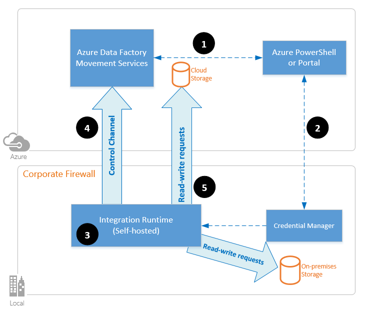

1. A data developer creates a self-hosted integration runtime within an Azure data factory by using a PowerShell cmdlet. Currently, the Azure portal doesn't support this feature.
1. The data developer creates a linked service for an on-premises data store. The developer does so by specifying the self-hosted integration runtime instance that the service should use to connect to data stores.
1. The self-hosted integration runtime node encrypts the credentials by using Windows Data Protection Application Programming Interface (DPAPI) and saves the credentials locally. If multiple nodes are set for high availability, the credentials are further synchronized across other nodes. Each node encrypts the credentials by using DPAPI and stores them locally. Credential synchronization is transparent to the data developer and is handled by the self-hosted IR.
1. Azure Data Factory communicates with the self-hosted integration runtime to schedule and manage jobs. Communication is via a control channel that uses a shared [Azure Service Bus Relay](https://docs.microsoft.com/azure/service-bus-relay/relay-what-is-it#wcf-relay) connection. When an activity job needs to be run, Data Factory queues the request along with any credential information. It does so in case credentials aren't already stored on the self-hosted integration runtime. The self-hosted integration runtime starts the job after it polls the queue.
1. The self-hosted integration runtime copies data between an on-premises store and cloud storage. The direction of the copy depends on how the copy activity is configured in the data pipeline. For this step, the self-hosted integration runtime directly communicates with cloud-based storage services like Azure Blob storage over a secure HTTPS channel.

## Considerations for using a self-hosted IR

- You can use a single self-hosted integration runtime for multiple on-premises data sources. You can also share it with another data factory within the same Azure Active Directory (Azure AD) tenant. For more information, see [Sharing a self-hosted integration runtime](#create-a-shared-self-hosted-integration-runtime-in-azure-data-factory).
- You can install only one instance of a self-hosted integration runtime on any single machine. If you have two data factories that need to access on-premises data sources, either use the [self-hosted IR sharing feature](#create-a-shared-self-hosted-integration-runtime-in-azure-data-factory) to share the self-hosted IR, or install the self-hosted IR on two on-premises computers, one for each data factory.  
- The self-hosted integration runtime doesn't need to be on the same machine as the data source. However, having the self-hosted integration runtime close to the data source reduces the time for the self-hosted integration runtime to connect to the data source. We recommend that you install the self-hosted integration runtime on a machine that differs from the one that hosts the on-premises data source. When the self-hosted integration runtime and data source are on different machines, the self-hosted integration runtime doesn't compete with the data source for resources.
- You can have multiple self-hosted integration runtimes on different machines that connect to the same on-premises data source. For example, if you have two self-hosted integration runtimes that serve two data factories, the same on-premises data source can be registered with both data factories.
- If you already have a gateway installed on your computer to serve a Power BI scenario, install a separate self-hosted integration runtime for Data Factory on another machine.
- Use a self-hosted integration runtime to support data integration within an Azure virtual network.
- Treat your data source as an on-premises data source that is behind a firewall, even when you use Azure ExpressRoute. Use the self-hosted integration runtime to connect the service to the data source.
- Use the self-hosted integration runtime even if the data store is in the cloud on an Azure Infrastructure as a Service (IaaS) virtual machine.
- Tasks might fail in a self-hosted integration runtime that you installed on a Windows server for which FIPS-compliant encryption is enabled. To work around this problem, disable FIPS-compliant encryption on the server. To disable FIPS-compliant encryption, change the following registry subkey's value from 1 (enabled) to 0 (disabled): `HKLM\System\CurrentControlSet\Control\Lsa\FIPSAlgorithmPolicy\Enabled`.

## Prerequisites

- The supported versions of Windows are:
  + Windows 7 Service Pack 1
  + Windows 8.1
  + Windows 10
  + Windows Server 2008 R2 SP1
  + Windows Server 2012
  + Windows Server 2012 R2
  + Windows Server 2016
  + Windows Server 2019
   
   Installation of the self-hosted integration runtime on a domain controller isn't supported.
- .NET Framework 4.6.1 or later is required. If you're installing the self-hosted integration runtime on a Windows 7 machine, install .NET Framework 4.6.1 or later. See [.NET Framework System Requirements](/dotnet/framework/get-started/system-requirements) for details.
- The recommended minimum configuration for the self-hosted integration runtime machine is a 2-GHz processor with 4 cores, 8 GB of RAM, and 80 GB of available hard drive space.
- If the host machine hibernates, the self-hosted integration runtime doesn't respond to data requests. Configure an appropriate power plan on the computer before you install the self-hosted integration runtime. If the machine is configured to hibernate, the self-hosted integration runtime installer prompts with a message.
- You must be an administrator on the machine to successfully install and configure the self-hosted integration runtime.
- Copy-activity runs happen with a specific frequency. Processor and RAM usage on the machine follows the same pattern with peak and idle times. Resource usage also depends heavily on the amount of data that is moved. When multiple copy jobs are in progress, you see resource usage go up during peak times.
- Tasks might fail during extraction of data in Parquet, ORC, or Avro formats. For more on Parquet, see [Parquet format in Azure Data Factory](https://docs.microsoft.com/azure/data-factory/format-parquet#using-self-hosted-integration-runtime). File creation runs on the self-hosted integration machine. To work as expected, file creation requires the following prerequisites:
    - [Visual C++ 2010 Redistributable](https://download.microsoft.com/download/3/2/2/3224B87F-CFA0-4E70-BDA3-3DE650EFEBA5/vcredist_x64.exe) Package (x64)
    - Java Runtime (JRE) version 8 from a JRE provider such as [Adopt OpenJDK](https://adoptopenjdk.net/). Ensure that the `JAVA_HOME` environment variable is set.

## Installation best practices

You can install the self-hosted integration runtime by downloading a Managed Identity setup package from [Microsoft Download Center](https://www.microsoft.com/download/details.aspx?id=39717). See the article [Move data between on-premises and cloud](tutorial-hybrid-copy-powershell.md) for step-by-step instructions.

- Configure a power plan on the host machine for the self-hosted integration runtime so that the machine doesn't hibernate. If the host machine hibernates, the self-hosted integration runtime goes offline.
- Regularly back up the credentials associated with the self-hosted integration runtime.
- To automate self-hosted IR setup operations, please refer to [Set up an existing self hosted IR via PowerShell](#setting-up-a-self-hosted-integration-runtime).  

## Install and register a self-hosted IR from Microsoft Download Center

1. Go to the [Microsoft integration runtime download page](https://www.microsoft.com/download/details.aspx?id=39717).
1. Select **Download**, select the 64-bit version, and select **Next**. The 32-bit version isn't supported.
1. Run the Managed Identity file directly, or save it to your hard drive and run it.
1. On the **Welcome** window, select a language and select **Next**.
1. Accept the Microsoft Software License Terms and select **Next**.
1. Select **folder** to install the self-hosted integration runtime, and select **Next**.
1. On the **Ready to install** page, select **Install**.
1. Select **Finish** to complete installation.
1. Get the authentication key by using PowerShell. Here's a PowerShell example for retrieving the authentication key:

    ```powershell
    Get-AzDataFactoryV2IntegrationRuntimeKey -ResourceGroupName $resourceGroupName -DataFactoryName $dataFactoryName -Name $selfHostedIntegrationRuntime
    ```

1. On the **Register Integration Runtime (Self-hosted)** window of Microsoft Integration Runtime Configuration Manager running on your machine, take the following steps:

    1. Paste the authentication key in the text area.

    1. Optionally, select **Show authentication key** to see the key text.

    1. Select **Register**.

## High availability and scalability

You can associate a self-hosted integration runtime with multiple on-premises machines or virtual machines in Azure. These machines are called nodes. You can have up to four nodes associated with a self-hosted integration runtime. The benefits of having multiple nodes on on-premises machines that have a gateway installed for a logical gateway are:

* Higher availability of the self-hosted integration runtime so that it's no longer the single point of failure in your big data solution or cloud data integration with Data Factory. This availability helps ensure continuity when you use up to four nodes.
* Improved performance and throughput during data movement between on-premises and cloud data stores. Get more information on [performance comparisons](copy-activity-performance.md).

You can associate multiple nodes by installing the self-hosted integration runtime software from [Download Center](https://www.microsoft.com/download/details.aspx?id=39717). Then, register it by using either of the authentication keys that were obtained from the **New-AzDataFactoryV2IntegrationRuntimeKey** cmdlet, as described in the [tutorial](tutorial-hybrid-copy-powershell.md).

> [!NOTE]
> You don't need to create a new self-hosted integration runtime to associate each node. You can install the self-hosted integration runtime on another machine and register it by using the same authentication key.

> [!NOTE]
> Before you add another node for high availability and scalability, ensure that the **Remote access to intranet** option is enabled on the first node. To do so, select **Microsoft Integration Runtime Configuration Manager** > **Settings** > **Remote access to intranet**.

### Scale considerations

#### Scale out

When processor usage is high and available memory is low on the self-hosted IR, add a new node to help scale out the load across machines. If activities fail because they time out or the self-hosted IR node is offline, it helps if you add a node to the gateway.

#### Scale up

When the processor and available RAM aren't well utilized, but the execution of concurrent jobs reaches a node's limits, scale up by increasing the number of concurrent jobs that a node can run. You might also want to scale up when activities time out because the self-hosted IR is overloaded. As shown in the following image, you can increase the maximum capacity for a node:  

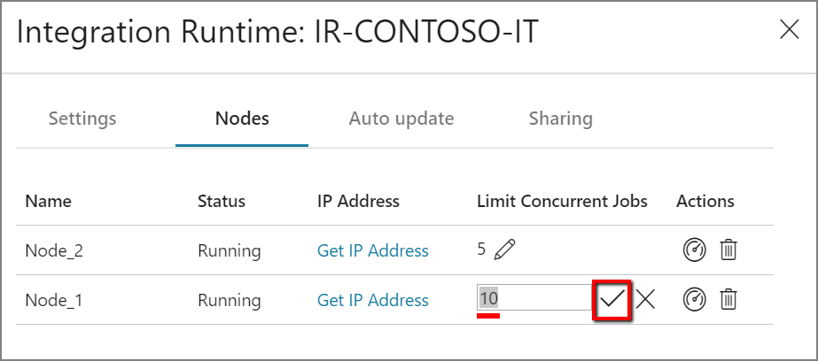

### TLS/SSL certificate requirements

Here are the requirements for the TLS/SSL certificate that you use to secure communication between integration runtime nodes:

- The certificate must be a publicly trusted X509 v3 certificate. We recommend that you use certificates that are issued by a public partner certification authority (CA).
- Each integration runtime node must trust this certificate.
- We don't recommend Subject Alternative Name (SAN) certificates because only the last SAN item is used. All other SAN items are ignored. For example, if you have a SAN certificate whose SANs are **node1.domain.contoso.com** and **node2.domain.contoso.com**, you can use this certificate only on a machine whose fully qualified domain name (FQDN) is **node2.domain.contoso.com**.
- The certificate can use any key size supported by Windows Server 2012 R2 for TLS/SSL certificates.
- Certificates that use CNG keys aren't supported.  

> [!NOTE]
> This certificate is used:
>
> - To encrypt ports on a self-hosted IR node.
> - For node-to-node communication for state synchronization, which includes credentials synchronization of linked services across nodes.
> - When a PowerShell cmdlet is used for linked-service credential settings from within a local network.
>
> We suggest you use this certificate if your private network environment is not secure or if you want to secure the communication between nodes within your private network.
>
> Data movement in transit from a self-hosted IR to other data stores always happens within an encrypted channel, regardless of whether or not this certificate is set.

## Create a shared self-hosted integration runtime in Azure Data Factory

You can reuse an existing self-hosted integration runtime infrastructure that you already set up in a data factory. This reuse lets you create a linked self-hosted integration runtime in a different data factory by referencing an existing shared self-hosted IR.

To see an introduction and demonstration of this feature, watch the following 12-minute video:

> [!VIDEO https://channel9.msdn.com/Shows/Azure-Friday/Hybrid-data-movement-across-multiple-Azure-Data-Factories/player]

### Terminology

- **Shared IR**: An original self-hosted IR that runs on a physical infrastructure.  
- **Linked IR**: An IR that references another shared IR. The linked IR is a logical IR and uses the infrastructure of another shared self-hosted IR.

### Methods to share a self-hosted integration runtime

To share a self-hosted integration runtime with multiple data factories, see [Create a shared self-hosted integration runtime](create-shared-self-hosted-integration-runtime-powershell.md) for details.

### Monitoring

#### Shared IR

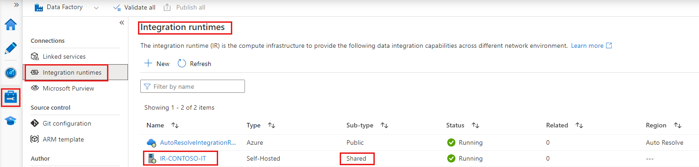

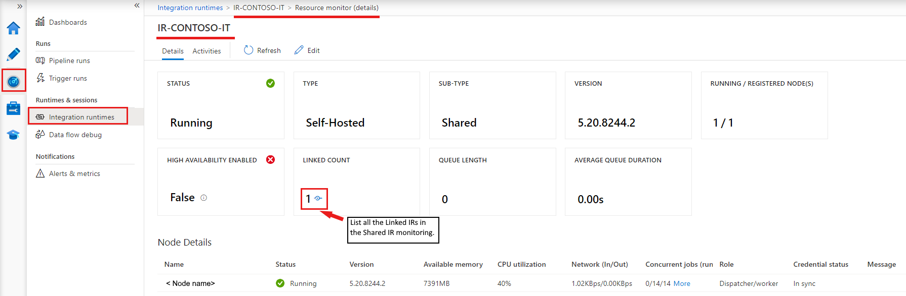

#### Linked IR

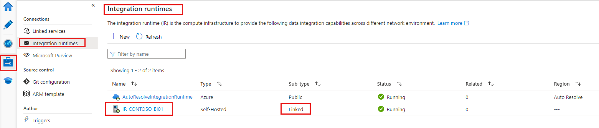

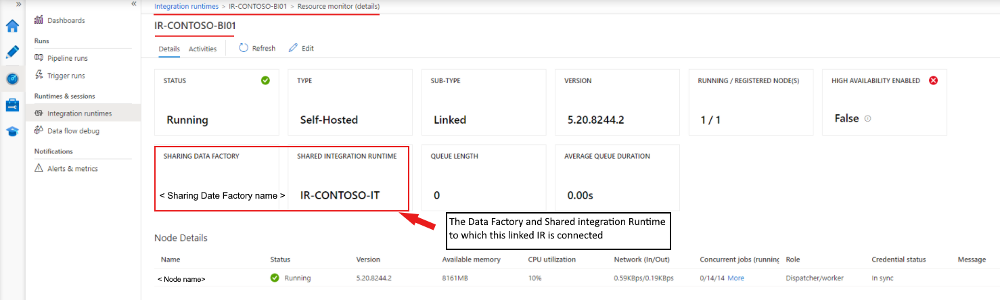

### Known limitations of self-hosted IR sharing

* The data factory in which a linked IR is created must have an [Managed Identity](https://docs.microsoft.com/azure/active-directory/managed-service-identity/overview). By default, the data factories created in the Azure portal or PowerShell cmdlets have an implicitly created Managed Identity. But when a data factory is created through an Azure Resource Manager template or SDK, you must set the **Identity** property explicitly. This setting ensures that Resource Manager creates a data factory that contains a Managed Identity.

* The Data Factory .NET SDK that supports this feature must be version 1.1.0 or later.

* To grant permission, you need the Owner role or the inherited Owner role in the data factory where the shared IR exists.

* The sharing feature works only for data factories within the same Azure AD tenant.

* For Azure AD [guest users](https://docs.microsoft.com/azure/active-directory/governance/manage-guest-access-with-access-reviews), the search functionality in the UI, which lists all data factories by using a search keyword, [doesn't work](https://msdn.microsoft.com/library/azure/ad/graph/howto/azure-ad-graph-api-permission-scopes#SearchLimits). But as long as the guest user is the owner of the data factory, you can share the IR without the search functionality. For the Managed Identity of the data factory that needs to share the IR, enter that Managed Identity in the **Assign Permission** box and select **Add** in the Data Factory UI.

  > [!NOTE]
  > This feature is available only in Data Factory V2.

## Notification area icons and notifications

If you move your cursor over the icon or message in the notification area, you can see details about the state of the self-hosted integration runtime.

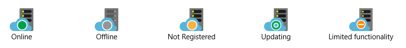

## Ports and firewalls

There are two firewalls to consider:

- The *corporate firewall* that runs on the central router of the organization
- The *Windows firewall* that is configured as a daemon on the local machine where the self-hosted integration runtime is installed

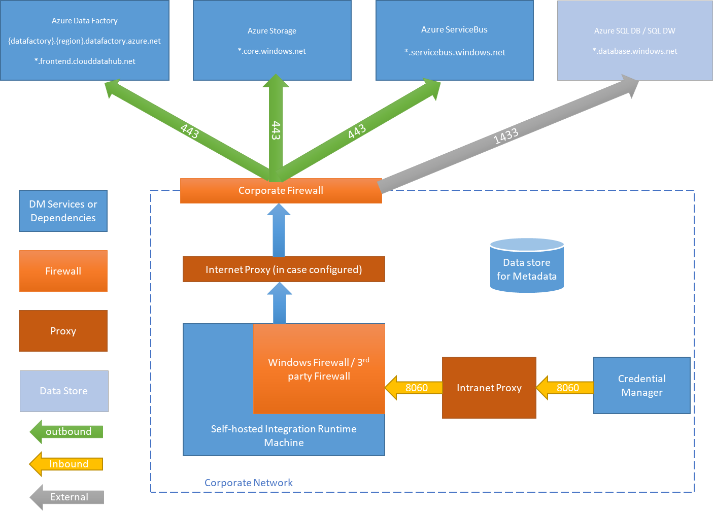

At the corporate firewall level, you need to configure the following domains and outbound ports:

[!INCLUDE [domain-and-outbound-port-requirements](../../includes/domain-and-outbound-port-requirements.md)]

At the Windows firewall level or machine level, these outbound ports are normally enabled. If they aren't, you can configure the domains and ports on a self-hosted integration runtime machine.

> [!NOTE]
> Based on your source and sinks, you might need to allow additional domains and outbound ports in your corporate firewall or Windows firewall.
>
> For some cloud databases, such as Azure SQL Database and Azure Data Lake, you might need to allow IP addresses of self-hosted integration runtime machines on their firewall configuration.

### Copy data from a source to a sink

Ensure that you properly enable firewall rules on the corporate firewall, the Windows firewall of the self-hosted integration runtime machine, and the data store itself. Enabling these rules lets the self-hosted integration runtime successfully connect to both source and sink. Enable rules for each data store that is involved in the copy operation.

For example, to copy from an on-premises data store to a SQL Database sink or an Azure SQL Data Warehouse sink, take the following steps:

1. Allow outbound TCP communication on port 1433 for both the Windows firewall and the corporate firewall.
1. Configure the firewall settings of the SQL Database to add the IP address of the self-hosted integration runtime machine to the list of allowed IP addresses.

> [!NOTE]
> If your firewall doesn't allow outbound port 1433, the self-hosted integration runtime can't access the SQL database directly. In this case, you can use a [staged copy](copy-activity-performance.md) to SQL Database and SQL Data Warehouse. In this scenario, you require only HTTPS (port 443) for the data movement.

## Proxy server considerations

If your corporate network environment uses a proxy server to access the internet, configure the self-hosted integration runtime to use appropriate proxy settings. You can set the proxy during the initial registration phase.


When configured, the self-hosted integration runtime uses the proxy server to connect to the cloud service's source and destination (which use the HTTP or HTTPS protocol). This is why you select **Change link** during initial setup.

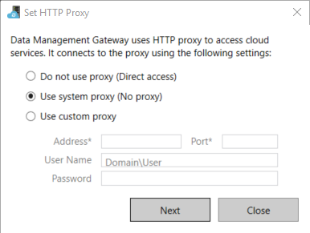

There are three configuration options:

- **Do not use proxy**: The self-hosted integration runtime doesn't explicitly use any proxy to connect to cloud services.
- **Use system proxy**: The self-hosted integration runtime uses the proxy setting that is configured in diahost.exe.config and diawp.exe.config. If these files specify no proxy configuration, the self-hosted integration runtime connects to the cloud service directly without going through a proxy.
- **Use custom proxy**: Configure the HTTP proxy setting to use for the self-hosted integration runtime, instead of using configurations in diahost.exe.config and diawp.exe.config. **Address** and **Port** values are required. **User Name** and **Password** values are optional, depending on your proxy's authentication setting. All settings are encrypted with Windows DPAPI on the self-hosted integration runtime and stored locally on the machine.

The integration runtime host service restarts automatically after you save the updated proxy settings.

After you register the self-hosted integration runtime, if you want to view or update proxy settings, use Microsoft Integration Runtime Configuration Manager.

1. Open **Microsoft Integration Runtime Configuration Manager**.
1. Select the **Settings** tab.
1. Under **HTTP Proxy**, select the **Change** link to open the **Set HTTP Proxy** dialog box.
1. Select **Next**. You then see a warning that asks for your permission to save the proxy setting and restart the integration runtime host service.

You can use the configuration manager tool to view and update the HTTP proxy.

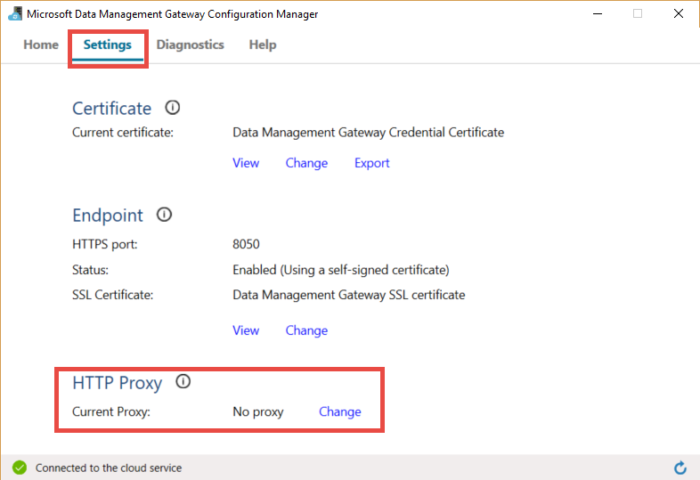

> [!NOTE]
> If you set up a proxy server with NTLM authentication, the integration runtime host service runs under the domain account. If you later change the password for the domain account, remember to update the configuration settings for the service and restart the service. Because of this requirement, we suggest that you access the proxy server by using a dedicated domain account that doesn't require you to update the password frequently.

### Configure proxy server settings

If you select the **Use system proxy** option for the HTTP proxy, the self-hosted integration runtime uses the proxy settings in diahost.exe.config and diawp.exe.config. When these files specify no proxy, the self-hosted integration runtime connects to the cloud service directly without going through a proxy. The following procedure provides instructions for updating the diahost.exe.config file:

1. In File Explorer, make a safe copy of C:\Program Files\Microsoft Integration Runtime\4.0\Shared\diahost.exe.config as a backup of the original file.
1. Open Notepad running as administrator.
1. In Notepad, open the text file C:\Program Files\Microsoft Integration Runtime\4.0\Shared\diahost.exe.config.
1. Find the default **system.net** tag as shown in the following code:

    ```xml
    <system.net>
        <defaultProxy useDefaultCredentials="true" />
    </system.net>
    ```
    You can then add proxy server details as shown in the following example:

    ```xml
    <system.net>
        <defaultProxy enabled="true">
              <proxy bypassonlocal="true" proxyaddress="http://proxy.domain.org:8888/" />
        </defaultProxy>
    </system.net>
    ```

    The proxy tag allows additional properties to specify required settings like `scriptLocation`. See [\<proxy\> Element (Network Settings)](https://msdn.microsoft.com/library/sa91de1e.aspx) for syntax.

    ```xml
    <proxy autoDetect="true|false|unspecified" bypassonlocal="true|false|unspecified" proxyaddress="uriString" scriptLocation="uriString" usesystemdefault="true|false|unspecified "/>
    ```
1. Save the configuration file in its original location. Then restart the self-hosted integration runtime host service, which picks up the changes.

   To restart the service, use the services applet from Control Panel. Or from Integration Runtime Configuration Manager, select the **Stop Service** button, and then select **Start Service**.

   If the service doesn't start, you likely added incorrect XML tag syntax in the application configuration file that you edited.

> [!IMPORTANT]
> Don't forget to update both diahost.exe.config and diawp.exe.config.

You also need to make sure that Microsoft Azure is in your company's allow list. You can download the list of valid Azure IP addresses from [Microsoft Download Center](https://www.microsoft.com/download/details.aspx?id=41653).

### Possible symptoms for issues related to the firewall and proxy server

If you see error messages like the following ones, the likely reason is improper configuration of the firewall or proxy server. Such configuration prevents the self-hosted integration runtime from connecting to Data Factory to authenticate itself. To ensure that your firewall and proxy server are properly configured, refer to the previous section.

* When you try to register the self-hosted integration runtime, you receive the following error message: "Failed to register this Integration Runtime node! Confirm that the Authentication key is valid and the integration service host service is running on this machine."
* When you open Integration Runtime Configuration Manager, you see a status of **Disconnected** or **Connecting**. When you view Windows event logs, under **Event Viewer** > **Application and Services Logs** > **Microsoft Integration Runtime**, you see error messages like this one:

    ```
    Unable to connect to the remote server
    A component of Integration Runtime has become unresponsive and restarts automatically. Component name: Integration Runtime (Self-hosted).
    ```

### Enable remote access from an intranet

If you use PowerShell to encrypt credentials from a networked machine other than where you installed the self-hosted integration runtime, you can enable the **Remote Access from Intranet** option. If you run PowerShell to encrypt credentials on the machine where you installed the self-hosted integration runtime, you can't enable **Remote Access from Intranet**.

Enable **Remote Access from Intranet** before you add another node for high availability and scalability.  

When you run the self-hosted integration runtime setup version 3.3 or later, by default the self-hosted integration runtime installer disables **Remote Access from Intranet** on the self-hosted integration runtime machine.

When you use a firewall from a partner or others, you can manually open port 8060 or the user-configured port. If you have a firewall problem while setting up the self-hosted integration runtime, use the following command to install the self-hosted integration runtime without configuring the firewall:

```
msiexec /q /i IntegrationRuntime.msi NOFIREWALL=1
```

If you choose not to open port 8060 on the self-hosted integration runtime machine, use mechanisms other than the Setting Credentials application to configure data-store credentials. For example, you can use the **New-AzDataFactoryV2LinkedServiceEncryptCredential** PowerShell cmdlet.

## Next steps

For step-by-step instructions, see [Tutorial: Copy on-premises data to cloud](tutorial-hybrid-copy-powershell.md).
