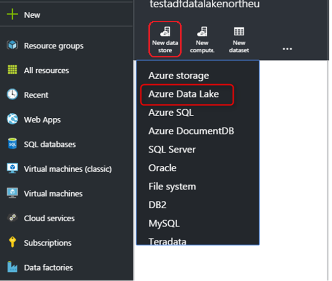

<properties
	pageTitle="Move data to and from Azure Data Lake Store | Azure Data Factory"
	description="Learn how to move data to/from Azure Data Lake Store using Azure Data Factory"
	services="data-factory"
	documentationCenter=""
	authors="spelluru"
	manager="jhubbard"
	editor="monicar"/>

<tags
	ms.service="data-factory"
	ms.workload="data-services"
	ms.tgt_pltfrm="na"
	ms.devlang="na"
	ms.topic="article"
	ms.date="10/13/2015"
	ms.author="spelluru"/>

# Move data to and from Azure Data Lake Store using Azure Data Factory
This article outlines how you can use the Copy Activity in an Azure data factory to move data to Azure Data Lake Store from another data store and move data from another data store to Azure Data Lake Store. This article builds on the [data movement activities](data-factory-data-movement-activities.md) article which presents a general overview of data movement with the copy activity and the supported data store combinations.

> [AZURE.NOTE] Please review the [Build your first pipeline tutorial](data-factory-build-your-first-pipeline.md) for detailed steps to create a data factory, linked services, datasets, and a pipeline. Use the JSON snippets with Data Factory Editor or Visual Studio or Azure PowerShell to create the Data Factory entities.

## Sample: Copy data from Azure Blob to Azure Data Lake Store
The sample below shows:

1.	A linked service of type [AzureStorage](#azure-storage-linked-service-properties).
2.	A linked service of type [AzureDataLakeStore](#azure-data-lake-linked-service-properties).
3.	An input [dataset](data-factory-create-datasets.md) of type [AzureBlob](#azure-blob-dataset-type-properties).
4.	An output [dataset](data-factory-create-datasets.md) of type [AzureDataLakeStore](#azure-data-lake-dataset-type-properties).
4.	A [pipeline](data-factory-create-pipelines.md) with a Copy activity that uses [BlobSource](#azure-blob-copy-activity-type-properties) and [AzureDataLakeStoreSink](#azure-data-lake-copy-activity-type-properties).

The sample copies data belonging to a time series from an Azure Blob Storage to Azure Data Lake  Store every hour. The JSON properties used in these samples are described in sections following the samples.

**Azure Storage linked service:**

	{
	  "name": "StorageLinkedService",
	  "properties": {
	    "type": "AzureStorage",
	    "typeProperties": {
	      "connectionString": "DefaultEndpointsProtocol=https;AccountName=<accountname>;AccountKey=<accountkey>"
	    }
	  }
	}

**Azure Data Lake linked service:**

	{
	    "name": "AzureDataLakeStoreLinkedService",
	    "properties": {
	        "type": "AzureDataLakeStore",
	        "typeProperties": {
	            "dataLakeUri": "https://<accountname>.azuredatalake.net/webhdfs/v1",
				"sessionId": "<session ID>",
	            "authorization": "<authorization URL>"
	        }
	    }
	}

### To create Azure Data Lake Linked Service using Data Factory Editor
The following procedure provides steps for creating an Azure Data Lake Store linked service using the Data Factory Editor.

1. Click **New data store** on the command bar and select **Azure Data Lake Store**.

	
2. In the JSON editor, for the **datalakeUri** property, enter the URI for the data lake.
3. Click **Authorize** button on the command bar. You should see a pop up window.

	
4. Use your credentials to sign-in and the **authorization** property in the JSON should be assigned to a value now.
5. (optional) Specify values for optional parameters such as **accountName**, **subscriptionID** and **resourceGroupName** in the JSON (or) delete these properties from the JSON.
6. Click **Deploy** on the command bar to deploy the linked service.

**Azure Blob input dataset:**

Data is picked up from a new blob every hour (frequency: hour, interval: 1). The folder path and file name for the blob are dynamically evaluated based on the start time of the slice that is being processed. The folder path uses year, month, and day part of the start time and file name uses the hour part of the start time. “external”: “true” setting informs the Data Factory service that this table is external to the data factory and not produced by an activity in the data factory.

	{
	  "name": "AzureBlobInput",
	  "properties": {
	    "type": "AzureBlob",
	    "linkedServiceName": "StorageLinkedService",
	    "typeProperties": {
	      "Path": "mycontainer/myfolder/yearno={Year}/monthno={Month}/dayno={Day}",
	      "partitionedBy": [
	        {
	          "name": "Year",
	          "value": {
	            "type": "DateTime",
	            "date": "SliceStart",
	            "format": "yyyy"
	          }
	        },
	        {
	          "name": "Month",
	          "value": {
	            "type": "DateTime",
	            "date": "SliceStart",
	            "format": "MM"
	          }
	        },
	        {
	          "name": "Day",
	          "value": {
	            "type": "DateTime",
	            "date": "SliceStart",
	            "format": "dd"
	          }
	        },
	        {
	          "name": "Hour",
	          "value": {
	            "type": "DateTime",
	            "date": "SliceStart",
	            "format": "HH"
	          }
	        }
	      ]
	    },
	    "external": true,
	    "availability": {
	      "frequency": "Hour",
	      "interval": 1
	    },
	    "policy": {
	      "externalData": {
	        "retryInterval": "00:01:00",
	        "retryTimeout": "00:10:00",
	        "maximumRetry": 3
	      }
	    }
	  }
	}

**Azure Data Lake output dataset:**

The sample copies data to an Azure Data Lake store. New data is copies to Data Lake store every hour.

	{
		"name": "AzureDataLakeStoreOutput",
	  	"properties": {
			"type": "AzureDataLakeStore",
		    "linkedServiceName": " AzureDataLakeStoreLinkedService",
		    "typeProperties": {
				"folderPath": "datalake/output/"
		    },
	    	"availability": {
	      		"frequency": "Hour",
	      		"interval": 1
	    	}
	  	}
	}

**Pipeline with a Copy activity:**

The pipeline contains a Copy Activity that is configured to use the above input and output datasets and is scheduled to run every hour. In the pipeline JSON definition, the **source** type is set to **BlobSource** and **sink** type is set to **AzureDataLakeStoreSink**.

	{  
	    "name":"SamplePipeline",
	    "properties":
		{  
	    	"start":"2014-06-01T18:00:00",
	    	"end":"2014-06-01T19:00:00",
	    	"description":"pipeline with copy activity",
	    	"activities":
			[  
	      		{
	        		"name": "AzureBlobtoDataLake",
		        	"description": "Copy Activity",
		        	"type": "Copy",
		        	"inputs": [
		          	{
			            "name": "AzureBlobInput"
		          	}
		        	],
		        	"outputs": [
		          	{
			            "name": "AzureDataLakeStoreOutput"
		          	}
		        	],
		        	"typeProperties": {
			        	"source": {
		            		"type": "BlobSource",
			    			"treatEmptyAsNull": true,
		            		"blobColumnSeparators": ","
		          		},
		          		"sink": {
		            		"type": "AzureDataLakeStoreSink"
		          		}
		        	},
		       		"scheduler": {
		          		"frequency": "Hour",
		          		"interval": 1
		        	},
		        	"policy": {
		          		"concurrency": 1,
		          		"executionPriorityOrder": "OldestFirst",
		          		"retry": 0,
		          		"timeout": "01:00:00"
		        	}
		      	}
    		]
		}
	}

## Sample: Copy data from Azure Data Lake Store to Azure Blob
The sample below shows:

1.	A linked service of type [AzureDataLakeStore](#azure-data-lake-linked-service-properties).
2.	A linked service of type [AzureStorage](#azure-storage-linked-service-properties).
3.	An input [dataset](data-factory-create-datasets.md) of type [AzureDataLakeStore](#azure-data-lake-dataset-type-properties).
4.	An output [dataset](data-factory-create-datasets.md) of type [AzureBlob](#azure-blob-dataset-type-properties).
5.	A [pipeline](data-factory-create-pipelines.md) with a Copy activity that uses [AzureDataLakeStoreSource](#azure-data-lake-copy-activity-type-properties) and [BlobSink](#azure-blob-copy-activity-type-properties)

The sample copies data belonging to a time series from an Azure Data Lake store to an Azure blob every hour. The JSON properties used in these samples are described in sections following the samples.

**Azure Data Lake Store linked service:**

	{
	    "name": "AzureDataLakeStoreLinkedService",
	    "properties": {
	        "type": "AzureDataLakeStore",
	        "typeProperties": {
	            "dataLakeUri": "https://<accountname>.azuredatalake.net/webhdfs/v1",
				"sessionId": "<session ID>",
	            "authorization": "<authorization URL>"
	        }
	    }
	}

> [AZURE.NOTE] See the steps in the previous sample to obtain authorization URL.  

**Azure Storage linked service:**

	{
	  "name": "StorageLinkedService",
	  "properties": {
	    "type": "AzureStorage",
	    "typeProperties": {
	      "connectionString": "DefaultEndpointsProtocol=https;AccountName=<accountname>;AccountKey=<accountkey>"
	    }
	  }
	}

**Azure Data Lake input dataset:**

Setting **"external": true** and specifying **externalData** policy informs the Azure Data Factory service that this is a table that is external to the data factory and not produced by an activity in the data factory.

	{
		"name": "AzureDataLakeStoreInput",
	  	"properties":
		{
	    	"type": "AzureDataLakeStore",
	    	"linkedServiceName": "AzureDataLakeStoreLinkedService",
		    "typeProperties": {
				"folderPath": "datalake/input/",
            	"fileName": "SearchLog.tsv",
            	"format": {
                	"type": "TextFormat",
	                "rowDelimiter": "\n",
    	            "columnDelimiter": "\t"
    	        }
		    },
		    "external": true,
		    "availability": {
		    	"frequency": "Hour",
		      	"interval": 1
	    	},
	    	"policy": {
	      		"externalData": {
	        		"retryInterval": "00:01:00",
	        		"retryTimeout": "00:10:00",
	        		"maximumRetry": 3
	      		}
	    	}
	  	}
	}

**Azure Blob output dataset:**

Data is written to a new blob every hour (frequency: hour, interval: 1). The folder path for the blob is dynamically evaluated based on the start time of the slice that is being processed. The folder path uses year, month, day, and hours parts of the start time.

	{
	  "name": "AzureBlobOutput",
	  "properties": {
	    "type": "AzureBlob",
	    "linkedServiceName": "StorageLinkedService",
	    "typeProperties": {
	      "folderPath": "mycontainer/myfolder/yearno={Year}/monthno={Month}/dayno={Day}/hourno={Hour}",
	      "partitionedBy": [
	        {
	          "name": "Year",
	          "value": {
	            "type": "DateTime",
	            "date": "SliceStart",
	            "format": "yyyy"
	          }
	        },
	        {
	          "name": "Month",
	          "value": {
	            "type": "DateTime",
	            "date": "SliceStart",
	            "format": "MM"
	          }
	        },
	        {
	          "name": "Day",
	          "value": {
	            "type": "DateTime",
	            "date": "SliceStart",
	            "format": "dd"
	          }
	        },
	        {
	          "name": "Hour",
	          "value": {
	            "type": "DateTime",
	            "date": "SliceStart",
	            "format": "HH"
	          }
	        }
	      ],
	      "format": {
	        "type": "TextFormat",
	        "columnDelimiter": "\t",
	        "rowDelimiter": "\n"
	      }
	    },
	    "availability": {
	      "frequency": "Hour",
	      "interval": 1
	    }
	  }
	}

**Pipeline with the Copy activity:**

The pipeline contains a Copy Activity that is configured to use the above input and output datasets and is scheduled to run every hour. In the pipeline JSON definition, the **source** type is set to **AzureDataLakeStoreSource** and **sink** type is set to **BlobSink**.

	{  
	    "name":"SamplePipeline",
	    "properties":{  
	    	"start":"2014-06-01T18:00:00",
	    	"end":"2014-06-01T19:00:00",
	    	"description":"pipeline for copy activity",
	    	"activities":[  
	      		{
	        		"name": "AzureDakeLaketoBlob",
		    	    "description": "copy activity",
		    	    "type": "Copy",
		    	    "inputs": [
		    	      {
		    	        "name": "AzureDataLakeStoreInput"
		    	      }
		    	    ],
		    	    "outputs": [
		    	      {
		    	        "name": "AzureBlobOutput"
		    	      }
		    	    ],
		    	    "typeProperties": {
		    	    	"source": {
		            		"type": "AzureDataLakeStoreSource",
		          		},
		          		"sink": {
		            		"type": "BlobSink"
		          		}
		        	},
		       		"scheduler": {
		          		"frequency": "Hour",
		          		"interval": 1
		        	},
		        	"policy": {
		          		"concurrency": 1,
		          		"executionPriorityOrder": "OldestFirst",
		          		"retry": 0,
		          		"timeout": "01:00:00"
		        	}
		      	}
		     ]
		}
	}

## Azure Data Lake Store Linked Service properties

You can link an Azure storage account to an Azure data factory using an Azure Storage linked service. The following table provides description for JSON elements specific to Azure Storage linked service.

| Property | Description | Required |
| -------- | ----------- | -------- |
| type | The type property must be set to: **AzureDataLakeStore** | Yes |
| dataLakeUri | Specify information about the Azure Data Lake Store account. It is in the following format: https://<Azure Data Lake account name>.azuredatalake.net/webhdfs/v1 | Yes |
| authorization | Click **Authorize** button in the **Data Factory Editor** and enter your credentials, which assigns the auto-generated authorization URL to this property.  | Yes |
| sessionId | OAuth session id from the oauth authorization session. Each session id is unique and may only be used once. This is automatically generated when you use Data Factory Editor. | Yes |  
| accountName | Data lake account name | No |
| subscriptionId | Azure subscription Id. | No (If not specified, subscription of the data factory is used). |
| resourceGroupName |  Azure resource group name | No (If not specified, resource group of the data factory is used). |

## Azure Data Lake Dataset type properties

For a full list of JSON sections & properties available for defining datasets, see the [Creating datasets](data-factory-create-datasets.md) article. Sections like structure, availability, and policy of a dataset JSON are similar for all dataset types (Azure SQL, Azure blob, Azure table, etc...).

The **typeProperties** section is different for each type of dataset and provides information about the location, format etc. of the data in the data store. The typeProperties section for dataset of type **AzureDataLakeStore** dataset has the following properties.

| Property | Description | Required |
| -------- | ----------- | -------- |
| folderPath | Path to the container and folder in the Azure Data Lake store. | Yes |
| fileName | 
Name of the file in the Azure Data Lake store. fileName is optional. 

If you specify a filename, the activity (including Copy) works on the specific file.

When fileName is not specified Copy will include all files in the folderPath for input dataset.

When fileName is not specified for an output dataset, the name of the generated file would be in the following this format: Data.<Guid>.txt (for example: : Data.0a405f8a-93ff-4c6f-b3be-f69616f1df7a.txt
 | No |
| partitionedBy | partitionedBy is an optional property. You can use it to specify a dynamic folderPath and filename for time series data. For example, folderPath can be parameterized for every hour of data. See the Leveraging partitionedBy property section below for details and examples. | No |

### Leveraging partitionedBy property
As mentioned above, you can specify a dynamic folderPath and filename for time series data with the **partitionedBy** section, Data Factory macros and the system variables: SliceStart and SliceEnd, which indicate start and end times for a given data slice.

See [Creating Datasets](data-factory-create-datasets.md) and [Scheduling & Execution](data-factory-scheduling-and-execution.md) articles to understand more details on time series datasets, scheduling and slices.

#### Sample 1

	"folderPath": "wikidatagateway/wikisampledataout/{Slice}",
	"partitionedBy":
	[
	    { "name": "Slice", "value": { "type": "DateTime", "date": "SliceStart", "format": "yyyyMMddHH" } },
	],

In the above example {Slice} is replaced with the value of Data Factory system variable SliceStart in the format (YYYYMMDDHH) specified. The SliceStart refers to start time of the slice. The folderPath is different for each slice. For example: wikidatagateway/wikisampledataout/2014100103 or wikidatagateway/wikisampledataout/2014100104

#### Sample 2

	"folderPath": "wikidatagateway/wikisampledataout/{Year}/{Month}/{Day}",
	"fileName": "{Hour}.csv",
	"partitionedBy":
	 [
	    { "name": "Year", "value": { "type": "DateTime", "date": "SliceStart", "format": "yyyy" } },
	    { "name": "Month", "value": { "type": "DateTime", "date": "SliceStart", "format": "MM" } },
	    { "name": "Day", "value": { "type": "DateTime", "date": "SliceStart", "format": "dd" } },
	    { "name": "Hour", "value": { "type": "DateTime", "date": "SliceStart", "format": "hh" } }
	],

In the above example, year, month, day, and time of SliceStart are extracted into separate variables that are used by folderPath and fileName properties.

## Azure Data Lake Copy Activity type properties  
For a full list of sections & properties available for defining activities, see the [Creating Pipelines](data-factory-create-pipelines.md) article. Properties like name, description, input and output tables, various policies etc are available for all types of activities.

Properties available in the typeProperties section of the activity on the other hand vary with each activity type and in case of Copy activity they vary depending on the types of sources and sinks

**AzureDataLakeStoreSource** supports the following properties **typeProperties** section:

| Property | Description | Allowed values | Required |
| -------- | ----------- | -------------- | -------- |
| recursive | Indicates whether the data is read recursively from the sub folders or only from the specified folder. | True (default value), False | No |

**AzureDataLakeStoreSink** supports the following properties **typeProperties** section:

| Property | Description | Allowed values | Required |
| -------- | ----------- | -------------- | -------- |
| copyBehavior | Specifies the copy behavior. | 
**PreserveHierarchy:** preserves the file hierarchy in the target folder, i.e., the relative path of source file to source folder is identical to the relative path of target file to target folder.

**FlattenHierarchy:** all files from the source folder will be in the first level of target folder. The target files will have auto generated name.

**MergeFiles:** merges all files from the source folder to one file. If the File/Blob Name is specified, the merged file name would be the specified name; otherwise, would be auto-generated file name.
 | No |

[AZURE.INCLUDE [data-factory-structure-for-rectangualr-datasets](../../includes/data-factory-structure-for-rectangualr-datasets.md)]

[AZURE.INCLUDE [data-factory-type-conversion-sample](../../includes/data-factory-type-conversion-sample.md)]

[AZURE.INCLUDE [data-factory-column-mapping](../../includes/data-factory-column-mapping.md)]
