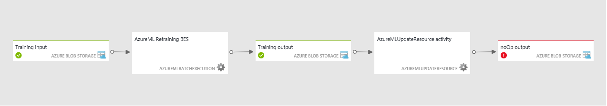

<properties 
	pageTitle="Use Machine Learning activities | Microsoft Azure" 
	description="Describes how to create create predictive pipelines using Azure Data Factory and Azure Machine Learning" 
	services="data-factory" 
	documentationCenter="" 
	authors="spelluru" 
	manager="jhubbard" 
	editor="monicar"/>

<tags 
	ms.service="data-factory" 
	ms.workload="data-services" 
	ms.tgt_pltfrm="na" 
	ms.devlang="na" 
	ms.topic="article" 
	ms.date="06/20/2016" 
	ms.author="spelluru"/>

# Create predictive pipelines using Azure Machine Learning activities   
## Overview

> [AZURE.NOTE] See [Introduction to Azure Data Factory](data-factory-introduction.md) and [Build your first pipeline](data-factory-build-your-first-pipeline.md) articles to quickly get started with the Azure Data Factory service.

## Introduction

[Azure Machine Learning](https://azure.microsoft.com/documentation/services/machine-learning/) enables you to build, test, and deploy predictive analytics solutions. From a high-level point of view, it is done in three steps: 

1. **Create a training experiment**. You do this by using the Azure ML Studio, which is a collaborative visual development environment that you use to train and test a predictive analytics model using training data that you supply.
2. **Convert it to a predictive experiment**. Once your model has been trained with existing data and you are ready to use it to score new data, you prepare and streamline your experiment for scoring.
3. **Deploy it as a web service**. You can publish your scoring experiment as an Azure web service. Users can send data to your model via this web service end point and receive result predictions fro the model.  

Azure Data Factory enables you to easily create pipelines that leverage a published [Azure Machine Learning][azure-machine-learning] web service for predictive analytics. Using the **Batch Execution Activity** in an Azure Data Factory pipeline, you can invoke an Azure ML web service to make predictions on the data in batch. See [Invoking an Azure ML web service using the Batch Execution Activity](#invoking-an-azure-ml-web-service-using-the-batch-execution-activity) section for details.

Over time, the predictive models in the Azure ML scoring experiments need to be retrained using new input datasets. You can retrain an Azure ML model from a Data Factory pipeline by doing the following steps: 

1. Publish the training experiment (not predictive experiment) as a web service. You do this in the Azure ML Studio as you did to expose predictive experiment as a web service in the previous scenario.
2. Use the Azure ML Batch Execution Activity to invoke the web service for the training experiment. Basically, you can use the Azure ML Batch Execution activity to invoke both training web service and scoring web service. 
  
After you are done with retraining, you want to update the scoring web service (predictive experiment exposed as a web service) with the newly trained model. You do this by following the steps below: 

1. Add a non-default end point to the scoring web service. The default endpoint of the web service cannot be updated, so you will need to create a new non-default endpoint using the Azure Portal. See the [Create Endpoints](../machine-learning/machine-learning-create-endpoint.md) article for both conceptual information and procedural steps.
2. Update existing Azure ML linked services for scoring to use the non-default endpoint. You should start using the new endpoint to use the web service that is updated.
3. Use the **Azure ML Update Resource Activity** to update the web service with the newly trained model.  

See [Updating Azure ML models using the Update Resource Activity](#updating-azure-ml-models-using-the-update-resource-activity) section for details. 

## Invoking an Azure ML web service using the Batch Execution Activity

You use Azure Data Factory to orchestrate  data movement and processing, and then perform batch execution using Azure Machine Learning. To achieve this, you will need to do the following:

1. Create an Azure Machine Learning linked service. You will require the following:
	1. **Request URI** for the Batch Execution API. You can find the Request URI by clicking on the **BATCH EXECUTION** link in the web services page (shown below).
	1. **API key** for the published Azure Machine Learning web service. You can find the API key by clicking on the web service that you have published. 
 2. Use the **AzureMLBatchExecution** activity.

	

	

### Scenario: Experiments using Web service inputs/outputs that refer to data in Azure Blob Storage
In this scenario, the Azure Machine Learning Web service makes predictions using data from a file in an Azure blob storage and stores the prediction results in the blob storage. The following JSON defines a Azure Data Factory pipeline with an AzureMLBatchExecution activity. The activity has the dataset **DecisionTreeInputBlob** as input and **DecisionTreeResultBlob** as the output. The **DecisionTreeInputBlob** is passed as an input to the Web service by using the **webServiceInput** JSON property and **DecisionTreeResultBlob** as an output to the Web service by using the **webServiceOutputs** JSON property.  

> [AZURE.NOTE] Datasets that are referenced by the **webServiceInput** and **webServiceOutputs** properties (in **typeProperties**) must also be included in the Activity **inputs** and **outputs**.

	{
	  "name": "PredictivePipeline",
	  "properties": {
	    "description": "use AzureML model",
	    "activities": [
	      {
	        "name": "MLActivity",
	        "type": "AzureMLBatchExecution",
	        "description": "prediction analysis on batch input",
	        "inputs": [
	          {
	            "name": "DecisionTreeInputBlob"
	          }
	        ],
	        "outputs": [
	          {
	            "name": "DecisionTreeResultBlob"
	          }
	        ],
	        "linkedServiceName": "MyAzureMLLinkedService",
            "typeProperties":
            {
                "webServiceInput": "DecisionTreeInputBlob",
                "webServiceOutputs": {
                    "output1": "DecisionTreeResultBlob"
                }                
            },
	        "policy": {
	          "concurrency": 3,
	          "executionPriorityOrder": "NewestFirst",
	          "retry": 1,
	          "timeout": "02:00:00"
	        }
	      }
	    ],
	    "start": "2015-02-13T00:00:00Z",
	    "end": "2015-02-14T00:00:00Z"
	  }
	}

> [AZURE.NOTE] Only inputs and outputs of the AzureMLBatchExecution activity can be passed as parameters to the Web service. For example, in the above JSON snippet, DecisionTreeInputBlob is an input to the AzureMLBatchExecution activity, which is passed as an input to the Web service via webServiceInput parameter.   

### Example

This example uses Azure Storage to hold both the input and output data. 

We recommend that you go through the [Build your first pipeline with Data Factory][adf-build-1st-pipeline] tutorial prior to going through this example and use the Data Factory Editor to create Data Factory artifacts (linked services, datasets, pipeline) in this example.   
 

1. Create a **linked service** for your **Azure Storage**. If the input and output files will be in different storage accounts, you will need two linked services. Here is a JSON example:

		{
		  "name": "StorageLinkedService",
		  "properties": {
		    "type": "AzureStorage",
		    "typeProperties": {
		      "connectionString": "DefaultEndpointsProtocol=https;AccountName=[acctName];AccountKey=[acctKey]"
		    }
		  }
		}

2. Create the **input** Azure Data Factory **dataset**. Note that unlike some other Data Factory datasets, these must both contain both **folderPath** and **fileName** values. You can use partitioning to cause each batch execution (each data slice) to process or produce unique input and output files. You will likely need to include some upstream activity to transform the input into the CSV file format and place it in the storage account for each slice. In that case, you would not include the **external** and **externalData** settings shown in the example below, and your DecisionTreeInputBlob would be the output dataset of a different Activity.

		{
		  "name": "DecisionTreeInputBlob",
		  "properties": {
		    "type": "AzureBlob",
		    "linkedServiceName": "StorageLinkedService",
		    "typeProperties": {
		      "folderPath": "azuremltesting/input",
		      "fileName": "in.csv",
		      "format": {
		        "type": "TextFormat",
		        "columnDelimiter": ","
		      }
		    },
		    "external": true,
		    "availability": {
		      "frequency": "Day",
		      "interval": 1
		    },
		    "policy": {
		      "externalData": {
		        "retryInterval": "00:01:00",
		        "retryTimeout": "00:10:00",
		        "maximumRetry": 3
		      }
		    }
		  }
		}
	
	Your input csv file must have the column header row. If you are using the **Copy Activity** to create/move the csv into the blob storage, you should set the sink property **blobWriterAddHeader** to **true**. For example:
	
	     sink: 
	     {
	         "type": "BlobSink",     
	         "blobWriterAddHeader": true 
	     }
	 
	If the csv file does not have the header row, you may see the following error: **Error in Activity: Error reading string. Unexpected token: StartObject. Path '', line 1, position 1**.
3. Create the **output** Azure Data Factory **dataset**. This example uses partitioning to create a unique output path for each slice execution. Without this, the activity would overwrite the file.

		{
		  "name": "DecisionTreeResultBlob",
		  "properties": {
		    "type": "AzureBlob",
		    "linkedServiceName": "StorageLinkedService",
		    "typeProperties": {
		      "folderPath": "azuremltesting/scored/{folderpart}/",
		      "fileName": "{filepart}result.csv",
		      "partitionedBy": [
		        {
		          "name": "folderpart",
		          "value": {
		            "type": "DateTime",
		            "date": "SliceStart",
		            "format": "yyyyMMdd"
		          }
		        },
		        {
		          "name": "filepart",
		          "value": {
		            "type": "DateTime",
		            "date": "SliceStart",
		            "format": "HHmmss"
		          }
		        }
		      ],
		      "format": {
		        "type": "TextFormat",
		        "columnDelimiter": ","
		      }
		    },
		    "availability": {
		      "frequency": "Day",
		      "interval": 15
		    }
		  }
		}

4. Create a **linked service** of type: **AzureMLLinkedService**, providing the API key and model batch execution URL.
		
		{
		  "name": "MyAzureMLLinkedService",
		  "properties": {
		    "type": "AzureML",
		    "typeProperties": {
		      "mlEndpoint": "https://[batch execution endpoint]/jobs",
		      "apiKey": "[apikey]"
		    }
		  }
		}
5. Finally, author a pipeline containing an **AzureMLBatchExecution** Activity. It will get the location of the input file from your input datasets, call the Azure Machine Learning batch execution API, and copy the batch execution output to the blob given in your output dataset. 

	> [AZURE.NOTE] AzureMLBatchExecution activity can have zero or more inputs and one or more outputs.

		{
		  "name": "PredictivePipeline",
		  "properties": {
		    "description": "use AzureML model",
		    "activities": [
		      {
		        "name": "MLActivity",
		        "type": "AzureMLBatchExecution",
		        "description": "prediction analysis on batch input",
		        "inputs": [
		          {
		            "name": "DecisionTreeInputBlob"
		          }
		        ],
		        "outputs": [
		          {
		            "name": "DecisionTreeResultBlob"
		          }
		        ],
		        "linkedServiceName": "MyAzureMLLinkedService",
                "typeProperties":
                {
                    "webServiceInput": "DecisionTreeInputBlob",
                    "webServiceOutputs": {
                        "output1": "DecisionTreeResultBlob"
                    }                
                },
		        "policy": {
		          "concurrency": 3,
		          "executionPriorityOrder": "NewestFirst",
		          "retry": 1,
		          "timeout": "02:00:00"
		        }
		      }
		    ],
		    "start": "2015-02-13T00:00:00Z",
		    "end": "2015-02-14T00:00:00Z"
		  }
		}

	Both **start** and **end** datetimes must be in [ISO format](http://en.wikipedia.org/wiki/ISO_8601). For example: 2014-10-14T16:32:41Z. The **end** time is optional. If you do not specify value for the **end** property, it is calculated as "**start + 48 hours**". To run the pipeline indefinitely, specify **9999-09-09** as the value for the **end** property. See [JSON Scripting Reference](https://msdn.microsoft.com/library/dn835050.aspx) for details about JSON properties.

	> [AZURE.NOTE] Specifying input for the AzureMLBatchExecution activity is optional. 

### Scenario: Experiments using Reader/Writer Modules to refer to data in various storages

Another common scenario when creating Azure ML experiments is to use Reader and Writer modules. The reader module is used to load data into an experiment and the writer module is to save data from your experiments. For details about reader and writer modules, see [Reader](https://msdn.microsoft.com/library/azure/dn905997.aspx) and [Writer](https://msdn.microsoft.com/library/azure/dn905984.aspx) topics on MSDN Library.     

When using the reader and writer modules, it is good practice to use a Web service parameter for each property of these reader/writer modules. These web parameters enable you to configure the values during runtime. For example, you could create an experiment with a reader module that uses an Azure SQL Database: XXX.database.windows.net. After the web service has been deployed, you want to enable the consumers of the web service to specify another Azure SQL Server called YYY.database.windows.net. You can use a Web service parameter to allow this value to be configured.

> [AZURE.NOTE] Web service input and output are different from Web service parameters. In the first scenario, you have seen how an input and output can be specified for an Azure ML Web service. In this scenario, you will pass parameters for a Web service that correspond to properties of reader/writer modules. 

Let's look at a scenario for using Web service parameters. You have a deployed Azure Machine Learning web service that is using a reader module to read data from one of the Azure Machine Learning supported data sources (for example: Azure SQL Database). After the batch execution is performed, the results are written using a Writer module (Azure SQL Database).  No web service inputs and outputs are defined in the experiments. In this case, we recommend that you setup the relevant Web service parameters for the reader and writer modules. This will allow the reader/writer modules to be configured when using the AzureMLBatchExecution activity. You specify Web service parameters in the **globalParameters** section in the activity JSON as follows. 

	"typeProperties": {
		"globalParameters": {
			"Param 1": "Value 1",
			"Param 2": "Value 2"
		}
	}

You can also use [Data Factory Functions](https://msdn.microsoft.com/library/dn835056.aspx) in passing values for the Web service parameters as shown in the following example:

	"typeProperties": {
    	"globalParameters": {
    	   "Database query": "$$Text.Format('SELECT * FROM myTable WHERE timeColumn = \\'{0:yyyy-MM-dd HH:mm:ss}\\'', Time.AddHours(WindowStart, 0))"
    	}
  	}
 
> [AZURE.NOTE] The Web service parameters are case-sensitive, so ensure that the names you specify in the activity JSON match the ones exposed by the Web service. 

### Using a Reader module to read data from multiple files in Azure Blob
Big data pipelines (Pig, Hive, etc...) can produce one or more output files with no extensions. For example, when you specify an external Hive table, the data for the external Hive table can be stored in Azure blob storage with the following name 000000_0. You can use the reader module in an experiment to read multiple files, and use them for predictions. 

When using the reader module in an Azure Machine Learning experiment, you can specify Azure Blob as an input. The files in the Azure blob storage can be the output files (e.g. 000000_0) that are produced by a Pig and Hive script running on HDInsight. The reader module allows you to read files (with no extensions) by configuring the **Path to container, directory or blob** property of the reader module to point to the container/folder that contains the files as shown below. Note, the asterisk (i.e. \*) **specifies that all the files in the container/folder (i.e. data/aggregateddata/year=2014/month-6/\*)** will be read as part of the experiment.

### Example 
#### Pipeline with AzureMLBatchExecution activity with Web Service Parameters

	{
	  "name": "MLWithSqlReaderSqlWriter",
	  "properties": {
	    "description": "Azure ML model with sql azure reader/writer",
	    "activities": [
	      {
	        "name": "MLSqlReaderSqlWriterActivity",
	        "type": "AzureMLBatchExecution",
	        "description": "test",
	        "inputs": [
	          {
	            "name": "MLSqlInput"
	          }
	        ],
	        "outputs": [
	          {
	            "name": "MLSqlOutput"
	          }
	        ],
	        "linkedServiceName": "MLSqlReaderSqlWriterDecisionTreeModel",
            "typeProperties":
            {
                "webServiceInput": "MLSqlInput",
                "webServiceOutputs": {
                    "output1": "MLSqlOutput"
                }
	          	"globalParameters": {
	            	"Database server name": "<myserver>.database.windows.net",
		            "Database name": "<database>",
		            "Server user account name": "<user name>",
		            "Server user account password": "<password>"
	          	}              
            },
	        "policy": {
	          "concurrency": 1,
	          "executionPriorityOrder": "NewestFirst",
	          "retry": 1,
	          "timeout": "02:00:00"
	        },
	      }
	    ],
	    "start": "2015-02-13T00:00:00Z",
	    "end": "2015-02-14T00:00:00Z"
	  }
	}
 
In the above JSON example:

- The deployed Azure Machine Learning Web service uses a reader and a writer module to read/write data from/to an Azure SQL Database. This Web service exposes the following four parameters:  Database server name, Database name, Server user account name, and Server user account password.  
- Both **start** and **end** datetimes must be in [ISO format](http://en.wikipedia.org/wiki/ISO_8601). For example: 2014-10-14T16:32:41Z. The **end** time is optional. If you do not specify value for the **end** property, it is calculated as "**start + 48 hours**". To run the pipeline indefinitely, specify **9999-09-09** as the value for the **end** property. See [JSON Scripting Reference](https://msdn.microsoft.com/library/dn835050.aspx) for details about JSON properties.

### Other scenarios

#### Web Service does not require an input

Azure ML batch execution web services can be used to run any workflows, for example R or Python scripts, that may not require any inputs. Or, the experiment might be configured with a Reader module that does not expose any GlobalParameters. In that case, the AzureMLBatchExecution Activity would be configured as follows:

	{
        "name": "scoring service",
        "type": "AzureMLBatchExecution",
        "outputs": [
            {
                "name": "myBlob"
            }
        ],
        "typeProperties": {
            "webServiceOutputs": {
                "output1": "myBlob"
            }              
         },
        "linkedServiceName": "mlEndpoint",
        "policy": {
            "concurrency": 1,
            "executionPriorityOrder": "NewestFirst",
            "retry": 1,
            "timeout": "02:00:00"
        }
    },
   

#### Web Service does not require an input/output
The Azure ML batch execution web service might not have any Web Service output configured. In this example, there is no Web Service input or output, nor are any GlobalParameters configured. Note that there is still an output configured on the activity itself, but it is not given as a webServiceOutput.

	{
        "name": "retraining",
        "type": "AzureMLBatchExecution",
        "outputs": [
            {
                "name": "placeholderOutputDataset"
            }
        ],
        "typeProperties": {
         },
        "linkedServiceName": "mlEndpoint",
        "policy": {
            "concurrency": 1,
            "executionPriorityOrder": "NewestFirst",
            "retry": 1,
            "timeout": "02:00:00"
        }
    },

#### Web Service uses readers and writers, and the activity runs only when other activities have succeeded

The Azure ML web service reader and writer modules might be configured to run with or without any GlobalParameters. But you might want to embed the service calls in a processing pipeline that uses dataset dependencies to invoke the service only when some upstream processing has completed, and then to trigger some other action after the batch execution has completed. In that case, you can express the dependencies using activity inputs and outputs, without naming any of them as Web Service inputs or outputs.

	{
	    "name": "retraining",
	    "type": "AzureMLBatchExecution",
	    "inputs": [
	        {
	            "name": "upstreamData1"
	        },
	        {
	            "name": "upstreamData2"
	        }
	    ],
	    "outputs": [
	        {
	            "name": "downstreamData"
	        }
	    ],
	    "typeProperties": {
	     },
	    "linkedServiceName": "mlEndpoint",
	    "policy": {
	        "concurrency": 1,
	        "executionPriorityOrder": "NewestFirst",
	        "retry": 1,
	        "timeout": "02:00:00"
	    }
	},

The **take-aways** are:

-   If your experiment endpoint uses a webServiceInput, it is represented by a Blob dataset and is included in the activity inputs as well as the webServiceInput property. Otherwise, the webServiceInput property is omitted. 
-   If your experiment endpoint uses webServiceOutput(s), they are represented by Blob Datasets and are included in the activity outputs as well as in the webServicepOutputs property (mapped by the name of each output in the experiment). Otherwise, the webServiceOutputs property is omitted.
-   If your experiment endpoint exposes globalParameter(s), they are given in the activity globalParameters property as key,value pairs. Otherwise, the globalParameters property is omitted. The keys are case-sensitive. [Azure Data Factory functions](data-factory-scheduling-and-execution.md#data-factory-functions-reference) may be used in the values. 
- Additional datasets may be included in the Activity inputs and outputs properties, without being referenced in the Activity typeProperties. These will govern execution using slice dependencies but are otherwise ignored by the AzureMLBatchExecution Activity. 

## Updating Azure ML models using the Update Resource Activity
Over time, the predictive models in the Azure ML scoring experiments need to be retrained using new input datasets. After you are done with retraining, you want to update the scoring web service with the retrained ML model. The typical steps to enable retraining and updating Azure ML models via web services are: 

1. Create an experiment in [Azure ML Studio](https://studio.azureml.net). 
2. When you are satisfied with the model, use Azure ML Studio to publish web services for both the **training experiment** and scoring/**predictive experiment**.

The following table describes the web services used in this example.  See [Retrain Machine Learning models programmatically](../machine-learning/machine-learning-retrain-models-programmatically.md) for details.

| Type of web service | description 
| :------------------ | :---------- 
| **Training web service** | Receives training data and produces trained model(s). The output of the retraining is a .ilearner file in an Azure Blob storage.  The **default endpoint** is automatically created for you when you publish the training experiment as a web service. You can create more endpoints but the example uses only the default endpoint |
| **Scoring web service** | Receives unlabeled data examples and makes predictions. The output of prediction could have various forms, such as a .csv file or rows in an Azure SQL database, depending on the configuration of the experiment. The default endpoint is automatically created for you when you publish the predictive experiment as a web service. You will need to create the second **non-default and updatable endpoint** by using the [Azure Portal](https://manage.windowsazure.com). You can create more endpoints but this example uses only one non-default updatable endpoint. See the [Create Endpoints](../machine-learning/machine-learning-create-endpoint.md) article for steps.       
 
The following picture depicts the relationship between training and scoring endpoints in Azure ML. 

You can invoke the **training web service** by using the **Azure ML Batch Execution Activity**. This is same as invoking an Azure ML web service (scoring web service) for scoring data. The above sections cover how to invoke an Azure ML web service from an Azure Data Factory pipeline in detail. 
  
You can invoke the **scoring web service** by using the **Azure ML Update Resource Activity** to update the web service with the newly trained model. As mentioned in the table above, you must create and use the non-default updatable endpoint. You should also update any existing linked services in your data factory to use the non-default endpoint so that they always use the latest retrained model. 

The following scenario provides more details with an example for retraining and updating Azure ML models from an Azure Data Factory pipeline. 
 
### Scenario: retraining and updating an Azure ML model
This section provides a sample pipeline that uses the **Azure ML Batch Execution activity** to retrain a model and the **Azure ML Update Resource activity** to update the model in the scoring web service. It also provides JSON snippets for all the linked services, datasets, and pipeline in the example. 

Here is the diagram view of the sample pipeline. As you can see, the Azure ML Batch Execution Activity takes the training input and produces an training output (iLearner file). The Azure ML Update Resource Activity takes this training output and updates the model in the scoring web service endpoint. The Update Resource Activity does not produce any output. The placeholderBlob is just a dummy output dataset that is required by the Azure Data Factory service to run the pipeline. 

#### Azure Blob storage linked service:
The Azure Storage holds the following data:

- training data. This is the input data for the Azure ML training web service.  
- iLearner file. This is the output from the Azure ML training web service. It is is also the input to the Update Resource activity.  
   
Here is the sample JSON definition of the linked service: 

	{
		"name": "StorageLinkedService",
	  	"properties": {
	    	"type": "AzureStorage",
			"typeProperties": {
	    		"connectionString": "DefaultEndpointsProtocol=https;AccountName=name;AccountKey=key"
			}
		}
	}

#### Training input dataset:
The following dataset represents the input training data for the Azure ML training web service. The Azure ML Batch Execution activity takes this dataset as an input. 

	{
	    "name": "trainingData",
	    "properties": {
	        "type": "AzureBlob",
	        "linkedServiceName": "StorageLinkedService",
	        "typeProperties": {
	            "folderPath": "labeledexamples",
	            "fileName": "labeledexamples.arff",
	            "format": {
	                "type": "TextFormat"
	            }
	        },
	        "availability": {
	            "frequency": "Week",
	            "interval": 1
	        },
	        "policy": {          
	            "externalData": {
	                "retryInterval": "00:01:00",
	                "retryTimeout": "00:10:00",
	                "maximumRetry": 3
	            }
	        }
	    }
	}

#### Training output dataset:
The following dataset represents the output iLearner file from the Azure ML training web service. The Azure ML Batch Execution Activity produces this dataset. This dataset is also the input to the Azure ML Update Resource activity.

	{
	    "name": "trainedModelBlob",
	    "properties": {
	        "type": "AzureBlob",
	        "linkedServiceName": "StorageLinkedService",
	        "typeProperties": {
	            "folderPath": "trainingoutput",
	            "fileName": "model.ilearner",
	            "format": {
	                "type": "TextFormat"
	            }
	        },
	        "availability": {
	            "frequency": "Week",
	            "interval": 1
	        }
	    }
	}

#### Linked service for Azure ML training endpoint 
The following JSON snippet defines an Azure Machine Learning linked service that points to the  default endpoint of the training web service. 

	{	
		"name": "trainingEndpoint",
	  	"properties": {
	    	"type": "AzureML",
	    	"typeProperties": {
	    		"mlEndpoint": "https://ussouthcentral.services.azureml.net/workspaces/xxx/services/--training experiment--/jobs",
	      		"apiKey": "myKey"
	    	}
	  	}
	}

In **Azure ML Studio**, do the following to get values for **mlEndpoint** and **apiKey**:

1. Click **WEB SERVICES** on the left menu.
2. Click the **training web service** in the list of web services. 
3. Click copy next to **API key** text box to copy API key into the clipboard. Paste the key into the Data Factory JSON editor.
4. In the **Azure ML studio**, click **BATCH EXECUTION** link, copy the **Request URI** from the **Request** section and paste it into the Data Factory JSON editor.   

#### Linked Service for Azure ML updatable scoring endpoint:
The following JSON snippet defines an Azure Machine Learning linked service that points to the non-default updatable endpoint of the scoring web service.  

	{
	    "name": "updatableScoringEndpoint2",
	    "properties": {
	        "type": "AzureML",
	        "typeProperties": {
	            "mlEndpoint": "https://ussouthcentral.services.azureml.net/workspaces/xxx/services/--scoring experiment--/jobs",
	            "apiKey": "endpoint2Key",
	            "updateResourceEndpoint": "https://management.azureml.net/workspaces/xxx/webservices/--scoring experiment--/endpoints/endpoint2"
	        }
	    }
	}

Before creating and deploying an Azure ML linked service, follow the steps in [Create Endpoints](../machine-learning/machine-learning-create-endpoint.md) article to create a second (non-default and updatable) endpoint for the scoring web service.

After you create the non-default updatable endpoint, click **BATCH EXECUTION** to get the URI value for the **mlEndpoint** JSON property and click **UPDATE RESOURCE** link to get the URI value for the **updateResourceEndpoint** JSON property. The API key is on the endpoint page itself (in the bottom-right corner). 

 
#### Placeholder output dataset:
The Azure ML Update Resource activity does not generate any output, but in Azure Data Factory, an output dataset is required to drive the Pipeline schedule, so a dummy/placeholder dataset is used in this example.  

	{
	    "name": "placeholderBlob",
	    "properties": {
	        "availability": {
	            "frequency": "Week",
	            "interval": 1
	        },
	        "type": "AzureBlob",
	        "linkedServiceName": "StorageLinkedService",
	        "typeProperties": {
	            "folderPath": "any",
	            "format": {
	                "type": "TextFormat"
	            }
	        }
	    }
	}

#### Pipeline
The pipeline has two activities: **AzureMLBatchExecution** and **AzureMLUpdateResource**. The Azure ML Batch Execution activity takes the training data as input and produces .iLearner file as an output. The activity invokes the training web service (training experiment exposed as a web service) with the input training data and receives the ilearner file from the webservice. The placeholderBlob is just a dummy output dataset that is required by the Azure Data Factory service to run the pipeline. 

	{
	    "name": "pipeline",
	    "properties": {
	        "activities": [
	            {
	                "name": "retraining",
	                "type": "AzureMLBatchExecution",
	                "inputs": [
	                    {
	                        "name": "trainingData"
	                    }
	                ],
	                "outputs": [
	                    {
	                        "name": "trainedModelBlob"
	                    }
	                ],
	                "typeProperties": {
	                    "webServiceInput": "trainingData",
	                    "webServiceOutputs": {
	                        "output1": "trainedModelBlob"
	                    }              
	                 },
	                "linkedServiceName": "trainingEndpoint",
	                "policy": {
	                    "concurrency": 1,
	                    "executionPriorityOrder": "NewestFirst",
	                    "retry": 1,
	                    "timeout": "02:00:00"
	                }
	            },
	            {
	                "type": "AzureMLUpdateResource",
	                "typeProperties": {
	                    "trainedModelName": "Training Exp for ADF ML [trained model]",
	                    "trainedModelDatasetName" :  "trainedModelBlob"
	                },
	                "inputs": [
	                    {
	                        "name": "trainedModelBlob"
	                    }
	                ],
	                "outputs": [
	                    {
	                        "name": "placeholderBlob"
	                    }
	                ],
	                "policy": {
	                    "timeout": "01:00:00",
	                    "concurrency": 1,
	                    "retry": 3
	                },
	                "name": "AzureML Update Resource",
	                "linkedServiceName": "updatableScoringEndpoint2"
	            }
	        ],
	    	"start": "2015-02-13T00:00:00Z",
	   		"end": "2015-02-14T00:00:00Z"
	    }
	}

### Reader and Writer Modules

A common scenario for using Web service parameters is the use of Azure SQL Readers and Writers. The reader module is used to load data into an experiment from data management services outside Azure Machine Learning Studio and the writer module is to save data from your experiments into data management services outside Azure Machine Learning Studio.  

For details about Azure Blob/Azure SQL reader/writer, see [Reader](https://msdn.microsoft.com/library/azure/dn905997.aspx) and [Writer](https://msdn.microsoft.com/library/azure/dn905984.aspx) topics on MSDN Library. The example in the previous section used the Azure Blob reader and Azure Blob writer. This section discusses using Azure SQL reader and Azure SQL writer.

## Frequently asked questions

**Q:** I have multiple files that are generated by my big data pipelines. Can I use the AzureMLBatchExecution Activity to work on all the files?

**A:** Yes. See the **Using a Reader module to read data from multiple files in Azure Blob** section for details. 

## Azure ML Batch Scoring Activity
If you are using the **AzureMLBatchScoring** activity to integrate with Azure Machine Learning, we recommend that you use the latest **AzureMLBatchExecution** activity. 

The AzureMLBatchExecution activity is introduced in the August 2015 release of Azure SDK and Azure PowerShell.

If you want to continue using the AzureMLBatchScoring activity, continue reading through this section.  

### Azure ML Batch Scoring activity using Azure Storage for input/output 

	{
	  "name": "PredictivePipeline",
	  "properties": {
	    "description": "use AzureML model",
	    "activities": [
	      {
	        "name": "MLActivity",
	        "type": "AzureMLBatchScoring",
	        "description": "prediction analysis on batch input",
	        "inputs": [
	          {
	            "name": "ScoringInputBlob"
	          }
	        ],
	        "outputs": [
	          {
	            "name": "ScoringResultBlob"
	          }
	        ],
	        "linkedServiceName": "MyAzureMLLinkedService",
	        "policy": {
	          "concurrency": 3,
	          "executionPriorityOrder": "NewestFirst",
	          "retry": 1,
	          "timeout": "02:00:00"
	        }
	      }
	    ],
	    "start": "2015-02-13T00:00:00Z",
	    "end": "2015-02-14T00:00:00Z"
	  }
	}

### Web Service Parameters
Add a **typeProperties** section to the **AzureMLBatchScoringActivty** section in the pipeline JSON to specify values for Web service parameters in that section as shown in the following example: 

	"typeProperties": {
		"webServiceParameters": {
			"Param 1": "Value 1",
			"Param 2": "Value 2"
		}
	}

You can also use [Data Factory Functions](https://msdn.microsoft.com/library/dn835056.aspx) in passing values for the Web service parameters as shown in the following example:

	"typeProperties": {
    	"webServiceParameters": {
    	   "Database query": "$$Text.Format('SELECT * FROM myTable WHERE timeColumn = \\'{0:yyyy-MM-dd HH:mm:ss}\\'', Time.AddHours(WindowStart, 0))"
    	}
  	}
 
> [AZURE.NOTE] The Web service parameters are case-sensitive, so ensure that the names you specify in the activity JSON match the ones exposed by the Web service. 

## See Also

- [Azure blog post: Getting started with Azure Data Factory and Azure Machine Learning](https://azure.microsoft.com/blog/getting-started-with-azure-data-factory-and-azure-machine-learning-4/)

[adf-build-1st-pipeline]: data-factory-build-your-first-pipeline.md

[azure-machine-learning]: http://azure.microsoft.com/services/machine-learning/

 
