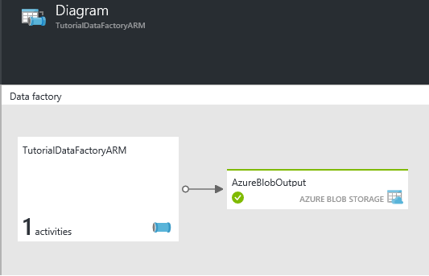

<properties
	pageTitle="Build your first data factory (ARM template) | Microsoft Azure"
	description="In this tutorial, you will create a sample Azure Data Factory pipeline using an Azure Resource Manager template."
	services="data-factory"
	documentationCenter=""
	authors="spelluru"
	manager="jhubbard"
	editor="monicar"/>

<tags
	ms.service="data-factory"
	ms.workload="data-services"
	ms.tgt_pltfrm="na"
	ms.devlang="na"
	ms.topic="hero-article"
	ms.date="08/01/2016"
	ms.author="spelluru"/>

# Tutorial: Build your first Azure data factory using Azure Resource Manager template
> [AZURE.SELECTOR]
- [Tutorial Overview](data-factory-build-your-first-pipeline.md)
- [Using Data Factory Editor](data-factory-build-your-first-pipeline-using-editor.md)
- [Using PowerShell](data-factory-build-your-first-pipeline-using-powershell.md)
- [Using Visual Studio](data-factory-build-your-first-pipeline-using-vs.md)
- [Using Resource Manager Template](data-factory-build-your-first-pipeline-using-arm.md)

In this article, you will learn how to use an Azure Resource Manager (ARM) template to create your first Azure data factory. 

## Prerequisites
Apart from prerequisites listed in the Tutorial Overview topic, you need to install the following:

- You **must** read through [Tutorial Overview](data-factory-build-your-first-pipeline.md) article and complete the prerequisite steps before proceeding further. 
- **Install Azure PowerShell**. Follow instructions in [How to install and configure Azure PowerShell](../powershell-install-configure.md) article to install latest version of Azure PowerShell on your computer.
- This article does not provide a conceptual overview of the Azure Data Factory service. For a detailed overview of the service, read through [Introduction to Azure Data Factory](data-factory-introduction.md). 
- See [Authoring Azure Resource Manager Templates](../resource-group-authoring-templates.md) to learn about Azure Resource Manager (ARM) templates. 

> [AZURE.IMPORTANT]
> You must complete the prerequisite steps in [Tutorial Overview](data-factory-build-your-first-pipeline.md) to do the walkthrough in this article. 

## Create ARM template

Create a JSON file named **ADFTutorialARM.json** in **C:\ADFGetStarted** folder with the following content: 

The template allows you to create the following Data Factory entities.

1. A **data factory** named **TutorialDataFactoryARM**. A data factory can have one or more pipelines. A pipeline can have one or more activities in it. For example, a Copy Activity to copy data from a source to a destination data store and a HDInsight Hive activity to run Hive script to transform input data to product output data. 
2. Two **linked services**: **StorageLinkedService** and **HDInsightOnDemandLinkedService**. These linked services link your Azure Storage account and an on-demand Azure HDInsight cluster to your data factory. The Azure Storage account will hold the input and output data for the pipeline in this sample. The HDInsight linked service is used to run Hive script specified in the activity of the pipeline in this sample. You need to identify what data store/compute services are used in your scenario and link those services to the data factory by creating linked services. 
3. Two (input/output) **datasets**: **AzureBlobInput** and **AzureBlobOutput**. These datasets represent the input and output data for Hive processing. These datasets refer to the **StorageLinkedService** you have created earlier in this tutorial. The linked service points to an Azure Storage account and datasets specify container, folder, file name in the storage that holds input and output data.   

Click **Using Data Factory Editor** tab to switch to the article with details about JSON properties used in this template.

> [AZURE.IMPORTANT] Change the values for **storageAccountName** and **storageAccountKey** variables. Change the **dataFactoryName** too because the name has to be unique.

	{
	    "contentVersion": "1.0.0.0",
	    "$schema": "http://schema.management.azure.com/schemas/2015-01-01/deploymentTemplate.json#",
	    "parameters": {
	    },
	    "variables": {
	        "dataFactoryName":  "TutorialDataFactoryARM",
	        "storageAccountName":  "<AZURE STORAGE ACCOUNT NAME>" ,
	        "storageAccountKey":  "<AZURE STORAGE ACCOUNT KEY>",
	        "apiVersion": "2015-10-01",
	        "storageLinkedServiceName": "AzureStorageLinkedService",
	        "hdInsightOnDemandLinkedServiceName": "HDInsightOnDemandLinkedService",
	        "blobInputDataset": "AzureBlobInput",
	        "blobOutputDataset": "AzureBlobOutput",
	        "singleQuote": "'"
	    },
	    "resources": [
	        {
	            "name": "[variables('dataFactoryName')]",
	            "apiVersion": "[variables('apiVersion')]",
	            "type": "Microsoft.DataFactory/datafactories",
	            "location": "westus",
	            "resources": [
	                {
	                    "dependsOn": [ "[concat('Microsoft.DataFactory/dataFactories/', variables('dataFactoryName'))]" ],
	                    "type": "linkedservices",
	                    "name": "[variables('storageLinkedServiceName')]",
	                    "apiVersion": "[variables('apiVersion')]",
	                    "properties": {
	                        "type": "AzureStorage",
	                        "typeProperties": {
	                            "connectionString": "[concat('DefaultEndpointsProtocol=https;AccountName=',variables('storageAccountName'),';AccountKey=',variables('storageAccountKey'))]"
	                        }
	                    }
	                },
	                {
	                    "dependsOn": [
	                        "[concat('Microsoft.DataFactory/dataFactories/', variables('dataFactoryName'))]",
	                        "[concat('Microsoft.DataFactory/dataFactories/', variables('dataFactoryName'), '/linkedservices/', variables('storageLinkedServiceName'))]"
	                    ],
	                    "type": "linkedservices",
	                    "name": "[variables('hdInsightOnDemandLinkedServiceName')]",
	                    "apiVersion": "[variables('apiVersion')]",
	                    "properties": {
	                        "type": "HDInsightOnDemand",
        					"typeProperties": {
                                "clusterSize": 4,
                                "version":  "3.2",
            					"timeToLive": "00:05:00",
                                "osType": "windows",
            					"linkedServiceName": "[variables('storageLinkedServiceName')]",
    						}
	                    }
	                },
	                {
	                    "dependsOn": [
	                        "[concat('Microsoft.DataFactory/dataFactories/', variables('dataFactoryName'))]",
	                        "[concat('Microsoft.DataFactory/dataFactories/', variables('dataFactoryName'), '/linkedServices/', variables('storageLinkedServiceName'))]"
	                    ],
	                    "type": "datasets",
	                    "name": "[variables('blobInputDataset')]",
	                    "apiVersion": "[variables('apiVersion')]",
						    "properties": {
						        "type": "AzureBlob",
						        "linkedServiceName": "[variables('storageLinkedServiceName')]",
						        "typeProperties": {
						            "fileName": "input.log",
						            "folderPath": "adfgetstarted/inputdata",
						            "format": {
						                "type": "TextFormat",
						                "columnDelimiter": ","
						            }
						        },
						        "availability": {
						            "frequency": "Month",
						            "interval": 1
						        },
						        "external": true,
						        "policy": {}
						    }
	                    },
	                {
	                    "dependsOn": [
	                        "[concat('Microsoft.DataFactory/dataFactories/', variables('dataFactoryName'))]",
	                        "[concat('Microsoft.DataFactory/dataFactories/', variables('dataFactoryName'), '/linkedServices/', variables('storageLinkedServiceName'))]"
	                    ],
	                    "type": "datasets",
	                    "name": "[variables('blobOutputDataset')]",
	                    "apiVersion": "[variables('apiVersion')]",
						    "properties": {
						        "published": false,
						        "type": "AzureBlob",
						        "linkedServiceName": "[variables('storageLinkedServiceName')]",
						        "typeProperties": {
						            "folderPath": "adfgetstarted/partitioneddata",
						            "format": {
						                "type": "TextFormat",
						                "columnDelimiter": ","
						            }
						        },
						        "availability": {
						            "frequency": "Month",
						            "interval": 1
						        }
						    }
	                    },
	                    {
	                        "dependsOn": [
	                            "[concat('Microsoft.DataFactory/dataFactories/', variables('dataFactoryName'))]",
	                            "[concat('Microsoft.DataFactory/dataFactories/', variables('dataFactoryName'), '/linkedServices/', variables('storageLinkedServiceName'))]",
	                            "[concat('Microsoft.DataFactory/dataFactories/', variables('dataFactoryName'), '/linkedServices/', variables('hdInsightOnDemandLinkedServiceName'))]",
	                            "[concat('Microsoft.DataFactory/dataFactories/', variables('dataFactoryName'), '/datasets/', variables('blobInputDataset'))]",
	                            "[concat('Microsoft.DataFactory/dataFactories/', variables('dataFactoryName'), '/datasets/', variables('blobOutputDataset'))]"
	                        ],
	                        "type": "datapipelines",
	                        "name": "[variables('dataFactoryName')]",
	                        "apiVersion": "[variables('apiVersion')]",
						    "properties": {
						        "description": "My first Azure Data Factory pipeline",
						        "activities": [
						            {
						                "type": "HDInsightHive",
						                "typeProperties": {
						                    "scriptPath": "adfgetstarted/script/partitionweblogs.hql",
						                    "scriptLinkedService": "[variables('storageLinkedServiceName')]",
						                    "defines": {
		                        				"inputtable": "[concat('wasb://adfgetstarted@', variables('storageAccountName'), '.blob.core.windows.net/inputdata')]",
		                        				"partitionedtable": "[concat('wasb://adfgetstarted@', variables('storageAccountName'), '.blob.core.windows.net/partitioneddata')]"
						                    }
						                },
						                "inputs": [
						                    {
						                        "name": "AzureBlobInput"
						                    }
						                ],
						                "outputs": [
						                    {
						                        "name": "AzureBlobOutput"
						                    }
						                ],
						                "policy": {
						                    "concurrency": 1,
						                    "retry": 3
						                },
						                "scheduler": {
						                    "frequency": "Month",
						                    "interval": 1
						                },
						                "name": "RunSampleHiveActivity",
						                "linkedServiceName": "HDInsightOnDemandLinkedService"
						            }
						        ],
						        "start": "2016-04-01T00:00:00Z",
						        "end": "2016-04-02T00:00:00Z",
						        "isPaused": false
						    }
	                    }
	            ]
	        }
	    ]
	}

Click **Using Data Factory Editor** tab to switch to the article that has details about JSON properties used in this template.

Note the following: 

- The Data Factory creates a **Windows-based** HDInsight cluster for you with the above JSON. You could also have it create a **Linux-based** HDInsight cluster. See [On-demand HDInsight Linked Service](data-factory-compute-linked-services.md#azure-hdinsight-on-demand-linked-service) for details. 
- You could use **your own HDInsight cluster** instead of using an on-demand HDInsight cluster. See [HDInsight Linked Service](data-factory-compute-linked-services.md#azure-hdinsight-linked-service) for details.
- The HDInsight cluster creates a **default container** in the blob storage you specified in the JSON (**linkedServiceName**). HDInsight does not delete this container when the cluster is deleted. This is by design. With on-demand HDInsight linked service, a HDInsight cluster is created every time a slice needs to be processed unless there is an existing live cluster (**timeToLive**) and is deleted when the processing is done.

	As more and more slices are processed, you will see a lot of containers in your Azure blob storage. If you do not need them for troubleshooting of the jobs, you may want to delete them to reduce the storage cost. The name of these containers follow a pattern: "adf**yourdatafactoryname**-**linkedservicename**-datetimestamp". Use tools such as [Microsoft Storage Explorer](http://storageexplorer.com/) to delete containers in your Azure blob storage.

See [On-demand HDInsight Linked Service](data-factory-compute-linked-services.md#azure-hdinsight-on-demand-linked-service) for details.

> [AZURE.NOTE] You can find another example of ARM template for creating an Azure data factory on [Github](https://github.com/Azure/azure-quickstart-templates/blob/master/101-data-factory-blob-to-sql/azuredeploy.json).  

## Create data factory

1. Start **Azure PowerShell** and run the following command. 
	- Run **Login-AzureRmAccount** and enter the  user name and password that you use to sign in to the Azure Portal.  
	- Run the following command to select a subscription in which you want to create the data factory.
			Get-AzureRmSubscription -SubscriptionName <SUBSCRIPTION NAME> | Set-AzureRmContext
1. Run the following command to deploy Data Factory entities using the ARM template you created in Step 1. 

		New-AzureRmResourceGroupDeployment -Name MyARMDeployment -ResourceGroupName ADFTutorialResourceGroup -TemplateFile C:\ADFGetStarted\ADFTutorialARM.json

## Monitor pipeline
 
1.	After logging into the [Azure Portal](https://portal.azure.com/), Click **Browse** and select **Data factories**.
		
2.	In the **Data Factories** blade, click the data factory (**TutorialFactoryARM**) you created.	
2.	In the **Data Factory** blade for your data factory, click **Diagram**.
		
4.	In the **Diagram View**, you will see an overview of the pipelines, and datasets used in this tutorial.
	
	 
8. In the Diagram View, double-click on the dataset **AzureBlobOutput**. You will see that the slice that is currently being processed.

	
9. When processing is done, you will see the slice in **Ready** state. Note that the creation of an on-demand HDInsight cluster usually takes sometime (approximately 20 minutes). 

		
10. When the slice is in **Ready** state, check the **partitioneddata** folder in the **adfgetstarted** container in your blob storage for the output data.  

See [Monitor datasets and pipeline](data-factory-monitor-manage-pipelines.md) for instructions on how to use the Azure portal blades to monitor the pipeline and datasets you have created in this tutorial.

You can also use Monitor and Manage App to monitor your data pipelines. See [Monitor and manage Azure Data Factory pipelines using Monitoring App](data-factory-monitor-manage-app.md) for details about using the application. 

> [AZURE.IMPORTANT] The input file gets deleted when the slice is processed successfully. Therefore, if you want to rerun the slice or do the tutorial again, upload the input file (input.log) to the inputdata folder of the adfgetstarted container.

## ARM template for creating a gateway
Here is a sample ARM template for creating a logical gateway in the back. Note that you need to install a gateway on your on-premises computer or Azure IaaS VM and register the gateway with Data Factory service using a key. See [Move data between on-premises and cloud](data-factory-move-data-between-onprem-and-cloud.md) for details.

	{
	    "contentVersion": "1.0.0.0",
	    "$schema": "http://schema.management.azure.com/schemas/2015-01-01/deploymentTemplate.json#",
	    "parameters": {
	    },
	    "variables": {
	        "dataFactoryName":  "GatewayUsingArmDF",
	        "apiVersion": "2015-10-01",
	        "singleQuote": "'"
	    },
	    "resources": [
	        {
	            "name": "[variables('dataFactoryName')]",
	            "apiVersion": "[variables('apiVersion')]",
	            "type": "Microsoft.DataFactory/datafactories",
	            "location": "eastus",
	            "resources": [
	                {
	                    "dependsOn": [ "[concat('Microsoft.DataFactory/dataFactories/', variables('dataFactoryName'))]" ],
	                    "type": "gateways",
	                    "apiVersion": "[variables('apiVersion')]",
	                    "name": "GatewayUsingARM",
	                    "properties": {
	                    	"description": "my gateway"
						}
	                }            
				]
	        }
	    ]
	}

This template creates a data factory named GatewayUsingArmDF with a gateway named: GatewayUsingARM. 

## See Also
| Topic | Description |
| :---- | :---- |
| [Data Transformation Activities](data-factory-data-transformation-activities.md) | This article provides a list of data transformation activities (such as HDInsight Hive transformation you used in this tutorial) supported by Azure Data Factory. |
| [Scheduling and execution](data-factory-scheduling-and-execution.md) | This article explains the scheduling and execution aspects of Azure Data Factory application model. |
| [Pipelines](data-factory-create-pipelines.md) | This article will help you understand pipelines and activities in Azure Data Factory and how to leverage them to construct end-to-end data-driven workflows for your scenario or business. |
| [Datasets](data-factory-create-datasets.md) | This article will help you understand datasets in Azure Data Factory.
| [Monitor and manage pipelines using Monitoring App](data-factory-monitor-manage-app.md) | This article describes how to monitor, manage, and debug pipelines using the Monitoring & Management App. 

  

