<properties
	pageTitle="Build your first data factory (Azure Portal) | Microsoft Azure"
	description="In this tutorial, you will create a sample Azure Data Factory pipeline using Data Factory Editor in the Azure Portal."
	services="data-factory"
	documentationCenter=""
	authors="spelluru"
	manager="jhubbard"
	editor="monicar"/>

<tags
	ms.service="data-factory"
	ms.workload="data-services"
	ms.tgt_pltfrm="na"
	ms.devlang="na"
	ms.topic="hero-article" 
	ms.date="05/16/2016"
	ms.author="spelluru"/>

# Build your first Azure data factory using Azure Portal/Data Factory Editor
> [AZURE.SELECTOR]
- [Tutorial Overview](data-factory-build-your-first-pipeline.md)
- [Using Data Factory Editor](data-factory-build-your-first-pipeline-using-editor.md)
- [Using PowerShell](data-factory-build-your-first-pipeline-using-powershell.md)
- [Using Visual Studio](data-factory-build-your-first-pipeline-using-vs.md)
- [Using Resource Manager Template](data-factory-build-your-first-pipeline-using-arm.md)

In this article, you will learn how to use the [Azure Portal](https://portal.azure.com/) to create your first Azure data factory. 

## Prerequisites

1. You **must** read through [Tutorial Overview](data-factory-build-your-first-pipeline.md) article and complete the prerequisite steps before proceeding further.
2. This article does not provide a conceptual overview of the Azure Data Factory service. We recommend that you go through [Introduction to Azure Data Factory](data-factory-introduction.md) article for a detailed overview of the service.  

## Create data factory
A data factory can have one or more pipelines. A pipeline can have one or more activities in it. For example, a Copy Activity to copy data from a source to a destination data store and a HDInsight Hive activity to run Hive script to transform input data to product output data. Let's start with creating the data factory in this step. 

1.	After logging into the [Azure Portal](https://portal.azure.com/), do the following:
	1.	Click **NEW** on the left menu. 
	2.	Click **Data analytics** in the **Create** blade.
	3.	Click **Data Factory** on the **Data analytics** blade.

		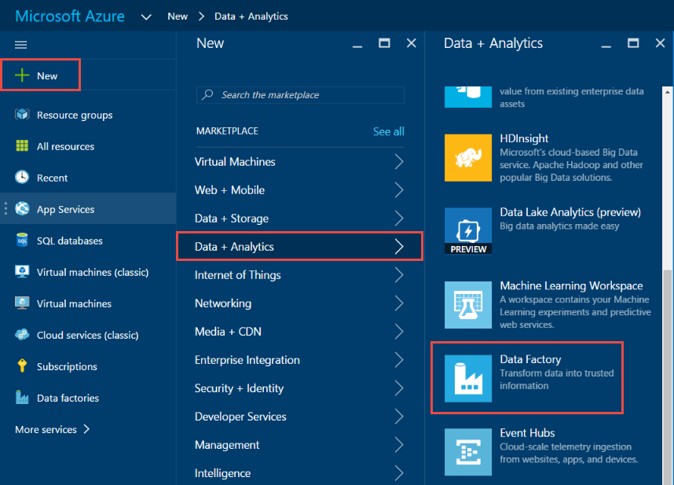

2.	In the **New data factory** blade, enter **GetStartedDF** for the Name.

	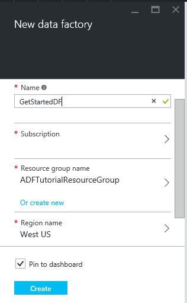

	> [AZURE.IMPORTANT] The name of the Azure data factory must be globally unique. If you receive the error: **Data factory name “GetStartedDF” is not available**, change the name of the data factory (for example, yournameGetStartedDF) and try creating again. See [Data Factory - Naming Rules](data-factory-naming-rules.md) topic for naming rules for Data Factory artifacts.
	> 
	> The name of the data factory may be registered as a DNS name in the future and hence become publically visible.
	> 
	> To create Data Factory instances, you need to be a contributor/administrator of the Azure subscription

3.	Select the **Azure subscription** where you want the data factory to be created. 
4.	Select existing **resource group** or create a new resource group. For the purpose of the tutorial, create a resource group named: **ADFGetStartedRG**.    
5.	Click **Create** on the **New data factory** blade.
6.	You will see the data factory being created in the **Startboard** of the Azure Portal as follows:   

	
7. Congratulations! You have successfully created your first data factory. After the data factory has been created successfully, you will see the data factory page, which shows you the contents of the data factory. 	

	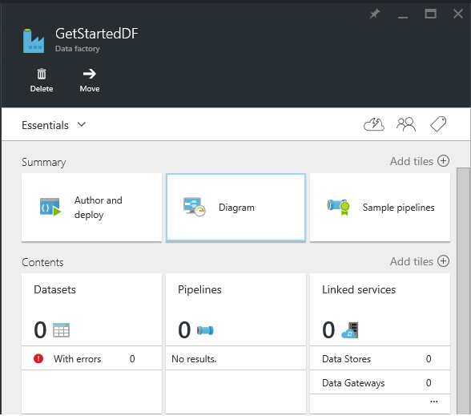

Before creating a pipeline, you need to create a few Data Factory entities first. You first create linked services to link data stores/computes to your data store, define input and output datasets to represent data in linked data stores, and then create the pipeline with a activity that use these datasets. 

## Create linked services
In this step, you will link your Azure Storage account and an on-demand Azure HDInsight cluster to your data factory. The Azure Storage account will hold the input and output data for the pipeline in this sample. The HDInsight linked service is used to run Hive script specified in the activity of the pipeline in this sample. You need to identify what data store/compute services are used in your scenario and link those services to the data factory by creating linked services.  

### Create Azure Storage linked service
In this step, you will link your Azure Storage account to your data factory. For the purpose of this tutorial, you use the same Azure Storage account to store input/output data and the HQL script file. 

1.	Click **Author and deploy** on the **DATA FACTORY** blade for **GetStartedDF**. This launches the Data Factory Editor. 
	 
	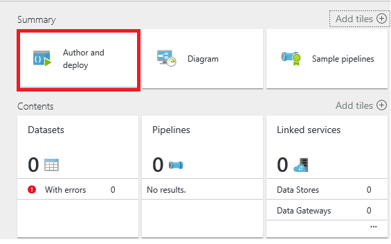
2.	Click **New data store** and choose **Azure storage**.
	
	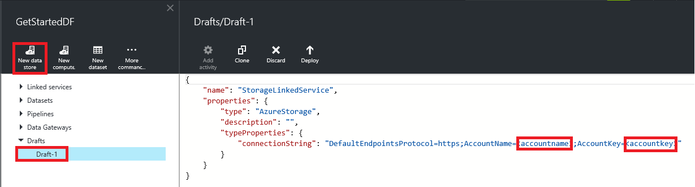

	You should see the JSON script for creating an Azure Storage linked service in the editor. 
4. Replace **account name** with the name of your Azure storage account and **account key** with the access key of the Azure storage account. To learn how to get your storage access key, see [View, copy and regenerate storage access keys](../storage/storage-create-storage-account.md#view-copy-and-regenerate-storage-access-keys)
5. Click **Deploy** on the command bar to deploy the linked service.

	

   After the linked service is deployed successfully, the **Draft-1** window should disappear and you will see **AzureStorageLinkedService** in the tree view on the left. 
	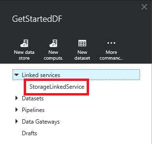	

 
### Create Azure HDInsight linked service
In this step, you will link an on-demand HDInsight cluster to your data factory. The HDInsight cluster is automatically created at runtime and deleted after it is done processing and idle for the specified amount of time. 

1. In the **Data Factory Editor**, click **New compute** on the command bar and select **On-demand HDInsight cluster**.

	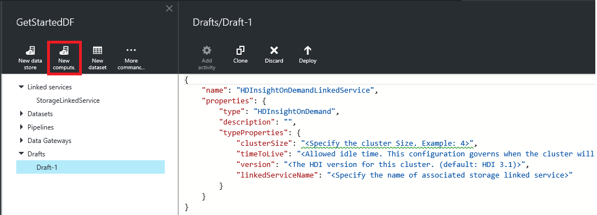
2. Copy and paste the snippet below to the **Draft-1** window. The JSON snippet describes the properties that will be used to create the HDInsight cluster on-demand. 

		{
		  "name": "HDInsightOnDemandLinkedService",
		  "properties": {
		    "type": "HDInsightOnDemand",
		    "typeProperties": {
		      "version": "3.2",
		      "clusterSize": 1,
		      "timeToLive": "00:30:00",
		      "linkedServiceName": "AzureStorageLinkedService"
		    }
		  }
		}
	
	The following table provides descriptions for the JSON properties used in the snippet:
	
	| Property | Description |
	| :------- | :---------- |
	| Version | This specifies that the version of the HDInsight created to be 3.2. | 
	| ClusterSize | This creates a one node HDInsight cluster. | 
	| TimeToLive | This specifies that the idle time for the HDInsight cluster, before it is deleted. |
	| linkedServiceName | This specifies the storage account that will be used to store the logs that are generated by HDInsight. |

	Note the following: 
	
	- The Data Factory creates a **Windows-based** HDInsight cluster for you with the above JSON. You could also have it create a **Linux-based** HDInsight cluster. See [On-demand HDInsight Linked Service](data-factory-compute-linked-services.md#azure-hdinsight-on-demand-linked-service) for details. 
	- You could use **your own HDInsight cluster** instead of using an on-demand HDInsight cluster. See [HDInsight Linked Service](data-factory-compute-linked-services.md#azure-hdinsight-linked-service) for details.
	- The HDInsight cluster creates a **default container** in the blob storage you specified in the JSON (**linkedServiceName**). HDInsight does not delete this container when the cluster is deleted. This is by design. With on-demand HDInsight linked service, a HDInsight cluster is created every time a slice needs to be processed unless there is an existing live cluster (**timeToLive**) and is deleted when the processing is done.
	
		As more and more slices are processed, you will see a lot of containers in your Azure blob storage. If you do not need them for troubleshooting of the jobs, you may want to delete them to reduce the storage cost. The name of these containers follow a pattern: "adf**yourdatafactoryname**-**linkedservicename**-datetimestamp". Use tools such as [Microsoft Storage Explorer](http://storageexplorer.com/) to delete containers in your Azure blob storage.

	See [On-demand HDInsight Linked Service](data-factory-compute-linked-services.md#azure-hdinsight-on-demand-linked-service) for details.
3. Click **Deploy** on the command bar to deploy the linked service. 
4. Confirm that you see both **AzureStorageLinkedService** and **HDInsightOnDemandLinkedService** in the tree view on the left.

	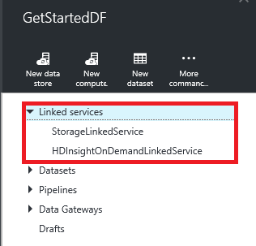

## Create datasets
In this step, you will create datasets to represent the input and output data for Hive processing. These datasets refer to the **AzureStorageLinkedService** you have created earlier in this tutorial. The linked service points to an Azure Storage account and datasets specify container, folder, file name in the storage that holds input and output data.   

### Create input dataset

1. In the **Data Factory Editor**, click **New dataset** on the command bar and select **Azure Blob storage**.

	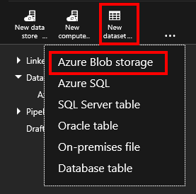
2. Copy and paste the snippet below to the Draft-1 window. In the JSON snippet, you are creating a dataset called **AzureBlobInput** that represents input data for an activity in the pipeline. In addition, you specify that the input data is located in the blob container called **adfgetstarted** and the folder called **inputdata**.
		
		{
			"name": "AzureBlobInput",
		    "properties": {
		        "type": "AzureBlob",
		        "linkedServiceName": "AzureStorageLinkedService",
		        "typeProperties": {
		            "fileName": "input.log",
		            "folderPath": "adfgetstarted/inputdata",
		            "format": {
		                "type": "TextFormat",
		                "columnDelimiter": ","
		            }
		        },
		        "availability": {
		            "frequency": "Month",
		            "interval": 1
		        },
		        "external": true,
		        "policy": {}
		    }
		} 

	The following table provides descriptions for the JSON properties used in the snippet:

	| Property | Description |
	| :------- | :---------- |
	| type | The type property is set to AzureBlob because data resides in Azure blob storage. |  
	| linkedServiceName | refers to the AzureStorageLinkedService you created earlier. |
	| fileName | This property is optional. If you omit this property, all the files from the folderPath are picked. In this case, only the input.log is processed. |
	| type | The log files are in text format, so we will use TextFormat. | 
	| columnDelimiter | columns in the log files are delimited by , (comma) |
	| frequency/interval | frequency set to Month and interval is 1, which means that the input slices are available monthly. | 
	| external | this property is set to true if the input data is not generated by the Data Factory service. | 
	  
	
3. Click **Deploy** on the command bar to deploy the newly created dataset. You should see the dataset in the tree view on the left. 

### Create output dataset
Now, you will create the output dataset to represent the output data stored in the Azure Blob storage. 

1. In the **Data Factory Editor**, click **New dataset** on the command bar and select **Azure Blob storage**.  
2. Copy and paste the snippet below to the Draft-1 window. In the JSON snippet, you are creating a dataset called **AzureBlobOutput**, and specifying the structure of the data that will be produced by the Hive script. In addition, you specify that the results are stored in the blob container called **adfgetstarted** and the folder called **partitioneddata**. The **availability** section specifies that the output dataset is produced on a monthly basis.
	
		{
		  "name": "AzureBlobOutput",
		  "properties": {
		    "type": "AzureBlob",
		    "linkedServiceName": "AzureStorageLinkedService",
		    "typeProperties": {
		      "folderPath": "adfgetstarted/partitioneddata",
		      "format": {
		        "type": "TextFormat",
		        "columnDelimiter": ","
		      }
		    },
		    "availability": {
		      "frequency": "Month",
		      "interval": 1
		    }
		  }
		}

	See **Create the input dataset** section for descriptions of these properties. You do not set the external property on an output dataset as the dataset is produced by the Data Factory service.
3. Click **Deploy** on the command bar to deploy the newly created dataset.
4. Verify that the dataset is created successfully.

	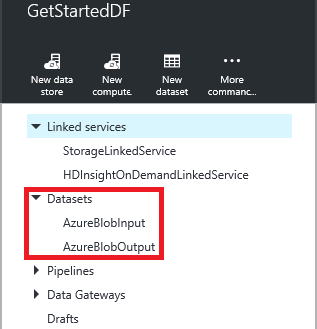

## Create pipeline
In this step, you will create your first pipeline with a **HDInsightHive** activity. Note that input slice is available monthly (frequency: Month, interval: 1), output slice is produced monthly, and the scheduler property for the activity is also set to monthly (see below). The settings for the output dataset and the activity scheduler must match. At this time, output dataset is what drives the schedule, so you must create an output dataset even if the activity does not produce any output. If the activity doesn't take any input, you can skip creating the input dataset. The properties used in the following JSON are explained at the end of this section. 

1. In the **Data Factory Editor**, click **Elipsis (…) More commands** and then click **New pipeline**.
	
	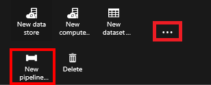
2. Copy and paste the snippet below to the Draft-1 window.

	> [AZURE.IMPORTANT] Replace **storageaccountname** with the name of your storage account in the  JSON.
		
		{
		    "name": "MyFirstPipeline",
		    "properties": {
		        "description": "My first Azure Data Factory pipeline",
		        "activities": [
		            {
		                "type": "HDInsightHive",
		                "typeProperties": {
		                    "scriptPath": "adfgetstarted/script/partitionweblogs.hql",
		                    "scriptLinkedService": "AzureStorageLinkedService",
		                    "defines": {
		                        "inputtable": "wasb://adfgetstarted@<storageaccountname>.blob.core.windows.net/inputdata",
		                        "partitionedtable": "wasb://adfgetstarted@<storageaccountname>.blob.core.windows.net/partitioneddata"
		                    }
		                },
		                "inputs": [
		                    {
		                        "name": "AzureBlobInput"
		                    }
		                ],
		                "outputs": [
		                    {
		                        "name": "AzureBlobOutput"
		                    }
		                ],
		                "policy": {
		                    "concurrency": 1,
		                    "retry": 3
		                },
		                "scheduler": {
		                    "frequency": "Month",
		                    "interval": 1
		                },
		                "name": "RunSampleHiveActivity",
		                "linkedServiceName": "HDInsightOnDemandLinkedService"
		            }
		        ],
		        "start": "2016-04-01T00:00:00Z",
		        "end": "2016-04-02T00:00:00Z",
		        "isPaused": false
		    }
		}
 
	In the JSON snippet, you are creating a pipeline that consists of a single activity that uses Hive to process Data on an HDInsight cluster.
	
	The Hive script file, **partitionweblogs.hql**, is stored in the Azure storage account (specified by the scriptLinkedService, called **AzureStorageLinkedService**), and in **script** folder in the container **adfgetstarted**.

	The **defines** section is used to specify the runtime settings that will be passed to the hive script as Hive configuration values (e.g ${hiveconf:inputtable}, ${hiveconf:partitionedtable}).

	The **start** and **end** properties of the pipeline specifies the active period of the pipeline.

	In the activity JSON, you specify that the Hive script runs on the compute specified by the **linkedServiceName** – **HDInsightOnDemandLinkedService**.

	> [AZURE.NOTE] See [Anatomy of a Pipeline](data-factory-create-pipelines.md#anatomy-of-a-pipeline) for details about JSON properties used in the above example. 

3. Confirm the following: 
	1. **input.log** file exists in the **inputdata** folder of the **adfgetstarted** container in the Azure blob storage
	2. **partitionweblogs.hql** file exists in the **script** folder of the **adfgetstarted** container in the Azure blob storage. Please complete the prerequisite steps in the [Tutorial Overview](data-factory-build-your-first-pipeline.md) if you don't see these files. 
	3. Confirm that you replaced **storageaccountname** with the name of your storage account in the pipeline JSON. 
2. Click **Deploy** on the command bar to deploy the pipeline. Since the **start** and **end** times are set in the past and **isPaused** is set to false, the pipeline (activity in the pipeline) runs immediately after you deploy. 
4. Confirm that you see the pipeline in the tree view.

	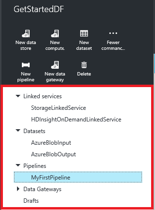
5. Congratulations, you have successfully created your first pipeline!

## Monitor pipeline

6. Click **X** to close Data Factory Editor blades and to navigate back to the Data Factory blade, and click on **Diagram**.
  
	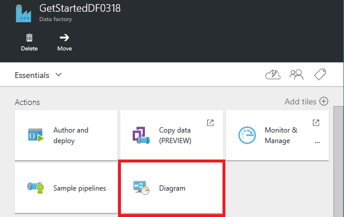
7. In the Diagram View, you will see an overview of the pipelines, and datasets used in this tutorial.
	
	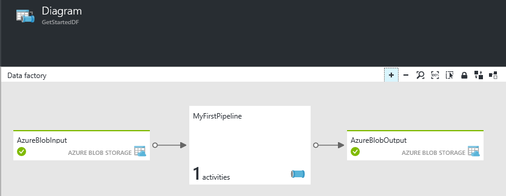 
8. To view all activities in the pipeline, right-click on pipeline in the diagram and click Open Pipeline. 

	
9. Confirm that you see the HDInsightHive activity in the pipeline. 
  
	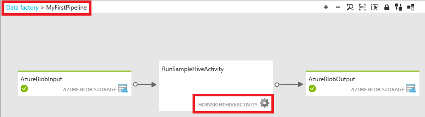

	To navigate back to the previous view, click **Data factory** in the breadcrump menu at the top. 
10. In the **Diagram View**, double-click on the dataset **AzureBlobInput**. Confirm that the slice is in **Ready** state. It may take a couple of minutes for the slice to show up in Ready state. If it does not happen after you wait for sometime, please see if you have the input file (input.log) placed in the right container (adfgetstarted) and folder (inputdata).

	
11. Click **X** to close **AzureBlobInput** blade. 
12. In the **Diagram View**, double-click on the dataset **AzureBlobOutput**. You will see that the slice that is currently being processed.

	
9. When processing is done, you will see the slice in **Ready** state.
	>[AZURE.IMPORTANT] Creation of an on-demand HDInsight cluster usually takes sometime (approximately 20 minutes).  

		
	
10. When the slice is in **Ready** state, check the **partitioneddata** folder in the **adfgetstarted** container in your blob storage for the output data.  
 
	

See [Monitor and manage pipelines using Azure portal blades](data-factory-monitor-manage-pipelines.md) article for more details. 

> [AZURE.IMPORTANT] The input file gets deleted when the slice is processed successfully. Therefore, if you want to rerun the slice or do the tutorial again, upload the input file (input.log) to the inputdata folder of the adfgetstarted container.

## Summary 
In this tutorial, you created an Azure data factory to process data by running Hive script on a HDInsight hadoop cluster. You used the Data Factory Editor in the Azure Portal to do the following steps:  

1.	Created an Azure **data factory**.
2.	Created two **linked services**:
	1.	**Azure Storage** linked service to link your Azure blob storage that holds input/output files to the data factory.
	2.	**Azure HDInsight** on-demand linked service to link an on-demand HDInsight Hadoop cluster to the data factory. Azure Data Factory creates a HDInsight Hadoop cluster just-in-time to process input data and produce output data. 
3.	Created two **datasets** which describe input and output data for HDInsight Hive activity in the pipeline. 
4.	Created a **pipeline** with a **HDInsight Hive** activity. 

## Next Steps
In this article, you have created a pipeline with a transformation activity (HDInsight Activity) that runs a Hive script on an on-demand HDInsight cluster. To see how to use a Copy Activity to copy data from an Azure Blob to Azure SQL, see [Tutorial: Copy data from an Azure blob to Azure SQL](data-factory-copy-data-from-azure-blob-storage-to-sql-database.md).

## See Also
| Topic | Description |
| :---- | :---- |
| [Data Transformation Activities](data-factory-data-transformation-activities.md) | This article provides a list of data transformation activities (such as HDInsight Hive transformation you used in this tutorial) supported by Azure Data Factory. | 
| [Scheduling and execution](data-factory-scheduling-and-execution.md) | This article explains the scheduling and execution aspects of Azure Data Factory application model. |
| [Pipelines](data-factory-create-pipelines.md) | This article will help you understand pipelines and activities in Azure Data Factory and how to leverage them to construct end-to-end data-driven workflows for your scenario or business. |
| [Datasets](data-factory-create-datasets.md) | This article will help you understand datasets in Azure Data Factory.
| [Monitor and manage pipelines using Monitoring App](data-factory-monitor-manage-app.md) | This article describes how to monitor, manage, and debug pipelines using the Monitoring & Management App. 

  

