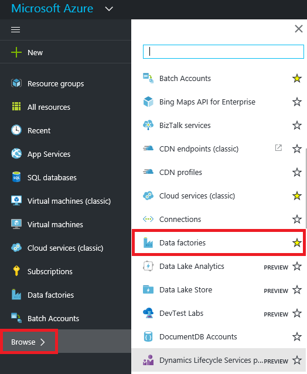
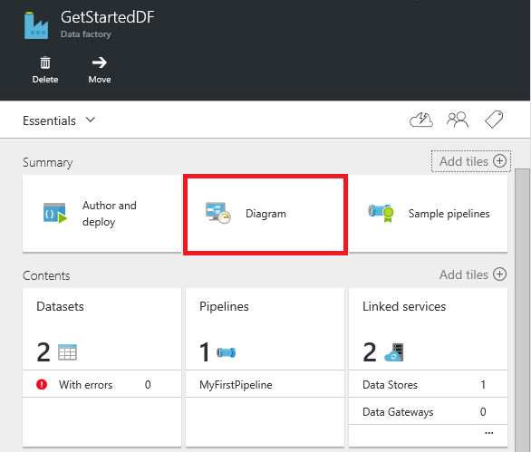
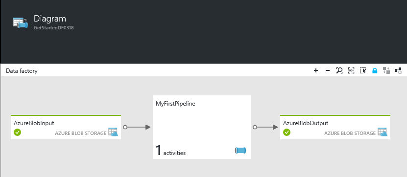
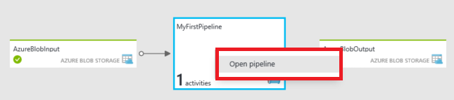
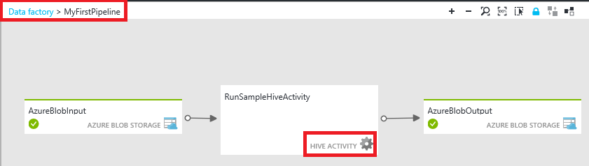
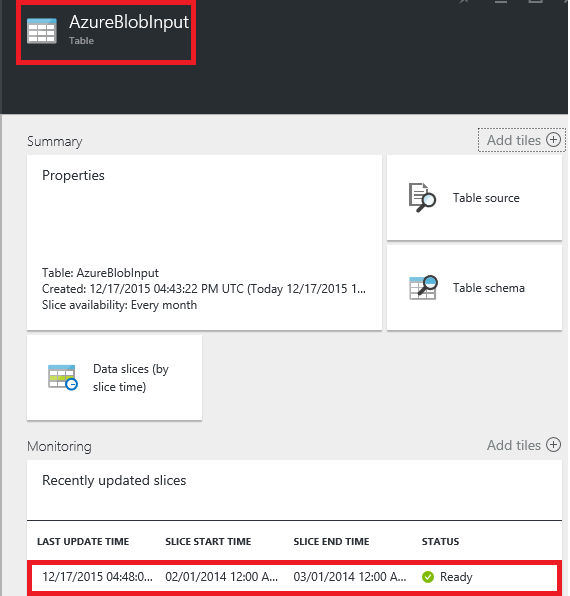
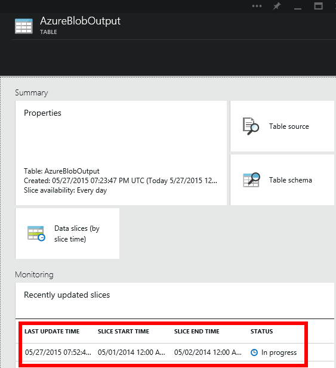
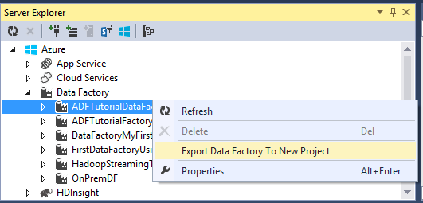

<properties
	pageTitle="Build your first data factory (Visual Studio) | Microsoft Azure"
	description="In this tutorial, you will create a sample Azure Data Factory pipeline using Visual Studio."
	services="data-factory"
	documentationCenter=""
	authors="spelluru"
	manager="jhubbard"
	editor="monicar"/>

<tags
	ms.service="data-factory"
	ms.workload="data-services"
	ms.tgt_pltfrm="na"
	ms.devlang="na"
	ms.topic="hero-article" 
	ms.date="08/01/2016"
	ms.author="spelluru"/>

# Build your Azure first data factory using Microsoft Visual Studio
> [AZURE.SELECTOR]
- [Tutorial Overview](data-factory-build-your-first-pipeline.md)
- [Using Data Factory Editor](data-factory-build-your-first-pipeline-using-editor.md)
- [Using PowerShell](data-factory-build-your-first-pipeline-using-powershell.md)
- [Using Visual Studio](data-factory-build-your-first-pipeline-using-vs.md)
- [Using Resource Manager Template](data-factory-build-your-first-pipeline-using-arm.md)

In this article, you will learn how to use the Microsoft Visual Studio to create your first Azure data factory. 

## Prerequisites

1. You **must** read through [Tutorial Overview](data-factory-build-your-first-pipeline.md) article and complete the prerequisite steps before proceeding further.
2. You must be an **administrator of the Azure subscription** to be able to publish Data Factory entities to Azure Data Factory. This is a limitation at this time. We will inform you as soon as this requirement changes. 
3. You must have the following installed on your computer: 
	- Visual Studio 2013 or Visual Studio 2015
	- Download Azure SDK for Visual Studio 2013 or Visual Studio 2015. Navigate to [Azure Download Page](https://azure.microsoft.com/downloads/) and click **VS 2013** or **VS 2015** in the **.NET** section.
	- Download the latest Azure Data Factory plugin for Visual Studio : [VS 2013](https://visualstudiogallery.msdn.microsoft.com/754d998c-8f92-4aa7-835b-e89c8c954aa5) or [VS 2015](https://visualstudiogallery.msdn.microsoft.com/371a4cf9-0093-40fa-b7dd-be3c74f49005). If you are using Visual Studio 2013, you can also update the plugin by doing the following: On the menu, click **Tools** -> **Extensions and Updates** -> **Online** -> **Visual Studio Gallery** -> **Microsoft Azure Data Factory Tools for Visual Studio** -> **Update**. 
 
The following walkthroughs show you how to create and deploy Data Factory entities.

## Create Visual Studio project 
1. Launch **Visual Studio 2013** or **Visual Studio 2015**. Click **File**, point to **New**, and click **Project**. You should see the **New Project** dialog box.  
2. In the **New Project** dialog, select the **DataFactory** template, and click **Empty Data Factory Project**.   

	

3. Enter a **name** for the project, **location**, and a name for the **solution**, and click **OK**.

	

## Create linked services
A data factory can have one or more pipelines. A pipeline can have one or more activities in it. For example, a Copy Activity to copy data from a source to a destination data store and a HDInsight Hive activity to run Hive script to transform input data to product output data. You will specify the name and settings for the data factory later when you publish your Data Factory solution.

In this step, you will link your Azure Storage account and an on-demand Azure HDInsight cluster to your data factory. The Azure Storage account will hold the input and output data for the pipeline in this sample. The HDInsight linked service is used to run Hive script specified in the activity of the pipeline in this sample. You need to identify what data store/compute services are used in your scenario and link those services to the data factory by creating linked services.  

#### Create Azure Storage linked service
In this step, you will link your Azure Storage account to your data factory. For the purpose of this tutorial, you use the same Azure Storage account to store input/output data and the HQL script file. 

4. Right-click **Linked Services** in the solution explorer, point to **Add**, and click **New Item**.      
5. In the **Add New Item** dialog box, select **Azure Storage Linked Service** from the list, and click **Add**. 
3. Replace **accountname** and **accountkey** with the name of your Azure storage account and its key. To learn how to get your storage access key, see [View, copy and regenerate storage access keys](../storage/storage-create-storage-account.md#view-copy-and-regenerate-storage-access-keys)

	

4. Save the **AzureStorageLinkedService1.json** file.

#### Create Azure HDInsight linked service
In this step, you will link an on-demand HDInsight cluster to your data factory. The HDInsight cluster is automatically created at runtime and deleted after it is done processing and idle for the specified amount of time. You could use your own HDInsight cluster instead of using an on-demand HDInsight cluster. See [Compute Linked Services](data-factory-compute-linked-services.md) for details. . 

1. In the **Solution Explorer**, right-click **Linked Services**, point to **Add**, and click **New Item**.
2. Select **HDInsight On Demand Linked Service**, and click **Add**. 
3. Replace the **JSON** with the following:

		{
		  "name": "HDInsightOnDemandLinkedService",
		  "properties": {
		    "type": "HDInsightOnDemand",
		    "typeProperties": {
		      "version": "3.2",
		      "clusterSize": 1,
		      "timeToLive": "00:30:00",
		      "linkedServiceName": "AzureStorageLinkedService1"
		    }
		  }
		}
	
	The following table provides descriptions for the JSON properties used in the snippet:
	
	Property | Description
	-------- | -----------
	Version | This specifies that the version of the HDInsight created to be 3.2. 
	ClusterSize | This creates a one node HDInsight cluster. 
	TimeToLive | This specifies that the idle time for the HDInsight cluster, before it is deleted.
	linkedServiceName | This specifies the storage account that will be used to store the logs that are generated by HDInsight

	Note the following: 
	
	- The Data Factory creates a **Windows-based** HDInsight cluster for you with the above JSON. You could also have it create a **Linux-based** HDInsight cluster. See [On-demand HDInsight Linked Service](data-factory-compute-linked-services.md#azure-hdinsight-on-demand-linked-service) for details. 
	- You could use **your own HDInsight cluster** instead of using an on-demand HDInsight cluster. See [HDInsight Linked Service](data-factory-compute-linked-services.md#azure-hdinsight-linked-service) for details.
	- The HDInsight cluster creates a **default container** in the blob storage you specified in the JSON (**linkedServiceName**). HDInsight does not delete this container when the cluster is deleted. This is by design. With on-demand HDInsight linked service, a HDInsight cluster is created every time a slice needs to be processed unless there is an existing live cluster (**timeToLive**) and is deleted when the processing is done.
	
		As more and more slices are processed, you will see a lot of containers in your Azure blob storage. If you do not need them for troubleshooting of the jobs, you may want to delete them to reduce the storage cost. The name of these containers follow a pattern: "adf**yourdatafactoryname**-**linkedservicename**-datetimestamp". Use tools such as [Microsoft Storage Explorer](http://storageexplorer.com/) to delete containers in your Azure blob storage.

	See [On-demand HDInsight Linked Service](data-factory-compute-linked-services.md#azure-hdinsight-on-demand-linked-service) for details. 
4. Save the **HDInsightOnDemandLinkedService1.json** file.

## Create datasets
In this step, you will create datasets to represent the input and output data for Hive processing. These datasets refer to the **AzureStorageLinkedService1** you have created earlier in this tutorial. The linked service points to an Azure Storage account and datasets specify container, folder, file name in the storage that holds input and output data.   

#### Create input dataset

1. In the **Solution Explorer**, right-click **Tables**, point to **Add**, and click **New Item**. 
2. Select **Azure Blob** from the list, change the name of the file to **InputDataSet.json**, and click **Add**.
3. Replace the **JSON** in the editor with the following: 

	In the JSON snippet, you are creating a dataset called **AzureBlobInput** that represents input data for an activity in the pipeline. In addition, you specify that the input data is located in the blob container called **adfgetstarted** and the folder called **inputdata**
		
		{
			"name": "AzureBlobInput",
		    "properties": {
		        "type": "AzureBlob",
		        "linkedServiceName": "AzureStorageLinkedService1",
		        "typeProperties": {
		            "fileName": "input.log",
		            "folderPath": "adfgetstarted/inputdata",
		            "format": {
		                "type": "TextFormat",
		                "columnDelimiter": ","
		            }
		        },
		        "availability": {
		            "frequency": "Month",
		            "interval": 1
		        },
		        "external": true,
		        "policy": {}
		    }
		} 

	The following table provides descriptions for the JSON properties used in the snippet:

	| Property | Description |
	| :------- | :---------- |
	| type | The type property is set to AzureBlob because data resides in Azure blob storage. |  
	| linkedServiceName | refers to the AzureStorageLinkedService1 you created earlier. |
	| fileName | This property is optional. If you omit this property, all the files from the folderPath are picked. In this case, only the input.log is processed. |
	| type | The log files are in text format, so we will use TextFormat. | 
	| columnDelimiter | columns in the log files are delimited by , (comma) |
	| frequency/interval | frequency set to Month and interval is 1, which means that the input slices are available monthly. | 
	| external | this property is set to true if the input data is not generated by the Data Factory service. | 
	  
	
3. Save the **InputDataset.json** file. 

 
#### Create output dataset
Now, you will create the output dataset to represent the output data stored in the Azure Blob storage. 

1. In the **Solution Explorer**, right-click **tables**, point to **Add**, and click **New Item**. 
2. Select **Azure Blob** from the list, change the name of the file to **OutputDataset.json**, and click **Add**. 
3. Replace the **JSON** in the editor with the following: 

	In the JSON snippet, you are creating a dataset called **AzureBlobOutput**, and specifying the structure of the data that will be produced by the Hive script. In addition, you specify that the results are stored in the blob container called **adfgetstarted** and the folder called **partitioneddata**. The **availability** section specifies that the output dataset is produced on a monthly basis.
	
		{
		  "name": "AzureBlobOutput",
		  "properties": {
		    "type": "AzureBlob",
		    "linkedServiceName": "AzureStorageLinkedService1",
		    "typeProperties": {
		      "folderPath": "adfgetstarted/partitioneddata",
		      "format": {
		        "type": "TextFormat",
		        "columnDelimiter": ","
		      }
		    },
		    "availability": {
		      "frequency": "Month",
		      "interval": 1
		    }
		  }
		}

	See **Create the input dataset** section for descriptions of these properties. You do not set the external property on an output dataset as the dataset is produced by the Data Factory service.

4. Save the **OutputDataset.json** file.

### Create pipeline
In this step, you will create your first pipeline with a **HDInsightHive** activity. Note that input slice is available monthly (frequency: Month, interval: 1), output slice is produced monthly, and the scheduler property for the activity is also set to monthly (see below). The settings for the output dataset and the activity scheduler must match. At this time, output dataset is what drives the schedule, so you must create an output dataset even if the activity does not produce any output. If the activity doesn't take any input, you can skip creating the input dataset. The properties used in the following JSON are explained at the end of this section.

1. In the **Solution Explorer**, right-click **Pipelines**, point to **Add**, and click **New Item.** 
2. Select **Hive Transformation Pipeline** from the list, and click **Add**. 
3. Replace the **JSON** with the following snippet.

	> [AZURE.IMPORTANT] replace **storageaccountname** with the name of your storage account.

		{
		    "name": "MyFirstPipeline",
		    "properties": {
		        "description": "My first Azure Data Factory pipeline",
		        "activities": [
		            {
		                "type": "HDInsightHive",
		                "typeProperties": {
		                    "scriptPath": "adfgetstarted/script/partitionweblogs.hql",
		                    "scriptLinkedService": "AzureStorageLinkedService1",
		                    "defines": {
		                        "inputtable": "wasb://adfgetstarted@<storageaccountname>.blob.core.windows.net/inputdata",
		                        "partitionedtable": "wasb://adfgetstarted@<storageaccountname>.blob.core.windows.net/partitioneddata"
		                    }
		                },
		                "inputs": [
		                    {
		                        "name": "AzureBlobInput"
		                    }
		                ],
		                "outputs": [
		                    {
		                        "name": "AzureBlobOutput"
		                    }
		                ],
		                "policy": {
		                    "concurrency": 1,
		                    "retry": 3
		                },
		                "scheduler": {
		                    "frequency": "Month",
		                    "interval": 1
		                },
		                "name": "RunSampleHiveActivity",
		                "linkedServiceName": "HDInsightOnDemandLinkedService"
		            }
		        ],
		        "start": "2016-04-01T00:00:00Z",
		        "end": "2016-04-02T00:00:00Z",
		        "isPaused": false
		    }
		}

 	In the JSON snippet, you are creating a pipeline that consists of a single activity that uses Hive to process Data on an HDInsight cluster.
	
	In the JSON snippet, you are creating a pipeline that consists of a single activity that uses Hive to process Data on an HDInsight cluster.
	
	The Hive script file, **partitionweblogs.hql**, is stored in the Azure storage account (specified by the scriptLinkedService, called **AzureStorageLinkedService1**), and in **script** folder in the container **adfgetstarted**.

	The **defines** section is used to specify the runtime settings that will be passed to the hive script as Hive configuration values (e.g ${hiveconf:inputtable}, ${hiveconf:partitionedtable}).

	The **start** and **end** properties of the pipeline specifies the active period of the pipeline.

	In the activity JSON, you specify that the Hive script runs on the compute specified by the **linkedServiceName** – **HDInsightOnDemandLinkedService**.

	> [AZURE.NOTE] See [Anatomy of a Pipeline](data-factory-create-pipelines.md#anatomy-of-a-pipeline) for details about JSON properties used in the above example. 
3. Save the **HiveActivity1.json** file.

### Add partitionweblogs.hql and input.log as a dependency 

1. Right-click **Dependencies** in the **Solution Explorer** window, point to **Add**, and click **Existing Item**.  
2. Navigate to the **C:\ADFGettingStarted** and select **partitionweblogs.hql**, **input.log** files, and click **Add**. You had created these two files as part of prerequisites from the [Tutorial Overview](data-factory-build-your-first-pipeline.md).

When you publish the solution in the next step, the **partitionweblogs.hql** file is uploaded to the scripts folder in the **adfgetstarted** blob container.   

### Publish/deploy Data Factory entities

18. Right-click project in the Solution Explorer, and click **Publish**. 
19. If you see **Sign in to your Microsoft account** dialog box, enter your credentials for the account that has Azure subscription, and click **sign in**.
20. You should see the following dialog box:

	

21. In the Configure data factory page, do the following: 
	1. select **Create New Data Factory** option.
	2. Enter **FirstDataFactoryUsingVS** for **Name**. 
	
		> [AZURE.IMPORTANT] The name of the Azure Data Factory must be globally unique. If you receive the error **Data factory name “FirstDataFactoryUsingVS” is not available** when publishing, change the name (for example, yournameFirstDataFactoryUsingVS). See [Data Factory - Naming Rules](data-factory-naming-rules.md) topic for naming rules for Data Factory artifacts.
	3. Select the right subscription for the **Subscription** field. 
	4. Select the **resource group** for the data factory to be created. 
	5. Select the **region** for the data factory. 
	6. Click **Next** to switch to the **Publish Items** page. (Press **TAB** to move out of the Name field to if the **Next** button is disabled.) 
23. In the **Publish Items** page, ensure that all the Data Factories entities are selected, and click **Next** to switch to the **Summary** page.     
24. Review the summary and click **Next** to start the deployment process and view the **Deployment Status**.
25. In the **Deployment Status** page, you should see the status of the deployment process. Click Finish after the deployment is done. 

Please note the following: 

- If you receive the error: "**This subscription is not registered to use namespace Microsoft.DataFactory**", do one of the following and try publishing again: 

	- In Azure PowerShell, run the following command to register the Data Factory provider. 
		
			Register-AzureRmResourceProvider -ProviderNamespace Microsoft.DataFactory
	
		You can run the following command to confirm that the Data Factory provider is registerd. 
	
			Get-AzureRmResourceProvider
	- Login using the Azure subscription into the [Azure portal](https://portal.azure.com) and navigate to a Data Factory blade (or) create a data factory in the Azure portal. This automatically registers the provider for you.
- 	The name of the data factory may be registered as a DNS name in the future and hence become publically visible.
- 	To create Data Factory instances, you need to be a contributor/administrator of the Azure subscription

 
## Monitor pipeline

6. Log in into the [Azure Portal](https://portal.azure.com/), do the following:
	1. Click **Browse** and select **Data factories**.
		 
	2. Select **FirstDataFactoryUsingVS** from the list of data factories. 
7. In the home page for your data factory, click **Diagram**.
  
	
7. In the Diagram View, you will see an overview of the pipelines, and datasets used in this tutorial.
	
	 
8. To view all activities in the pipeline, right-click on pipeline in the diagram and click Open Pipeline. 

	
9. Confirm that you see the HDInsightHive activity in the pipeline. 
  
	

	To navigate back to the previous view, click **Data factory** in the breadcrump menu at the top. 
10. In the **Diagram View**, double-click on the dataset **AzureBlobInput**. Confirm that the slice is in **Ready** state. It may take a couple of minutes for the slice to show up in Ready state. If it does not happen after you wait for sometime, please see if you have the input file (input.log) placed in the right container (adfgetstarted) and folder (inputdata).

	
11. Click **X** to close **AzureBlobInput** blade. 
12. In the **Diagram View**, double-click on the dataset **AzureBlobOutput**. You will see that the slice that is currently being processed.

	
9. When processing is done, you will see the slice in **Ready** state.
	>[AZURE.IMPORTANT] Creation of an on-demand HDInsight cluster usually takes sometime (approximately 20 minutes).  

		
	
10. When the slice is in **Ready** state, check the **partitioneddata** folder in the **adfgetstarted** container in your blob storage for the output data.  
 
	

See [Monitor datasets and pipeline](data-factory-monitor-manage-pipelines.md) for instructions on how to use the Azure Portal to monitor the pipeline and datasets you have created in this tutorial.

You can also Monitor and Manage App to monitor your data pipelines. See [Monitor and manage Azure Data Factory pipelines using Monitoring App](data-factory-monitor-manage-app.md) for details about using the application. 

> [AZURE.IMPORTANT] The input file gets deleted when the slice is processed successfully. Therefore, if you want to rerun the slice or do the tutorial again, upload the input file (input.log) to the inputdata folder of the adfgetstarted container.
 

## Use Server Explorer to view data factories

1. In **Visual Studio**, click **View** on the menu, and click **Server Explorer**.
2. In the Server Explorer window, expand **Azure** and expand **Data Factory**. If you see **Sign in to Visual Studio**, enter the **account** associated with your Azure subscription and click **Continue**. Enter **password**, and click **Sign in**. Visual Studio tries to get information about all Azure data factories in your subscription. You will see the status of this operation in the **Data Factory Task List** window.

	
3. You can right-click on a data factory, and select **Export Data Factory to New Project** to create a Visual Studio project based on an existing data factory.

	

## Update Data Factory tools for Visual Studio

To update Azure Data Factory tools for Visual Studio, do the following:

1. Click **Tools** on the menu and select **Extensions and Updates**.
2. Select **Updates** in the left pane and then select **Visual Studio Gallery**.
3. Select **Azure Data Factory tools for Visual Studio** and click **Update**. If you do not see this entry, you already have the latest version of the tools. 

## Use configuration files
You can use configuration files in Visual Studio to configure properties for linked services/tables/pipelines differently for each environment. 

Consider the following JSON definition for an Azure Storage linked service. To specify **connectionString** with different values for accountname and accountkey based on the environment (Dev/Test/Production) to which you are deploying Data Factory entities. You can do this by using separate configuration file for each environment. 

	{
	    "name": "StorageLinkedService",
	    "properties": {
	        "type": "AzureStorage",
	        "description": "",
	        "typeProperties": {
	            "connectionString": "DefaultEndpointsProtocol=https;AccountName=<accountname>;AccountKey=<accountkey>"
	        }
	    }
	} 

### Add a configuration file
Add a configuration file for each environment by performing the following steps:   

1. Right-click the Data Factory project in your Visual Studio solution, point to **Add**, and click **New item**.
2. Select **Config** from the list of installed templates on the left, select **Configuration File**, enter a **name** for the configuration file, and click **Add**.

	
3. Add configuration parameters and their values in the format shown below:

		{
		    "$schema": "http://datafactories.schema.management.azure.com/vsschemas/V1/Microsoft.DataFactory.Config.json",
		    "AzureStorageLinkedService1": [
		        {
		            "name": "$.properties.typeProperties.connectionString",
		            "value": "DefaultEndpointsProtocol=https;AccountName=<accountname>;AccountKey=<accountkey>"
		        }
		    ],
		    "AzureSqlLinkedService1": [
		        {
		            "name": "$.properties.typeProperties.connectionString",
		            "value":  "Server=tcp:spsqlserver.database.windows.net,1433;Database=spsqldb;User ID=spelluru;Password=Sowmya123;Trusted_Connection=False;Encrypt=True;Connection Timeout=30"
		        }
		    ]
		}

	This example configures connectionString property of an Azure Storage linked service and an Azure SQL linked service. Notice that the syntax for specifying name is [JsonPath](http://goessner.net/articles/JsonPath/).   

	If JSON has a property that has an array of values as shown below:  

		"structure": [
	  		{
	  			"name": "FirstName",
	    		"type": "String"
	  		},
	  		{
	    		"name": "LastName",
	    	    "type": "String"
			}
		],
	
	You will need to configure as follows in the configuration file (use zero-based indexing): 
		
		{
            "name": "$.properties.structure[0].name",
            "value": "FirstName"
        }
        {
            "name": "$.properties.structure[0].type",
            "value": "String"
        }
        {
            "name": "$.properties.structure[1].name",
            "value": "LastName"
        }
        {
            "name": "$.properties.structure[1].type",
            "value": "String"
        }

### Property names with spaces
If a property name has spaces in it, use square brackets as shown in the following example (Database server name): 

     {
         "name": "$.properties.activities[1].typeProperties.webServiceParameters.['Database server name']",
         "value": "MyAsqlServer.database.windows.net"
     }

### Deploy solution using a configuration
When you are publishing Azure Data Factory entities in VS, you can specify the configuration that you want to use for that publishing operation. 

To publish entities in an Azure Data Factory project using configuration file:   

1. Right-click on Data Factory project and click **Publish** to see the **Publish Items** dialog box. 
2. Select an existing data factory or specify values for creating a new data factory on the **Configure data factory** page, and click **Next**.   
3. On the **Publish Items** page: you will see a drop-down list with available configurations for the **Select Deployment Config** field.

	

4. Select the **configuration file** that you would like to use and click **Next**. 
5. Confirm that you see the name of JSON file in the **Summary** page and click **Next**. 
6. Click **Finish** after the deployment operation is finished. 

When you deploy, the values from the configuration file are used to set values for properties in the JSON files for Data Factory entities (Linked services, tables, or pipelines) before the entities are deployed to Azure Data Factory service.   

## Summary 
In this tutorial, you created an Azure data factory to process data by running Hive script on a HDInsight hadoop cluster. You used the Data Factory Editor in the Azure Portal to do the following steps:  

1.	Created an Azure **data factory**.
2.	Created two **linked services**:
	1.	**Azure Storage** linked service to link your Azure blob storage that holds input/output files to the data factory.
	2.	**Azure HDInsight** on-demand linked service to link an on-demand HDInsight Hadoop cluster to the data factory. Azure Data Factory creates a HDInsight Hadoop cluster just-in-time to process input data and produce output data. 
3.	Created two **datasets** which describe input and output data for HDInsight Hive activity in the pipeline. 
4.	Created a **pipeline** with a **HDInsight Hive** activity.  

## Next Steps
In this article, you have created a pipeline with a transformation activity (HDInsight Activity) that runs a Hive script on an on-demand HDInsight cluster. To see how to use a Copy Activity to copy data from an Azure Blob to Azure SQL, see [Tutorial: Copy data from an Azure blob to Azure SQL](data-factory-copy-data-from-azure-blob-storage-to-sql-database.md).
  
## See Also
| Topic | Description |
| :---- | :---- |
| [Data Transformation Activities](data-factory-data-transformation-activities.md) | This article provides a list of data transformation activities (such as HDInsight Hive transformation you used in this tutorial) supported by Azure Data Factory. | 
| [Scheduling and execution](data-factory-scheduling-and-execution.md) | This article explains the scheduling and execution aspects of Azure Data Factory application model. |
| [Pipelines](data-factory-create-pipelines.md) | This article will help you understand pipelines and activities in Azure Data Factory and how to leverage them to construct end-to-end data-driven workflows for your scenario or business. |
| [Datasets](data-factory-create-datasets.md) | This article will help you understand datasets in Azure Data Factory.
| [Monitor and manage pipelines using Monitoring App](data-factory-monitor-manage-app.md) | This article describes how to monitor, manage, and debug pipelines using the Monitoring & Management App. 