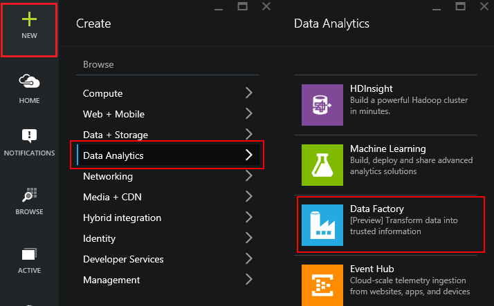
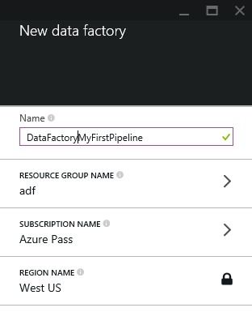
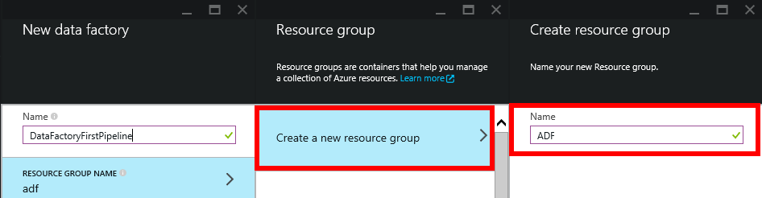
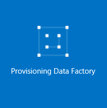
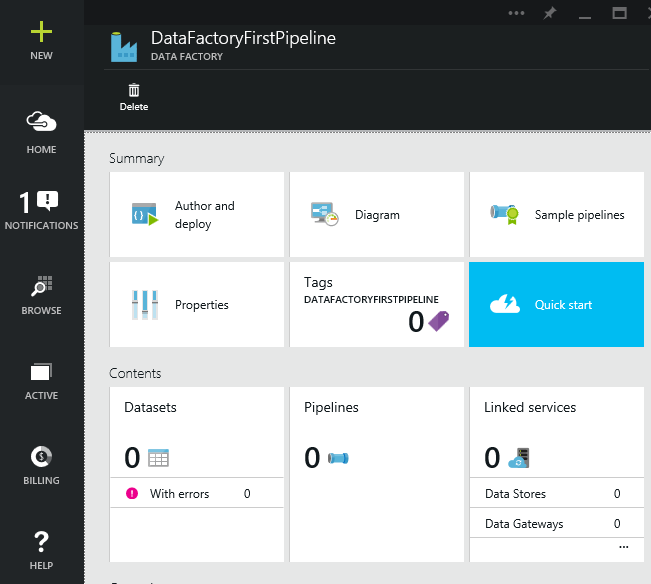

<properties
	pageTitle="Build your first pipeline using Azure Data Factory"
	description="This tutorial shows you how to create a sample data pipeline that transforms data using Azure HDInsight using Visual Studio"
	services="data-factory"
	documentationCenter=""
	authors="spelluru"
	manager="jhubbard"
	editor="monicar"/>

<tags
	ms.service="data-factory"
	ms.workload="data-services"
	ms.tgt_pltfrm="na"
	ms.devlang="na"
	ms.topic="article" 
	ms.date="08/18/2015"
	ms.author="spelluru"/>

# Build your first pipeline using Azure Data Factory
> [AZURE.SELECTOR]
- [Tutorial Overview](data-factory-build-your-first-pipeline.md)
- [Using Data Factory Editor](data-factory-build-your-first-pipeline-using-editor.md)
- [Using PowerShell](data-factory-build-your-first-pipeline-using-powershell.md)
- [Using Visual Studio](data-factory-build-your-first-pipeline-using-vs.md)

In this article, you will learn how to use the Visual Studio to create your first pipeline. This tutorial consists of the following steps:

1.	Creating the data factory
2.	Creating the linked services (data stores, computes) and datasets
3.	Creating the pipeline

This article does not provide a conceptual overview of the Azure Data Factory service. For a detailed overview of the service, see the [Introduction to Azure Data Factory](data-factory-introduction.md) article.

## Step 1: Creating the data factory

1.	After logging into the [Azure Preview Portal](http://portal.azure.com/), do the following:
	1.	Click **NEW** from the bottom-left corner. 
	2.	Click **Data analytics** in the **Create** blade.
	3.	Click **Data Factory** on the **Data analytics** blade.

		

2.	In the **New data factory** blade, enter **DataFactoryMyFirstPipeline** for the Name.

	

	> [AZURE.IMPORTANT] Azure Data Factory names are globally unique. You will need to prefix the name of the data factory with your name, to enable the successful creation of the factory. 
3.	If you have not created any resource group,  you will need to create a resource group. To do this:
	1.	Click on **RESOURCE GROUP NAME**.
	2.	Select **Create a new resource group** in the **Resource group** blade.
	3.	Enter **ADF** for the **Name** in the **Create resource group** blade.
	4.	Click **OK**.
	
		
4.	After you have selected the resource group, verify that you are using the correct subscription where you want the data factory to be created.
5.	Click **Create** on the **New data factory** blade.
6.	You will see the data factory being created in the **Startboard** of the Azure Preview Portal as follows:   

	
7. Congratulations! You have successfully created your first data factory. After the data factory has been created successfully, you will see the data factory page, which shows you the contents of the data factory. 	

	

In the subsequent steps, you will learn how to create the linked services, datasets and pipeline that you will use in this tutorial. 

## Walkthrough: Create and deploy Data Factory entities using Visual Studio 

### Pre-requisites

You must have the following installed on your computer: 
- Visual Studio 2013
- Download Azure SDK for Visual Studio 2013. Navigate to [Azure Download Page](http://azure.microsoft.com/downloads/) and click **VS 2013 install** in the **.NET** section.

### Create the Visual Studio project 
1. Launch **Visual Studio 2013**. Click **File**, point to **New**, and click **Project**. You should see the **New Project** dialog box.  
2. In the **New Project** dialog, select the **DataFactory** template, and click **Empty Data Factory Project**. If you don't see the DataFactory template, close Visual Studio, install Azure SDK for Visual Studio 2013, and reopen Visual Studio.  

	

3. Enter a **name** for the project, **location**, and a name for the **solution**, and click **OK**.

	

### Create linked services
In this step, you will link your Azure Storage account and an on-demand Azure HDInsight cluster to your data factory and then crate a dataset to represent the output data from Hive processing.

#### Create Azure Storage linked service

4. Right-click **Linked Services** in the solution explorer, point to **Add**, and click **New Item**.      
5. In the **Add New Item** dialog box, select **Azure Storage Linked Service** from the list, and click **Add**. 

	
 
3. Replace **accountname** and **accountkey** with the name of your Azure storage account and its key. 

	

4. Save the **AzureStorageLinkedService1.json** file.

#### Create Azure HDInsight linked service
Now, you will create a linked service for an on-demand HDInsight cluster that will be used to run the Hive script. 

1. In the **Solution Explorer**, right-click **Linked Services**, point to **Add**, and click **New Item**.
2. Select **HDInsight On Demand Linked Service**, and click **Add**. 
3. Replace the **JSON** with the following:

		{
		  "name": "HDInsightOnDemandLinkedService",
		  "properties": {
	        "type": "HDInsightOnDemandLinkedService",
            "version": "3.1",
	        "clusterSize": 1,
	        "timeToLive": "00:05:00",
	        "linkedServiceName": "AzureStorageLinkedService1"
		  }
		}
	
	The following table provides descriptions for the JSON properties used in the snippet:
	
	Property | Description
	-------- | -----------
	Version | This specifies that the version of the HDInsight created to be 3.1. 
	ClusterSize | This creates a one node HDInsight cluster. 
	TimeToLive | This specifies that the idle time for the HDInsight cluster, before it is deleted.
	JobsContainer | This specifies the name of the job container that will be created to store the logs that are generated by HDInsight
	linkedServiceName | This specifies the storage account that will be used to store the logs that are generated by HDInsight

4. Save the **HDInsightOnDemandLinkedService1.json** file.
 
### Create the output dataset
Now, you will create the output dataset to represent the data stored in the Azure Blob storage. 

1. In the **Solution Explorer**, right-click point to **Add**, and click **New Item**. 
2. Select **Azure Blob** from the list, and click **Add**. 
3. Replace the **JSON** in the editor with the following: In the JSON snippet, you are creating a dataset called **AzureBlobOutput**, and specifying the structure of the data that will be produced by the Hive script. In addition, you specify that the results are stored in the blob container called **data** and the folder called **partitioneddata**. The **availability** section specifies that the output dataset is produced on a monthly basis.
	
		{
		    "name": "AzureBlobOutput",
		    "properties": {
		        "location": {
		            "type": "AzureBlobLocation",
		            "folderPath": "data/partitioneddata",
		            "format": {
		                "type": "TextFormat",
		                "columnDelimiter": ","
		            },
		            "linkedServiceName": "AzureStorageLinkedService1"
		        },
		        "availability": {
		            "frequency": "Month",
		            "interval": 1
		        }
		    }
		}

4. Save the **AzureBlobLocation1.json** file.

### Creating your first pipeline
In this step, you will create your first pipeline.

1. In the **Solution Explorer**, right-click **Pipelines**, point to **Add**, and click **New Item.** 
2. Select **Hive Transformation Pipeline** from the list, and click **Add**. 
3. Replace the **JSON** with the following snippet and replace **storageaccountname** with the name of your storage account.

		{
		    "name": "MyFirstPipeline",
		    "properties": {
		    "description": "My first Azure Data Factory pipeline",
		    "activities": [
		      {
		            "type": "HDInsightActivity",
		            "transformation": {
		                    "scriptPath": "script/partitionweblogs.hql",
		                    "scriptLinkedService": "AzureStorageLinkedService1",
		                    "type": "Hive",
		                    "extendedProperties": {
		                        "partitionedtable": "wasb://data@<storageaccountname>.blob.core.windows.net/partitioneddata"
		                    }
		                },
		                "outputs": [   {  "name": "AzureBlobOutput"    }   ],
		                "policy": {  
		                    "concurrency": 1,
		                    "retry": 3
		                },
		                "name": "RunSampleHiveActivity",
		                "linkedServiceName": "HDInsightOnDemandLinkedService"
		            }
		        ],
		        "start": "2014-01-01",
		        "end": "2014-01-02"
		    }
		}
 
	In the JSON snippet, you are creating a pipeline that consists of a single activity that uses Hive to process Data on an HDInsight cluster.
	
	The Hive script file, **partitionweblogs.hql**, is stored in the Azure storage account (specified by the scriptLinkedService, called **StorageLinkedService**), and in a container called **script**.

	The **extendedProperties** section is used to specify the runtime settings that will be passed to the hive script as Hive configuration values (e.g ${hiveconf:PartitionedData}).

	The **start** and **end** properties of the pipeline specifies the active period of the pipeline.

	In the activity JSON, you specify that the Hive script runs on the compute specified by the linked service – **HDInsightOnDemandLinkedService**.
3. Save the **HiveActivity1.json** file.

### Add partitionweblogs.hql as a dependency 

1. Right-click Dependencies in the **Solution Explorer** window, point to **Add**, and click **Existing Item**.  
2. Navigate to the **C:\ADFGettingStarted** and select **partitionweblogs.hql** file, and click **Add**. 

When you publish the solution in the next step, the HQL file is uploaded to the scripts container in your blob storage.  

### Publish/deploy Data Factory entities
  
1. In the toolbar area, right-click and select **Data Factory** to enable the Data Factory toolbar if it is not already enabled. 
19. In the **Data Factory toolbar**, click the **drop-down box** to see all the data factories in your Azure subscription. If you see the **Sign-in to Visual Studio** dialog box: 
	20. Enter the **email account** associated with the Azure subscription in which you want to create the data factory, enter **Password**, and click **Sign-in**.
	21. Once the sign-in is successful, you should see all the data factories in the Azure subscription. In this tutorial, you will create a new data facotry.       
22. In the drop-down list, select **DataFactoryMyFirstPipeline**, and click **Publish** button to deploy/publish the linked services, datasets, and the pipeline.    

	

23. You should see the status of publishing in the **Data Factory Task List** window that is shown in the picture above. Confirm that publishing has succeeded.

## Use Server Explorer to review Data Factory entities

1. In **Visual Studio**, click **View** on the menu, and click **Server Explorer**.
2. In the Server Explorer window, expand **Azure** and expand **Data Factory**. If you see **Sign in to Visual Studio**, enter the **account** associated with your Azure subscription and click **Continue**. Enter **password**, and click **Sign in**. Visual Studio tries to get information about all Azure data factories in your subscription. You will see the status of this operation in the **Data Factory Task List** window.

	
3. You can right-click on a data factory, and select **Export Data Factory to New Project** to create a Visual Studio project based on an existing data factory.

	

## Update Data Factory tools for Visual Studio

To update Azure Data Factory tools for Visual Studio, do the following:

1. Click **Tools** on the menu and select **Extensions and Updates**.
2. Select **Updates** in the left pane and then select **Visual Studio Gallery**.
3. Select **Azure Data Factory tools for Visual Studio** and click **Update**. If you do not see this entry, you already have the latest version of the tools. 

See [Monitor datasets and pipeline](data-factory-monitor-manage-pipelines.md) for instructions on how to use the Azure Preview Portal to monitor the pipeline and datasets you have created in this tutorial.
 

## Next Steps
In this article, you have created a pipeline with a transformation activity (HDInsight Activity) that runs a Hive script on an on-demand HDInsight cluster. To see how to use a Copy Activity to copy data from an Azure Blob to Azure SQL, see [Tutorial: Copy data from an Azure blob to Azure SQL](data-factory-get-started.md).
  
