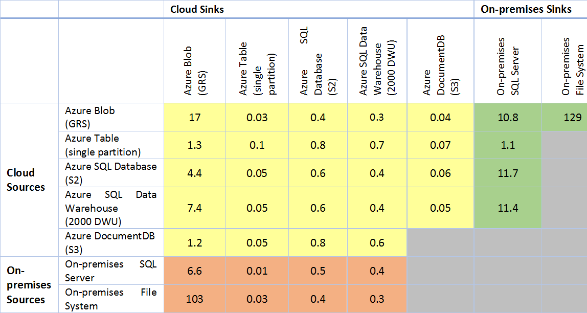

<properties 
	pageTitle="Copy Activity Performance & Tuning Guide" 
	description="Learn about key factors that impact performance of data movement in Azure Data Factory via the Copy Activity." 
	services="data-factory" 
	documentationCenter="" 
	authors="spelluru" 
	manager="jhubbard" 
	editor="monicar"/>

<tags 
	ms.service="data-factory" 
	ms.workload="data-services" 
	ms.tgt_pltfrm="na" 
	ms.devlang="na" 
	ms.topic="article" 
	ms.date="11/11/2015" 
	ms.author="spelluru"/>

# Copy Activity Performance & Tuning Guide
This article describes key factors that impact performance of data movement (Copy Activity) in Azure Data Factory. It also lists the observed performance during internal testing, and discusses various ways to optimize the performance of the Copy Activity.

## Overview of Data Movement in Azure Data Factory
The Copy Activity performs the data movement in Azure Data Factory and the activity is powered by a [globally available data movement service](data-factory-data-movement-activities.md#global) that can copy data between [various data stores](data-factory-data-movement-activities.md#supported-data-stores-for-copy-activity) in a secure, reliable, scalable and performant way. The data movement service automatically chooses the most optimal region to perform the data movement operation based on the location of the source and sink data stores. Currently the region closest to the sink data store is used.

Let’s understand how this data movement occurs in different scenarios. 

### Copying data between two cloud data stores
When both the source and sink (destination) data stores reside in the cloud, the Copy Activity goes through the following stages to copy/move data from the source to the sink. 

1.	Reads data from source data store
2.	Performs serialization/deserialization, compression/decompression, column mapping, and type conversion based on the configurations of input dataset, output dataset and the copy activity 
3.	Writes data to the destination data store

**Note:** Dotted line shapes (compression, column mapping, etc.) are capabilities which may or may not be leveraged in your use case.

 
### Copying data between an on-premises data store and a cloud data store
To [move data between an on-premises data store and a cloud data store](data-factory-move-data-between-onprem-and-cloud.md), you will need to install the Data Management Gateway, which is an agent that enables hybrid data movement and processing, on your on-premises machine. In this scenario, the serialization/deserialization, compression/decompression, column mapping, and type conversion based on the configurations of input dataset, output dataset and the copy activity are performed by the Data Management Gateway.

## Performance Tuning Steps 
The typical steps we suggest you to do to tune performance of your Azure Data Factory solution with Copy Activity are listed below. 

1.	**Establish a baseline.**
	During the development phase, test your pipeline with the copy activity against a representative sample data. You can leverage Azure Data Factory’s [slicing model](data-factory-scheduling-and-execution.md#time-series-datasets-and-data-slices) to limit the amount of data you are working with.
	
	Collect execution time and performance characteristics, by checking the output dataset’s “data slice” blade and “activity run details” blade in the Azure Preview portal, which shows the copy activity duration and size of data copied.
	
	

	You can compare the performance and configurations of your scenario to the copy activity’s [performance reference](#performance-reference) published below based on internal observations. 
2. **Performance Diagnosis and Optimization**	
	If the performance you observe is below your expectations, you need to identify performance bottlenecks and perform optimizations to remove or reduce the impact of bottlenecks. A full description of the performance diagnosis is beyond the scope of this article but we are listing a few common considerations here as follows.
	- [Source](#considerations-on-source)
	- [Sink](#considerations-on-sink)
	- [Serialization/Deserialization](#considerations-on-serializationdeserialization)
	- [Compression](#considerations-on-compression)
	- [Column mapping](#considerations-on-column-mapping)
	- [Data Management Gateway](#considerations-on-data-management-gateway)
	- [Other Considerations](#other-considerations)
3. **Expand the configuration to your entire data**
	Once you are satisfied with the execution results and performance, you can expand the dataset definition and pipeline active period to cover the entire data in picture.

## Performance Reference
> [AZURE.IMPORTANT] Disclaimer: Data below has been published for the sole purpose of guidance and planning. It assumes that bandwidth, hardware, configuration, etc. are among the best in their class. Use this as a reference only. The data movement throughput you observe will be affected by a range of variables. Refer to the sections later to learn about how you can possibly tune and achieve better performance for your data movement needs. These data will be updated when new features are available to boost the copy performance.

> [AZURE.NOTE] **Coming soon:** We are in the process of improving the base performance characteristics and you will see more and better throughput numbers in the above table shortly.

Points to note:

- Throughput is calculated using the following formula: [size of data read from source]/[copy activity run duration]
- [TPC-H](http://www.tpc.org/tpch/) data set has been leveraged to calculate numbers above.
- In case of Microsoft Azure data stores, source and sink are in the same Azure region.
- In case of the hybrid (on-premises to cloud or cloud to on-premises) data movement, the Data Management Gateway (single instance) was hosted on a machine with the following configuration
	| CPU | Memory | Network | Disk | 
	| :-- | :----- | :------ | :--- |
	| 32 Cores 2.20GHz Intel Xeon® E5-2660 v2 | 128GB | Inbound: 10Gbps; Outbound: 40Gbps | SSD |   

- The gateway is running on a different system than the source/sink

## Considerations on Source
### General
Ensure that the underlying data store is not overwhelmed by other workloads running on/against it including but not limited to copy activity.
  
For Microsoft data stores, refer to data store specific [monitoring and tuning topics](#appendix-data-store-performance-tuning-reference) which can help you understand the data store performance characteristics, minimize response times and maximize throughput.

## Considerations on Sink
## Considerations on Serialization/Deserialization
## Considerations on Compression
## Considerations on Column Mapping
## Considerations on Data Management Gateway
## Other Considerations
## Case Study – copy from on-prem SQL Server to Azure Blob
## Appendix – Data Store Performance Tuning Reference

