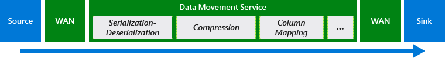
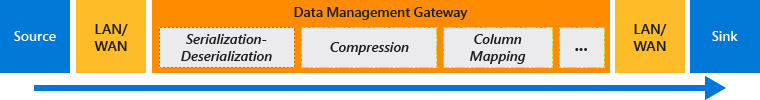
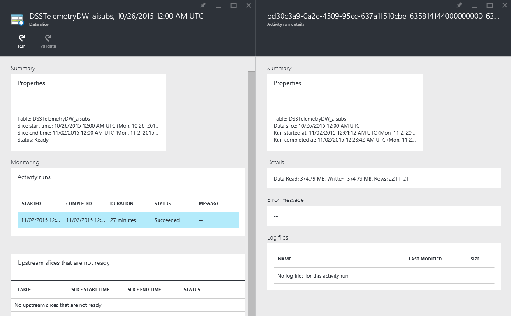

<properties
	pageTitle="Copy Activity Performance & Tuning Guide | Microsoft Azure"
	description="Learn about key factors that impact performance of data movement in Azure Data Factory via the Copy Activity."
	services="data-factory"
	documentationCenter=""
	authors="spelluru"
	manager="jhubbard"
	editor="monicar"/>

<tags
	ms.service="data-factory"
	ms.workload="data-services"
	ms.tgt_pltfrm="na"
	ms.devlang="na"
	ms.topic="article"
	ms.date="03/07/2016"
	ms.author="spelluru"/>

# Copy Activity Performance & Tuning Guide
This article describes key factors that impact performance of data movement (Copy Activity) in Azure Data Factory. It also lists the observed performance during internal testing, and discusses various ways to optimize the performance of the Copy Activity.

## Overview of Data Movement in Azure Data Factory
The Copy Activity performs the data movement in Azure Data Factory and the activity is powered by a [globally available data movement service](data-factory-data-movement-activities.md#global) that can copy data between [various data stores](data-factory-data-movement-activities.md#supported-data-stores-for-copy-activity) in a secure, reliable, scalable and performant way. The data movement service automatically chooses the most optimal region to perform the data movement operation based on the location of the source and sink data stores. Currently the region closest to the sink data store is used.

Let’s understand how this data movement occurs in different scenarios.

### Copying data between two cloud data stores
When both the source and sink (destination) data stores reside in the cloud, the Copy Activity goes through the following stages to copy/move data from the source to the sink.

1.	Reads data from source data store
2.	Performs serialization/deserialization, compression/decompression, column mapping, and type conversion based on the configurations of input dataset, output dataset and the copy activity
3.	Writes data to the destination data store

**Note:** Dotted line shapes (compression, column mapping, etc.) are capabilities which may or may not be leveraged in your use case.

### Copying data between an on-premises data store and a cloud data store
To [move data between an on-premises data store and a cloud data store](data-factory-move-data-between-onprem-and-cloud.md), you will need to install the Data Management Gateway, which is an agent that enables hybrid data movement and processing, on your on-premises machine. In this scenario, the serialization/deserialization, compression/decompression, column mapping, and type conversion based on the configurations of input dataset, output dataset and the copy activity are performed by the Data Management Gateway.

## Performance Tuning Steps
The typical steps we suggest you to do to tune performance of your Azure Data Factory solution with Copy Activity are listed below.

1.	**Establish a baseline.**
	During the development phase, test your pipeline with the copy activity against a representative sample data. You can leverage Azure Data Factory’s [slicing model](data-factory-scheduling-and-execution.md#time-series-datasets-and-data-slices) to limit the amount of data you are working with.

	Collect execution time and performance characteristics, by checking the output dataset’s “data slice” blade and “activity run details” blade in the Azure Preview portal, which shows the copy activity duration and size of data copied.

	

	You can compare the performance and configurations of your scenario to the copy activity’s [performance reference](#performance-reference) published below based on internal observations.
2. **Performance Diagnosis and Optimization**
	If the performance you observe is below your expectations, you need to identify performance bottlenecks and perform optimizations to remove or reduce the impact of bottlenecks. A full description of the performance diagnosis is beyond the scope of this article but we are listing a few common considerations here as follows.
	- [Source](#considerations-on-source)
	- [Sink](#considerations-on-sink)
	- [Serialization/Deserialization](#considerations-on-serializationdeserialization)
	- [Compression](#considerations-on-compression)
	- [Column mapping](#considerations-on-column-mapping)
	- [Data Management Gateway](#considerations-on-data-management-gateway)
	- [Other Considerations](#other-considerations)
3. **Expand the configuration to your entire data**
	Once you are satisfied with the execution results and performance, you can expand the dataset definition and pipeline active period to cover the entire data in picture.

## Performance Reference
> [AZURE.IMPORTANT] **Disclaimer:** Data below has been published for the sole purpose of guidance and high level planning only. It assumes that bandwidth, hardware, configuration, etc. are among the best in their class. Use this as a reference only. The data movement throughput you observe will be affected by a range of variables. Refer to the sections later to learn about how you can possibly tune and achieve better performance for your data movement needs. This data will be updated as and when performance boosting improvements and features are added.

> [AZURE.NOTE] **Coming soon:** We are in the process of improving the base performance characteristics and you will see more and better throughput numbers in the above table shortly.

Points to note:

- Throughput is calculated using the following formula: [size of data read from source]/[copy activity run duration]
- [TPC-H](http://www.tpc.org/tpch/) data set has been leveraged to calculate numbers above.
- In case of Microsoft Azure data stores, source and sink are in the same Azure region.
- In case of the hybrid (on-premises to cloud or cloud to on-premises) data movement, the Data Management Gateway (single instance) was hosted on a machine different than the on-premises data store, using the following configuration. Note with a single activity run being executed on the gateway, the copy operation only consumed a small portion of this machine's CPU/memory resource and network bandwidth.
	<table>
	<tr>
		<td>CPU</td>
		<td>32 Cores 2.20GHz Intel Xeon® E5-2660 v2</td>
	</tr>
	<tr>
		<td>Memory</td>
		<td>128GB</td>
	</tr>
	<tr>
		<td>Network</td>
		<td>Internet interface: 10Gbps; Intranet interface: 40Gbps</td>
	</tr>
	</table>

## Considerations on Source
### General
Ensure that the underlying data store is not overwhelmed by other workloads running on/against it including but not limited to copy activity.

For Microsoft data stores, refer to data store specific [monitoring and tuning topics](#appendix-data-store-performance-tuning-reference) which can help you understand the data store performance characteristics, minimize response times and maximize throughput.

### File-based data stores
*(Includes Azure Blob, Azure Data Lake, On-premises File System)*

- **Average file size and file count**: Copy activity transfers data file by file.  With the same amount of data to be moved, the overall throughput will be slower if the data consists of a large number of small files instead of a small number of larger files because of the bootstrap phase for each file. Therefore, if possible, combine small files into larger files to gain higher throughput.
- **File format and compression**: See the [considerations on serialization/deserialization](#considerations-on-serializationdeserialization) and [considerations on compression](#considerations-on-compression) sections for more ways to improve performance.
- Additionally, for the **on-premises File System** scenario where the use of **Data Management Gateway** is required, see the [Considerations on Gateway](#considerations-on-data-management-gateway) section.

### Relational data stores
*(Includes Azure SQL Database, Azure SQL Data Warehouse, SQL Server Database, Oracle Database, MySQL Database, DB2 Database, Teradata Database, Sybase Database, PostgreSQL Database)*

- **Data pattern**: Table schema has an impact on the copy throughput.  To copy the same amount of data, large row size will give you a better performance than small row size because the database can more efficiently retrieve fewer batches of data containing a fewer number of rows.
- **Query or stored procedure**: Optimize the logic of the query or stored procedure you specify in the copy activity source, so as to fetch the data more efficiently.
- Additionally, for **on-premises relational databases**, such as SQL Server and Oracle, where use of **Data Management Gateway** is required, see the [Considerations on Gateway](#considerations-on-data-management-gateway) section.

## Considerations on Sink

### General
Ensure that the underlying data store is not overwhelmed by other workloads running on/against it including but not limited to copy activity.  

For Microsoft data stores, refer to data store specific [monitoring and tuning topics](#appendix-data-store-performance-tuning-reference) which can help you understand the data store performance characteristics, minimize response times and maximize throughput.

### File-based data stores
*(Includes Azure Blob, Azure Data Lake, On-premise File System)*

- **Copy behavior**: If you are copying data from another file-based data store, copy activity provides three types of behavior via “copyBehavior” property: preserve hierarchy, flatten hierarchy, and merge files.  Either preserving or flattening hierarchy has little to no performance overhead, whereas merging files causes additional performance overhead.
- **File format and compression**: See the [considerations on serialization/deserialization](#considerations-on-serializationdeserialization) and [considerations on compression](#considerations-on-compression) sections for more ways to improve performance..
- For **Azure Blob**, we currently only support Block Blobs for optimized data transfer and throughput.
- Additionally, for **on-premises File System** scenarios where use of **Data Management Gateway** is required, see the [considerations on gateway](#considerations-on-data-management-gateway) section.

### Relational Data Stores
*(Includes Azure SQL Database, Azure SQL Data Warehouse, SQL Server Database)*

- **Copy behavior**: depending on the properties configured for “sqlSink”, the copy activity will write data into the destination database in different ways:
	- By default, the data movement service uses bulk copy API to insert data in append mode, which provides the best performance.
	- If you configure a stored procedure in sink, database will apply the data row by row instead of bulk load, so the performance will drop significantly.  If the size of data is large, when applicable consider switch to using “sqlWriterCleanupScript  ” property (see below) instead.
	- If you configure “sqlWriterCleanupScript” property, for each copy activity run, the service will trigger the script first, then use bulk copy API to insert the data. For example, to overwrite the whole table with the latest data, you can specify a script to delete all records first, before bulk loading the new data from source.
- **Data pattern and batch size**:
	- Table schema will have impact on the copy throughput.  To copy the same amount of data, large row size will give you a better performance than small row size because the database can more efficiently commit fewer batches of data.
	- Copy activity inserts data in a series of batches, where the number of rows contained in a batch can be set using “writeBatchSize” property.  If your data has rows of small size, you can set the “writeBatchSize” property with a higher value to benefit from fewer batch overhead and increase throughput. If the row size of your data is large, be careful on increasing the writeBatchSize – large value may lead to a copy failure due to overloading of the database.
- Additionally, for **on-premises relational databases**, such as SQL Server and Oracle, where use of **Data Management Gateway** is required, see the [considerations on gateway](#considerations-on-data-management-gateway) section.

### NoSQL stores
*(Including Azure Table, Azure DocumentDB)*

- For **Azure Table**:
	- **Partition**: Writing data into interleaved   partitions will dramatically degrade the performance. You can choose to order your source data by partition key so that the data will be inserted efficiently into partition after partition, or you can adjust the logic to write the data into a single partition.
- For **Azure DocumentDB**:
	- **Batch size**: “writeBatchSize” property indicates the number of parallel requests to DocumentDB service to create documents. You can expect a better performance when you increase “writeBatchSize”, because more parallel requests to DocumentDB are sent.  However, beware of the throttling when writing into DocumentDB (error message "Request rate is large").  Throttling can happen due to a number of factors, including size of documents, number of terms in documents, and indexing policy of target collection.  To achieve higher copy throughput, consider using a better collection (e.g. S3).

## Considerations on Serialization/Deserialization
Serialization and deserialization can happen when your input dataset or output dataset is a file.  Currently copy activity supports Avro and Text (for example CSV and TSV) data formats.

**Copy behaviors:**

- When copying files between file-based data stores:
	- When both input and output datasets are with the same or no file format settings, the data movement service will execute a binary copy without performing any serialization/deserialization. Therefore, you shall observe a better throughput compared to the scenario where source/sink file format settings are different.
	- When both input and output datasets are in Text format while only encoding type is different, the data movement service will only do encoding conversion without performing any serialization/deserialization, resulting in some performance overhead compared to binary copy.
	- When input and output datasets have different file formats or different configurations like delimiters, data movement service will de-serialize the source data to stream, transform, and then serialize into the desirable output format.  This will result in much more significant performance overhead compared to the previous scenarios.
- When copying files to/from a non-file based data store (say a file based store to a relational store), serialization or deserialization step will be required and this will result in a significant performance overhead.

**File format:** choice of file format can impact copy performance.  For example, Avro is a compact binary format that stores metadata with data, and has broad support in the Hadoop ecosystem for processing and querying.  However, Avro is more expensive for serialization/deserialization which results in lower copy throughput compared with Text format.  Choice of which file format to use along the processing flow should be made holistically, starting from what form the data is stored in source data stores or to be extracted from external systems, the best format for storage, analytical processing, and querying, and in what format should the data be exported into data marts for reporting and visualization tools.  Sometimes a file format that is sub-optimal for read and write performance can turn out to be well suited considering the overall analytical process.

## Considerations on Compression
When your input or output dataset is a file, you can configure the copy activity to perform compression or decompression as it writes data into the destination.  By enabling compression, you make a trade-off between I/O and CPU: compressing the data will cost extra compute resources but in return reduce network I/O and storage, which depending on your data could give you a boost in overall copy throughput.

**Codec:** GZIP, BZIP2 and Deflate compression types are supported. All three types can be consumed by Azure HDInsight for processing.  Each compression codec has its uniqueness. For example, BZIP2 has the lowest copy throughput, but you get the best Hive query performance given it can be split for processing; GZIP provides the most balanced option and is the most often used. You should choose the codec that is best suited for your end-to-end scenario.

**Level:** For each compression codec, you can choose from two options – fastest compressed and optimally compressed.  Fastest compressed option compresses the data as quickly as possible, even if the resulting file is not optimally compressed.  Optimally compressed option will spend more time on compression yielding the minimal amount of data.  You can test both options to see which provides better overall performance in your case.

**A consideration:** For copying large size of data between on-premises store and cloud, where the bandwidth corpnet and Azure is often the limiting factor, and you want both the input dataset and output dataset to be in uncompressed form, you can consider using an **interim Azure Blob** with compression.  More specifically, you can break a single copy activity into two copy activities: the first copy activity that copies from source to interim or staging blob in compressed form, and the second copy activity that copies compressed data from staging and decompresses while writing to sink.

## Considerations on Column Mapping
The “columnMappings” property in the copy activity can be used to map all or a subset of the input columns to the output columns. After reading the data from source, data movement service needs to perform column mapping on the data before writing it to the sink. This extra processing reduces copy throughput.

If your source data store is query-able, e.g. a relational store like Azure SQL/SQL Server or NoSQL store like Azure Table/Azure DocumentDB, you can consider pushing down the column filtering/re-ordering logic to the query property rather than using column mapping, which results in doing the projection during reading data from the source data store and is much more efficient.

## Considerations on Data Management Gateway
For gateway set-up recommendations, refer to [Considerations for using Data Management Gateway](data-factory-move-data-between-onprem-and-cloud.md#Considerations-for-using-Data-Management-Gateway).

**Gateway machine environment:** We recommend that you use a dedicated machine to host the Data Management Gateway. Use tools such as PerfMon to examine the CPU, memory and bandwidth usage during a copy operation on your gateway machine.  Switch to a more powerful machine if CPU, memory or network bandwidth becomes a bottleneck.

**Concurrent copy activity runs:** A single instance of Data Management Gateway can serve multiple copy activity runs at the same time. i.e. a gateway can execute a number of copy jobs concurrently (the number of concurrent jobs is calculated based on the gateway machine’s hardware configuration). Additional copy jobs get queued until they are picked up by gateway or until the job times out, whichever occurs first.  To avoid resource contention on the gateway, you can stage your activities’ schedule to reduce amount of copy jobs queued at once, or consider splitting the load onto multiple gateways.

## Other Considerations
If the size of data to be copied is quite large, you can adjust your business logic to further partition the data using Azure Data Factory’s slicing mechanism and schedule the copy activity more frequently to reduce the data size for each copy activity run.

Be cautious about the number of datasets and copy activities reaching out to the same data store at any given time. Large number of concurrent copy jobs can throttle a data store, and lead to degraded performance, copy job internal retries, and in some cases execution failures.

## Case Study – copy from on-prem SQL Server to Azure Blob
**Scenario:** A pipeline is built to copy data from an on premise SQL Server to Azure Blob in CSV format.  To make the copy faster, it is specified that the CSV files should be compressed in BZIP2 format.

**Test and analysis:** It is observed that throughput of the copy activity is less than 2MB/s, much slower than the performance benchmark.

**Performance analysis and tuning:**
To troubleshoot the performance issue, let’s firstly walkthrough how the data is processed and moved:

1.	**Read data:** gateway opens connection to SQL Server and sends the query. SQL Server responds by sending the data stream to gateway via intranet.
2.	Gateway **serializes** the data stream to CSV format, and **compresses** the data to a BZIP2 stream.
3.	**Write data:** gateway uploads the BZIP2 stream to Azure Blob via internet.

As you can see, the data is being processed and moved in a streaming sequential manner: SQL Server -> LAN -> Gateway -> WAN -> Azure Blob, **the overall performance is gated by the minimum throughput across the pipeline**.

One or more of the following factors could be the performance bottleneck:

1.	**Source:** SQL Server itself has low throughput due to heavy loads.
2.	**Data Management Gateway:**
	1.	**LAN:** gateway sits far from SQL Server with a low bandwidth connection
	2.	The **load on gateway machine** has hit its limitations to perform the following:
		1.	**Serialization:** serializing data stream to CSV has slow throughput
		2.	**Compression:** slow compression codec was chosen (e.g. BZIP2 which is of 2.8MB/s with Core i7)
	3.	**WAN:** low bandwidth between corpnet and Azure (e.g. T1= 1544kbps, T2=6312 kbps)
4.	**Sink:** Azure Blob has low throughput (though quite unlikely as its SLA guarantees a minimum of 60 MB/s).

In this case, BZIP2 data compression could be slowing the whole pipeline. Switching to GZIP compression codec may ease this bottleneck.

## Appendix – Data Store Performance Tuning Reference
Here are some performance monitoring and tuning references for a few of the supported data stores:

- Azure Storage (including Azure Blob and Azure Table): [Azure Storage scalability targets](../storage/storage-scalability-targets.md) and [Azure Storage Performance and Scalability Checklist](../storage//storage-performance-checklist.md)
- Azure SQL Database: You can [monitor the performance](../sql-database/sql-database-service-tiers.md#monitoring-performance) and check the Database Transaction Unit (DTU) percentage.
- Azure SQL Data Warehouse: Its capability is measured by Data Warehouse Units (DWUs). Refer to [Elastic performance and scale with SQL Data Warehouse](../sql-data-warehouse/sql-data-warehouse-performance-scale.md).
- Azure DocumentDB: [Performance level in DocumentDB](../documentdb/documentdb-performance-levels.md).
- On-premises SQL Server: [Monitor and Tune for Performance](https://msdn.microsoft.com/library/ms189081.aspx).
- On-premises File server: [Performance Tuning for File Servers](https://msdn.microsoft.com/library/dn567661.aspx)
