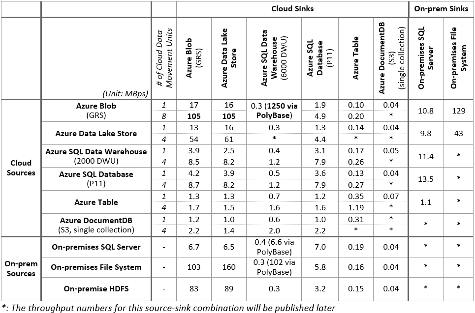
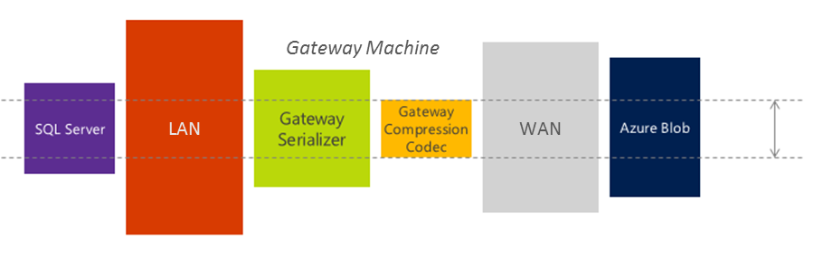

<properties
	pageTitle="Copy Activity Performance & Tuning Guide | Microsoft Azure"
	description="Learn about key factors that impact performance of data movement in Azure Data Factory via the Copy Activity."
	services="data-factory"
	documentationCenter=""
	authors="spelluru"
	manager="jhubbard"
	editor="monicar"/>

<tags
	ms.service="data-factory"
	ms.workload="data-services"
	ms.tgt_pltfrm="na"
	ms.devlang="na"
	ms.topic="article"
	ms.date="06/03/2016"
	ms.author="spelluru"/>

# Copy Activity Performance & Tuning Guide
This article describes key factors that impact performance of data movement (Copy Activity) in Azure Data Factory. It also lists the observed performance during internal testing, and discusses various ways to optimize the performance of the Copy Activity.

Using Copy Activity, you can get high data movement throughput as shown in the following examples: 

- Ingest 1 TB data into Azure Blob Storage from on-premises File System and Azure Blob Storage in less than 3 hours (i.e. @ 100 MBps)
- Ingest 1 TB data into Azure Data Lake Store from on-premises File System and Azure Blob Storage in less than 3 hours (i.e. @ 100 MBps) 
- Ingest 1 TB data into Azure SQL Data Warehouse from Azure Blob Storage in less than 3 hours (i.e. @ 100 MBps) 

See the following sections to learn more about the performance of Copy Activity and tuning tips to improve it further.

> [AZURE.NOTE] If you are not familiar with the Copy Activity in general, see [Data Movement Activities](data-factory-data-movement-activities.md) before reading through this article. 

## Performance Tuning Steps
The typical steps we suggest you to do to tune performance of your Azure Data Factory solution with Copy Activity are listed below.

1.	**Establish a baseline.**
	During the development phase, test your pipeline with the copy activity against a representative sample data. You can leverage Azure Data Factory’s [slicing model](data-factory-scheduling-and-execution.md#time-series-datasets-and-data-slices) to limit the amount of data you are working with.

	Collect execution time and performance characteristics by using the **Monitoring and Management App**: click **Monitor & Manage** tile on the home page of your data factory, select the **output dataset** in the tree view, and then select the copy activity run in the **Activity Windows** list. You should see the copy activity duration in the **Activity Windows** list and the size of the data that is copied and the throughput in the **Activity Window Explorer** window on the right. See [Monitor and manage Azure Data Factory pipelines using Monitoring and Management App](data-factory-monitor-manage-app.md) to learn more about the App. 
	
	

	You can compare the performance and configurations of your scenario to the copy activity’s [performance reference](#performance-reference) published below based on internal observations.
2. **Performance Diagnosis and Optimization**
	If the performance you observe is below your expectations, you need to identify performance bottlenecks and perform optimizations to remove or reduce the impact of bottlenecks. A full description of the performance diagnosis is beyond the scope of this article but we are listing a few common considerations here as follows.
	- [Source](#considerations-on-source)
	- [Sink](#considerations-on-sink)
	- [Serialization/Deserialization](#considerations-on-serializationdeserialization)
	- [Compression](#considerations-on-compression)
	- [Column mapping](#considerations-on-column-mapping)
	- [Data Management Gateway](#considerations-on-data-management-gateway)
	- [Other Considerations](#other-considerations)
	- [Parallel copy](#parallel-copy)
	- [Cloud Data Movement Units](#cloud-data-movement-units)    

3. **Expand the configuration to your entire data**
	Once you are satisfied with the execution results and performance, you can expand the dataset definition and pipeline active period to cover the entire data in picture.

## Performance Reference
> [AZURE.IMPORTANT] **Disclaimer:** Data below has been published for the sole purpose of guidance and high level planning only. It assumes that bandwidth, hardware, configuration, etc. are among the best in their class. Use this as a reference only. The data movement throughput you observe will be affected by a range of variables. Refer to the sections later to learn about how you can possibly tune and achieve better performance for your data movement needs. This data will be updated as and when performance boosting improvements and features are added.

Points to note:

- Throughput is calculated using the following formula: [size of data read from source]/[copy activity run duration]
- [TPC-H](http://www.tpc.org/tpch/) data set has been leveraged to calculate numbers above.
- In case of Microsoft Azure data stores, source and sink are in the same Azure region.
- **cloudDataMovementUnits** set to 1, and **parallelCopies** not specified.
- In case of the hybrid (on-premises to cloud or cloud to on-premises) data movement, the Data Management Gateway (single instance) was hosted on a machine different than the on-premises data store, using the following configuration. Note with a single activity run being executed on the gateway, the copy operation only consumed a small portion of this machine's CPU/memory resource and network bandwidth.
	<table>
	<tr>
		<td>CPU</td>
		<td>32 Cores 2.20GHz Intel Xeon® E5-2660 v2</td>
	</tr>
	<tr>
		<td>Memory</td>
		<td>128GB</td>
	</tr>
	<tr>
		<td>Network</td>
		<td>Internet interface: 10Gbps; Intranet interface: 40Gbps</td>
	</tr>
	</table>

## Parallel copy
One of the ways to enhance the throughput of a copy operation and reduce time for moving the data is to read data from source and/or write data to destination **in parallel within a Copy Activity run**.
 
Note that this setting is different from the **concurrency** property in the activity definition. The concurrency property determines the number of **concurrent Copy Activity runs** that run together at runtime to process data from different activity windows (1-2 AM, 2-3 AM, 3-4 AM, etc...). This is really helpful when performing a historical load. Whereas, the parallel copy capability being discussed here applies to a **single activity run**.

Let's look at a **sample scenario**: consider the following example where there are multiple slices from the past that need to be processed. The Data Factory service runs an instance of the Copy Activity (activity run) for each slice.

- data slice from 1st activity window (1 AM - 2 AM ) ==> Activity run 1
- data slice from 2nd activity window (2 AM - 3 AM) ==> Activity run 2
- data slice from 2nd activity window (3 AM - 4 AM) ==> Activity run 3
- and so on.

Having **concurrency** setting **2** in this example allows **Activity run 1** and **Activity run 2** to copy data from two activity windows **concurrently** to improve performance of the data movement. However, if there are multiple files associated with Activity run 1, one file is copied from the source to the destination at a time. 

### parallelCopies
You can use **parallelCopies** property to indicate the parallelism that you want the Copy Activity to use. In simple terms, think of this property as the maximum number of threads within a copy activity that read from your source and/or write to your sink data stores in parallel.

For each copy activity run, Azure Data Factory intelligently determines the number of parallel copies to use to copy data from the source data store to the destination data store. The default number of parallel copies it uses  depends on the types of source and sink:  

Source & Sink |	Default parallel copy count determined by service
------------- | -------------------------------------------------
Copying data between **file-based stores** (Azure Blob, Azure Data Lake, on-premises File System, on-premises HDFS) | Anywhere between **1 to 32**  based on **size of the files** and **number of cloud data movement units** (see the next section for definition) used for copying data between two cloud data stores (or) the physical configuration of the gateway machine used for hybrid copy (copying data to/from an on-premises data store)
Copying data from **any source data store to Azure Table** | 4
All other  source and sink pairs | 1

For majority of the cases, the default behavior should give you the best throughput. However, you may override the default value by specifying a value for the **parallelCopies** property in order to control the load on machines with your data stores or tune the copy performance. It needs to be between **1 and 32 (both inclusive)**. At run time, Copy Activity will choose a value that is less than or equal to the configured value to provide the best performance.

	"activities":[  
	    {
	        "name": "Sample copy activity",
	        "description": "",
	        "type": "Copy",
	        "inputs": [{ "name": "InputDataset" }],
	        "outputs": [{ "name": "OutputDataset" }],
	        "typeProperties": {
	            "source": {
	                "type": "BlobSource",
	            },
	            "sink": {
	                "type": "AzureDataLakeStoreSink"
	            },
	            "parallelCopies": 8
	        }
	    }
	]

Note the following:

- For copying data between file-based stores, parallelism happens at the file level; in other words, there is no chunking within a single file.  The actual number of parallel copies used for the copy operation at runtime will be no more than the number of files you have. If the copy behavior is mergeFile then parallelism will not be leveraged.
- When specifying a value for the parallelCopies property, do consider the increase in load it will bring to your source and sink data stores, as well as the gateway if it is a hybrid copy, especially when you have multiple activities or concurrent runs of the same activities running against the same data store. If you notice that the data store or the gateway is overwhelmed with the load, decrease the parallelCopies value to relieve the load.
- When copying data from non-file based stores to file based stores, parallelCopies property will be ignored even if specified and no parallelism would be leveraged.

> [AZURE.NOTE] To take advantage of the parallelCopies feature   when doing a hybrid copy, you must use the Data Management Gateway of version >=  1.11.

### Cloud Data Movement Units
The **cloud data movement unit** is a measure that represents the power (combination of CPU, memory and network resource allocation) of a single unit in the Azure Data Factory service that is used to perform a cloud-to-cloud copy operation. It does not come into play when doing a hybrid copy. By default, Azure Data Factory service uses a single cloud data movement unit to perform a single copy activity run. You can override this default by specifying a value for the **cloudDataMovementUnits** property. At this time, the cloudDataMovementUnits setting is **supported only** when copying data **between two Azure blob storages** or from an **Azure Blob storage to an Azure Data Lake store**, and it takes effect when you have multiple files to be copied that are of size >= 16 MB individually. 

If you are copying a number of relatively large files, setting a high value for the **parallelCopies** property may not improve performance due to resource limitations of a single cloud data movement unit. In such cases, you may want to use more cloud data movement units to copy huge amount of data with high throughput. To specify the number of cloud data movement units you want the Copy Activity to use, set a value for the **cloudDataMovementUnits** property as shown below:

	"activities":[  
	    {
	        "name": "Sample copy activity",
	        "description": "",
	        "type": "Copy",
	        "inputs": [{ "name": "InputDataset" }],
	        "outputs": [{ "name": "OutputDataset" }],
	        "typeProperties": {
	            "source": {
	                "type": "BlobSource",
	            },
	            "sink": {
	                "type": "AzureDataLakeStoreSink"
	            },
	            "cloudDataMovementUnits": 4
	        }
	    }
	]

The **allowed values** for the cloudDataMovementUnits property are: 1 (default), 2, 4, and 8. If you need more cloud data movement units for a higher throughput, please contact [Azure support](https://azure.microsoft.com/blog/2014/06/04/azure-limits-quotas-increase-requests/). The **actual number of cloud data movement units** used for the copy operation at runtime will be equal to or less than the configured value, depending on the number of files to be copied from source meeting the size criteria. 

> [AZURE.NOTE] parallelCopies  should be >= cloudDataMovementUnits if specified; and when cloudDataMovementUnits is greater than 1, the parallel data movement is spread across the cloudDataMovementUnits for that copy activity run and this boosts the throughout.

When copying multiple large files with **cloudDataMovementUnits** configured as 2, 4, and 8, the performance can reach 2x (2 times), 4x, and 7x of the reference numbers mentioned in the Performance Reference section. 

Refer to [sample use cases](#case-study---parallel-copy) here to better leverage the above 2 properties to enhance your data movement throughout.   
 
It is **important** to remember that you will be charged based on the total time of the copy operation. Hence, if a copy job used to take 1 hour with 1 cloud unit and now it takes 15 minutes with 4 cloud units then the overall bill would be almost the same. Here is another scenario: suppose, you are using 4 cloud units and the 1st cloud unit spends 10 minutes, 2nd one spends 10 minutes, 3rd one spends 5 minutes, and 4th one spends 5 minutes with in a copy activity run, you will be charged for the total copy (data movement) time, which is 10 + 10 + 5 + 5 = 30 minutes. Usage of **parallelCopies**  has no impact on billing. 

## Staged copy
When copying data from a source data store to a sink data store, you may use an Azure Blob storage as interim stagingstore. This staging capability is especially useful in the following cases: 

1.	**Sometimes it takes a while to perform hybrid data movement (i.e. on-premises data store to a cloud data store or vice versa) over a slow network connection.** To improve performance of such data movement, you can compress data on-premises so that it takes less time to move data over the wire to the staging data store in the cloud and then decompress data in staging stoe before loading it into the destination data store. 
2.	**You do not want to open ports other than 80 and 443 in your firewall due to IT policies.** For example, when copying data from an on-premises data store to an Azure SQL Database sink or Azure SQL Data Warehouse sink, outbound TCP communication on port 1433 for both Windows firewall and corporate firewall needs to be enabled. In such scenario, you can leverage the Data Management Gateway first copy data to a staging Azure Blob Storage, which happens over Http(s) i.e. over port 443, and then load the data into SQL Database or SQL Data Warehouse from the staging blob storage. In such a flow, port 1433 does not need to be enabled. 
3.	**Ingest data from various data stores into Azure SQL Data Warehouse via PolyBase.** Azure SQL Data Warehouse provides PolyBase as a high throughput mechanism to load large amount of data into SQL Data Warehouse. However, this requires the source data to be in Azure Blob Storage and meets some additional criteria. When loading data from a data store other than Azure Blob Storage, you can enable copying data via an interim staging Azure blob storage, in which case Azure Data Factory will perform the required transformations on the data to ensure it meets the requirements of PolyBase, and then leverage PolyBase to load data into SQL Data Warehouse. See [Use PolyBase to load data into Azure SQL Data Warehouse](data-factory-azure-sql-data-warehouse-connector.md#use-polybase-to-load-data-into-azure-sql-data-warehouse) for more details and samples.

### How the staged copy works
When you enable the staging feature, the data is first copied from source data store to staging data store (bring your own) and then copied from the staging data store to sink data store. Azure Data Factory will automatically manage the 2-stage flow for you and also clean up the temporary data from the staging storage after the data movement is complete. 

In the **cloud copy scenario** where both source and sink data stores are in the cloud and do not leveeage the Data Management Gateway, the copy operations are performed by **Azure Data Factory service**.

Whereas, in the **hybrid copy scenario**, where source is on-premises and sink is in the cloud, the data movement from the source data store to staging data store is performed by the **Data Management Gateway** and data movement from the staging data store to the sink data store is performed by **Azure Data Factory service**.

 

When you enable data movement using staging store, you can specify whether you want the data to be compressed prior to moving data from the source data store to interim/staging data store and decompressed before moving data from interim /staging data store to the sink data store.

Copying data from a cloud data store to an on-prem data store or between two on-prem data stores with staging store is not supported at this point and would be enabled shortly. 

### Configuration
You can configure **enableStaging** setting on Copy Activity to specify whether you want the data to be staged in an Azure blob storage before loading into a destination data store. When you set enableStaging to true, you need to  specify additional properties listed in the following table. And You need to create an Azure Storage or Azure Storage SAS linked service as staging if you don’t yet have one.

Property | Description | Default value | Required
--------- | ----------- | ------------ | --------
enableStaging | Specify whether you want to copy data via an interim staging store. | False | No
linkedServiceName | Specify the name of an [AzureStoage](data-factory-azure-blob-connector.md#azure-storage-linked-service) or [AzureStorageSas](data-factory-azure-blob-connector.md#azure-storage-sas-linked-service) linked service, which refers to your Azure Storage that will be used as an interim staging store.    Note that an Azure Storage with SAS (Shared Access Signature) cannot be used for  loading data into Azure SQL Data Warehouse via PolyBase. It can be used in all other scenarios. | N/A | Yes, when enableStaging is set to true. 
path | Specify the path in the Azure blob storage that will contain the staged data. If you do not provide a path, the service will  create a container to store the temp data.    You don’t need to specify path unless you are using Azure Storage with SAS or have strong requirement on where the temporary data should reside. | N/A | No
enableCompression | Specify whether data should be compressed when being moved from source data store to sink data store, to reduce the volume of data being transferred on the wire. | False | No

Here is a sample definition of a Copy Activity with the above properties: 

	"activities":[  
	{
		"name": "Sample copy activity",
		"type": "Copy",
		"inputs": [{ "name": "OnpremisesSQLServerInput" }],
		"outputs": [{ "name": "AzureSQLDBOutput" }],
		"typeProperties": {
			"source": {
				"type": "SqlSource",
			},
			"sink": {
				"type": "SqlSink"
			},
	    	"enableStaging": true,
			"stagingSettings": {
				"linkedServiceName": "MyStagingBlob",
				"path": "stagingcontainer/path",
				"enableCompression": true
			}
		}
	}
	]

### Billing impact
Note you will be charged based on the two stages of copy duration and its copy type respectively, which means:

- When using staging during a cloud copy (copying data from a cloud data store to another cloud data store, for example, Azure Data Lake to Azure SQL Data Warehouse), you will be charged as [sum of copy duration for step 1 and step 2] x [cloud copy unit price]
- When using staging during a hybrid copy (copying data from an on-premises data store to a cloud data store, for example, on-premise SQL Server database to Azure SQL Data Warehouse), you will be charged as [hybrid copy duration] x [hybrid copy unit price] + [cloud copy duration] x [cloud copy unit price]

## Considerations on Source
### General
Ensure that the underlying data store is not overwhelmed by other workloads running on/against it including but not limited to copy activity.

For Microsoft data stores, refer to data store specific [monitoring and tuning topics](#appendix-data-store-performance-tuning-reference) which can help you understand the data store performance characteristics, minimize response times and maximize throughput.

If you are copying data from **Azure Blob Storage** to **Azure SQL Data Warehouse**, consider enabling **PolyBase** to boost the performance. See [Use PolyBase to load data into Azure SQL Data Warehouse](data-factory-azure-sql-data-warehouse-connector.md###use-polybase-to-load-data-into-azure-sql-data-warehouse) for details.

### File-based data stores
*(Includes Azure Blob, Azure Data Lake, On-premises File System)*

- **Average file size and file count**: Copy activity transfers data file by file.  With the same amount of data to be moved, the overall throughput will be slower if the data consists of a large number of small files instead of a small number of larger files because of the bootstrap phase for each file. Therefore, if possible, combine small files into larger files to gain higher throughput.
- **File format and compression**: See the [considerations on serialization/deserialization](#considerations-on-serializationdeserialization) and [considerations on compression](#considerations-on-compression) sections for more ways to improve performance.
- Additionally, for the **on-premises File System** scenario where the use of **Data Management Gateway** is required, see the [Considerations on Gateway](#considerations-on-data-management-gateway) section.

### Relational data stores
*(Includes Azure SQL Database, Azure SQL Data Warehouse, SQL Server Database, Oracle Database, MySQL Database, DB2 Database, Teradata Database, Sybase Database, PostgreSQL Database)*

- **Data pattern**: Table schema has an impact on the copy throughput.  To copy the same amount of data, large row size will give you a better performance than small row size because the database can more efficiently retrieve fewer batches of data containing a fewer number of rows.
- **Query or stored procedure**: Optimize the logic of the query or stored procedure you specify in the copy activity source, so as to fetch the data more efficiently.
- Additionally, for **on-premises relational databases**, such as SQL Server and Oracle, where use of **Data Management Gateway** is required, see the [Considerations on Gateway](#considerations-on-data-management-gateway) section.

## Considerations on Sink

### General
Ensure that the underlying data store is not overwhelmed by other workloads running on/against it including but not limited to copy activity.  

For Microsoft data stores, refer to data store specific [monitoring and tuning topics](#appendix-data-store-performance-tuning-reference) which can help you understand the data store performance characteristics, minimize response times and maximize throughput.

If you are copying data from **Azure Blob Storage** to **Azure SQL Data Warehouse**, consider enabling **PolyBase** to boost the performance. See [Use PolyBase to load data into Azure SQL Data Warehouse](data-factory-azure-sql-data-warehouse-connector.md###use-polybase-to-load-data-into-azure-sql-data-warehouse) for details.

### File-based data stores
*(Includes Azure Blob, Azure Data Lake, On-premise File System)*

- **Copy behavior**: If you are copying data from another file-based data store, copy activity provides three types of behavior via “copyBehavior” property: preserve hierarchy, flatten hierarchy, and merge files.  Either preserving or flattening hierarchy has little to no performance overhead, whereas merging files causes additional performance overhead.
- **File format and compression**: See the [considerations on serialization/deserialization](#considerations-on-serializationdeserialization) and [considerations on compression](#considerations-on-compression) sections for more ways to improve performance..
- For **Azure Blob**, we currently only support Block Blobs for optimized data transfer and throughput.
- Additionally, for **on-premises File System** scenarios where use of **Data Management Gateway** is required, see the [considerations on gateway](#considerations-on-data-management-gateway) section.

### Relational Data Stores
*(Includes Azure SQL Database, Azure SQL Data Warehouse, SQL Server Database)*

- **Copy behavior**: depending on the properties configured for “sqlSink”, the copy activity will write data into the destination database in different ways:
	- By default, the data movement service uses bulk copy API to insert data in append mode, which provides the best performance.
	- If you configure a stored procedure in sink, database will apply the data row by row instead of bulk load, so the performance will drop significantly.  If the size of data is large, when applicable consider switch to using “sqlWriterCleanupScript  ” property (see below) instead.
	- If you configure “sqlWriterCleanupScript” property, for each copy activity run, the service will trigger the script first, then use bulk copy API to insert the data. For example, to overwrite the whole table with the latest data, you can specify a script to delete all records first, before bulk loading the new data from source.
- **Data pattern and batch size**:
	- Table schema will have impact on the copy throughput.  To copy the same amount of data, large row size will give you a better performance than small row size because the database can more efficiently commit fewer batches of data.
	- Copy activity inserts data in a series of batches, where the number of rows contained in a batch can be set using “writeBatchSize” property.  If your data has rows of small size, you can set the “writeBatchSize” property with a higher value to benefit from fewer batch overhead and increase throughput. If the row size of your data is large, be careful on increasing the writeBatchSize – large value may lead to a copy failure due to overloading of the database.
- Additionally, for **on-premises relational databases**, such as SQL Server and Oracle, where use of **Data Management Gateway** is required, see the [considerations on gateway](#considerations-on-data-management-gateway) section.

### NoSQL stores
*(Including Azure Table, Azure DocumentDB)*

- For **Azure Table**:
	- **Partition**: Writing data into interleaved   partitions will dramatically degrade the performance. You can choose to order your source data by partition key so that the data will be inserted efficiently into partition after partition, or you can adjust the logic to write the data into a single partition.
- For **Azure DocumentDB**:
	- **Batch size**: “writeBatchSize” property indicates the number of parallel requests to DocumentDB service to create documents. You can expect a better performance when you increase “writeBatchSize”, because more parallel requests to DocumentDB are sent.  However, beware of the throttling when writing into DocumentDB (error message "Request rate is large").  Throttling can happen due to a number of factors, including size of documents, number of terms in documents, and indexing policy of target collection.  To achieve higher copy throughput, consider using a better collection (e.g. S3).

## Considerations on Serialization/Deserialization
Serialization and deserialization can happen when your input dataset or output dataset is a file.  Currently copy activity supports Avro and Text (for example CSV and TSV) data formats.

**Copy behaviors:**

- When copying files between file-based data stores:
	- When both input and output datasets are with the same or no file format settings, the data movement service will execute a binary copy without performing any serialization/deserialization. Therefore, you shall observe a better throughput compared to the scenario where source/sink file format settings are different.
	- When both input and output datasets are in Text format while only encoding type is different, the data movement service will only do encoding conversion without performing any serialization/deserialization, resulting in some performance overhead compared to binary copy.
	- When input and output datasets have different file formats or different configurations like delimiters, data movement service will de-serialize the source data to stream, transform, and then serialize into the desirable output format.  This will result in much more significant performance overhead compared to the previous scenarios.
- When copying files to/from a non-file based data store (say a file based store to a relational store), serialization or deserialization step will be required and this will result in a significant performance overhead.

**File format:** choice of file format can impact copy performance.  For example, Avro is a compact binary format that stores metadata with data, and has broad support in the Hadoop ecosystem for processing and querying.  However, Avro is more expensive for serialization/deserialization which results in lower copy throughput compared with Text format.  Choice of which file format to use along the processing flow should be made holistically, starting from what form the data is stored in source data stores or to be extracted from external systems, the best format for storage, analytical processing, and querying, and in what format should the data be exported into data marts for reporting and visualization tools.  Sometimes a file format that is sub-optimal for read and write performance can turn out to be well suited considering the overall analytical process.

## Considerations on Compression
When your input or output dataset is a file, you can configure the copy activity to perform compression or decompression as it writes data into the destination.  By enabling compression, you make a trade-off between I/O and CPU: compressing the data will cost extra compute resources but in return reduce network I/O and storage, which depending on your data could give you a boost in overall copy throughput.

**Codec:** GZIP, BZIP2 and Deflate compression types are supported. All three types can be consumed by Azure HDInsight for processing.  Each compression codec has its uniqueness. For example, BZIP2 has the lowest copy throughput, but you get the best Hive query performance given it can be split for processing; GZIP provides the most balanced option and is the most often used. You should choose the codec that is best suited for your end-to-end scenario.

**Level:** For each compression codec, you can choose from two options – fastest compressed and optimally compressed.  Fastest compressed option compresses the data as quickly as possible, even if the resulting file is not optimally compressed.  Optimally compressed option will spend more time on compression yielding the minimal amount of data.  You can test both options to see which provides better overall performance in your case.

**A consideration:** For copying large size of data between on-premises store and cloud, where the bandwidth corpnet and Azure is often the limiting factor, and you want both the input dataset and output dataset to be in uncompressed form, you can consider using an **interim Azure Blob** with compression.  More specifically, you can break a single copy activity into two copy activities: the first copy activity that copies from source to interim or staging blob in compressed form, and the second copy activity that copies compressed data from staging and decompresses while writing to sink.

## Considerations on Column Mapping
The “columnMappings” property in the copy activity can be used to map all or a subset of the input columns to the output columns. After reading the data from source, data movement service needs to perform column mapping on the data before writing it to the sink. This extra processing reduces copy throughput.

If your source data store is query-able, e.g. a relational store like Azure SQL/SQL Server or NoSQL store like Azure Table/Azure DocumentDB, you can consider pushing down the column filtering/re-ordering logic to the query property rather than using column mapping, which results in doing the projection during reading data from the source data store and is much more efficient.

## Considerations on Data Management Gateway
For gateway set-up recommendations, refer to [Considerations for using Data Management Gateway](data-factory-move-data-between-onprem-and-cloud.md#Considerations-for-using-Data-Management-Gateway).

**Gateway machine environment:** We recommend that you use a dedicated machine to host the Data Management Gateway. Use tools such as PerfMon to examine the CPU, memory and bandwidth usage during a copy operation on your gateway machine.  Switch to a more powerful machine if CPU, memory or network bandwidth becomes a bottleneck.

**Concurrent copy activity runs:** A single instance of Data Management Gateway can serve multiple copy activity runs at the same time. i.e. a gateway can execute a number of copy jobs concurrently (the number of concurrent jobs is calculated based on the gateway machine’s hardware configuration). Additional copy jobs get queued until they are picked up by gateway or until the job times out, whichever occurs first.  To avoid resource contention on the gateway, you can stage your activities’ schedule to reduce amount of copy jobs queued at once, or consider splitting the load onto multiple gateways.

## Other Considerations
If the size of data to be copied is quite large, you can adjust your business logic to further partition the data using Azure Data Factory’s slicing mechanism and schedule the copy activity more frequently to reduce the data size for each copy activity run.

Be cautious about the number of datasets and copy activities reaching out to the same data store at any given time. Large number of concurrent copy jobs can throttle a data store, and lead to degraded performance, copy job internal retries, and in some cases execution failures.

## Case Study – copy from on-prem SQL Server to Azure Blob
**Scenario:** A pipeline is built to copy data from an on premise SQL Server to Azure Blob in CSV format.  To make the copy faster, it is specified that the CSV files should be compressed in BZIP2 format.

**Test and analysis:** It is observed that throughput of the copy activity is less than 2MB/s, much slower than the performance benchmark.

**Performance analysis and tuning:**
To troubleshoot the performance issue, let’s firstly walkthrough how the data is processed and moved:

1.	**Read data:** gateway opens connection to SQL Server and sends the query. SQL Server responds by sending the data stream to gateway via intranet.
2.	Gateway **serializes** the data stream to CSV format, and **compresses** the data to a BZIP2 stream.
3.	**Write data:** gateway uploads the BZIP2 stream to Azure Blob via internet.

As you can see, the data is being processed and moved in a streaming sequential manner: SQL Server -> LAN -> Gateway -> WAN -> Azure Blob, **the overall performance is gated by the minimum throughput across the pipeline**.

One or more of the following factors could be the performance bottleneck:

1.	**Source:** SQL Server itself has low throughput due to heavy loads.
2.	**Data Management Gateway:**
	1.	**LAN:** gateway sits far from SQL Server with a low bandwidth connection
	2.	The **load on gateway machine** has hit its limitations to perform the following:
		1.	**Serialization:** serializing data stream to CSV has slow throughput
		2.	**Compression:** slow compression codec was chosen (e.g. BZIP2 which is of 2.8MB/s with Core i7)
	3.	**WAN:** low bandwidth between corpnet and Azure (e.g. T1= 1544kbps, T2=6312 kbps)
4.	**Sink:** Azure Blob has low throughput (though quite unlikely as its SLA guarantees a minimum of 60 MB/s).

In this case, BZIP2 data compression could be slowing the whole pipeline. Switching to GZIP compression codec may ease this bottleneck.

## Case study - Parallel copy  

**Scenario I:** copy 1000 1MB files from on-premises File System to Azure Blob storage

**Analysis and performance tuning:** Suppose that you have installed the Data Management Gateway on a quad core machine, Data Factory will by default use 16 parallel copies to move files from File System to Azure Blob concurrently. This should result in good throughput. You may also specify the parallel copies count explicitly too if you wish. When copying a large number of small files, parallel copies will dramatically help throughput by utilizing the resources involved more effectively.

**Scenario II:** copy 20 blobs of 500MB each from Azure Blob storage to Azure Data Lake Store
Analysis and tune performance.

**Analysis and performance tuning:** For this scenario, by default, Data Factory will copy the data from Azure Blob to Azure Data Lake using single copy (parallelCopies as 1) and using single cloud data movement unit. The throughput you will observe would be close to what is stated in the [performance reference section](#performance-reference) above.   

When individual file size is greater than dozens of MBs and total volume is large, increasing parallelCopies will not result in better copy performance given the resource limitations of a single cloud data movement unit. Instead, you should specify more cloud data movement units to obtain more resources to perform the data movement. Do not specify a value for parallelCopies property so that Data Factory handles the parallelism for you. For this case, specifying cloudDataMovementUnits as 4 will result in a throughput of about 4 times. 

## Data Store Performance Tuning Reference
Here are some performance monitoring and tuning references for a few of the supported data stores:

- Azure Storage (including Azure Blob and Azure Table): [Azure Storage scalability targets](../storage/storage-scalability-targets.md) and [Azure Storage Performance and Scalability Checklist](../storage//storage-performance-checklist.md)
- Azure SQL Database: You can [monitor the performance](../sql-database/sql-database-service-tiers.md#monitoring-performance) and check the Database Transaction Unit (DTU) percentage.
- Azure SQL Data Warehouse: Its capability is measured by Data Warehouse Units (DWUs). Refer to [Elastic performance and scale with SQL Data Warehouse](../sql-data-warehouse/sql-data-warehouse-manage-compute-overview.md).
- Azure DocumentDB: [Performance level in DocumentDB](../documentdb/documentdb-performance-levels.md).
- On-premises SQL Server: [Monitor and Tune for Performance](https://msdn.microsoft.com/library/ms189081.aspx).
- On-premises File server: [Performance Tuning for File Servers](https://msdn.microsoft.com/library/dn567661.aspx)
