# Tutorial: Create a pipeline with Copy Activity using Azure portal
> [!div class="op_single_selector"]
> * [Overview and prerequisites](data-factory-copy-data-from-azure-blob-storage-to-sql-database.md)
> * [Copy Wizard](data-factory-copy-data-wizard-tutorial.md)
> * [Azure portal](data-factory-copy-activity-tutorial-using-azure-portal.md)
> * [Visual Studio](data-factory-copy-activity-tutorial-using-visual-studio.md)
> * [PowerShell](data-factory-copy-activity-tutorial-using-powershell.md)
> * [Azure Resource Manager template](data-factory-copy-activity-tutorial-using-azure-resource-manager-template.md)
> * [REST API](data-factory-copy-activity-tutorial-using-rest-api.md)
> * [.NET API](data-factory-copy-activity-tutorial-using-dotnet-api.md)
> 
> 

In this article, you learn how to use the [Azure portal](https://portal.azure.com) to create a data factory with a pipeline that copies data from an Azure blob storage to an Azure SQL database. If you are new to Azure Data Factory, read through the [Introduction to Azure Data Factory](data-factory-introduction.md) article before doing this tutorial.   

> [!NOTE]
> The data pipeline in this tutorial copies data from a source data store to a destination data store. It does not transform input data to produce output data. For a tutorial on how to transform data using Azure Data Factory, see [Tutorial: Build a pipeline to transform data using Hadoop cluster](data-factory-build-your-first-pipeline.md).
> 
> This tutorial uses only one activity of type: Copy. A pipeline can have more than one activity. And, you can chain two activities (run one activity after another) by setting the output dataset of one activity as the input dataset of the other activity. For more information, see [Scheduling and execution in Data Factory](data-factory-scheduling-and-execution.md#multiple-activities-in-a-pipeline). 

## Prerequisites
Complete prerequisites listed in the [tutorial prerequisites](data-factory-copy-data-from-azure-blob-storage-to-sql-database.md) article before performing this tutorial.


## Steps
Here are the steps you perform as part of this tutorial:

1. Create an Azure **data factory**. In this step, you create a data factory named ADFTutorialDataFactory. 
2. Create **linked services** in the data factory. In this step, you create two linked services: AzureStorageLinkedService and AzureSqlLinkedService. 
	
	The AzureStorageLinkedService links your Azure storage account to the data factory. This is the storage account in which you created a container and uploaded the data as part of the [prerequisites](data-factory-copy-data-from-azure-blob-storage-to-sql-database.md).   

	AzureSqlLinkedService links your Azure SQL database to the data factory. The data that is copied from the blob storage is stored in this database. This is sthe database you created as part of the [prerequisites](data-factory-copy-data-from-azure-blob-storage-to-sql-database.md)   
3. Create input and output **datasets** in the data factory. In the previous step, you created linked services to link your Azure storage and Azure SQL database data stores to your data factory. In this step, you define two datasets named InputDataset and OutputDataset that represent the input and output data that is stored in these data stores. 
	
	The Azure storage linked service specifies the connection string that Data Factory service uses at run time to connect to your Azure storage account. And, the input blob dataset specifies the container and the folder that contains the input data.  

	Similarly, the Azure SQL Database linked service specifies the connection string that Data Factory service uses at run time to connect to your Azure SQL database. And, the output SQL table dataset specifies the table in the database to which the data from the blob storage is copied.
4. Create a **pipeline** in the data factory. In this step, you create a pipeline named ADFTutorialPipeline that contains one activity of type: **Copy**.   
	
	The copy activity copies data from the a blob in the Azure blob storage to a table in the Azure SQL database. You can use a copy activity in a pipeline to copy data from a supported source to a supported destination. For a list of supported data stores, see [Data Movement Activities](data-factory-data-movement-activities.md#supported-data-stores-and-formats) article. 
5. Monitor the pipeline. In this step, you **monitor** the slices of input and output datasets by using Azure portal. 

> [!IMPORTANT]
> Complete the [prerequisites for the tutorial](data-factory-copy-data-from-azure-blob-storage-to-sql-database.md) if you haven't already done so.   

## Create data factory
A data factory can have one or more pipelines. A pipeline can have one or more activities in it. For example, a Copy Activity to copy data from a source to a destination data store and a HDInsight Hive activity to run Hive script to transform input data to product output data. Let's start with creating the data factory in this step.

1. After logging in to the [Azure portal](https://portal.azure.com/), click **New** on the left menu, click **data + Analytics**, and click **Data Factory**. 
   
   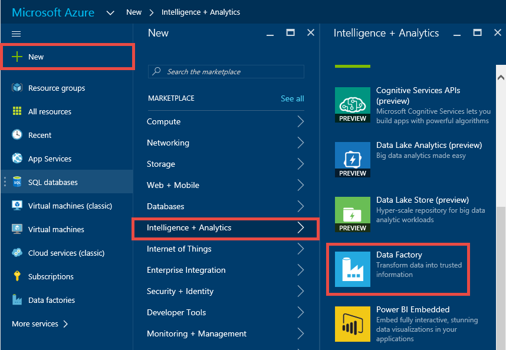    
2. In the **New data factory** blade:
   
   1. Enter **ADFTutorialDataFactory** for the **name**. 
      
         
      
       The name of the Azure data factory must be **globally unique**. If you receive the following error, change the name of the data factory (for example, yournameADFTutorialDataFactory) and try creating again. See [Data Factory - Naming Rules](data-factory-naming-rules.md) topic for naming rules for Data Factory artifacts.
      
           Data factory name “ADFTutorialDataFactory” is not available  
      
       
   2. Select your Azure **subscription** in which you want to create the data factory. 
   3. For the Resource Group, do one of the following steps:
      
      - Select **Use existing**, and select an existing resource group from the drop-down list. 
      - Select **Create new**, and enter the name of a resource group.   
         
          Some of the steps in this tutorial assume that you use the name: **ADFTutorialResourceGroup** for the resource group. To learn about resource groups, see [Using resource groups to manage your Azure resources](../azure-resource-manager/resource-group-overview.md).  
   4. Select the **location** for the data factory. Only regions supported by the Data Factory service are shown in the drop-down list.
   5. Select **Pin to dashboard**.     
   6. Click **Create**.
      
      > [!IMPORTANT]
      > To create Data Factory instances, you must be a member of the [Data Factory Contributor](../active-directory/role-based-access-built-in-roles.md#data-factory-contributor) role at the subscription/resource group level.
      > 
      > The name of the data factory may be registered as a DNS name in the future and hence become publically visible.                
      > 
      > 
3. On the dashboard, you see the following tile with status: Deploying data factory. 

	
4. After the creation is complete, you see the **Data Factory** blade as shown in the image.
   
   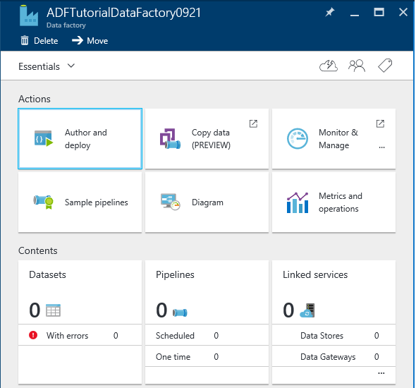

## Create linked services
You create linked services in a data factory to link your data stores and compute services to the data factory. In this tutorial, you don't use any compute service such as Azure HDInsight or Azure Data Lake Analytics. You use two data stores of type Azure Storage (source) and Azure SQL Database (destination). 

Therefore, you create two linked services: **AzureStorageLinkedService** and **AzureSqlLinkedService**. 

The AzureStorageLinkedService links your Azure storage account to the data factory. This is the storage account in which you created a container and uploaded the data as part of the [prerequisites](data-factory-copy-data-from-azure-blob-storage-to-sql-database.md).   

AzureSqlLinkedService links your Azure SQL database to the data factory. The data that is copied from the blob storage is stored in this database. This is sthe database you created as part of the [prerequisites](data-factory-copy-data-from-azure-blob-storage-to-sql-database.md)   

### Create Azure Storage linked service
In this step, you link your Azure storage account to your data factory. 

1. In the **Data Factory** blade, click **Author and deploy** tile.
   
   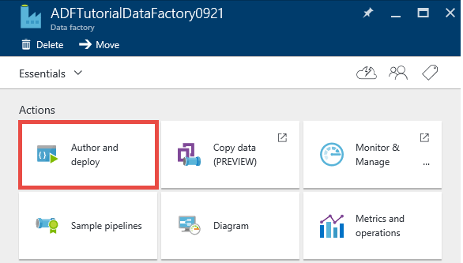 
2. You see the **Data Factory Editor** as shown in the following image: 

	
3. In the editor, click **New data store** button on the toolbar and select **Azure storage** from the drop-down menu. You should see the JSON template for creating an Azure storage linked service in the right pane. 
   
    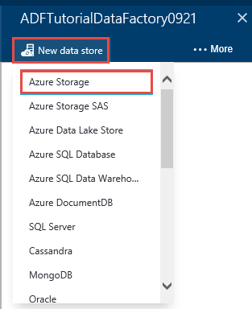    
3. Replace `<accountname>` and `<accountkey>` with the account name and account key values for your Azure storage account. 
   
        
4. Click **Deploy** on the toolbar. You should see the deployed **AzureStorageLinkedService** in the tree view now. 
   
    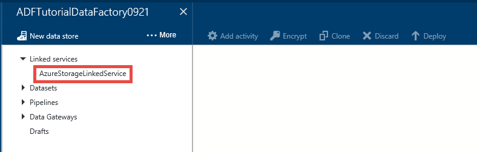

> [!NOTE]
> For more information about these JSON properties, see [Azure Blob Storage connector](data-factory-azure-blob-connector.md#linked-service-properties) article.

### Create a linked service for the Azure SQL Database
1. In the **Data Factory Editor**, click **New data store** button on the toolbar and select **Azure SQL Database** from the drop-down menu. You should see the JSON template for creating the Azure SQL linked service in the right pane.
2. Replace `<servername>`, `<databasename>`, `<username>@<servername>`, and `<password>` with names of your Azure SQL server, database, user account, and password. 
3. Click **Deploy** on the toolbar to create and deploy the **AzureSqlLinkedService**.
4. Confirm that you see **AzureSqlLinkedService** in the tree view under **Linked services**.  

> [!NOTE]
> For more information about these JSON properties, see [Azure SQL Database connector](data-factory-azure-sql-connector.md#linked-service-properties).


## Create datasets
In the previous step, you created linked services to link your Azure Storage account and Azure SQL database to your data factory. In this step, you define two datasets named **InputDataset** and **OutputDataset** that represent input and output data that is stored in the data stores referred by AzureStorageLinkedService and AzureSqlLinkedService respectively.

The Azure storage linked service specifies the connection string that Data Factory service uses at run time to connect to your Azure storage account. And, the input blob dataset (InputDataset) specifies the container and the folder that contains the input data.  

Similarly, the Azure SQL Database linked service specifies the connection string that Data Factory service uses at run time to connect to your Azure SQL database. And, the output SQL table dataset (OututDataset) specifies the table in the database to which the data from the blob storage is copied. 

### Create input dataset
In this step, you create a dataset named **InputDataset** that points to a blob file (emp.txt) in the root folder of a blob container (adftutorial) in the Azure Storage represented by the **AzureStorageLinkedService** linked service. If you don't specify a value for the fileName (or skip it), data from all blobs in the input folder are copied to the destination.   

1. In the **Editor** for the Data Factory, click **... More**, click **New dataset**, and click **Azure Blob storage** from the drop-down menu. 
   
    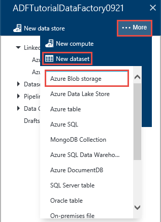
2. Replace JSON in the right pane with the following JSON snippet: 
   
	```JSON
    {
      "name": "InputDataset",
      "properties": {
        "structure": [
          {
            "name": "FirstName",
            "type": "String"
          },
          {
            "name": "LastName",
            "type": "String"
          }
        ],
        "type": "AzureBlob",
        "linkedServiceName": "AzureStorageLinkedService",
        "typeProperties": {
          "folderPath": "adftutorial/",
          "fileName": "emp.txt",
          "format": {
            "type": "TextFormat",
            "columnDelimiter": ","
          }
        },
        "external": true,
        "availability": {
          "frequency": "Hour",
          "interval": 1
        }
      }
    }
	```   

    The following table provides descriptions for the JSON properties used in the snippet:

	| Property | Description |
	|:--- |:--- |
	| type | The type property is set to **AzureBlob** because data resides in an Azure blob storage. |
	| linkedServiceName | Refers to the **AzureStorageLinkedService** you created earlier. |
	| folderPath | Specifies the blob **container** and the **folder** that contains input blobs. In this tutorial, adftutorial is the blob container and folder is the root folder. | 
	| fileName | This property is optional. If you omit this property, all the files from the folderPath are picked. In this tutorial, **emp.txt** is specified for the fileName, so only that file is picked up for processing. |
	| format -> type |The input file is in the text format, so we use **TextFormat**. |
	| columnDelimiter | The columns in the intput file are delimited by **comma character (`,`)**. |
	| frequency/interval | The frequency is set to **Hour** and interval is **1**, which means that the input slices are available **hourly**. In other words, the Data Factory service looks for input data every hour in the root folder of blob container (**adftutorial**) you specified. This occurs between the pipeline start and end times, not before or after these times.  |
	| external | This property is set to **true** if the data is not generated by this pipeline. The input data in this tutorial is in the emp.txt file, which is not generated by this pipeline, so we set the property to true. |

    For more information about these JSON properties, see [Azure Blob connector article](data-factory-azure-blob-connector.md).	
	
3. Click **Deploy** on the toolbar to create and deploy the **InputDataset** dataset. Confirm that you see the **InputDataset** in the tree view.

> [!NOTE]
> For more information about these JSON properties, see [Azure Blob Storage connector](data-factory-azure-blob-connector.md#dataset-properties) article.

### Create output dataset
In this part of the step, you create an output dataset named **OutputDataset**. This dataset points to a SQL table in the Azure SQL database represented by **AzureSqlLinkedService**. 

1. In the **Editor** for the Data Factory, click **... More**, click **New dataset**, and click **Azure SQL** from the drop-down menu. 
2. Replace JSON in the right pane with the following JSON snippet:

	```JSON   
    {
      "name": "OutputDataset",
      "properties": {
        "structure": [
          {
            "name": "FirstName",
            "type": "String"
          },
          {
            "name": "LastName",
            "type": "String"
          }
        ],
        "type": "AzureSqlTable",
        "linkedServiceName": "AzureSqlLinkedService",
        "typeProperties": {
          "tableName": "emp"
        },
        "availability": {
          "frequency": "Hour",
          "interval": 1
        }
      }
    }
	```   	

    The following table provides descriptions for the JSON properties used in the snippet:

	| Property | Description |
	|:--- |:--- |
	| type | The type property is set to **AzureSqlTable** because data is copied to a table in an Azure SQL database. |
	| linkedServiceName | Refers to the **AzureSqlLinkedService** you created earlier. |
	| tableName | Specified the **table** to which the data is copied. | 
	| frequency/interval | The frequency is set to **Hour** and interval is **1**, which means that the output slices are produced **hourly**. This occurs between the pipeline start and end times, not before or after these times.  |

	There are three columns – **ID**, **FirstName**, and **LastName** – in the emp table in the database. ID is an identity column, so you need to specify only **FirstName** and **LastName** here.
3. Click **Deploy** on the toolbar to create and deploy the **OutputDataset** dataset. Confirm that you see the **OutputDataset** in the tree view under **Datasets**. 

> [!NOTE]
> For more information about these JSON properties, see [Azure SQL connector article](data-factory-azure-sql-connector.md#dataset-properties).

## Create pipeline
In this step, you create a pipeline with a **Copy Activity** that uses **InputDataset** as an input and **OutputDataset** as an output.

Currently, output dataset is what drives the schedule. In this tutorial, output dataset is configured to produce a slice once an hour. The pipeline has a start time and end time that are one day apart, which is 24 hours. Therefore, 24 slices of output dataset are produced by the pipeline. 

1. In the **Editor** for the Data Factory, click **... More**, and click **New pipeline**. Alternatively, you can right-click **Pipelines** in the tree view and click **New pipeline**.
2. Replace JSON in the right pane with the following JSON snippet: 

	```JSON   
	{
	  "name": "ADFTutorialPipeline",
	  "properties": {
	    "description": "Copy data from a blob to Azure SQL table",
	    "activities": [
	      {
	        "name": "CopyFromBlobToSQL",
	        "type": "Copy",
	        "inputs": [
	          {
	            "name": "InputDataset"
	          }
	        ],
	        "outputs": [
	          {
	            "name": "OutputDataset"
	          }
	        ],
	        "typeProperties": {
	          "source": {
	            "type": "BlobSource"
	          },
	          "sink": {
	            "type": "SqlSink",
	            "writeBatchSize": 10000,
	            "writeBatchTimeout": "60:00:00"
	          }
	        },
	        "Policy": {
	          "concurrency": 1,
	          "executionPriorityOrder": "NewestFirst",
	          "retry": 0,
	          "timeout": "01:00:00"
	        }
	      }
	    ],
	    "start": "2016-07-12T00:00:00Z",
	    "end": "2016-07-13T00:00:00Z"
	  }
	} 
	```   
    
	Note the following points:
   
	- In the activities section, there is only one activity whose **type** is set to **Copy**. Currently, copy activity is the only data movement activity supported. For more information about the copy activity, see [data movement activities](data-factory-data-movement-activities.md). In Data Factory solutions, you can also use [data transformation activities](data-factory-data-transformation-activities.md).
	- Input for the activity is set to **InputDataset** and output for the activity is set to **OutputDataset**. 
	- In the **typeProperties** section, **BlobSource** is specified as the source type and **SqlSink** is specified as the sink type. For a complete list of data stores supported by the copy activity as sources and sinks, see [supported data stores](data-factory-data-movement-activities.md#supported-data-stores-and-formats). To learn how to use a specific supported data store as a source/sink, click the link in the table.  
     
	Replace the value of the **start** property with the current day and **end** value with the next day. You can specify only the date part and skip the time part of the date time. For example, "2016-02-03", which is equivalent to "2016-02-03T00:00:00Z"
     
	Both start and end datetimes must be in [ISO format](http://en.wikipedia.org/wiki/ISO_8601). For example: 2016-10-14T16:32:41Z. The **end** time is optional, but we use it in this tutorial. 
     
	If you do not specify value for the **end** property, it is calculated as "**start + 48 hours**". To run the pipeline indefinitely, specify **9999-09-09** as the value for the **end** property.
     
	In the preceding example, there are 24 data slices as each data slice is produced hourly.
3. Click **Deploy** on the toolbar to create and deploy the **ADFTutorialPipeline**. Confirm that you see the pipeline in the tree view. 
4. Now, close the **Editor** blade by clicking **X**. Click **X** again to see the **Data Factory** home page for the **ADFTutorialDataFactory**.

**Congratulations!** You have successfully created an Azure data factory with a pipeline to copy data from an Azure blob storage to an Azure SQL database. 

### View the data factory in a Diagram View
1. In the **Data Factory** blade, click **Diagram**.
   
    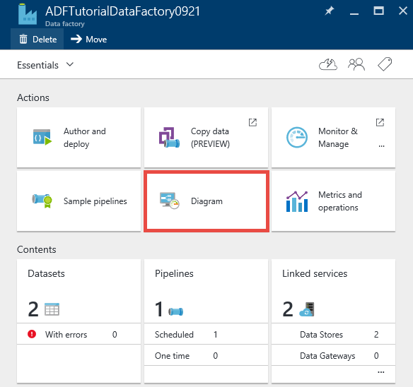
2. You should see the diagram similar to the following image: 
   
    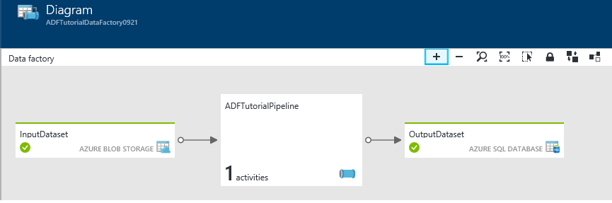
   
    You can zoom in, zoom out, zoom to 100%, zoom to fit, automatically position pipelines and tables, and show lineage information (highlights upstream and downstream items of selected items).  You can double-click an object (input/output table or pipeline) to see properties for it. 
3. Right-click **ADFTutorialPipeline** in the Diagram View and click **Open pipeline**. 
   
    
4. You should see the activities in the pipeline along with input and output datasets for the activities. In this tutorial, you have only one activity in the pipeline (Copy Activity) with InputDataset as input dataset and OutputDataset as output dataset.   
   
    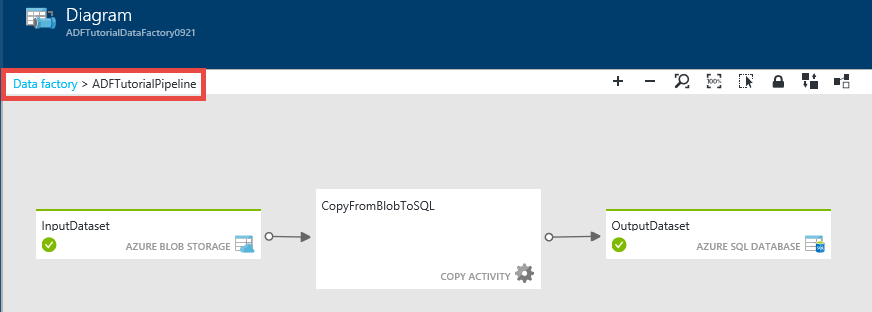
5. Click **Data factory** in the breadcrumb in the top-left corner to get back to the diagram view. The diagram view displays all the pipelines. In this example, you have only created one pipeline.   

## Monitor pipeline
In this step, you use the Azure portal to monitor what’s going on in an Azure data factory. 

### Monitor pipeline using Diagram View
1. Click **X** to close the **Diagram** view to see the Data Factory home page for the data factory. If you have closed the web browser, do the following steps: 
   1. Navigate to [Azure portal](https://portal.azure.com/). 
   2. Double-click **ADFTutorialDataFactory** on the **Startboard** (or) click **Data factories** on the left menu, and search for ADFTutorialDataFactory. 
2. You should see the count and names of tables and pipeline you created on this blade.
   
    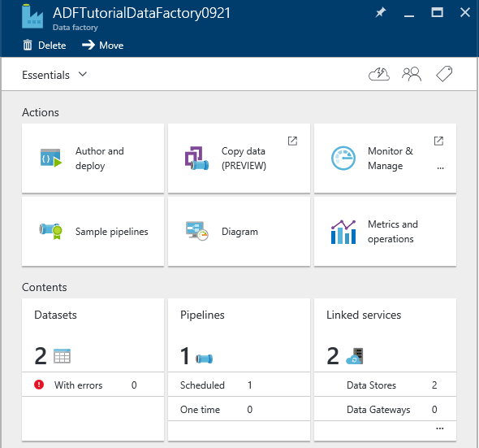
3. Now, click **Datasets** tile.
4. In the **Datasets** blade, click **InputDataset**. This dataset is the input dataset for **ADFTutorialPipeline**.
   
    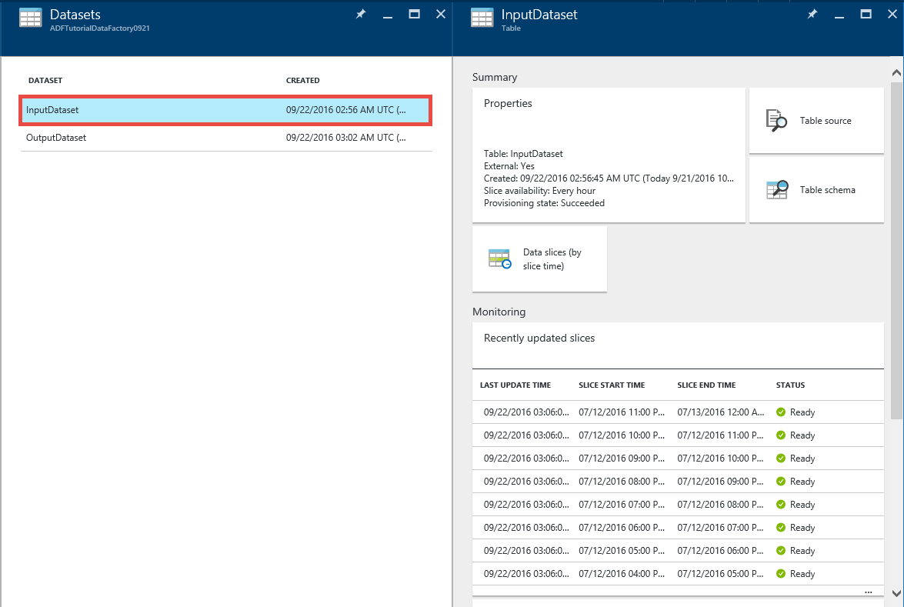   
5. Click **... (ellipsis)** to see all the data slices.
   
    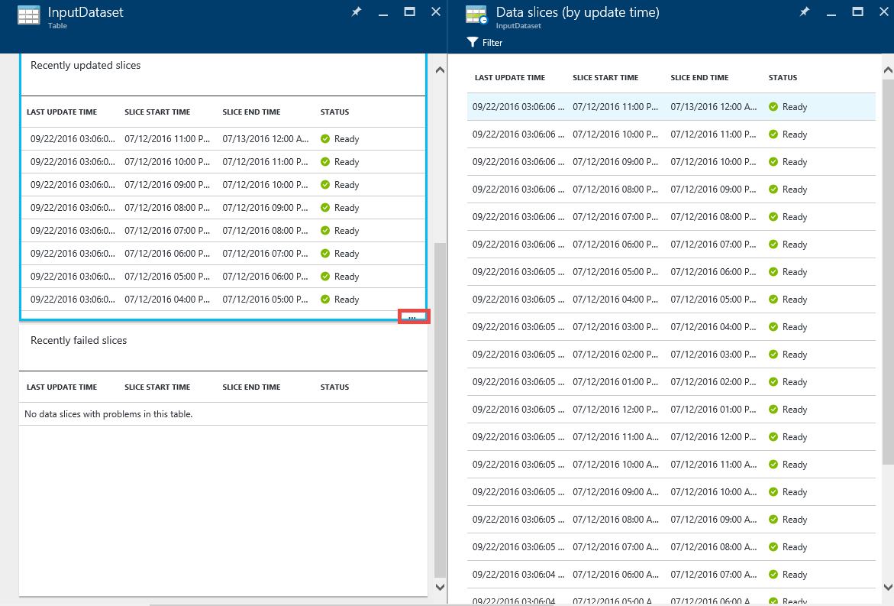  
   
    Notice that all the data slices up to the current time are **Ready** because the **emp.txt** file exists all the time in the blob container: **adftutorial\input**. Confirm that no slices show up in the **Recently failed slices** section at the bottom.
   
    Both **Recently updated slices** and **Recently failed slices** lists are sorted by the **LAST UPDATE TIME**. 
   
    Click **Filter** on the toolbar to filter the slices.  
   
    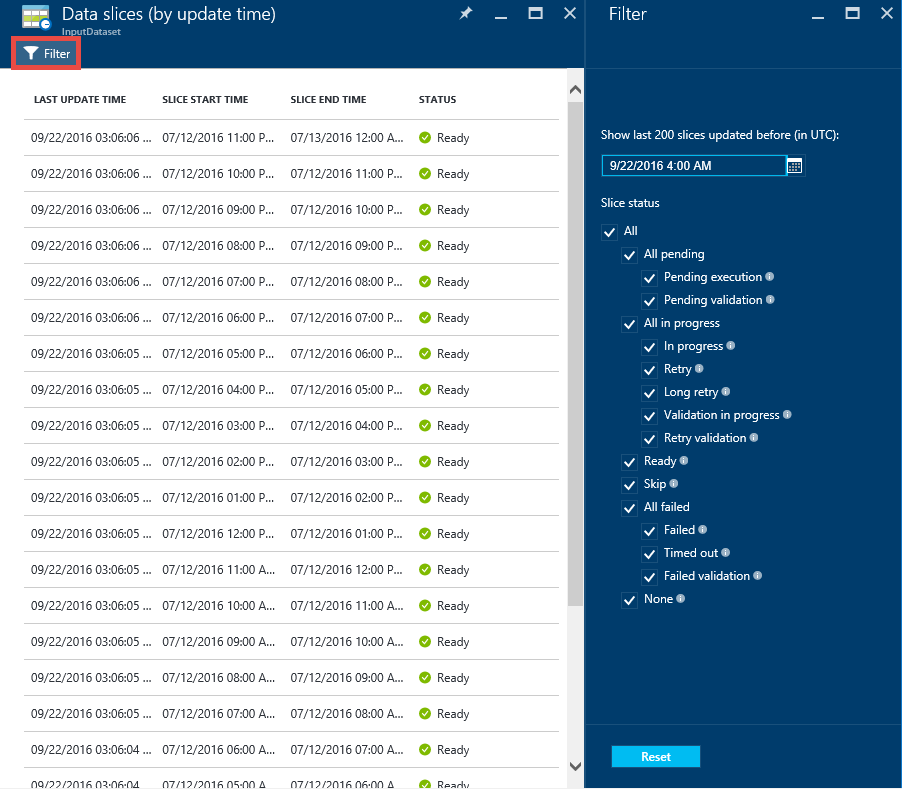
6. Close the blades until you see the **Datasets** blade. Click the **OutputDataset**. This dataset is the output dataset for **ADFTutorialPipeline**.
   
    
7. You should see the **OutputDataset** blade as shown in the following image:
   
     
8. Notice that the data slices up to the current time have already been produced and they are **Ready**. No slices show up in the **Problem slices** section at the bottom.
9. Click **… (Ellipsis)** to see all the slices.
   
    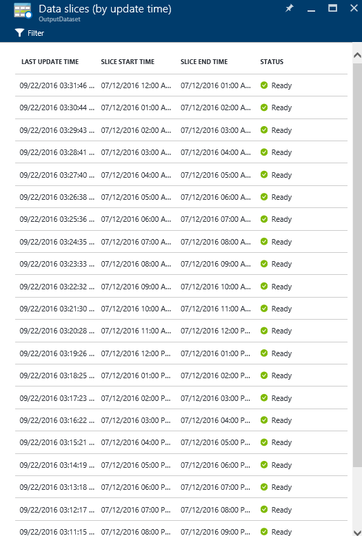
10. Click any data slice from the list and you should see the **Data slice** blade.
    
     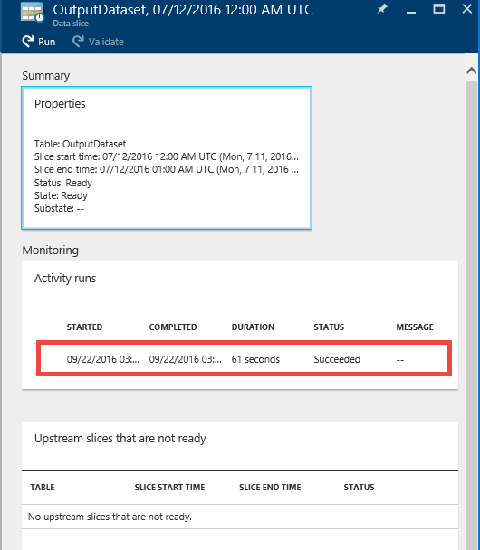
    
     If the slice is not in the **Ready** state, you can see the upstream slices that are not Ready and are blocking the current slice from executing in the **Upstream slices that are not ready** list.
11. In the **DATA SLICE** blade, you should see all activity runs in the list at the bottom. Click an **activity run** to see the **Activity run details** blade. 
    
    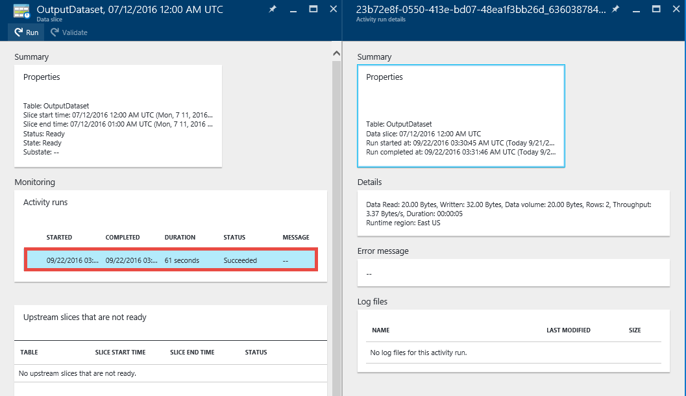
12. Click **X** to close all the blades until you get back to the home blade for the **ADFTutorialDataFactory**.
13. (optional) Click **Pipelines** on the home page for **ADFTutorialDataFactory**, click **ADFTutorialPipeline** in the **Pipelines** blade, and drill through input tables (**Consumed**) or output tables (**Produced**).
14. Launch **SQL Server Management Studio**, connect to the Azure SQL Database, and verify that the rows are inserted in to the **emp** table in the database.
    
    

### Monitor pipeline using Monitor & Manage App
You can also use Monitor & Manage application to monitor your pipelines. For detailed information about using this application, see [Monitor and manage Azure Data Factory pipelines using Monitoring and Management App](data-factory-monitor-manage-app.md).

1. Click **Monitor & Manage** tile on the home page for your data factory.
   
     
2. You should see **Monitor & Manage application**. Change the **Start time** and **End time** to include start (2016-07-12) and end times (2016-07-13) of your pipeline, and click **Apply**. 
   
    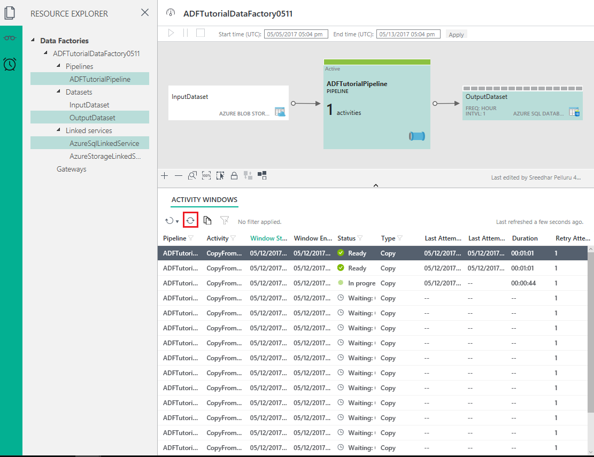 
3. Select an activity window in the **Activity Windows** list to see details about it. 
    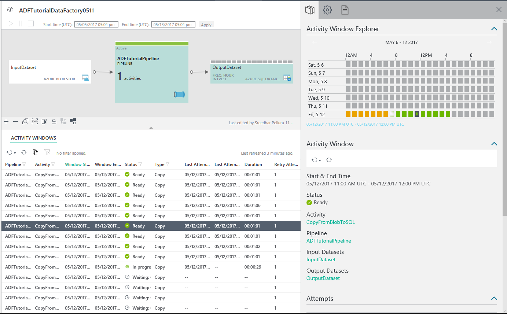

## Summary
In this tutorial, you created an Azure data factory to copy data from an Azure blob to an Azure SQL database. You used the Azure portal to create the data factory, linked services, datasets, and a pipeline. Here are the high-level steps you performed in this tutorial:  

1. Created an Azure **data factory**.
2. Created **linked services**:
   1. An **Azure Storage** linked service to link your Azure Storage account that holds input data.     
   2. An **Azure SQL** linked service to link your Azure SQL database that holds the output data. 
3. Created **datasets** that describe input data and output data for pipelines.
4. Created a **pipeline** with a **Copy Activity** with **BlobSource** as source and **SqlSink** as sink.  

## See Also
| Topic | Description |
|:--- |:--- |
| [Pipelines](data-factory-create-pipelines.md) |This article helps you understand pipelines and activities in Azure Data Factory. |
| [Datasets](data-factory-create-datasets.md) |This article helps you understand datasets in Azure Data Factory. |
| [Scheduling and execution](data-factory-scheduling-and-execution.md) |This article explains the scheduling and execution aspects of Azure Data Factory application model. |
