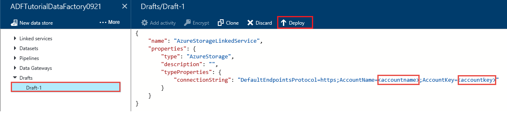
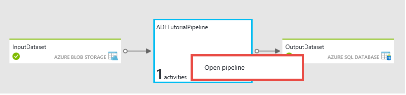

<properties 
	pageTitle="Tutorial: Create a pipeline with Copy Activity using Data Factory Editor" 
	description="In this tutorial, you will create an Azure Data Factory pipeline with a Copy Activity by using the Data Factory Editor in the Azure Portal." 
	services="data-factory" 
	documentationCenter="" 
	authors="spelluru" 
	manager="jhubbard" 
	editor="monicar"/>

<tags 
	ms.service="data-factory" 
	ms.workload="data-services" 
	ms.tgt_pltfrm="na" 
	ms.devlang="na" 
	ms.topic="get-started-article" 
	ms.date="08/01/2016" 
	ms.author="spelluru"/>

# Tutorial: Create a pipeline with Copy Activity using Data Factory Editor
> [AZURE.SELECTOR]
- [Tutorial Overview](data-factory-copy-data-from-azure-blob-storage-to-sql-database.md)
- [Using Data Factory Editor](data-factory-copy-activity-tutorial-using-azure-portal.md)
- [Using PowerShell](data-factory-copy-activity-tutorial-using-powershell.md)
- [Using Visual Studio](data-factory-copy-activity-tutorial-using-visual-studio.md)
- [Using Copy Wizard](data-factory-copy-data-wizard-tutorial.md)

This tutorial contains the following steps:

Step | Description
-----| -----------
[Create an Azure Data Factory](#create-data-factory) | In this step, you will create an Azure data factory named **ADFTutorialDataFactory**.  
[Create linked services](#create-linked-services) | In this step, you will create two linked services: **AzureStorageLinkedService** and **AzureSqlLinkedService**. The AzureStorageLinkedService links the Azure storage and AzureSqlLinkedService links the Azure SQL database to the ADFTutorialDataFactory. The input data for the pipeline resides in a blob container in the Azure blob storage and output data will be stored in a table in the Azure SQL database. Therefore, you add these two data stores as linked services to the data factory.      
[Create input and output datasets](#create-datasets) | In the previous step, you created linked services that refer to data stores that contain input/output data. In this step, you will define two data factory tables -- **EmpTableFromBlob** and **EmpSQLTable** -- that represent the input/output data that is stored in the data stores. For the EmpTableFromBlob, you will specify the blob container that contains a blob with the source data and for the EmpSQLTable, you will specify the SQL table that will store the output data. You will also specify other properties such as structure of the data, availability of the data, etc... 
[Create a pipeline](#create-pipeline) | In this step, you will create a pipeline named **ADFTutorialPipeline** in the ADFTutorialDataFactory. The pipeline will have a **Copy Activity** that copies input data from the Azure blob to the output Azure SQL table. The Copy Activity performs the data movement in Azure Data Factory and the activity is powered by a globally available service that can copy data between various data stores in a secure, reliable, and scalable way. See [Data Movement Activities](data-factory-data-movement-activities.md) article for details about the Copy Activity. 
[Monitor pipeline](#monitor-pipeline) | In this step, you will monitor slices of input and output tables by using Azure Portal.

> [AZURE.IMPORTANT] 
> Please go through the [Tutorial Overview](data-factory-copy-data-from-azure-blob-storage-to-sql-database.md) article and complete the pre-requisite steps before performing this tutorial.

## Create data factory
In this step, you use the Azure Portal to create an Azure data factory named **ADFTutorialDataFactory**.

1.	After logging into the [Azure Portal][azure-portal], click **NEW** from the bottom-left corner, select **Data analytics** in the **Create** blade, and click **Data Factory** in the **Data analytics** blade. 

	![New->DataFactory][image-data-factory-new-datafactory-menu]	

6. In the **New data factory** blade:
	1. Enter **ADFTutorialDataFactory** for the **name**. 
	
  		![New data factory blade][image-data-factory-getstarted-new-data-factory-blade]
	2. Click **RESOURCE GROUP NAME** and do the following:
		1. Click **Create a new resource group**.
		2. In the **Create resource group** blade, enter **ADFTutorialResourceGroup** for the **name** of the resource group, and click **OK**. 

			![Create Resource Group][image-data-factory-create-resource-group]

		Some of the steps in this tutorial assume that you use the name: **ADFTutorialResourceGroup** for the resource group. To learn about resource groups, see [Using resource groups to manage your Azure resources](../resource-group-overview.md).  
7. In the **New data factory** blade, notice that **Add to Startboard** is selected.
8. Click **Create** in the **New data factory** blade.

	The name of the Azure data factory must be globally unique. If you receive the error: **Data factory name “ADFTutorialDataFactory” is not available**, change the name of the data factory (for example, yournameADFTutorialDataFactory) and try creating again. See [Data Factory - Naming Rules](data-factory-naming-rules.md) topic for naming rules for Data Factory artifacts.  
	 
	![Data Factory name not available][image-data-factory-name-not-available]
	
	> [AZURE.NOTE] The name of the data factory may be registered as a DNS name in the future and hence become publically visible.  
	> 
	> To create Data Factory instances, you need to be a contributor/administrator of the Azure subscription

9. Click **NOTIFICATIONS** hub on the left and look for notifications from the creation process. Click **X** to close the **NOTIFICATIONS** blade if it is open. 
10. After the creation is complete, you will see the **DATA FACTORY** blade as shown below.

    ![Data factory home page][image-data-factory-get-stated-factory-home-page]

## Create linked services
Linked services link data stores or compute services to an Azure data factory. A data store can be an Azure Storage, Azure SQL Database or an on-premises SQL Server database.

In this step, you will create two linked services: **AzureStorageLinkedService** and **AzureSqlLinkedService**. AzureStorageLinkedService linked service links an Azure Storage Account and AzureSqlLinkedService links an Azure SQL database to the **ADFTutorialDataFactory**. You will create a pipeline later in this tutorial that copies data from a blob container in AzureStorageLinkedService to a SQL table in AzureSqlLinkedService.

### Create a linked service for the Azure storage account
1.	In the **DATA FACTORY** blade, click **Author and deploy** tile to launch the **Editor** for the data factory.

	![Author and Deploy Tile][image-author-deploy-tile] 

	 
5. In the **Editor**, click **New data store** button on the toolbar and select **Azure storage** from the drop down menu. You should see the JSON template for creating an Azure storage linked service in the right pane. 

	![Editor New data store button][image-editor-newdatastore-button]
    
6. Replace **accountname** and **accountkey** with the account name and account key values for your Azure storage account. 

	    
	
	See [JSON Scripting Reference](http://go.microsoft.com/fwlink/?LinkId=516971) for details about JSON properties.

6. Click **Deploy** on the toolbar to deploy the AzureStorageLinkedService. Confirm that you see the message **LINKED SERVICE CREATED SUCCESSFULLY** on the title bar.

	![Editor Blob Storage Deploy][image-editor-blob-storage-deploy]

### Create a linked service for the Azure SQL Database
1. In the **Data Factory Editor** , click **New data store** button on the toolbar and select **Azure SQL database** from the drop down menu. You should see the JSON template for creating the Azure SQL linked service in the right pane.

	![Editr Azure SQL Settings][image-editor-azure-sql-settings]

2. Replace **servername**, **databasename**, **username@servername**, and **password** with names of your Azure SQL server, database, user account, and  password. 
3. Click **Deploy** on the toolbar to create and deploy the AzureSqlLinkedService. 
   

## Create datasets
In the previous step, you created linked services **AzureStorageLinkedService** and **AzureSqlLinkedService** to link an Azure Storage account and Azure SQL database to the data factory: **ADFTutorialDataFactory**. In this step, you will define two data factory tables -- **EmpTableFromBlob** and **EmpSQLTable** -- that represent the input/output data that is stored in the data stores referred by AzureStorageLinkedService and AzureSqlLinkedService respectively. For  EmpTableFromBlob, you will specify the blob container that contains a blob with the source data and for EmpSQLTable, you will specify the SQL table that will store the output data. 

### Create input dataset 
A table is a rectangular dataset and has a schema. In this step, you will create a table named **EmpBlobTable** that points to a blob container in the Azure Storage represented by the **AzureStorageLinkedService** linked service.

1. In the **Editor** for the Data Factory, click **New dataset** button on the toolbar and click **Blob table** from the drop down menu. 
2. Replace JSON in the right pane with the following JSON snippet: 

		{
		  "name": "EmpTableFromBlob",
		  "properties": {
		    "structure": [
		      {
		        "name": "FirstName",
		        "type": "String"
		      },
		      {
		        "name": "LastName",
		        "type": "String"
		      }
		    ],
		    "type": "AzureBlob",
		    "linkedServiceName": "AzureStorageLinkedService",
		    "typeProperties": {
		      "folderPath": "adftutorial/",
			  "fileName": "emp.txt",
		      "format": {
		        "type": "TextFormat",
		        "columnDelimiter": ","
		      }
		    },
		    "external": true,
		    "availability": {
		      "frequency": "Hour",
		      "interval": 1
		    }
		  }
		}

		
     Note the following: 
	
	- dataset **type** is set to **AzureBlob**.
	- **linkedServiceName** is set to **AzureStorageLinkedService**. You had created this linked service in Step 2.
	- **folderPath** is set to the **adftutorial** container. You can also specify the name of a blob within the folder. Since you are not specifying the name of the blob, data from all blobs in the container is considered as an input data.  
	- format **type** is set to **TextFormat**
	- There are two fields in the text file – **FirstName** and **LastName** – separated by a comma character (**columnDelimiter**)	
	- The **availability** is set to **hourly** (**frequency** is set to **hour** and **interval** is set to **1** ), so the Data Factory service will look for input data every hour in the root folder in the blob container (**adftutorial**) you specified. 
	

	if you don't specify a **fileName** for an **input** **table**, all files/blobs from the input folder (**folderPath**) are considered as inputs. If you specify a fileName in the JSON, only the specified file/blob is considered asn input.
 
	If you do not specify a **fileName** for an **output table**, the generated files in the **folderPath** are named in the following format: Data.&lt;Guid\&gt;.txt (example: Data.0a405f8a-93ff-4c6f-b3be-f69616f1df7a.txt.).

	To set **folderPath** and **fileName** dynamically based on the **SliceStart** time, use the **partitionedBy** property. In the following example, folderPath uses Year, Month, and Day from from the SliceStart (start time of the slice being processed) and fileName uses Hour from the SliceStart. For example, if a slice is being produced for 2014-10-20T08:00:00, the folderName is set to wikidatagateway/wikisampledataout/2014/10/20 and the fileName is set to 08.csv. 

	  	"folderPath": "wikidatagateway/wikisampledataout/{Year}/{Month}/{Day}",
        "fileName": "{Hour}.csv",
        "partitionedBy": 
        [
        	{ "name": "Year", "value": { "type": "DateTime", "date": "SliceStart", "format": "yyyy" } },
            { "name": "Month", "value": { "type": "DateTime", "date": "SliceStart", "format": "MM" } }, 
            { "name": "Day", "value": { "type": "DateTime", "date": "SliceStart", "format": "dd" } }, 
            { "name": "Hour", "value": { "type": "DateTime", "date": "SliceStart", "format": "hh" } } 
        ],

	See [JSON Scripting Reference](http://go.microsoft.com/fwlink/?LinkId=516971) for details about JSON properties.

2. Click **Deploy** on the toolbar to create and deploy the **EmpTableFromBlob** table. Confirm that you see the **TABLE CREATED SUCCESSFULLY** message on the title bar of the Editor.

### Create output dataset
In this part of the step, you will create an output table named **EmpSQLTable** that points to a SQL table in the Azure SQL database that is represented by the **AzureSqlLinkedService** linked service. 

1. In the **Editor** for the Data Factory, click **New dataset** button on the toolbar and click **Azure SQL table** from the drop down menu. 
2. Replace JSON in the right pane with the following JSON snippet:

		{
		  "name": "EmpSQLTable",
		  "properties": {
		    "structure": [
		      {
		        "name": "FirstName",
		        "type": "String"
		      },
		      {
		        "name": "LastName",
		        "type": "String"
		      }
		    ],
		    "type": "AzureSqlTable",
		    "linkedServiceName": "AzureSqlLinkedService",
		    "typeProperties": {
		      "tableName": "emp"
		    },
		    "availability": {
		      "frequency": "Hour",
		      "interval": 1
		    }
		  }
		}

		
     Note the following: 
	
	* dataset **type** is set to **AzureSQLTable**.
	* **linkedServiceName** is set to **AzureSqlLinkedService** (you had created this linked service in Step 2).
	* **tablename** is set to **emp**.
	* There are three columns – **ID**, **FirstName**, and **LastName** – in the emp table in the database, but ID is an identity column, so you need to specify only **FirstName** and **LastName** here.
	* The **availability** is set to **hourly** (**frequency** set to **hour** and **interval** set to **1**).  The Data Factory service will generate an output data slice every hour in the **emp** table in the Azure SQL database.

3. Click **Deploy** on the toolbar to create and deploy the **EmpSQLTable** table.

## Create pipeline
In this step, you create a pipeline with a **Copy Activity** that uses **EmpTableFromBlob** as input and **EmpSQLTable** as output.

1. In the **Editor** for the Data Factory, click **New pipeline** button on the toolbar. Click **... (Ellipsis)** on the toolbar if you do not see the button. Alternatively, you can right-click **Pipelines** in the tree view and click **New pipeline**.

	![Editor New Pipeline Button][image-editor-newpipeline-button]
 
2. Replace JSON in the right pane with the following JSON snippet: 
		
		{
		  "name": "ADFTutorialPipeline",
		  "properties": {
		    "description": "Copy data from a blob to Azure SQL table",
		    "activities": [
		      {
		        "name": "CopyFromBlobToSQL",
		        "description": "Push Regional Effectiveness Campaign data to Azure SQL database",
		        "type": "Copy",
		        "inputs": [
		          {
		            "name": "EmpTableFromBlob"
		          }
		        ],
		        "outputs": [
		          {
		            "name": "EmpSQLTable"
		          }
		        ],
		        "typeProperties": {
		          "source": {
		            "type": "BlobSource"
		          },
		          "sink": {
		            "type": "SqlSink",
		            "writeBatchSize": 10000,
		            "writeBatchTimeout": "60:00:00"
		          }
		        },
		        "Policy": {
		          "concurrency": 1,
		          "executionPriorityOrder": "NewestFirst",
		          "retry": 0,
		          "timeout": "01:00:00"
		        }
		      }
		    ],
		    "start": "2015-07-12T00:00:00Z",
		    "end": "2015-07-13T00:00:00Z"
		  }
		} 

	Note the following:

	- In the activities section, there is only one activity whose **type** is set to **CopyActivity**.
	- Input for the activity is set to **EmpTableFromBlob** and output for the activity is set to **EmpSQLTable**.
	- In the **transformation** section, **BlobSource** is specified as the source type and **SqlSink** is specified as the sink type.

	Replace the value of the **start** property with the current day and **end** value with the next day. You can specify only the date part and skip the time part of the date time. For example, "2015-02-03", which is equivalent to "2015-02-03T00:00:00Z"
	
	Both start and end datetimes must be in [ISO format](http://en.wikipedia.org/wiki/ISO_8601). For example: 2014-10-14T16:32:41Z. The **end** time is optional, but we will use it in this tutorial. 
	
	If you do not specify value for the **end** property, it is calculated as "**start + 48 hours**". To run the pipeline indefinitely, specify **9999-09-09** as the value for the **end** property.
	
	In the example above, there will be 24 data slices as each data slice is produced hourly.
	
	See [JSON Scripting Reference](http://go.microsoft.com/fwlink/?LinkId=516971) for details about JSON properties.

4. Click **Deploy** on the toolbar to create and deploy the **ADFTutorialPipeline**. Confirm that you see the **PIPELINE CREATED SUCCESSFULLY** message.
5. Now, close the **Editor** blade by clicking **X**. Click **X** again to close the ADFTutorialDataFactory blade with the toolbar and tree view. If you see **your unsaved edits will be discarded** message, click **OK**.
6. You should be back to the **DATA FACTORY** blade for the **ADFTutorialDataFactory**.

**Congratulations!** You have successfully created an Azure data factory, linked services, tables, and a pipeline and scheduled the pipeline.   
 
### View the data factory in a Diagram View 
1. In the **DATA FACTORY** blade, click **Diagram**.

	![Data Factory Blade - Diagram Tile][image-datafactoryblade-diagramtile]

2. You should see the diagram similar to the following: 

	![Diagram view][image-data-factory-get-started-diagram-blade]

	You can zoom in, zoom out, zoom to 100%, zoom to fit, automatically position pipelines and tables, and show lineage information (highlights upstream and downstream items of selected items).  You can double-click on an object (input/output table or pipeline) to see properties for it. 
3. Right-click on **ADFTutorialPipeline** in the Diagram View and click **Open pipeline**. You should see the activities in the pipeline along with input and output datasets for the activities. In this tutorial, you have only one activity in the pipeline (Copy Activity) with EmpTableBlob as input dataset and EmpSQLTable as output dataset.   

	

4. Click **Data factory** in the breadcrumb in the top-left corner to get back to the diagram view. The diagram view displays all the pipelines. In this example, you have only created one pipeline.   
 

## Monitor pipeline
In this step, you will use the Azure Portal to monitor what’s going on in an Azure data factory. 

1. Navigate to [Azure Portal (Preview)][azure-portal] if you don't have it open. 
2. If the blade for **ADFTutorialDataFactory** is not open, open it by clicking **ADFTutorialDataFactory** on the **Startboard**. 
3. You should see the count and names of tables and pipeline you created on this blade.

	![home page with names][image-data-factory-get-started-home-page-pipeline-tables]

4. Now, click **Datasets** tile.
5. In the **Datasets** blade, click **EmpTableFromBlob**. This is the input table for the **ADFTutorialPipeline**.

	![Datasets with EmpTableFromBlob selected][image-data-factory-get-started-datasets-emptable-selected]   
5. Notice that the data slices up to the current time have already been produced and they are **Ready** because the **emp.txt** file exists all the time in the blob container: **adftutorial\input**. Confirm that no slices show up in the **Recently failed slices** section at the bottom.

	Both **Recently updated slices** and **Recently failed slices** lists are sorted by the **LAST UPDATE TIME**. The update time of a slice is changed in the following situations. 
    

	-  You update the status of the slice manually, for example, by using the **Set-AzureRmDataFactorySliceStatus** (or) by clicking **RUN** on the **SLICE** blade for the slice.
	-  The slice changes status due to an execution (e.g. a run started, a run ended and failed, a run ended and succeeded, etc).
 
	Click on the title of the lists or **... (ellipses)** to see the larger list of slices. Click **Filter** on the toolbar to filter the slices.  
	
	To view the data slices sorted by the slice start/end times instead, click **Data slices (by slice time)** tile.   

	![Data Slices by Slice Time][DataSlicesBySliceTime]   

6. Now, in the **Datasets** blade, click the **EmpSQLTable**. This is the output table for the **ADFTutorialPipeline**.

	![data sets blade][image-data-factory-get-started-datasets-blade]

	 
6. You should see the **EmpSQLTable** blade as shown below:

	![table blade][image-data-factory-get-started-table-blade]
 
7. Notice that the data slices up to the current time have already been produced and they are **Ready**. No slices show up in the **Problem slices** section at the bottom.
8. Click **… (Ellipsis)** to see all the slices.

	![data slices blade][image-data-factory-get-started-dataslices-blade]

9. Click on any data slice from the list and you should see the **DATA SLICE** blade.

	![data slice blade][image-data-factory-get-started-dataslice-blade]
  
	If the slice is not in the **Ready** state, you can see the upstream slices that are not Ready and are blocking the current slice from executing in the **Upstream slices that are not ready** list. 

11. In the **DATA SLICE** blade, you should see all activity runs in the list at the bottom. Click on an **activity run** to see the **ACTIVITY RUN DETAILS** blade. 

	![Activity Run Details][image-data-factory-get-started-activity-run-details]

	
12. Click **X** to close all the blades until you get back to the home blade for the **ADFTutorialDataFactory**.
14. (optional) Click **Pipelines** on the home page for **ADFTutorialDataFactory**, click **ADFTutorialPipeline** in the **Pipelines** blade, and drill through input tables (**Consumed**) or output tables (**Produced**).
15. Launch **SQL Server Management Studio**, connect to the Azure SQL Database, and verify that the rows are inserted into the **emp** table in the database.

	![sql query results][image-data-factory-get-started-sql-query-results]

## Summary 
In this tutorial, you created an Azure data factory to copy data from an Azure blob to an Azure SQL database. You used the Azure Portal to create the data factory, linked services, datasets, and a pipeline. Here are the high level steps you performed in this tutorial:  

1.	Created an Azure **data factory**.
2.	Created **linked services**:
	1. An **Azure Storage** linked service to link your Azure Storage account that holds input data. 	
	2. An **Azure SQL** linked service to link your Azure SQL database that holds the output data. 
3.	Created **datasets** which describe input data and output data for pipelines.
4.	Created a **pipeline** with a **Copy Activity** with **BlobSource** as source and **SqlSink** as sink.  

## See Also
| Topic | Description |
| :---- | :---- |
| [Data Movement Activities](data-factory-data-movement-activities.md) | This article provides detailed information about the Copy Activity you used in the tutorial. |
| [Scheduling and execution](data-factory-scheduling-and-execution.md) | This article explains the scheduling and execution aspects of Azure Data Factory application model. |
| [Pipelines](data-factory-create-pipelines.md) | This article will help you understand pipelines and activities in Azure Data Factory and how to leverage them to construct end-to-end data-driven workflows for your scenario or business. |
| [Datasets](data-factory-create-datasets.md) | This article will help you understand datasets in Azure Data Factory.
| [Monitor and manage pipelines using Monitoring App](data-factory-monitor-manage-app.md) | This article describes how to monitor, manage, and debug pipelines using the Monitoring & Management App. 

<!--Link references-->
[azure-purchase-options]: http://azure.microsoft.com/pricing/purchase-options/
[azure-member-offers]: http://azure.microsoft.com/pricing/member-offers/
[azure-free-trial]: http://azure.microsoft.com/pricing/free-trial/

[msdn-activities]: https://msdn.microsoft.com/library/dn834988.aspx
[msdn-linkedservices]: https://msdn.microsoft.com/library/dn834986.aspx
[data-factory-naming-rules]: https://msdn.microsoft.com/library/azure/dn835027.aspx

[azure-portal]: https://portal.azure.com/
[download-azure-powershell]: http://azure.microsoft.com/documentation/articles/install-configure-powershell
[sql-management-studio]: http://azure.microsoft.com/documentation/articles/sql-database-manage-azure-ssms/#Step2
[sql-cmd-exe]: https://msdn.microsoft.com/library/azure/ee336280.aspx

[use-custom-activities]: data-factory-use-custom-activities.md
[troubleshoot]: data-factory-troubleshoot.md
[data-factory-introduction]: data-factory-introduction.md
[data-factory-create-storage]: http://azure.microsoft.com/documentation/articles/storage-create-storage-account/#create-a-storage-account

[developer-reference]: http://go.microsoft.com/fwlink/?LinkId=516908
[cmdlet-reference]: http://go.microsoft.com/fwlink/?LinkId=517456

<!--Image references-->

[DataSlicesBySliceTime]: ./media/data-factory-copy-activity-tutorial-using-azure-portal/DataSlicesBySliceTime.png

[image-data-factory-getstarted-new-data-factory-blade]: ./media/data-factory-copy-activity-tutorial-using-azure-portal/getstarted-new-data-factory.png

[image-data-factory-get-stated-factory-home-page]: ./media/data-factory-copy-activity-tutorial-using-azure-portal/getstarted-data-factory-home-page.png

[image-author-deploy-tile]: ./media/data-factory-copy-activity-tutorial-using-azure-portal/getstarted-author-deploy-tile.png

[image-editor-newdatastore-button]: ./media/data-factory-copy-activity-tutorial-using-azure-portal/getstarted-editor-newdatastore-button.png

[image-editor-blob-storage-deploy]: ./media/data-factory-copy-activity-tutorial-using-azure-portal/getstarted-editor-blob-storage-deploy.png

[image-editor-azure-sql-settings]: ./media/data-factory-copy-activity-tutorial-using-azure-portal/getstarted-editor-azure-sql-settings.png

[image-editor-newpipeline-button]: ./media/data-factory-copy-activity-tutorial-using-azure-portal/getstarted-editor-newpipeline-button.png

[image-datafactoryblade-diagramtile]: ./media/data-factory-copy-activity-tutorial-using-azure-portal/getstarted-datafactoryblade-diagramtile.png

[image-data-factory-get-started-diagram-blade]: ./media/data-factory-copy-activity-tutorial-using-azure-portal/getstarted-diagram-blade.png

[image-data-factory-get-started-home-page-pipeline-tables]: ./media/data-factory-copy-activity-tutorial-using-azure-portal/getstarted-datafactory-home-page-pipeline-tables.png

[image-data-factory-get-started-datasets-blade]: ./media/data-factory-copy-activity-tutorial-using-azure-portal/getstarted-datasets-blade.png

[image-data-factory-get-started-table-blade]: ./media/data-factory-copy-activity-tutorial-using-azure-portal/getstarted-table-blade.png

[image-data-factory-get-started-dataslices-blade]: ./media/data-factory-copy-activity-tutorial-using-azure-portal/getstarted-dataslices-blade.png

[image-data-factory-get-started-dataslice-blade]: ./media/data-factory-copy-activity-tutorial-using-azure-portal/getstarted-dataslice-blade.png

[image-data-factory-get-started-sql-query-results]: ./media/data-factory-copy-activity-tutorial-using-azure-portal/getstarted-sql-query-results.png

[image-data-factory-get-started-datasets-emptable-selected]: ./media/data-factory-copy-activity-tutorial-using-azure-portal/DataSetsWithEmpTableFromBlobSelected.png

[image-data-factory-get-started-activity-run-details]: ./media/data-factory-copy-activity-tutorial-using-azure-portal/ActivityRunDetails.png

[image-data-factory-create-resource-group]: ./media/data-factory-copy-activity-tutorial-using-azure-portal/CreateNewResourceGroup.png

[image-data-factory-new-datafactory-menu]: ./media/data-factory-copy-activity-tutorial-using-azure-portal/NewDataFactoryMenu.png

[image-data-factory-name-not-available]: ./media/data-factory-copy-activity-tutorial-using-azure-portal/getstarted-data-factory-not-available.png
 