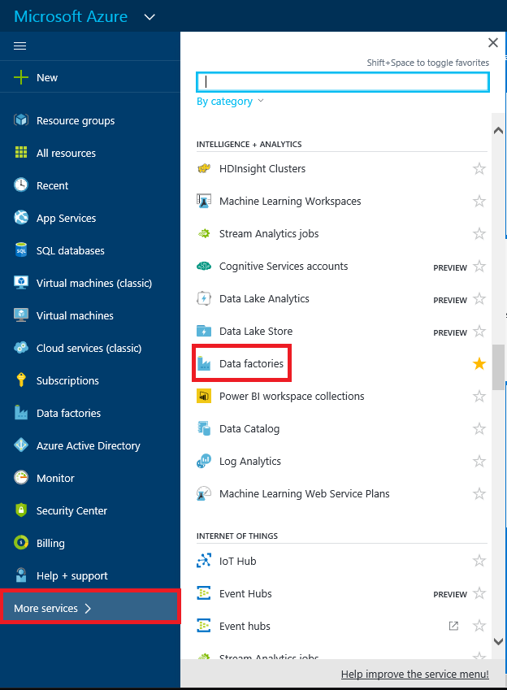
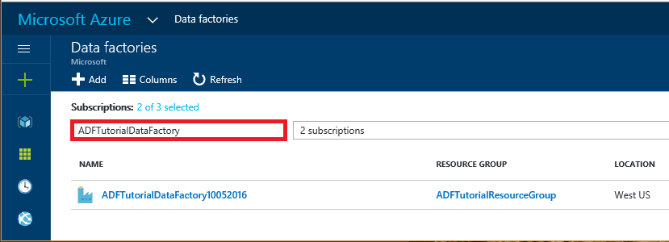
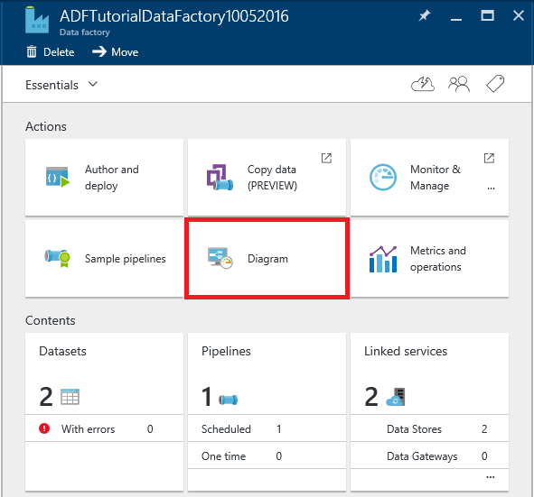
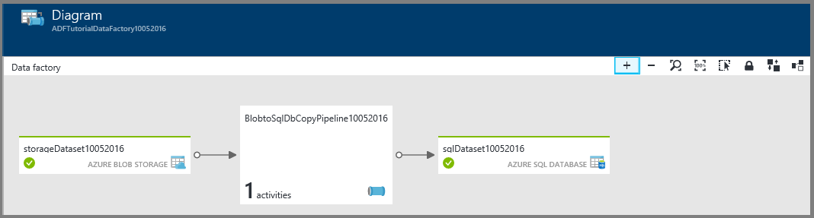
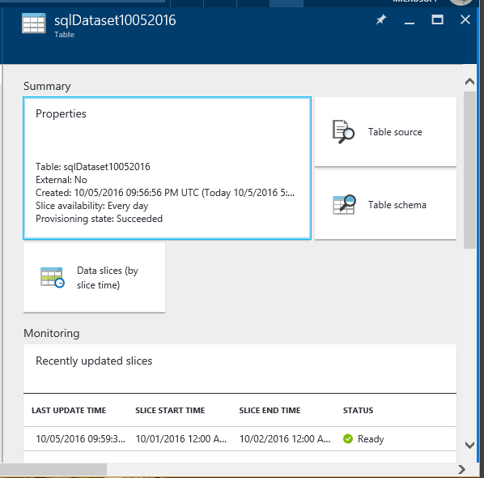

---
title: 'Tutorial: Create a pipeline using Resource Manager Template | Microsoft Docs'
description: In this tutorial, you create an Azure Data Factory pipeline with a Copy Activity by using Azure Resource Manager template.
services: data-factory
documentationcenter: ''
author: spelluru
manager: jhubbard
editor: monicar

ms.assetid: 1274e11a-e004-4df5-af07-850b2de7c15e
ms.service: data-factory
ms.workload: data-services
ms.tgt_pltfrm: na
ms.devlang: na
ms.topic: get-started-article
ms.date: 04/11/2017
ms.author: spelluru

---
# Tutorial: Create a pipeline with Copy Activity using Azure Resource Manager template
> [!div class="op_single_selector"]
> * [Overview and prerequisites](data-factory-copy-data-from-azure-blob-storage-to-sql-database.md)
> * [Copy Wizard](data-factory-copy-data-wizard-tutorial.md)
> * [Azure portal](data-factory-copy-activity-tutorial-using-azure-portal.md)
> * [Visual Studio](data-factory-copy-activity-tutorial-using-visual-studio.md)
> * [PowerShell](data-factory-copy-activity-tutorial-using-powershell.md)
> * [Azure Resource Manager template](data-factory-copy-activity-tutorial-using-azure-resource-manager-template.md)
> * [REST API](data-factory-copy-activity-tutorial-using-rest-api.md)
> * [.NET API](data-factory-copy-activity-tutorial-using-dotnet-api.md)
> 
> 

This tutorial shows you how to create and monitor an Azure data factory using an Azure Resource Manager template. The pipeline in the data factory copies data from Azure Blob Storage to Azure SQL Database.

> [!NOTE]
> The data pipeline in this tutorial copies data from a source data store to a destination data store. It does not transform input data to produce output data. For a tutorial on how to transform data using Azure Data Factory, see [Tutorial: Build a pipeline to transform data using Hadoop cluster](data-factory-build-your-first-pipeline.md).
> 
> You can chain two activities (run one activity after another) by setting the output dataset of one activity as the input dataset of the other activity. See [Scheduling and execution in Data Factory](data-factory-scheduling-and-execution.md) for detailed information. 

## Prerequisites
* Go through [Tutorial Overview and Prerequisites](data-factory-copy-data-from-azure-blob-storage-to-sql-database.md) and complete the **prerequisite** steps.
* Follow instructions in [How to install and configure Azure PowerShell](/powershell/azure/overview) article to install latest version of Azure PowerShell on your computer. In this tutorial, you use PowerShell to deploy Data Factory entities. 
* (optional) See [Authoring Azure Resource Manager Templates](../azure-resource-manager/resource-group-authoring-templates.md) to learn about Azure Resource Manager templates.

## In this tutorial
In this tutorial, you create a data factory with the following Data Factory entities:

| Entity | Description |
| --- | --- |
| Azure Storage linked service |Links your Azure Storage account to the data factory. Azure Storage is the source data store and Azure SQL database is the sink data store for the copy activity in the tutorial. It specifies the storage account that contains the input data for the copy activity. |
| Azure SQL Database linked service |Links your Azure SQL database to the data factory. It specifies the Azure SQL database that holds the output data for the copy activity. |
| Azure Blob input dataset |Refers to the Azure Storage linked service. The linked service refers to an Azure Storage account and the Azure Blob dataset specifies the container, folder, and file name in the storage that holds the input data. |
| Azure SQL output dataset |Refers to the Azure SQL linked service. The Azure SQL linked service refers to an Azure SQL server and the Azure SQL dataset specifies the name of the table that holds the output data. |
| Data pipeline |The pipeline has one activity of type Copy that takes the Azure blob dataset as an input and the Azure SQL dataset as an output. The copy activity copies data from an Azure blob to a table in the Azure SQL database. |

A data factory can have one or more pipelines. A pipeline can have one or more activities in it. There are two types of activities: [data movement activities](data-factory-data-movement-activities.md) and [data transformation activities](data-factory-data-transformation-activities.md). In this tutorial, you create a pipeline with one activity (copy activity).

 

The following section provides the complete Resource Manager template for defining Data Factory entities so that you can quickly run through the tutorial and test the template. To understand how each Data Factory entity is defined, see [Data Factory entities in the template](#data-factory-entities-in-the-template) section.

## Data Factory JSON template
The top-level Resource Manager template for defining a data factory is: 

```json
{
    "$schema": "http://schema.management.azure.com/schemas/2015-01-01/deploymentTemplate.json#",
    "contentVersion": "1.0.0.0",
    "parameters": { ...
    },
    "variables": { ...
    },
    "resources": [
        {
            "name": "[parameters('dataFactoryName')]",
            "apiVersion": "[variables('apiVersion')]",
            "type": "Microsoft.DataFactory/datafactories",
            "location": "westus",
            "resources": [
                { ... },
                { ... },
                { ... },
                { ... }
            ]
        }
    ]
}
```
Create a JSON file named **ADFCopyTutorialARM.json** in **C:\ADFGetStarted** folder with the following content:

```json
{
    "contentVersion": "1.0.0.0",
    "$schema": "http://schema.management.azure.com/schemas/2015-01-01/deploymentTemplate.json#",
    "parameters": {
      "storageAccountName": { "type": "string", "metadata": { "description": "Name of the Azure storage account that contains the data to be copied." } },
      "storageAccountKey": { "type": "securestring", "metadata": { "description": "Key for the Azure storage account." } },
      "sourceBlobContainer": { "type": "string", "metadata": { "description": "Name of the blob container in the Azure Storage account." } },
      "sourceBlobName": { "type": "string", "metadata": { "description": "Name of the blob in the container that has the data to be copied to Azure SQL Database table" } },
      "sqlServerName": { "type": "string", "metadata": { "description": "Name of the Azure SQL Server that will hold the output/copied data." } },
      "databaseName": { "type": "string", "metadata": { "description": "Name of the Azure SQL Database in the Azure SQL server." } },
      "sqlServerUserName": { "type": "string", "metadata": { "description": "Name of the user that has access to the Azure SQL server." } },
      "sqlServerPassword": { "type": "securestring", "metadata": { "description": "Password for the user." } },
      "targetSQLTable": { "type": "string", "metadata": { "description": "Table in the Azure SQL Database that will hold the copied data." } 
      } 
    },
    "variables": {
      "dataFactoryName": "[concat('AzureBlobToAzureSQLDatabaseDF', uniqueString(resourceGroup().id))]",
      "azureSqlLinkedServiceName": "AzureSqlLinkedService",
      "azureStorageLinkedServiceName": "AzureStorageLinkedService",
      "blobInputDatasetName": "BlobInputDataset",
      "sqlOutputDatasetName": "SQLOutputDataset",
      "pipelineName": "Blob2SQLPipeline"
    },
    "resources": [
      {
        "name": "[variables('dataFactoryName')]",
        "apiVersion": "2015-10-01",
        "type": "Microsoft.DataFactory/datafactories",
        "location": "West US",
        "resources": [
          {
            "type": "linkedservices",
            "name": "[variables('azureStorageLinkedServiceName')]",
            "dependsOn": [
              "[variables('dataFactoryName')]"
            ],
            "apiVersion": "2015-10-01",
            "properties": {
              "type": "AzureStorage",
              "description": "Azure Storage linked service",
              "typeProperties": {
                "connectionString": "[concat('DefaultEndpointsProtocol=https;AccountName=',parameters('storageAccountName'),';AccountKey=',parameters('storageAccountKey'))]"
              }
            }
          },
          {
            "type": "linkedservices",
            "name": "[variables('azureSqlLinkedServiceName')]",
            "dependsOn": [
              "[variables('dataFactoryName')]"
            ],
            "apiVersion": "2015-10-01",
            "properties": {
              "type": "AzureSqlDatabase",
              "description": "Azure SQL linked service",
              "typeProperties": {
                "connectionString": "[concat('Server=tcp:',parameters('sqlServerName'),'.database.windows.net,1433;Database=', parameters('databaseName'), ';User ID=',parameters('sqlServerUserName'),';Password=',parameters('sqlServerPassword'),';Trusted_Connection=False;Encrypt=True;Connection Timeout=30')]"
              }
            }
          },
          {
            "type": "datasets",
            "name": "[variables('blobInputDatasetName')]",
            "dependsOn": [
              "[variables('dataFactoryName')]",
              "[variables('azureStorageLinkedServiceName')]"
            ],
            "apiVersion": "2015-10-01",
            "properties": {
              "type": "AzureBlob",
              "linkedServiceName": "[variables('azureStorageLinkedServiceName')]",
              "structure": [
                {
                  "name": "Column0",
                  "type": "String"
                },
                {
                  "name": "Column1",
                  "type": "String"
                }
              ],
              "typeProperties": {
                "folderPath": "[concat(parameters('sourceBlobContainer'), '/')]",
                "fileName": "[parameters('sourceBlobName')]",
                "format": {
                  "type": "TextFormat",
                  "columnDelimiter": ","
                }
              },
              "availability": {
                "frequency": "Day",
                "interval": 1
              },
              "external": true
            }
          },
          {
            "type": "datasets",
            "name": "[variables('sqlOutputDatasetName')]",
            "dependsOn": [
              "[variables('dataFactoryName')]",
              "[variables('azureSqlLinkedServiceName')]"
            ],
            "apiVersion": "2015-10-01",
            "properties": {
              "type": "AzureSqlTable",
              "linkedServiceName": "[variables('azureSqlLinkedServiceName')]",
              "structure": [
                {
                  "name": "FirstName",
                  "type": "String"
                },
                {
                  "name": "LastName",
                  "type": "String"
                }
              ],
              "typeProperties": {
                "tableName": "[parameters('targetSQLTable')]"
              },
              "availability": {
                "frequency": "Day",
                "interval": 1
              }
            }
          },
          {
            "type": "datapipelines",
            "name": "[variables('pipelineName')]",
            "dependsOn": [
              "[variables('dataFactoryName')]",
              "[variables('azureStorageLinkedServiceName')]",
              "[variables('azureSqlLinkedServiceName')]",
              "[variables('blobInputDatasetName')]",
              "[variables('sqlOutputDatasetName')]"
            ],
            "apiVersion": "2015-10-01",
            "properties": {
              "activities": [
                {
                  "name": "CopyFromAzureBlobToAzureSQL",
                  "description": "Copy data frm Azure blob to Azure SQL",
                  "type": "Copy",
                  "inputs": [
                    {
                      "name": "[variables('blobInputDatasetName')]"
                    }
                  ],
                  "outputs": [
                    {
                      "name": "[variables('sqlOutputDatasetName')]"
                    }
                  ],
                  "typeProperties": {
                    "source": {
                      "type": "BlobSource"
                    },
                    "sink": {
                      "type": "SqlSink",
                      "sqlWriterCleanupScript": "$$Text.Format('DELETE FROM {0}', 'emp')"
                    },
                    "translator": {
                      "type": "TabularTranslator",
                      "columnMappings": "Column0:FirstName,Column1:LastName"
                    }
                  },
                  "Policy": {
                    "concurrency": 1,
                    "executionPriorityOrder": "NewestFirst",
                    "retry": 3,
                    "timeout": "01:00:00"
                  }
                }
              ],
              "start": "2016-10-02T00:00:00Z",
              "end": "2016-10-03T00:00:00Z"
            }
          }
        ]
      }
    ]
  }
```

## Parameters JSON
Create a JSON file named **ADFCopyTutorialARM-Parameters.json** that contains parameters for the Azure Resource Manager template. 

> [!IMPORTANT]
> Specify the name and key of your Azure Storage account for **storageAccountName** and **storageAccountKey** parameters.  
> 
> 

```json
{
    "$schema": "https://schema.management.azure.com/schemas/2015-01-01/deploymentParameters.json#",
    "contentVersion": "1.0.0.0",
    "parameters": { 
        "storageAccountName": { "value": "<Name of the Azure storage account>"    },
        "storageAccountKey": {
			"value": "<Key for the Azure storage account>"
        },
        "sourceBlobContainer": { "value": "adftutorial" },
        "sourceBlobName": { "value": "emp.txt" },
        "sqlServerName": { "value": "<Name of the Azure SQL server>" },
        "databaseName": { "value": "<Name of the Azure SQL database>" },
        "sqlServerUserName": { "value": "<Name of the user who has access to the Azure SQL database>" },
        "sqlServerPassword": { "value": "<password for the user>" },
        "targetSQLTable": { "value": "emp" }
    }
}
```

> [!IMPORTANT]
> You may have separate parameter JSON files for development, testing, and production environments that you can use with the same Data Factory JSON template. By using a Power Shell script, you can automate deploying Data Factory entities in these environments.  
> 
> 

## Create data factory
1. Start **Azure PowerShell** and run the following command:
   * Run the following command and enter the user name and password that you use to sign in to the Azure portal.
	```PowerShell
	Login-AzureRmAccount   	
	```  
   * Run the following command to view all the subscriptions for this account.
	```PowerShell
	Get-AzureRmSubscription
	```   
   * Run the following command to select the subscription that you want to work with. 
	```PowerShell
	Get-AzureRmSubscription -SubscriptionName <SUBSCRIPTION NAME> | Set-AzureRmContext
	```    
2. Run the following command to deploy Data Factory entities using the Resource Manager template you created in Step 1.

	```PowerShell   
	New-AzureRmResourceGroupDeployment -Name MyARMDeployment -ResourceGroupName ADFTutorialResourceGroup -TemplateFile C:\ADFGetStarted\ADFCopyTutorialARM.json -TemplateParameterFile C:\ADFGetStarted\ADFCopyTutorialARM-Parameters.json
	```

## Monitor pipeline

1. Log in to the [Azure portal](https://portal.azure.com) using your Azure account.
2. Click **Data factories** on the left menu (or) click **More services** and click **Data factories** under **INTELLIGENCE + ANALYTICS** category.
   
    
3. In the **Data factories** page, search for and find your data factory. 
   
      
4. Click your Azure data factory. You see the home page for the data factory.
   
      
5. Click **Diagram** tile to see the diagram view of your data factory.
   
    
6. In the diagram view, double-click the dataset **SQLOutputDataset**. You see that status of the slice. When the copy operation is done, you the status set to **Ready**.
   
    
7. When the slice is in **Ready** state, verify that the data is copied to the **emp** table in the Azure SQL database.

See [Monitor datasets and pipeline](data-factory-monitor-manage-pipelines.md) for instructions on how to use the Azure portal blades to monitor the pipeline and datasets you have created in this tutorial.

You can also use Monitor and Manage App to monitor your data pipelines. See [Monitor and manage Azure Data Factory pipelines using Monitoring App](data-factory-monitor-manage-app.md) for details about using the application.

## Data Factory entities in the template
### Define data factory
You define a data factory in the Resource Manager template as shown in the following sample:  

```json
"resources": [
{
    "name": "[variables('dataFactoryName')]",
    "apiVersion": "2015-10-01",
    "type": "Microsoft.DataFactory/datafactories",
    "location": "West US"
}
```

The dataFactoryName is defined as: 

```json
"dataFactoryName": "[concat('AzureBlobToAzureSQLDatabaseDF', uniqueString(resourceGroup().id))]"
```

It is a unique string based on the resource group ID.  

### Defining Data Factory entities
The following Data Factory entities are defined in the JSON template: 

1. [Azure Storage linked service](#azure-storage-linked-service)
2. [Azure SQL linked service](#azure-sql-database-linked-service)
3. [Azure blob dataset](#azure-blob-dataset)
4. [Azure SQL dataset](#azure-sql-dataset)
5. [Data pipeline with a copy activity](#data-pipeline)

#### Azure Storage linked service
You specify the name and key of your Azure storage account in this section. See [Azure Storage linked service](data-factory-azure-blob-connector.md#azure-storage-linked-service) for details about JSON properties used to define an Azure Storage linked service. 

```json
{
    "type": "linkedservices",
    "name": "[variables('azureStorageLinkedServiceName')]",
    "dependsOn": [
        "[variables('dataFactoryName')]"
    ],
    "apiVersion": "2015-10-01",
    "properties": {
        "type": "AzureStorage",
        "description": "Azure Storage linked service",
        "typeProperties": {
            "connectionString": "[concat('DefaultEndpointsProtocol=https;AccountName=',parameters('storageAccountName'),';AccountKey=',parameters('storageAccountKey'))]"
        }
    }
}
```

The connectionString uses the storageAccountName and storageAccountKey parameters. The values for these parameters passed by using a configuration file. The definition also uses variables: azureStroageLinkedService and dataFactoryName defined in the template. 

#### Azure SQL Database linked service
You specify the Azure SQL server name, database name, user name, and user password in this section. See [Azure SQL linked service](data-factory-azure-sql-connector.md#linked-service-properties) for details about JSON properties used to define an Azure SQL linked service.  

```json
{
    "type": "linkedservices",
    "name": "[variables('azureSqlLinkedServiceName')]",
    "dependsOn": [
      "[variables('dataFactoryName')]"
    ],
    "apiVersion": "2015-10-01",
    "properties": {
          "type": "AzureSqlDatabase",
          "description": "Azure SQL linked service",
          "typeProperties": {
            "connectionString": "[concat('Server=tcp:',parameters('sqlServerName'),'.database.windows.net,1433;Database=', parameters('databaseName'), ';User ID=',parameters('sqlServerUserName'),';Password=',parameters('sqlServerPassword'),';Trusted_Connection=False;Encrypt=True;Connection Timeout=30')]"
          }
    }
}
```

The connectionString uses sqlServerName, databaseName, sqlServerUserName, and sqlServerPassword parameters whose values are passed by using a configuration file. The definition also uses the following variables from the template: azureSqlLinkedServiceName, dataFactoryName.

#### Azure blob dataset
You specify the names of blob container, folder, and file that contains the input data. See [Azure Blob dataset properties](data-factory-azure-blob-connector.md#dataset-properties) for details about JSON properties used to define an Azure Blob dataset. 

```json
{
    "type": "datasets",
    "name": "[variables('blobInputDatasetName')]",
    "dependsOn": [
      "[variables('dataFactoryName')]",
      "[variables('azureStorageLinkedServiceName')]"
    ],
    "apiVersion": "2015-10-01",
    "properties": {
        "type": "AzureBlob",
          "linkedServiceName": "[variables('azureStorageLinkedServiceName')]",
        "structure": [
        {
              "name": "Column0",
              "type": "String"
        },
        {
              "name": "Column1",
              "type": "String"
        }
          ],
          "typeProperties": {
            "folderPath": "[concat(parameters('sourceBlobContainer'), '/')]",
            "fileName": "[parameters('sourceBlobName')]",
            "format": {
                  "type": "TextFormat",
                  "columnDelimiter": ","
            }
          },
          "availability": {
            "frequency": "Day",
            "interval": 1
          },
          "external": true
    }
}
```

#### Azure SQL dataset
You specify the name of the table in the Azure SQL database that holds the copied data from the Azure Blob storage. See [Azure SQL dataset properties](data-factory-azure-sql-connector.md#dataset-properties) for details about JSON properties used to define an Azure SQL dataset. 

```json
{
    "type": "datasets",
    "name": "[variables('sqlOutputDatasetName')]",
    "dependsOn": [
        "[variables('dataFactoryName')]",
          "[variables('azureSqlLinkedServiceName')]"
    ],
    "apiVersion": "2015-10-01",
    "properties": {
          "type": "AzureSqlTable",
          "linkedServiceName": "[variables('azureSqlLinkedServiceName')]",
          "structure": [
        {
              "name": "FirstName",
              "type": "String"
        },
        {
              "name": "LastName",
              "type": "String"
        }
          ],
          "typeProperties": {
            "tableName": "[parameters('targetSQLTable')]"
          },
          "availability": {
            "frequency": "Day",
            "interval": 1
          }
    }
}
```

#### Data pipeline
You define a pipeline that copies data from the Azure blob dataset to the Azure SQL dataset. See [Pipeline JSON](data-factory-create-pipelines.md#pipeline-json) for descriptions of JSON elements used to define a pipeline in this example. 

```json
{
    "type": "datapipelines",
    "name": "[variables('pipelineName')]",
    "dependsOn": [
        "[variables('dataFactoryName')]",
          "[variables('azureStorageLinkedServiceName')]",
          "[variables('azureSqlLinkedServiceName')]",
          "[variables('blobInputDatasetName')]",
          "[variables('sqlOutputDatasetName')]"
    ],
    "apiVersion": "2015-10-01",
    "properties": {
          "activities": [
        {
              "name": "CopyFromAzureBlobToAzureSQL",
              "description": "Copy data frm Azure blob to Azure SQL",
              "type": "Copy",
              "inputs": [
            {
                  "name": "[variables('blobInputDatasetName')]"
            }
              ],
              "outputs": [
            {
                  "name": "[variables('sqlOutputDatasetName')]"
            }
              ],
              "typeProperties": {
                "source": {
                      "type": "BlobSource"
                },
                "sink": {
                      "type": "SqlSink",
                      "sqlWriterCleanupScript": "$$Text.Format('DELETE FROM {0}', 'emp')"
                },
                "translator": {
                      "type": "TabularTranslator",
                      "columnMappings": "Column0:FirstName,Column1:LastName"
                }
              },
              "Policy": {
                "concurrency": 1,
                "executionPriorityOrder": "NewestFirst",
                "retry": 3,
                "timeout": "01:00:00"
              }
        }
          ],
          "start": "2016-10-02T00:00:00Z",
          "end": "2016-10-03T00:00:00Z"
    }
}
```

## Reuse the template
In the tutorial, you created a template for defining Data Factory entities and a template for passing values for parameters. The pipeline copies data from an Azure Storage account to an Azure SQL database specified via parameters. To use the same template to deploy Data Factory entities to different environments, you create a parameter file for each environment and use it when deploying to that environment.     

Example:  

```PowerShell
New-AzureRmResourceGroupDeployment -Name MyARMDeployment -ResourceGroupName ADFTutorialResourceGroup -TemplateFile ADFCopyTutorialARM.json -TemplateParameterFile ADFCopyTutorialARM-Parameters-Dev.json
```
```PowerShell
New-AzureRmResourceGroupDeployment -Name MyARMDeployment -ResourceGroupName ADFTutorialResourceGroup -TemplateFile ADFCopyTutorialARM.json -TemplateParameterFile ADFCopyTutorialARM-Parameters-Test.json
```
```PowerShell
New-AzureRmResourceGroupDeployment -Name MyARMDeployment -ResourceGroupName ADFTutorialResourceGroup -TemplateFile ADFCopyTutorialARM.json -TemplateParameterFile ADFCopyTutorialARM-Parameters-Production.json
```

Notice that the first command uses parameter file for the development environment, second one for the test environment, and the third one for the production environment.  

You can also reuse the template to perform repeated tasks. For example, you need to create many data factories with one or more pipelines that implement the same logic but each data factory uses different Storage and SQL Database accounts. In this scenario, you use the same template in the same environment (dev, test, or production) with different parameter files to create data factories.   

## See Also
| Topic | Description |
|:--- |:--- |
| [Pipelines](data-factory-create-pipelines.md) |This article helps you understand pipelines and activities in Azure Data Factory. |
| [Datasets](data-factory-create-datasets.md) |This article helps you understand datasets in Azure Data Factory. |
| [Scheduling and execution](data-factory-scheduling-and-execution.md) |This article explains the scheduling and execution aspects of Azure Data Factory application model. |
