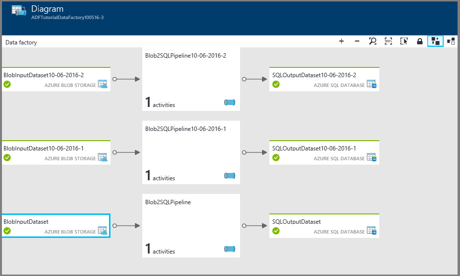

<properties
	pageTitle="Tutorial: Create a pipeline using Resource Manager Template | Microsoft Azure"
	description="In this tutorial, you create an Azure Data Factory pipeline with a Copy Activity by using Azure Resource Manager template."
	services="data-factory"
	documentationCenter=""
	authors="spelluru"
	manager="jhubbard"
	editor="monicar"/>

<tags
	ms.service="data-factory"
	ms.workload="data-services"
	ms.tgt_pltfrm="na"
	ms.devlang="na"
	ms.topic="get-started-article"
	ms.date="10/05/2016"
	ms.author="spelluru"/>

# Tutorial: Create a pipeline with Copy Activity using Azure Resource Manager template
> [AZURE.SELECTOR]
- [Overview and prerequisites](data-factory-copy-data-from-azure-blob-storage-to-sql-database.md)
- [Copy Wizard](data-factory-copy-data-wizard-tutorial.md)
- [Azure portal](data-factory-copy-activity-tutorial-using-azure-portal.md)
- [Visual Studio](data-factory-copy-activity-tutorial-using-visual-studio.md)
- [PowerShell](data-factory-copy-activity-tutorial-using-powershell.md)
- [Azure Resource Manager template](data-factory-copy-activity-tutorial-using-azure-resource-manager-template.md)
- [REST API](data-factory-copy-activity-tutorial-using-rest-api.md)
- [.NET API](data-factory-copy-activity-tutorial-using-dotnet-api.md)

This tutorial shows you how to create and monitor an Azure data factory using an Azure Resource Manager template. The pipeline in the data factory copies data from Azure Blob Storage to Azure SQL Database.

## Prerequisites
- Go through [Tutorial Overview and Prerequisites](data-factory-copy-data-from-azure-blob-storage-to-sql-database.md) and complete the **prerequisite** steps.
- Follow instructions in [How to install and configure Azure PowerShell](../powershell-install-configure.md) article to install latest version of Azure PowerShell on your computer. In this tutorial, you use PowerShell to deploy Data Factory entities. 
- (optional) See [Authoring Azure Resource Manager Templates](../resource-group-authoring-templates.md) to learn about Azure Resource Manager templates.

## In this tutorial

In this tutorial, you create a data factory with the following Data Factory entities:

Entity | Description  
------ | ----------- 
Azure Storage linked service | Links your Azure Storage account to the data factory. Azure Storage is the source data store and Azure SQL database is the sink data store for the copy activity in the tutorial. It specifies the storage account that contains the input data for the copy activity. 
Azure SQL Database linked service| Links your Azure SQL database to the data factory. It specifies the Azure SQL database that holds the output data for the copy activity. 
Azure Blob input dataset | Refers to the Azure Storage linked service. The linked service refers to an Azure Storage account and the Azure Blob dataset specifies the container, folder, and file name in the storage that holds the input data. 
Azure SQL output dataset | Refers to the Azure SQL linked service. The Azure SQL linked service refers to an Azure SQL server and the Azure SQL dataset specifies the name of the table that holds the output data. 
Data pipeline | The pipeline has one activity of type Copy that takes the Azure blob dataset as an input and the Azure SQL dataset as an output. The copy activity copies data from an Azure blob to a table in the Azure SQL database.  

A data factory can have one or more pipelines. A pipeline can have one or more activities in it. There are two types of activities: [data movement activities](data-factory-data-movement-activities.md) and [data transformation activities](data-factory-data-transformation-activities.md). In the tutorial, you create a pipeline with one activity (copy activity). 

## Data Factory JSON template
Create a JSON file named **ADFCopyTutorialARM.json** in **C:\ADFGetStarted** folder with the following content:

> [AZURE.NOTE] See [Data Factory entities in the template](#data-factory-entities-in-the-template) section for details about JSON definitions for Data Factory entities (linked services, datasets, and pipeline). 

	  {
	    "contentVersion": "1.0.0.0",
	    "$schema": "http://schema.management.azure.com/schemas/2015-01-01/deploymentTemplate.json#",
	    "parameters": {
	      "dataFactoryName": { "type": "string" },
	      "storageAccountName": { "type": "string" },
	      "storageAccountKey": { "type": "securestring" },
	      "sourceBlobContainer": { "type": "string" },
	      "sourceBlobName": { "type": "string" },
	      "sqlServerName": { "type": "string" },
	      "databaseName": { "type": "string" },    
	      "sqlServerUserName": { "type": "string" },
	      "sqlServerPassword": { "type": "securestring" },
	      "targetSQLTable": { "type": "string" }
	    },
	    "variables": {
	      "apiVersion": "2015-10-01",
	      "azureSqlLinkedServiceName": "AzureSqlLinkedService",
	      "azureStorageLinkedServiceName": "AzureStorageLinkedService",
	      "blobInputDatasetName": "BlobInputDataset",
	      "sqlOutputDatasetName": "SQLOutputDataset",
	      "pipelineName": "Blob2SQLPipeline"    
	    },
	    "resources": [
	      {
	        "name": "[parameters('dataFactoryName')]",
	        "apiVersion": "[variables('apiVersion')]",
	        "type": "Microsoft.DataFactory/datafactories",
	        "location": "westus",
	        "resources": [
	          {
	            "type": "Microsoft.DataFactory/datafactories/linkedservices",
	            "name": "[concat(parameters('dataFactoryName'), '/', variables('azureStorageLinkedServiceName'))]",
	            "dependsOn": [ "[concat('Microsoft.DataFactory/dataFactories/', parameters('dataFactoryName'))]" ],
	            "apiVersion": "[variables('apiVersion')]",
	            "properties": {
	              "type": "AzureStorage",
	              "description": "Azure Storage linked service",
	              "typeProperties": {
	                "connectionString": "[concat('DefaultEndpointsProtocol=https;AccountName=',parameters('storageAccountName'),';AccountKey=',parameters('storageAccountKey'))]"
	              }
	            }
	          },
	          {
	            "type": "Microsoft.DataFactory/datafactories/linkedservices",
	            "name": "[concat(parameters('dataFactoryName'), '/', variables('azureSqlLinkedServiceName'))]",
	            "dependsOn": [ "[concat('Microsoft.DataFactory/dataFactories/', parameters('dataFactoryName'))]" ],
	            "apiVersion": "[variables('apiVersion')]",
	            "properties": {
	              "type": "AzureSqlDatabase",
	              "description": "Azure SQL linked service",
	              "typeProperties": {
	                "connectionString": "[concat('Server=tcp:',parameters('sqlServerName'),'.database.windows.net,1433;Database=', parameters('databaseName'), ';User ID=',parameters('sqlServerUserName'),';Password=',parameters('sqlServerPassword'),';Trusted_Connection=False;Encrypt=True;Connection Timeout=30')]"
	              }
	            }
	          },
	          {
	            "type": "Microsoft.DataFactory/datafactories/datasets",
	            "name": "[concat(parameters('dataFactoryName'), '/', variables('blobInputDatasetName'))]",
	            "dependsOn": [
	              "[concat('Microsoft.DataFactory/dataFactories/', parameters('dataFactoryName'))]",
	              "[concat('Microsoft.DataFactory/dataFactories/', parameters('dataFactoryName'), '/linkedServices/', variables('azureStorageLinkedServiceName'))]"
	            ],
	            "apiVersion": "[variables('apiVersion')]",
	            "properties": {
	              "type": "AzureBlob",
	              "linkedServiceName": "[variables('azureStorageLinkedServiceName')]",
	              "structure": [
	                {
	                  "name": "Column0",
	                  "type": "String"
	                },
	                {
	                  "name": "Column1",
	                  "type": "String"
	                }
	              ],
	              "typeProperties": {
	                "folderPath": "[concat(parameters('sourceBlobContainer'), '/')]",
	                "fileName":  "[parameters('sourceBlobName')]",
	                "format": {
	                  "type": "TextFormat",
	                  "columnDelimiter": ","
	                }
	              },
	              "availability": {
	                "frequency": "Day",
	                "interval": 1
	              },
	              "external": true
	            }
	          },
	          {
	            "type": "Microsoft.DataFactory/datafactories/datasets",
	            "name": "[concat(parameters('dataFactoryName'), '/', variables('sqlOutputDatasetName'))]",
	            "dependsOn": [
	              "[concat('Microsoft.DataFactory/dataFactories/', parameters('dataFactoryName'))]",
	              "[concat('Microsoft.DataFactory/dataFactories/', parameters('dataFactoryName'), '/linkedServices/', variables('azureSqlLinkedServiceName'))]"
	            ],
	            "apiVersion": "[variables('apiVersion')]",
	            "properties": {
	              "type": "AzureSqlTable",
	              "linkedServiceName": "[variables('azureSqlLinkedServiceName')]",
	              "structure": [
	                {
	                  "name": "FirstName",
	                  "type": "String"
	                },
	                {
	                  "name": "LastName",
	                  "type": "String"
	                }
	              ],
	              "typeProperties": {
	                "tableName": "[parameters('targetSQLTable')]"
	              },
	              "availability": {
	                "frequency": "Day",
	                "interval": 1
	              }
	            }
	          },
	          {
	            "type": "Microsoft.DataFactory/datafactories/datapipelines",
	            "name": "[concat(parameters('dataFactoryName'), '/', variables('pipelineName'))]",
	            "dependsOn": [
	              "[concat('Microsoft.DataFactory/dataFactories/', parameters('dataFactoryName'))]",
	              "[concat('Microsoft.DataFactory/dataFactories/', parameters('dataFactoryName'), '/linkedServices/', variables('azureStorageLinkedServiceName'))]",
	              "[concat('Microsoft.DataFactory/dataFactories/', parameters('dataFactoryName'), '/linkedServices/', variables('azureSqlLinkedServiceName'))]",
	              "[concat('Microsoft.DataFactory/dataFactories/', parameters('dataFactoryName'), '/datasets/', variables('sqlOutputDatasetName'))]",
	              "[concat('Microsoft.DataFactory/dataFactories/', parameters('dataFactoryName'), '/datasets/', variables('blobInputDatasetName'))]"
		          ],
	            "apiVersion": "[variables('apiVersion')]",
	            "properties": {
	              "activities": [
	                {
	                  "name": "CopyFromAzureBlobToAzureSQL",
	                  "description": "Copy data frm Azure blob to Azure SQL",
	                  "type": "Copy",
	                  "inputs": [ { "name": "[variables('blobInputDatasetName')]" } ],
	                  "outputs": [ { "name": "[variables('sqlOutputDatasetName')]" } ],
	                  "typeProperties": {
	                    "source": {
	                      "type": "BlobSource"
	                    },
	                    "sink": {
	                      "type": "SqlSink"
	                    },
	                    "translator": {
	                      "type": "TabularTranslator",
	                      "columnMappings": "Column0:FirstName,Column1:LastName"
	                    }
	                  },
	                  "Policy": {
	                    "concurrency": 1,
	                    "executionPriorityOrder": "NewestFirst",
	                    "style": "StartOfInterval",
	                    "retry": 0,
	                    "timeout": "01:00:00"
	                  }
	                }
	              ],
	              "start": "2016-10-01T00:00:00Z",
	              "end": "2016-10-02T00:00:00Z"
	            }
	          }
	        ]
	      }
	    ]
	  }

## Parameters JSON 
Create a JSON file named **ADFCopyTutorialARM-Parameters.json** that contains parameters for the Azure Resource Manager template. Specify values for these parameters and save the JSON file.

> [AZURE.NOTE] The name of the Azure data factory must be **globally unique**.  

	{
	  "$schema": "http://schema.management.azure.com/schemas/2014-04-01-preview/deploymentTemplate.json#",
	  "contentVersion": "1.0.0.0",
	  "parameters": {
	    "dataFactoryName": { "value": "<Name of the data factory>" },
	    "storageAccountName": { "value": "<Azure Storage account name>" },
	    "storageAccountKey": { "value": "<Azure Storage account key>" },
	    "sourceBlobContainer": { "value": "adftutorial" },
	    "sourceBlobName": { "value": "emp.txt" },
	    "sqlServerName": { "value": "<Azure SQL server name>" },
	    "databaseName": { "value": "<Azure SQL database name>" },
	    "sqlServerUserName": { "value": "<Azure SQL server - user name>" },
	    "sqlServerPassword" :  {"value":  "<Azure SQL server - user password>"},
	    "targetSQLTable": { "value": "emp" }
	  }
	}

> [AZURE.IMPORTANT] You may have separate parameter JSON files for development, testing, and production environments that you can use with the same Data Factory JSON template. By using a Power Shell script, you can automate deploying Data Factory entities in these environments.  

## Create data factory
1. Start **Azure PowerShell** and run the following command:
	- Run `Login-AzureRmAccount` and enter the user name and password that you use to sign in to the Azure portal.  
	- Run `Get-AzureRmSubscription` to view all the subscriptions for this account.
	- Run `Get-AzureRmSubscription -SubscriptionName <SUBSCRIPTION NAME> | Set-AzureRmContext` to select the subscription that you want to work with. 
2. Run the following command to deploy Data Factory entities using the Resource Manager template you created in Step 1.

		New-AzureRmResourceGroupDeployment -Name MyARMDeployment -ResourceGroupName ADFTutorialResourceGroup -TemplateFile C:\ADFGetStarted\ADFCopyTutorialARM.json -TemplateParameterFile C:\ADFGetStarted\ADFCopyTutorialARM-Parameters.json

## Monitor pipeline
1. Log in to the [Azure portal](https://portal.azure.com) using your Azure account.
2. Click **Data factories** on the left menu (or) click **More services** and click **Data factories** under **INTELLIGENCE + ANALYTICS** category.

	
3. In the **Data factories** page, search for and find your data factory. 

	  
4. Click your Azure data factory. You see the home page for the data factory.

	  
5. Click **Diagram** tile to see the diagram view of your data factory.

	
6. In the diagram view, double-click the dataset **SQLOutputDataset**. You see that status of the slice. When the copy operation is done, you the status set to **Ready**.

	
7. When the slice is in **Ready** state, verify that the data is copied to the **emp** table in the Azure SQL database.

See [Monitor datasets and pipeline](data-factory-monitor-manage-pipelines.md) for instructions on how to use the Azure portal blades to monitor the pipeline and datasets you have created in this tutorial.

You can also use Monitor and Manage App to monitor your data pipelines. See [Monitor and manage Azure Data Factory pipelines using Monitoring App](data-factory-monitor-manage-app.md) for details about using the application.

## Data Factory entities in the template
You have only one resource in the template and that is the data factory. The data factory itself has embedded resources that define linked services, datasets, and pipeline.  

	  "resources": [
	    {
	      "name": "[parameters('dataFactoryName')]",
	      "apiVersion": "[variables('apiVersion')]",
	      "type": "Microsoft.DataFactory/datafactories",
	      "location": "westus",
		  "resouces": [
		  ]
	    }
	  ]

### Resources inside data factory
The following Data Factory entities are defined in the JSON template: 

1. [Azure Storage linked service](#azure-storage-linked-service)
2. [Azure SQL linked service](#azure-sql-database-linked-service)
3. [Azure blob dataset](#azure-blob-dataset)
4. [Azure SQL dataset](#azure-sql-dataset)
5. [Data pipeline with a copy activity](#data-pipeline)

#### Azure Storage linked service
You specify the name and key of Azure storage account in this section. See [Azure Storage linked service](data-factory-azure-blob-connector.md#azure-storage-linked-service) for details about JSON properties used to define an Azure Storage linked service. 

          {
            "type": "linkedservices",
            "name": "[variables('azureStorageLinkedServiceName')]",
            "dependsOn": [ "[concat('Microsoft.DataFactory/dataFactories/', parameters('dataFactoryName'))]" ],
            "apiVersion": "[variables('apiVersion')]",
            "properties": {
              "type": "AzureStorage",
              "description": "Azure Storage linked service",
              "typeProperties": {
                "connectionString": "[concat('DefaultEndpointsProtocol=https;AccountName=',parameters('storageAccountName'),';AccountKey=',parameters('storageAccountKey'))]"
              }
            }
          },

#### Azure SQL Database linked service
You specify the Azure SQL server name, database name, user name, and user password in this section. See [Azure SQL linked service](data-factory-azure-sql-connector.md#azure-sql-linked-service-properties) for details about JSON properties used to define an Azure SQL linked service.  

          {
            "type": "linkedservices",
            "name": "[variables('azureSqlLinkedServiceName')]",
            "dependsOn": [ "[concat('Microsoft.DataFactory/dataFactories/', parameters('dataFactoryName'))]" ],
            "apiVersion": "[variables('apiVersion')]",
            "properties": {
              "type": "AzureSqlDatabase",
              "description": "Azure SQL linked service",
              "typeProperties": {
                "connectionString": "[concat('Server=tcp:',parameters('sqlServerName'),'.database.windows.net,1433;Database=', parameters('databaseName'), ';User ID=',parameters('sqlServerUserName'),';Password=',parameters('sqlServerPassword'),';Trusted_Connection=False;Encrypt=True;Connection Timeout=30')]"
              }
            }
          },

#### Azure blob dataset
You specify the names of blob container, folder, and file that contains the input data. See [Azure Blob dataset properties](data-factory-azure-blob-connector.md#azure-blob-dataset-type-properties) for details about JSON properties used to define an Azure Blob dataset. 

          {
            "type": "datasets",
            "name": "[variables('blobInputDatasetName')]",
            "dependsOn": [
              "[concat('Microsoft.DataFactory/dataFactories/', parameters('dataFactoryName'))]",
              "[concat('Microsoft.DataFactory/dataFactories/', parameters('dataFactoryName'), '/linkedServices/', variables('azureStorageLinkedServiceName'))]"
            ],
            "apiVersion": "[variables('apiVersion')]",
            "properties": {
              "type": "AzureBlob",
              "linkedServiceName": "[variables('azureStorageLinkedServiceName')]",
              "structure": [
                {
                  "name": "Column0",
                  "type": "String"
                },
                {
                  "name": "Column1",
                  "type": "String"
                }
              ],
              "typeProperties": {
                "folderPath": "[concat(parameters('sourceBlobContainer'), '/')]",
                "fileName":  "[parameters('sourceBlobName')]",
                "format": {
                  "type": "TextFormat",
                  "columnDelimiter": ","
                }
              },
              "availability": {
                "frequency": "Day",
                "interval": 1
              },
              "external": true
            }
          },

#### Azure SQL dataset
You specify the name of the table in the Azure SQL database that holds the copied data from the Azure Blob storage. See [Azure SQL dataset properties](data-factory-azure-sql-connector.md#azure-sql-dataset-type-properties) for details about JSON properties used to define an Azure SQL dataset. 

          {
            "type": "datasets",
            "name": "[variables('sqlOutputDatasetName')]",
            "dependsOn": [
              "[concat('Microsoft.DataFactory/dataFactories/', parameters('dataFactoryName'))]",
              "[concat('Microsoft.DataFactory/dataFactories/', parameters('dataFactoryName'), '/linkedServices/', variables('azureSqlLinkedServiceName'))]"
            ],
            "apiVersion": "[variables('apiVersion')]",
            "properties": {
              "type": "AzureSqlTable",
              "linkedServiceName": "[variables('azureSqlLinkedServiceName')]",
              "structure": [
                {
                  "name": "FirstName",
                  "type": "String"
                },
                {
                  "name": "LastName",
                  "type": "String"
                }
              ],
              "typeProperties": {
                "tableName": "[parameters('targetSQLTable')]"
              },
              "availability": {
                "frequency": "Day",
                "interval": 1
              }
            }
          },

#### Data pipeline
You define a pipeline that copies data from the Azure blob dataset to the Azure SQL dataset. See [Pipeline JSON](data-factory-create-pipelines.md#pipeline-json) for descriptions of JSON elements used to define a pipeline in this example. 

          {
            "type": "datapipelines",
            "name": "[variables('pipelineName')]",
            "dependsOn": [
              "[concat('Microsoft.DataFactory/dataFactories/', parameters('dataFactoryName'))]",
              "[concat('Microsoft.DataFactory/dataFactories/', parameters('dataFactoryName'), '/linkedServices/', variables('azureStorageLinkedServiceName'))]",
              "[concat('Microsoft.DataFactory/dataFactories/', parameters('dataFactoryName'), '/linkedServices/', variables('azureSqlLinkedServiceName'))]",
              "[concat('Microsoft.DataFactory/dataFactories/', parameters('dataFactoryName'), '/datasets/', variables('sqlOutputDatasetName'))]",
              "[concat('Microsoft.DataFactory/dataFactories/', parameters('dataFactoryName'), '/datasets/', variables('blobInputDatasetName'))]"
	          ],
            "apiVersion": "[variables('apiVersion')]",
            "properties": {
              "activities": [
                {
                  "name": "CopyFromAzureBlobToAzureSQL",
                  "description": "Copy data frm Azure blob to Azure SQL",
                  "type": "Copy",
                  "inputs": [ { "name": "[variables('blobInputDatasetName')]" } ],
                  "outputs": [ { "name": "[variables('sqlOutputDatasetName')]" } ],
                  "typeProperties": {
                    "source": {
                      "type": "BlobSource"
                    },
                    "sink": {
                      "type": "SqlSink"
                    },
                    "translator": {
                      "type": "TabularTranslator",
                      "columnMappings": "Column0:FirstName,Column1:LastName"
                    }
                  },
                  "Policy": {
                    "concurrency": 1,
                    "executionPriorityOrder": "NewestFirst",
                    "style": "StartOfInterval",
                    "retry": 0,
                    "timeout": "01:00:00"
                  }
                }
              ],
              "start": "2016-10-01T00:00:00Z",
              "end": "2016-10-02T00:00:00Z"
            }
          }

## Deploy many entities with same data flow
You can create a Data Factory template and multiple parameter templates to deploy multiple entities that perform the same data flow. In this example, all pipelines copy data from an Azure Storage account to an Azure SQL database. However, the storage accounts and SQL databases are different for each flow.   

To implement this scenario, do the following steps:

- Make a copy of the parameter JSON file.  Add an additional parameter named suffix. 
- Create another template that uses the suffix parameter in names of Data Factory entities.  
- Use separate parameter JSON file for each pipeline

### parameter JSON
Create a copy of the ADFCopyTutorialARM-Parameters.json and name it ADFCopyTutorialARM-Parameters-2.json. Add a comma character (`,`) at the end of the targetSQLTable line and then add the line with **suffix** from the following sample JSON:  

	{
	  "$schema": "http://schema.management.azure.com/schemas/2014-04-01-preview/deploymentTemplate.json#",
	  "contentVersion": "1.0.0.0",
	  "parameters": {
	    "dataFactoryName": { "value": "<Name of the data factory>" },
	    "storageAccountName": { "value": "<Azure Storage account name>" },
	    "storageAccountKey": { "value": "<Azure Storage account key>" },
	    "sourceBlobContainer": { "value": "adftutorial" },
	    "sourceBlobName": { "value": "emp.txt" },
	    "sqlServerName": { "value": "<Azure SQL server name>" },
	    "databaseName": { "value": "<Azure SQL database name>" },
	    "sqlServerUserName": { "value": "<Azure SQL server - user name>" },
	    "sqlServerPassword" :  {"value":  "<Azure SQL server - user password>"},
	    "targetSQLTable": { "value": "emp" },
		"suffix" : "<suffix>"
	  }
	}

### Data Factory template
Create ADFCopyTutorialARM-2.json with the following content: 

> [AZURE.NOTE] The names of linked services, datasets, and pipeline are determined based on the suffix from the parameter file.   

	  {
	    "contentVersion": "1.0.0.0",
	    "$schema": "http://schema.management.azure.com/schemas/2015-01-01/deploymentTemplate.json#",
	    "parameters": {
	      "dataFactoryName": { "type": "string" },
	      "storageAccountName": { "type": "string" },
	      "storageAccountKey": { "type": "securestring" },
	      "sourceBlobContainer": { "type": "string" },
	      "sourceBlobName": { "type": "string" },
	      "sqlServerName": { "type": "string" },
	      "databaseName": { "type": "string" },    
	      "sqlServerUserName": { "type": "string" },
	      "sqlServerPassword": { "type": "securestring" },
	      "targetSQLTable": { "type": "string" },
	      "suffix": { "type": "string" }
	    },
	    "variables": {
	      "apiVersion": "2015-10-01",
	      "azureSqlLinkedServiceName": "[concat('AzureSqlLinkedService', parameters('suffix'))]",
	      "azureStorageLinkedServiceName": "[concat('AzureStorageLinkedService', parameters('suffix'))]",
	      "blobInputDatasetName": "[concat('BlobInputDataset', parameters('suffix'))]",
	      "sqlOutputDatasetName": "[concat('SQLOutputDataset', parameters('suffix'))]",
	      "pipelineName": "[concat('Blob2SQLPipeline', parameters('suffix'))]"
	    },
	        "resources": [
	          {
	            "type": "Microsoft.DataFactory/datafactories/linkedservices",
	            "name": "[concat(parameters('dataFactoryName'), '/', variables('azureStorageLinkedServiceName'))]",
	            "apiVersion": "[variables('apiVersion')]",
	            "properties": {
	              "type": "AzureStorage",
	              "description": "Azure Storage linked service",
	              "typeProperties": {
	                "connectionString": "[concat('DefaultEndpointsProtocol=https;AccountName=',parameters('storageAccountName'),';AccountKey=',parameters('storageAccountKey'))]"
	              }
	            }
	          },
	          {
	            "type": "Microsoft.DataFactory/datafactories/linkedservices",
	            "name": "[concat(parameters('dataFactoryName'), '/', variables('azureSqlLinkedServiceName'))]",
	            "apiVersion": "[variables('apiVersion')]",
	            "properties": {
	              "type": "AzureSqlDatabase",
	              "description": "Azure SQL linked service",
	              "typeProperties": {
	                "connectionString": "[concat('Server=tcp:',parameters('sqlServerName'),'.database.windows.net,1433;Database=', parameters('databaseName'), ';User ID=',parameters('sqlServerUserName'),';Password=',parameters('sqlServerPassword'),';Trusted_Connection=False;Encrypt=True;Connection Timeout=30')]"
	              }
	            }
	          },
	          {
	            "type": "Microsoft.DataFactory/datafactories/datasets",
	            "name": "[concat(parameters('dataFactoryName'), '/', variables('blobInputDatasetName'))]",
	            "dependsOn": [
	              "[concat('Microsoft.DataFactory/dataFactories/', parameters('dataFactoryName'), '/linkedServices/', variables('azureStorageLinkedServiceName'))]"
	            ],
	            "apiVersion": "[variables('apiVersion')]",
	            "properties": {
	              "type": "AzureBlob",
	              "linkedServiceName": "[variables('azureStorageLinkedServiceName')]",
	              "structure": [
	                {
	                  "name": "Column0",
	                  "type": "String"
	                },
	                {
	                  "name": "Column1",
	                  "type": "String"
	                }
	              ],
	              "typeProperties": {
	                "folderPath": "[concat(parameters('sourceBlobContainer'), '/')]",
	                "fileName":  "[parameters('sourceBlobName')]",
	                "format": {
	                  "type": "TextFormat",
	                  "columnDelimiter": ","
	                }
	              },
	              "availability": {
	                "frequency": "Day",
	                "interval": 1
	              },
	              "external": true
	            }
	          },
	          {
	            "type": "Microsoft.DataFactory/datafactories/datasets",
	            "name": "[concat(parameters('dataFactoryName'), '/', variables('sqlOutputDatasetName'))]",
	            "dependsOn": [
	              "[concat('Microsoft.DataFactory/dataFactories/', parameters('dataFactoryName'), '/linkedServices/', variables('azureSqlLinkedServiceName'))]"
	            ],
	            "apiVersion": "[variables('apiVersion')]",
	            "properties": {
	              "type": "AzureSqlTable",
	              "linkedServiceName": "[variables('azureSqlLinkedServiceName')]",
	              "structure": [
	                {
	                  "name": "FirstName",
	                  "type": "String"
	                },
	                {
	                  "name": "LastName",
	                  "type": "String"
	                }
	              ],
	              "typeProperties": {
	                "tableName": "[parameters('targetSQLTable')]"
	              },
	              "availability": {
	                "frequency": "Day",
	                "interval": 1
	              }
	            }
	          },
	          {
	            "type": "Microsoft.DataFactory/datafactories/datapipelines",
	            "name": "[concat(parameters('dataFactoryName'), '/', variables('pipelineName'))]",
	            "dependsOn": [
	              "[concat('Microsoft.DataFactory/dataFactories/', parameters('dataFactoryName'), '/linkedServices/', variables('azureStorageLinkedServiceName'))]",
	              "[concat('Microsoft.DataFactory/dataFactories/', parameters('dataFactoryName'), '/linkedServices/', variables('azureSqlLinkedServiceName'))]",
	              "[concat('Microsoft.DataFactory/dataFactories/', parameters('dataFactoryName'), '/datasets/', variables('sqlOutputDatasetName'))]",
	              "[concat('Microsoft.DataFactory/dataFactories/', parameters('dataFactoryName'), '/datasets/', variables('blobInputDatasetName'))]"
		          ],
	            "apiVersion": "[variables('apiVersion')]",
	            "properties": {
	              "activities": [
	                {
	                  "name": "CopyFromAzureBlobToAzureSQL",
	                  "description": "Copy data frm Azure blob to Azure SQL",
	                  "type": "Copy",
	                  "inputs": [ { "name": "[variables('blobInputDatasetName')]" } ],
	                  "outputs": [ { "name": "[variables('sqlOutputDatasetName')]" } ],
	                  "typeProperties": {
	                    "source": {
	                      "type": "BlobSource"
	                    },
	                    "sink": {
	                      "type": "SqlSink"
	                    },
	                    "translator": {
	                      "type": "TabularTranslator",
	                      "columnMappings": "Column0:FirstName,Column1:LastName"
	                    }
	                  },
	                  "Policy": {
	                    "concurrency": 1,
	                    "executionPriorityOrder": "NewestFirst",
	                    "style": "StartOfInterval",
	                    "retry": 0,
	                    "timeout": "01:00:00"
	                  }
	                }
	              ],
	              "start": "2016-10-01T00:00:00Z",
	              "end": "2016-10-02T00:00:00Z"
	            }
	          }
	        ]
	  }

This JSON differs from the origin JSON in the following ways:  

Update the **parameters** section to define the suffix parameter. Add a comma character (`,`) at the end of the targetSQLTable line and then add the following statement with **suffix** from the following sample JSON:  

    "parameters": {
      "dataFactoryName": { "type": "string" },
      "storageAccountName": { "type": "string" },
      "storageAccountKey": { "type": "securestring" },
      "sourceBlobContainer": { "type": "string" },
      "sourceBlobName": { "type": "string" },
      "sqlServerName": { "type": "string" },
      "databaseName": { "type": "string" },    
      "sqlServerUserName": { "type": "string" },
      "sqlServerPassword": { "type": "securestring" },
      "targetSQLTable": { "type": "string" },
      "suffix": { "type": "string" }
    },

Update the **variables** section to use the suffix from the parameter file. 

    "variables": {
      "apiVersion": "2015-10-01",
      "azureSqlLinkedServiceName": "[concat('AzureSqlLinkedService', parameters('suffix'))]",
      "azureStorageLinkedServiceName": "[concat('AzureStorageLinkedService', parameters('suffix'))]",
      "blobInputDatasetName": "[concat('BlobInputDataset', parameters('suffix'))]",
      "sqlOutputDatasetName": "[concat('SQLOutputDataset', parameters('suffix'))]",
      "pipelineName": "[concat('Blob2SQLPipeline', parameters('suffix'))]"
    },

Remove the following lines because we are **not creating a data factory**. Instead, we create entities in the same data factory. 

    "resources": [
      {
	      "name": "[parameters('dataFactoryName')]",
    	  "apiVersion": "[variables('apiVersion')]",
    	  "type": "Microsoft.DataFactory/datafactories",
    	  "location": "[resourceGroup().location]",

At the end of the file, keep the closing brace (`}'), but remove the following two lines before it:

       }
    ]

Removed the dependency on data factory creation on linked services, datasets, and pipeline. 

      "[concat('Microsoft.DataFactory/dataFactories/', parameters('dataFactoryName'))]",

### Create entities in the data factory

1. Start **Azure PowerShell** and run the following command:
	- Run `Login-AzureRmAccount` and enter the user name and password that you use to sign in to the Azure portal.  
	- Run `Get-AzureRmSubscription` to view all the subscriptions for this account.
	- Run `Get-AzureRmSubscription -SubscriptionName <SUBSCRIPTION NAME> | Set-AzureRmContext` to select the subscription that you want to work with. This subscription should be the same as the one you used in the Azure portal.
2. Run the following command to deploy Data Factory entities using the Resource Manager template you created in Step 1.

		New-AzureRmResourceGroupDeployment -Name MyARMDeployment -ResourceGroupName ADFTutorialResourceGroup -TemplateFile C:\ADFGetStarted\ADFCopyTutorialARM-2.json -TemplateParameterFile C:\ADFGetStarted\ADFCopyTutorialARM-Parameters-2.json

Now, repeat the steps with different parameter JSON file to create more pipelines with the same data flow but to copy between different Azure storage accounts and Azure SQL databases. 

You should see the pipelines in the diagram view in the portal.10-06-2016-1 and 10-06-2016-2 are the suffixes in two separate parameter files. To see the diagram as shown in the following image, unlock the diagram and auto-layout the pipelines.  

