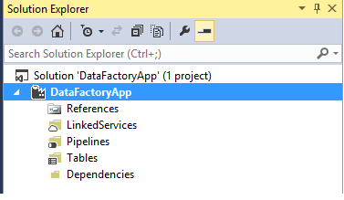
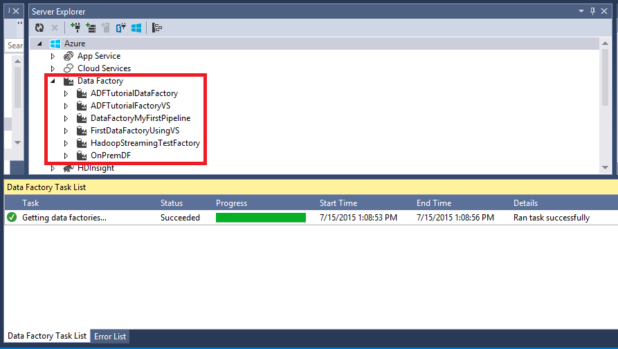

<properties 
	pageTitle="Tutorial: Create a pipeline with Copy Activity using Visual Studio" 
	description="In this tutorial, you will create an Azure Data Factory pipeline with a Copy Activity by using Visual Studio." 
	services="data-factory" 
	documentationCenter="" 
	authors="spelluru" 
	manager="jhubbard" 
	editor="monicar"/>

<tags 
	ms.service="data-factory" 
	ms.workload="data-services" 
	ms.tgt_pltfrm="na" 
	ms.devlang="na" 
	ms.topic="get-started-article" 
	ms.date="08/01/2016" 
	ms.author="spelluru"/>

# Tutorial: Create a pipeline with Copy Activity using Visual Studio
> [AZURE.SELECTOR]
- [Tutorial Overview](data-factory-copy-data-from-azure-blob-storage-to-sql-database.md)
- [Using Data Factory Editor](data-factory-copy-activity-tutorial-using-azure-portal.md)
- [Using PowerShell](data-factory-copy-activity-tutorial-using-powershell.md)
- [Using Visual Studio](data-factory-copy-activity-tutorial-using-visual-studio.md)
- [Using Copy Wizard](data-factory-copy-data-wizard-tutorial.md)

In This tutorial you will do the following using Visual Studio 2013:

1. Create two linked services: **AzureStorageLinkedService1** and **AzureSqlinkedService1**. The AzureStorageLinkedService1 links an Azure storage and AzureSqlLinkedService1 links an Azure SQL database to the data factory: **ADFTutorialDataFactoryVS**. The input data for the pipeline resides in a blob container in the Azure blob storage and output data will be stored in a table in the Azure SQL database. Therefore, you add these two data stores as linked services to the data factory.
2. Create two data factory tables: **EmpTableFromBlob** and **EmpSQLTable**, which represent the input/output data that is stored in the data stores. For the EmpTableFromBlob, you will specify the blob container that contains a blob with the source data and for the EmpSQLTable, you will specify the SQL table that will store the output data. You will also specify other properties such as structure of the data, availability of the data, etc...
3. Create a pipeline named **ADFTutorialPipeline** in the ADFTutorialDataFactoryVS. The pipeline will have a **Copy Activity** that copies input data from the Azure blob to the output Azure SQL table. The Copy Activity performs the data movement in Azure Data Factory and the activity is powered by a globally available service that can copy data between various data stores in a secure, reliable, and scalable way. See [Data Movement Activities](data-factory-data-movement-activities.md) article for details about the Copy Activity. 
4. Create a data factory, and deploy linked services, tables, and the pipeline.    

## Prerequisites

1. You **must** read through [Tutorial Overview](data-factory-copy-data-from-azure-blob-storage-to-sql-database.md) article and complete the prerequisite steps before proceeding further.
2. You must be an **administrator of the Azure subscription** to be able to publish Data Factory entities to Azure Data Factory. This is a limitation at this time. We will inform you as soon as this requirement changes. 
3. You must have the following installed on your computer: 
	- Visual Studio 2013 or Visual Studio 2015
	- Download Azure SDK for Visual Studio 2013 or Visual Studio 2015. Navigate to [Azure Download Page](https://azure.microsoft.com/downloads/) and click **VS 2013** or **VS 2015** in the **.NET** section.
	- Download the latest Azure Data Factory plugin for Visual Studio : [VS 2013](https://visualstudiogallery.msdn.microsoft.com/754d998c-8f92-4aa7-835b-e89c8c954aa5) or [VS 2015](https://visualstudiogallery.msdn.microsoft.com/371a4cf9-0093-40fa-b7dd-be3c74f49005). If you are using Visual Studio 2013, you can also update the plugin by doing the following: On the menu, click **Tools** -> **Extensions and Updates** -> **Online** -> **Visual Studio Gallery** -> **Microsoft Azure Data Factory Tools for Visual Studio** -> **Update**. 
 

## Create Visual Studio project 
1. Launch **Visual Studio 2013**. Click **File**, point to **New**, and click **Project**. You should see the **New Project** dialog box.  
2. In the **New Project** dialog, select the **DataFactory** template, and click **Empty Data Factory Project**. If you don't see the DataFactory template, close Visual Studio, install Azure SDK for Visual Studio 2013, and reopen Visual Studio.  

	

3. Enter a **name** for the project, **location**, and a name for the **solution**, and click **OK**.

		

## Create linked services
Linked services link data stores or compute services to an Azure data factory. A data store can be an Azure Storage, Azure SQL Database or an on-premises SQL Server database.

In this step, you will create two linked services: **AzureStorageLinkedService1** and **AzureSqlLinkedService1**. AzureStorageLinkedService1 linked service links an Azure Storage Account and AzureSqlLinkedService links an Azure SQL database to the data factory: **ADFTutorialDataFactory**. 

### Create the Azure Storage linked service

4. Right-click **Linked Services** in the solution explorer, point to **Add**, and click **New Item**.      
5. In the **Add New Item** dialog box, select **Azure Storage Linked Service** from the list, and click **Add**. 

	
 
3. Replace **accountname** and **accountkey** with the name of your Azure storage account and its key. 

	

4. Save the **AzureStorageLinkedService1.json** file.

### Create the Azure SQL linked service

5. Right-click on **Linked Services** node in the **Solution Explorer** again, point to **Add**, and click **New Item**. 
6. This time, select **Azure SQL Linked Service**, and click **Add**. 
7. In the **AzureSqlLinkedService1.json file**, replace **servername**, **databasename**, **username@servername**, and **password** with names of your Azure SQL server, database, user account, and  password.    
8.  Save the **AzureSqlLinkedService1.json** file. 

## Create datasets
In the previous step, you created linked services **AzureStorageLinkedService1** and **AzureSqlLinkedService1** to link an Azure Storage account and Azure SQL database to the data factory: **ADFTutorialDataFactory**. In this step, you will define two data factory tables -- **EmpTableFromBlob** and **EmpSQLTable** -- that represent the input/output data that is stored in the data stores referred by AzureStorageLinkedService1 and AzureSqlLinkedService1 respectively. For  EmpTableFromBlob, you will specify the blob container that contains a blob with the source data and for EmpSQLTable, you will specify the SQL table that will store the output data.

### Create input dataset

9. Right-click **Tables** in the **Solution Explorer**, point to **Add**, and click **New Item**.
10. In the **Add New Item** dialog box, select **Azure Blob**, and click **Add**.   
10. Replace the JSON text with the following text and save the **AzureBlobLocation1.json** file. 

		{
		  "name": "EmpTableFromBlob",
		  "properties": {
		    "structure": [
		      {
		        "name": "FirstName",
		        "type": "String"
		      },
		      {
		        "name": "LastName",
		        "type": "String"
		      }
		    ],
		    "type": "AzureBlob",
		    "linkedServiceName": "AzureStorageLinkedService1",
		    "typeProperties": {
		      "folderPath": "adftutorial/",
		      "format": {
		        "type": "TextFormat",
		        "columnDelimiter": ","
		      }
		    },
		    "external": true,
		    "availability": {
		      "frequency": "Hour",
		      "interval": 1
		    }
		  }
		}

### Create output dataset

11. Right-click **Tables** in the **Solution Explorer** again, point to **Add**, and click **New Item**.
12. In the **Add New Item** dialog box, select **Azure SQL**, and click **Add**. 
13. Replace the JSON text with the following JSON and save the **AzureSqlTableLocation1.json** file.

		{
		  "name": "EmpSQLTable",
		  "properties": {
		    "structure": [
		      {
		        "name": "FirstName",
		        "type": "String"
		      },
		      {
		        "name": "LastName",
		        "type": "String"
		      }
		    ],
		    "type": "AzureSqlTable",
		    "linkedServiceName": "AzureSqlLinkedService1",
		    "typeProperties": {
		      "tableName": "emp"
		    },
		    "availability": {
		      "frequency": "Hour",
		      "interval": 1
		    }
		  }
		}

## Create pipeline 
You have created input/output linked services and tables so far. Now, you will create a pipeline with a **Copy Activity** to copy data from the Azure blob to Azure SQL database. 

1. Right-click **Pipelines** in the **Solution Explorer**, point to **Add**, and click **New Item**.  
15. Select **Copy Data Pipeline** in the **Add New Item** dialog box and click **Add**. 
16. Replace the JSON with the following JSON and save the **CopyActivity1.json** file..
			
		{
		  "name": "ADFTutorialPipeline",
		  "properties": {
		    "description": "Copy data from a blob to Azure SQL table",
		    "activities": [
		      {
		        "name": "CopyFromBlobToSQL",
		        "description": "Push Regional Effectiveness Campaign data to Azure SQL database",
		        "type": "Copy",
		        "inputs": [
		          {
		            "name": "EmpTableFromBlob"
		          }
		        ],
		        "outputs": [
		          {
		            "name": "EmpSQLTable"
		          }
		        ],
		        "typeProperties": {
		          "source": {
		            "type": "BlobSource"
		          },
		          "sink": {
		            "type": "SqlSink",
		            "writeBatchSize": 10000,
		            "writeBatchTimeout": "60:00:00"
		          }
		        },
		        "Policy": {
		          "concurrency": 1,
		          "executionPriorityOrder": "NewestFirst",
		          "style": "StartOfInterval",
		          "retry": 0,
		          "timeout": "01:00:00"
		        }
		      }
		    ],
		    "start": "2015-07-12T00:00:00Z",
		    "end": "2015-07-13T00:00:00Z",
		    "isPaused": false
		  }
		}

## Publish/deploy Data Factory entities
  
18. Right-click project in the Solution Explorer, and click **Publish**. 
19. If you see **Sign in to your Microsoft account** dialog box, enter your credentials for the account that has Azure subscription, and click **sign in**.
20. You should see the following dialog box:

	

21. In the Configure data factory page, do the following: 
	1. select **Create New Data Factory** option.
	2. Enter **VSTutorialFactory** for **Name**.  
	
		> [AZURE.NOTE]  
		> The name of the Azure data factory must be globally unique. If you receive an eror about the name of data factory when publishing, change the name of the data factory (for example, yournameVSTutorialFactory) and try publishing again. See [Data Factory - Naming Rules](data-factory-naming-rules.md) topic for naming rules for Data Factory artifacts.
		
	3. Select the right subscription for the **Subscription** field. 
	4. Select the **resource group** for the data factory to be created. 
	5. Select the **region** for the data factory. 
	6. Click **Next** to switch to the **Publish Items** page. 
23. In the **Publish Items** page, ensure that all the Data Factories entities are selected, and click **Next** to switch to the **Summary** page.     
24. Review the summary and click **Next** to start the deployment process and view the **Deployment Status**.
25. In the **Deployment Status** page, you should see the status of the deployment process. Click Finish after the deployment is done. 

Please note the following: 

- If you receive the error: "**This subscription is not registered to use namespace Microsoft.DataFactory**", do one of the following and try publishing again: 

	- In Azure PowerShell, run the following command to register the Data Factory provider. 
		
			Register-AzureRmResourceProvider -ProviderNamespace Microsoft.DataFactory
	
		You can run the following command to confirm that the Data Factory provider is registerd. 
	
			Get-AzureRmResourceProvider
	- Login using the Azure subscription into the [Azure portal](https://portal.azure.com) and navigate to a Data Factory blade (or) create a data factory in the Azure portal. This automatically registers the provider for you.
- 	The name of the data factory may be registered as a DNS name in the future and hence become publically visible.
- 	To create Data Factory instances, you need to be a contributor/administrator of the Azure subscription

## Summary
In this tutorial, you created an Azure data factory to copy data from an Azure blob to an Azure SQL database. You used Visual Studio to create the data factory, linked services, datasets, and a pipeline. Here are the high level steps you performed in this tutorial:  

1.	Created an Azure **data factory**.
2.	Created **linked services**:
	1. An **Azure Storage** linked service to link your Azure Storage account that holds input data. 	
	2. An **Azure SQL** linked service to link your Azure SQL database that holds the output data. 
3.	Created **datasets** which describe input data and output data for pipelines.
4.	Created a **pipeline** with a **Copy Activity** with **BlobSource** as source and **SqlSink** as sink. 

## Use Server Explorer to view data factories

1. In **Visual Studio**, click **View** on the menu, and click **Server Explorer**.
2. In the Server Explorer window, expand **Azure** and expand **Data Factory**. If you see **Sign in to Visual Studio**, enter the **account** associated with your Azure subscription and click **Continue**. Enter **password**, and click **Sign in**. Visual Studio tries to get information about all Azure data factories in your subscription. You will see the status of this operation in the **Data Factory Task List** window.
	
3. You can right-click on a data factory, and select Export Data Factory to New Project to create a Visual Studio project based on an existing data factory.
	  

## Update Data Factory tools for Visual Studio
To update Azure Data Factory tools for Visual Studio, do the following:

1. Click **Tools** on the menu and select **Extensions and Updates**. 
2. Select **Updates** in the left pane and then select **Visual Studio Gallery**.
4. Select **Azure Data Factory tools for Visual Studio** and click **Update**. If you do not see this entry, you already have the latest version of the tools. 

See [Monitor datasets and pipeline](data-factory-copy-activity-tutorial-using-azure-portal.md#monitor-pipeline) for instructions on how to use the Azure Portal to monitor the pipeline and datasets you have created in this tutorial.

## See Also
| Topic | Description |
| :---- | :---- |
| [Data Movement Activities](data-factory-data-movement-activities.md) | This article provides detailed information about the Copy Activity you used in the tutorial. |
| [Scheduling and execution](data-factory-scheduling-and-execution.md) | This article explains the scheduling and execution aspects of Azure Data Factory application model. |
| [Pipelines](data-factory-create-pipelines.md) | This article will help you understand pipelines and activities in Azure Data Factory and how to leverage them to construct end-to-end data-driven workflows for your scenario or business. |
| [Datasets](data-factory-create-datasets.md) | This article will help you understand datasets in Azure Data Factory.
| [Monitor and manage pipelines using Monitoring App](data-factory-monitor-manage-app.md) | This article describes how to monitor, manage, and debug pipelines using the Monitoring & Management App. 
