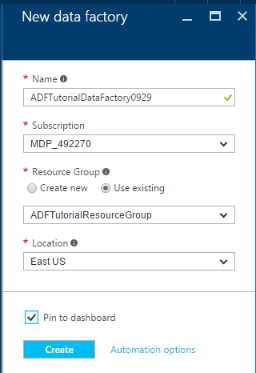
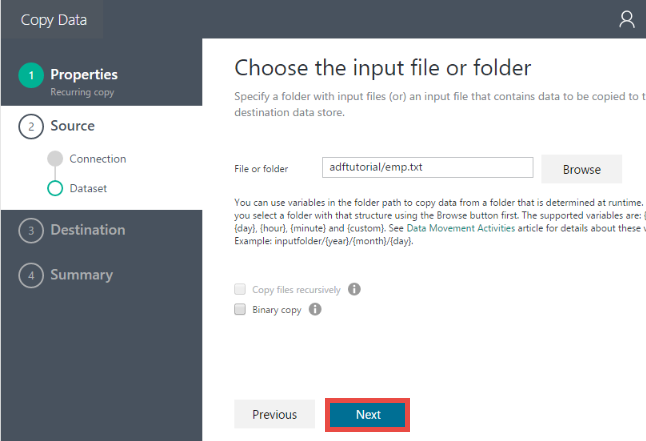
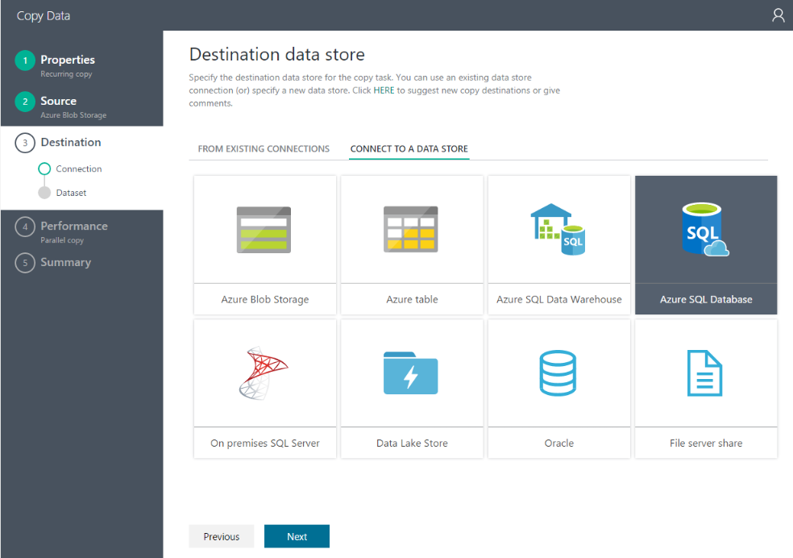
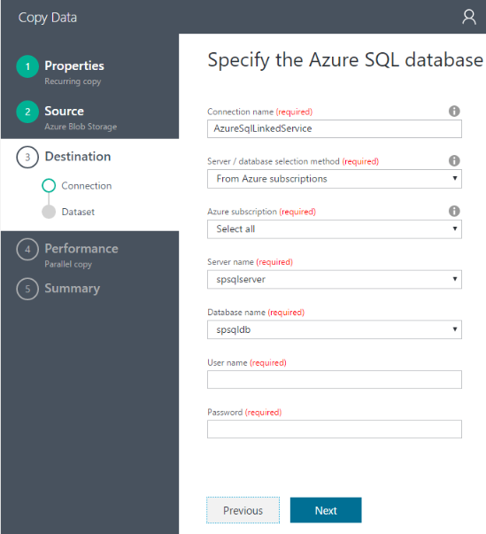
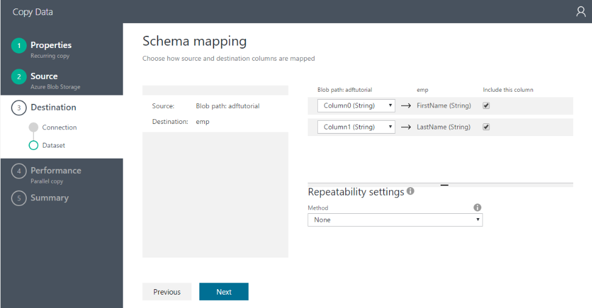
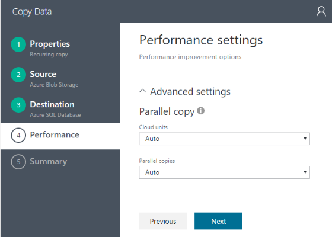
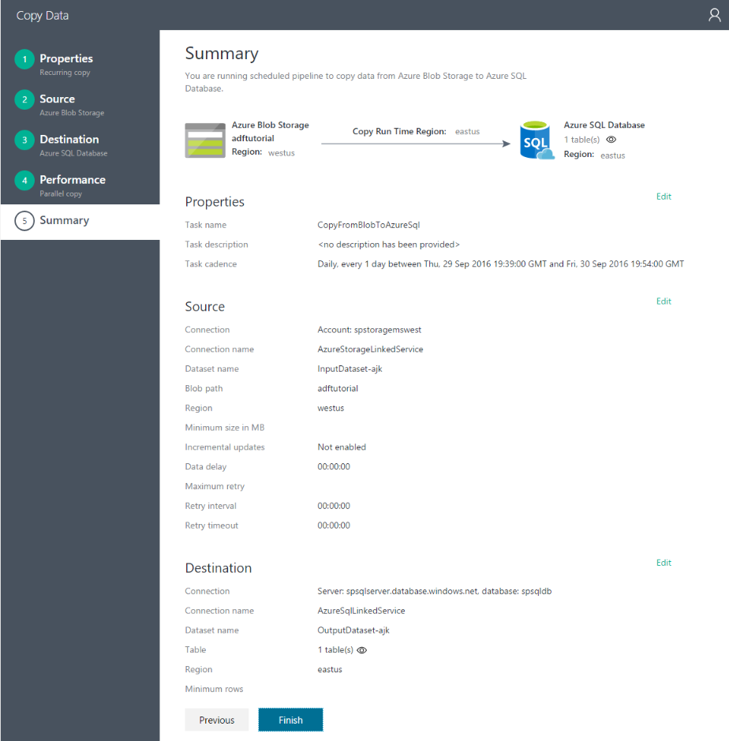

<properties 
	pageTitle="Tutorial: Create a pipeline using Copy Wizard" 
	description="In this tutorial, you create an Azure Data Factory pipeline with a Copy Activity by using the Copy Wizard supported by Data Factory" 
	services="data-factory" 
	documentationCenter="" 
	authors="spelluru" 
	manager="jhubbard" 
	editor="monicar"/>

<tags 
	ms.service="data-factory" 
	ms.workload="data-services" 
	ms.tgt_pltfrm="na" **
	ms.devlang="na" 
	ms.topic="get-started-article" 
	ms.date="09/16/2016" 
	ms.author="spelluru"/>

# Tutorial: Create a pipeline with Copy Activity using Data Factory Copy Wizard
> [AZURE.SELECTOR]
- [Overview and prerequisites](data-factory-copy-data-from-azure-blob-storage-to-sql-database.md)
- [Copy Wizard](data-factory-copy-data-wizard-tutorial.md)
- [Azure portal](data-factory-copy-activity-tutorial-using-azure-portal.md)
- [Visual Studio](data-factory-copy-activity-tutorial-using-visual-studio.md)
- [PowerShell](data-factory-copy-activity-tutorial-using-powershell.md)
- [REST API](data-factory-copy-activity-tutorial-using-rest-api.md)
- [.NET API](data-factory-copy-activity-tutorial-using-dotnet-api.md)

The Azure Data Factory **Copy Wizard** allows you to easily and quickly create a pipeline that implements the data ingestion/movement scenario. Therefore, we recommend that you use the wizard as a first step to create a sample pipeline for data movement scenario. This tutorial shows you how to create an Azure data factory, launch the Copy Wizard, go through a series of steps to provide details about your data ingestion/movement scenario. When you finish steps in the wizard, the wizard automatically creates a pipeline with a Copy Activity to copy data from an Azure blob storage to an Azure SQL database. See [Data Movement Activities](data-factory-data-movement-activities.md) article for details about the Copy Activity. 

> [AZURE.IMPORTANT] Go through the [Tutorial overview and prerequisites](data-factory-copy-data-from-azure-blob-storage-to-sql-database.md) article for an overview of the tutorial and to complete the **prerequisite** steps before performing this tutorial.

## Create data factory
In this step, you use the Azure portal to create an Azure data factory named **ADFTutorialDataFactory**.

1.	After logging in to the [Azure portal](https://portal.azure.com), click **+ NEW** from the top-left corner, click **Intelligence + analytics**, and click **Data Factory**. 

	

6. In the **New data factory** blade:
	1. Enter **ADFTutorialDataFactory** for the **name**.
		The name of the Azure data factory must be globally unique. If you receive the error: **Data factory name “ADFTutorialDataFactory” is not available**, change the name of the data factory (for example, yournameADFTutorialDataFactory) and try creating again. See [Data Factory - Naming Rules](data-factory-naming-rules.md) topic for naming rules for Data Factory artifacts.  
	 
		
	
		> [AZURE.NOTE] The name of the data factory may be registered as a DNS name in the future and hence become publically visible.
	2. Select your Azure **subscription**.
	3. For Resource Group, do one of the following steps: 
		1. Select **Use existing** to select an existing resource group.
		2. Select **Create new** to enter a name for a resource group.

			Some of the steps in this tutorial assume that you use the name: **ADFTutorialResourceGroup** for the resource group. To learn about resource groups, see [Using resource groups to manage your Azure resources](../resource-group-overview.md).
	3. Select a **location** for the data factory.
	4. Select **Pin to dashboard** check box at the bottom of the blade.  
	5. Click **Create**.
	
					
10. After the creation is complete, you see the **Data Factory** blade as shown in the following image:

    

## Launch and use Copy Wizard

1. On the Data Factory home page, click the **Copy data** tile to launch **Copy Wizard**. 

	> [AZURE.NOTE] If you see that the web browser is stuck at "Authorizing...", disable/uncheck **Block third party cookies and site data** setting (or) keep it enabled and create an exception for **login.microsoftonline.com** and then try launching the wizard again.
2. In the **Properties** page:
	1. Enter **CopyFromBlobToAzureSql** for **Task name**
	2. Enter **description** (optional).
	3. Change the **Start date time** and the **End date time** so that the end date is set to today and start date to five days before the current day.  
	3. Click **Next**.  

	 
3. On the **Source data store** page, click **Azure Blob Storage** tile. You use this page to specify the source data store for the copy task. You can use an existing data store linked service (or) specify a new data store. To use an existing linked service, you would click **FROM EXISTING LINKED SERVICES** and select the right linked service. 

	
5. On the **Specify the Azure Blob storage account** page:
	1. Enter **AzureStorageLinkedService** for **Linked service name**.
	2. Confirm that **From Azure subscriptions** option is selected for **Account selection method**.
	3. Select your Azure **subscription**.  
	3. Select an **Azure storage account** from the list of Azure storage accounts available in the selected subscription. You can also choose to enter storage account settings manually by selecting **Enter manually** option for the **Account selection method**, and then click **Next**. 

	
6. On **Choose the input file or folder** page:
	1. Navigate to the **adftutorial** folder.
	2. Select **emp.txt**, and click **Choose**
	3. Click **Next**. 

	
7. On the **Choose the input file or folder** page, click **Next**. Do not select **Binary copy**. 

	 
8. On the **File format settings** page, you see the delimiters and the schema that is auto-detected by the wizard by parsing the file. You can also enter the delimiters manually for the copy wizard to stop auto-detecting or to override. Click **Next** after you review the delimiters and preview data. 

	  
8. On the Destination data store page, select **Azure SQL Database**, and click **Next**.

	
9. On **Specify the Azure SQL database** page:
	1. Enter **AzureSqlLinkedService** for the **Connection name** field.
	2. Confirm that **From Azure subscriptions** option is selected for **Server / database selection method**.
	3. Select your Azure **subscription**.  
	2. Select **Server name** and **Database**.
	4. Enter **User name** and **Password**.
	5. Click **Next**.  

	
9. On the **Table mapping** page, select **emp** for the **Destination** field from the drop-down list, click **down arrow** (optional) to see the schema and to preview the data.

	 
10. On the **Schema mapping** page, click **Next**.

	
11. On the **Performance settings** page, click **Next**. 

	
11. Review information in the **Summary** page, and click **Finish**. The wizard creates two linked services, two datasets (input and output), and one pipeline in the data factory (from where you launched the Copy Wizard). 

	

## Launch Monitor and Manage application 
12. On the **Deployment** page, click the link: **Click here to monitor copy pipeline**.

	  
13. Use instructions from [Monitor and manage pipeline using Monitoring App](data-factory-monitor-manage-app.md) to learn about how to monitor the pipeline you created. Click **Refresh** icon in the **ACTIVITY WINDOWS** list to see the slice. 

	 
 	
	> [AZURE.NOTE] Click **Refresh** button in the **ACTIVITY WINDOWS** list at the bottom to see the latest status. It is not automatically refreshed. 

## See Also
| Topic | Description |
| :---- | :---- |
| [Data Movement Activities](data-factory-data-movement-activities.md) | This article provides detailed information about the Copy Activity you used in the tutorial. |
| [Scheduling and execution](data-factory-scheduling-and-execution.md) | This article explains the scheduling and execution aspects of Azure Data Factory application model. |
| [Pipelines](data-factory-create-pipelines.md) | This article helps you understand pipelines and activities in Azure Data Factory and how to use them to construct end-to-end data-driven workflows for your scenario or business. |
| [Datasets](data-factory-create-datasets.md) | This article helps you understand datasets in Azure Data Factory.
| [Monitor and manage pipelines using Monitoring App](data-factory-monitor-manage-app.md) | This article describes how to monitor, manage, and debug pipelines using the Monitoring & Management App. 