<properties 
	pageTitle="Tutorial: Create a pipeline using Copy Wizard" 
	description="In this tutorial, you will create an Azure Data Factory pipeline with a Copy Activity by using the Copy Wizard supported by Data Factory" 
	services="data-factory" 
	documentationCenter="" 
	authors="spelluru" 
	manager="jhubbard" 
	editor="monicar"/>

<tags 
	ms.service="data-factory" 
	ms.workload="data-services" 
	ms.tgt_pltfrm="na" 
	ms.devlang="na" 
	ms.topic="get-started-article" 
	ms.date="08/01/2016" 
	ms.author="spelluru"/>

# Tutorial: Create a pipeline with Copy Activity using Data Factory Copy Wizard
> [AZURE.SELECTOR]
- [Tutorial Overview](data-factory-copy-data-from-azure-blob-storage-to-sql-database.md)
- [Using Data Factory Editor](data-factory-copy-activity-tutorial-using-azure-portal.md)
- [Using PowerShell](data-factory-copy-activity-tutorial-using-powershell.md)
- [Using Visual Studio](data-factory-copy-activity-tutorial-using-visual-studio.md)
- [Using Copy Wizard](data-factory-copy-data-wizard-tutorial.md)

In this tutorial, you will use Data Factory Copy Wizard to create a pipeline with a Copy Activity in a data factory. First, you create a data factory by using the Azure Portal and then use the Copy Wizard to create Data Factory linked services, datasets, and a pipeline with a Copy Activity that copies data from an Azure blob storage to an Azure SQL database.

> [AZURE.IMPORTANT] Please go through the [Tutorial Overview](data-factory-copy-data-from-azure-blob-storage-to-sql-database.md) article and complete the prerequisite steps before performing this tutorial.

## Create data factory
In this step, you use the Azure Portal to create an Azure data factory named **ADFTutorialDataFactory**.

1.	After logging into the [Azure Portal](https://portal.azure.com), click **+ NEW** from the top-left corner, select **Data analytics** in the **Create** blade, and click **Data Factory** in the **Data analytics** blade. 

	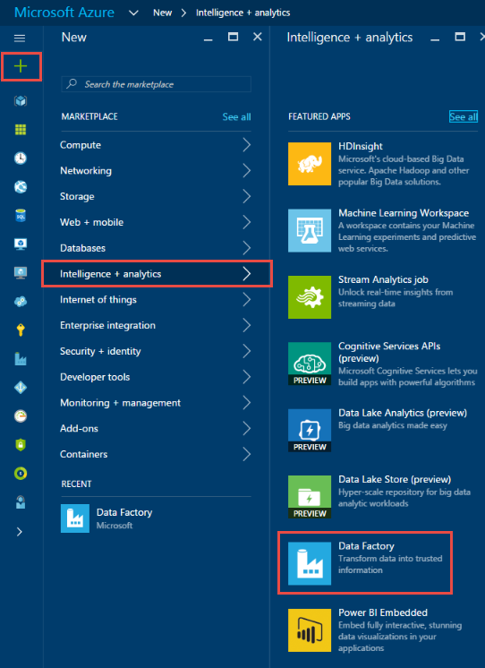

6. In the **New data factory** blade:
	1. Enter **ADFTutorialDataFactory** for the **name**. 
	
  		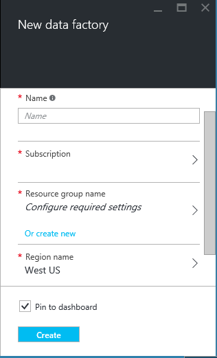
	2. Click **RESOURCE GROUP NAME** and do the following:
		1. Click **Create a new resource group**.
		2. In the **Create resource group** blade, enter **ADFTutorialResourceGroup** for the **name** of the resource group, and click **OK**. 

			

		Some of the steps in this tutorial assume that you use the name: **ADFTutorialResourceGroup** for the resource group. To learn about resource groups, see [Using resource groups to manage your Azure resources](../resource-group-overview.md).  
7. In the **New data factory** blade, notice that **Add to Startboard** is selected.
8. Click **Create** in the **New data factory** blade.

	The name of the Azure data factory must be globally unique. If you receive the error: **Data factory name “ADFTutorialDataFactory” is not available**, change the name of the data factory (for example, yournameADFTutorialDataFactory) and try creating again. See [Data Factory - Naming Rules](data-factory-naming-rules.md) topic for naming rules for Data Factory artifacts.  
	 
	
	
	> [AZURE.NOTE] The name of the data factory may be registered as a DNS name in the future and hence become publically visible.  

9. Click **NOTIFICATIONS** hub on the left and look for notifications from the creation process. Click **X** to close the **NOTIFICATIONS** blade if it is open. 
10. After the creation is complete, you will see the **DATA FACTORY** blade as shown below.

    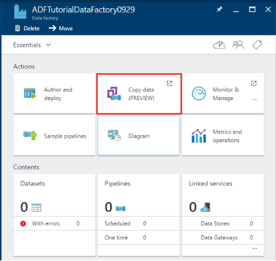

## Create pipeline

1. On the Data Factory home page, click the **Copy data** tile to launch **Copy Wizard**. 

	> [AZURE.NOTE] If you see that the web browser is stuck at "Authorizing...", disable/uncheck **Block third party cookies and site data** setting (or) keep it enabled and create an exception for **login.microsoftonline.com** and then try launching the wizard again.
2. In the **Properties** page:
	1. Enter **CopyFromBlobToAzureSql** for **Task name**
	2. Enter **description** (optional).
	3. Note the **Start date time** and the **End date time**. Change the **End date time** to be on the next day from the **Start date time**. 
	3. Click **Next**.  

	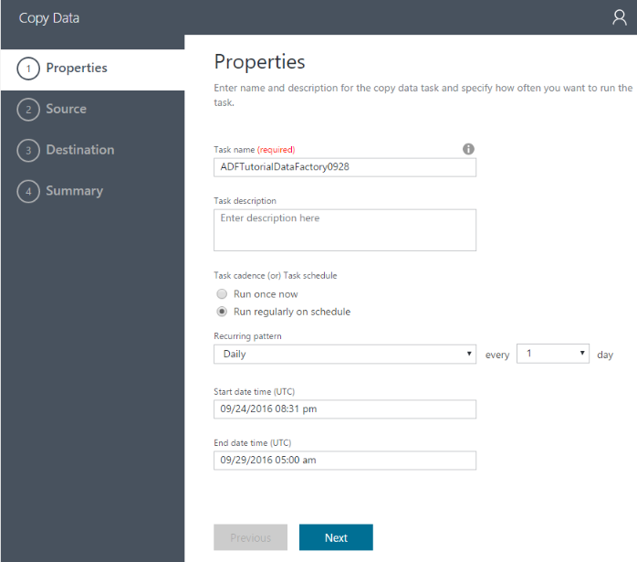 
3. On the **Source data store** page, click **Azure Blob Storage** tile. You use this page to specify the source data store for the copy task. You can use an existing data store linked service (or) specify a new data store. To use an existing linked service, you would click on **FROM EXISTING LINKED SERVICES** and select the right linked service. 

	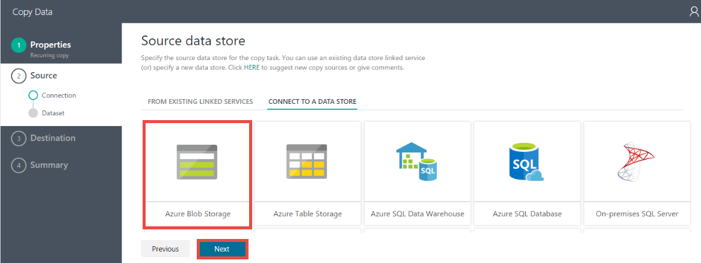
5. On the **Specify the Azure Blob storage account** page:
	1. Enter **AzureStorageLinkedService** for **Linked service name**.
	2. Confirm that **From Azure subscriptions** for **Account selection method**. 
	3. Select an **Azure storage account** from the list of Azure storage accounts available in the subscription you selected. You can also choose to enter storage account settings manually by selecting **Enter manually** option for the **Account selection method**, and then click **Next**. 

	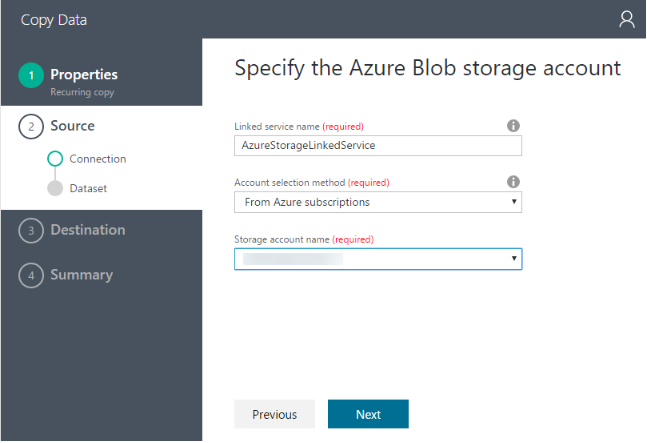
6. On **Choose the input file or folder** page:
	1. Navigate to the **adftutorial** folder.
	2. Select **emp.txt**, and click **Choose**
	3. Click **Next**. 

	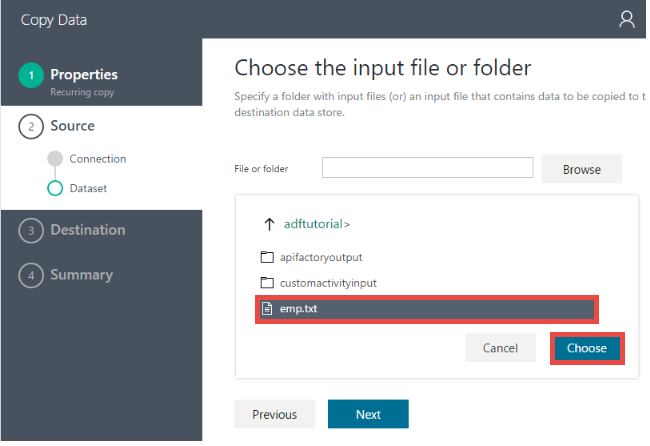
7. On the **File format settings** page, select **default** values and click **Next**.

	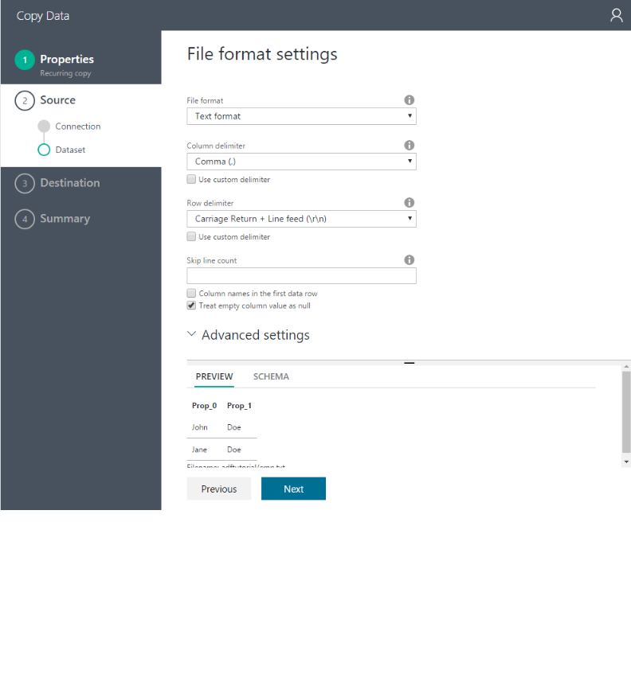  
8. On the Destination data store page, click **Azure SQL Database** tile, and click **Next**.
9. On **Specify the Azure SQL database** page:
	1. Enter **AzureSqlLinkedService** for the **Linked service name** field. 
	2. Confirm that the **Server/database selection method** is set to **From Azure subscriptions**.
	3. Select **Server name** and **Database**.
	4. Enter **User name** and **Password**.
	5. Click **Next**.  
9. On the **Table mapping** page, select **emp** for the **Destination** field from the drop-down list, click **down arrow** (optional) to see the schema and to preview the data.

	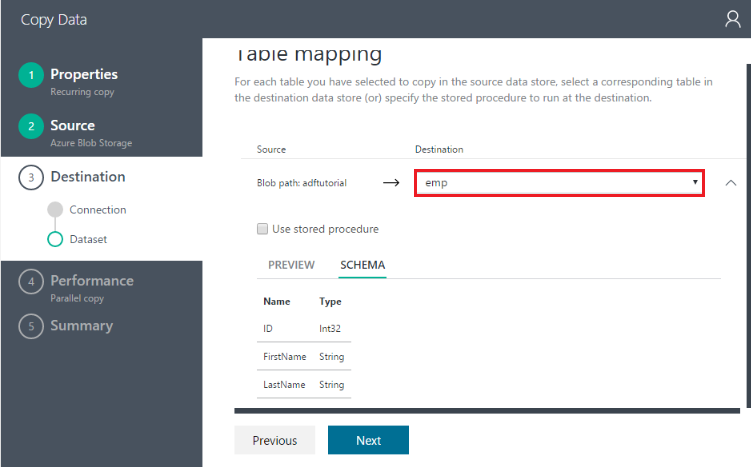 
10. On the **Schema mapping** page, click **Next**.
11. Review information in the **Summary** page, and click **Finish**. This will create two linked services, two datasets (input and output), and one pipeline in the data factory (from where you launched the Copy Wizard). 
12. On the **Deployment succeeded** page, click **Click here to monitor copy pipeline**.

	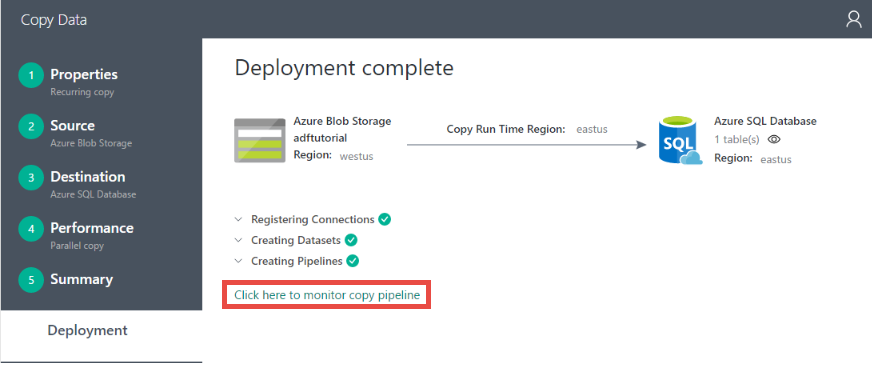  
13. Use instructions from [Monitor and manage pipeline using Monitoring App](data-factory-monitor-manage-app.md) to learn about how to monitor the pipeline you just created.

	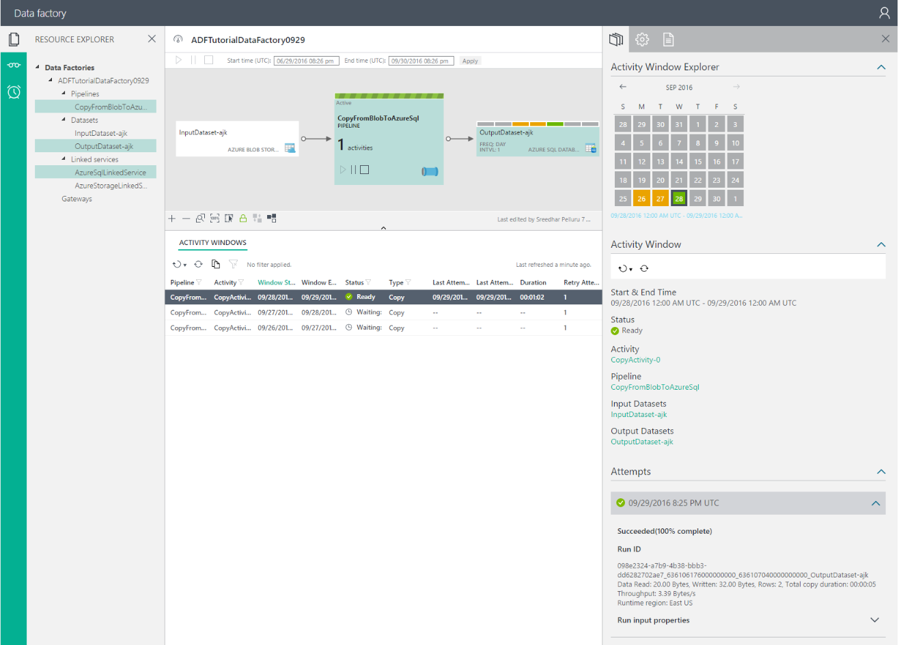 
 

## See Also
| Topic | Description |
| :---- | :---- |
| [Data Movement Activities](data-factory-data-movement-activities.md) | This article provides detailed information about the Copy Activity you used in the tutorial. |
| [Scheduling and execution](data-factory-scheduling-and-execution.md) | This article explains the scheduling and execution aspects of Azure Data Factory application model. |
| [Pipelines](data-factory-create-pipelines.md) | This article will help you understand pipelines and activities in Azure Data Factory and how to leverage them to construct end-to-end data-driven workflows for your scenario or business. |
| [Datasets](data-factory-create-datasets.md) | This article will help you understand datasets in Azure Data Factory.
| [Monitor and manage pipelines using Monitoring App](data-factory-monitor-manage-app.md) | This article describes how to monitor, manage, and debug pipelines using the Monitoring & Management App. 