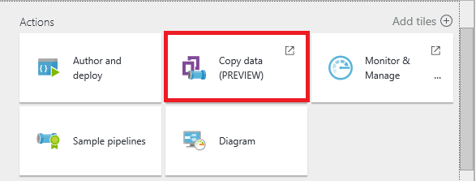
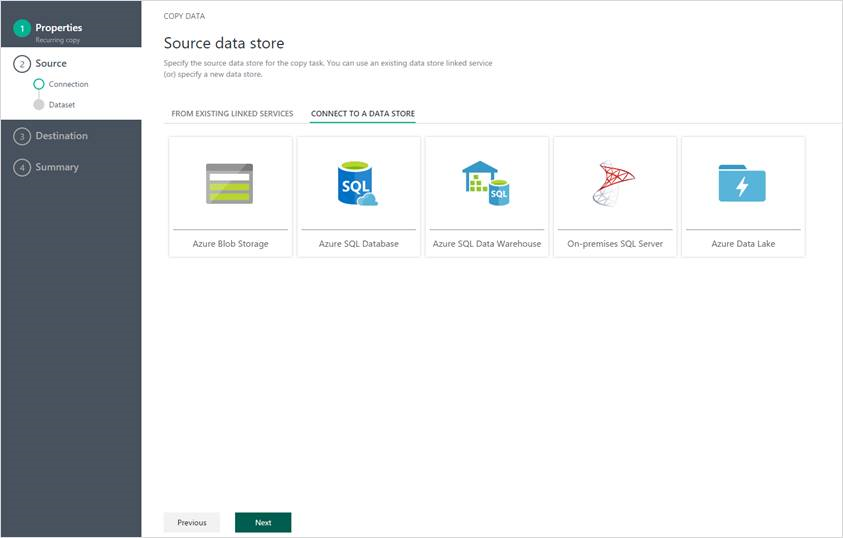
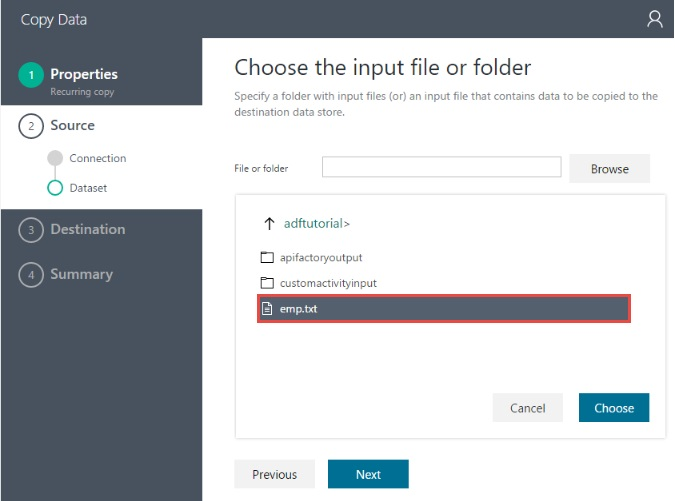
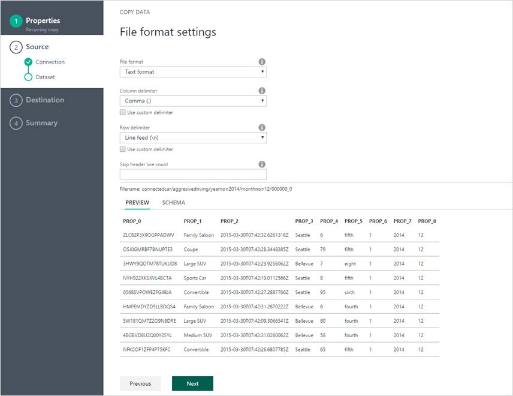
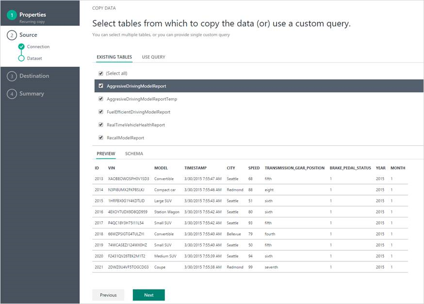
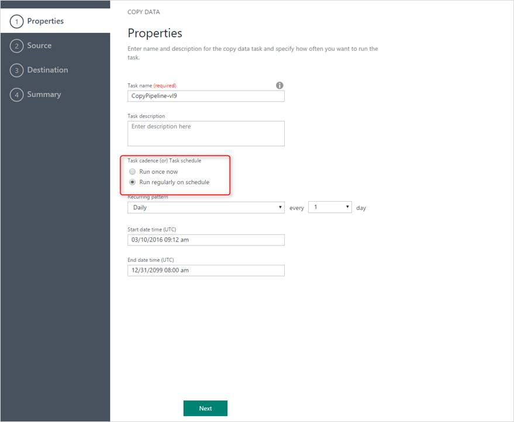
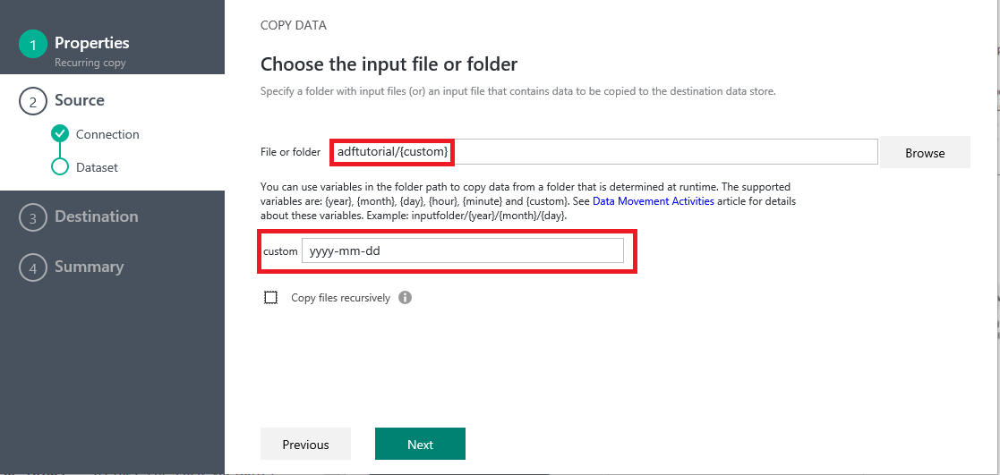

<properties 
	pageTitle="Data movement activities | Microsoft Azure" 
	description="Learn about data movement in Data Factory pipelines: data migration between cloud stores, between on-premises and cloud. Use the Copy Activity." 
	keywords="data movement, data migration, copy data, transfer data"
	services="data-factory" 
	documentationCenter="" 
	authors="spelluru" 
	manager="jhubbard" 
	editor="monicar"/>

<tags 
	ms.service="data-factory" 
	ms.workload="data-services" 
	ms.tgt_pltfrm="na" 
	ms.devlang="na" 
	ms.topic="article" 
	ms.date="07/11/2016" 
	ms.author="spelluru"/>

# Data Factory Copy Wizard
The **Data Factory Copy Wizard** allows you to create a pipeline to copy data from supported sources to destinations without writing JSON definitions for linked services, datasets, and pipelines. To launch Copy Wizard, click **Copy data** tile on the home page of your data factory. 

## Features

### An intuitive and seamless wizard for copying data 
This wizard allows you to easily move data from a source to a destination in minutes with the following easy steps: 

1.	Select the **source**
2.	Select the **destination**
3.	Configure **settings**

### Rich data exploration and schema mappings
You can browse tables/folders, preview data, map schema, validate expressions and perform simple data transformations within the wizard. 

**Browse tables/folders**

### Scalable experience for diverse data and object types
The experience is designed with big data in mind from the start. It is simple and efficient to author Data Factory pipelines that move hundreds of folders, files or tables.

**Preview data, map schema and perform simple transformations**

### Scalable experience for diverse data and object types
The experience is designed with big data in mind from the start. Moving hundreds of folders, files or tables is as simple and efficient to author using the Copy Wizard.

### Richer scheduling options
You can run the copy operation just once or on a schedule (hourly, daily, etc...). Both these options can be used for the breadth of the connectors across on-premises, cloud and local desktop copy. One-time copy enables data movement from a source to a destination just once and applies to data of any size and any supported formats. The scheduled copy enables copying data on a prescribed recurrence. You can leverage rich settings (like retry, timeout, alerts etc) to configure the scheduled copy.

## Tutorial
For a quick walkthrough of using the **Data Factory Copy Wizard** to create a pipeline with a Copy Activity, see [Tutorial: Create a pipeline using Copy Wizard](data-factory-copy-data-wizard-tutorial.md).

## Variables in Azure Blob folder path
You can use variables in folder path to copy data from a folder that is determined at runtime based on [WindowStart system variable](data-factory-functions-variables.md#data-factory-system-variables). The supported variables are: **year**, **month**, **day**, **hour**, **minute** and **{custom}**. Example: inputfolder/{year}/{month}/{day}. 

Suppose, you have input folders in the following format: 
	
	2016/03/01/01
	2016/03/01/02
	2016/03/01/03
	...

Click the **Browse** button for the **File or folder**, navigate to one of these folders, say 2016->03->01->02, and click **Choose**. You should see **2016/03/01/02** in the text box now. Now, replace **2016** with **{year}**, **03** with **{month}**, **01** with **{day}**, **02** with **{hour}**, and press **TAB**. You should see drop down lists to select **format** for these four variables as shown below: 

   

You can also use a **custom** variable as shown below and use any [supported format strings](https://msdn.microsoft.com/library/8kb3ddd4.aspx). Make sure that you select a folder with that structure using the Browse button first, replace a value with **{custom}** and press **TAB** to see the text box where you can type the format string.    

