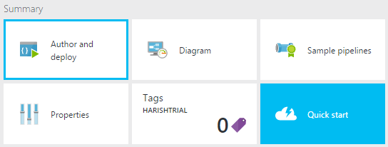
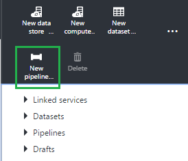
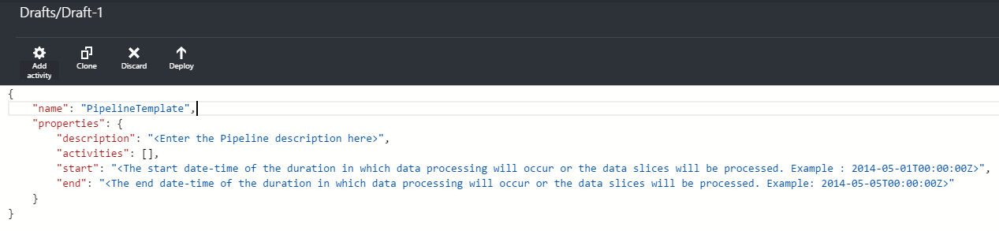

<properties 
	pageTitle="Creating pipelines" 
	description="Understand Azure Data Factory pipelines and learn how to create them to move and transform data to produce information that can be used to gain insights" 
	services="data-factory" 
	documentationCenter="" 
	authors="spelluru" 
	manager="jhubbard" 
	editor="monicar"/>

<tags 
	ms.service="data-factory" 
	ms.workload="data-services" 
	ms.tgt_pltfrm="na" 
	ms.devlang="na" 
	ms.topic="article" y
	ms.date="10/20/2015" 
	ms.author="spelluru"/>

# Understanding Pipelines & Activities
This article will help you understand pipelines and activities in Azure Data Factory and how to leverage them to construct end-to-end data-driven workflows for your scenario or business. This article assumes you have gone through the [Overview](data-factory-introduction.md) and [Creating Datasets](data-factory-create-datasets.md) articles prior to this.

## What is a pipeline?
**Pipeline is a logical grouping of Activities**. They are used to group activities into a unit that performs a task. To understand pipelines better, you need to understand an activity first. 

### What is an activity?
Activities define the actions to perform on your data. Each activity takes zero or more [datasets](data-factory-create-datasets.md) as inputs and produces one or more datasets as output. **An activity is a unit of orchestration in Azure Data Factory.** 

For example, you may use a Copy activity to orchestrate copying data from one dataset to another. Similarly you may use a Hive activity which will run a Hive query on an Azure HDInsight cluster to transform or analyze your data. Azure Data Factory provides a wide range of [data transformation, analysis](data-factory-data-transformation-activities.md), and [data movement activities](data-factory-data-movement-activities.md). You may also choose to create a custom .NET activity to run your own code. 

Consider the following 2 datasets:

**Azure SQL Dataset**

Table ‘MyTable’ contains a column ‘timestampcolumn’ which helps in specifying the datetime of when the data was inserted into the database. 

	{
	  "name": "AzureSqlInput",
	  "properties": {
	    "type": "AzureSqlTable",
	    "linkedServiceName": "AzureSqlLinkedService",
	    "typeProperties": {
	      "tableName": "MyTable"
	    },
	    "external": true,
	    "availability": {
	      "frequency": "Hour",
	      "interval": 1
	    },
	    "policy": {
	      "externalData": {
	        "retryInterval": "00:01:00",
	        "retryTimeout": "00:10:00",
	        "maximumRetry": 3
	      }
	    }
	  }
	}

**Azure Blob Dataset** 

Data is copied to a new blob every hour with the path for the blob reflecting the specific date-time with hour granularity.

	{
	  "name": "AzureBlobOutput",
	  "properties": {
	    "type": "AzureBlob",
	    "linkedServiceName": "StorageLinkedService",
	    "typeProperties": {
	      "folderPath": "mycontainer/myfolder/yearno={Year}/monthno={Month}/dayno={Day}/hourno={Hour}",
	      "partitionedBy": [
	        {
	          "name": "Year",
	          "value": {
	            "type": "DateTime",
	            "date": "SliceStart",
	            "format": "yyyy"
	          }
	        },
	        {
	          "name": "Month",
	          "value": {
	            "type": "DateTime",
	            "date": "SliceStart",
	            "format": "%M"
	          }
	        },
	        {
	          "name": "Day",
	          "value": {
	            "type": "DateTime",
	            "date": "SliceStart",
	            "format": "%d"
	          }
	        },
	        {
	          "name": "Hour",
	          "value": {
	            "type": "DateTime",
	            "date": "SliceStart",
	            "format": "%H"
	          }
	        }
	      ],
	      "format": {
	        "type": "TextFormat",
	        "columnDelimiter": "\t",
	        "rowDelimiter": "\n"
	      }
	    },
	    "availability": {
	      "frequency": "Hour",
	      "interval": 1
	    }
	  }
	}

The Copy activity in the pipeline below copies data from Azure SQL to Azure Blob Storage. It takes Azure SQL table as the input dataset with hourly frequency and writes the data to Azure Blob storage represented by the ‘AzureBlobOutput’ dataset. The output dataset also has an hourly frequency. Refer to the Scheduling and Execution section to understand how the data is copied over the unit of time. This pipeline have an active period of 3 hours from “2015-01-01T08:00:00” to “2015-01-01T11:00:00”. 

**Pipeline:**
	
	{  
	    "name":"SamplePipeline",
	    "properties":{  
	    "start":"2015-01-01T08:00:00",
	    "end":"2015-01-01T11:00:00",
	    "description":"pipeline for copy activity",
	    "activities":[  
	      {
	        "name": "AzureSQLtoBlob",
	        "description": "copy activity",
	        "type": "Copy",
	        "inputs": [
	          {
	            "name": "AzureSQLInput"
	          }
	        ],
	        "outputs": [
	          {
	            "name": "AzureBlobOutput"
	          }
	        ],
	        "typeProperties": {
	          "source": {
	            "type": "SqlSource",
	            "SqlReaderQuery": "$$Text.Format('select * from MyTable where timestampcolumn >= \\'{0:yyyy-MM-dd HH:mm}\\' AND timestampcolumn < \\'{1:yyyy-MM-dd HH:mm}\\'', WindowStart, WindowEnd)"
	          },
	          "sink": {
	            "type": "BlobSink"
	          }
	        },
	       "scheduler": {
	          "frequency": "Hour",
	          "interval": 1
	        },
	        "policy": {
	          "concurrency": 1,
	          "executionPriorityOrder": "OldestFirst",
	          "retry": 0,
	          "timeout": "01:00:00"
	        }
	      }
	     ]
	   }
	}

Now that we have a brief understanding on what an activity is, let’s re-visit the pipeline.
 
Pipeline is a logical grouping of Activities. They are used to group activities into a unit that performs a task. **A pipeline is also the unit of deployment and management for activities.** For example, you may wish to put logically related activities together as one pipeline such that they can be in active or paused state together. 

An output dataset from an activity in a pipeline can be the input dataset to another activity in the same/different pipeline by defining dependencies among activities. The [scheduling and execution](#scheduling-and-execution) section covers this in detail. 

Typical steps when creating a pipeline in Azure Data Factory are:

1.	Create a data factory (if not created).
2.	Create a linked service for each data store or compute.
3.	Create input and output dataset(s).
4.	Create a pipeline with activities which operate on the datasets defined above.

Let us take a closer look on how a pipeline is defined.

## Anatomy of a Pipeline  

The generic structure for a pipeline looks as follows:

	{
	    "name": "PipelineName",
	    "properties": 
	    {
	        "description" : "pipeline description",
	        "activities":
	        [
	
	        ],
			"start": "<start date-time>",
			"end": "<end date-time>"
	    }
	}

The **activities** section can have one or more activities defined within it. Each activity has the following top level structure:

	{
	    "name": "ActivityName",
	    "description": "description", 
	    "type": "<ActivityType>",
	    "inputs":  "[]",
	    "outputs":  "[]",
	    "linkedServiceName": "MyLinkedService",
	    "typeProperties":
	    {
	
	    },
	    "policy":
	    {
	    }
	    "scheduler":
	    {
	    }
	}

Following table describe the properties within the activity and pipeline JSON definitions:

Tag | Description | Required
--- | ----------- | --------
name | Name of the activity or the pipeline. Specify a name that represents the action that the activity or pipeline is configured to do <ul><li>Maximum number of characters: 260</li><li>Must start with a letter  number, or a  underscore (_)</li><li>Following characters are not allowed: “.”, “+”, “?”, “/”, “<”,”>”,”*”,”%”,”&”,”:”,”\\”</li></ul> | Yes
description | Text describing what the activity or pipeline is used for | Yes
type | Specifies the type of the activity. See the [Data Movement Activities](data-factory-data-movement-activities.md) and [Data Transformation Activities](data-factory-data-transformation-activities.md) articles for different types of activities. | Yes
inputs | Input tables used by the activity
// one input table "inputs":  [ { "name": "inputtable1"  } ],

// two input tables  "inputs":  [ { "name": "inputtable1"  }, { "name": "inputtable2"  } ],
 | Yes
outputs | Output tables used by the activity.
// one output table "outputs":  [ { "name": “outputtable1” } ],

//two output tables "outputs":  [ { "name": “outputtable1” }, { "name": “outputtable2” }  ],
 | Yes
linkedServiceName | Name of the linked service used by the activity. 
An activity may require that you specify the linked service that links to the required compute environment.
 | Yes for HDInsight Activity and Azure Machine Learning Batch Scoring Activity 
No for all others

typeProperties | Properties in the typeProperties section depend on type of the activity. Refer to the article on each individual activity to learn more on this | No
policy | Policies which affect the run-time behavior of the activity. If it is not specified, default policies will be used. Scroll below for details | No
start | Start date-time for the pipeline. Must be in [ISO format](http://en.wikipedia.org/wiki/ISO_8601). For example: 2014-10-14T16:32:41Z. The start and end properties together specify active period for the pipeline. Output slices are only produced with in this active period. | No
Active period for a pipeline can also be set using the Set-AzureDataFactoryPipelineActivePeriod cmdlet

End | End date-time for the pipeline. If specified must be in ISO format. For example: 2014-10-14T17:32:41Z 
If not specified, it is calculated as "start + 48 hours". To run the pipeline indefinitely, specify 9999-09-09 as the value for the end property.
| No
isPaused | If set to true the pipeline will not get executed. Default value = false. You can use this property to enable or disable. | No 
scheduler | “scheduler” property is used to define desired scheduling for the activity. Its sub-properties are the same as those under [availability property in a dataset](data-factory-create-datasets.md#Availability). | No |   

### Activity types
Azure Data Factory provides a wide range of [Data movement](data-factory-data-movement-activities.md) and [Data transformation](data-factory-data-transformation-activities.md) activities.

### Policies
Policies affect the run-time behavior of an activity, specifically when the slice of a table is processed. The following table provides the details.

Property | Permitted values | Default Value | Description
-------- | ----------- | -------------- | ---------------
concurrency | Integer 
Max value: 10
 | 1 | Number of concurrent executions of the activity.
It determines the number of parallel activity executions that can happen on different slices. For example, if an activity needs to go through a large set of available data, having a larger concurrency speeds up the data processing.
 
executionPriorityOrder | NewestFirst
OldestFirst
 | OldestFirst | Determines the ordering of data slices that are being processed.
For example, if you have 2 slices (one happening at 4pm, and another one at 5pm), and both are pending execution. If you set the executionPriorityOrder to be NewestFirst, the slice at 5pm will be processed first. Similarly if you set the executionPriorityORder to be OldestFIrst, then the slice at 4pm will be processed.
 
retry | Integer
Max value can be 10
 | 3 | Number of retries before the data processing for the slice is marked as Failure. Activity execution for a data slice is retried up to the specified retry count. The retry is done as soon as possible after the failure.
timeout | TimeSpan | 00:00:00 | Timeout for the activity. Example: 00:10:00 (implies timeout 10 mins)
If a value is not specified or is 0, the timeout is infinite.

If the data processing time on a slice exceeds the timeout value, it is canceled, and the system attempts to retry the processing. The number of retries depends on the retry property. When timeout occurs, the status will be TimedOut.

delay | TimeSpan | 00:00:00 | Specify the delay before data processing of the slice starts.
The execution of activity for a data slice is started after the Delay is past the expected execution time.

Example: 00:10:00 (implies delay of 10 mins)

longRetry | Integer
Max value: 10
 | 1 | The number of long retry attempts before the slice execution is failed.
longRetry attempts are spaced by longRetryInterval. So if you need to specify a time between retry attempts, use longRetry. If both Retry and longRetry are specified, each longRetry attempt will include Retry attempts and the max number of attempts will be Retry * longRetry.

For example, if we have the following in the activity policy: Retry: 3 longRetry: 2 longRetryInterval: 01:00:00 

Assume there is only one slice to execute (status is PendingExecution) and the activity execution fails every time. Initially there would be 3 consecutive execution attempts. After each attempt the slice status would be Retry. After first 3 attempts are over the slice status would be LongRetry.

After an hour (i.e. longRetryInteval’s value), there would be another set of 3 consecutive execution attempts. After that, the slice status would be Failed and no more retries would be attempted. Hence overall 6 attempts were made.

Note: If any execution succeeds, the slice status would be Ready and no more retries will be attempted.

longRetry may be used in situations where dependent data arrives at non-deterministic times or the overall environment is quite flaky under which data processing occurs. In such cases doing retries one after another may not help and doing so after an interval of time results in the desired output.

Word of caution: do not set high values for longRetry or longRetryInterval. Typically higher values imply other systemic issues which are being brushed off under this
 
longRetryInterval | TimeSpan | 00:00:00 | The delay between long retry attempts 

## Authoring and managing a pipeline
Azure Data Factory provides various mechanisms to author and deploy pipelines (which in turn contain one or more activities in it). 

### Using Azure Preview Portal

1. Log into [Azure Preview Portal](https://portal.azure.com/).
2. Navigate to your Azure Data Factory instance in which you wish to create a pipeline
3. Click  **Author and Deploy** tile in the **Summary** lens. 
 
	

4. Click **New pipeline** on the command bar. 

	

5. You should see the editor window with pipeline JSON template.

	

6. After you have finished authoring the pipeline, then click on **Deploy** on the command bar to deploy the pipeline. 

	**Note:** during deployment, the Azure Data Factory service performs a few validation checks to help rectify a few common issues. In case there is an error, the corresponding information will show up. Take corrective actions and then re-deploy the authored pipeline. You can use the editor to update and delete a pipeline.

### Using Visual Studio plugin
You can use Visual Studio to author and deploy pipelines to Azure Data Factory. To learn more, refer to [Tutorial: Copy data from Azure Storage to Azure SQL (Visual Studio)](data-factory-get-started-using-vs.md).

### Using Azure PowerShell
You can use the Azure PowerShell to create pipelines in Azure Data Factory. Say, you have defined the pipeline JSON in a file at c:\DPWikisample.json. You can upload it to your Azure Data Factory instance as shown in the following example.

	New-AzureDataFactoryPipeline -ResourceGroupName ADF -Name DPWikisample -DataFactoryName wikiADF -File c:\DPWikisample.json

To learn more about this cmdlet, see [New-AzureDataFactoryPipeline cmdlet](https://msdn.microsoft.com/library/dn820227.aspx).

### Using REST API
You can create and deploy pipeline using REST APIs too. This mechanism can be leveraged to create pipelines programmatically. To learn more on this, see [Create or Update a Pipeline](https://msdn.microsoft.com/library/azure/dn906741.aspx).

### Using .NET SDK
You can create and deploy pipeline via .NET SDK too. This mechanism can be leveraged to create pipelines programmatically. To learn more on this refer to [Create, manage, and monitor data factories programmatically](data-factory-create-data-factories-programmatically.md).

## Scheduling and Execution
So far you have understood what pipelines and activities are. You have also taken a look at how are they defined and a high level view of the activities in Azure Data Factory. Now let us take a look at how they get executed. 

A pipeline is active only between its start time and end time. It is not executed before the start time or after the end time. If the pipeline is paused, it will not get executed irrespective of its start and end time. For a pipeline to run, it should not be paused. 

In fact, it is not the pipeline that gets executed. It is the activities in the pipeline which get executed. However they do so in the overall context of the pipeline. See [Scheduling and Execution](data-factory-scheduling-and-execution.md) to understand how scheduling and execution works in Azure Data Factory.

## Manage & Monitor  
Once a pipeline is deployed, you can manage and monitor your pipelines, slices and runs. Read more about it here: [Monitor and Manage Pipelines](data-factory-monitor-manage-pipelines.md).

## Next Steps

- Understand [scheduling and execution in Azure Data Factory](data-factory-scheduling-and-execution.md).  
- Read about the [data movement](data-factory-data-movement-activities.md) and [data transformation capabilities](data-factory-data-transformation-activities.md) in Azure Data Factory
- Understand [management and monitoring in Azure Data Factory](data-factory-monitor-manage-pipelines.md).
- [Build and deploy your fist pipeline](data-factory-build-your-first-pipeline.md). 

## Send Feedback
We would really appreciate your feedback on this article. Please take a few minutes to submit your feedback via [email](mailto:adfdocfeedback@microsoft.com?subject=data-factory-create-pipelines.md). 
 

   

 
 

 

 

