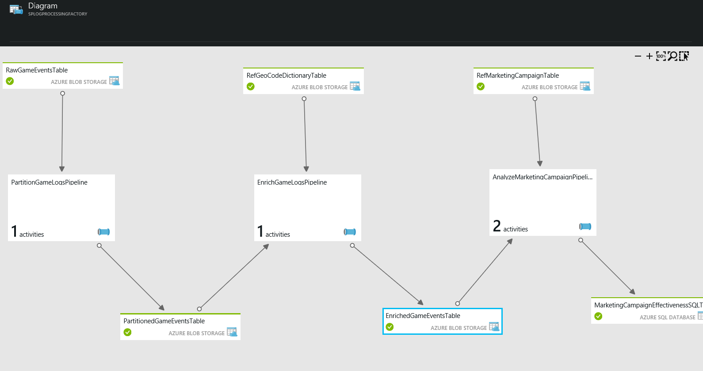

<properties 
	pageTitle="Use Case - Customer Profiling" 
	description="Learn how Azure Data Factory is used to create a data-driven workflow (pipeline) to profile gaming customers." 
	services="data-factory" 
	documentationCenter="" 
	authors="spelluru" 
	manager="jhubbard" 
	editor="monicar"/>

<tags 
	ms.service="data-factory" 
	ms.workload="data-services" 
	ms.tgt_pltfrm="na" 
	ms.devlang="na" 
	ms.topic="article" 
	ms.date="06/20/2016" 
	ms.author="spelluru"/>

# Use Case - Customer Profiling

Azure Data Factory is one of many services used to implement the Cortana Intelligence Suite of solution accelerators.  For more information about Cortana Intelligence, please visit [Cortana Intelligence Suite](http://www.microsoft.com/cortanaanalytics). In this document, we describe a simple use case to help you get started with understanding how Azure Data Factory can solve common analytics problems.

All you need to access and try out this simple use case is an [Azure subscription](https://azure.microsoft.com/pricing/free-trial/).  You can deploy a sample that implements this use case by following the steps described in the [Samples](data-factory-samples.md) article.

## Scenario

Contoso is a gaming company that creates games for multiple platforms: game consoles, hand held devices, and personal computers (PCs). As users play these games, large volumes of log data is produced that tracks the usage patterns, gaming style, and preferences of the user.  When combined with demographic, regional, and product data, Contoso can perform analytics to guide them about how to enhance each users’ experience and target them for upgrades and in-game purchases. 

Contoso’s goal is to identify up-sell and cross-sell opportunities based on the gaming history profile of its users and develop new compelling features to drive business growth and provide a better experience to customers. For this use case, we use a gaming company as an example of a business that wants to optimize for their users’ behavior, but these principles apply to any business that wants to engage its customers around its goods and services and enhance their customers’ experience.

## Challenges

There are many challenges that gaming companies face when trying to implement this type of use case. First, data of different sizes and shapes must be ingested from multiple data sources, both on-premises and in the cloud to capture product data, historical user behavior data, and user data as the user plays their games on multiple platforms. Second, game usage patterns must be reasonably and accurately calculated. Third, gaming companies need to measure the effectiveness of their approach by tracking overall up-sell and cross-sell profile-to-in-game-purchase successes, and make adjustments to their future marketing campaigns.

## Solution Overview

This simple use case can be used as an example of how you can use Azure Data Factory to ingest, prepare, transform, analyze, and publish data.

Figure above depicts how the data pipelines appear in the Azure Portal UI after they have been deployed.

1.	The **PartitionGameLogsPipeline** reads the raw game events from blob storage and creates partitions based on year, month, and day.
2.	The **EnrichGameLogsPipeline** joins partitioned game events with geo code reference data and enriches the data by mapping IP addresses to the corresponding geo-locations.
3.	The **AnalyzeMarketingCampaignPipeline** pipeline leverages the enriched data and processes it with the advertising data to create the final output that contains marketing campaign effectiveness.

In this example use case, Azure Data Factory is used to orchestrate activities that copy input data, transform and process the data with HDInsight Activities (Hive and Pig transformations) and output the final data to an Azure SQL Database.  You can also visualize the network of data pipelines, manage them, and monitor their status from the UI.

## Benefits

By optimizing their user profile analytics and aligning it with business goals, gaming company is able to quickly collect usage patterns, and analyze the effectiveness of its marketing campaigns for all of its different gaming products.

