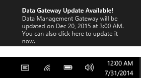
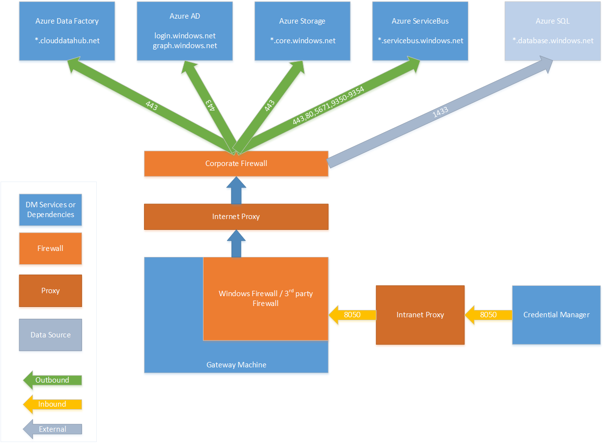
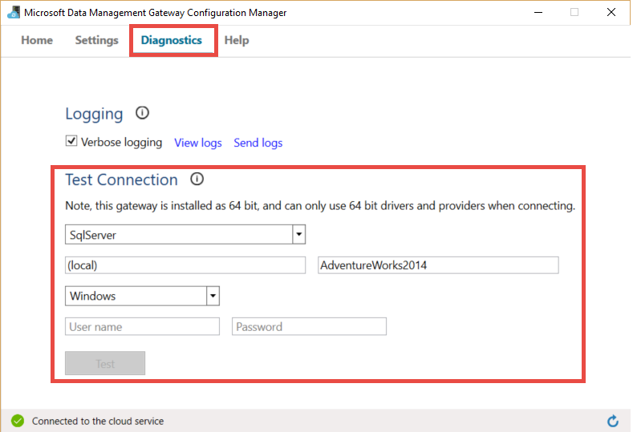
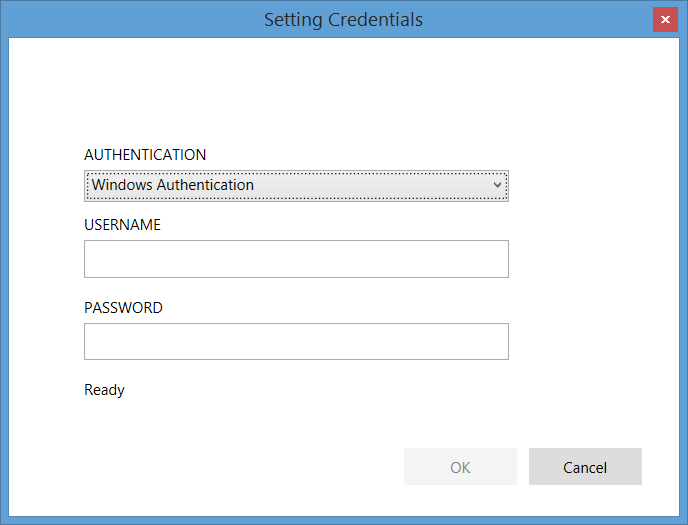

<properties 
	pageTitle="Data Management Gateway for Data Factory | Microsoft Azure"
	description="Set up a data gateway to move data between on-premises and the cloud. Use Data Management Gateway in Azure Data Factory to move your data." 
	services="data-factory" 
	documentationCenter="" 
	authors="spelluru" 
	manager="jhubbard" 
	editor="monicar"/>

<tags 
	ms.service="data-factory" 
	ms.workload="data-services" 
	ms.tgt_pltfrm="na" 
	ms.devlang="na" 
	ms.topic="article" 
	ms.date="07/08/2016" 
	ms.author="spelluru"/>

# Data Management Gateway
The Data Management Gateway is a client agent that you must install in your on-premises environment to enable movement of data between cloud and on-premises data stores that are [supported by the Copy Activity](data-factory-data-movement-activities.md##supported-data-stores).

This article complements the content in [Move data between on-premises and cloud data stores](data-factory-move-data-between-onprem-and-cloud.md) article, which has a walkthrough for creating a Data Factory pipeline that uses the gateway to move data from an on-premises SQL Server database to an Azure blob. This article provides detailed in-depth information about the Data Management Gateway.   

## Capabilities of Data Management gateway
Data Management Gateway provides the following capabilities:

- Model on-premises data sources and cloud data sources within the same data factory and move data.
- Have a single pane of glass for monitoring and management with visibility into gateway status from the Data Factory blade.
- Manage access to on-premises data sources securely.
	- No changes required to corporate firewall. Gateway only makes outbound HTTP based connections to open internet.
	- Encrypt credentials for your on-premises data stores with your certificate.
- Move data efficiently – data is transferred in parallel, resilient to intermittent network issues with auto retry logic.

## Data flow when using gateway
When you use a copy activity in a data pipeline to ingest on-premises data to cloud for further processing, or export result data in the cloud back to an on-premises data store, the copy activity internally uses a gateway to transfer data from on-premises data source to cloud and vice versa.

Here high level data flow for and summary of steps for copy with data gateway:

1.	Data developer creates a new gateway for an Azure Data Factory using either the [Azure Portal](https://portal.azure.com) or [PowerShell Cmdlet](https://msdn.microsoft.com/library/dn820234.aspx). 
2.	Data developer creates a linked service for an on-premises data store by specifying the gateway. As part of setting up the linked service, data developer uses the Setting Credentials application to specify authentication types and credentials.  The Setting Credentials application dialog communicates with the data store to test connection and the gateway to save credentials.
3. Gateway encrypts the credentials with the certificate associated with the gateway (supplied by data developer), before saving the credentials in the cloud.
4. Data Factory service communicates with the gateway for scheduling & management of jobs via a control channel that uses a shared Azure service bus queue. When a copy activity job needs to be kicked off, Data Factory queues the request along with credential information. Gateway kicks off the job after polling the queue.
5.	The gateway decrypts the credentials with the same certificate and then connects to the on-premises data store with proper authentication type and credentials.
6.	The gateway copies data from the on-premises store to a cloud storage, or from a cloud storage to an on-premises data store depending on how the Copy Activity is configured in the data pipeline. Note: For this step the gateway directly communicates with cloud based storage service (e.g. Azure Blob, Azure SQL etc) over a secure (HTTPS) channel.

## Considerations for using gateway
- A single instance of Data Management Gateway can be used for multiple on-premises data sources, but note that **a single gateway instance is tied to only one Azure data factory** and cannot be shared with another data factory.
- You can have **only one instance of Data Management Gateway** installed on a single machine. Suppose, you have two data factories that need to access on-premises data sources, you need to install gateways on two on-premises computers where each gateway tied to a separate data factory.
- The **gateway does not need to be on the same machine as the data source**, but staying closer to the data source reduces the time for the gateway to connect to the data source. We recommend that you install the gateway on a machine that is different from the one that hosts on-premises data source so that the gateway does not compete for resources with data source.
- You can have **multiple gateways on different machines connecting to the same on-premises data source**. For example, you may have two gateways serving two data factories but the same on-premises data source is registered with both the data factories.
- If you already have a gateway installed on your computer serving a **Power BI** scenario, please install a **separate gateway for Azure Data Factory** on another machine.
- You must **use the gateway even when you use ExpressRoute**.
- You should treat your data source as an on-premises data source (that is behind a firewall) even when you use **ExpressRoute** and **use the gateway** to establish connectivity between the service and the data source.
- You must **use the gateway** even if the data store is in the cloud on an **Azure IaaS VM**. 

## Install Data Management Gateway

### Gateway installation - prerequisites
- The supported **Operating System** versions are Windows 7, Windows 8/8.1,  Windows 10, Windows Server 2008 R2, Windows Server 2012, Windows Server 2012 R2. Installation of the Data Management Gateway on a domain controller is currently not supported.
- The recommended **configuration** for the gateway machine is at least 2 GHz, 4 cores, 8 GB RAM and 80 GB disk.
- If the host machine hibernates, the gateway won’t be able to respond to data requests. Therefore, configure an appropriate **power plan** on the computer before installing the gateway. The gateway installation prompts a message if the machine is configured to hibernate.
- You must be an administrator on the machine to install and configure the Data Management Gateway successfully. You can add additional users to the **Data Management Gateway Users** local Windows group. The members of this group will be able to use the Data Management Gateway Configuration Manager tool to configure the gateway. 

Due to the fact that copy activity runs happen on a specific frequency, the resource usage (CPU, memory) on the machine also follows the same pattern with peak and idle times. Resource utilization also depends heavily on the amount of data being moved. When multiple copy jobs are in progress you will observe resource usage go up during peak times. While above is the minimum configuration it is always better to have a configuration with more resources than the min configuration described above depending on your specific load for data movement.

### Installation
Data Management Gateway can be installed in the following ways: 

- By downloading an MSI setup package from the [Microsoft Download Center](https://www.microsoft.com/download/details.aspx?id=39717).  The MSI can also be used to upgrade existing Data Management Gateway to the latest version, with all settings preserved.
- By clicking **Download and install data gateway** link under MANUAL SETUP or **Install directly on this computer** under EXPRESS SETUP. See [Move data between on-premises and cloud](data-factory-move-data-between-onprem-and-cloud.md) article for step-by-step instructions on using express setup. The manual step takes you to the download center and the instructions for downloading and installing the gateway from download center are in the next section. 

### Installation best practices:
1.	Configure power plan on the host machine for the gateway so that the machine does not hibernate. If the host machine hibernates, the gateway won’t be able to respond to data requests.
2.	You should backup the certificate associated with the gateway.

### Install gateway from the download center
1. Navigate to [Microsoft Data Management Gateway download page](https://www.microsoft.com/download/details.aspx?id=39717). 
2. Click **Download**, select the appropriate version (**32-bit** vs. **64-bit**), and click **Next**. 
3. Run the **MSI** directly or save it to your hard disk and run.
4. On the **Welcome** page, select a **language** click **Next**.
5. **Accept** the End-User License Agreement and click **Next**. 
6. Select **folder** to install the gateway and click **Next**. 
7. On the **Ready to install** page, click **Install**. 
8. Click **Finish** to complete installation.
9. Get the key from the Azure Portal. See the next section for step-by-step instructions. 
10. On the **Register gateway** page of **Data Management Gateway Configuration Manager** running on your machine, paste the key in the text, optionally, click **Show gateway key** to see the key text, and click **Register**. 

### Get the key

#### If you haven't already created a logical gateway in the portal
Follow steps from walkthrough in the [Move data between on-premises and cloud](data-factory-move-data-between-onprem-and-cloud.md) article to create a new gateway in the portal and get the key from the **Configure** blade.   

#### If you have already created the logical gateway in the portal
1. In Azure Portal, navigate to the **Data Factory** blade, and click **Linked Services** tile.

	
2. In the **Linked Services** blade, select the logical **gateway** you created in the portal. 

	  
2. In the **Data Gateway** blade, click **Download and install data gateway**.

	   
3. In the **Configure** blade, click **Recreate key**. Click Yes on the warning message after reading it carefully.

	
4. Click Copy button next to the key to copy it to the clipboard.
	
	 

## Data Management Gateway Configuration Manager 
Once you install the gateway, you can launch Data Management Gateway Configuration Manager in one of the following ways: 

- In the **Search** window, type **Data Management Gateway** to access this utility. 
- Run the executable **ConfigManager.exe** in the folder: **C:\Program Files\Microsoft Data Management Gateway\1.0\Shared** 
 
### Home page
The Home page allows you do the following: 

- View status of the gateway; whether the gateway is connected to the cloud service or not. 
- **Register** using a key from the portal.
- **Stop** and start the **Data Management Gateway Host service** on the gateway machine.
- **Schedule updates** at a specific time of the days.
- View the date when the gateway was **last updated**. 

### Settings page
The Settings page allows you to do the following:

- View, change, and export **certificate** used by the gateway.
- Change **HTTPS port** for the endpoint. The gateway opens a port for setting the data source credentials. 
- **Status** of the endpoint
- View **SSL certificate** used to set credentials for data sources.  

### Diagnostics page
The Diagnostics page allows you do the following:

- Enable verbose **logging**, view logs in event viewer, and send logs to Microsoft in case of a failure.
- **Test connection** to a data source.  

### Help page
The Help page displays the following: 

- Brief description of the gateway
- Version number
- Links to online help, privacy statement, and license agreement.  

## System tray icons/ notifications
The following image shows some of the tray icons that you will see. 

If you move cursor over the system tray icon/notification message, you will see details about the state of the gateway/update operation in a popup window.

## Update Data Management Gateway
By default, Data Management Gateway is automatically updated when a newer version of the gateway is available. The gateway is not updated until all the scheduled tasks are done. No further tasks are processed by the gateway until the update operation is completed. If the update fails, gateway is rolled back to the old version. 

You will see the scheduled update time in the portal in the gateway properties blade, in the home page of the Data Management Gateway Configuration Manager, and in the system tray notification message. 

The Home tab of the Data Management Gateway Configuration Manager displays the update schedule as well as the last time the gateway was installed/updated. 

You have an option to install the update right away or wait for the gateway to be automatically updated at the scheduled time. For example, the following screen shot shows you the notification message shown in the Data Management Gateway Configuration Manager along with the Update button that you click to install it immediately. 

The notification message in the system tray would look like the following: 

You will see the status of update operation (manual or automatic) in the system tray. When you open  Data Management Gateway Configuration Manager next time, you will see a message on the notification bar that the gateway has been updated along with a link to the [what's new topic](data-factory-gateway-release-notes.md).

### To disable/enable auto-update feature
You can disable/enable the auto-update feature by doing the following: 

1. Launch Windows PowerShell on the gateway machine. 
2. Switch to the C:\Program Files\Microsoft Data Management Gateway\1.0\PowerShellScript folder.
3. Run the following command to turn the auto-update feature OFF (disable).   

		.\GatewayAutoUpdateToggle.ps1  -off

4. To turn it back on: 
	
		.\GatewayAutoUpdateToggle.ps1  -on  

## Port and security considerations
There are two firewalls you need to consider: **corporate firewall** running on the central router of the organization, and **Windows firewall** configured as a daemon on the local machine where the gateway is installed.  

## Connect gateway with cloud services
To maintain gateway’s connectivity with Azure Data Factory and other cloud services, you need to make sure that the outbound rule for **TCP** ports **80** and **443** are configured. And optionally enable ports **9350** to **9354**, which are used by Microsoft Azure Service Bus to establish connection between Azure Data Factory and the Data Management Gateway and may improve performance of communication between them.

At corporate firewall level,  you need configure the following domains and outbound ports:

| Domain names | Ports | Description |
| ------ | --------- | ------------ |
| *.servicebus.windows.net | 443, 80 | Listeners on Service Bus Relay over TCP (requires 443 for Access Control token acquisition) | 
| *.servicebus.windows.net | 9350-9354 | Optional service bus relay over TCP | 
| *.core.windows.net | 443 | HTTPS | 
| *.clouddatahub.net | 443 | HTTPS | 
| graph.windows.net | 443 | HTTPS |
| login.windows.net | 443 | HTTPS | 

At windows firewall level, these outbound ports are normally enabled. If not, you can configure the domains and ports accordingly on gateway machine.

## Set gateway credentials
The inbound port **8050** will be used by the **Setting Credentials** application to relay the credentials to the gateway when you set up an on-premises linked service in the Azure Portal (details later in the article). During gateway setup, by default, the Data Management Gateway installation opens it on the gateway machine.
 
In case of using a third party firewall, you can manually open the port 8050. If you run into firewall issue during gateway setup, you can try use the following command to install the gateway without configuring the firewall.

	msiexec /q /i DataManagementGateway.msi NOFIREWALL=1

If you choose not to open the port 8050 on the gateway machine, then to set up an on-premises linked service, you need to use mechanisms other than using the **Setting Credentials** application to configure the data store credentials. For example, you could use [New-AzureRmDataFactoryEncryptValue](https://msdn.microsoft.com/library/mt603802.aspx) PowerShell cmdlet. See [Setting Credentials and Security](#set-credentials-and-securityy) section on how data store credentials can be set.

**To copy data from a source data store to a sink data store:**

You need to make sure the firewall rules are enabled properly on the corporate firewall, Windows firewall on the gateway machine, and the data store itself. This enables the gateway to connect to both source and sink successfully. You need to enable rules for each data store that is involved in the copy operation.

For example, to copy from **an on-premises data store to an Azure SQL Database sink or an Azure SQL Data Warehouse sink**, you need to allow outbound **TCP** communication on port **1433** for both Windows firewall and cooperate firewall, and you need to configure the firewall settings of Azure SQL server to add the IP address of the gateway machine to the list of allowed IP addresses. 

### Proxy server considerations
By default, Data Management Gateway will leverage the proxy settings from Internet Explorer and use default credentials to access it. If it does not suit your case, you can further configure **proxy server settings** as shown below to ensure the gateway is able to connect to Azure Data Factory:

1.	After installing the Data Management Gateway, in File Explorer, make a safe copy of “C:\Program Files\Microsoft Data Management Gateway\1.0\Shared\diahost.exe.config” to back up the original file.
2.	Launch Notepad.exe running as administrator, and open text file “C:\Program Files\Microsoft Data Management Gateway\1.0\Shared\diahost.exe.config”. You will find the default tag for system.net as following:

			<system.net>
				<defaultProxy useDefaultCredentials="true" />
			</system.net>	

	You can then add the proxy server details e.g. proxy address inside that parent tag, for example:

			<system.net>
			      <defaultProxy enabled="true">
			            <proxy bypassonlocal="true" proxyaddress="http://proxy.domain.org:8888/" />
			      </defaultProxy>
			</system.net>

	Additional properties are allowed inside the proxy tag to specify the required settings like scriptLocation. Refer to [proxy Element (Network Settings)](https://msdn.microsoft.com/library/sa91de1e.aspx) on syntax.

			<proxy autoDetect="true|false|unspecified" bypassonlocal="true|false|unspecified" proxyaddress="uriString" scriptLocation="uriString" usesystemdefault="true|false|unspecified "/>

3. Save the configuration file into the original location, then restart the Data Management Gateway service to pick up the changes. You can do this from **Start** > **Services.msc**, or from the **Data Management Gateway Configuration Manager** > click the **Stop Service** button, then click the **Start Service**. If the service does not start, it is likely that an incorrect XML tag syntax has been added into the application configuration file that was edited. 	

In addition to above points, you also need to make sure Microsoft Azure is in your company’s whitelist. The list of valid Microsoft Azure IP addresses can be downloaded from the [Microsoft Download Center](https://www.microsoft.com/download/details.aspx?id=41653).

### Possible symptoms for firewall and proxy server related issues
If you encounter errors such as the following ones, it is likely because of the improper configuration of the firewall or proxy server, which blocks Data Management Gateway from connecting to Azure Data Factory to authenticate itself. Refer to above section to ensure your firewall and proxy server are properly configured.

1.	When you try to register the gateway, you receive the following error: "Failed to register the gateway key. Before trying to register the gateway key again, confirm that the Data Management Gateway is in a connected state and the Data Management Gateway Host Service is Started."
2.	When you open Configuration Manager, you see status as “Disconnected” or “Connecting”. When viewing Windows event logs, under “Event Viewer” > “Application and Services Logs” > “Data Management Gateway” you see error messages such as “Unable to connect to the remote server” or “A component of Data Management Gateway has become unresponsive and will restart automatically. Component name: Gateway.”

## Troubleshoot gateway issues

- You can find detailed information in gateway logs in Windows event logs. You can find them by using Windows **Event Viewer** under **Application and Services Logs** > **Data Management Gateway** While troubleshooting gateway related issues look for error level events in the event viewer.
- If the gateway stops working after you **change the certificate**, restart (stop and start) the **Data Management Gateway Service** using the Microsoft Data Management Gateway Configuration Manager tool or Services control panel applet. If you still see an error, you may have to give explicit permissions for the Data Management Gateway service user to access the certificate in Certificates Manager (certmgr.msc).  The default user account for the service is: **NT Service\DIAHostService**. 
- If the **Credential Manager** application fails to **encrypt** credentials when you click Encrypt button in Data Factory Editor, verify that you are running this application on the machine on which gateway is installed. If not, run the application on the gateway machine and try to encrypt credentials.  
- If you see data store connection or driver related errors, launch **Data Management Gateway Configuration Manager** on the gateway machine, switch to the **Diagnostics** tab, select/enter appropriate values for fields in the **Test connection to an on-premises data source using this gateway** group, and click **Test connection** to see if you can connect to on-premises data source  from the gateway machine using the connection information and credentials. If the test connection still fails after you install a driver, restart the gateway for it to pick up the latest change.  

	

### Send gateway logs to Microsoft
In cases you have gateway issues and you need to contact Microsoft Support, you may be asked to share your gateway logs. The release of the gateway allows you to easily share required gateway logs through two button clicks on gateway configuration manager.   

1. Switch to **Diagnostics** tab of gateway configuration manager.
 
	
2. Click **Send logs** link to see the following dialog box. 

	
3. (optional) Click **view logs** to review logs in the event viewer.
4. (optional) Click **privacy** to review Microsoft online services privacy statement. 
3. Once you are satisfied with what you are about to upload, click **Send logs** to actually send logs from last 7 days to Microsoft for troubleshooting. You should see the status of the Send logs operation as shown below.

	
4. Once the operation is complete, you will see a dialog box like below.
	
	
5. Please note down the **report ID** and share it with Microsoft Support. The report ID is used to locate your gateway logs you uploaded for troubleshooting.  The report ID is also saved in event viewer for your reference.  You can find it by looking at the event ID “25” and check the date and time.
	
		

### Archive gateway logs on gateway host machine
There are some scenarios where you have gateway issues and you cannot share gateway logs directly: 

- When users manually install the gateway and register the gateway;
- When users try register the gateway with a regenerated key on configuration manager; 
- When users try to send logs but gateway host service cannot be connected;

In such cases, you can save gateway logs as a zip file and share it when contacting Microsoft support later. For example, if you receive an error while registering the gateway as shown below:   

Click **Archive gateway** logs link to archive and save logs and then share the zip file with Microsoft support. 

 
## Move gateway from a machine to another
This section provides steps for moving gateway client from one machine to another machine. 

2. In the portal, navigate to the **Data Factory home page**, and click the **Linked Services** tile. 

	 
3. Select your gateway in the **DATA GATEWAYS** section of the **Linked Services** blade.
	
	
4. In the **Data gateway** blade, click **Download and install data gateway**.
	
	 
5. In the **Configure** blade, click **Download and install data gateway** and follow instructions to install the data gateway on the machine. 

	
6. Keep the **Microsoft Data Management Gateway Configuration Manager** open. 
 
		
7. In the **Configure** blade in the portal, click **Recreate key** on the command bar and click **Yes** for the warning message. Click **copy button** next to key text to copy the key to the clipboard. Note that the gateway on the old machine will stop functioning as soon you recreate the key.  
	
	
	 
8. Paste the **key** into text box in the **Register Gateway** page of the **Data Management Gateway Configuration Manager** on your machine. (optional) Click **Show gateway key** check box to see the key text. 
 
	
9. Click **Register** to register the gateway with the cloud service.
10. On the **Settings** tab, click **Change** to select the same certificate that was used with the old gateway, enter the **password**, and click **Finish**. 
 
	

	You can export a certificate from the old gateway by doing the following: launch Data Management Gateway Configuration Manager on the old machine, switch to the **Certifcate** tab, click **Export** button and follow the instructions. 
10. After successful registration of the gateway, you should see the **Registration** set to **Registered** and **Status** set to **Started** on the Home page of the Gateway Configuration Manager. 

## Set credentials and security
To encrypt credentials in the Data Factory Editor, do the following:

1. Launch web browser on the **gateway machine**, navigate to [Azure Portal](http://portal.azure.com), search for your data factory if needed, open data factory in the **DATA FACTORY** blade and then click **Author & Deploy** to launch Data Factory Editor.   
1. Click an existing **linked service** in the tree view to see its JSON definition or create a new linked service that requires a Data Management Gateway (for example: SQL Server or Oracle). 
2. In the JSON editor, for the **gatewayName** property, enter the name of the gateway. 
3. Enter server name for the **Data Source** property in the **connectionString**.
4. Enter database name for the **Initial Catalog** property in the **connectionString**.    
5. Click **Encrypt** button on the command bar to launch the click-once **Credential Manager** application. You should see the **Setting Credentials** dialog box. 
	
6. In the **Setting Credentials** dialog box, do the following:  
	1.	Select **authentication** that you want the Data Factory service to use to connect to the database. 
	2.	Enter name of the user who has access to the database for the **USERNAME** setting. 
	3.	Enter password for the user for the **PASSWORD** setting.  
	4.	Click **OK** to encrypt credentials and close the dialog box. 
5.	You should see a **encryptedCredential** property in the **connectionString** now.		
		
			{
	    		"name": "SqlServerLinkedService",
		    	"properties": {
		        	"type": "OnPremisesSqlServer",
			        "description": "",
		    	    "typeProperties": {
		    	        "connectionString": "data source=myserver;initial catalog=mydatabase;Integrated Security=False;EncryptedCredential=eyJDb25uZWN0aW9uU3R",
		            	"gatewayName": "adftutorialgateway"
		        	}
		    	}
			}

If you access the portal from a machine that is different from the gateway machine, you must make sure that the Credentials Manager application can connect to the gateway machine. If the application cannot reach the gateway machine, it will not allow you to set credentials for the data source and to test connection to the data source.  

When you use the **Setting Credentials** application launched from Azure Portal to set credentials for an on-premises data source, the portal encrypts the credentials with the certificate you specified in the **Certificate** tab of the **Data Management Gateway Configuration Manager** on the gateway machine. 

If you are looking for an API based approach for encrypting the credentials you can  use the [New-AzureRmDataFactoryEncryptValue](https://msdn.microsoft.com/library/mt603802.aspx) PowerShell cmdlet to encrypt credentials. The cmdlet uses the certificate that gateway is configured to use to encrypt the credentials. You can the encrypted credentials returned by this cmdlet and add it to **EncryptedCredential** element of the **connectionString** in the JSON file that you will use with the [New-AzureRmDataFactoryLinkedService](https://msdn.microsoft.com/library/mt603647.aspx) cmdlet or in the JSON snippet in the Data Factory Editor in the portal. 

	"connectionString": "Data Source=<servername>;Initial Catalog=<databasename>;Integrated Security=True;EncryptedCredential=<encrypted credential>",

There is one more approach for setting credentials using Data Factory Editor. If you create a SQL Server linked service by using the editor and you enter credentials in plain text, the credentials are encrypted using a certificate that the Data Factory service owns, NOT the certificate that gateway is configured to use. While this approach might be a little faster in some cases it is less secure. Therefore, we recommend that you follow this approach only for development/testing purposes. 

## PowerShell cmdlets 
This section describes how to create and register a gateway using Azure PowerShell cmdlets. 

1. Launch **Azure PowerShell** in administrator mode. 
2. Log in to your Azure account by running the following command and entering your Azure credentials. 

	Login-AzureRmAccount
2. Use the **New-AzureRmDataFactoryGateway** cmdlet to create a logical gateway as follows:

		$MyDMG = New-AzureRmDataFactoryGateway -Name <gatewayName> -DataFactoryName <dataFactoryName> -ResourceGroupName ADF –Description <desc>

	**Example command and output**:

		PS C:\> $MyDMG = New-AzureRmDataFactoryGateway -Name MyGateway -DataFactoryName $df -ResourceGroupName ADF –Description “gateway for walkthrough”

		Name              : MyGateway
		Description       : gateway for walkthrough
		Version           :
		Status            : NeedRegistration
		VersionStatus     : None
		CreateTime        : 9/28/2014 10:58:22
		RegisterTime      :
		LastConnectTime   :
		ExpiryTime        :
		ProvisioningState : Succeeded
		Key               : ADF#00000000-0000-4fb8-a867-947877aef6cb@fda06d87-f446-43b1-9485-78af26b8bab0@4707262b-dc25-4fe5-881c-c8a7c3c569fe@wu#nfU4aBlq/heRyYFZ2Xt/CD+7i73PEO521Sj2AFOCmiI

	
4. In Azure PowerShell, switch to the folder: **C:\Program Files\Microsoft Data Management Gateway\1.0\PowerShellScript\** and Run **RegisterGateway.ps1** script associated with the local variable **$Key** as shown in the following command to register the client agent installed on your machine with the logical gateway you create earlier.

		PS C:\> .\RegisterGateway.ps1 $MyDMG.Key
		
		Agent registration is successful!

	You can register the gateway on a remote machine by using the IsRegisterOnRemoteMachine parameter. Example:
		
		.\RegisterGateway.ps1 $MyDMG.Key -IsRegisterOnRemoteMachine true

5. You can use the **Get-AzureRmDataFactoryGateway** cmdlet to get the list of Gateways in your data factory. When the **Status** shows **online**, it means your gateway is ready to use.

		Get-AzureRmDataFactoryGateway -DataFactoryName <dataFactoryName> -ResourceGroupName ADF

You can remove a gateway using the **Remove-AzureRmDataFactoryGateway** cmdlet and update description for a gateway using the **Set-AzureRmDataFactoryGateway** cmdlets. For syntax and other details about these cmdlets, see Data Factory Cmdlet Reference.  

### List gateways using PowerShell

	Get-AzureRmDataFactoryGateway -DataFactoryName jasoncopyusingstoredprocedure -ResourceGroupName ADF_ResourceGroup

### Remove gateway using PowerShell
	
	Remove-AzureRmDataFactoryGateway -Name JasonHDMG_byPSRemote -ResourceGroupName ADF_ResourceGroup -DataFactoryName jasoncopyusingstoredprocedure -Force 

## Next Steps
- See [Data Management Gateway](data-factory-data-management-gateway.md) article for detailed information about the gateway. 
