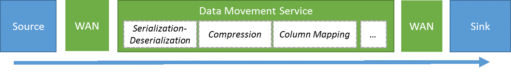
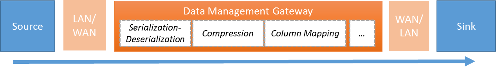

<properties 
	pageTitle="Data movement activities | Microsoft Azure" 
	description="Learn about data movement in Data Factory pipelines: data migration between cloud stores, between on-premises and cloud. Use the Copy Activity." 
	keywords="data movement, data migration, copy data, transfer data"
	services="data-factory" 
	documentationCenter="" 
	authors="spelluru" 
	manager="jhubbard" 
	editor="monicar"/>

<tags 
	ms.service="data-factory" 
	ms.workload="data-services" 
	ms.tgt_pltfrm="na" 
	ms.devlang="na" 
	ms.topic="article" 
	ms.date="07/11/2016" 
	ms.author="spelluru"/>

# Data movement and the Copy Activity: migrating data to the cloud and between cloud stores

## Overview
Data movement from a source to a sink (destination) is performed by the [Copy Activity](#copyactivity) in Azure Data Factory. Copy Activity copies data from one input dataset (**source**) to one output dataset (**sink**). Data copy is done in a batch fashion according to the schedule specified on the activity. To learn about defining activities in general, see [Understanding Pipelines & Activities](data-factory-create-pipelines.md) article.

The Copy Activity is powered by a secure, reliable, scalable, and [globally available service](#global). The service automatically chooses the optimal region to perform the data movement, usually the region closest to the sink data store.

Here’s how data migration occurs between two cloud data stores, and between an on-premises data store and a cloud data store

### Copy data between two cloud data stores
When both the source and sink (destination) data stores reside in the cloud, the copy Activity goes through the following stages to copy/move data from the source to the sink. The service that powers the Copy Activity performs the following: 

1. Reads data from source data store
2. Performs serialization/deserialization, compression/decompression, column mapping, and type conversion based on the configurations of input dataset, output dataset and the Copy Activity 
3.	Writes data to the destination data store

### Copy data between an on-premises data store and a cloud data store
To securely move data between on-premises data stores behind your corporate firewall and a cloud data store, you will need to install the Data Management Gateway, which is an agent that enables hybrid data movement and processing, on your on-premises machine. The Data Management Gateway can be installed on the same machine as the data store itself or on a separate machine that has access to reach the data store. In this scenario, the serialization/deserialization, compression/decompression, column mapping, and type conversion are performed by the Data Management Gateway. Data does not flow through Azure Data Factory service is such case. Data Management Gateway directly writes the data to the destination store. 

See [Move data between on-premises and cloud data stores](data-factory-move-data-between-onprem-and-cloud.md) article for an introduction and a walkthrough and [Data Management Gateway](data-factory-data-management-gateway.md) article for detailed information on Data Management Gateway.

You can also move data from/to supported data stores hosted on Azure IaaS VMs (Infrastructure-as-a-Service virtual machines) using the Data Management Gateway. In this case, the Data Management Gateway can be installed on the same Azure VM as the data store itself or on a separate VM that has access to reach the data store. 

## Supported data stores
Copy Activity copies data from a **source** data store to a **sink** data store. Data factory supports the following data stores and **data from any source can be written to any sink**. Click on a data store to learn how to copy data from/to that store. 

| Sources| Sinks |
|:------- | :---- |
| <ul><li>[Azure Blob](data-factory-azure-blob-connector.md)</li><li>[Azure Table](data-factory-azure-table-connector.md)</li><li>[Azure SQL Database](data-factory-azure-sql-connector.md)</li><li>[Azure SQL Data Warehouse](data-factory-azure-sql-data-warehouse-connector.md)</li><li>[Azure DocumentDB](data-factory-azure-documentdb-connector.md)</li><li>[Azure Data Lake Store](data-factory-azure-datalake-connector.md)</li><li>[OData sources](data-factory-odata-connector.md)</li><li>[Web table (table from HTML)](data-factory-web-table-connector.md)</li><li>[GE Historian On-premises/Azure IaaS](data-factory-odbc-connector.md#ge-historian-store)</li><li>[Salesforce](data-factory-salesforce-connector.md)</li><li>[SQL Server On-premises/Azure IaaS](data-factory-sqlserver-connector.md)</li><li>[File System On-premises/Azure IaaS](data-factory-onprem-file-system-connector.md)</li><li>[Oracle Database On-premises/Azure IaaS](data-factory-onprem-oracle-connector.md)</li><li>[MySQL Database On-premises/Azure IaaS ](data-factory-onprem-mysql-connector.md)</li><li>[DB2 Database On-premises/Azure IaaS](data-factory-onprem-db2-connector.md)</li><li>[Teradata Database On-premises/Azure IaaS ](data-factory-onprem-teradata-connector.md)</li><li>[Sybase Database On-premises/Azure IaaS](data-factory-onprem-sybase-connector.md)</li><li>[PostgreSQL Database On-premises/Azure IaaS](data-factory-onprem-postgresql-connector.md)</li><li>[ODBC data sources on-premises/Azure IaaS](data-factory-odbc-connector.md)</li><li>[Hadoop Distributed File System (HDFS) On-premises/Azure IaaS](data-factory-hdfs-connector.md)</li><li>[Cassandra Database On-premises/Azure IaaS](data-factory-onprem-cassandra-connector.md)</li></ul> | <ul><li>[Azure Blob](data-factory-azure-blob-connector.md)</li><li>[Azure Table](data-factory-azure-table-connector.md)</li><li>[Azure SQL Database](data-factory-azure-sql-connector.md)</li><li>[Azure SQL Data Warehouse](data-factory-azure-sql-data-warehouse-connector.md)</li><li>[Azure DocumentDB](data-factory-azure-documentdb-connector.md)</li><li>[Azure Data Lake Store](data-factory-azure-datalake-connector.md)</li><li>[SQL Server On-premises/Azure IaaS](data-factory-sqlserver-connector.md)</li><li>[File System On-premises/Azure IaaS](data-factory-onprem-file-system-connector.md)</li><li>[Oracle Database On-premises/Azure IaaS](data-factory-onprem-oracle-connector.md)</li></ul> |

If you need to move data to/from a data store that is not supported by the **Copy Activity**, you may use the **custom activity** in Data Factory with your own logic for copying/moving the data. See [Use custom activities in an Azure Data Factory pipeline](data-factory-use-custom-activities.md) article for details on creating and using a custom activity.

Copy Activity supports a variety of file formats including binary (images, documents, music, etc...), text, Avro, ORC, and JSON formats for file based stores. However, it can only read internal contents of structured files in Text, Avro, ORC, JSON files. You can use the Copy Activity to convert data from one format to another. Example: text (CSV) to Avro.  If the data is unstructured, you can omit the **Structure** property in the JSON definition of the [dataset](data-factory-create-datasets.md). 

## Globally available data movement
The service powering the Copy Activity is available globally in the following regions and geographies even though the Azure Data Factory itself is available only in the West US, East US, and North Europe regions. The globally available topology ensures efficient data movement avoiding cross-region hops in most cases.

The **Data Management Gateway** or the **Azure Data Factory** performs data movement based on the location of source and destination data stores in a copy operation. See the following table for details:  

Source data store location | Destination data store location | Data movement is performed by  
-------------------------- | ------------------------------- | ----------------------------- 
on-premises/Azure VM (IaaS) | cloud |  **Data Management Gateway** on an on-premises computer/Azure VM. The data does not flow through the service in the cloud.   Note: The Data Management Gateway can be on the same on-premises computer/Azure VM as the data store or on a different on-premises computer/Azure VM as long as it can connect to both data stores.
cloud | on-premises/Azure VM (IaaS) |  Same as above. 
on-premises/Azure VM (IaaS) | on-premises/Azure VM | **Data Management Gateway associated with the source**. The data does not flow through the service in the cloud. See the note above.   
cloud | cloud | **The cloud service that powers the Copy Activity**. Azure Data Factory uses the deployment of this service in the region that is closest to the sink location in the same geography. Refer to the following table for mapping:   <table><tr><th>Region of the destination data store</th> <th>Region used for data movement</th></tr><tr><td>East US</td><td>East US</td></tr><tr><td>East US 2</td><td>East US 2</td><tr/><tr><td>Central US</td><td>Central US</td><tr/><tr><td>West US</td><td>West US</td></tr><tr><td>North Central US</td><td>North Central US</td></tr><tr><td>South Central US</td><td>South Central US</td></tr><tr><td>North Europe</td><td>North Europe</td></tr><tr><td>West Europe</td><td>West Europe</td></tr><tr><td>Southeast Asia</td><td>South East Asia</td></tr><tr><td>East Asia</td><td>South East Asia</td></tr><tr><td>Japan East</td><td>Japan East</td></tr><tr><td>Japan West</td><td>Japan East</td></tr><tr><td>Brazil South</td><td>Brazil South</td></tr><tr><td>Australia East</td><td>Australia East</td></tr><tr><td>Australia Southeast</td><td>Australia Southeast</td></tr></table>

> [AZURE.NOTE] If the region of the destination data store is not in the list above, the Copy Activity will fail instead of going through an alternative region. 

## Create pipeline with copy activity 
You can create a pipeline with a copy activity in a couple of ways: 

### Using JSON scripts
You can use Data Factory Editor in Azure Portal (or) Visual Studio (or) Azure PowerShell to create a JSON definition for a pipeline with copy activity and deploy it to create the pipeline in Data Factory. See [Tutorial: Use Copy Activity in an Azure Data Factory Pipeline](data-factory-copy-data-from-azure-blob-storage-to-sql-database.md) for a tutorial with step-by-step instructions.    

JSON properties like name, description, input and output tables, policies etc are available for all types of activities. Properties available in the **typeProperties** section of the activity on the other hand vary with each activity type. 

In case of Copy Activity, the **typeProperties** section varies depending on the types of sources and sinks. Click on a source/sink in the [Supported Sources/Sinks](#supported-data-stores) section to learn about type properties supported by the Copy Activity for that data store.   

Here is a sample JSON definition: 

	{
	  "name": "ADFTutorialPipeline",
	  "properties": {
	    "description": "Copy data from Azure blob to Azure SQL table",
	    "activities": [
	      {
	        "name": "CopyFromBlobToSQL",
	        "type": "Copy",
	        "inputs": [
	          {
	            "name": "InputBlobTable"
	          }
	        ],
	        "outputs": [
	          {
	            "name": "OutputSQLTable"
	          }
	        ],
	        "typeProperties": {
	          "source": {
	            "type": "BlobSource"
	          },
	          "sink": {
	            "type": "SqlSink",
	            "writeBatchSize": 10000,
	            "writeBatchTimeout": "60:00:00"
	          }
	        },
	        "Policy": {
	          "concurrency": 1,
	          "executionPriorityOrder": "NewestFirst",
	          "retry": 0,
	          "timeout": "01:00:00"
	        }
	      }
	    ],
	    "start": "2016-07-12T00:00:00Z",
	    "end": "2016-07-13T00:00:00Z"
	  }
	} 

### Using Copy Wizard
The **Data Factory Copy Wizard** allows you to create a pipeline with a copy activity to copy data from supported sources to destinations **without writing JSON** definitions for linked services, datasets, and pipelines. See [Data Factory Copy Wizard](data-factory-copy-wizard.md) tutorial for details about the wizard. 

## Performance & Tuning 
See [Copy Activity Performance & Tuning Guide](data-factory-copy-activity-performance.md) article, which describes key factors that impact performance of data movement (Copy Activity) in Azure Data Factory. It also lists the observed performance during internal testing, and discusses various ways to optimize the performance of the Copy Activity.

## Type conversions across different type systems
Different data stores have different native type systems. Copy Activity performs automatic type conversions from source types to sink types with the following 2 step approach:

1. Convert from native source types to .NET type
2. Convert from .NET type to native sink type

You can find the mapping for a given native type system to .NET for the data store in the respective data store specific articles (click respective link in  the [Supported data stores](#supported-data-stores) table). You can use these mappings to determine appropriate types while creating your tables so that right conversions are performed during Copy Activity.

## Scheduling and ordered copy

## Scheduling
See [Scheduling and Execution](data-factory-scheduling-and-execution.md) article for detailed information about how scheduling and execution works in  Data Factory. 

It is possible to run multiple copy operations one after another in a sequential/ordered manner. See [Ordered copy](data-factory-scheduling-and-execution.md#ordered-copy) section in the article. 
 
## Next Steps
- See [Copy data from Azure Blob to Azure SQL](data-factory-copy-data-from-azure-blob-storage-to-sql-database.md) to learn about how to use Copy Activity to move data from a source data store to a sink data store in general. 
- See [Move data from on-premises to cloud data stores](data-factory-move-data-between-onprem-and-cloud.md) to learn about moving data from an on-premises data store to a cloud data store. 
 
