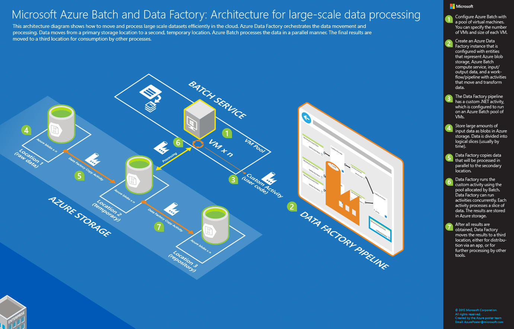
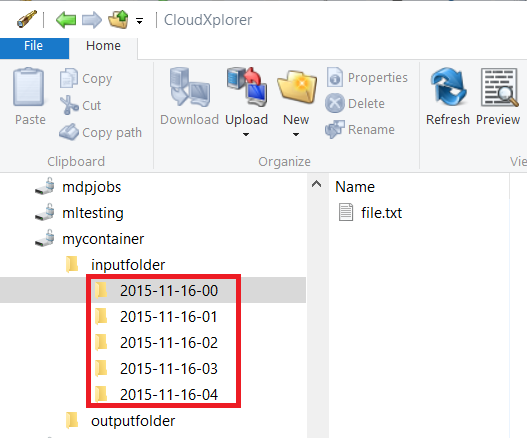
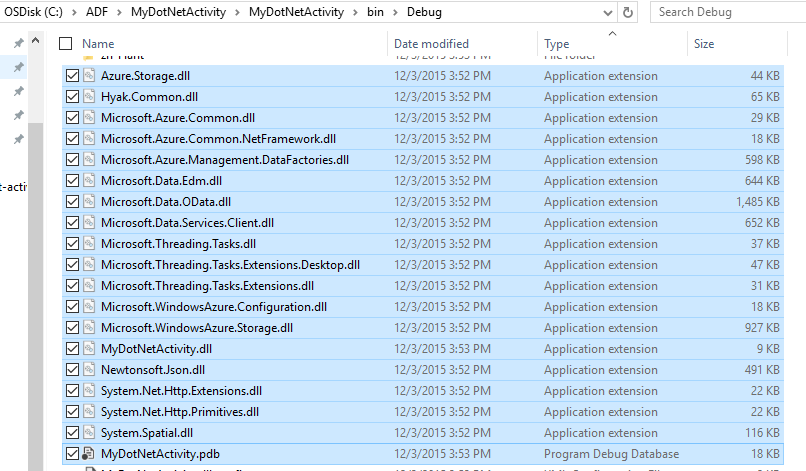
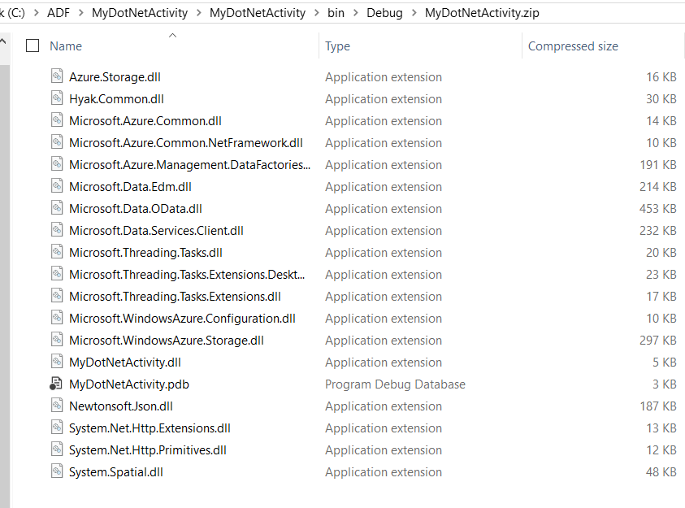

<properties
    pageTitle="Large-scale data processing using Data Factory and Batch | Microsoft Azure"
    description="Describes how to process huge amounts of data in an Azure Data Factory pipeline by using parallel processing capability of Azure Batch."
    services="data-factory"
    documentationCenter=""
    authors="spelluru"
    manager="jhubbard"
    editor="monicar"/>

<tags
    ms.service="data-factory"
    ms.workload="data-services"
    ms.tgt_pltfrm="na"
    ms.devlang="na"
    ms.topic="article"
    ms.date="07/18/2016"
    ms.author="spelluru"/>

# Automate processing of large-scale datasets using Data Factory and Batch
This article describes an architecture of a sample solution that moves and processes large-scale datasets in an automatic and scheduled manner. It also provides an end-to-end walkthrough to implement the solution using Azure Data Factory and Azure Batch. This article is longer than our typical article because it contains walkthrough of an entire sample solution. 

## Why Azure Batch?
Azure Batch provides high performance computing (HPC) as a service to configure as many computers as you need, and to schedule and coordinate the work. When processing large datasets, you can either configure the number of virtual machines (VM) you want to use for processing the data (or) configure the Batch pool to automatically scale out or scale in by adding or removing VMs to/from the pool based on the workload. See the following articles if you are not familiar with Azure Batch. 

- [Basics of Azure Batch](batch-technical-overview.md)
- [Batch feature overview](batch-api-basics.md)

To learn more about Azure Batch, see the [Learning path for Azure Batch](https://azure.microsoft.com/documentation/learning-paths/batch/).

## Why Azure Data Factory
Azure Data Factory provides data integration as a service in the cloud. You can create data-driven workflows to move and process data and schedule the workflows to run periodically (hourly, daily, weekly etc...). See the following articles if you are not familiar with the Data Factory service. 

- [Introduction of Azure Data Factory](data-factory-introduction.md)
- [Build your first data pipeline](data-factory-build-your-first-pipeline.md)   

To learn more about Azure Data Factory, see the [Learning path for Azure Data Factory](https://azure.microsoft.com/documentation/learning-paths/data-factory/).

## Data Factory and Batch together
Data Factory includes built-in activities such as Copy Activity to copy/move data from a source data store to a destination data store and Hive Activity to process data using Hadoop clusters (HDInsight) on Azure. It also allows you to create custom .NET activities to move or process data in your own manner and then run these activities on a HDInsight cluster or on Azure Bach pool of VMs. When you use Azure Batch, you can configure the pool to auto-scale (add or remove VMs based on the workload) based on a formula you provide.     

## Architecture of sample solution
The architecture is relevant to many scenarios such as risk modeling by financial services, image processing and rendering, and genomic analysis. 

The diagram illustrates 1) how Data Factory orchestrates data movement and processing and 2) how Azure Batch processes the data in a parallel manner. Download and print the diagram for easy reference (11 x 17 in. or A3 size): [HPC and data orchestration using Azure Batch and Data Factory](http://go.microsoft.com/fwlink/?LinkId=717686).

These are the basic steps of the process. The solution includes code and explanations to build the end-to-end solution.

1.  Configure Azure Batch with a pool of compute nodes (VMs). You can specify the number of nodes and size of each node.

2.  Create an Azure Data Factory instance that is configured with entities that represent Azure blob storage, Azure Batch compute service, input/output data, and a workflow/pipeline with activities that move and transform data.

3.  The Data Factory pipeline has a custom .NET activity, which is configured to run on Azure Batch pool of nodes.

4.  Store large amounts of input data as blobs in Azure storage. Data is divided into logical slices (usually by time).

5.  Data Factory copies data that will be processed in parallel to the secondary location.

6.  Data Factory runs the custom activity using the pool allocated by Batch. Data Factory can run activities concurrently. Each activity processes a slice of data. The results are stored in Azure storage.

7.  After all results are obtained, Data Factory moves the results to a third location, either for distribution via an app, or for further processing by other tools.

## Implementation of sample solution
The sample solution is intentionally simple and is to show you how to use Data Factory and Batch together to process a dataset. The solution simply counts the number of occurrences of a search term (“Microsoft”) in input files organized in a time series. It outputs the count to output files.

**Time**: If you are familiar with basics of Azure, Data Factory, and Batch, and have completed the prerequisites listed below, we estimate this solution will take 1-2 hours to complete.

## Prerequisites

1.  **Azure subscription**. If you don't have an Azure subscription, you can create a free trial account in just a couple of minutes. See [Free Trial](https://azure.microsoft.com/pricing/free-trial/).

2.  **Azure storage account**. You will use an Azure storage account for storing the data in this tutorial. If you don't have an Azure storage account, see [Create a storage account](../storage/storage-create-storage-account.md#create-a-storage-account). The sample solution uses blob storage.

3.  Create an **Azure Batch account** using the [Azure Portal](http://manage.windowsazure.com/). See [Create and manage an Azure Batch account](../batch/batch-account-create-portal.md). Note the Azure Batch account name and account key. You can also use [New-AzureRmBatchAccount](https://msdn.microsoft.com/library/mt603749.aspx) cmdlet to create an Azure Batch account. See [Get started with Azure Batch PowerShell cmdlets](../batch/batch-powershell-cmdlets-get-started.md) for detailed instructions on using this cmdlet.

    The sample solution uses Azure Batch (indirectly via an Azure Data Factory pipeline) to process data in a parallel manner on a pool of compute nodes, which is a managed collection of virtual machines.

4.  Create an **Azure Batch pool** with at least 2 compute nodes.
	1.  In the [Azure Portal](https://portal.azure.com), click **Browse** in the left menu, and click **Batch Accounts**. 
	2. Select your Azure Batch account to open the **Batch Account** blade. 
	3. Click **Pools** tile.
	4. In the **Pools** blade, click Add button on the toolbar to add a pool.
		1. Enter an ID for the pool (**Pool ID**). Note the **ID of the pool**; you will need it when creating the Data Factory solution. 
		2. Specify **Windows Server 2012 R2** for the Operating System Family setting.
		3. Select a **node pricing tier**. 
		3. Enter **2** as value for the **Target Dedicated** setting.
		4. Enter **2** as value for the **Max tasks per node** setting.
	5. Click **OK** to create the pool. 
 	 
5.  [Azure Storage Explorer 6 (tool)](https://azurestorageexplorer.codeplex.com/) or [CloudXplorer](http://clumsyleaf.com/products/cloudxplorer) (from ClumsyLeaf Software). These are GUI tools for inspecting and altering the data in your Azure Storage projects including the logs of your cloud-hosted applications.

    1.  Create a container named **mycontainer** with private access (no anonymous access)

    2.  If you are using **CloudXplorer**, create folders and subfolders with the following structure:

 		

		 **Inputfolder** and **outputfolder** are top-level folders in **mycontainer,** and the **inputfolder** has subfolders with date-time stamps (YYYY-MM-DD-HH).

		 If you are using **Azure Storage Explorer**, in the next step, you will need to upload files with names: inputfolder/2015-11-16-00/file.txt, inputfolder/2015-11-16-01/file.txt and so on. This will automatically create the folders.

	3.  Create a text file **file.txt** on your machine with content that has the keyword **Microsoft**. For example: “test custom activity Microsoft test custom activity Microsoft”.

	4.  Upload the file to the following input folders in Azure blob storage.

		

	 	If you are using **Azure Storage Explorer**, upload the file **file.txt** to **mycontainer**. Click **Copy** on the toolbar to create a copy of the blob. In the **Copy Blob** dialog box, change the **destination blob name** to **inputfolder/2015-11-16-00/file.txt.** Repeat this step to create inputfolder/2015-11-16-01/file.txt, inputfolder/2015-11-16-02/file.txt, inputfolder/2015-11-16-03/file.txt, inputfolder/2015-11-16-04/file.txt and so on. This will automatically create the folders.

	3.  Create another container named: **customactivitycontainer**. You will upload the custom activity zip file to this container.

6.  **Microsoft Visual Studio 2012 or later** (to create the custom Batch activity to be used in the Data Factory solution).

## High-level steps to create the solution

1.  Create a custom activity to use in the Data Factory solution. The custom activity contains the data processing logic.

    1.  In Visual Studio (or code editor of choice), create a .NET Class Library project, add the code to process input data, and compile the project.

    2.  Zip all the binary files and the PDB (optional) file in the output folder.

    3.  Upload the zip file to Azure blob storage.

	Detailed steps are in the [Create the custom activity](#_Coding_the_custom) section.

2.  Create an Azure data factory that uses the custom activity:

    1.  Create an Azure data factory.

    2.  Create linked services.

        1.  StorageLinkedService: Supplies storage credentials for accessing blobs.

        2.  AzureBatchLinkedService: specifies Azure Batch as compute.

    3.  Create datasets.

        1.  InputDataset: specifies storage container and folder for the input blobs.

        2.  OuputDataset: specifies storage container and folder for the output blobs.

    4.  Create a pipeline that uses the custom activity.

    5.  Run and test the pipeline.

    6.  Debug the pipeline.

 	Detailed steps are in the [Create the data factory](#create-the-data-factory) section.

## Create the custom activity

The Data Factory custom activity is the heart of this sample solution. The sample solution uses Azure Batch to run the custom activity. See [Use custom activities in an Azure Data Factory pipeline](data-factory-use-custom-activities.md) for the basic information to develop custom activities and use them in Azure Data Factory pipelines.

To create a .NET custom activity that you can use in an Azure Data Factory pipeline, you need to create a **.NET Class Library** project with a class that implements that **IDotNetActivity** interface. This interface has only one method: **Execute**. Here is the signature of the method:

	public IDictionary<string, string> Execute(
	            IEnumerable<LinkedService> linkedServices,
	            IEnumerable<Dataset> datasets,
	            Activity activity,
	            IActivityLogger logger)

The method has a few key components that you need to understand.

-   The method takes four parameters:

    1.  **linkedServices**. This is an enumerable list of linked services that link input/output data sources (for example: Azure Blob Storage) to the data factory. In this sample, there is only one linked service of type Azure Storage used for both input and output.

    2.  **datasets**. This is an enumerable list of datasets. You can use this parameter to get the locations and schemas defined by input and output datasets.

    3.  **activity**. This parameter represents the current compute entity - in this case, an Azure Batch service.

    4.  **logger**. The logger lets you write debug comments that will surface as the “User” log for the pipeline.

-   The method returns a dictionary that can be used to chain custom activities together in the future. This feature is not implemented yet, so just return an empty dictionary from the method. 

### Procedure: Create the custom activity

1.  Create a .NET Class Library project in Visual Studio.

    1.  Launch **Visual Studio 2012**/**2013/2015**.

    2.  Click **File**, point to **New**, and click **Project**.

    3.  Expand **Templates**, and select **Visual C\#**. In this walkthrough, you use C\#, but you can use any .NET language to develop the custom activity.

    4.  Select **Class Library** from the list of project types on the right.

    5.  Enter **MyDotNetActivity** for the **Name**.

    6.  Select **C:\\ADF** for the **Location**. Create the folder **ADF** if it does not exist.

    7.  Click **OK** to create the project.

2.  Click **Tools**, point to **NuGet Package Manager**, and click **Package Manager Console**.

3.  In the **Package Manager Console**, execute the following command to import **Microsoft.Azure.Management.DataFactories**.

			Install-Package Microsoft.Azure.Management.DataFactories

4.  Import the **Azure Storage** NuGet package in to the project. You will need this package because you will be using the Blob storage API.

		Install-Package Azure.Storage

5.  Add the following **using** directives to the source file in the project.

		using System.IO;
		using System.Globalization;
		using System.Diagnostics;
		using System.Linq;

		using Microsoft.Azure.Management.DataFactories.Models;
		using Microsoft.Azure.Management.DataFactories.Runtime;

		using Microsoft.WindowsAzure.Storage;
		using Microsoft.WindowsAzure.Storage.Blob;

6.  Change the name of the **namespace** to **MyDotNetActivityNS**.

		namespace MyDotNetActivityNS

7.  Change the name of the class to **MyDotNetActivity** and derive it from the **IDotNetActivity** interface as shown below.

		public class MyDotNetActivity : IDotNetActivity

8.  Implement (Add) the **Execute** method of the **IDotNetActivity** interface to the **MyDotNetActivity** class and copy the following sample code to the method. See the [Execute Method](#execute-method) section for explanation for the logic used in this method.

		/// 

        /// Execute method is the only method of IDotNetActivity interface you must implement.
        /// In this sample, the method invokes the Calculate method to perform the core logic.  
		/// 

        public IDictionary<string, string> Execute(
            IEnumerable<LinkedService> linkedServices,
            IEnumerable<Dataset> datasets,
            Activity activity,
            IActivityLogger logger)
        {

            // declare types for input and output data stores
            AzureStorageLinkedService inputLinkedService;

            Dataset inputDataset = datasets.Single(dataset => dataset.Name == activity.Inputs.Single().Name);
	
            foreach (LinkedService ls in linkedServices)
                logger.Write("linkedService.Name {0}", ls.Name);

            // using First method instead of Single since we are using the same
            // Azure Storage linked service for input and output.
            inputLinkedService = linkedServices.First(
                linkedService =>
                linkedService.Name ==
                inputDataset.Properties.LinkedServiceName).Properties.TypeProperties
                as AzureStorageLinkedService;

            string connectionString = inputLinkedService.ConnectionString; // To create an input storage client.
            string folderPath = GetFolderPath(inputDataset);
            string output = string.Empty; // for use later.

            // create storage client for input. Pass the connection string.
            CloudStorageAccount inputStorageAccount = CloudStorageAccount.Parse(connectionString);
            CloudBlobClient inputClient = inputStorageAccount.CreateCloudBlobClient();

            // initialize the continuation token before using it in the do-while loop.
            BlobContinuationToken continuationToken = null;
            do
            {   // get the list of input blobs from the input storage client object.
                BlobResultSegment blobList = inputClient.ListBlobsSegmented(folderPath,
                                         true,
                                         BlobListingDetails.Metadata,
                                         null,
                                         continuationToken,
                                         null,
                                         null);

                // Calculate method returns the number of occurrences of
                // the search term (“Microsoft”) in each blob associated
        		// with the data slice.
        		//
        	    // definition of the method is shown in the next step.
                output = Calculate(blobList, logger, folderPath, ref continuationToken, "Microsoft");

            } while (continuationToken != null);

            // get the output dataset using the name of the dataset matched to a name in the Activity output collection.
            Dataset outputDataset = datasets.Single(dataset => dataset.Name == activity.Outputs.Single().Name);

            folderPath = GetFolderPath(outputDataset);

            logger.Write("Writing blob to the folder: {0}", folderPath);

            // create a storage object for the output blob.
            CloudStorageAccount outputStorageAccount = CloudStorageAccount.Parse(connectionString);
            // write the name of the file.
            Uri outputBlobUri = new Uri(outputStorageAccount.BlobEndpoint, folderPath + "/" + GetFileName(outputDataset));

            logger.Write("output blob URI: {0}", outputBlobUri.ToString());
            // create a new blob and upload the output text.
            CloudBlockBlob outputBlob = new CloudBlockBlob(outputBlobUri, outputStorageAccount.Credentials);
            logger.Write("Writing {0} to the output blob", output);
            outputBlob.UploadText(output);

			// The dictionary can be used to chain custom activities together in the future.
			// This feature is not implemented yet, so just return an empty dictionary.
            return new Dictionary<string, string>();
        }

9.  Add the following helper methods to the class. These methods are invoked by the **Execute** method. Most importantly, the **Calculate** method isolates the code that iterates through each blob.

        /// 

        /// Gets the folderPath value from the input/output dataset.
		/// 

		private static string GetFolderPath(Dataset dataArtifact)
		{
		    if (dataArtifact == null || dataArtifact.Properties == null)
		    {
		        return null;
		    }

		    AzureBlobDataset blobDataset = dataArtifact.Properties.TypeProperties as AzureBlobDataset;
		    if (blobDataset == null)
		    {
		        return null;
		    }

		    return blobDataset.FolderPath;
		}

		/// 

		/// Gets the fileName value from the input/output dataset.
		/// 

		private static string GetFileName(Dataset dataArtifact)
		{
		    if (dataArtifact == null || dataArtifact.Properties == null)
		    {
		        return null;
		    }

		    AzureBlobDataset blobDataset = dataArtifact.Properties.TypeProperties as AzureBlobDataset;
		    if (blobDataset == null)
		    {
		        return null;
		    }

		    return blobDataset.FileName;
		}

		/// 

		/// Iterates through each blob (file) in the folder, counts the number of instances of search term in the file,
		/// and prepares the output text that will be written to the output blob.
		/// 

		public static string Calculate(BlobResultSegment Bresult, IActivityLogger logger, string folderPath, ref BlobContinuationToken token, string searchTerm)
		{
		    string output = string.Empty;
		    logger.Write("number of blobs found: {0}", Bresult.Results.Count<IListBlobItem>());
		    foreach (IListBlobItem listBlobItem in Bresult.Results)
		    {
		        CloudBlockBlob inputBlob = listBlobItem as CloudBlockBlob;
		        if ((inputBlob != null) && (inputBlob.Name.IndexOf("$$$.$$$") == -1))
		        {
		            string blobText = inputBlob.DownloadText(Encoding.ASCII, null, null, null);
		            logger.Write("input blob text: {0}", blobText);
		            string[] source = blobText.Split(new char[] { '.', '?', '!', ' ', ';', ':', ',' }, StringSplitOptions.RemoveEmptyEntries);
		            var matchQuery = from word in source
		                             where word.ToLowerInvariant() == searchTerm.ToLowerInvariant()
		                             select word;
		            int wordCount = matchQuery.Count();
		            output += string.Format("{0} occurrences(s) of the search term \"{1}\" were found in the file {2}.\r\n", wordCount, searchTerm, inputBlob.Name);
		        }
		    }
		    return output;
		}

	The **GetFolderPath** method returns the path to the folder that the dataset points to and the **GetFileName** method returns the name of the blob/file that the dataset points to.

	    "name": "InputDataset",
	    "properties": {
	        "type": "AzureBlob",
	        "linkedServiceName": "StorageLinkedService",
	        "typeProperties": {
	            "fileName": "file.txt",
	            "folderPath": "mycontainer/inputfolder/{Year}-{Month}-{Day}-{Hour}",

	The **Calculate** method calculates the number of instances of keyword **Microsoft** in the input files (blobs in the folder). The search term (“Microsoft”) is hard coded in the code.

10.  Compile the project. Click **Build** from the menu and click **Build Solution**.

11.  Launch **Windows Explorer**, and navigate to **bin\\debug** or **bin\\release** folder depending on the type of build.

12.  Create a zip file **MyDotNetActivity.zip** that contain all the binaries in the **\\bin\\Debug** folder. You may want to include the MyDotNetActivity.**pdb** file so that you get additional details such as line number in the source code that caused the issue, in case of a failure.

	

13.  Upload **MyDotNetActivity.zip** as a blob to the blob container: **customactivitycontainer** in the Azure blob storage that the **StorageLinkedService** linked service in the **ADFTutorialDataFactory** uses. Create the blob container **customactivitycontainer** if it does not already exist.

### Execute method

This section provides more details and notes about the code in the Execute method.

1.	The members for iterating through the input collection are found in the [Microsoft.WindowsAzure.Storage.Blob](https://msdn.microsoft.com/library/azure/microsoft.windowsazure.storage.blob.aspx) namespace. Iterating through the blob collection requires using the **BlobContinuationToken** class. In essence, you must use a do-while loop with the token as the mechanism for exiting the loop. For more information, see [How to use Blob storage from .NET](../storage/storage-dotnet-how-to-use-blobs.md). A basic loop is shown here:

		// Initialize the continuation token.
		BlobContinuationToken continuationToken = null;
		do
		{
		// Get the list of input blobs from the input storage client object.
		BlobResultSegment blobList = inputClient.ListBlobsSegmented(folderPath,
		    					true,
		                                  BlobListingDetails.Metadata,
		                                  null,
		                                  continuationToken,
		                                  null,
		                                  null);
		// Return a string derived from parsing each blob.
		    output = Calculate(blobList, logger, folderPath, ref continuationToken, "Microsoft");

		} while (continuationToken != null);

	See the documentation for the [ListBlobsSegmented](https://msdn.microsoft.com/library/jj717596.aspx) method for details.

2.	The code for working through the set of blobs logically goes within the do-while loop. In the **Execute** method, the do-while loop passes the list of blobs to a method named **Calculate**. The method returns a string variable named **output** that is the result of having iterated through all the blobs in the segment.

	It returns the number of occurrences of the search term (**Microsoft**) in the blob passed to the **Calculate** method.

		output += string.Format("{0} occurrences of the search term \"{1}\" were found in the file {2}.\r\n", wordCount, searchTerm, inputBlob.Name);

3.	Once the **Calculate** method has done the work, it must be written to a new blob. So for every set of blobs processed, a new blob can be written with the results. To write to a new blob, first find the output dataset.

		// Get the output dataset using the name of the dataset matched to a name in the Activity output collection.
		Dataset outputDataset = datasets.Single(dataset => dataset.Name == activity.Outputs.Single().Name);

4.	The code also calls a helper method: **GetFolderPath** to retrieve the folder path (the storage container name).

		folderPath = GetFolderPath(outputDataset);

	The **GetFolderPath** casts the DataSet object to an AzureBlobDataSet, which has a property named FolderPath.

		AzureBlobDataset blobDataset = dataArtifact.Properties.TypeProperties as AzureBlobDataset;

		return blobDataset.FolderPath;

5.	The code calls the **GetFileName** method to retrieve the file name (blob name). The code is similar to the above code to get the folder path.

		AzureBlobDataset blobDataset = dataArtifact.Properties.TypeProperties as AzureBlobDataset;

		return blobDataset.FileName;

6.	The name of the file is written by creating a new URI object. The URI constructor uses the **BlobEndpoint** property to return the container name. The folder path and file name are added to construct the output blob URI.  

		// Write the name of the file.
		Uri outputBlobUri = new Uri(outputStorageAccount.BlobEndpoint, folderPath + "/" + GetFileName(outputDataset));

7.	The name of the file has been written and now you can write the output string from the **Calculate** method to a new blob:

		// Create a new blob and upload the output text.
		CloudBlockBlob outputBlob = new CloudBlockBlob(outputBlobUri, outputStorageAccount.Credentials);
		logger.Write("Writing {0} to the output blob", output);
		outputBlob.UploadText(output);

## Create the data factory

In the [Create the custom activity](#create-the-custom-activity) section, you created a custom activity and uploaded the zip file with binaries and the PDB file to an Azure blob container. In this section, you will create an Azure **data factory** with a **pipeline** that uses the **custom activity**.

The input dataset for the custom activity represents the blobs (files) in the input folder (mycontainer\\inputfolder) in blob storage. The output dataset for the activity represents the output blobs in the output folder (mycontainer\\outputfolder) in blob storage.

You will drop one or more files in the input folders:

	mycontainer -\> inputfolder
		2015-11-16-00
		2015-11-16-01
		2015-11-16-02
		2015-11-16-03
		2015-11-16-04

For example, drop one file (file.txt) with the following content into each of the folders.

	test custom activity Microsoft test custom activity Microsoft

Each input folder corresponds to a slice in Azure Data Factory even if the folder has 2 or more files. When each slice is processed by the pipeline, the custom activity iterates through all the blobs in the input folder for that slice.

You will see five output files with the same content. For example, the output file from processing the file in the 2015-11-16-00 folder will have the following content:

	2 occurrences(s) of the search term "Microsoft" were found in the file inputfolder/2015-11-16-00/file.txt.

If you drop multiple files (file.txt, file2.txt, file3.txt) with the same content to the input folder, you will see the following content in the output file. Each folder (2015-11-16-00, etc.) corresponds to a slice in this sample even though the folder has multiple input files.

	2 occurrences(s) of the search term "Microsoft" were found in the file inputfolder/2015-11-16-00/file.txt.
	2 occurrences(s) of the search term "Microsoft" were found in the file inputfolder/2015-11-16-00/file2.txt.
	2 occurrences(s) of the search term "Microsoft" were found in the file inputfolder/2015-11-16-00/file3.txt.

Note that the output file has three lines now, one for each input file (blob) in the folder associated with the slice (2015-11-16-00).

A task is created for each activity run. In this sample, there is only one activity in the pipeline. When a slice is processed by the pipeline, the custom activity runs on Azure Batch to process the slice. Since there are 5 slices (each slice can have multiple blobs or file), there will be 5 tasks created in Azure Batch. When a task runs on Batch, it is actually the custom activity that is running.

The following walkthrough provides additional details.

### Step 1: Create the data factory

1.  After logging into the [Azure Portal](https://portal.azure.com/), do the following:

    1.  Click **NEW** on the left menu.

    2.  Click **Data + Analytics** in the **New** blade.

    3.  Click **Data Factory** on the **Data analytics** blade.

2.  In the **New data factory** blade, enter **CustomActivityFactory** for the Name. The name of the Azure data factory must be globally unique. If you receive the error: **Data factory name “CustomActivityFactory” is not available**, change the name of the data factory (for example, **yournameCustomActivityFactory**) and try creating again.

3.  Click **RESOURCE GROUP NAME**, and select an existing resource group or create a new resource group.

4.  Verify that you are using the correct subscription and region where you want the data factory to be created.

5.  Click **Create** on the **New data factory** blade.

6.  You will see the data factory being created in the **Dashboard** of the Azure Portal.

7.  After the data factory has been created successfully, you will see the data factory page, which shows you the contents of the data factory.

 

### Step 2: Create linked services

Linked services link data stores or compute services to an Azure data factory. In this step, you will link your **Azure Storage** account and **Azure Batch** account to your data factory.

#### Create Azure Storage linked service

1.  Click the **Author and deploy** tile on the **DATA FACTORY** blade for **CustomActivityFactory**. This launches the Data Factory Editor.

2.  Click **New data store** on the command bar and choose **Azure storage.** You should see the JSON script for creating an Azure Storage linked service in the editor.

    

3.  Replace **account name** with the name of your Azure storage account and **account key** with the access key of the Azure storage account. To learn how to get your storage access key, see [View, copy and regenerate storage access keys](../storage/storage-create-storage-account.md#view-copy-and-regenerate-storage-access-keys).

4.  Click **Deploy** on the command bar to deploy the linked service.

    

#### Create Azure Batch linked service

In this step, you will create a linked service for your **Azure Batch** account that will be used to run the Data Factory custom activity.

1.  Click **New compute** on the command bar and choose **Azure Batch.** You should see the JSON script for creating an Azure Batch linked service in the editor.

2.  In the JSON script:

    1.  Replace **account name** with the name of your Azure Batch account.

    2.  Replace **access key** with the access key of the Azure Batch account.

    3.  Enter the ID of the pool for the **poolName** property**.** For this property, you can specify either pool name or pool ID.

    4.  Enter the batch URI for the **batchUri** JSON property. 
    
		> [AZURE.IMPORTANT] The **URL** from the **Azure Batch account blade** is in the following format: \<accountname\>.\<region\>.batch.azure.com. For the **batchUri** property in the JSON, you will need to **remove "accountname."** from the URL. Example: "batchUri": "https://eastus.batch.azure.com".

        

		For the **poolName** property, you can also specify the ID of the pool instead of the name of the pool.

		> [AZURE.NOTE] The Data Factory service does not support an on-demand option for Azure Batch as it does for HDInsight. You can only use your own Azure Batch pool in an Azure data factory.

    5.  Specify **StorageLinkedService** for the **linkedServiceName** property. You created this linked service in the previous step. This storage is used as a staging area for files and logs.

3.  Click **Deploy** on the command bar to deploy the linked service.

### Step 3: Create datasets

In this step, you will create datasets to represent input and output data.

#### Create input dataset

1.  In the **Editor** for the Data Factory, click **New dataset** button on the toolbar and click **Azure Blob storage** from the drop down menu.

2.  Replace the JSON in the right pane with the following JSON snippet:

		{
		    "name": "InputDataset",
		    "properties": {
		        "type": "AzureBlob",
		        "linkedServiceName": "AzureStorageLinkedService",
		        "typeProperties": {
		            "folderPath": "mycontainer/inputfolder/{Year}-{Month}-{Day}-{Hour}",
		            "format": {
		                "type": "TextFormat"
		            },
		            "partitionedBy": [
		                {
		                    "name": "Year",
		                    "value": {
		                        "type": "DateTime",
		                        "date": "SliceStart",
		                        "format": "yyyy"
		                    }
		                },
		                {
		                    "name": "Month",
		                    "value": {
		                        "type": "DateTime",
		                        "date": "SliceStart",
		                        "format": "MM"
		                    }
		                },
		                {
		                    "name": "Day",
		                    "value": {
		                        "type": "DateTime",
		                        "date": "SliceStart",
		                        "format": "dd"
		                    }
		                },
		                {
		                    "name": "Hour",
		                    "value": {
		                        "type": "DateTime",
		                        "date": "SliceStart",
		                        "format": "HH"
		                    }
		                }
		            ]
		        },
		        "availability": {
		            "frequency": "Hour",
		            "interval": 1
		        },
		        "external": true,
		        "policy": {}
		    }
		}

	 You will create a pipeline later in this walkthrough with start time: 2015-11-16T00:00:00Z and end time: 2015-11-16T05:00:00Z. It is scheduled to produce data **hourly**, so there will be 5 input/output slices (between **00**:00:00 -\> **05**:00:00).

	 The **frequency** and **interval** for the input dataset is set to **Hour** and **1**, which means that the input slice is available hourly.

	 Here are the start times for each slice, which is represented by **SliceStart** system variable in the above JSON snippet.

	| **Slice** | **Start time**          |
	|-----------|-------------------------|
	| 1         | 2015-11-16T**00**:00:00 |
	| 2         | 2015-11-16T**01**:00:00 |
	| 3         | 2015-11-16T**02**:00:00 |
	| 4         | 2015-11-16T**03**:00:00 |
	| 5         | 2015-11-16T**04**:00:00 |

	 The **folderPath** is calculated by using the year, month, day and hour part of the slice start time (**SliceStart**). Therefore, here is how an input folder is mapped to a slice.

	| **Slice** | **Start time**          | **Input folder**  |
	|-----------|-------------------------|-------------------|
	| 1         | 2015-11-16T**00**:00:00 | 2015-11-16-**00** |
	| 2         | 2015-11-16T**01**:00:00 | 2015-11-16-**01** |
	| 3         | 2015-11-16T**02**:00:00 | 2015-11-16-**02** |
	| 4         | 2015-11-16T**03**:00:00 | 2015-11-16-**03** |
	| 5         | 2015-11-16T**04**:00:00 | 2015-11-16-**04** |

3.  Click **Deploy** on the toolbar to create and deploy the **InputDataset** table. 

#### Create output dataset

In this step, you will create another dataset of type AzureBlob to represent the output data.

1.  In the **Editor** for the Data Factory, click **New dataset** button on the toolbar and click **Azure Blob storage** from the drop down menu.

2.  Replace the JSON in the right pane with the following JSON snippet:

		{
		    "name": "OutputDataset",
		    "properties": {
		        "type": "AzureBlob",
		        "linkedServiceName": "AzureStorageLinkedService",
		        "typeProperties": {
		            "fileName": "{slice}.txt",
		            "folderPath": "mycontainer/outputfolder",
		            "partitionedBy": [
		                {
		                    "name": "slice",
		                    "value": {
		                        "type": "DateTime",
		                        "date": "SliceStart",
		                        "format": "yyyy-MM-dd-HH"
		                    }
		                }
		            ]
		        },
		        "availability": {
		            "frequency": "Hour",
		            "interval": 1
		        }
		    }
		}

 	An output blob/file is generated for each input slice. Here is how an output file is named for each slice. All the output files are generated in one output folder: **mycontainer\\outputfolder**.

	| **Slice** | **Start time**          | **Output file**       |
	|-----------|-------------------------|-----------------------|
	| 1         | 2015-11-16T**00**:00:00 | 2015-11-16-**00.txt** |
	| 2         | 2015-11-16T**01**:00:00 | 2015-11-16-**01.txt** |
	| 3         | 2015-11-16T**02**:00:00 | 2015-11-16-**02.txt** |
	| 4         | 2015-11-16T**03**:00:00 | 2015-11-16-**03.txt** |
	| 5         | 2015-11-16T**04**:00:00 | 2015-11-16-**04.txt** |

	 Remember that all the files in an input folder (for example: 2015-11-16-00) are part of a slice with the start time: 2015-11-16-00. When this slice is processed, the custom activity scans through each file and produces a line in the output file with the number of occurrences of search term (“Microsoft”). If there are three files in the folder 2015-11-16-00, there will be three lines in the output file: 2015-11-16-00.txt.

3.  Click **Deploy** on the toolbar to create and deploy the **OutputDataset**.

### Step 4: Create and run the pipeline with custom activity

In this step, you will create a pipeline with one activity, the custom activity you created earlier.

> [AZURE.IMPORTANT] If you haven't uploaded the **file.txt** to input folders in the blob container, please do so before creating the pipeline. The **isPaused** property is set to false in the pipeline JSON, so the pipeline will run immediately as the **start** date is in the past.

1.  In the Data Factory Editor, click **New pipeline** on the command bar. If you do not see the command, click **... (Ellipsis)** to see it.

2.  Replace the JSON in the right pane with the following JSON script.

		{
			"name": "PipelineCustom",
			"properties": {
				"description": "Use custom activity",
				"activities": [
					{
						"type": "DotNetActivity",
						"typeProperties": {
							"assemblyName": "MyDotNetActivity.dll",
							"entryPoint": "MyDotNetActivityNS.MyDotNetActivity",
							"packageLinkedService": "AzureStorageLinkedService",
							"packageFile": "customactivitycontainer/MyDotNetActivity.zip"
						},
						"inputs": [
							{
								"name": "InputDataset"
							}
						],
						"outputs": [
							{
								"name": "OutputDataset"
							}
						],
						"policy": {
							"timeout": "00:30:00",
							"concurrency": 5,
							"retry": 3
						},
						"scheduler": {
							"frequency": "Hour",
							"interval": 1
						},
						"name": "MyDotNetActivity",
						"linkedServiceName": "AzureBatchLinkedService"
					}
				],
				"start": "2015-11-16T00:00:00Z",
				"end": "2015-11-16T05:00:00Z",
				"isPaused": false
		   }
		}

	Note the following:

	-   There is only one activity in the pipeline and that is of type: **DotNetActivity**.

	-   **AssemblyName** is set to the name of the DLL: **MyDotNetActivity.dll**.

	-   **EntryPoint** is set to **MyDotNetActivityNS.MyDotNetActivity**. It is basically \<namespace\>.\<classname\> in your code.

	-   **PackageLinkedService** is set to **StorageLinkedService** that points to the blob storage that contains the custom activity zip file. If you are using different Azure Storage accounts for input/output files and the custom activity zip file, you will have to create another Azure Storage linked service. This article assumes that you are using the same Azure Storage account.

	-   **PackageFile** is set to **customactivitycontainer/MyDotNetActivity.zip**. It is in the format: \<containerforthezip\>/\<nameofthezip.zip\>.

	-   The custom activity takes **InputDataset** as input and **OutputDataset** as output.

	-   The **linkedServiceName** property of the custom activity points to the **AzureBatchLinkedService**, which tells Azure Data Factory that the custom activity needs to run on Azure Batch.

	-   The **concurrency** setting is important. If you use the default value, which is 1, even if you have 2 or more compute nodes in the Azure Batch pool, the slices are processed one after another. Therefore, you are not taking advantage of the parallel processing capability of Azure Batch. If you set **concurrency** to a higher value, say 2, it means that 2 slices (corresponds to 2 tasks in Azure Batch) can be processed at the same time, in which case, both the VMs in the Azure Batch pool are utilized. Therefore, set the concurrency property appropriately.

	-   Only one task (slice) is executed on a VM at any point by default. This is because, by default, the **Maximum tasks per VM** is set to 1 for an Azure Batch pool. As part of prerequisites, you created a pool with this property set to 2, so two Data Factory slices can be running on a VM at the same time.

	-   **isPaused** property is set to false by default. The pipeline runs immediately in this example because the slices start in the past. You can set this property to true to pause the pipeline and set it back to false to restart.

	-   The **start** time and **end** times are 5 hours apart and slices are produced hourly, so 5 slices are produced by the pipeline.

3.  Click **Deploy** on the command bar to deploy the pipeline.

### Step 5: Test the pipeline

In this step, you will test the pipeline by dropping files into the input folders. Let’s start with testing the pipeline with one file per one input folder.

1.  In the Data Factory blade in the Azure Portal, click **Diagram**.

    

2.  In the diagram view, double-click on input dataset: **InputDataset**.

    

3.  You should see the **InputDataset** blade with all 5 slices ready. Notice the **SLICE START TIME** and **SLICE END TIME** for each slice.

    

4.  In the **Diagram View**, now click on the **OutputDataset**.

5.  You should see that the 5 output slices are in the Ready state if they have already been produced.

    

6.  Use Azure Portal to view the **tasks** associated with the **slices** and see what VM each slice ran on. See [Data Factory and Batch integration](#data-factory-and-batch-integration) section for details. 

7.  You should see the output files in the **outputfolder** of **mycontainer** in your Azure blob storage.

    

    You should see five output files, one for each input slice. Each of the output file should have content similar to the following:

    	2 occurrences(s) of the search term "Microsoft" were found in the file inputfolder/2015-11-16-00/file.txt.

    The following diagram illustrates how the Data Factory slices map to tasks in Azure Batch. In this example, a slice has only one run.

    

8.  Now, let’s try with multiple files in a folder. Create files: **file2.txt**, **file3.txt**, **file4.txt**, and **file5.txt** with the same content as in file.txt in the folder: **2015-11-06-01**.

9.  In the output folder, **delete** the output file: **2015-11-16-01.txt**.

10. Now, in the **OutputDataset** blade, right-click the slice with **SLICE START TIME** set to **11/16/2015 01:00:00 AM**, and click **Run** to rerun/re-process the slice. Now, the slice has 5 files instead of 1 file.

    

11. After the slice runs and its status is **Ready**, verify the content in the output file for this slice (**2015-11-16-01.txt**) in the **outputfolder** of **mycontainer** in your blob storage. There should be a line for each file of the slice.

		2 occurrences(s) of the search term "Microsoft" were found in the file inputfolder/2015-11-16-01/file.txt.
		2 occurrences(s) of the search term "Microsoft" were found in the file inputfolder/2015-11-16-01/file2.txt.
		2 occurrences(s) of the search term "Microsoft" were found in the file inputfolder/2015-11-16-01/file3.txt.
		2 occurrences(s) of the search term "Microsoft" were found in the file inputfolder/2015-11-16-01/file4.txt.
		2 occurrences(s) of the search term "Microsoft" were found in the file inputfolder/2015-11-16-01/file5.txt.

    **Note:** If you hadn’t deleted the output file 2015-11-16-01.txt before trying with 5 input files, you will see one line from the previous slice run and five lines from the current slice run. By default, the content is appended to output file if it already exists.

### Data Factory and Batch integration
The Data Factory service creates a job in Azure Batch with the name: **adf-poolname:job-xxx**. 

A task in the job is created for each activity run  of a slice. If there are 10 slices ready to be processed, 10 tasks are created in the job. You can have more than one slice running in parallel if you have multiple compute nodes in the pool. You can also have more than one slice running on the same compute if the maximum tasks per compute node is set to > 1.

In this example, there will be 5 slices, so 5 tasks in Azure Batch. With the **concurrency** set to **5** in the pipeline JSON in Azure Data Factory and **Maximum tasks per VM** set to **2** in Azure Batch pool with **2** VMs, the tasks will run very fast (check start and end times for tasks).

Use the portal to view the Batch job and its tasks that are associated with the **slices** and see what VM each slice ran on. 

## Debug the pipeline

Debugging consists of a few basic techniques:

1.  If the input slice is not set to **Ready**, confirm that the input folder structure is correct and file.txt exists in the input folders.

    

2.  In the **Execute** method of your custom activity, use the **IActivityLogger** object to log information that will help you troubleshoot issues. The logged messages will show up in the user\_0.log file.

    In the **OutputDataset** blade, click on the slice to see the **DATA SLICE** blade for that slice. You will see **activity runs** for that slice. You should see one activity run for the slice. If you click **Run** in the command bar, you can start another activity run for the same slice.

    When you click the activity run, you will see the **ACTIVITY RUN DETAILS** blade with a list of log files. You will see logged messages in the **user\_0.log** file. When an error occurs, you will see three activity runs because the retry count is set to 3 in the pipeline/activity JSON. When you click the activity run, you will see the log files that you can review to troubleshoot the error.

    

    In the list of log files, click the **user-0.log**. In the right panel are the results of using the **IActivityLogger.Write** method.

    

    You should also check system-0.log for any system error messages and exceptions.

		Trace\_T\_D\_12/6/2015 1:43:35 AM\_T\_D\_\_T\_D\_Verbose\_T\_D\_0\_T\_D\_Loading assembly file MyDotNetActivity...

		Trace\_T\_D\_12/6/2015 1:43:35 AM\_T\_D\_\_T\_D\_Verbose\_T\_D\_0\_T\_D\_Creating an instance of MyDotNetActivityNS.MyDotNetActivity from assembly file MyDotNetActivity...

		Trace\_T\_D\_12/6/2015 1:43:35 AM\_T\_D\_\_T\_D\_Verbose\_T\_D\_0\_T\_D\_Executing Module

		Trace\_T\_D\_12/6/2015 1:43:38 AM\_T\_D\_\_T\_D\_Information\_T\_D\_0\_T\_D\_Activity e3817da0-d843-4c5c-85c6-40ba7424dce2 finished successfully

3.  Include the **PDB** file in the zip file so that the error details will have information such as **call stack** when an error occurs.

4.  All the files in the zip file for the custom activity must be at the **top level** with no subfolders.

    

5.  Ensure that the **assemblyName** (MyDotNetActivity.dll), **entryPoint** (MyDotNetActivityNS.MyDotNetActivity), **packageFile** (customactivitycontainer/MyDotNetActivity.zip), and **packageLinkedService** (should point to the Azure blob storage that contains the zip file) are set to correct values.

6.  If you fixed an error and want to reprocess the slice, right-click the slice in the **OutputDataset** blade and click **Run**.

    

    **Note:** you will see a **container** in your Azure Blob storage named: **adfjobs**. This container is not automatically delete, but you can safely delete it after you are done testing the solution. Similarly, the Data Factory solution creates an Azure Batch **job** named: **adf-\<pool ID/name\>:job-0000000001**. You can delete this job after you done testing the solution if you like.
7. The custom activity does not use the **app.config** file from your package, so if your code reads any connection strings from the configuration file, it won't work at runtime. The best practice when using Azure Batch is to hold any secrets in a **Azure KeyVault**, use a certificate-based service principal to protect the keyvault, and distribute the certificate to Azure Batch pool. The .NET custom activity then can access secrets from the KeyVault at runtime. This is a generic solution and can scale to any type of secret, not just connection string.

	There is an easier workaround (but not a best practice): you can create a new **Azure SQL linked service** with connection string settings, create a dataset that uses the linked service, and chain the dataset as a dummy input dataset to the custom .NET activity. You can then access the linked service's connection string in the custom activity code and it should work fine at runtime.  

### Extend the sample

You can extend this sample to learn more about Azure Data Factory and Azure Batch features. For example, to process slices in a different time range, do the following:

1.  Add the following subfolders in the **inputfolder**: 2015-11-16-05, 2015-11-16-06, 201-11-16-07, 2011-11-16-08, 2015-11-16-09 and place input files in those folders. Change the end time for the pipeline from 2015-11-16T05:00:00Z to 2015-11-16T10:00:00Z. In the **Diagram View**, double-click the **InputDataset**, and confirm that the input slices are ready. Double-click **OuptutDataset** to see the state of output slices. If they are in Ready state, check the outputfolder for the output files.

2.  Increase or decrease the **concurrency** setting to understand how it affects the performance of your solution, especially the processing that occurs on Azure Batch. (See Step 4: Create and run the pipeline for more on the **concurrency** setting.)

3.  Create a pool with higher/lower **Maximum tasks per VM**. Update the Azure Batch linked service in the Data Factory solution to use the new pool you created. (See Step 4: Create and run the pipeline for more on the **Maximum tasks per VM** setting.)

4.  Create an Azure Batch pool with **autoscale** feature. Automatically scaling compute nodes in an Azure Batch pool is the dynamic adjustment of processing power used by your application. For example, you could create an azure batch pool with 0 dedicated VMs and an autoscale formula based on the number of pending tasks:
 
	One VM per pending task at a time (for example: 5 pending tasks -> 5 VMs):

		pendingTaskSampleVector=$PendingTasks.GetSample(600 * TimeInterval_Second);
		$TargetDedicated = max(pendingTaskSampleVector);

	Max of one VM at a time irrespective of the number of pending tasks:

		pendingTaskSampleVector=$PendingTasks.GetSample(600 * TimeInterval_Second);
		$TargetDedicated = (max(pendingTaskSampleVector)>0)?1:0;

	See [Automatically scale compute nodes in an Azure Batch pool](../batch/batch-automatic-scaling.md) for details. 

	If the pool is using the default [autoScaleEvaluationInterval](https://msdn.microsoft.com/library/azure/dn820173.aspx), the Batch service could take 15-30 minutes to prepare the VM before running the custom activity.  If the pool is using a different autoScaleEvaluationInterval, the Batch service could take autoScaleEvaluationInterval + 10 minutes. 
	 
5. In the sample solution, the **Execute** method invokes the **Calculate** method that processes an input data slice to produce an output data slice. You can write your own method to process input data and replace the Calculate method call in the Execute method with a call to your method.

 

## Next steps: Consume the data

After you process data you can consume it with online tools like **Microsoft Power BI**. Here are links to help you understand Power BI and how to use it in Azure:

-   [Explore a dataset in Power BI](https://powerbi.microsoft.com/en-us/documentation/powerbi-service-get-data/)

-   [Getting started with the Power BI Desktop](https://powerbi.microsoft.com/en-us/documentation/powerbi-desktop-getting-started/)

-   [Refresh data in Power BI](https://powerbi.microsoft.com/en-us/documentation/powerbi-refresh-data/)

-   [Azure and Power BI - basic overview](https://powerbi.microsoft.com/en-us/documentation/powerbi-azure-and-power-bi/)

## References

-   [Azure Data Factory](https://azure.microsoft.com/documentation/services/data-factory/)

    -   [Introduction to Azure Data Factory service](data-factory-introduction.md)

    -   [Get started with Azure Data Factory](data-factory-build-your-first-pipeline.md)

    -   [Use custom activities in an Azure Data Factory pipeline](data-factory-use-custom-activities.md)

-   [Azure Batch](https://azure.microsoft.com/documentation/services/batch/)

    -   [Basics of Azure Batch](../batch/batch-technical-overview.md)

    -   [Overview of Azure Batch features](../batch/batch-api-basics.md)

    -   [Create and manage Azure Batch account in the Azure Portal](../batch/batch-account-create-portal.md)

    -   [Get started with Azure Batch Library .NET](../batch/batch-dotnet-get-started.md)

[batch-explorer]: https://github.com/Azure/azure-batch-samples/tree/master/CSharp/BatchExplorer
[batch-explorer-walkthrough]: http://blogs.technet.com/b/windowshpc/archive/2015/01/20/azure-batch-explorer-sample-walkthrough.aspx

