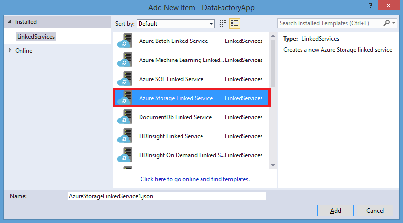

<properties 
	pageTitle="Tutorial: Create a pipeline with Copy Activity using Visual Studio" 
	description="In this tutorial, you will create an Azure Data Factory pipeline with a Copy Activity by using Visual Studio." 
	services="data-factory" 
	documentationCenter="" 
	authors="spelluru" 
	manager="jhubbard" 
	editor="monicar"/>

<tags 
	ms.service="data-factory" 
	ms.workload="data-services" 
	ms.tgt_pltfrm="na" 
	ms.devlang="na" 
	ms.topic="article" 
	ms.date="09/09/2015" 
	ms.author="spelluru"/>

# Tutorial: Create and monitor a data factory using Visual Studio
> [AZURE.SELECTOR]
- [Tutorial Overview](data-factory-get-started.md)
- [Using Data Factory Editor](data-factory-get-started-using-editor.md)
- [Using PowerShell](data-factory-monitor-manage-using-powershell.md)
- [Using Visual Studio](data-factory-get-started-using-vs.md)

##In This Tutorial
In This tutorial you will do the following using Visual Studio 2013:

1. Create two linked services: **AzureStorageLinkedService1** and **AzureSqlinkedService1**. The AzureStorageLinkedService1 links an Azure storage and AzureSqlLinkedService1 links an Azure SQL database to the data factory: **ADFTutorialDataFactoryVS**. The input data for the pipeline resides in a blob container in the Azure blob storage and output data will be stored in a table in the Azure SQL database. Therefore, you add these two data stores as linked services to the data factory.
2. Create two data factory tables: **EmpTableFromBlob** and **EmpSQLTable**, which represent the input/output data that is stored in the data stores. For the EmpTableFromBlob, you will specify the blob container that contains a blob with the source data and for the EmpSQLTable, you will specify the SQL table that will store the output data. You will also specify other properties such as structure of the data, availability of the data, etc...
3. Create a pipeline named **ADFTutorialPipeline** in the ADFTutorialDataFactoryVS. The pipeline will have a **Copy Activity** that copies input data from the Azure blob to the output Azure SQL table.
4. Create a data factory, and deploy linked services, tables, and the pipeline.    

## Create and deploy Data Factory entities using Visual Studio 

### Pre-requisites
You must have the following installed on your computer: 
- Visual Studio 2013
- Download Azure SDK for Visual Studio 2013. Navigate to [Azure Download Page](http://azure.microsoft.com/downloads/) and click **VS 2013 install** in the **.NET** section.

### Walkthrough

#### Create the Visual Studio project 
1. Launch **Visual Studio 2013**. Click **File**, point to **New**, and click **Project**. You should see the **New Project** dialog box.  
2. In the **New Project** dialog, select the **DataFactory** template, and click **Empty Data Factory Project**. If you don't see the DataFactory template, close Visual Studio, install Azure SDK for Visual Studio 2013, and reopen Visual Studio.  

	

3. Enter a **name** for the project, **location**, and a name for the **solution**, and click **OK**.

		

#### Create linked services
Linked services link data stores or compute services to an Azure data factory. A data store can be an Azure Storage, Azure SQL Database or an on-premises SQL Server database.

In this step, you will create two linked services: **AzureStorageLinkedService1** and **AzureSqlLinkedService1**. AzureStorageLinkedService1 linked service links an Azure Storage Account and AzureSqlLinkedService links an Azure SQL database to the data factory: **ADFTutorialDataFactory**. 

##### Create the Azure Storage linked service

4. Right-click **Linked Services** in the solution explorer, point to **Add**, and click **New Item**.      
5. In the **Add New Item** dialog box, select **Azure Storage Linked Service** from the list, and click **Add**. 

	
 
3. Replace **accountname** and **accountkey** with the name of your Azure storage account and its key. 

	

4. Save the **AzureStorageLinkedService1.json** file.

#### Create the Azure SQL linked service

5. Right-click on **Linked Services** node in the **Solution Explorer** again, point to **Add**, and click **New Item**. 
6. This time, select **Azure SQL Linked Service**, and click **Add**. 
7. In the **AzureSqlLinkedService1.json file**, replace **servername**, **databasename**, **username@servername**, and **password** with names of your Azure SQL server, database, user account, and  password.    
8.  Save the **AzureSqlLinkedService1.json** file. 

### Create input and output tables
In the previous step, you created linked services **AzureStorageLinkedService1** and **AzureSqlLinkedService1** to link an Azure Storage account and Azure SQL database to the data factory: **ADFTutorialDataFactory**. In this step, you will define two data factory tables -- **EmpTableFromBlob** and **EmpSQLTable** -- that represent the input/output data that is stored in the data stores referred by AzureStorageLinkedService1 and AzureSqlLinkedService1 respectively. For  EmpTableFromBlob, you will specify the blob container that contains a blob with the source data and for EmpSQLTable, you will specify the SQL table that will store the output data.

#### Create the input table

9. Right-click **Tables** in the **Solution Explorer**, point to **Add**, and click **New Item**.
10. In the **Add New Item** dialog box, select **Azure Blob**, and click **Add**.   
10. Replace the JSON text with the following text and save the **AzureBlobLocation1.json** file. 

		{
		  "name": "EmpTableFromBlob",
		  "properties": {
		    "structure": [
		      {
		        "name": "FirstName",
		        "type": "String"
		      },
		      {
		        "name": "LastName",
		        "type": "String"
		      }
		    ],
		    "type": "AzureBlob",
		    "linkedServiceName": "AzureStorageLinkedService1",
		    "typeProperties": {
		      "folderPath": "adftutorial/",
		      "format": {
		        "type": "TextFormat",
		        "columnDelimiter": ","
		      }
		    },
		    "external": true,
		    "availability": {
		      "frequency": "Hour",
		      "interval": 1
		    }
		  }
		}

#### Create the output table

11. Right-click **Tables** in the **Solution Explorer** again, point to **Add**, and click **New Item**.
12. In the **Add New Item** dialog box, select **Azure SQL**, and click **Add**. 
13. Replace the JSON text with the following JSON and save the **AzureSqlTableLocation1.json** file.

		{
		  "name": "EmpSQLTable",
		  "properties": {
		    "structure": [
		      {
		        "name": "FirstName",
		        "type": "String"
		      },
		      {
		        "name": "LastName",
		        "type": "String"
		      }
		    ],
		    "type": "AzureSqlTable",
		    "linkedServiceName": "AzureSqlLinkedService1",
		    "typeProperties": {
		      "tableName": "emp"
		    },
		    "availability": {
		      "frequency": "Hour",
		      "interval": 1
		    }
		  }
		}

#### Create the pipeline 
You have created input/output linked services and tables so far. Now, you will create a pipeline with a **Copy Activity** to copy data from the Azure blob to Azure SQL database. 

1. Right-click **Pipelines** in the **Solution Explorer**, point to **Add**, and click **New Item**.  
15. Select **Copy Data Pipeline** in the **Add New Item** dialog box and click **Add**. 
16. Replace the JSON with the following JSON and save the **CopyActivity1.json** file..
			
		{
		  "name": "ADFTutorialPipeline",
		  "properties": {
		    "description": "Copy data from a blob to Azure SQL table",
		    "activities": [
		      {
		        "name": "CopyFromBlobToSQL",
		        "description": "Push Regional Effectiveness Campaign data to Azure SQL database",
		        "type": "Copy",
		        "inputs": [
		          {
		            "name": "EmpTableFromBlob"
		          }
		        ],
		        "outputs": [
		          {
		            "name": "EmpSQLTable"
		          }
		        ],
		        "typeProperties": {
		          "source": {
		            "type": "BlobSource"
		          },
		          "sink": {
		            "type": "SqlSink",
		            "writeBatchSize": 10000,
		            "writeBatchTimeout": "60:00:00"
		          }
		        },
		        "Policy": {
		          "concurrency": 1,
		          "executionPriorityOrder": "NewestFirst",
		          "style": "StartOfInterval",
		          "retry": 0,
		          "timeout": "01:00:00"
		        }
		      }
		    ],
		    "start": "2015-07-12T00:00:00Z",
		    "end": "2015-07-13T00:00:00Z",
		    "isPaused": false
		  }
		}

#### Publish/deploy Data Factory entities
  
18. Right-click project in the Solution Explorer, and click **Publish**. 
19. If you see **Sign in to your Microsoft account** dialog box, enter your credentials for the account that has Azure subscription, and click **sign in**.
20. You should see the following dialog box:

	

21. In the Configure data factory page, do the following: 
	1. select **Create New Data Factory** option.
	2. Enter **VSTutorialFactory** for **Name**.  
	
		> [AZURE.NOTE]  
		> The name of the Azure data factory must be globally unique. If you receive an eror about the name of data factory when publishing, change the name of the data factory (for example, yournameVSTutorialFactory) and try publishing again. See [Data Factory - Naming Rules][data-factory-naming-rules] topic for naming rules for Data Factory artifacts.
		> 
		> The name of the data factory may be registered as a DNS name in the future and hence become publically visible.
	3. Select the right subscription for the **Subscription** field. 
	4. Select the **resource group** for the data factory to be created. 
	5. Select the **region** for the data factory. 
	6. Click **Next** to switch to the **Publish Items** page. 
23. In the **Publish Items** page, ensure that all the Data Factories entities are selected, and click **Next** to switch to the **Summary** page.     
24. Review the summary and click **Next** to start the deployment process and view the **Deployment Status**.
25. In the **Deployment Status** page, you should see the status of the deployment process. Click Finish after the deployment is done. 

## Use Server Explorer to review Data Factory entities

1. In **Visual Studio**, click **View** on the menu, and click **Server Explorer**.
2. In the Server Explorer window, expand **Azure** and expand **Data Factory**. If you see **Sign in to Visual Studio**, enter the **account** associated with your Azure subscription and click **Continue**. Enter **password**, and click **Sign in**. Visual Studio tries to get information about all Azure data factories in your subscription. You will see the status of this operation in the **Data Factory Task List** window.
	
3. You can right-click on a data factory, and select Export Data Factory to New Project to create a Visual Studio project based on an existing data factory.
	  

## Update Data Factory tools for Visual Studio
To update Azure Data Factory tools for Visual Studio, do the following:

1. Click **Tools** on the menu and select **Extensions and Updates**. 
2. Select **Updates** in the left pane and then select **Visual Studio Gallery**.
4. Select **Azure Data Factory tools for Visual Studio** and click **Update**. If you do not see this entry, you already have the latest version of the tools. 

See [Monitor datasets and pipeline](data-factory-get-started-using-editor.md#MonitorDataSetsAndPipeline) for instructions on how to use the Azure Preview Portal to monitor the pipeline and datasets you have created in this tutorial.

## Send Feedback
We would really appreciate your feedback on this article. Please take a few minutes to submit your feedback via [email](mailto:adfdocfeedback@microsoft.com?subject=data-factory-get-started-using-vs.md).
