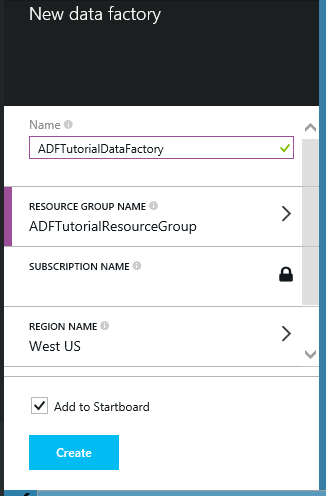
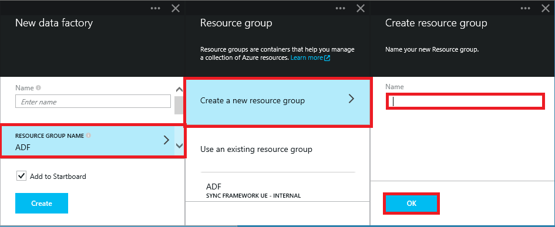
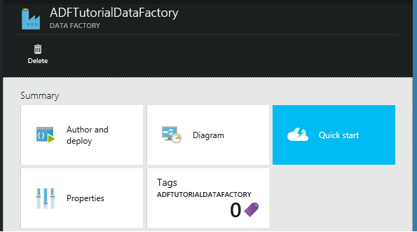

<properties 
	pageTitle="Get started using Azure Data Factory" 
	description="This tutorial shows you how to create a sample data pipeline that copies data from a blob to an Azure SQL Database instance." 
	services="data-factory" 
	documentationCenter="" 
	authors="spelluru" 
	manager="jhubbard" 
	editor="monicar"/>

<tags 
	ms.service="data-factory" 
	ms.workload="data-services" 
	ms.tgt_pltfrm="na" 
	ms.devlang="na" 
	ms.topic="article" 
	ms.date="07/14/2015" 
	ms.author="spelluru"/>

# Tutorial: Create and monitor a data factory using Data Factory Editor
> [AZURE.SELECTOR]
- [Tutorial Overview](data-factory-get-started.md)
- [Using Data Factory Editor](data-factory-get-started-using-editor.md)
- [Using PowerShell](data-factory-monitor-manage-using-powershell.md)
- [Using Visual Studio Add-in](data-factory-monitor-manage-using-vs.md)

##In This Tutorial
In This tutorial you will first create an Azure data factory using the Azure Preview Portal and then do the following using the Visual Studio Add-in:

1. Create two linked services: **StorageLinkedService** and **AzureSqlLinkedService**. The StorageLinkedService links the Azure storage and AzureSqlLinkedService links the Azure SQL database to the ADFTutorialDataFactoryVS. The input data for the pipeline resides in a blob container in the Azure blob storage and output data will be stored in a table in the Azure SQL database. Therefore, you add these two data stores as linked services to the data factory.
2. you created linked services that refer to data stores that contain input/output data. In this step, you will define two data factory tables -- **EmpTableFromBlob** and **EmpSQLTable** -- that represent the input/output data that is stored in the data stores. For the EmpTableFromBlob, you will specify the blob container that contains a blob with the source data and for the EmpSQLTable, you will specify the SQL table that will store the output data. You will also specify other properties such as structure of the data, availability of the data, etc...
3. Create a pipeline named **ADFTutorialPipeline** in the ADFTutorialDataFactoryVS. The pipeline will have a **Copy Activity** that copies input data from the Azure blob to the output Azure SQL table 

Then, you will monitor slices of input and output tables by using the Azure Preview Portal.

## Step 1: Create an Azure Data Factory
In this step, you use the Azure Preview Portal to create an Azure data factory named **ADFTutorialDataFactoryVS**.

1.	After logging into the [Azure Preview Portal][azure-preview-portal], click **NEW** from the bottom-left corner, select **Data analytics** in the **Create** blade, and click **Data Factory** in the **Data analytics** blade. 

		

6. In the **New data factory** blade:
	1. Enter **ADFTutorialDataFactoryVS** for the **name**. 
	
  		
	2. Click **RESOURCE GROUP NAME** and do the following:
		1. Click **Create a new resource group**.
		2. In the **Create resource group** blade, enter **ADFTutorialResourceGroup** for the **name** of the resource group, and click **OK**. 

			

		Some of the steps in this tutorial assume that you use the name: **ADFTutorialResourceGroup** for the resource group. To learn about resource groups, see [Using resource groups to manage your Azure resources](resource-group-overview.md).  
7. In the **New data factory** blade, notice that **Add to Startboard** is selected.
8. Click **Create** in the **New data factory** blade.

	The name of the Azure data factory must be globally unique. If you receive the error: **Data factory name “ADFTutorialDataFactoryVS” is not available**, change the name of the data factory (for example, yournameADFTutorialDataFactoryVS) and try creating again. Use this name in place of ADFTutorialFactory while performing remaining steps in this tutorial. See [Data Factory - Naming Rules][data-factory-naming-rules] topic for naming rules for Data Factory artifacts.  
	 
	

9. Click **NOTIFICATIONS** hub on the left and look for notifications from the creation process. Click **X** to close the **NOTIFICATIONS** blade if it is open. 
10. After the creation is complete, you will see the **DATA FACTORY** blade as shown below.

    

## Step 2: Create Visual Studio project with Data Factory entities and deploy 
1. Launch **Visual Studio 2013**. Click **File**, point to **New**, and click **Project**. You should see the **New Project** dialog box.  
2. In the **New Project** dialog, select the **DataFactory** template, and click **Empty Data Factory Project**. If you don't see DataFactory template, close Visual Studio, install the add-in, and reopen Visual Studio.  

	

3. Enter a name for the project, location, and solution name, and click **OK**.

		

4. Right-click **Linked Services** in the solution explorer, point to **Add**, and click **New Item**.      
5. In the **Add New Item** dialog box, select **Azure Storage Linked Service** from the list, and click **Add**. 

	
 
3. Replace **accountname** and **accountkey** with the name of your Azure storage account and its key. 

	

4. Save the **AzureStorageLinkedService1.json** file.
5. Right-click on **Linked Services** node in the **Solution Explorer** again, point to **Add**, and click **New Item**. 
6. This time, select **Azure SQL Linked Service**, and click **Add**. 
7. In the **AzureSqlLinkedService1.json file**, replace **servername**, **databasename**, **username@servername**, and **password** with names of your Azure SQL server, database, user account, and  password.    
8.  Save the **AzureSqlLinkedService1.json** file. 
9. You have created linked services. Now, you will create an input and output Data Factory tables. To create tables, right-click **Tables** in the **Solution Explorer**, point to **Add**, and click **New Item**.
10. In the **Add New Item** dialog box, select **Azure Blob**, and click **Add**.   
10. Replace the JSON text with the following text and save the **AzureBlobLocation1.json** file. 

		{
    		"name": "EmpTableFromBlob",
        	"properties":
        	{
            	"structure":  
                [ 
	                { "name": "FirstName", "type": "String"},
	                { "name": "LastName", "type": "String"}
	            ],
	            "location": 
	            {
	                "type": "AzureBlobLocation",
	                "folderPath": "adftutorial/",
	                "format":
	                {
	                    "type": "TextFormat",
	                    "columnDelimiter": ","
	                },
	                "linkedServiceName": "AzureStorageLinkedService1"
	            },
	            "availability": 
	            {
	                "frequency": "Hour",
	                "interval": 1,
	                "waitOnExternal": {}
                }
	        }
		}

11. Right-click **Tables** in the **Solution Explorer** again, point to **Add**, and click **New Item**.
12. In the **Add New Item** dialog box, select **Azure SQL**, and click **Add**. 
13. Replace the JSON text with the following JSON.

		{
		    "name": "EmpSQLTable",
		    "properties":
		    {
		        "structure":
		        [
		            { "name": "FirstName", "type": "String"},
		            { "name": "LastName", "type": "String"}
		        ],
		        "location":
		        {
		            "type": "AzureSqlTableLocation",
		            "tableName": "emp",
		            "linkedServiceName": "AzureSqlLinkedService1"
		        },
		        "availability": 
		        {
		            "frequency": "Hour",
		            "interval": 1            
		        }
		    }
		}
 
14. You have created input/output linked services and tables so far. Now, you will create a pipeline with a **Copy Activity** to copy data from the Azure blob to Azure SQL database. Right-click **Pipelines** in the **Solution Explorer**, point to **Add**, and click **New Item**.  
15. Select **Copy Data Pipeline** in the **Add New Item** dialog box and click **Add**. 
16. Replace the JSON with the following JSON.
			
		 {
		    "name": "ADFTutorialPipeline",
		    "properties":
		    {   
		        "description" : "Copy data from a blob to Azure SQL table",
		        "activities":   
		        [
		            {
		                "name": "CopyFromBlobToSQL",
		                "description": "Push Regional Effectiveness Campaign data to Azure SQL database",
		                "type": "CopyActivity",
		                "inputs": [ {"name": "EmpTableFromBlob"} ],
		                "outputs": [ {"name": "EmpSQLTable"} ],     
		                "transformation":
		                {
		                    "source":
		                    {                               
		                        "type": "BlobSource"
		                    },
		                    "sink":
		                    {
		                        "type": "SqlSink",
		                        "writeBatchSize": 10000,
		                        "writeBatchTimeout": "60:00:00"
		                    }   
		                },
		                "Policy":
		                {
		                    "concurrency": 1,
		                    "executionPriorityOrder": "NewestFirst",
		                    "style": "StartOfInterval",
		                    "retry": 0,
		                    "timeout": "01:00:00"
		                }       
		            }
		        ],
		
		        "start": "2015-07-12T00:00:00Z",
		        "end": "2015-07-13T00:00:00Z",
		        "isPaused": false
		    }
		} 

17. Save the **CopyActivity1.json** file. 
18. In the toolbar area, right-click and select **Data Factory** to enabled the Data Factory toolbar if it is not already enabled. 
19. In the **Data Factory toolbar**, click the **drop-down box** to see all the data factories in your Azure subscription. If you see the **Sign-in to Visual Studio** dialog box: 
	20. Enter the **email account** associated with the Azure subscription in which you want to create the data factory, enter **Password**, and click **Sign-in**.
	21. Once the sign-in is successful, you should see all the data factories in the Azure subscription. In this tutorial, you will create a new data facotry.       
22. In the drop-down list, select **ADFTutorialFactoryVS**, and click **Publish** button to deploy/publish the linked services, datasets, and the pipeline.    

	

23. You should see the status of publishing in the Data Factory Task List window that is shown in the picture above. Confirm that publishing has succeeded.
24. See [Monitor datasets and pipeline](data-factory-get-started-using-editor.md/#MonitorDataSetsAndPipeline) for instructions on how to use the Azure Preview Portal to monitor the pipeline and datasets you have created in this tutorial.

