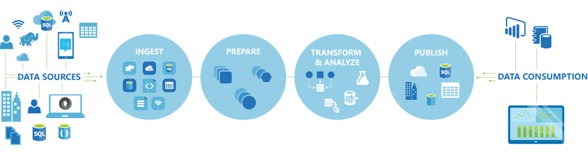
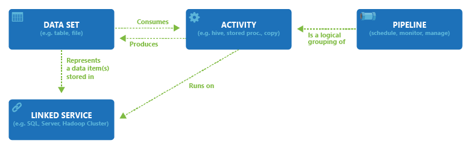

<properties 
	pageTitle="Introduction to Azure Data Factory" 
	description="Learn how you can use the Azure Data Factory service to compose data processing, data storage and data movement services to create pipelines that produce trusted information." 
	services="data-factory" 
	documentationCenter="" 
	authors="spelluru" 
	manager="jhubbard" 
	editor="monicar"/>

<tags 
	ms.service="data-factory" 
	ms.workload="data-services" 
	ms.tgt_pltfrm="na" 
	ms.devlang="na" 
	ms.topic="article" 
	ms.date="07/16/2015" 
	ms.author="spelluru"/>

# Introduction to Azure Data Factory Service

## Overview
Data Factory is a cloud-based data integration service that automates the movement and transformation of data.  Just like a manufacturing factory that takes raw materials and transforms them into finished goods, Data Factory manages the collection of raw data and transforms it into ready-to-use information.  Data Factory works across on-premises and cloud data sources and SaaS (Software-as-a-Service) to ingest, prepare, transform, analyze, and publish your data.  

Use Data Factory to compose services into managed data flow pipelines to transform your data using services like [Azure HDInsight (Hadoop)](http://azure.microsoft.com/documentation/services/hdinsight/) and [Azure Batch](http://azure.microsoft.com/documentation/services/batch/) for your big data computing needs, and with [Azure Machine Learning](http://azure.microsoft.com/documentation/services/machine-learning/) to operationalize your analytics solutions.  Go beyond just a tabular monitoring view, and use the rich visualizations of Data Factory to quickly display the lineage and dependencies between your data pipelines. Monitor all of your data flow pipelines from a single unified view to easily pinpoint issues and setup monitoring alerts.

**Figure1.** Collect data from many different on-premises data sources, ingest and prepare it, organize and analyze it with a range of transformations, then publish ready-to-use data for consumption.

You can use Data Factory anytime you need to collect data of different shapes and sizes, transform it, and publish it to extract deep insights – all on a reliable schedule. Data Factory can be used to create highly available data flow pipelines for scenarios like:

- Regularly ingesting data from multiple sources into a data lake <<link to data lake use case>>
- Processing device telemetry data <<link to connected cars use case>> to provide better experiences to customers
- Predicting customer churn <<link to customer churn use case>> and reducing customer attrition
- Generating Product Recommendations <<link to prodreco use case>> based on user profiles and clickstream data

## Key Concepts

Azure Data Factory has a few key entities that work together to define the input and output data, processing events, and the schedule and resources required to execute the desired data flow.

**Figure 2.** Relationships between Dataset, Activity, Pipeline, and Linked service

### Activities
Activities define the actions to perform on your data.  Each activity consumes one or more datasets as inputs and produces one or more datasets as outputs.  For example, you can use a Hive activity  to run a Hive query to analyze your data and produce a result, or you can use a Copy activity  to copy data from your on-premises source and output it to a cloud store.  Data Factory provides a wide range of data transformation, analysis, and data movement activities.

### Pipelines
Pipelines  are named sequences of Activities. They are used to organize a sequence of activities into groups that together perform a task and can be treated as a unit.  For example, a sequence of several transformation Activities might be needed to cleanse log file data.  This sequence could have a complex schedule and dependencies that need to be orchestrated and automated. All of these activities could be grouped into a single Pipeline named “CleanLogFiles”.  “CleanLogFiles” could then be deployed, scheduled, or deleted as one single item instead of managing each individual activity independently.

### Datasets
Datasets are named references/pointers to the data you want to use as an input or an output of an Activity. Datasets identify data structures within different data stores including tables, files, folders, and documents.

### Linked service
Linked services define the information needed for Data Factory to connect to external resources.  Linked services are used for two purposes in Data Factory:

- To represent a data store  including, but not limited to, an on-premises SQL Server, Oracle DB, File share or an Azure Blob Storage account.   As discussed above, Datasets represent the structures within the data stores connected to Data Factory through a Linked service.
- To represent a compute resource that can host the execution of an Activity.  For example, the “HDInsightHive Activity”executes on an HDInsight Hadoop cluster.

With the four simple concepts of datasets, activities, pipelines and linked services, you are ready to get started!  You can [build your first pipeline](data-factory-build-your-first-pipeline.md)  from the ground up, or deploy a ready-made sample by following the instructions in our [blog post](https://azure.microsoft.com/blog/2015/04/24/azure-data-factory-update-simplified-sample-deployment/).

