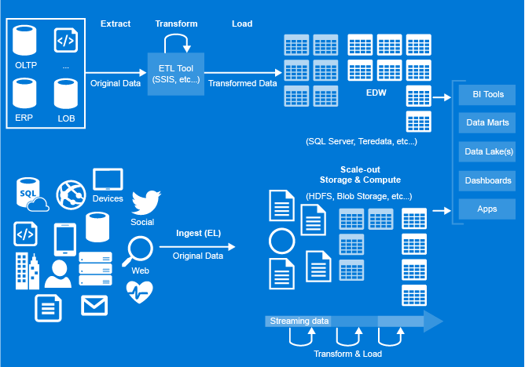

# Introduction to Azure Data Factory Service, a data integration service in the cloud
## What is Azure Data Factory?
In the world of big data, how is existing data leveraged in business? Is it possible to enrich data generated in the cloud by using reference data from on-premises data sources or other disparate data sources? Thus, what is needed is a platform for aggregating and processing data from a wide variety of sources. Azure Data Factory a cloud-based data integration service that orchestrates and automates the **movement** and **transformation** of data. You can create data integration solutions that can ingest input data from disparate data stores, transform/process the data, and publish output data to other data stores. 

**Figure1.** Ingest data from various data sources, prepare, transform, and analyze the data, and then publish ready-to-use data for consumption.

## What does it offer? 
Traditionally, data integration projects have revolved around creating Extract-Transform-Load (ETL) processes that extract data from various data sources within an organization, transform the data to conform to the target schema of an Enterprise Data Warehouse (EDW), and load the data into an EDW as shown in the following image. The EDW is then accessed as the single source of truth for BI analytics solutions.

**Traditional ETL**

Today’s data landscape for enterprises continues to grow exponentially in volume, variety, and complexity as shown in the following image. It is more diverse than ever with on-premises and cloud-born data of different forms and velocities. Data processing must happen across geographic locations, and it includes a combination of open source software, commercial solutions, and custom processing services that are expensive and hard to integrate and maintain. The agility needed to adapt to today’s changing big data landscape is an opportunity to merge the traditional EDW with capabilities required for a modern information production system. Azure Data Factory is the composition platform to work across traditional EDWs and the changing data landscape to empower enterprises to leverage all data that is available for data-driven decision making.

**New big data landscape**

The Azure Data Factory service empowers enterprises to harness this diversity by providing a platform to **compose data processing, storage and movement services into information production pipelines**, and manage trusted data assets.

The Azure Data Factory service lets you:
- **Easily work with diverse data storage and processing systems**. 

	Enterprises have data of disparate types located in disparate sources. The first step in building an information production system is to connect to all the required sources of data and processing, such as SaaS services, file shares, FTP, web services, and move the data as-needed to a centralized location for subsequent processing.

	Without Data Factory, enterprises must build custom data movement components or write custom services to integrate these data sources and processing. This is expensive, and hard to integrate and maintain such systems, and it often lacks the enterprise grade monitoring and alerting, and the controls that a fully managed service can offer.

	With Data Factory, you can use the Copy Activity in a data pipeline to move data from both on-premises and cloud source data stores to a centralization data store in the cloud for further analysis. For example, you can collect data in an Azure Data Lake Store and transform the data later by using an Azure Data Lake Analytics compute service. Or, collect data in an Azure Blob Storage and transform data later by using an Azure HDInsight Hadoop cluster.
- **Transform data into trusted information**. 

	Once data is present in a centralized data store in the cloud, you want to author and deploy data pipelines to reliably produce transformed data on a maintainable and controlled schedule to feed production environments with trusted data. Data transformation in Azure Data Factory is performed by transformation activities such as Hive, Pig, MapReduce, Azure Machine Learning Batch Execution, and custom C# activities running on Azure HDInsight Hadoop cluster, Azure Machine Learning VMs, or Azure Batch pool of VMs.
- **Monitor data pipelines in one place**.

	With a diverse data portfolio, it’s important to have a reliable and complete view of your storage, processing, and data movement services. Data Factory helps you quickly assess end-to-end data pipeline health, pinpoint issues, and take corrective action if needed. Visually track data lineage and the relationships between your data across any of your sources. See a full historical accounting of job execution, system health, and dependencies from a single monitoring dashboard.

## How does it work? 
There are three information production stages in an Azure Data Factory:

- **Connect & Collect**: In this stage, data from various data sources is collected in one place.
- **Transform & Enrich**: In this stage, the collected data is processed or transformed.
- **Publish**. In this stage, the data is published so that it can be consumed by BI tools, analytics tools, and other applications.

## Key components
An Azure subscription may have one or more Azure Data Factory instances (or data factories). Azure Data Factory is composed of four key components that work together to provide the platform on which you can compose simple to complex data movement and transformation orchestrations for your data flow.

### Activity
Activities define the actions to perform on your data. For example, you may use a Copy activity to copy data from one data store to another data store. Similarly, you may use a Hive activity, which runs a Hive query on an Azure HDInsight cluster to transform or analyze your data. Data Factory supports two types of activities: data movement activities and data transformation activities.

Each activity can have zero or more input datasets and produce one or more output datasets. 

### Data movement activities
Copy Activity in Data Factory copies data from a source data store to a sink data store. Data Factory supports the following data stores. Data from any source can be written to any sink. Click a data store to learn how to copy data to and from that store.

[!INCLUDE [data-factory-supported-data-stores](../../includes/data-factory-supported-data-stores.md)]

For more information, see [Data Movement Activities](data-factory-data-movement-activities.md) article.

### Data transformation activities
[!INCLUDE [data-factory-transformation-activities](../../includes/data-factory-transformation-activities.md)]

For more information, see [Data Transformation Activities](data-factory-data-transformation-activities.md) article.

If you need to move data to/from a data store that Copy Activity doesn't support, or transform data using your own logic, create a **custom .NET activity**. For details on creating and using a custom activity, see [Use custom activities in an Azure Data Factory pipeline](data-factory-use-custom-activities.md).

### Pipeline
A pipeline is a group of activities. Together, the activities in a pipeline perform a task. For example, a pipeline could contain a group of activities that ingests data from an Azure blob, and then run a Hive query on an HDInsight cluster to partition the log data. The benefit of this is that the pipeline allows you to manage the activities as a set instead of each one individually. For example, you can deploy and schedule the pipeline, instead of the activities independently.

### Datasets
Datasets represent data structures within the data stores, which simply point or reference the data you want to use in your activities as inputs or outputs. For example, an Azure Blob dataset specifies the blob container and folder in the Azure Blob Storage from which the pipeline should read the data. 

### Linked services
Linked services are much like connection strings, which define the connection information needed for Data Factory to connect to external resources. Think of it this way - the dataset represents the structure of the data, and the linked service defines the connection to the data source.  Linked services are used for two purposes in Data Factory:

* To represent a **data store** including, but not limited to, an on-premises SQL Server, Oracle database, file share, or an Azure Blob Storage account. See the [Data movement activities](#data-movement-activities) section for a list of supported data stores.
* To represent a **compute resource** that can host the execution of an activity. For example, the HDInsightHive activity runs on an HDInsight Hadoop cluster. See [Data transformation activities](#data-transformation-activities) section for a list of supported compute environments.

### Relationship between Data Factory entities

**Figure 2.** Relationships between Dataset, Activity, Pipeline, and Linked service

## Supported regions
Currently, you can create data factories in the **West US**, **East US**, and **North Europe** regions. However, a data factory can access data stores and compute services in other Azure regions to move data between data stores or process data using compute services.

Azure Data Factory itself does not store any data. It lets you create data-driven flows to orchestrate movement of data between [supported data stores](data-factory-data-movement-activities.md#supported-data-stores-and-formats) and processing of data using [compute services](data-factory-compute-linked-services.md) in other regions or in an on-premises environment. It also allows you to [monitor and manage workflows](data-factory-monitor-manage-pipelines.md) using both programmatic and UI mechanisms.

Even though Data Factory is available in only **West US**, **East US**, and **North Europe** regions, the service powering the data movement in Data Factory is available [globally](data-factory-data-movement-activities.md#global) in several regions. In case a data store sits behind a firewall then a [Data Management Gateway](data-factory-move-data-between-onprem-and-cloud.md) installed in your on-premises environment moves the data instead.

For an example, let us assume that your compute environments such as Azure HDInsight cluster and Azure Machine Learning are running out of West Europe region. You can create and use an Azure Data Factory instance in North Europe and use it to schedule jobs on your compute environments in West Europe. It takes a few milliseconds for Data Factory to trigger the job on your compute environment but the time for running the job on your computing environment does not change.

We intend to have Azure Data Factory in every geography supported by Azure in the future.

## Next steps
To learn how to build data factories with data pipelines, follow step-by-step instructions in the following tutorials:

| Tutorial | Description |
| --- | --- |
| [Move data between two cloud data stores](data-factory-copy-data-from-azure-blob-storage-to-sql-database.md) |In this tutorial, you create a data factory with a pipeline that **moves data** from Blob storage to SQL database. |
| [Transform data using Hadoop cluster](data-factory-build-your-first-pipeline.md) |In this tutorial, you build your first Azure data factory with a data pipeline that **processes data** by running Hive script on an Azure HDInsight (Hadoop) cluster. |
| [Move data between an on-premises data store and a cloud data store using Data Management Gateway](data-factory-move-data-between-onprem-and-cloud.md) |In this tutorial, you build a data factory with a pipeline that **moves data** from an **on-premises** SQL Server database to an Azure blob. As part of the walkthrough, you install and configure the Data Management Gateway on your machine. |
