<properties 
	pageTitle="Load 1TB data into SQL Data Warehouse | Microsoft Azure" 
	description="Demonstrates how 1 TB of data can be loaded into Azure SQL Data Warehouse under 15 minutes with Azure Data Factory" 
	services="data-factory" 
	documentationCenter="" 
	authors="linda33wj" 
	manager="jhubbard" 
	editor="monicar"/>

<tags 
	ms.service="data-factory" 
	ms.workload="data-services" 
	ms.tgt_pltfrm="na" 
	ms.devlang="na" 
	ms.topic="article" 
	ms.date="10/28/2016" 
	ms.author="jingwang"/>

# Load 1 TB into Azure SQL Data Warehouse under 15 minutes with Azure Data Factory

[Azure SQL Data Warehouse](../sql-data-warehouse/sql-data-warehouse-overview-what-is.md) is a cloud-based, scale-out database capable of processing massive volumes of data, both relational and non-relational.  Built on massively parallel processing (MPP) architecture, SQL Data Warehouse is optimized for enterprise data warehouse workloads.  It offers cloud elasticity with the flexibility to scale storage and compute independently.

Getting started with Azure SQL Data Warehouse is now easier than ever using **Azure Data Factory**.  Azure Data Factory is a fully managed cloud-based data integration service, which can be used to populate a SQL Data Warehouse with the data from your existing system, and saving you valuable time while evaluating Azure SQL Data Warehouse and building your analytics solutions on top of it.  Here are the key benefits of loading data into Azure SQL Data Warehouse using Azure Data Factory:

- **Easy to set up**: 5-step intuitive wizard with no scripting required
- **Rich data store support**: built-in support for a rich set of on-premises and cloud-based data stores
- **Secure and compliant**: data is transferred over HTTPS or ExpressRoute, and global service presence ensures your data never leaves the geo boundary
- **Unparalleled performance by leveraging PolyBase** – the most efficient way to move data into Azure SQL Data Warehouse as well as staging blob feature – now you can achieve high load speeds from all types of data stores besides Azure Blob storage.

This article shows you how to use Data Factory Copy Wizard to load 1 TB data from Azure Blob Storage into Azure SQL Data Warehouse in under 15 minutes, at over 1.2 GBps throughput.

## Prerequisites
- Azure Blob Storage: this experiment uses Azure Blob Storage (GRS) for storing TPC-H testing dataset.  If you do not have an Azure storage account, learn [how to create a storage account](../storage/storage-create-storage-account.md#create-a-storage-account).
- [TPC-H](http://www.tpc.org/tpch/) data: we are going to use TPC-H as the testing dataset.  To do that, you need to use dbgen from TPCH-H toolkit which helps you generate the dataset.  You can either download source code for dbgen from [TPC Tools](http://www.tpc.org/tpc_documents_current_versions/current_specifications.asp) and compile it yourself, or download the compiled binary from [GitHub](https://github.com/Azure/Azure-DataFactory/tree/master/Samples/TPCHTools).  Run dbgen.exe with below commands to generate 1TB flat file for **lineitem** table spread across 10 files:
	- Dbgen -s 1000 -S **1** -C 10 -T L -v
	- Dbgen -s 1000 -S **2** -C 10 -T L -v
	- …
	- Dbgen -s 1000 -S **10** -C 10 -T L -v 

	Now copy the files generated above to Azure Blob.  Refer to [Move data to and from an on-premises file system by using Azure Data Factory](data-factory-onprem-file-system-connector.md) for how to do that using ADF Copy.	
- Azure SQL Data Warehouse: this experiment loads data into Azure SQL Data Warehouse created with 6,000 DWUs

	Refer to [Create an Azure SQL Data Warehouse](../sql-data-warehouse/sql-data-warehouse-get-started-provision/) for detailed instructions on how to create a new SQL Data Warehouse database.  To get the best possible load performance into SQL Data Warehouse using Polybase, we are going to choose maximum number of Data Warehouse Units (DWUs) allowed in the Performance setting, which is 6,000 DWUs.

	> [ACOM.NOTE] 
	> In the case of loading from Azure Blob which is not heavily loaded or otherwise under resource contention, the data loading performance is directly proportional to the number of DWUs you configure on the SQL Data Warehouse:
	> 
	> Loading 1TB into 1,000 DWU SQL Data Warehouse takes 87min (~200MBps throughput)
	> Loading 1TB into 2,000 DWU SQL Data Warehouse takes 46min (~380MBps throughput)
	> Loading 1TB into 6,000 DWU SQL Data Warehouse takes 14min (~1.2GBps throughput)

	To create a new SQL Data Warehouse with 6,000 DWUs, move the Performance slider all the way to the right:

	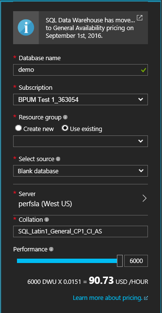

	For an existing database that is not configured with 6,000 DWUs, you can scale it up using Azure Portal.  Navigate to the database in Azure Portal, and there is a **Scale** button in the **Overview** panel shown below.

		

	Click the **Scale** button to open below panel, move the slider to the maximum value, and click **Save** button.

	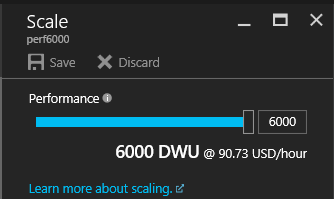
	
	This experiment loads data into Azure SQL Data Warehouse using xlargerc resource class

	To achieve best possible throughput, copy needs to be performed using a SQL Data Warehouse user belonging to xlargerc resource class.  Learn how to do that by following Change a user resource class example.  Now we have created a new user called newAdmin which we will use in the steps below

- Create destination table schema in Azure SQL Data Warehouse database, by running the DDL statement below:

		CREATE TABLE [dbo].[lineitem]
		(
			[L_ORDERKEY] [bigint] NOT NULL,
			[L_PARTKEY] [bigint] NOT NULL,
			[L_SUPPKEY] [bigint] NOT NULL,
			[L_LINENUMBER] [int] NOT NULL,
			[L_QUANTITY] [decimal](15, 2) NULL,
			[L_EXTENDEDPRICE] [decimal](15, 2) NULL,
			[L_DISCOUNT] [decimal](15, 2) NULL,
			[L_TAX] [decimal](15, 2) NULL,
			[L_RETURNFLAG] [char](1) NULL,
			[L_LINESTATUS] [char](1) NULL,
			[L_SHIPDATE] [date] NULL,
			[L_COMMITDATE] [date] NULL,
			[L_RECEIPTDATE] [date] NULL,
			[L_SHIPINSTRUCT] [char](25) NULL,
			[L_SHIPMODE] [char](10) NULL,
			[L_COMMENT] [varchar](44) NULL
		)
		WITH
		(
			DISTRIBUTION = ROUND_ROBIN,
			CLUSTERED COLUMNSTORE INDEX
		)

With the prerequisite steps completed, we are now ready to configure the copy activity using the Copy Wizard.

## Step 1: Configure data loading schedule
The first step is to configure the data loading schedule.  Choose **Run once now** as shown in the following image. 

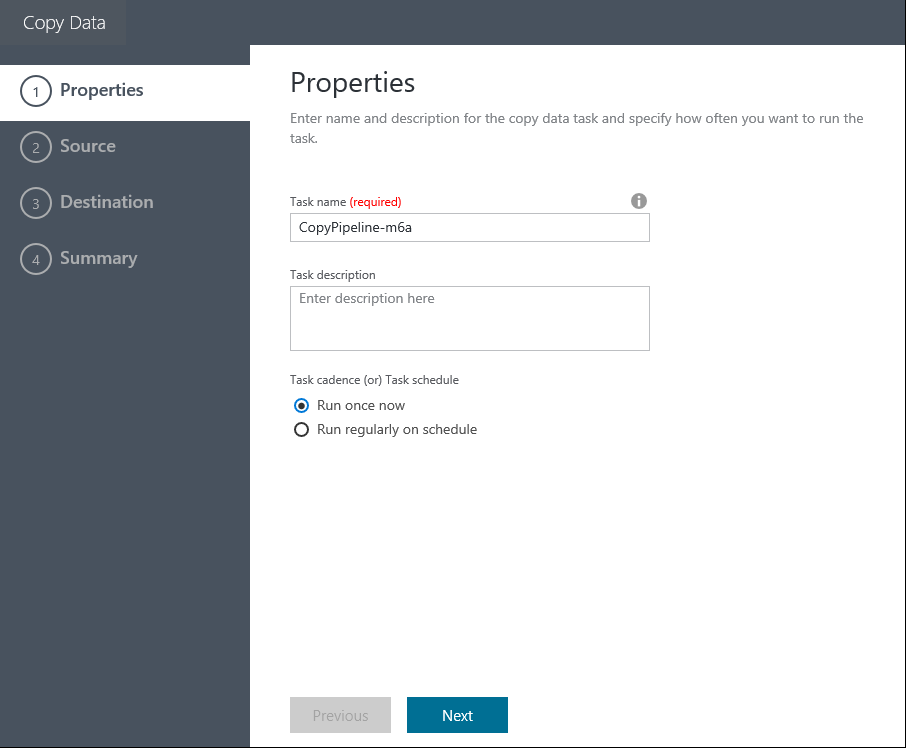

    **Pipeline properties**

## Step 2: Configure source
The images in this section show the steps to configure the source: Azure Blob containing the 1TB TPC-H line item files.

Select the Azure Blob Storage as the data store and click ‘Next’.

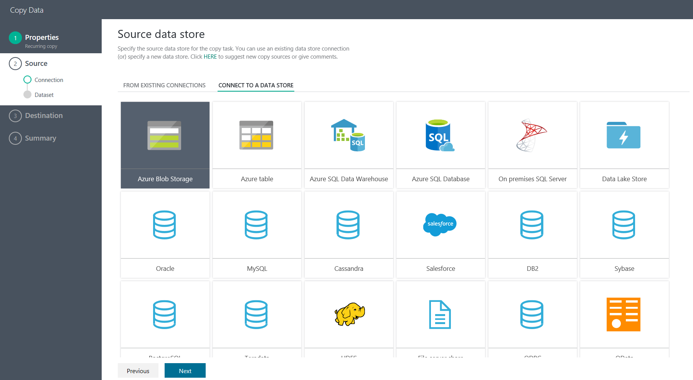

Fill in the connection information for the Azure Blob storage account.

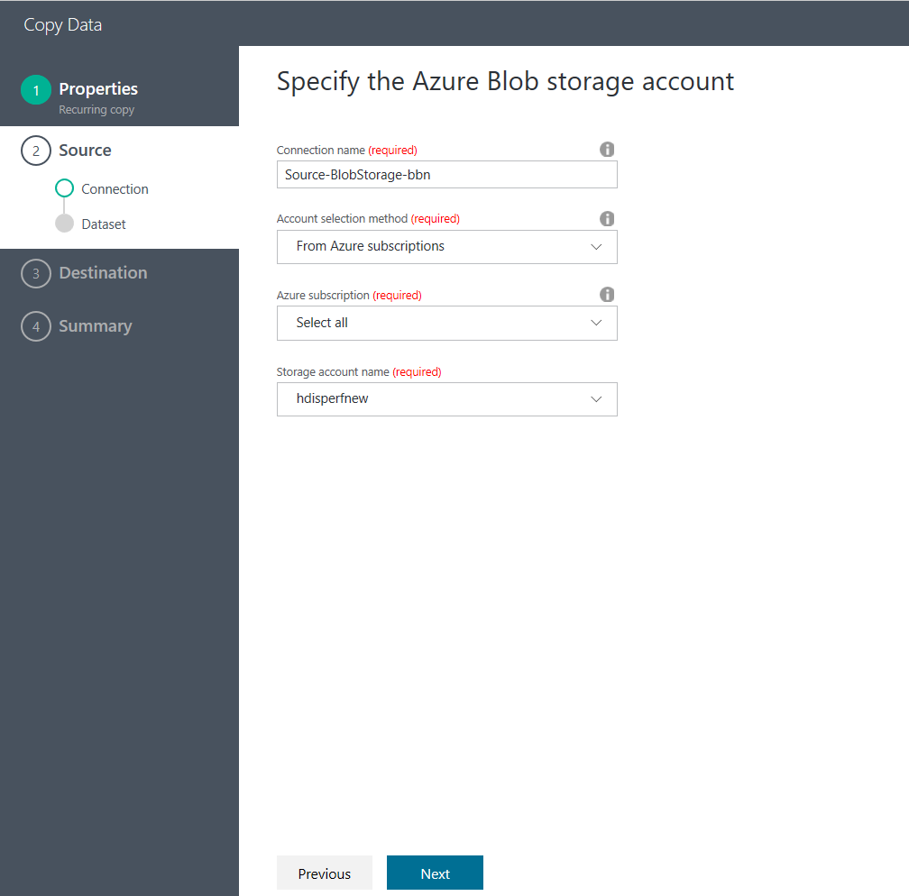

Choose the **folder** containing the TPC-H lineitem files and click **Next**.

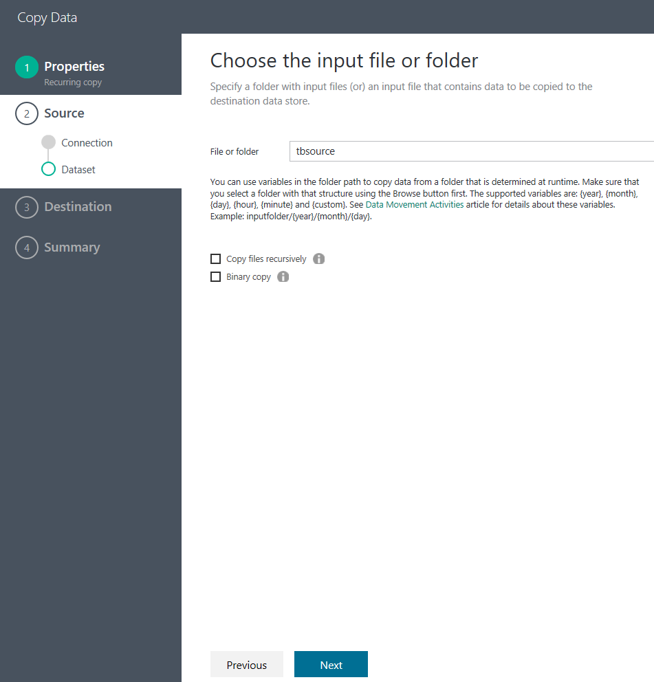

Upon clicking **Next**, the file format settings are detected automatically.  Check to make sure that column delimiter is ‘|’ instead of the default comma ‘,’.  Click ‘Next’ after you have previewed the data that is being properly displayed.

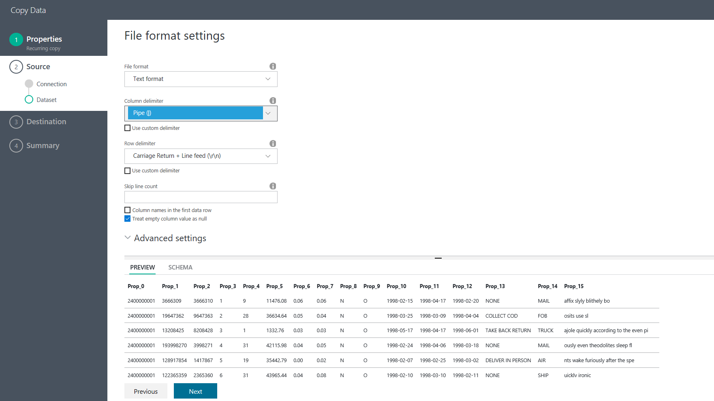

## Step 3: Configure destination
This section shows you how to configure the destination: `lineitem` table in the Azure SQL Data Warehouse database.

Choose **Azure SQL Data Warehouse** as the destination store and click **Next**.

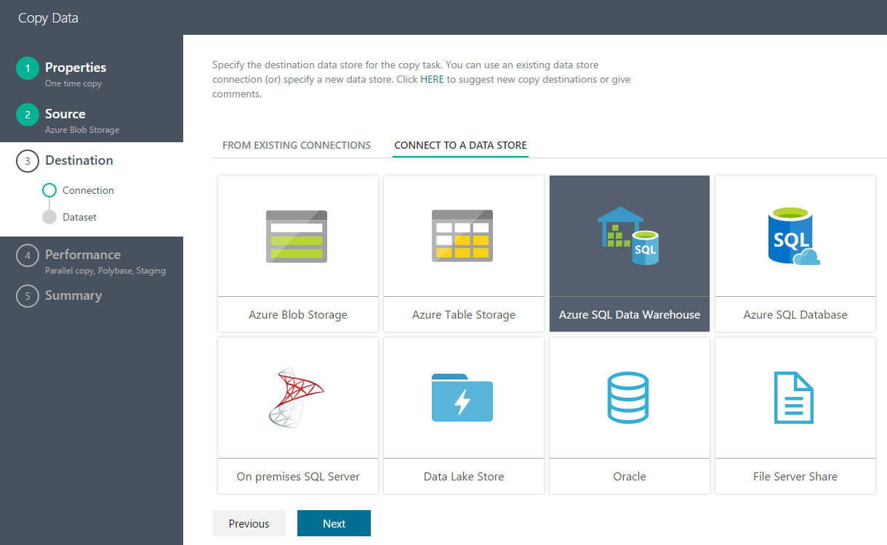

Fill in the connection information for Azure SQL Data Warehouse.  Make sure you specify the user which is a member of the role **xlargerc** (see the **prerequisites** section for detailed instructions).

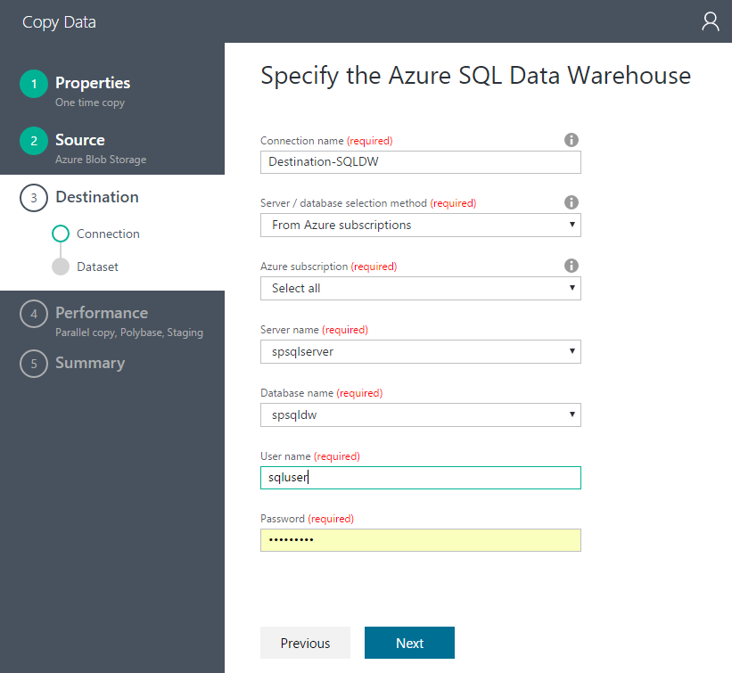

Choose the destination table and click **Next**.

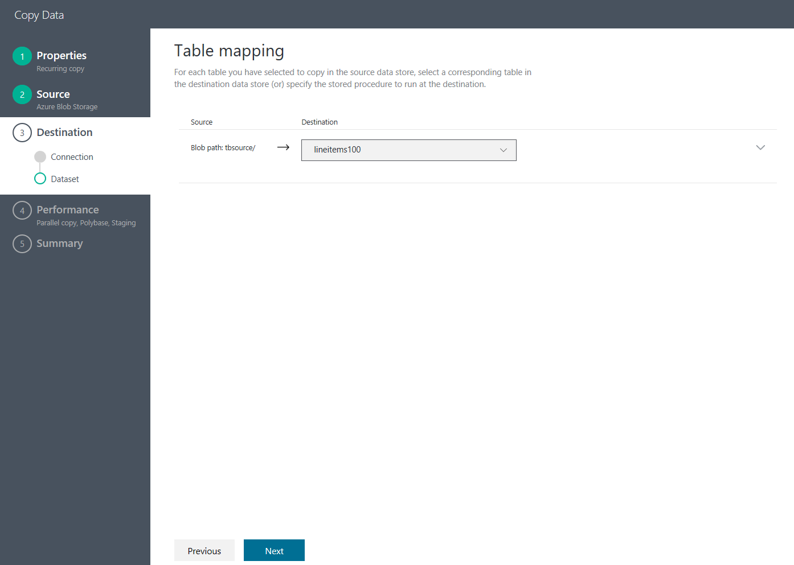

Accept the default settings for column mapping and click **Next**.

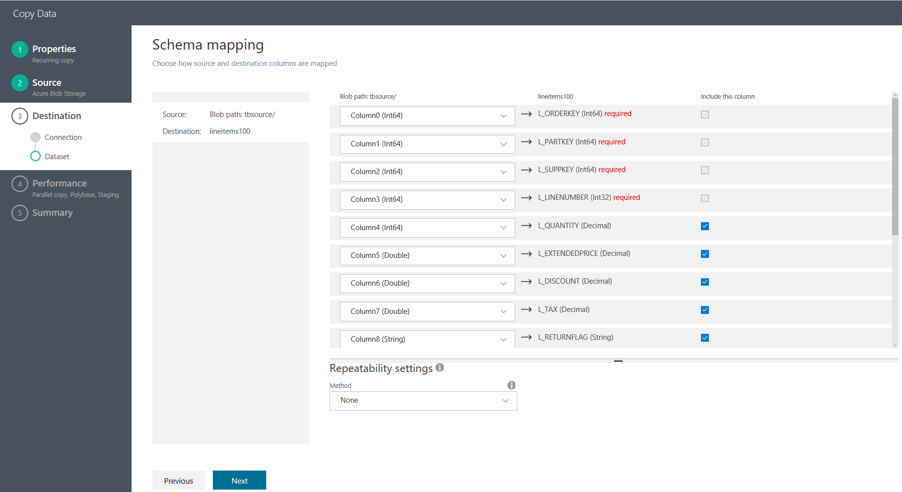

## Step 4: Performance related configuration

**Allow polybase** is checked by default.  Click **Next**.

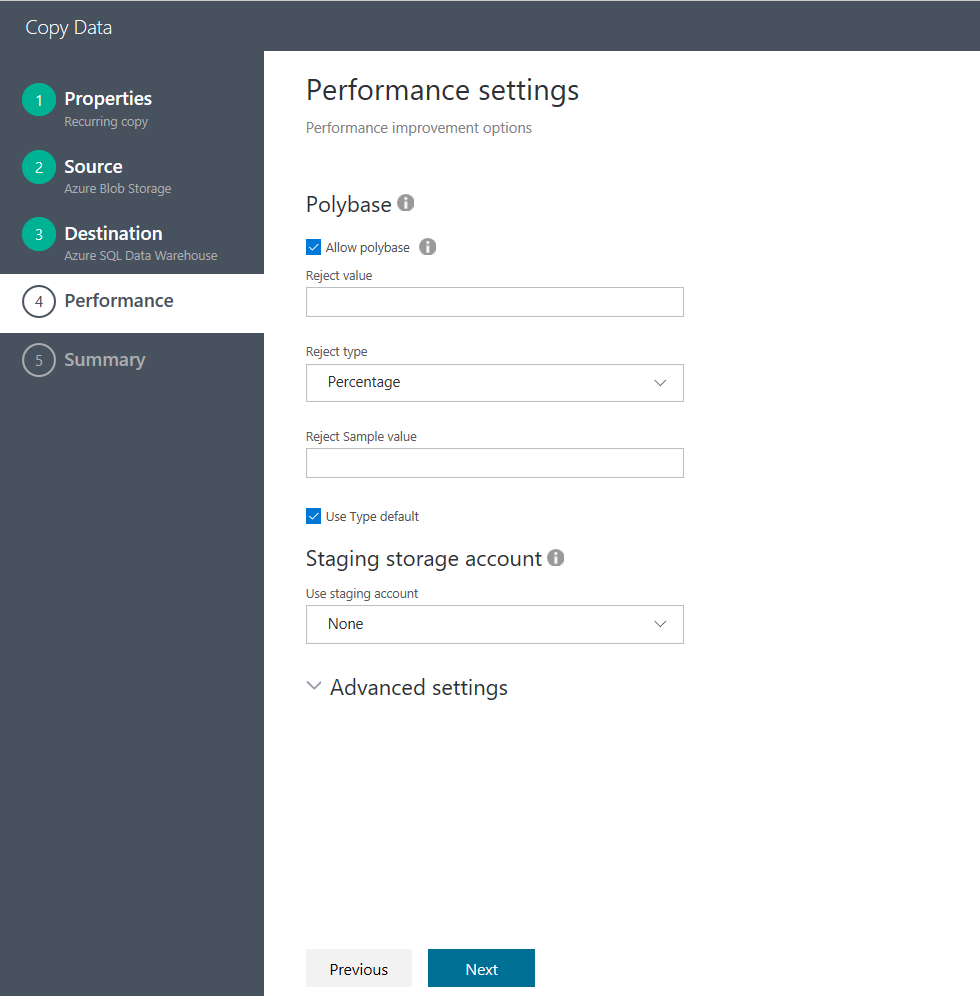

## Step 5: Deploy and monitor load results
Click **Finish** button to deploy. 

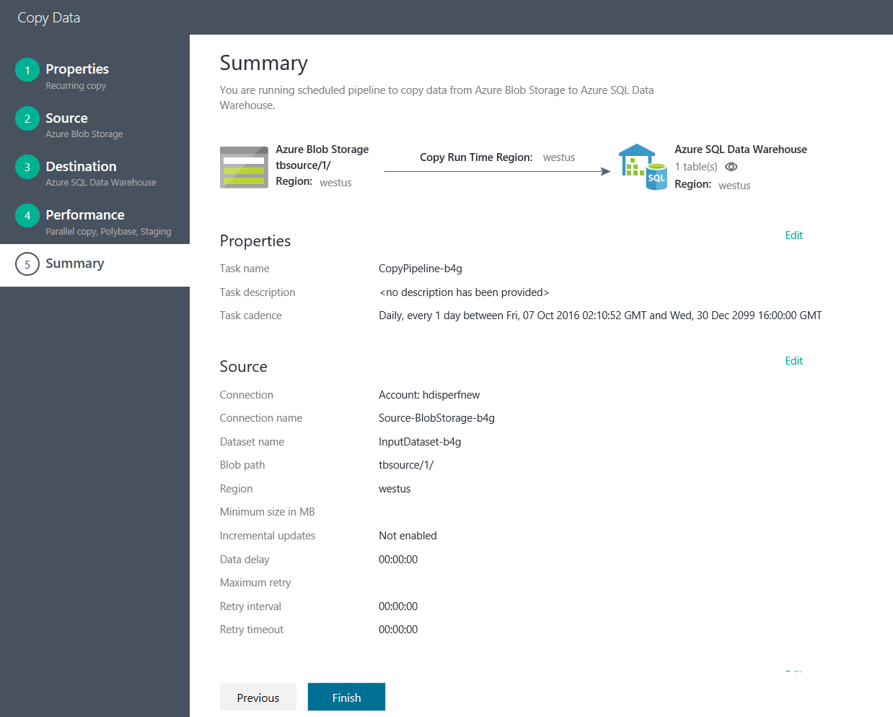

After the deployment is complete, click on **Click here to monitor copy pipeline** to monitor the copy run progress.

Select the copy pipeline you created in the Activity Window.

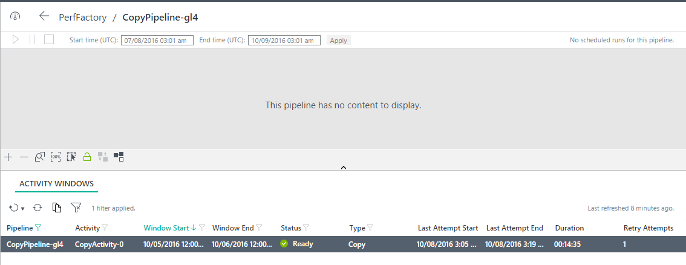

You can view the copy run details in the Activity Window Explorer in the right panel, including the data volume read from source and written into destination, duration, and the average throughput for the run.

As you can see from the screen shot below, copying 1TB from Azure Blob Storage into SQL Data Warehouse took 14 minutes, effectively achieving 1.22 GBps throughput!

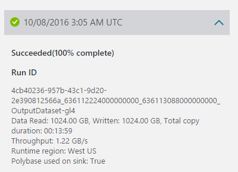

## Best practices
Here are a few best practices for running your Azure SQL Data Warehouse database:

- Use a larger resource class when loading into a CLUSTERED COLUMNSTORE INDEX.
- For more efficient joins, consider using hash distribution by a select column instead of default round robin distribution.
- For faster load speeds, consider using heap for transient data.
- Create statistics after you finish loading Azure SQL Data Warehouse.

See [Best practices for Azure SQL Data Warehouse](../sql-data-warehouse/sql-data-warehouse-best-practices.md) for details. 

## Next steps
- [Data Factory Copy Wizard](data-factory-copy-wizard.md) -  This describes how to easily author a data ingestion pipeline using the Copy Wizard.
- [Move Data by using Copy Activity](data-factory-data-movement-activities.md).  This article provides core reference documentation on how the Copy Activity works and the set of connectors it supports.
- [Copy Activity performance and tuning guide](data-factory-copy-activity-performance.md).  This article contains the reference performance measurements and tuning guide.

