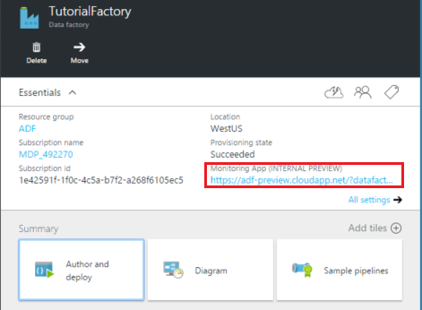
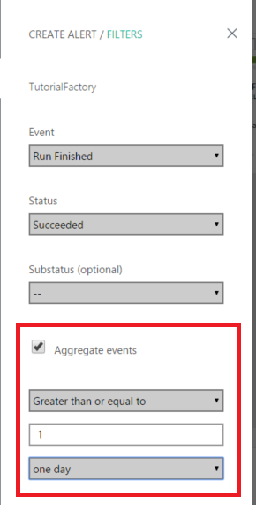

<properties 
	pageTitle="Monitor and manage Azure Data Factory pipelines" 
	description="Learn how to use Monitoring and Management App to monitor and manage Azure data factories and pipelines." 
	services="data-factory" 
	documentationCenter="" 
	authors="spelluru" 
	manager="jhubbard" 
	editor="monicar"/>

<tags 
	ms.service="data-factory" 
	ms.workload="data-services" 
	ms.tgt_pltfrm="na" 
	ms.devlang="na" 
	ms.topic="article" 
	ms.date="01/05/2016" 
	ms.author="spelluru"/>

# Monitor and manage Azure Data Factory pipelines using Monitoring and Management App (Public Preview)
> [AZURE.SELECTOR]
- [Using Azure Portal/Azure PowerShell](data-factory-monitor-manage-pipelines.md)
- [Using Monitoring and Management App](data-factory-monitor-manage-app.md)

This article describes how to monitor, manage and debug your pipelines using the **Monitoring and Management App**. It also provides information on how to create alerts and get notified on failures using the application.
      
## Launching Monitoring and Management App (Public Preview)
To launch the Monitor and Management App, click the URL for **Monitoring App** in the **DATA FACTORY** blade for your data factory. 

 

Now, you should see the app. 

Notice that there are three tabs (**Resource Explorer**, **Monitoring Views** and **Alerts**) on the left and the first tab (Resource Explorer) is selected by default. Let's focus on this tab for now and we will get to the other tabs later in this article.

## Resource Explorer
You see Resource Explorer **tree view** in the left pane, **Diagram View** at the top and **Activity Windows** list at the bottom in the middle pane, and **Properties**/**Activity Window Explorer** tabs in the right pane. Activity window is an execution of an activity in a window of time (for example: 2 AM to 3 AM).  Data slice is an unit of data consumed and produced by an activity run. 

You can see all resources (pipelines, datasets, linked services) in the data factory in a tree view. When you select an object in Resource Explorer, you will notice the following: 

- associated Data Factory entity is highlighted in the Diagram View.
- associated activity windows are highlighted in the Activity Windows list at the bottom.
- properties of the selected object in the Properties window in the right pane. 

## Diagram View
The Diagram View of a data factory provides a single pane of glass to monitor and manage the data factory and its assets. When you select a Data Factory entity (dataset/pipeline) in the diagram view, you will notice the following:
 
- the data factory entity is selected in the tree view
- associated activity windows are highlighted in the Activity Windows list.
- properties of the selected object in the Properties window

When the pipeline is running, you will see it in green color as shown below:

You notice that there are three command buttons for the pipeline in the diagram view. You can use the 2nd button to suspend but not terminate the currently running activities, 3rd button to suspend and terminate existing activities, and 1st button to resume the suspended pipeline. When you suspend a pipeline, you will notice the color change for the pipeline tile.

You can multi-select two or more pipelines (using CTRL) and use command bar buttons to suspend/resume multiple pipelines at a time.

You can see all the activities in the pipeline, by right-clicking on the pipeline tile, and clicking **Open pipeline**.

In the opened pipeline view, you will see all activities in the pipeline. In this example, there is only one activity: Copy Activity. To go back to the previous view, click on data factory name in the breadcrumb menu at the top.

In either the closed/opened pipeline view, when you click an output dataset, when you move your mouse over the output dataset, you will see the Activity Windows pop up for that dataset.

You can click on an activity window to see details for it in the **Property** window in the right pane. 

In the right pane, switch to **Activity Window Explorer** tab to see more details.

 

You can see activity windows in three places:

- Activity Windows pop up in the diagram view (middle pane).
- Activity Window Explorer in the right pane.
- Activity Windows list in the bottom pane.

In the Activity Windows pop up and Activity Window Explorer, you can scroll to previous week and next week using left and right arrows.

At the bottom of the Diagram View, you will see buttons to Zoom In, Zoom Out, Zoom to Fit, Zoom 100%, Lock layout (prevents you from accidentally moving tables and pipelines in the diagram view). The Lock layout button is ON by default. You can turn it off and move entities around in the diagram. When you turn it OFF, you can use the last button to automatically position tables and pipelines. You can also Zoom in/Zoom Out using mouse wheel.

## Activity Windows list
The Activity Windows list in the bottom of the middle pane displays all activity windows for the dataset you selected in the resource explorer or diagram view. By default, the list is in the descending order, which means that you see the latest activity window at the top. 

When you click an activity window in the list, you will see details about the activity window in the Activity Windows Explorer or Properties window on the right.

Change the start time and end time settings in the command bar to filter activity windows. After you change Start time and End time, click the button next to end-time to refresh the Activity Windows list.

The Activity Windows list has command bar buttons to do the following:

- **Rerun** an activity window. 
- **Refresh** the activity window list
- **Clear any filter** you have specified on a column. Let’s see how you can actually specify a filter on a column.

The activity windows can be in one of the following statuses:

<table>
<tr>
	<th align="left">Status</th><th align="left">Substatus</th><th align="left">Description</th>
</tr>
<tr>
	<td rowspan="8">Waiting</td><td>ScheduleTime</td><td>The time has not come for the activity window to run.</td>
</tr>
<tr>
<td>DatasetDependencies</td><td>The upstream dependencies are not ready.</td>
</tr>
<tr>
<td>ComputeResources</td><td>The compute resources are not available.</td>
</tr>
<tr>
<td>ConcurrencyLimit</td> <td>All the activity instances are busy running other activity windows.</td>
</tr>
<tr>
<td>ActivityResume</td><td>Activity is paused and cannot run the activity windows until it is resumed.</td>
</tr>
<tr>
<td>Retry</td><td>Activity execution will be retried.</td>
</tr>
<tr>
<td>Validation</td><td>Validation has not started yet.</td>
</tr>
<tr>
<td>ValidationRetry</td><td>Waiting for the validation to be retried.</td>
</tr>
<tr>
<tr
<td rowspan="2">InProgress</td><td>Validating</td><td>Validation in progress.</td>
</tr>
<td></td>
<td>The activity window is being processed.</td>
</tr>
<tr>
<td rowspan="4">Failed</td><td>TimedOut</td><td>Execution took longer than that is allowed by the activity.</td>
</tr>
<tr>
<td>Canceled</td><td>Canceled by user action.</td>
</tr>
<tr>
<td>Validation</td><td>Validation has failed.</td>
</tr>
<tr>
<td></td><td>Failed to generate and/or validate the activity window.</td>
</tr>
<td>Ready</td><td></td><td>The activity window is ready for consumption.</td>
</tr>
<tr>
<td>Skipped</td><td></td><td>The activity window is not processed.</td>
</tr>
<tr>
<td>None</td><td></td><td>A activity window that used to exist with a different status, but has been reset.</td>
</tr>
</table>

### Rerun an activity window
Select an activity window, click the down arrow for the first command bar button and select **Rerun** / **Rerun with upstream in pipeline**. When you select **Rerun with upstream in pipeline** option, it reruns all upstream activity windows as well. 
	

### Sort or Filter activity windows
In the Activity Windows list, click on the name of a column (for example: Status). 

You can do the following:

- Sort in the ascending order.
- Sort in the descending order.
- Filter by one or more values (Ready, Waiting, etc…)

When you specify a filter on a column, you will see the filter button enabled for that column to indicate that the values in the column are filtered values. 

You can use the same pop up window to clear filters. To clear all filters for the activity windows list, click the clear filter button on the command bar. 

## Properties window
The Properties window is in the right-most pane of the Monitoring and Management app. 

It displays properties for the item you selected in the resource explorer (tree view) (or) diagram view (or) activity windows list. 

## Activity Window Explorer

The Activity Window Explorer window is in the right-most pane of the Monitoring and Management App. It displays details about the activity window you selected in the Activity Windows pop up or Activity Windows list. 

You can switch to different activity window by clicking on it in the calendar view at the top. You can also use the left arrow/right arrow buttons at the top to see activity windows from the previous/next week. 

## Monitoring Views
The Monitoring and Management App includes pre-built system views (**Recent activity windows**, **Failed activity windows**, **In-Progress activity windows**) that allows you to view recent/failed/in-progress activity windows for your data factory. 

Switch to the **Monitoring Views** tab on the left by clicking on it. 

There are three system views supported at this time. Select an option to see recent activity windows (or) failed activity windows (or) in-progress activity windows in the Activity Windows list (at the bottom of the middle pane). 

For example, you can use the **Failed activity windows** view to see all failed activity windows in the list. Select a failed activity window in the list to see details about it in the **Properties** window (or) **Activity Window Explorer**. You can also download any logs for a failed activity window. 

## Alerts 
The Alerts page lets you create a new alert, view/edit/delete existing alerts. You can also disable/enable an alert. Click the Alerts tab to see the page.

### To create an alert

1. Click **Add Alert** to add an alert. You will see the Details page. 

	
1. Specify the **name** and **description** for the alert, and click **Next**. You should see the **Filters** page.

	

	You can also **aggregate** alert events as shown below:

	
2. Select the **event**, **status** and **substatus** (optional) on which you want the Data Factory service to alert you, and click **Next**. You should see the **Recipients** page.

	 
3. Select **Email subscription admins** option and/or enter **additional administrator email**, and click **Finish**. You should see the alert in the list. 
	
	

In the Alerts list, use the buttons associated with the alert to edit/delete/disable/enable an alert. 

## Event/Status/Substatus
The following table provides the list of available events and statuses (and sub-statuses).

Event name | Status | Sub status
-------------- | ------ | ----------
Run Started | Started | Starting
Run Finished | Succeeded | Succeeded 
Run Finished | Failed| Failed Resource Allocation
Failed Execution

Timed Out

Failed Validation

Abandoned

Cluster Create Started | Started | &nbsp; |
Cluster Created Successfully | Succeeded | &nbsp; |
Cluster Deleted | Succeeded | &nbsp; |
### To edit/delete/disable an alert

    
 

