<properties 
	pageTitle="Monitor and manage Azure Data Factory pipelines" 
	description="Learn how to use Azure Portal and Azure PowerShell to monitor and manage Azure data factories and pipelines you have created." 
	services="data-factory" 
	documentationCenter="" 
	authors="spelluru" 
	manager="jhubbard" 
	editor="monicar"/>

<tags 
	ms.service="data-factory" 
	ms.workload="data-services" 
	ms.tgt_pltfrm="na" 
	ms.devlang="na" 
	ms.topic="article" 
	ms.date="06/16/2016" 
	ms.author="spelluru"/>

# Monitor and manage Azure Data Factory pipelines
> [AZURE.SELECTOR]
- [Using Azure Portal/Azure PowerShell](data-factory-monitor-manage-pipelines.md)
- [Using Monitoring and Management App](data-factory-monitor-manage-app.md)

The Data Factory service provides reliable and complete view of your storage, processing, and data movement services. It helps you quickly assess end-to-end data pipeline health, pinpoint issues, and take corrective action if needed. You can also visually track data lineage and the relationships between your data across any of your sources, and see a full historical accounting of job execution, system health, and dependencies from a single monitoring dashboard.

This article describes how to monitor, manage and debug your pipelines. It also provides information on how to create alerts and get notified on failures.

## Understand pipelines and activity states
Using the Azure Portal, you can view your data factory as a diagram, view activities in a pipeline, view input and output datasets, and more. This section also provides how a slice transitions from one state to another state.   

### Navigate to your data factory
1.	Sign-in to the [Azure Portal](https://portal.azure.com).
2.	Click **Browse All** and select **Data Factories**.
	
	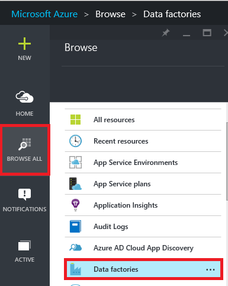

	You should see all the data factories in the **Data factories** blade. 
4. In the Data factories blade, select the data factory you are interested in and you should see the home page (**Data factory** blade) for the data factory.

	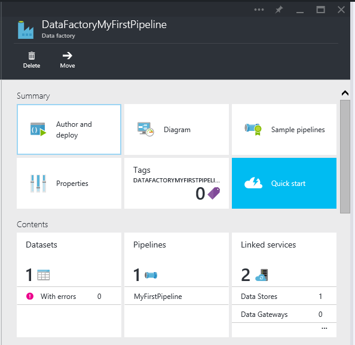

#### Diagram view of your data factory
The Diagram View of a data factory provides a single pane of glass to monitor and manage the data factory and its assets.

Click **Diagram** on the data factory home page above to see the diagram view of your data factory.

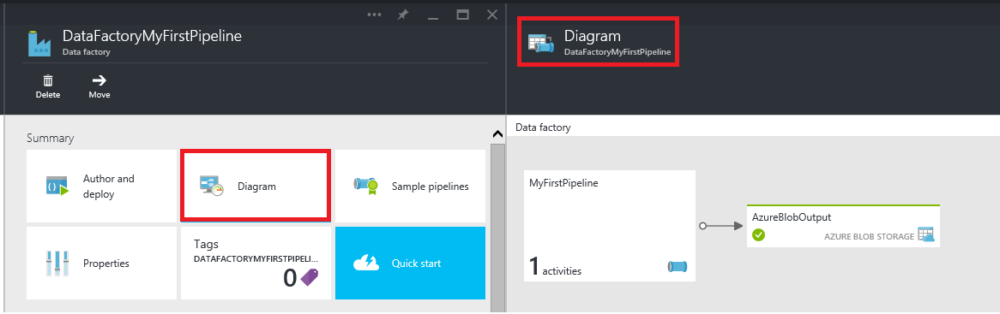

You can zoom in, zoom out, zoom to fit, zoom to 100%, lock the layout of the diagram, automaticaly position pipelines and tables, and show lineage (show upstream and downstream items of selected items).
 

### Activities inside a pipeline 
1. Right-click on the pipeline and click **Open pipeline** to see all activities in the pipeline along with input and output datasets for the activities. This is useful when your pipeline comprises of more than 1 Activity and you want to understand the operational lineage of a single pipeline.

	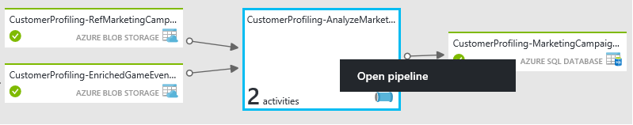	 
2. In the following example, you see two activities in the pipeline with their inputs and outputs. The activity titled **JoinData** of type HDInsight Hive Activity and **EgressDataAzure** of type Copy Activity are in this sample pipeline. 
	
	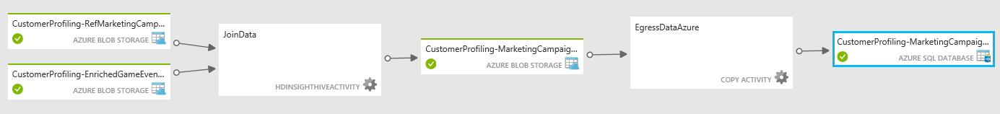 
3. You can navigate back to Data Factory home page by clicking Data factory link in the breadcrumb in the top-left corner.

	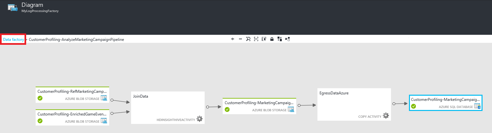

### View state of each activity inside a pipeline
You can view the current state of an activity by viewing the status of any of the datasets produced by the activity. 

For example: in the following example, the **BlobPartitionHiveActivity** ran successfully and produced a dataset named **PartitionedProductsUsageTable** which is in **Ready** state.

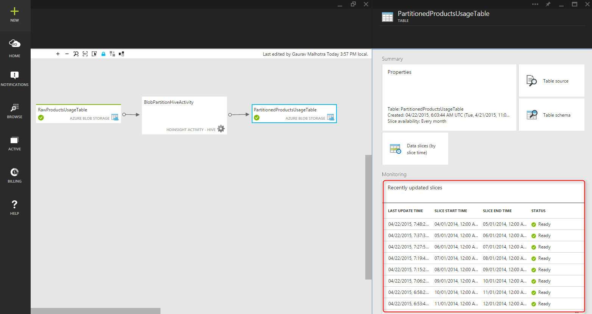

Double clicking the **PartitionedProductsUsageTable** in the diagram view will showcase all the slices produced by different activity runs inside a pipeline. You can see that the **BlobPartitionHiveActivity** ran successfully every month for last 8 months and produced the slices in **Ready** state.

The dataset slices in data factory can have one of the following status:

<table>
<tr>
	<th align="left">State</th><th align="left">Substate</th><th align="left">Description</th>
</tr>
<tr>
	<td rowspan="8">Waiting</td><td>ScheduleTime</td><td>The time has not come for the slice to run.</td>
</tr>
<tr>
<td>DatasetDependencies</td><td>The upstream dependencies are not ready.</td>
</tr>
<tr>
<td>ComputeResources</td><td>The compute resources are not available.</td>
</tr>
<tr>
<td>ConcurrencyLimit</td> <td>All the activity instances are busy running other slices.</td>
</tr>
<tr>
<td>ActivityResume</td><td>Activity is paused and cannot run the slices until it is resumed.</td>
</tr>
<tr>
<td>Retry</td><td>Activity execution will be retried.</td>
</tr>
<tr>
<td>Validation</td><td>Validation has not started yet.</td>
</tr>
<tr>
<td>ValidationRetry</td><td>Waiting for the validation to be retried.</td>
</tr>
<tr>
<tr
<td rowspan="2">InProgress</td><td>Validating</td><td>Validation in progress.</td>
</tr>
<td></td>
<td>The slice is being processed.</td>
</tr>
<tr>
<td rowspan="4">Failed</td><td>TimedOut</td><td>Execution took longer than that is allowed by the activity.</td>
</tr>
<tr>
<td>Canceled</td><td>Canceled by user action.</td>
</tr>
<tr>
<td>Validation</td><td>Validation has failed.</td>
</tr>
<tr>
<td></td><td>Failed to generate and/or validate the slice.</td>
</tr>
<td>Ready</td><td></td><td>The slice is ready for consumption.</td>
</tr>
<tr>
<td>Skipped</td><td></td><td>The slice is not processed.</td>
</tr>
<tr>
<td>None</td><td></td><td>A slice that used to exist with a different status, but has been reset.</td>
</tr>
</table>

You can view the details about a slice by clicking a slice entry in the **Recently Updated Slices** blade.

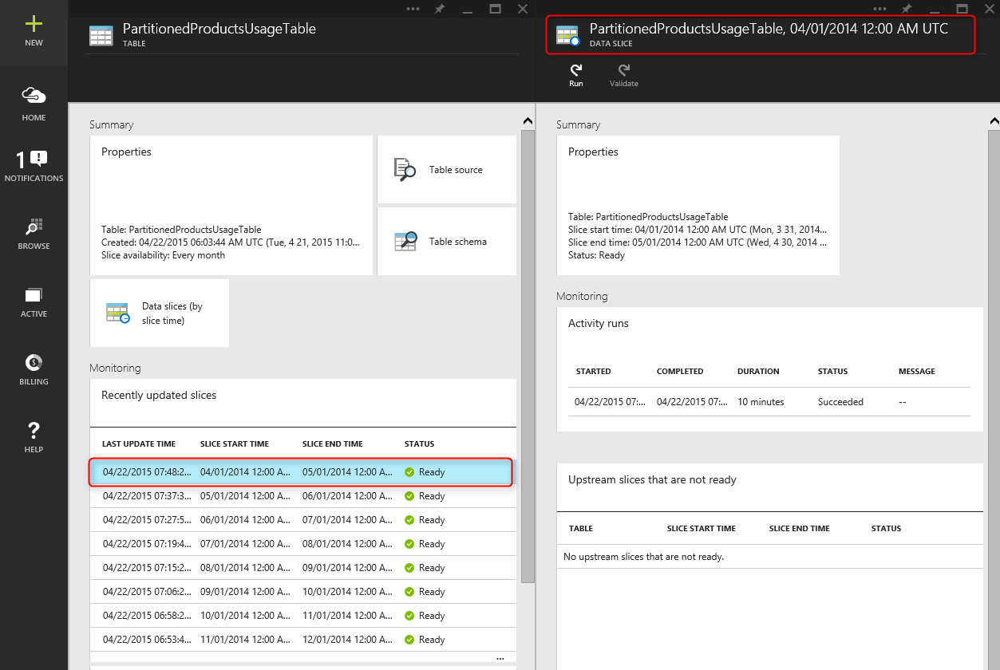
 
If the slice has been executed multiple times, you will see multiple rows in the **Activity runs** list.

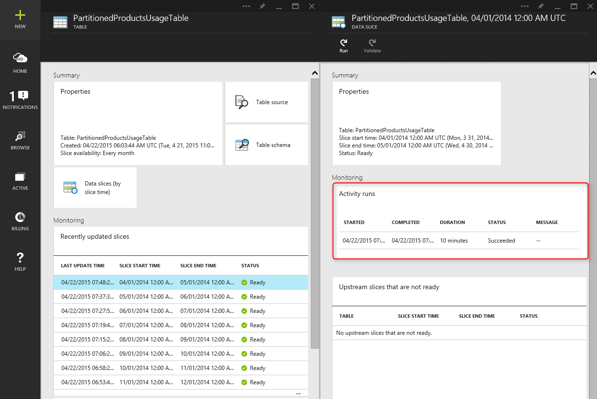

You can view details about an activity run by clicking the run entry in the **Activity runs** list. This will showcase all the log files along with an error message if any. This is very useful to view and debug logs without having to leave your data factory.

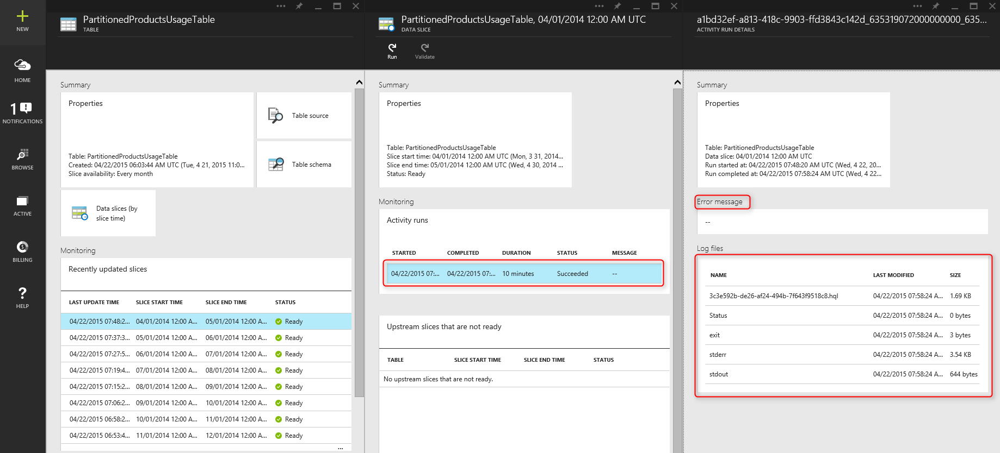

If the slice is not in the **Ready** state, you can see the upstream slices that are not ready and are blocking the current slice from executing in the **Upstream slices that are not ready** list. This is very useful when your slice is in **Waiting** state and you want to understand the upstream dependencies on which the slice is waiting.

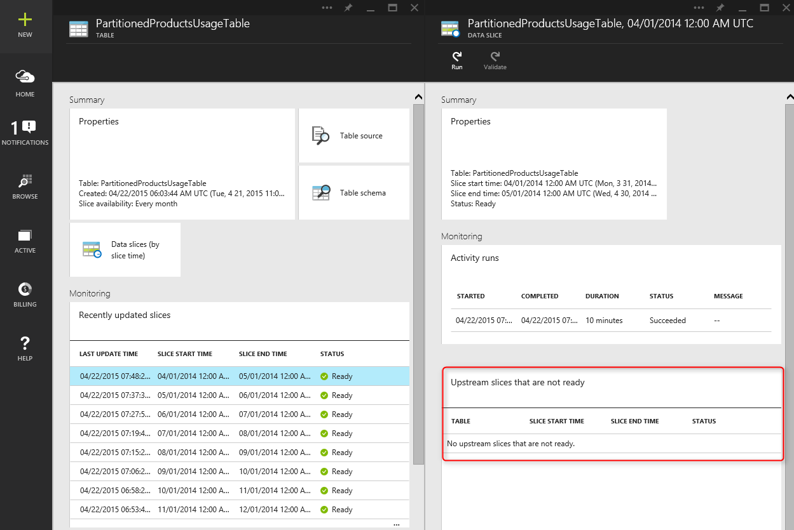

### Dataset State Diagram
Once you deploy a data factory and the pipelines have a valid active period, the dataset slices transition from one state to another. Currently the slice status follows the following state diagram:

The dataset state transition flow in data factory involves the following:
Waiting-> In-Progress/In-Progress (Validating) -> Ready/Failed

The slices start in a **Waiting** state for pre-conditions to be met before executing. Followed by this, the activity starts executing and the slice goes in **In-Progress** state. The activity execution could be successful or fail and based on that the slice will go either in **Ready**’ or **Failed** state. 

The user can reset the slice to go back from **Ready** or **Failed** state to **Waiting** state. The user can also mark the slice state to **Skip** which will prevent the activity from executing and not process the slice.

## Manage pipelines
You can manage your pipelines using Azure PowerShell. For example, you can pause and resume pipelines by running Azure PowerShell cmdlets. 

### Pause and resume pipelines
You can pause/suspend pipelines using the **Suspend-AzureRmDataFactoryPipeline** Powershell cmdlet. This is useful when you have figured out an issue with your data and don’t want to run your pipelines to process data any further until the issue is fixed.

For example: in the below screen shot, an issue has been identified with the **PartitionProductsUsagePipeline** in **productrecgamalbox1dev** data factory and we want to suspend the pipeline.

Run the following PowerShell command to suspend the **PartitionProductsUsagePipeline**.

	Suspend-AzureRmDataFactoryPipeline [-ResourceGroupName] <String> [-DataFactoryName] <String> [-Name] <String>

For example:

	Suspend-AzureRmDataFactoryPipeline -ResourceGroupName ADF -DataFactoryName productrecgamalbox1dev -Name PartitionProductsUsagePipeline 

Once the issue has been fixed with the **PartitionProductsUsagePipeline**, the suspended pipeline can be resumed by running the following PowerShell command.

	Resume-AzureRmDataFactoryPipeline [-ResourceGroupName] <String> [-DataFactoryName] <String> [-Name] <String>

For example:

	Resume-AzureRmDataFactoryPipeline -ResourceGroupName ADF -DataFactoryName productrecgamalbox1dev -Name PartitionProductsUsagePipeline 

## Debug pipelines
Azure Data Factory provides rich capabilities via Azure Portal and Azure PowerShell to debug and troubleshoot pipelines.

### Find errors in a pipeline
If the activity run fails in a pipeline, the dataset produced by the pipeline is in an error state due to the failure. You can debug and troubleshoot errors in Azure Data Factory using the following mechanisms.

#### Use Azure Portal to debug an error:

1.	Click **With errors** on **Datasets** tile on the data factory home page.
	
	
2.	In the **Datasets with errors** blade, click the table that you are interested in.

	
3.	In the **TABLE** blade, click on the problem slice with **STATUS** set to **Failed**.

	
4.	In the **DATA SLICE** blade, click the activity run that failed.
	
	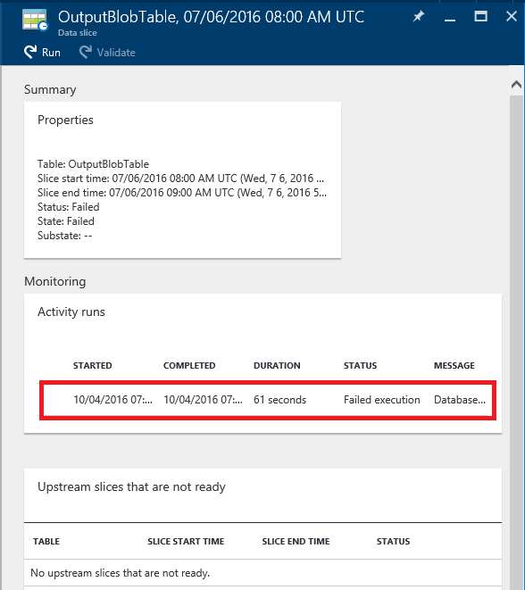
5.	In the **ACTIVITY RUN DETAILS** blade, you can download the files associated with the HDInsight processing. Click Download for Status/stderr to download the error log file that contains details about the error.

		 

#### Use the PowerShell to debug an error
1.	Launch **Azure PowerShell**.
3.	Run **Get-AzureRmDataFactorySlice** command to see the slices and their statuses. You should see a slice with the status: **Failed**.

		Get-AzureRmDataFactorySlice [-ResourceGroupName] <String> [-DataFactoryName] <String> [-TableName] <String> [-StartDateTime] <DateTime> [[-EndDateTime] <DateTime> ] [-Profile <AzureProfile> ] [ <CommonParameters>]
	
	For example:

		Get-AzureRmDataFactorySlice -ResourceGroupName ADF -DataFactoryName LogProcessingFactory -TableName EnrichedGameEventsTable -StartDateTime 2014-05-04 20:00:00

	Replace **StartDateTime** with the StartDateTime value you specified for the Set-AzureRmDataFactoryPipelineActivePeriod.
4. Now, run the **Get-AzureRmDataFactoryRun** cmdlet to get details about activity run for the slice.

		Get-AzureRmDataFactoryRun [-ResourceGroupName] <String> [-
		DataFactoryName] <String> [-TableName] <String> [-StartDateTime] 
		<DateTime> [-Profile <AzureProfile> ] [ <CommonParameters>]
	
	For example:

		Get-AzureRmDataFactoryRun -ResourceGroupName ADF -DataFactoryName LogProcessingFactory -TableName EnrichedGameEventsTable -StartDateTime "5/5/2014 12:00:00 AM"

	The value of StartDateTime is the start time for the error/problem slice you noted from the previous step. The date-time should be enclosed in double quotes.
5. 	You should see the output with details about the error (similar to the following):

		Id                  	: 841b77c9-d56c-48d1-99a3-8c16c3e77d39
		ResourceGroupName   	: ADF
		DataFactoryName     	: LogProcessingFactory3
		TableName           	: EnrichedGameEventsTable
		ProcessingStartTime 	: 10/10/2014 3:04:52 AM
		ProcessingEndTime   	: 10/10/2014 3:06:49 AM
		PercentComplete     	: 0
		DataSliceStart      	: 5/5/2014 12:00:00 AM
		DataSliceEnd        	: 5/6/2014 12:00:00 AM
		Status              	: FailedExecution
		Timestamp           	: 10/10/2014 3:04:52 AM
		RetryAttempt        	: 0
		Properties          	: {}
		ErrorMessage        	: Pig script failed with exit code '5'. See wasb://		adfjobs@spestore.blob.core.windows.net/PigQuery
		                        		Jobs/841b77c9-d56c-48d1-99a3-
					8c16c3e77d39/10_10_2014_03_04_53_277/Status/stderr' for
					more details.
		ActivityName        	: PigEnrichLogs
		PipelineName        	: EnrichGameLogsPipeline
		Type                	:
	
	
6. 	You can run **Save-AzureRmDataFactoryLog** cmdlet with Id value you see from the above output and download the log files using the **-DownloadLogsoption** for the cmdlet.

	Save-AzureRmDataFactoryLog -ResourceGroupName "ADF" -DataFactoryName "LogProcessingFactory" -Id "841b77c9-d56c-48d1-99a3-8c16c3e77d39" -DownloadLogs -Output "C:\Test"

## Re-run failures in a pipeline

### Using Azure Portal

Once you troubleshoot and debug failures in a pipeline, you can re-run failures by navigating to the error slice and clicking the **Run** button on the command bar.

In case the slice has failed validation due to a policy failure (for ex: data not available), you can fix the failure and validate again by clicking the **Validate** button on the command bar.
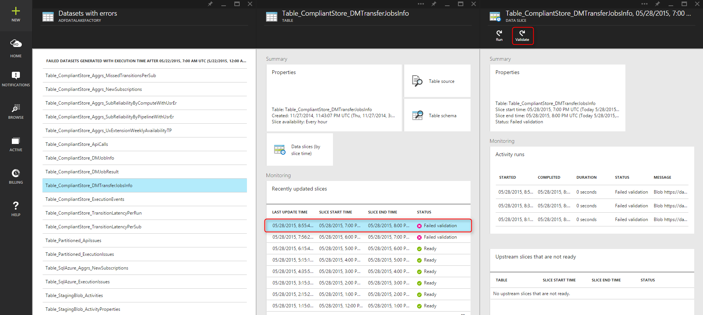

### Using Azure PowerShell

You can re-run failures by using the Set-AzureRmDataFactorySliceStatus cmdlet. See [Set-AzureRmDataFactorySliceStatus](https://msdn.microsoft.com/library/mt603522.aspx) topic for syntax and other details about the cmdlet. 

**Example:**
The following example sets the status of all slices for the table 'DAWikiAggregatedData' to 'Waiting' in the Azure data factory 'WikiADF'.

**Note:** The UpdateType is set to UpstreamInPipeline, which means that status of each slice for the table and all the dependent (upstream) tables which are used as input tables for activities in the pipeline is set to "Waiting". Other possible value for this parameter is "Individual".

	Set-AzureRmDataFactorySliceStatus -ResourceGroupName ADF -DataFactoryName WikiADF -TableName DAWikiAggregatedData -Status Waiting -UpdateType UpstreamInPipeline -StartDateTime 2014-05-21T16:00:00 -EndDateTime 2014-05-21T20:00:00

## Create alerts
Azure logs user events when an Azure resource (e.g. data factory) is created, updated or deleted. You can create alerts on these events. Data Factory allows you to capture various metrics and create alerts on metrics. We recommend that you use events for real time monitoring and metrics for historical purposes. 

### Alerts on events
Azure events provide useful insights into what is happening in your Azure resources. Azure logs user events when an Azure resource (e.g. data factory) is created, updated or deleted. When using the Azure Data Factory, events are generated when:

- Azure Data Factory is created/updated/deleted.
- Data processing (called as Runs) has started/completed.
- When an on-demand HDInsight cluster is created and removed.

You can create alerts on these user events and configure them to send email notifications to the administrator and co-administrators of the subscription. In addition, you can specify additional email addresses of users who need to receive email notifications when the conditions are met. This is very useful when you want to get notified on failures and don’t want to continuously monitor your data factory.

> [AZURE.NOTE] The portal does not show alerts on events at this time. Please use the [Monitoring and Management App](data-factory-monitor-manage-app.md) to see all alerts.

#### Specifying an alert definition:
To specify an alert definition, you create a JSON file describing the operations that you want to be alerted on. In the example below, the alert will send an email notification for the RunFinished operation. To be specific, an email notification is sent when a run in the data factory has completed and the run has failed (Status = FailedExecution).

	{
	    "contentVersion": "1.0.0.0",
	     "$schema": "http://schema.management.azure.com/schemas/2014-04-01-preview/deploymentTemplate.json#",
	    "parameters": {},
	    "resources": 
	    [
	        {
	            "name": "ADFAlertsSlice",
	            "type": "microsoft.insights/alertrules",
	            "apiVersion": "2014-04-01",
	            "location": "East US",
	            "properties": 
	            {
	                "name": "ADFAlertsSlice",
	                "description": "One or more of the data slices for the Azure Data Factory has failed processing.",
	                "isEnabled": true,
	                "condition": 
	                {
	                    "odata.type": "Microsoft.Azure.Management.Insights.Models.ManagementEventRuleCondition",
	                    "dataSource": 
	                    {
	                        "odata.type": "Microsoft.Azure.Management.Insights.Models.RuleManagementEventDataSource",
	                        "operationName": "RunFinished",
	                        "status": "Failed",
	                        "subStatus": "FailedExecution"   
	                    }
	                },
	                "action": 
	                {
	                    "odata.type": "Microsoft.Azure.Management.Insights.Models.RuleEmailAction",
	                    "customEmails": [ "<your alias>@contoso.com" ]
	                }
	            }
	        }
	    ]
	}

From the above JSON definition, **subStatus** can be removed if you don’t want to be alerted on a specific failure.

The above example sets up the alert for all data factories in your subscription. If you want the alert to be set up for a particular data factory, you can specify data factory **resourceUri** in the **dataSource** block like below:

	"resourceUri" : "/SUBSCRIPTIONS/<subscriptionId>/RESOURCEGROUPS/<resourceGroupName>/PROVIDERS/MICROSOFT.DATAFACTORY/DATAFACTORIES/<dataFactoryName>"

The following table provides the list of available operations and statuses (and sub-statuses).

Operation name | Status | Sub status
-------------- | ------ | ----------
RunStarted | Started | Starting
RunFinished | Failed / Succeeded | FailedResourceAllocation  Succeeded  FailedExecution  TimedOut  <Canceled  FailedValidation  Abandoned
OnDemandClusterCreateStarted | Started
OnDemandClusterCreateSuccessful | Succeeded
OnDemandClusterDeleted | Succeeded

See [Create Alert Rule](https://msdn.microsoft.com/library/azure/dn510366.aspx) for details about JSON elements used in the above example. 

#### Deploying the Alert 
To deploy the alert, use the Azure PowerShell cmdlet: **New-AzureRmResourceGroupDeployment**, as shown in the following example:

	New-AzureRmResourceGroupDeployment -ResourceGroupName adf -TemplateFile .\ADFAlertFailedSlice.json  

Once the resource group deployment has completed successfully, you will see the following messages:

	VERBOSE: 7:00:48 PM - Template is valid.
	WARNING: 7:00:48 PM - The StorageAccountName parameter is no longer used and will be removed in a future release.
	Please update scripts to remove this parameter.
	VERBOSE: 7:00:49 PM - Create template deployment 'ADFAlertFailedSlice'.
	VERBOSE: 7:00:57 PM - Resource microsoft.insights/alertrules 'ADFAlertsSlice' provisioning status is succeeded
	
	DeploymentName    : ADFAlertFailedSlice
	ResourceGroupName : adf
	ProvisioningState : Succeeded
	Timestamp         : 10/11/2014 2:01:00 AM
	Mode              : Incremental
	TemplateLink      :
	Parameters        :
	Outputs           :

> [AZURE.NOTE] You can use the [Create Alert Rule](https://msdn.microsoft.com/library/azure/dn510366.aspx) REST API to create an alert rule. The JSON payload is similar to the JSON example given above.  

#### Retrieving the list of Azure Resource Group Deployments
To retrieve the list of deployed Azure Resource Group deployments, use the cmdlet: **Get-AzureRmResourceGroupDeployment**, as shown in the following example:

	Get-AzureRmResourceGroupDeployment -ResourceGroupName adf
	
	DeploymentName    : ADFAlertFailedSlice
	ResourceGroupName : adf
	ProvisioningState : Succeeded
	Timestamp         : 10/11/2014 2:01:00 AM
	Mode              : Incremental
	TemplateLink      :
	Parameters        :
	Outputs           :

#### Troubleshooting User Events

- You can see all the events generated after clicking on the **Operations** tile, and alerts can be setup on any of these operations visible on the **Events** blade:

	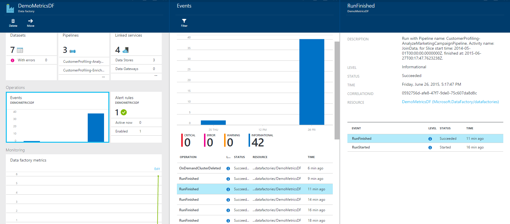

- See [Azure Insight Cmdlets](https://msdn.microsoft.com/library/mt282452.aspx) article for PowerShell cmdlets that you can use to add/get/remove alerts. Here are a few examples of using the **Get-AlertRule** cmdlet: 

		PS C:\> get-alertrule -res $resourceGroup -n ADFAlertsSlice -det
			
				Properties :
		        Action      : Microsoft.Azure.Management.Insights.Models.RuleEmailAction
		        Condition   :
				DataSource :
				EventName             :
				Category              :
				Level                 :
				OperationName         : RunFinished
				ResourceGroupName     :
				ResourceProviderName  :
				ResourceId            :
				Status                : Failed
				SubStatus             : FailedExecution
				Claims                : Microsoft.Azure.Management.Insights.Models.RuleManagementEventClaimsDataSource
		        Condition  	:
				Description : One or more of the data slices for the Azure Data Factory has failed processing.
				Status      : Enabled
				Name:       : ADFAlertsSlice
				Tags       :
				$type          : Microsoft.WindowsAzure.Management.Common.Storage.CasePreservedDictionary, Microsoft.WindowsAzure.Management.Common.Storage
				Id: /subscriptions/<subscription ID>/resourceGroups/<resource group name>/providers/microsoft.insights/alertrules/ADFAlertsSlice
				Location   : West US
				Name       : ADFAlertsSlice
		
		PS C:\> Get-AlertRule -res $resourceGroup
	
				Properties : Microsoft.Azure.Management.Insights.Models.Rule
				Tags       : {[$type, Microsoft.WindowsAzure.Management.Common.Storage.CasePreservedDictionary, Microsoft.WindowsAzure.Management.Common.Storage]}
				Id         : /subscriptions/<subscription id>/resourceGroups/<resource group name>/providers/microsoft.insights/alertrules/FailedExecutionRunsWest0
				Location   : West US
				Name       : FailedExecutionRunsWest0
		
				Properties : Microsoft.Azure.Management.Insights.Models.Rule
				Tags       : {[$type, Microsoft.WindowsAzure.Management.Common.Storage.CasePreservedDictionary, Microsoft.WindowsAzure.Management.Common.Storage]}
				Id         : /subscriptions/<subscription id>/resourceGroups/<resource group name>/providers/microsoft.insights/alertrules/FailedExecutionRunsWest3
				Location   : West US
				Name       : FailedExecutionRunsWest3
	
		PS C:\> Get-AlertRule -res $resourceGroup -Name FailedExecutionRunsWest0
		
				Properties : Microsoft.Azure.Management.Insights.Models.Rule
				Tags       : {[$type, Microsoft.WindowsAzure.Management.Common.Storage.CasePreservedDictionary, Microsoft.WindowsAzure.Management.Common.Storage]}
				Id         : /subscriptions/<subscription id>/resourceGroups/<resource group name>/providers/microsoft.insights/alertrules/FailedExecutionRunsWest0
				Location   : West US
				Name       : FailedExecutionRunsWest0

	Run the following get-help commands to see details and examples for the Get-AlertRule cmdlet. 

		get-help Get-AlertRule -detailed 
		get-help Get-AlertRule -examples

- If you see the alert generation events on the portal blade but you don't receive email notifications, check whether e-mail address specified is set to receive emails from external senders. The alert e-mails may have been blocked by your e-mail settings.

### Alerts on Metrics
Data Factory allows you to capture various metrics and create alerts on metrics. You can monitor and create alerts on the following metrics for the slices in your data factory.
 
- Failed Runs
- Successful Runs

These metrics are very useful and allow users to get an overview of overall failed and successful runs in their data factory. Metrics are emitted every time there is a slice run. On top of the hour, these metrics are aggregated and pushed to your storage account. Therefore, to enable metrics, you will need to setup a storage account.

#### Enabling Metrics:
To enable metrics, please click on the following from Data Factory blade:

**Monitoring** -> **Metric** -> **Diagnostic settings** -> **Diagnostic**

On the **Diagnostic** blade, click **On** and select the storage account and save.

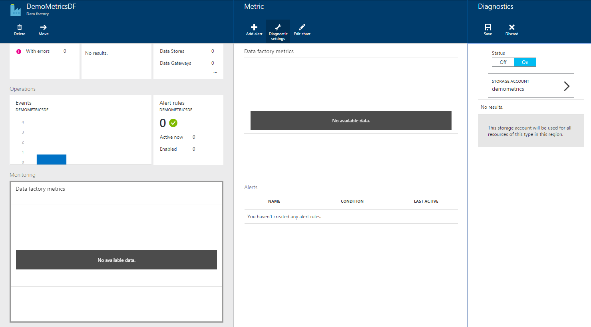

Once saved, it may to take up to one hour for the metrics to be visible on the monitoring blade, because metrics aggregation happens hourly.

### Setting up alert on Metrics:

To set up alerting on Metrics, click on the following from Data factory blade:
**Monitoring** -> **Metric** -> **Add alert** -> **Add an alert rule**.

Fill in the details for alert rule, specify emails and click **OK**.

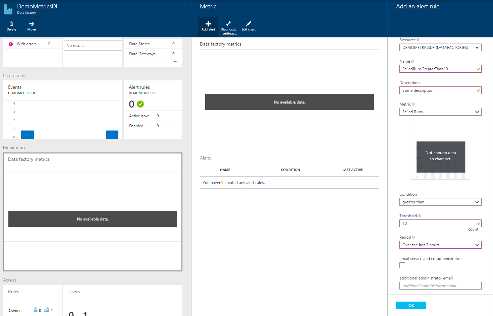

Once done, you should see a new alert rule enabled on Alert rules tile as following:

Congratulations! You have set up your first alert on Metrics. Now you should get notifications every time alert rule matches in the given time window.

### Alert notifications:
Once the setup rule matches the condition, you should get an alert activated email. Once the issue is resolved and the alert condition doesn’t match any more, you will get alert resolved email.

This behavior is different than events where a notification will be sent on each and every failure for which alert rule qualify.

### Deploying alerts using PowerShell
You can deploy alerts for metrics in the same way as you do for events. 

**Alert definition:**

	{
	    "contentVersion" : "1.0.0.0",
	    "$schema" : "http://schema.management.azure.com/schemas/2014-04-01-preview/deploymentTemplate.json#",
	    "parameters" : {},
	    "resources" : [
		{
	            "name" : "FailedRunsGreaterThan5",
	            "type" : "microsoft.insights/alertrules",
	            "apiVersion" : "2014-04-01",
	            "location" : "East US",
	            "properties" : {
	                "name" : "FailedRunsGreaterThan5",
	                "description" : "Failed Runs greater than 5",
	                "isEnabled" : true,
	                "condition" : {
	                    "$type" : "Microsoft.WindowsAzure.Management.Monitoring.Alerts.Models.ThresholdRuleCondition, Microsoft.WindowsAzure.Management.Mon.Client",
	                    "odata.type" : "Microsoft.Azure.Management.Insights.Models.ThresholdRuleCondition",
	                    "dataSource" : {
	                        "$type" : "Microsoft.WindowsAzure.Management.Monitoring.Alerts.Models.RuleMetricDataSource, Microsoft.WindowsAzure.Management.Mon.Client",
	                        "odata.type" : "Microsoft.Azure.Management.Insights.Models.RuleMetricDataSource",
	                        "resourceUri" : "/SUBSCRIPTIONS/<subscriptionId>/RESOURCEGROUPS/<resourceGroupName
	>/PROVIDERS/MICROSOFT.DATAFACTORY/DATAFACTORIES/<dataFactoryName>",
	                        "metricName" : "FailedRuns"
	                    },
	                    "threshold" : 5.0,
	                    "windowSize" : "PT3H",
	                    "timeAggregation" : "Total"
	                },
	                "action" : {
	                    "$type" : "Microsoft.WindowsAzure.Management.Monitoring.Alerts.Models.RuleEmailAction, Microsoft.WindowsAzure.Management.Mon.Client",
	                    "odata.type" : "Microsoft.Azure.Management.Insights.Models.RuleEmailAction",
	                    "customEmails" : ["abhinav.gpt@live.com"]
	                }
	            }
	        }
	    ]
	}
 
Replace subscriptionId, resourceGroupName, and dataFactoryName in the above sample with appropriate values.

*metricName* as of now supports 2 values:
- FailedRuns
- SuccessfulRuns

**Deploying the alert:**

To deploy the alert, use the Azure PowerShell cmdlet: **New-AzureRmResourceGroupDeployment**, as shown in the following example:

	New-AzureRmResourceGroupDeployment -ResourceGroupName adf -TemplateFile .\FailedRunsGreaterThan5.json

You should see following message after successful deployment:

	VERBOSE: 12:52:47 PM - Template is valid.
	VERBOSE: 12:52:48 PM - Create template deployment 'FailedRunsGreaterThan5'.
	VERBOSE: 12:52:55 PM - Resource microsoft.insights/alertrules 'FailedRunsGreaterThan5' provisioning status is succeeded
	
	
	DeploymentName    : FailedRunsGreaterThan5
	ResourceGroupName : adf
	ProvisioningState : Succeeded
	Timestamp         : 7/27/2015 7:52:56 PM
	Mode              : Incremental
	TemplateLink      :
	Parameters        :
	Outputs           

You can also the **Add-AlertRule** cmdlet to deploy an alert rule. See [Add-AlertRule](https://msdn.microsoft.com/library/mt282468.aspx) topic for details and examples.  

## Move data factory to a different resource group or subscription
You can move a data factory to a different resource group or a different subscription by using the **Move** command bar button on the home page of your data factory. 

You can also move any related resources (such as alerts associated with the data factory) along with the data factory.

